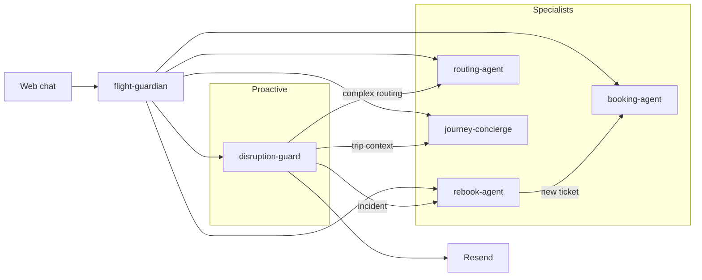

# Flights & Aviation — Agent Architecture

The winning story is not “another chatbot that books flights” — it is **proactive agents that watch trips, act on disruptions, and recover journeys without the traveler doing the work**.

**Flight Guardian** is the traveler-facing conductor. It has no Atlas search or booking tools. It classifies intent, calls one specialist, and summarizes the result.

---

## What Atlas provides (`packages/atlas`)

| Capability | APIs | Agent |
| --- | --- | --- |
| Search & compare | `search`, `smart-search`, `price-compare-search` | routing-agent, rebook-agent, booking-agent |
| Book end-to-end | `verify` → `create-order` → `confirm-order` → `payment` | booking-agent, rebook-agent |
| Post-booking ops | `query-order`, `order-list`, `refunds`, `void` | rebook-agent, disruption-guard |
| Disruption signals | `webhook.incidents` | disruption-guard |
| Trip context | `extract-pnr`, `email-query`, `query-order` | journey-concierge |
| Route data | `route-export` | routing-agent |

Each specialist is a focused **eve** app with only the tools it needs. Shared API access goes through `@atlas/atlas-client`. Flight Guardian does not call Atlas APIs.

`search.do` and `smartSearch.do` are the Atlas paths. `route-export` is `POST /route/export.do` with required `routeType` (`2` = Atlas routes). Atlas dates are `YYYYMMDD`; trip type is `"1"` / `"2"`. The client maps `OW`/`RT` and dashed dates before POST, and prefixes `ATLAS_API_URL` on every request.

---

## Agents

### 0. `apps/flight-guardian` — Conductor

Front door for the web chat. No Atlas tools. Remote subagents: the five specialists below.

**UI:** `useEveAgent({ agent: "flight-guardian" })` (assistant panel is still a placeholder).

---

### 1. `apps/disruption-guard` — Proactive trip watcher

Detects schedule changes and cancellations before the traveler checks the app.

**Tools:** `webhook-incidents`, `query-order`, `order-list`, `extract-pnr`

**Schedule:** Every 30 minutes (`schedules/disruption-monitor.ts`) — polls incidents and can call `rebook-agent` when the traveler should recover.

**Channels:** `eve` (web), `resend` (email alerts), `telegram` (optional interactive bot)

**Alert config:** `DISRUPTION_OPS_EMAIL`, `RESEND_API_KEY`, `RESEND_FROM_ADDRESS`

**Demo moment:** “Flight SQ123 delayed 3 hours — email alert — rebook-agent finds alternatives.”

---

### 2. `apps/rebook-agent` — Recovery specialist

When disruption-guard finds a problem, this agent finds and executes the best replacement.

**Tools:** search, `flight-verify`, full booking chain, `refunds` / `void-order`, `query-order`

**Skills:** `disruption-handling.md`, `refund-and-void-playbook.md`

**Safety:** `approval: always()` on create-order, confirm, payment, refunds, void

**Demo moment:** User says “rebook me on the earliest arrival” → agent compares options, confirms price increase, books, reports new PNR.

---

### 3. `apps/routing-agent` — Intelligent flight routing

Finds optimal **flight** routes when the obvious path breaks — connections, alternate airports, flexible dates. This is not the chat orchestrator.

**Tools:** `route-export`, `flight-search`, `smart-search`, `price-compare-search` (read-only)

Filter `route-export` by origin/destination. Do not dump the full city-pair catalog into context (token limit).

Ranks by cheapest, fastest, fewest connections, or same airline. Hands off to booking-agent / rebook-agent with a `routingIdentifier`.

**Demo moment:** “My LAX→NRT direct is canceled” → agent proposes LAX→ICN→NRT or LAX→SFO→NRT with tradeoffs.

---

### 4. `apps/booking-agent` — Clean booking executor

End-to-end booking only. No disruption logic — keeps the flow reliable.

**Tools:** Full search → verify → ancillaries → order → pay → track

Booking and disruption recovery have different safety rules; keeping them separate improves reliability.

---

### 5. `apps/journey-concierge` — Multi-modal journeys

Connects flights to the rest of the trip via Composio.

**Atlas:** `extract-pnr`, `email-query`, `query-order`

**Composio:** Google Calendar, Gmail, Google Maps (`lib/composio.ts`)

**Demo moment:** “Your flight lands 22:30 at Haneda; last train to Shinjuku is 23:42 — here’s the plan, and I moved your hotel late-check-in note.”

---

## How they work together

Hops use eve `defineRemoteAgent` (`agent/subagents/<name>.ts`). URLs are `${NEXT_PUBLIC_APP_URL}/eve/agents/<name>`. Local hops use empty outbound auth; `trustedForwarders` accept `local-dev` and `oidc`. On Vercel, outbound auth is `vercelOidc()`.

Specialists can also call each other. Flight Guardian is what the traveler talks to.



Lead the demo with **disruption-guard → rebook-agent**. That is the narrative judges remember. Chat turns still enter through **flight-guardian**.

---

## Monorepo structure

```
apps/
  web/                  # UI — mounts all agents via withEve
  flight-guardian/      # Conductor — remote hops only
  disruption-guard/     # Schedule + incident alerts
  rebook-agent/         # Recovery + refunds
  booking-agent/        # Clean booking flow
  routing-agent/        # Flight-route optimization (read-only)
  journey-concierge/    # Composio multi-modal

packages/
  atlas/                # @atlas/atlas-client — shared API client

.env                    # Root secrets (symlinked via bun run env:link)
.env.example            # Canonical template
```

`apps/web` serves agents at `/eve/agents/<name>/eve/v1/*` (`next.config.ts` `withEve({ agents })`).

Each specialist uses lazy `lib/atlas.ts` and `lib/auth.ts` so `eve build` does not require live secrets. Flight Guardian has `lib/auth.ts` and `lib/remote-agent.ts` only.

Local web is `next dev --port 3001`. Set `NEXT_PUBLIC_APP_URL=http://localhost:3001`.

---

## Environment

```bash
cp .env.example .env
# fill secrets once at repo root
bun run env:link
```

**Shared:** `AI_GATEWAY_API_KEY`, `ATLAS_*`, `DATABASE_URL`, `BETTER_AUTH_*`, Google OAuth, S3, `NEXT_PUBLIC_APP_URL`

**disruption-guard alerts:**

- `DISRUPTION_OPS_EMAIL`
- `RESEND_API_KEY`
- `RESEND_FROM_ADDRESS`

**journey-concierge:**

- `COMPOSIO_API_KEY` (+ user connects integrations at `/integrations`)

**Build without secrets:** `SKIP_ENV_VALIDATION=1`

---

## Demo script (3 min)

1. **0:00–0:30** — In Flight Guardian: book a flight (it calls `booking-agent`).
2. **0:30–1:00** — `disruption-guard` schedule runs (or `POST .../dev/schedules/disruption-monitor`); show webhook incident.
3. **1:00–2:00** — Email alert: “SQ123 delayed — 2 alternatives found.”
4. **2:00–2:45** — In Flight Guardian: “rebook earliest”; it calls `rebook-agent` to verify, confirm price, book.
5. **2:45–3:00** — Optional calendar update via `journey-concierge`.

---

## Hackathon scoring alignment

| Criterion | How this architecture helps |
| --- | --- |
| **Innovation (30%)** | Proactive disruption → auto-recovery, not reactive search |
| **Feasibility (30%)** | Thin conductor + small specialists; shared `@atlas/atlas-client` |
| **Qoder (20%)** | Multiple eve agents, remote subagents, schedules, channels, Composio |
| **Demo (20%)** | One story: “Flight canceled → email alert → rebook → done” |
