# AI Agent System

<cite>
**Referenced Files in This Document**
- [agent.ts](file://apps/runtime/agent/agent.ts)
- [session.ts](file://apps/runtime/agent/session.ts)
- [instructions.md](file://apps/runtime/agent/instructions.md)
- [eve.ts](file://apps/runtime/agent/channels/eve.ts)
- [telegram.ts](file://apps/runtime/agent/channels/telegram.ts)
- [twilio.ts](file://apps/runtime/agent/channels/twilio.ts)
- [composio.ts](file://apps/runtime/agent/tools/composio.ts)
- [auth.ts](file://apps/runtime/agent/lib/auth.ts)
- [instrumentation.ts](file://apps/runtime/agent/instrumentation.ts)
- [SKILL.md (Atlas Flight Booking)](file://.agents/skills/atlas-flight-booking/SKILL.md)
- [booking-workflow.md](file://.agents/skills/atlas-flight-booking/references/booking-workflow.md)
- [cli-contract.md](file://.agents/skills/atlas-flight-booking/references/cli-contract.md)
- [error-handling.md](file://.agents/skills/atlas-flight-booking/references/error-handling.md)
- [passenger-input.md](file://.agents/skills/atlas-flight-booking/references/passenger-input.md)
- [package.json (runtime)](file://apps/runtime/package.json)
- [package.json (root)](file://package.json)
- [AGENTS.md (runtime)](file://apps/runtime/AGENTS.md)
- [atlas-assistant.tsx](file://apps/web/src/components/atlas-assistant.tsx)
- [agent-button.tsx](file://apps/web/src/components/agent-button.tsx)
- [use-assistant-panel.tsx](file://apps/web/src/hooks/use-assistant-panel.tsx)
- [layout.tsx (protected)](file://apps/web/src/app/(protected)/layout.tsx)
- [activity/page.tsx](file://apps/web/src/app/(protected)/activity/page.tsx)
- [agent-activity/index.tsx](file://packages/ui/src/components/agents/agent-activity/index.tsx)
- [streaming-response.tsx](file://packages/ui/src/components/agents/streaming-response.tsx)
- [message.tsx](file://packages/ui/src/components/agents/message.tsx)
- [prompt-input.tsx](file://packages/ui/src/components/agents/prompt-input.tsx)
</cite>

## Update Summary

**Changes Made**

- Added comprehensive UI components section documenting the enhanced agent interaction interface
- Updated architecture overview to include new UI component layer for agent communication
- Added streaming response handling and activity tracking documentation
- Enhanced conversation management with real-time message display components
- Added new sections for UI integration patterns and component composition

## Table of Contents

1. Introduction
2. Project Structure
3. Core Components
4. Architecture Overview
5. Detailed Component Analysis
6. UI Component System
7. Dependency Analysis
8. Performance Considerations
9. Troubleshooting Guide
10. Conclusion
11. Appendices

## Introduction

This document explains the AI agent system built on the Eve framework with enhanced UI components for displaying agent interactions, activity tracking, streaming responses, and complex AI workflows. It covers the agent lifecycle, session management, message processing pipeline, channel system for web, Telegram, and SMS, tooling via Composio, and the skill system that organizes behaviors and knowledge domains. The system now includes comprehensive UI components providing rich interfaces for agent communication and status display, enabling real-time feedback and interactive agent experiences.

## Project Structure

The runtime agent lives under apps/runtime/agent with an enhanced UI layer under apps/web/src/components and reusable UI components under packages/ui/src/components/agents:

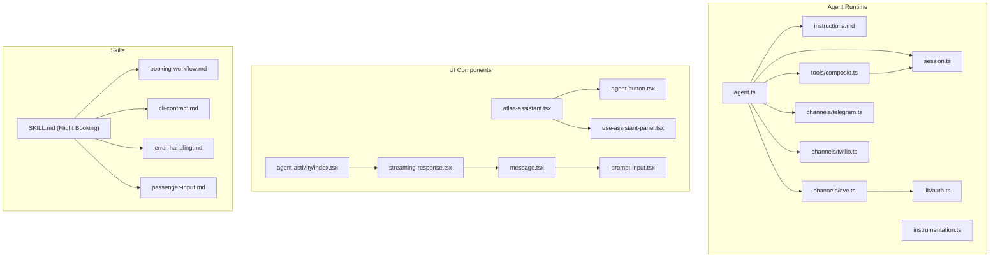

**Diagram sources**

- [agent.ts:1-8](file://apps/runtime/agent/agent.ts#L1-L8)
- [atlas-assistant.tsx:1-175](file://apps/web/src/components/atlas-assistant.tsx#L1-L175)
- [agent-activity/index.tsx:1-296](file://packages/ui/src/components/agents/agent-activity/index.tsx#L1-L296)
- [streaming-response.tsx:1-265](file://packages/ui/src/components/agents/streaming-response.tsx#L1-L265)

**Section sources**

- [agent.ts:1-8](file://apps/runtime/agent/agent.ts#L1-L8)
- [atlas-assistant.tsx:1-175](file://apps/web/src/components/atlas-assistant.tsx#L1-L175)
- [agent-activity/index.tsx:1-296](file://packages/ui/src/components/agents/agent-activity/index.tsx#L1-L296)

## Core Components

- Agent definition: Declares the AI model used by the agent with enhanced instrumentation
- Instructions: Defines agent identity and baseline behavior
- Sessions: Creates a Composio session with configured toolkits for authenticated users
- Tools: Wraps Composio sessions to expose capabilities to the agent
- Channels: Exposes the agent over web (Eve), Telegram, and SMS (Twilio)
- Authentication: Bridges Better Auth sessions into Eve's auth context
- Skills: Encapsulate domain knowledge and workflows (e.g., flight booking)
- **Enhanced UI Components**: Provide rich interfaces for agent communication, activity tracking, and streaming responses

Key responsibilities:

- Model selection and runtime initialization are centralized in the agent definition
- User identity flows from the web app through Better Auth into Eve channels and tools
- Toolkits are scoped per user session to ensure isolation and security
- Skills provide structured guidance for complex multi-step tasks like booking flights
- **UI components enable real-time interaction with streaming responses and activity monitoring**

**Section sources**

- [agent.ts:1-8](file://apps/runtime/agent/agent.ts#L1-L8)
- [instrumentation.ts:1-22](file://apps/runtime/agent/instrumentation.ts#L1-L22)
- [atlas-assistant.tsx:1-175](file://apps/web/src/components/atlas-assistant.tsx#L1-L175)
- [agent-activity/index.tsx:1-296](file://packages/ui/src/components/agents/agent-activity/index.tsx#L1-L296)

## Architecture Overview

The system composes Eve channels as entry points, authenticates requests, resolves user sessions, invokes tools that integrate with external services, and displays results through enhanced UI components. Skills guide the agent's reasoning and workflow execution while UI components provide real-time feedback and interaction capabilities.

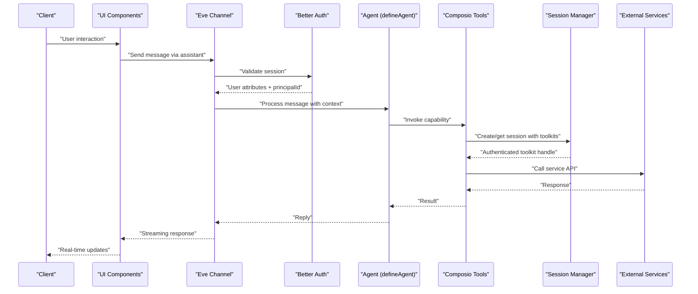

**Diagram sources**

- [atlas-assistant.tsx:122-175](file://apps/web/src/components/atlas-assistant.tsx#L122-L175)
- [eve.ts:1-10](file://apps/runtime/agent/channels/eve.ts#L1-L10)
- [agent-activity/index.tsx:117-296](file://packages/ui/src/components/agents/agent-activity/index.tsx#L117-L296)
- [streaming-response.tsx:94-265](file://packages/ui/src/components/agents/streaming-response.tsx#L94-L265)

## Detailed Component Analysis

### Agent Lifecycle and Model Configuration

- The agent is defined using the framework's agent factory and selects an AI model
- Instructions define identity and baseline behavior
- Enhanced instrumentation tags every model-call span with user and channel context for better tracing
- The runtime scripts support building, development, and starting the agent

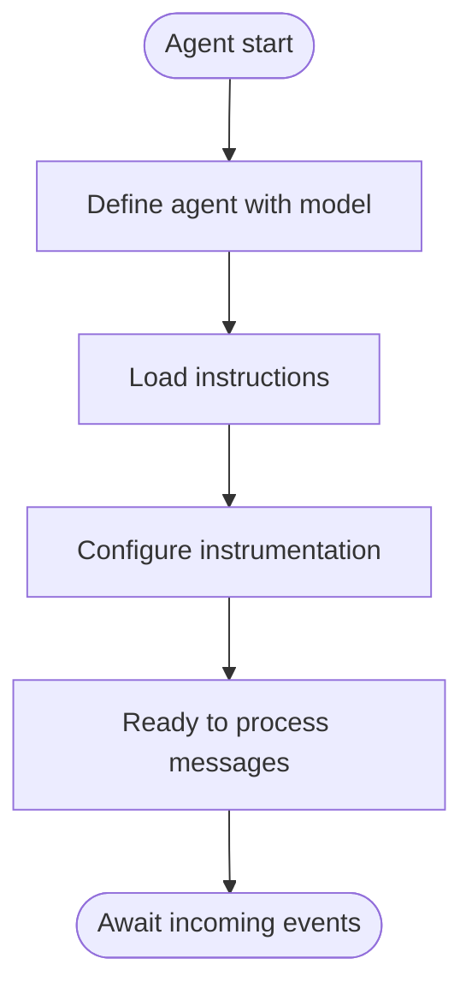

**Diagram sources**

- [agent.ts:1-8](file://apps/runtime/agent/agent.ts#L1-L8)
- [instrumentation.ts:3-22](file://apps/runtime/agent/instrumentation.ts#L3-L22)

**Section sources**

- [agent.ts:1-8](file://apps/runtime/agent/agent.ts#L1-L8)
- [instrumentation.ts:1-22](file://apps/runtime/agent/instrumentation.ts#L1-L22)
- [package.json (runtime):1-29](file://apps/runtime/package.json#L1-L29)

### Session Management and Tool Integration

- A Composio session is created per user with a predefined set of toolkits
- Tools resolve the current user from the session and return the appropriate session handle
- This ensures tool calls are executed with the correct user context and permissions

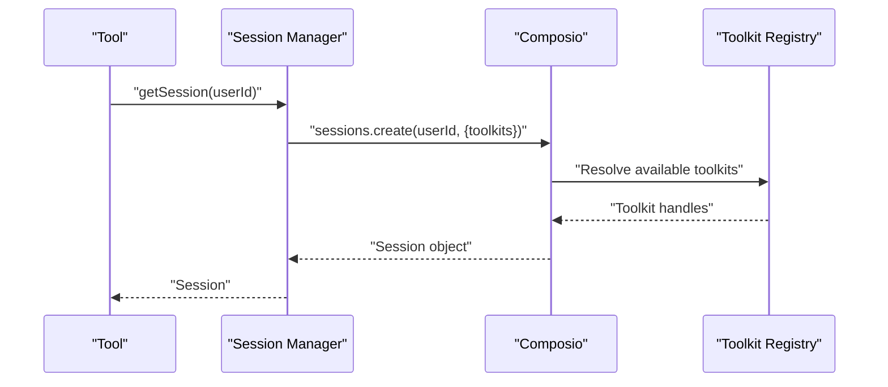

**Diagram sources**

- [session.ts:1-19](file://apps/runtime/agent/session.ts#L1-L19)
- [composio.ts:1-12](file://apps/runtime/agent/tools/composio.ts#L1-L12)

**Section sources**

- [session.ts:1-19](file://apps/runtime/agent/session.ts#L1-L19)
- [composio.ts:1-12](file://apps/runtime/agent/tools/composio.ts#L1-L12)

### Channel System: Web, Telegram, SMS

- Web channel integrates with Better Auth and Vercel OIDC for authentication and CORS
- Telegram channel uses a bot token from environment variables
- SMS channel uses Twilio with allowed senders and messaging configuration

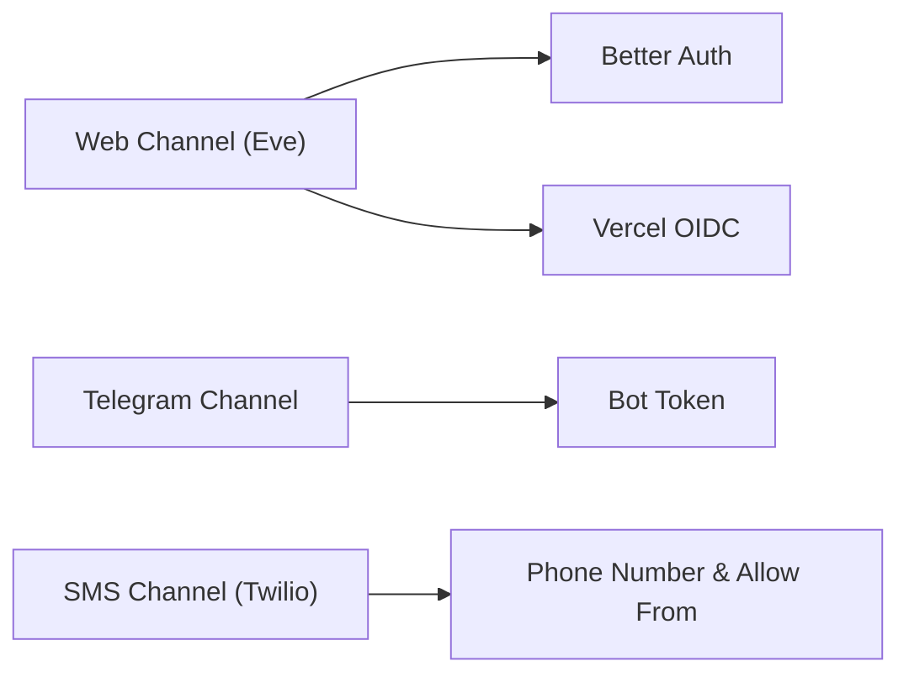

**Diagram sources**

- [eve.ts:1-10](file://apps/runtime/agent/channels/eve.ts#L1-L10)
- [telegram.ts:1-6](file://apps/runtime/agent/channels/telegram.ts#L1-L6)
- [twilio.ts:1-7](file://apps/runtime/agent/channels/twilio.ts#L1-L7)
- [auth.ts:1-26](file://apps/runtime/agent/lib/auth.ts#L1-L26)

**Section sources**

- [eve.ts:1-10](file://apps/runtime/agent/channels/eve.ts#L1-L10)
- [telegram.ts:1-6](file://apps/runtime/agent/channels/telegram.ts#L1-L6)
- [twilio.ts:1-7](file://apps/runtime/agent/channels/twilio.ts#L1-L7)
- [auth.ts:1-26](file://apps/runtime/agent/lib/auth.ts#L1-L26)

### Message Processing Pipeline

- Incoming messages enter via channels, where authentication is enforced
- The agent processes messages using its model and instructions
- Tools are invoked based on the task; results are returned through the same channel
- **Enhanced UI components provide real-time streaming responses and activity tracking**

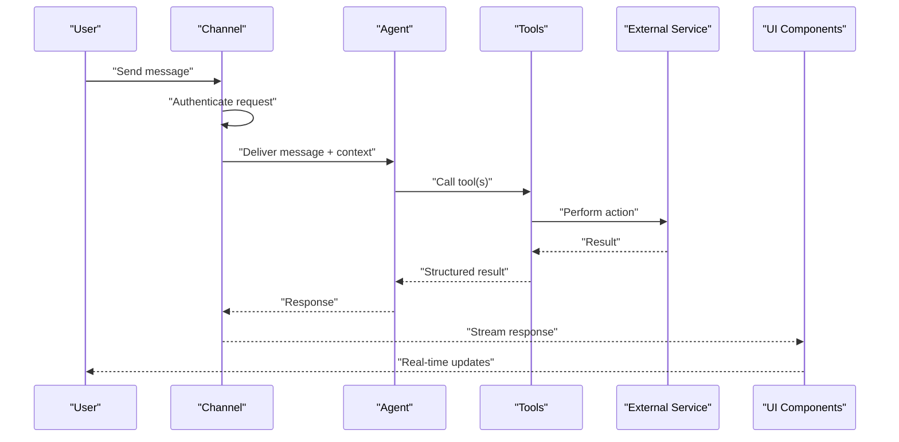

**Diagram sources**

- [eve.ts:1-10](file://apps/runtime/agent/channels/eve.ts#L1-L10)
- [agent-activity/index.tsx:117-296](file://packages/ui/src/components/agents/agent-activity/index.tsx#L117-L296)
- [streaming-response.tsx:94-265](file://packages/ui/src/components/agents/streaming-response.tsx#L94-L265)

**Section sources**

- [eve.ts:1-10](file://apps/runtime/agent/channels/eve.ts#L1-L10)
- [agent-activity/index.tsx:117-296](file://packages/ui/src/components/agents/agent-activity/index.tsx#L117-L296)
- [streaming-response.tsx:94-265](file://packages/ui/src/components/agents/streaming-response.tsx#L94-L265)

### Skill System: Atlas Flight Booking

- The skill defines capabilities, mandatory checkpoints, safety rules, and references for CLI usage and error handling
- Workflows include authorization, search, verification, optional services, order creation, payment, and ticketing
- Passenger input is collected safely and submitted once to minimize exposure of personal data

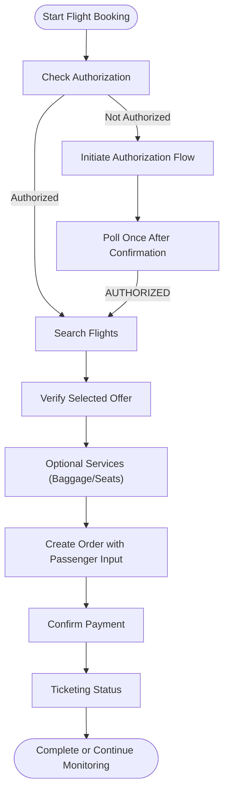

**Diagram sources**

- [SKILL.md (Atlas Flight Booking):1-71](file://.agents/skills/atlas-flight-booking/SKILL.md#L1-L71)
- [booking-workflow.md:1-63](file://.agents/skills/atlas-flight-booking/references/booking-workflow.md#L1-L63)
- [cli-contract.md:1-78](file://.agents/skills/atlas-flight-booking/references/cli-contract.md#L1-L78)
- [passenger-input.md:1-52](file://.agents/skills/atlas-flight-booking/references/passenger-input.md#L1-L52)

**Section sources**

- [SKILL.md (Atlas Flight Booking):1-71](file://.agents/skills/atlas-flight-booking/SKILL.md#L1-L71)
- [booking-workflow.md:1-63](file://.agents/skills/atlas-flight-booking/references/booking-workflow.md#L1-L63)
- [cli-contract.md:1-78](file://.agents/skills/atlas-flight-booking/references/cli-contract.md#L1-L78)
- [passenger-input.md:1-52](file://.agents/skills/atlas-flight-booking/references/passenger-input.md#L1-L52)

### Error Handling in AI Workflows

- Errors are handled by branching on stable codes rather than parsing free-form messages
- Authorization errors trigger login flows and bounded polling after user confirmation
- Search and verification errors manage retries conservatively and avoid side effects
- Order and payment errors prevent duplicate actions and rely on status queries when uncertain

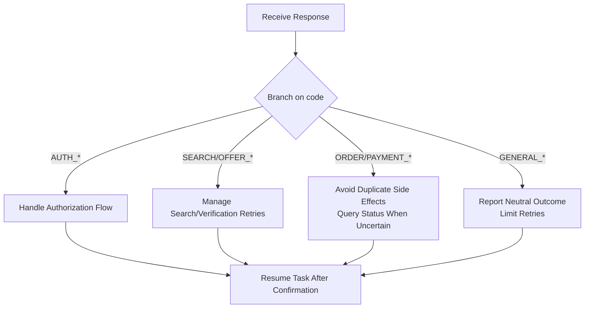

**Diagram sources**

- [error-handling.md:1-74](file://.agents/skills/atlas-flight-booking/references/error-handling.md#L1-L74)
- [cli-contract.md:1-78](file://.agents/skills/atlas-flight-booking/references/cli-contract.md#L1-L78)

**Section sources**

- [error-handling.md:1-74](file://.agents/skills/atlas-flight-booking/references/error-handling.md#L1-L74)
- [cli-contract.md:1-78](file://.agents/skills/atlas-flight-booking/references/cli-contract.md#L1-L78)

### Prompt Engineering Patterns and Conversation Management

- Identity and baseline behavior are defined in instructions to shape responses consistently
- Skills provide structured prompts and decision trees for complex tasks
- Conversation state is managed by retaining IDs and contextual information across steps while avoiding sensitive data leakage
- **Enhanced UI components provide real-time conversation management with streaming responses and activity tracking**

**Section sources**

- [instructions.md:1-4](file://apps/runtime/agent/instructions.md#L1-L4)
- [SKILL.md (Atlas Flight Booking):1-71](file://.agents/skills/atlas-flight-booking/SKILL.md#L1-L71)
- [streaming-response.tsx:94-265](file://packages/ui/src/components/agents/streaming-response.tsx#L94-L265)

### Creating Custom Agents, New Channels, and Specialized Tools

- Custom agents: Use the agent factory to define model and behavior; add skills and tools as needed
- New channels: Implement a channel adapter with authentication and platform-specific configuration
- Specialized tools: Wrap external SDKs or CLIs, enforce user context, and return structured results
- **Enhanced UI components: Integrate with existing assistant panel and activity tracking systems**

Guidance for adding integrations and channels is provided by the runtime documentation.

**Section sources**

- [AGENTS.md (runtime):1-32](file://apps/runtime/AGENTS.md#L1-L32)
- [agent.ts:1-8](file://apps/runtime/agent/agent.ts#L1-L8)
- [eve.ts:1-10](file://apps/runtime/agent/channels/eve.ts#L1-L10)
- [composio.ts:1-12](file://apps/runtime/agent/tools/composio.ts#L1-L12)

## UI Component System

### Assistant Panel and Interaction Interface

The enhanced UI system provides a comprehensive assistant panel for agent interactions:

- **Assistant Panel**: Docked sidebar component with full-width toggle and keyboard shortcuts (⌘+I / Ctrl+I)
- **Agent Button**: Header button with animated border beam effect for opening the assistant
- **State Management**: LocalStorage persistence for panel state and sidebar synchronization
- **Responsive Design**: Mobile-friendly layout with adaptive sizing and animations

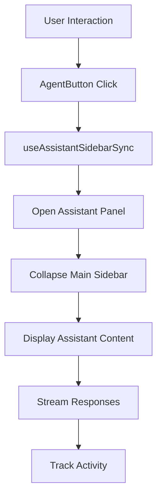

**Diagram sources**

- [agent-button.tsx:9-28](file://apps/web/src/components/agent-button.tsx#L9-L28)
- [use-assistant-panel.tsx:169-235](file://apps/web/src/hooks/use-assistant-panel.tsx#L169-L235)
- [atlas-assistant.tsx:122-175](file://apps/web/src/components/atlas-assistant.tsx#L122-L175)

**Section sources**

- [atlas-assistant.tsx:1-175](file://apps/web/src/components/atlas-assistant.tsx#L1-L175)
- [agent-button.tsx:1-28](file://apps/web/src/components/agent-button.tsx#L1-L28)
- [use-assistant-panel.tsx:1-235](file://apps/web/src/hooks/use-assistant-panel.tsx#L1-L235)
- [layout.tsx (protected):22-66](<file://apps/web/src/app/(protected)/layout.tsx#L22-L66>)

### Activity Tracking and Streaming Responses

The system provides comprehensive activity tracking and streaming response capabilities:

- **AgentActivity Component**: Displays chronological activity entries with status indicators and collapsible details
- **StreamingResponse Component**: Handles real-time response streaming with copy, retry, and feedback actions
- **Message Components**: Rich message display with typing indicators and animation effects
- **PromptInput Component**: Advanced input with model selection, actions, and loading states

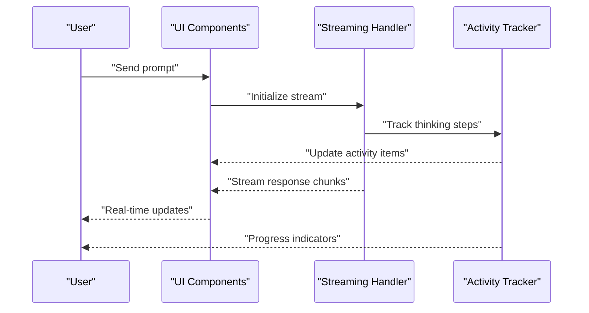

**Diagram sources**

- [agent-activity/index.tsx:117-296](file://packages/ui/src/components/agents/agent-activity/index.tsx#L117-L296)
- [streaming-response.tsx:94-265](file://packages/ui/src/components/agents/streaming-response.tsx#L94-L265)
- [message.tsx:71-138](file://packages/ui/src/components/agents/message.tsx#L71-L138)
- [prompt-input.tsx:69-331](file://packages/ui/src/components/agents/prompt-input.tsx#L69-L331)

**Section sources**

- [agent-activity/index.tsx:1-296](file://packages/ui/src/components/agents/agent-activity/index.tsx#L1-L296)
- [streaming-response.tsx:1-265](file://packages/ui/src/components/agents/streaming-response.tsx#L1-L265)
- [message.tsx:1-276](file://packages/ui/src/components/agents/message.tsx#L1-L276)
- [prompt-input.tsx:1-331](file://packages/ui/src/components/agents/prompt-input.tsx#L1-L331)

### Activity Display and Status Management

The activity page provides a foundation for displaying agent interactions:

- **Empty State Handling**: Graceful loading states with skeleton screens
- **Status Indicators**: Real-time working and complete states with duration tracking
- **Collapsible Details**: Expandable activity logs with smooth animations
- **Accessibility**: Proper ARIA labels and keyboard navigation support

**Section sources**

- [activity/page.tsx:1-30](<file://apps/web/src/app/(protected)/activity/page.tsx#L1-L30>)
- [agent-activity/index.tsx:117-296](file://packages/ui/src/components/agents/agent-activity/index.tsx#L117-L296)

## Dependency Analysis

The runtime depends on the Eve framework, AI libraries, and third-party integrations. The root workspace configures shared dependencies and tooling. The UI layer adds React-based components with motion animations and state management.

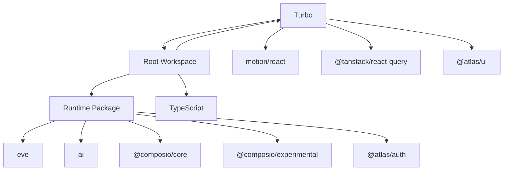

**Diagram sources**

- [package.json (runtime):1-29](file://apps/runtime/package.json#L1-L29)
- [package.json (root):1-66](file://package.json#L1-L66)

**Section sources**

- [package.json (runtime):1-29](file://apps/runtime/package.json#L1-L29)
- [package.json (root):1-66](file://package.json#L1-L66)

## Performance Considerations

- Prefer minimal retries for read-only operations; avoid repeating side-effecting commands
- Cache or reuse sessions per user to reduce setup overhead
- Batch independent operations where possible and respect rate limits
- Keep payloads small and avoid logging sensitive data
- Use bounded polling for asynchronous flows (e.g., authorization, ticketing)
- **Optimize UI rendering with proper state management and memoization**
- **Use streaming responses to improve perceived performance**
- **Implement proper cleanup for event listeners and timers**

[No sources needed since this section provides general guidance]

## Troubleshooting Guide

Common issues and resolutions:

- Authorization required: Initiate login flow, present the authorization link, stop turn, poll once after user confirmation
- Price changes: Present old and new totals; obtain explicit confirmation before proceeding
- Seat availability: Ask user preference if selected seat becomes unavailable during order creation
- Payment uncertainty: Query order status instead of retrying payment; never create duplicate orders
- Service unavailability: Retry identical read-only command at most once when marked retryable; otherwise report neutral outcome
- **UI Issues**: Ensure proper component mounting and state synchronization between parent and child components
- **Streaming Problems**: Verify WebSocket connections and implement proper error handling for connection failures
- **Performance Issues**: Monitor component re-renders and optimize with proper dependency arrays and memoization

Operational tips:

- Validate environment variables for channels (bot tokens, phone numbers)
- Ensure CORS and OIDC settings match deployment requirements
- Monitor logs for repeated failures and adjust retry policies accordingly
- **Test UI responsiveness across different screen sizes and devices**
- **Monitor memory usage for long-running streaming sessions**

**Section sources**

- [error-handling.md:1-74](file://.agents/skills/atlas-flight-booking/references/error-handling.md#L1-L74)
- [cli-contract.md:1-78](file://.agents/skills/atlas-flight-booking/references/cli-contract.md#L1-L78)
- [eve.ts:1-10](file://apps/runtime/agent/channels/eve.ts#L1-L10)
- [telegram.ts:1-6](file://apps/runtime/agent/channels/telegram.ts#L1-L6)
- [twilio.ts:1-7](file://apps/runtime/agent/channels/twilio.ts#L1-L7)

## Conclusion

The AI agent system leverages the Eve framework to provide a modular architecture for channels, tools, sessions, and skills, now enhanced with comprehensive UI components for rich agent interactions. The design emphasizes secure authentication, robust error handling, clear workflows for complex tasks such as flight booking, and real-time user feedback through streaming responses and activity tracking. By following the documented patterns for agent definition, channel implementation, tool integration, skill-driven orchestration, and UI component composition, teams can extend capabilities safely and efficiently while maintaining performance and reliability.

[No sources needed since this section summarizes without analyzing specific files]

## Appendices

### Configuration Options Summary

- AI model: Set in the agent definition file
- Channels: Configure credentials and options per platform (web OIDC/CORS, Telegram bot token, Twilio phone number and allowed senders)
- Sessions: Define toolkits per user session for isolated access to external services
- Environment: Use environment variables for secrets and platform-specific settings
- **UI Components**: Configure assistant panel behavior, streaming response options, and activity tracking preferences

**Section sources**

- [agent.ts:1-8](file://apps/runtime/agent/agent.ts#L1-L8)
- [eve.ts:1-10](file://apps/runtime/agent/channels/eve.ts#L1-L10)
- [telegram.ts:1-6](file://apps/runtime/agent/channels/telegram.ts#L1-L6)
- [twilio.ts:1-7](file://apps/runtime/agent/channels/twilio.ts#L1-L7)
- [session.ts:1-19](file://apps/runtime/agent/session.ts#L1-L19)
- [atlas-assistant.tsx:122-175](file://apps/web/src/components/atlas-assistant.tsx#L122-L175)
- [streaming-response.tsx:33-58](file://packages/ui/src/components/agents/streaming-response.tsx#L33-L58)
- [agent-activity/index.tsx:117-133](file://packages/ui/src/components/agents/agent-activity/index.tsx#L117-L133)
