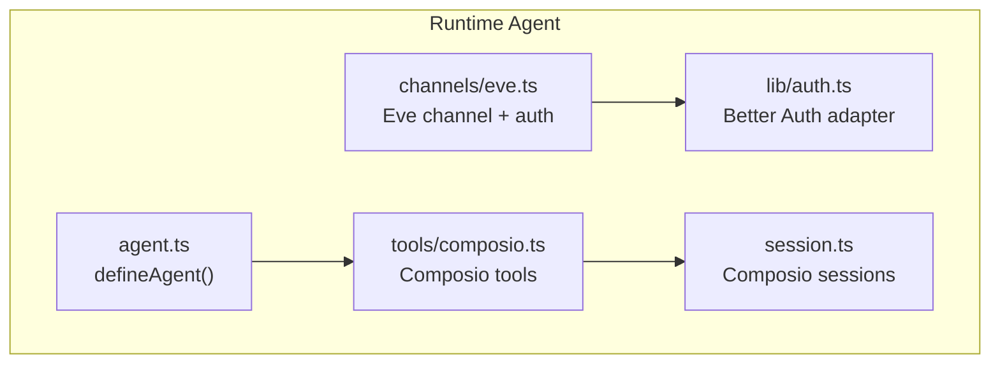
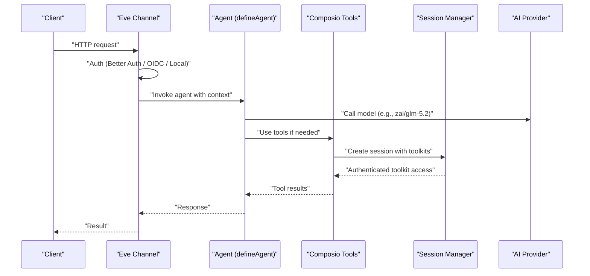
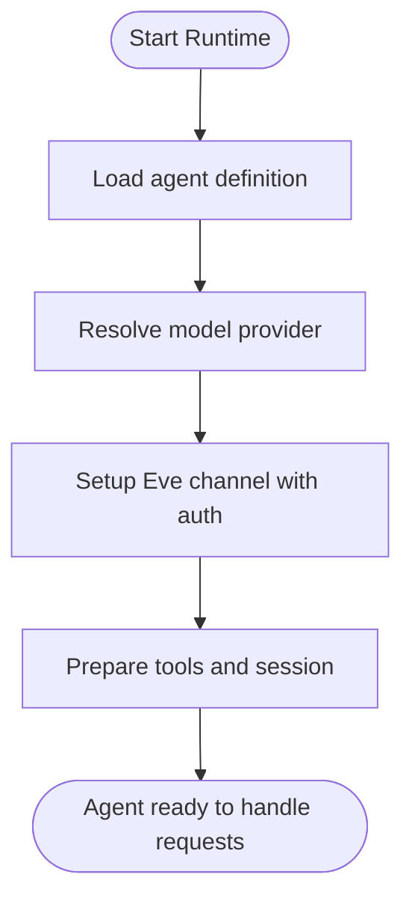
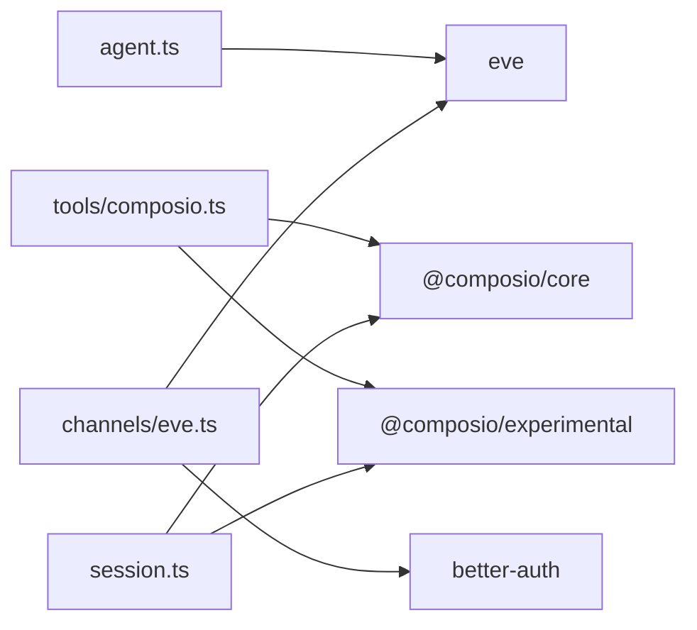

# Agent Core

<cite>
**Referenced Files in This Document**
- [agent.ts](file://apps/runtime/agent/agent.ts)
- [session.ts](file://apps/runtime/agent/session.ts)
- [composio.ts](file://apps/runtime/agent/tools/composio.ts)
- [eve_channel.ts](file://apps/runtime/agent/channels/eve.ts)
- [auth.ts](file://apps/runtime/agent/lib/auth.ts)
- [package.json](file://apps/runtime/package.json)
- [AGENTS.md](file://apps/runtime/AGENTS.md)
</cite>

## Table of Contents

1. [Introduction](#introduction)
2. [Project Structure](#project-structure)
3. [Core Components](#core-components)
4. [Architecture Overview](#architecture-overview)
5. [Detailed Component Analysis](#detailed-component-analysis)
6. [Dependency Analysis](#dependency-analysis)
7. [Performance Considerations](#performance-considerations)
8. [Troubleshooting Guide](#troubleshooting-guide)
9. [Conclusion](#conclusion)

## Introduction

This document explains the core agent system built on the Eve framework within this repository. It covers how agents are defined using defineAgent(), model configuration options (including supported providers such as anthropic and zai), lifecycle management, initialization flow, configuration parameters, and extension points for tools and channels. It also provides guidance on creating custom agents with different AI models, configuring model-specific settings, understanding the agent’s role in the overall architecture, instantiation patterns, error handling during initialization, and debugging techniques.

## Project Structure

The runtime agent lives under apps/runtime/agent and is composed of:

- Agent definition: defines the AI model via defineAgent()
- Tools: Composio-based tooling integration
- Channels: Eve channel configuration with authentication
- Session management: per-user toolkits provisioning
- Authentication: Better Auth integration for user context

**Diagram sources**

- [agent.ts:1-7](file://apps/runtime/agent/agent.ts#L1-L7)
- [composio.ts:1-12](file://apps/runtime/agent/tools/composio.ts#L1-L12)
- [eve_channel.ts:1-10](file://apps/runtime/agent/channels/eve.ts#L1-L10)
- [session.ts:1-19](file://apps/runtime/agent/session.ts#L1-L19)
- [auth.ts:1-26](file://apps/runtime/agent/lib/auth.ts#L1-L26)

**Section sources**

- [agent.ts:1-7](file://apps/runtime/agent/agent.ts#L1-L7)
- [package.json:1-29](file://apps/runtime/package.json#L1-L29)

## Core Components

- Agent definition: The agent is declared by importing defineAgent from eve and exporting a default configuration that sets the AI model provider and model identifier.
- Model configuration: The current configuration selects a model string following the pattern "provider/model". Examples include anthropic and zai providers.
- Tools: Composio tools are defined to access third-party services. They require an authenticated session to obtain a user ID and create a session with specific toolkits.
- Channel: The Eve channel wires authentication strategies (Better Auth, Vercel OIDC, local dev) and enables CORS.
- Session: Per-user sessions are created with a predefined set of toolkits for integrations like Google Calendar, Gmail, Slack, Notion, etc.
- Authentication: Better Auth extracts user attributes and principal identifiers to be used by tools and channels.

Key responsibilities:

- Define the agent and its model selection
- Provide tools that depend on authenticated sessions
- Expose a secure channel for client interactions
- Manage per-user toolkits via sessions

**Section sources**

- [agent.ts:1-7](file://apps/runtime/agent/agent.ts#L1-L7)
- [composio.ts:1-12](file://apps/runtime/agent/tools/composio.ts#L1-L12)
- [session.ts:1-19](file://apps/runtime/agent/session.ts#L1-L19)
- [eve_channel.ts:1-10](file://apps/runtime/agent/channels/eve.ts#L1-L10)
- [auth.ts:1-26](file://apps/runtime/agent/lib/auth.ts#L1-L26)

## Architecture Overview

The agent runs within the Eve runtime and integrates with external AI providers through model strings. Tools are provided via Composio, which requires authenticated sessions to access third-party services. The Eve channel handles authentication and request routing.

**Diagram sources**

- [eve_channel.ts:1-10](file://apps/runtime/agent/channels/eve.ts#L1-L10)
- [auth.ts:1-26](file://apps/runtime/agent/lib/auth.ts#L1-L26)
- [agent.ts:1-7](file://apps/runtime/agent/agent.ts#L1-L7)
- [composio.ts:1-12](file://apps/runtime/agent/tools/composio.ts#L1-L12)
- [session.ts:1-19](file://apps/runtime/agent/session.ts#L1-L19)

## Detailed Component Analysis

### Agent Definition and Model Configuration

- The agent is defined by calling defineAgent() with a configuration object that includes a model field.
- Supported providers observed in code include anthropic and zai. The model string follows the format "provider/model".
- Changing the model allows switching between providers or versions without altering other logic.

Best practices:

- Keep model selection centralized in the agent definition.
- Use environment variables or configuration files to manage model choices across environments.

**Section sources**

- [agent.ts:1-7](file://apps/runtime/agent/agent.ts#L1-L7)

### Tools Integration (Composio)

- Tools are defined using a factory function that receives a context containing the authenticated session.
- The implementation extracts the user ID from the session; if missing, it throws an error indicating the user ID was not found.
- It then creates a Composio session scoped to the user with a predefined list of toolkits.

Error handling:

- Missing user ID triggers an explicit error, ensuring tools fail fast when unauthenticated.

Extensibility:

- Add more toolkits to the session creation to expand capabilities.
- Introduce additional tools by defining new modules and wiring them into the agent.

**Section sources**

- [composio.ts:1-12](file://apps/runtime/agent/tools/composio.ts#L1-L12)
- [session.ts:1-19](file://apps/runtime/agent/session.ts#L1-L19)

### Channel and Authentication

- The Eve channel configures multiple authentication strategies: Better Auth, Vercel OIDC, and local development mode.
- CORS is enabled to allow cross-origin requests.
- Better Auth extracts user attributes (email, name, optional picture) and principal identifiers for downstream use.

Security considerations:

- Ensure only authenticated requests reach tools and agent logic.
- Validate issuer and principal types to prevent spoofing.

**Section sources**

- [eve_channel.ts:1-10](file://apps/runtime/agent/channels/eve.ts#L1-L10)
- [auth.ts:1-26](file://apps/runtime/agent/lib/auth.ts#L1-L26)

### Session Management

- Sessions are created per user with a fixed set of toolkits for integrations.
- The session manager uses the Eve provider to integrate with Composio.

Lifecycle:

- On each tool invocation requiring external services, a session is created for the authenticated user.
- Toolkits determine which external services are accessible to the agent during that session.

**Section sources**

- [session.ts:1-19](file://apps/runtime/agent/session.ts#L1-L19)

### Agent Lifecycle and Initialization Flow

Initialization typically involves:

- Loading the agent definition and resolving the model provider.
- Setting up the channel with authentication strategies.
- Preparing tools and session management for runtime usage.

[No sources needed since this diagram shows conceptual workflow, not actual code structure]

## Dependency Analysis

The runtime depends on:

- eve: Core framework for agent definition, channels, and runtime.
- @composio/core and @composio/experimental: Tooling and session management for third-party integrations.
- ai: Underlying AI SDK abstraction.
- better-auth: Authentication integration.

**Diagram sources**

- [package.json:15-24](file://apps/runtime/package.json#L15-L24)
- [agent.ts:1-7](file://apps/runtime/agent/agent.ts#L1-L7)
- [composio.ts:1-12](file://apps/runtime/agent/tools/composio.ts#L1-L12)
- [eve_channel.ts:1-10](file://apps/runtime/agent/channels/eve.ts#L1-L10)
- [session.ts:1-19](file://apps/runtime/agent/session.ts#L1-L19)
- [auth.ts:1-26](file://apps/runtime/agent/lib/auth.ts#L1-L26)

**Section sources**

- [package.json:15-24](file://apps/runtime/package.json#L15-L24)

## Performance Considerations

- Model selection impacts latency and cost; choose providers/models appropriate for your workload.
- Session creation per tool call may introduce overhead; consider caching sessions where safe.
- Enable CORS only when necessary; restrict origins in production.
- Batch tool calls when possible to reduce network round-trips.

[No sources needed since this section provides general guidance]

## Troubleshooting Guide

Common issues and resolutions:

- Missing user ID in tools:
  - Symptom: Error thrown indicating user ID not found in session.
  - Cause: Request arrived without valid authentication.
  - Resolution: Ensure the channel’s auth strategies are correctly configured and the client sends valid credentials.

- Authentication failures:
  - Symptom: No session returned by Better Auth.
  - Cause: Invalid headers or misconfigured auth endpoints.
  - Resolution: Verify headers and issuer configuration; test locally with local dev auth strategy.

- Tool access errors:
  - Symptom: Toolkit permissions denied or session creation fails.
  - Cause: User lacks required scopes or toolkits not enabled.
  - Resolution: Confirm the user’s session includes the necessary toolkits and that integrations are authorized.

Debugging tips:

- Log session existence and user attributes at channel entry.
- Inspect tool execution paths and session creation parameters.
- Use local dev auth to simplify testing without external dependencies.

**Section sources**

- [composio.ts:1-12](file://apps/runtime/agent/tools/composio.ts#L1-L12)
- [auth.ts:1-26](file://apps/runtime/agent/lib/auth.ts#L1-L26)
- [eve_channel.ts:1-10](file://apps/runtime/agent/channels/eve.ts#L1-L10)

## Conclusion

The agent system leverages Eve’s defineAgent() pattern to declaratively configure AI models and integrates with Composio for rich tooling. Authentication is handled via Better Auth and additional strategies, while sessions provide per-user access to third-party services. By centralizing model configuration and extending tools and channels, you can build robust, scalable agents tailored to diverse use cases. Follow the troubleshooting guidance to diagnose common initialization and runtime issues effectively.
