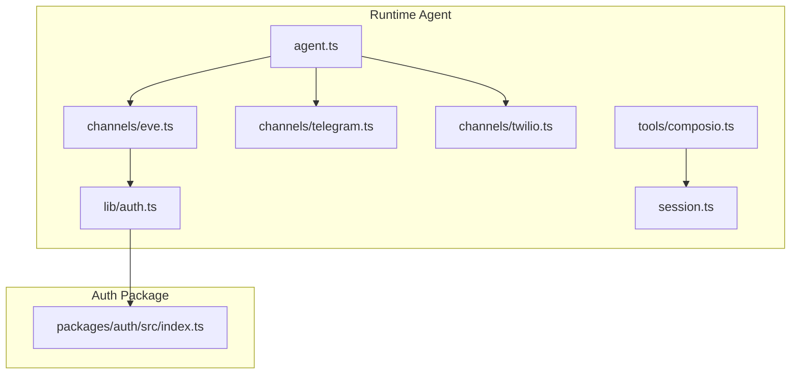
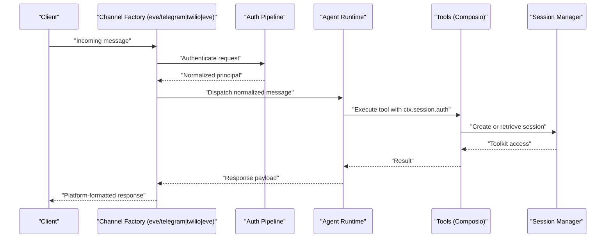
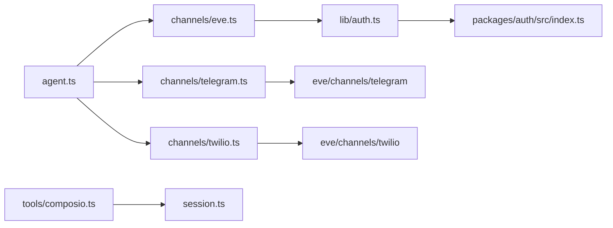

# Channel Abstraction Layer

<cite>
**Referenced Files in This Document**
- [eve.ts](file://apps/runtime/agent/channels/eve.ts)
- [telegram.ts](file://apps/runtime/agent/channels/telegram.ts)
- [twilio.ts](file://apps/runtime/agent/channels/twilio.ts)
- [auth.ts](file://apps/runtime/agent/lib/auth.ts)
- [index.ts](file://packages/auth/src/index.ts)
- [agent.ts](file://apps/runtime/agent/agent.ts)
- [session.ts](file://apps/runtime/agent/session.ts)
- [composio.ts](file://apps/runtime/agent/tools/composio.ts)
</cite>

## Table of Contents

1. [Introduction](#introduction)
2. [Project Structure](#project-structure)
3. [Core Components](#core-components)
4. [Architecture Overview](#architecture-overview)
5. [Detailed Component Analysis](#detailed-component-analysis)
6. [Dependency Analysis](#dependency-analysis)
7. [Performance Considerations](#performance-considerations)
8. [Troubleshooting Guide](#troubleshooting-guide)
9. [Conclusion](#conclusion)
10. [Appendices](#appendices)

## Introduction

This document explains the channel abstraction layer that provides a unified interface for different communication channels (Eve, Telegram, Twilio). It focuses on how the abstraction standardizes message formats, handles authentication, manages errors consistently, and enables consistent message processing regardless of the underlying platform. It also covers how to implement new channels, handle platform-specific features while maintaining consistency, manage lifecycle events, and strategies for testing and debugging cross-channel issues.

## Project Structure

The runtime agent exposes multiple channel entry points under apps/runtime/agent/channels. Each file configures a specific channel using framework-provided factory functions from the eve package. Authentication is centralized via a shared auth module, and tools integrate with external services through session management.

**Diagram sources**

- [agent.ts:1-8](file://apps/runtime/agent/agent.ts#L1-L8)
- [eve.ts:1-9](file://apps/runtime/agent/channels/eve.ts#L1-L9)
- [telegram.ts:1-6](file://apps/runtime/agent/channels/telegram.ts#L1-L6)
- [twilio.ts:1-7](file://apps/runtime/agent/channels/twilio.ts#L1-L7)
- [auth.ts:1-26](file://apps/runtime/agent/lib/auth.ts#L1-L26)
- [index.ts:1-43](file://packages/auth/src/index.ts#L1-L43)
- [composio.ts:1-12](file://apps/runtime/agent/tools/composio.ts#L1-L12)
- [session.ts:1-19](file://apps/runtime/agent/session.ts#L1-L19)

**Section sources**

- [agent.ts:1-8](file://apps/runtime/agent/agent.ts#L1-L8)
- [eve.ts:1-9](file://apps/runtime/agent/channels/eve.ts#L1-L9)
- [telegram.ts:1-6](file://apps/runtime/agent/channels/telegram.ts#L1-L6)
- [twilio.ts:1-7](file://apps/runtime/agent/channels/twilio.ts#L1-L7)
- [auth.ts:1-26](file://apps/runtime/agent/lib/auth.ts#L1-L26)
- [index.ts:1-43](file://packages/auth/src/index.ts#L1-L43)
- [composio.ts:1-12](file://apps/runtime/agent/tools/composio.ts#L1-L12)
- [session.ts:1-19](file://apps/runtime/agent/session.ts#L1-L19)

## Core Components

- Channel factories: Each channel file imports a channel factory from the eve package and exports a configured instance. This pattern abstracts platform specifics behind a common interface.
- Authentication pipeline: The Eve channel composes multiple authenticators, including a custom Better Auth handler and built-in providers for local development and Vercel OIDC.
- Tooling integration: Tools access authenticated sessions to interact with external services (e.g., Composio toolkits), ensuring consistent identity propagation across channels.

Key responsibilities:

- Standardize incoming/outgoing messages via the channel’s contract.
- Normalize authentication results into a consistent principal model.
- Centralize configuration (credentials, CORS, messaging options) per channel.
- Provide a single point of extension for adding new channels without changing core logic.

**Section sources**

- [eve.ts:1-9](file://apps/runtime/agent/channels/eve.ts#L1-L9)
- [telegram.ts:1-6](file://apps/runtime/agent/channels/telegram.ts#L1-L6)
- [twilio.ts:1-7](file://apps/runtime/agent/channels/twilio.ts#L1-L7)
- [auth.ts:1-26](file://apps/runtime/agent/lib/auth.ts#L1-L26)
- [composio.ts:1-12](file://apps/runtime/agent/tools/composio.ts#L1-L12)

## Architecture Overview

The architecture centers around a unified channel abstraction provided by the eve framework. Channels are configured at the edge (per platform) and funnel requests into the same agent runtime. Authentication is pluggable and can be composed per channel. Tools rely on a normalized session context to perform actions.

**Diagram sources**

- [eve.ts:1-9](file://apps/runtime/agent/channels/eve.ts#L1-L9)
- [telegram.ts:1-6](file://apps/runtime/agent/channels/telegram.ts#L1-L6)
- [twilio.ts:1-7](file://apps/runtime/agent/channels/twilio.ts#L1-L7)
- [auth.ts:1-26](file://apps/runtime/agent/lib/auth.ts#L1-L26)
- [composio.ts:1-12](file://apps/runtime/agent/tools/composio.ts#L1-L12)
- [session.ts:1-19](file://apps/runtime/agent/session.ts#L1-L19)

## Detailed Component Analysis

### Eve Channel Configuration

- Purpose: Expose an HTTP-like channel with flexible authentication and CORS settings.
- Authentication composition: Combines a custom Better Auth handler with built-in local development and Vercel OIDC authenticators.
- CORS: Enabled to support cross-origin requests during development or multi-domain deployments.

Implementation highlights:

- Uses a channel factory to create a configured instance.
- Passes an array of authenticators to the channel configuration.
- Enables CORS for broader client compatibility.

**Section sources**

- [eve.ts:1-9](file://apps/runtime/agent/channels/eve.ts#L1-L9)

### Telegram Channel Configuration

- Purpose: Connect the agent to Telegram via a bot token.
- Credentials: Bot token is resolved from environment variables at runtime.

Implementation highlights:

- Minimal configuration surface; credentials are injected via a function to allow dynamic resolution.
- No explicit auth pipeline here; relies on channel-level defaults or global setup.

**Section sources**

- [telegram.ts:1-6](file://apps/runtime/agent/channels/telegram.ts#L1-L6)

### Twilio Channel Configuration

- Purpose: Enable SMS/messaging via Twilio.
- Messaging options: Configures sender phone number and allows origins.

Implementation highlights:

- Uses a channel factory to configure messaging behavior.
- Environment-driven sender identity ensures secure credential handling.

**Section sources**

- [twilio.ts:1-7](file://apps/runtime/agent/channels/twilio.ts#L1-L7)

### Authentication Handling

- Custom Better Auth handler: Extracts user session from the request and normalizes it into a consistent principal object with attributes and issuer information.
- Returns null when no session exists, signaling unauthenticated requests to the channel layer.

Integration points:

- Composed within the Eve channel’s auth pipeline alongside other authenticators.
- Relies on the shared auth package for database-backed sessions and plugins.

**Section sources**

- [auth.ts:1-26](file://apps/runtime/agent/lib/auth.ts#L1-L26)
- [index.ts:1-43](file://packages/auth/src/index.ts#L1-L43)

### Agent and Tools Integration

- Agent definition: Declares the model used by the runtime.
- Tools: Use a session manager to obtain toolkit access based on the authenticated user. If the user ID is missing, tools raise an error to fail fast.

Error handling pattern:

- Explicit validation of session context before invoking external services.
- Clear error signaling when required context is absent.

**Section sources**

- [agent.ts:1-8](file://apps/runtime/agent/agent.ts#L1-L8)
- [composio.ts:1-12](file://apps/runtime/agent/tools/composio.ts#L1-L12)
- [session.ts:1-19](file://apps/runtime/agent/session.ts#L1-L19)

### Message Format Standardization

- The channel abstraction normalizes incoming messages from diverse platforms into a common internal format consumed by the agent.
- Outbound responses are formatted back to the platform-specific representation by each channel implementation.
- This decouples business logic from transport details, enabling consistent processing across channels.

Lifecycle considerations:

- Channels manage connection establishment, message routing, and teardown.
- Authentication is performed early in the pipeline to gate access before message processing.

[No sources needed since this section describes conceptual normalization patterns derived from the channel files]

### Implementing a New Channel

Steps:

1. Import the appropriate channel factory from the eve package.
2. Export a configured instance with platform-specific options (credentials, CORS, messaging).
3. If needed, compose authenticators to support your platform’s identity flow.
4. Ensure environment variables are securely loaded and validated.
5. Add tests that simulate inbound messages and verify normalized outputs.

Consistency guidelines:

- Always normalize authentication results to the expected principal shape.
- Keep configuration minimal and environment-driven.
- Avoid leaking platform-specific types into the agent core.

[No sources needed since this section provides general guidance]

### Managing Channel Lifecycle Events

- Initialization: Channel instances are created once and reused for subsequent requests.
- Request handling: Authenticate, normalize, dispatch to agent, format response.
- Teardown: Graceful shutdown should close connections and release resources held by the channel.

[No sources needed since this section provides general guidance]

## Dependency Analysis

The runtime depends on:

- Channel factories from the eve package for each platform.
- A shared auth package providing session management and plugins.
- Tools that depend on session context to access third-party services.

**Diagram sources**

- [eve.ts:1-9](file://apps/runtime/agent/channels/eve.ts#L1-L9)
- [telegram.ts:1-6](file://apps/runtime/agent/channels/telegram.ts#L1-L6)
- [twilio.ts:1-7](file://apps/runtime/agent/channels/twilio.ts#L1-L7)
- [auth.ts:1-26](file://apps/runtime/agent/lib/auth.ts#L1-L26)
- [index.ts:1-43](file://packages/auth/src/index.ts#L1-L43)
- [composio.ts:1-12](file://apps/runtime/agent/tools/composio.ts#L1-L12)
- [session.ts:1-19](file://apps/runtime/agent/session.ts#L1-L19)
- [agent.ts:1-8](file://apps/runtime/agent/agent.ts#L1-L8)

**Section sources**

- [eve.ts:1-9](file://apps/runtime/agent/channels/eve.ts#L1-L9)
- [telegram.ts:1-6](file://apps/runtime/agent/channels/telegram.ts#L1-L6)
- [twilio.ts:1-7](file://apps/runtime/agent/channels/twilio.ts#L1-L7)
- [auth.ts:1-26](file://apps/runtime/agent/lib/auth.ts#L1-L26)
- [index.ts:1-43](file://packages/auth/src/index.ts#L1-L43)
- [composio.ts:1-12](file://apps/runtime/agent/tools/composio.ts#L1-L12)
- [session.ts:1-19](file://apps/runtime/agent/session.ts#L1-L19)
- [agent.ts:1-8](file://apps/runtime/agent/agent.ts#L1-L8)

## Performance Considerations

- Minimize per-request overhead by reusing channel instances and avoiding repeated credential resolution.
- Prefer lazy loading of heavy dependencies until they are needed.
- Cache expensive lookups where safe (e.g., toolkit sessions) to reduce latency.
- Configure CORS and allowed origins precisely to avoid unnecessary preflight checks.

[No sources needed since this section provides general guidance]

## Troubleshooting Guide

Common issues and resolutions:

- Unauthenticated requests: Ensure the auth pipeline returns a valid principal; check headers and session validity.
- Missing environment variables: Validate presence of bot tokens, phone numbers, and secrets at startup.
- Cross-origin failures: Verify CORS settings match client domains.
- Tool execution failures: Confirm session context contains required identifiers; handle missing IDs explicitly.

Debugging techniques:

- Log normalized principals after authentication to confirm identity propagation.
- Instrument channel entry/exit points to measure latency and errors.
- Use structured logging for outgoing messages to track formatting issues.

**Section sources**

- [auth.ts:1-26](file://apps/runtime/agent/lib/auth.ts#L1-L26)
- [composio.ts:1-12](file://apps/runtime/agent/tools/composio.ts#L1-L12)

## Conclusion

The channel abstraction layer standardizes how the agent interacts with multiple communication platforms. By centralizing authentication, normalizing messages, and encapsulating platform specifics behind consistent interfaces, it enables reliable, testable, and extensible integrations. Following the patterns outlined here will help you add new channels confidently while maintaining consistency and performance.

## Appendices

### Testing Strategies for Channel Implementations

- Unit tests: Mock channel factories and authenticators to validate normalization and error paths.
- Integration tests: Simulate inbound messages and assert outbound payloads conform to platform expectations.
- Auth tests: Verify that all authenticators in the pipeline produce the expected principal shape or reject invalid requests.
- Tool tests: Assert that tools fail fast when session context is incomplete and succeed when valid.

[No sources needed since this section provides general guidance]

### Debugging Techniques for Cross-Channel Issues

- Correlation IDs: Attach unique identifiers to requests to trace them across channels and tools.
- Centralized logs: Capture channel lifecycle events, authentication outcomes, and tool invocations.
- Feature flags: Toggle verbose logging per channel to isolate issues in production.

[No sources needed since this section provides general guidance]
