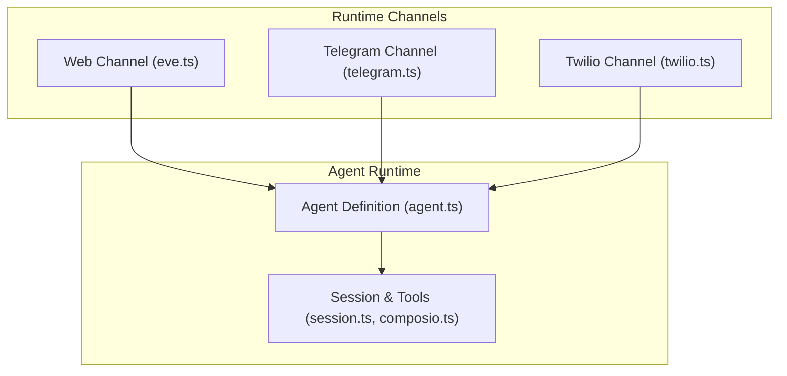
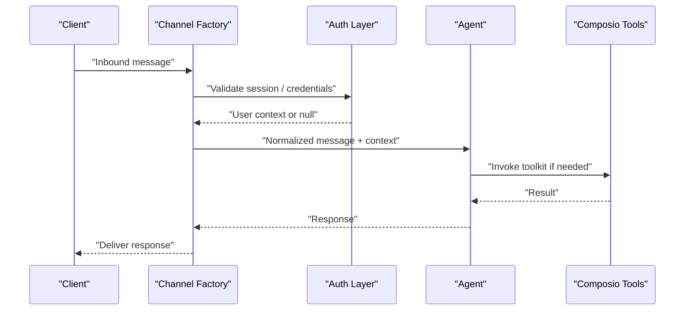
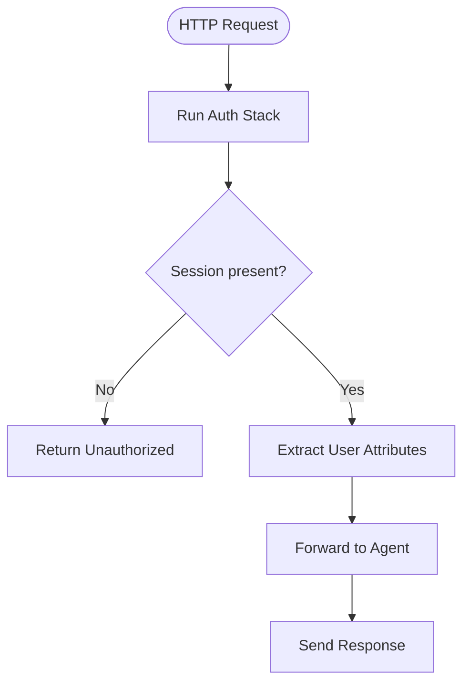
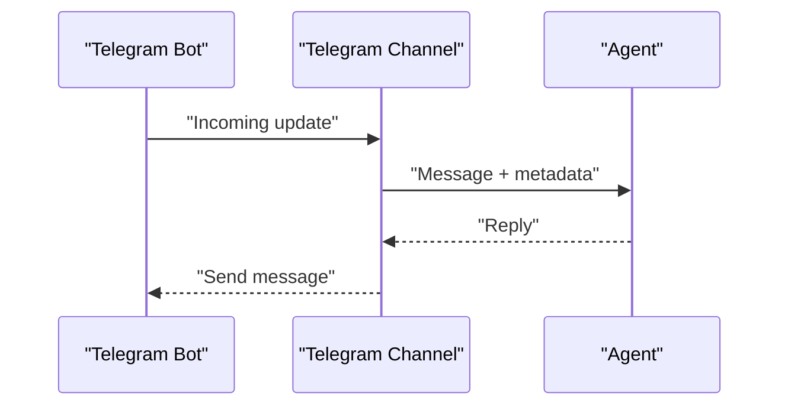
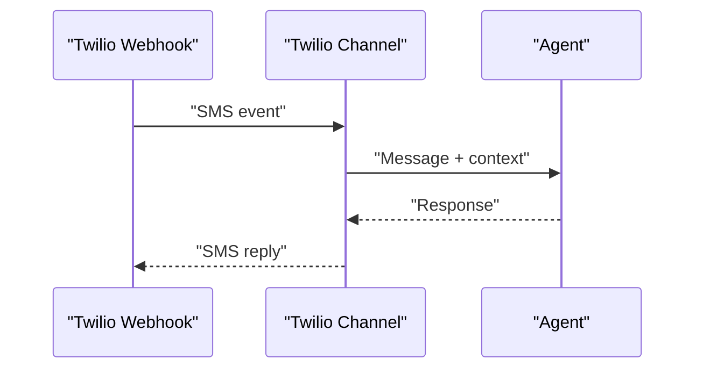
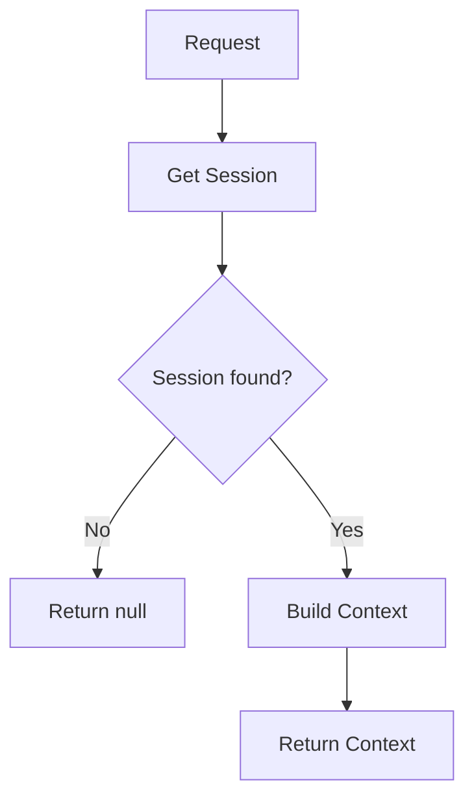
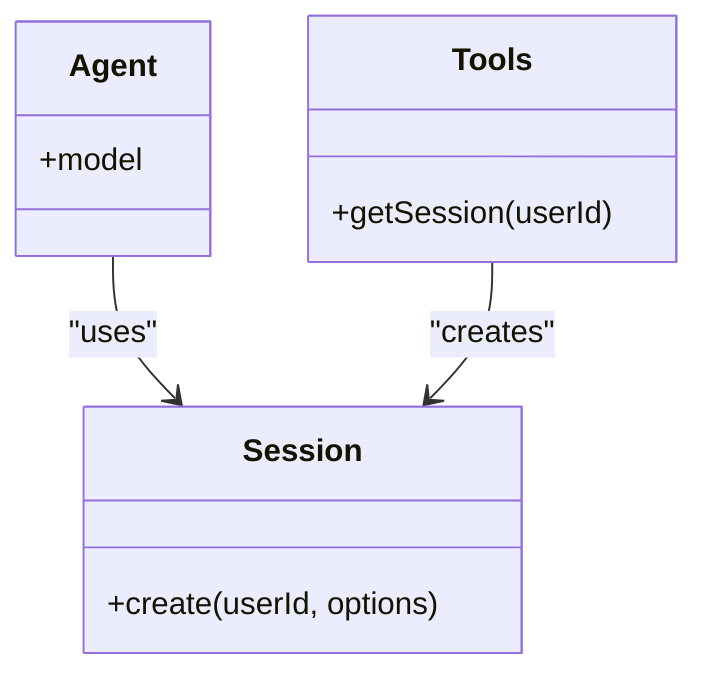
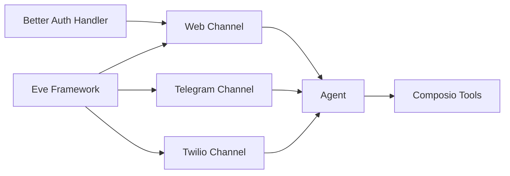

# Channel System

<cite>
**Referenced Files in This Document**
- [eve.ts](file://apps/runtime/agent/channels/eve.ts)
- [telegram.ts](file://apps/runtime/agent/channels/telegram.ts)
- [twilio.ts](file://apps/runtime/agent/channels/twilio.ts)
- [auth.ts](file://apps/runtime/agent/lib/auth.ts)
- [agent.ts](file://apps/runtime/agent/agent.ts)
- [session.ts](file://apps/runtime/agent/session.ts)
- [composio.ts](file://apps/runtime/agent/tools/composio.ts)
- [package.json](file://apps/runtime/package.json)
</cite>

## Table of Contents

1. [Introduction](#introduction)
2. [Project Structure](#project-structure)
3. [Core Components](#core-components)
4. [Architecture Overview](#architecture-overview)
5. [Detailed Component Analysis](#detailed-component-analysis)
6. [Dependency Analysis](#dependency-analysis)
7. [Performance Considerations](#performance-considerations)
8. [Troubleshooting Guide](#troubleshooting-guide)
9. [Conclusion](#conclusion)
10. [Appendices](#appendices)

## Introduction

This document explains the multi-channel communication system that enables the agent to interact through web interfaces, Telegram bot, and SMS via Twilio. It focuses on how channels are configured, how messages are routed to the agent, and how platform-specific settings are applied. It also covers authentication flows, error handling strategies, guidance for adding new channels, customizing behavior, handling rich media, debugging connectivity, and scalability considerations for high-volume messaging.

## Project Structure

The runtime application exposes three channel entry points under apps/runtime/agent/channels:

- Web channel (Eve): Configured with multiple auth providers and CORS enabled.
- Telegram channel: Configured with a bot token from environment variables.
- Twilio channel: Configured with allowed origins and an outbound phone number.

These channels integrate with the Eve framework and the agent defined in the runtime package.

**Diagram sources**

- [eve.ts:1-9](file://apps/runtime/agent/channels/eve.ts#L1-L9)
- [telegram.ts:1-5](file://apps/runtime/agent/channels/telegram.ts#L1-L5)
- [twilio.ts:1-6](file://apps/runtime/agent/channels/twilio.ts#L1-L6)
- [agent.ts:1-8](file://apps/runtime/agent/agent.ts#L1-L8)
- [session.ts:1-19](file://apps/runtime/agent/session.ts#L1-L19)
- [composio.ts:1-12](file://apps/runtime/agent/tools/composio.ts#L1-L12)

**Section sources**

- [eve.ts:1-9](file://apps/runtime/agent/channels/eve.ts#L1-L9)
- [telegram.ts:1-5](file://apps/runtime/agent/channels/telegram.ts#L1-L5)
- [twilio.ts:1-6](file://apps/runtime/agent/channels/twilio.ts#L1-L6)
- [agent.ts:1-8](file://apps/runtime/agent/agent.ts#L1-L8)
- [session.ts:1-19](file://apps/runtime/agent/session.ts#L1-L19)
- [composio.ts:1-12](file://apps/runtime/agent/tools/composio.ts#L1-L12)
- [package.json:1-30](file://apps/runtime/package.json#L1-L30)

## Core Components

- Channel factories: Each channel file imports a factory from the Eve framework and exports a configured instance.
- Authentication: The web channel composes multiple auth handlers, including a custom Better Auth integration.
- Agent definition: The agent is defined centrally and receives messages from all channels.
- Session and tools: The session module creates a Composio session with toolkits; tools resolve the current user context from the channel session.

Key responsibilities:

- Channel configuration: Credentials, allowed origins, and platform-specific options.
- Message routing: Channels forward inbound messages to the agent and deliver responses back to the originating channel.
- Authentication: Validate and extract user identity per channel.
- Tooling: Provide external integrations via Composio toolkits.

**Section sources**

- [eve.ts:1-9](file://apps/runtime/agent/channels/eve.ts#L1-L9)
- [telegram.ts:1-5](file://apps/runtime/agent/channels/telegram.ts#L1-L5)
- [twilio.ts:1-6](file://apps/runtime/agent/channels/twilio.ts#L1-L6)
- [auth.ts:1-26](file://apps/runtime/agent/lib/auth.ts#L1-L26)
- [agent.ts:1-8](file://apps/runtime/agent/agent.ts#L1-L8)
- [session.ts:1-19](file://apps/runtime/agent/session.ts#L1-L19)
- [composio.ts:1-12](file://apps/runtime/agent/tools/composio.ts#L1-L12)

## Architecture Overview

The architecture follows a channel abstraction pattern provided by the Eve framework:

- Each channel is a thin configuration layer over a framework-provided channel factory.
- Inbound messages are normalized and routed to the agent.
- The agent processes messages using its model and available tools.
- Responses are sent back through the originating channel.

**Diagram sources**

- [eve.ts:1-9](file://apps/runtime/agent/channels/eve.ts#L1-L9)
- [auth.ts:1-26](file://apps/runtime/agent/lib/auth.ts#L1-L26)
- [agent.ts:1-8](file://apps/runtime/agent/agent.ts#L1-L8)
- [session.ts:1-19](file://apps/runtime/agent/session.ts#L1-L19)
- [composio.ts:1-12](file://apps/runtime/agent/tools/composio.ts#L1-L12)

## Detailed Component Analysis

### Web Channel (Eve)

- Purpose: Provides a web-based interface for the agent with flexible authentication and CORS support.
- Configuration:
  - Composes multiple auth handlers: a custom Better Auth handler, Vercel OIDC, and local development mode.
  - Enables CORS for cross-origin requests.
- Authentication flow:
  - Requests are authenticated via the composed auth stack.
  - The Better Auth handler extracts user attributes and principal information from the session.
- Error handling:
  - If no session is found, the auth handler returns null, signaling unauthenticated access.

**Diagram sources**

- [eve.ts:1-9](file://apps/runtime/agent/channels/eve.ts#L1-L9)
- [auth.ts:1-26](file://apps/runtime/agent/lib/auth.ts#L1-L26)

**Section sources**

- [eve.ts:1-9](file://apps/runtime/agent/channels/eve.ts#L1-L9)
- [auth.ts:1-26](file://apps/runtime/agent/lib/auth.ts#L1-L26)

### Telegram Channel

- Purpose: Exposes a Telegram bot channel for messaging.
- Configuration:
  - Bot token is loaded from environment variables at runtime.
- Behavior:
  - Messages received by the Telegram bot are forwarded to the agent.
  - Responses are delivered back to the originating chat.

**Diagram sources**

- [telegram.ts:1-5](file://apps/runtime/agent/channels/telegram.ts#L1-L5)
- [agent.ts:1-8](file://apps/runtime/agent/agent.ts#L1-L8)

**Section sources**

- [telegram.ts:1-5](file://apps/runtime/agent/channels/telegram.ts#L1-L5)

### Twilio Channel

- Purpose: Enables SMS messaging via Twilio.
- Configuration:
  - Allows messages from any origin (for testing) and sets the outbound phone number from environment variables.
- Behavior:
  - Inbound SMS messages are routed to the agent.
  - Outbound replies are sent from the configured phone number.

**Diagram sources**

- [twilio.ts:1-6](file://apps/runtime/agent/channels/twilio.ts#L1-L6)
- [agent.ts:1-8](file://apps/runtime/agent/agent.ts#L1-L8)

**Section sources**

- [twilio.ts:1-6](file://apps/runtime/agent/channels/twilio.ts#L1-L6)

### Authentication Integration

- Custom Better Auth handler:
  - Reads the session from incoming request headers.
  - Returns null when no session exists.
  - On success, returns user attributes and principal details used by the channel.

**Diagram sources**

- [auth.ts:1-26](file://apps/runtime/agent/lib/auth.ts#L1-L26)

**Section sources**

- [auth.ts:1-26](file://apps/runtime/agent/lib/auth.ts#L1-L26)

### Agent and Tools

- Agent definition:
  - Declares the model used for processing messages.
- Session and tools:
  - Creates a Composio session with a set of toolkits.
  - Tools retrieve the current user ID from the channel session context.

**Diagram sources**

- [agent.ts:1-8](file://apps/runtime/agent/agent.ts#L1-L8)
- [session.ts:1-19](file://apps/runtime/agent/session.ts#L1-L19)
- [composio.ts:1-12](file://apps/runtime/agent/tools/composio.ts#L1-L12)

**Section sources**

- [agent.ts:1-8](file://apps/runtime/agent/agent.ts#L1-L8)
- [session.ts:1-19](file://apps/runtime/agent/session.ts#L1-L19)
- [composio.ts:1-12](file://apps/runtime/agent/tools/composio.ts#L1-L12)

## Dependency Analysis

- Channels depend on the Eve framework’s channel factories for web, Telegram, and Twilio.
- The web channel depends on the custom auth implementation and optional OIDC/local dev auth.
- The agent depends on the configured model and uses tools via a Composio session.
- The runtime package declares dependencies on the Eve framework and related libraries.

**Diagram sources**

- [package.json:1-30](file://apps/runtime/package.json#L1-L30)
- [eve.ts:1-9](file://apps/runtime/agent/channels/eve.ts#L1-L9)
- [telegram.ts:1-5](file://apps/runtime/agent/channels/telegram.ts#L1-L5)
- [twilio.ts:1-6](file://apps/runtime/agent/channels/twilio.ts#L1-L6)
- [auth.ts:1-26](file://apps/runtime/agent/lib/auth.ts#L1-L26)
- [agent.ts:1-8](file://apps/runtime/agent/agent.ts#L1-L8)
- [session.ts:1-19](file://apps/runtime/agent/session.ts#L1-L19)
- [composio.ts:1-12](file://apps/runtime/agent/tools/composio.ts#L1-L12)

**Section sources**

- [package.json:1-30](file://apps/runtime/package.json#L1-L30)
- [eve.ts:1-9](file://apps/runtime/agent/channels/eve.ts#L1-L9)
- [telegram.ts:1-5](file://apps/runtime/agent/channels/telegram.ts#L1-L5)
- [twilio.ts:1-6](file://apps/runtime/agent/channels/twilio.ts#L1-L6)
- [auth.ts:1-26](file://apps/runtime/agent/lib/auth.ts#L1-L26)
- [agent.ts:1-8](file://apps/runtime/agent/agent.ts#L1-L8)
- [session.ts:1-19](file://apps/runtime/agent/session.ts#L1-L19)
- [composio.ts:1-12](file://apps/runtime/agent/tools/composio.ts#L1-L12)

## Performance Considerations

- Concurrency: Ensure the runtime can handle concurrent requests across channels. Use horizontal scaling for the serverless or containerized deployment.
- Rate limits: Respect rate limits imposed by Telegram and Twilio. Implement retry logic with exponential backoff for transient failures.
- Message batching: For high-volume scenarios, consider batching non-critical operations (e.g., logging, analytics).
- Model throughput: Choose models and configure concurrency appropriately to avoid bottlenecks.
- Observability: Add metrics for message volume, latency, error rates, and channel health. Track per-channel performance separately.

[No sources needed since this section provides general guidance]

## Troubleshooting Guide

- Web channel authentication issues:
  - Symptom: Unauthenticated errors or missing user context.
  - Checks: Verify session cookies/headers, ensure CORS is correctly configured, confirm OIDC/local dev auth is active as expected.
- Telegram bot not responding:
  - Symptom: No replies or webhook errors.
  - Checks: Confirm bot token is set, verify webhook URL is reachable, check network logs for failed updates.
- Twilio SMS failures:
  - Symptom: Messages not sent or delivery errors.
  - Checks: Validate phone number configuration, inspect Twilio webhooks, review error codes from Twilio.
- Tool invocation errors:
  - Symptom: Missing user ID or toolkit failures.
  - Checks: Ensure session context includes principal ID, verify toolkit permissions and credentials.

**Section sources**

- [auth.ts:1-26](file://apps/runtime/agent/lib/auth.ts#L1-L26)
- [telegram.ts:1-5](file://apps/runtime/agent/channels/telegram.ts#L1-L5)
- [twilio.ts:1-6](file://apps/runtime/agent/channels/twilio.ts#L1-L6)
- [composio.ts:1-12](file://apps/runtime/agent/tools/composio.ts#L1-L12)

## Conclusion

The multi-channel system leverages the Eve framework to provide a consistent interface for web, Telegram, and Twilio channels. Channels are configured with minimal code, delegating transport specifics to the framework while focusing on credentials and security policies. Authentication is centralized for the web channel, and tools are integrated via a Composio session. This design supports extensibility, allowing new channels to be added with small configuration files and enabling customization of existing behaviors without altering core logic.

[No sources needed since this section summarizes without analyzing specific files]

## Appendices

### How to Add a New Channel

- Create a new file under apps/runtime/agent/channels/.
- Import the appropriate channel factory from the Eve framework.
- Configure credentials and options (e.g., tokens, phone numbers, allowed origins).
- Export the configured channel instance so it can be discovered by the runtime.

**Section sources**

- [telegram.ts:1-5](file://apps/runtime/agent/channels/telegram.ts#L1-L5)
- [twilio.ts:1-6](file://apps/runtime/agent/channels/twilio.ts#L1-L6)
- [eve.ts:1-9](file://apps/runtime/agent/channels/eve.ts#L1-L9)

### Customizing Existing Channel Behavior

- Web channel:
  - Add or reorder auth handlers to change authentication flow.
  - Adjust CORS settings to match your deployment needs.
- Telegram/Twilio:
  - Modify configuration options such as allowed senders or message formatting.
  - Integrate middleware or hooks provided by the framework to transform messages before they reach the agent.

**Section sources**

- [eve.ts:1-9](file://apps/runtime/agent/channels/eve.ts#L1-L9)
- [telegram.ts:1-5](file://apps/runtime/agent/channels/telegram.ts#L1-L5)
- [twilio.ts:1-6](file://apps/runtime/agent/channels/twilio.ts#L1-L6)

### Handling Rich Media and File Uploads

- Platform capabilities:
  - Telegram supports photos, documents, voice notes, and other media types.
  - Twilio supports MMS attachments where applicable.
- Implementation approach:
  - Configure each channel to accept and normalize media payloads.
  - Ensure the agent can process media content or delegate to tools capable of handling files.
  - Apply size limits and content validation to protect the system.

[No sources needed since this section provides general guidance]

### Monitoring and Metrics

- Track per-channel metrics:
  - Message volume, latency, error rates, retries, and timeouts.
- Alerting:
  - Set alerts for sustained failures or degraded performance on specific channels.
- Logging:
  - Log channel events with correlation IDs to trace messages end-to-end.

[No sources needed since this section provides general guidance]
