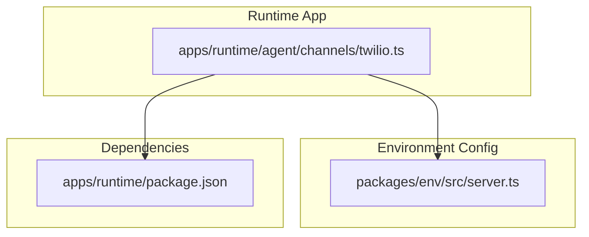
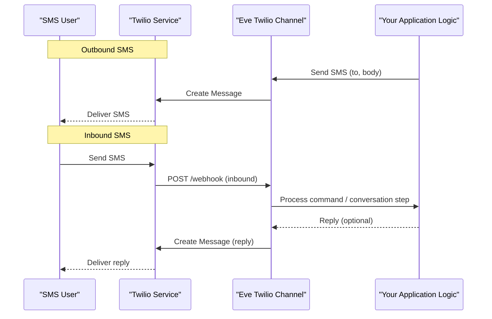
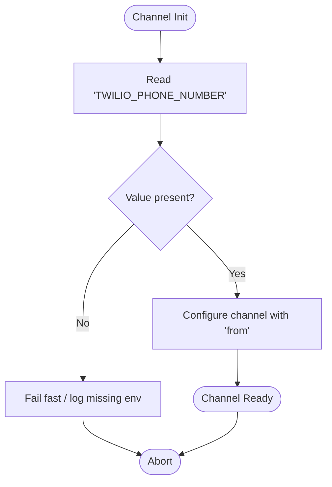
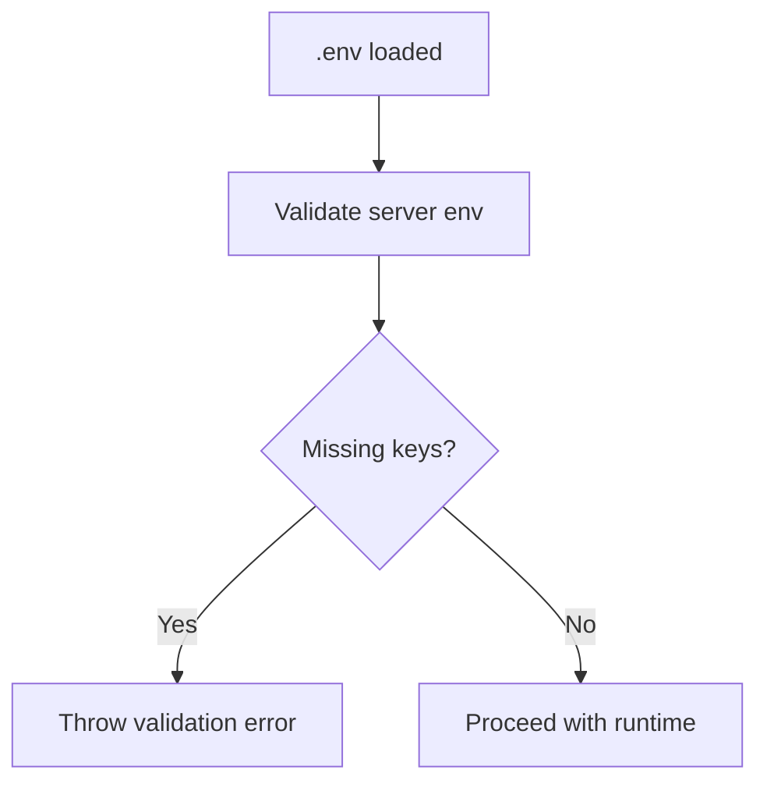
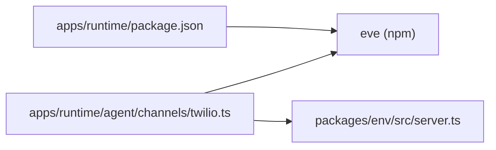
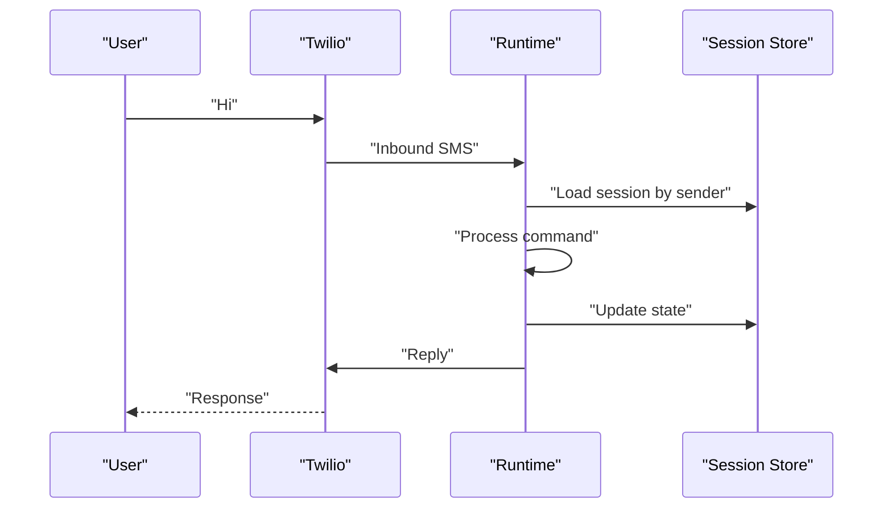

# SMS Channel (Twilio)

<cite>
**Referenced Files in This Document**
- [twilio.ts](file://apps/runtime/agent/channels/twilio.ts)
- [package.json](file://apps/runtime/package.json)
- [server.ts](file://packages/env/src/server.ts)
- [README.md](file://README.md)
</cite>

## Table of Contents

1. [Introduction](#introduction)
2. [Project Structure](#project-structure)
3. [Core Components](#core-components)
4. [Architecture Overview](#architecture-overview)
5. [Detailed Component Analysis](#detailed-component-analysis)
6. [Dependency Analysis](#dependency-analysis)
7. [Performance Considerations](#performance-considerations)
8. [Troubleshooting Guide](#troubleshooting-guide)
9. [Conclusion](#conclusion)
10. [Appendices](#appendices)

## Introduction

This document explains how the project integrates an SMS channel using Twilio via the Eve framework’s Twilio channel. It covers account and phone number setup, webhook configuration for inbound messages, message formatting constraints, international number handling, automated outbound notifications, incoming command processing, two-way conversations, integration with external systems, cost optimization, error handling, compliance considerations, troubleshooting, and monitoring delivery status.

The runtime exposes a Twilio channel that reads the sender phone number from environment variables and delegates messaging to the underlying Eve channel implementation.

**Section sources**

- [twilio.ts:1-6](file://apps/runtime/agent/channels/twilio.ts#L1-L6)
- [README.md:19-44](file://README.md#L19-L44)

## Project Structure

At a high level:

- The runtime app defines channels under apps/runtime/agent/channels/.
- The Twilio channel is configured in twilio.ts and depends on the eve package.
- Environment variables are validated centrally in packages/env/src/server.ts.
- The runtime package declares dependencies including eve.

**Diagram sources**

- [twilio.ts:1-6](file://apps/runtime/agent/channels/twilio.ts#L1-L6)
- [server.ts:1-28](file://packages/env/src/server.ts#L1-L28)
- [package.json:15-24](file://apps/runtime/package.json#L15-L24)

**Section sources**

- [twilio.ts:1-6](file://apps/runtime/agent/channels/twilio.ts#L1-L6)
- [package.json:15-24](file://apps/runtime/package.json#L15-L24)
- [server.ts:1-28](file://packages/env/src/server.ts#L1-L28)

## Core Components

- Twilio Channel Configuration:
  - The channel is created by importing the Twilio channel factory from the eve package and configuring it with options such as allowed senders and the messaging “from” phone number sourced from environment variables.
- Environment Variables:
  - Centralized environment validation exists; while the Twilio-specific variable is not listed here, the pattern shows how to add and validate new server-side env vars.

Key responsibilities:

- twilio.ts: Declares the Twilio channel instance with minimal configuration (allowed origins and the outgoing phone number).
- server.ts: Provides a template for adding and validating environment variables at runtime.

**Section sources**

- [twilio.ts:1-6](file://apps/runtime/agent/channels/twilio.ts#L1-L6)
- [server.ts:1-28](file://packages/env/src/server.ts#L1-L28)

## Architecture Overview

The runtime configures a Twilio channel that connects to Twilio’s messaging APIs. Inbound SMS messages are routed to your application via webhooks, where you can process commands or trigger workflows. Outbound messages are sent from the configured “from” number.

[No sources needed since this diagram shows conceptual workflow, not actual code structure]

## Detailed Component Analysis

### Twilio Channel Configuration

- Purpose: Initialize the Twilio channel with permissive sender policy and set the outgoing phone number from environment.
- Behavior:
  - allowFrom: "*" permits messages from any source number.
  - messaging.from: Reads TWILIO_PHONE_NUMBER from environment and uses it as the sender.

**Diagram sources**

- [twilio.ts:3-6](file://apps/runtime/agent/channels/twilio.ts#L3-L6)

**Section sources**

- [twilio.ts:1-6](file://apps/runtime/agent/channels/twilio.ts#L1-L6)

### Environment Variable Management

- Pattern: Use centralized env validation to enforce required keys and types.
- Recommendation: Add TWILIO_ACCOUNT_SID, TWILIO_AUTH_TOKEN, and TWILIO_PHONE_NUMBER to the server env schema to ensure they are present and typed at runtime.

**Diagram sources**

- [server.ts:1-28](file://packages/env/src/server.ts#L1-L28)

**Section sources**

- [server.ts:1-28](file://packages/env/src/server.ts#L1-L28)

### Sending Automated SMS Notifications

- Typical flow:
  - Triggered by business events (e.g., order updates, alerts).
  - Build message content respecting SMS character limits and encoding.
  - Call the channel’s send API to deliver the message.
- Best practices:
  - Keep messages concise; use short codes or link shorteners if necessary.
  - Include opt-out instructions for marketing-style messages.
  - Batch or queue messages for high-volume scenarios.

[No sources needed since this section provides general guidance]

### Handling Incoming SMS Commands

- Webhook endpoint:
  - Configure Twilio to POST inbound messages to your runtime’s webhook URL.
  - Parse the incoming payload (sender, body, timestamp).
  - Route to command handlers based on message content or metadata.
- Two-way conversation:
  - Maintain session state keyed by sender number.
  - Respond contextually to user inputs and advance conversation steps.

[No sources needed since this section provides general guidance]

### Integrating with External Notification Systems

- Patterns:
  - Publish events to a message bus or queue when SMS is sent/received.
  - Subscribe downstream services to update dashboards, logs, or analytics.
  - Correlate Twilio MessageSid with internal records for auditability.

[No sources needed since this section provides general guidance]

### Cost Optimization Strategies for High-Volume SMS

- Group messages into batches where possible.
- Prefer alphanumeric sender IDs or local numbers where supported to reduce costs.
- Avoid unnecessary retries; implement idempotency.
- Monitor usage and set budget alerts in Twilio console.
- Use efficient templates and avoid redundant characters.

[No sources needed since this section provides general guidance]

### Error Handling for Delivery Failures

- Handle transient vs permanent errors:
  - Transient: retry with backoff.
  - Permanent: mark as failed and notify operators.
- Log Twilio error codes and MessageSid for traceability.
- Provide fallback channels (email, push) when SMS fails.

[No sources needed since this section provides general guidance]

### Compliance Considerations

- Consent and opt-in/opt-out: honor STOP/UNSTOP requests.
- Regional regulations: follow local rules for consent, timing, and content.
- Data privacy: minimize PII in logs; encrypt sensitive data at rest and in transit.
- Spam prevention: include clear sender identity and unsubscribe mechanisms.

[No sources needed since this section provides general guidance]

### Monitoring SMS Delivery Status

- Track lifecycle events: queued, sent, delivered, failed.
- Use webhooks or polling to capture status changes.
- Alert on abnormal failure rates or latency spikes.
- Correlate with business KPIs (conversion, support tickets).

[No sources needed since this section provides general guidance]

## Dependency Analysis

- The runtime depends on the eve package which provides the Twilio channel abstraction.
- Environment validation is centralized; extend it to include Twilio credentials.

**Diagram sources**

- [twilio.ts:1-6](file://apps/runtime/agent/channels/twilio.ts#L1-L6)
- [package.json:15-24](file://apps/runtime/package.json#L15-L24)
- [server.ts:1-28](file://packages/env/src/server.ts#L1-L28)

**Section sources**

- [package.json:15-24](file://apps/runtime/package.json#L15-L24)
- [twilio.ts:1-6](file://apps/runtime/agent/channels/twilio.ts#L1-L6)
- [server.ts:1-28](file://packages/env/src/server.ts#L1-L28)

## Performance Considerations

- Concurrency:
  - Use async queues to handle bursts of inbound/outbound messages without blocking.
- Payload size:
  - Respect SMS character limits and encoding (UCS-2 vs GSM-7) to avoid concatenation overhead.
- Retries:
  - Implement exponential backoff with jitter for transient network issues.
- Observability:
  - Emit metrics for send rate, success rate, and latency.

[No sources needed since this section provides general guidance]

## Troubleshooting Guide

Common issues and resolutions:

- Missing environment variables:
  - Ensure TWILIO_PHONE_NUMBER (and recommended SID/TOKEN) are set and validated.
- Invalid sender number:
  - Verify the “from” number is enabled for SMS in Twilio and matches the region.
- Webhook failures:
  - Confirm your webhook URL is reachable and returns appropriate responses within Twilio’s timeout.
- Delivery failures:
  - Check Twilio logs for error codes; retry transient errors and escalate permanent ones.
- Rate limits:
  - Throttle outbound sends and monitor Twilio usage dashboards.

**Section sources**

- [twilio.ts:3-6](file://apps/runtime/agent/channels/twilio.ts#L3-L6)
- [server.ts:1-28](file://packages/env/src/server.ts#L1-L28)

## Conclusion

The project integrates Twilio through a minimal Twilio channel configuration in the runtime. Extend the central environment validation to securely manage credentials, configure webhooks for inbound messages, and implement robust handling for outbound automation, two-way conversations, and integrations. Apply cost optimization, error handling, compliance, and monitoring practices to ensure reliable and scalable SMS operations.

[No sources needed since this section summarizes without analyzing specific files]

## Appendices

### Twilio Account Setup Checklist

- Create a Twilio account and verify your email/phone.
- Purchase or port a phone number capable of sending/receiving SMS.
- Generate API credentials (Account SID, Auth Token).
- Set environment variables in your runtime environment.
- Configure Twilio to call your webhook URL for inbound messages.

[No sources needed since this section provides general guidance]

### Webhook Endpoint Guidance

- Expose a secure HTTPS endpoint for inbound SMS.
- Validate request signatures if applicable.
- Return proper HTTP status codes to acknowledge receipt.
- Persist MessageSid and metadata for auditing.

[No sources needed since this section provides general guidance]

### Message Formatting and Character Limits

- GSM-7 allows up to 160 characters per segment; longer messages are concatenated.
- Unicode (UCS-2) reduces capacity to 70 characters per segment.
- Avoid unnecessary whitespace and emojis to minimize segments.
- For long messages, consider breaking into logical parts or using MMS where appropriate.

[No sources needed since this section provides general guidance]

### International Numbers

- Use E.164 format for destination numbers.
- Be aware of country-specific restrictions and costs.
- Test with sample numbers before production campaigns.

[No sources needed since this section provides general guidance]

### Two-Way Conversation Example Flow

[No sources needed since this diagram shows conceptual workflow, not actual code structure]
