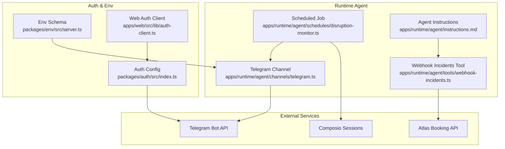
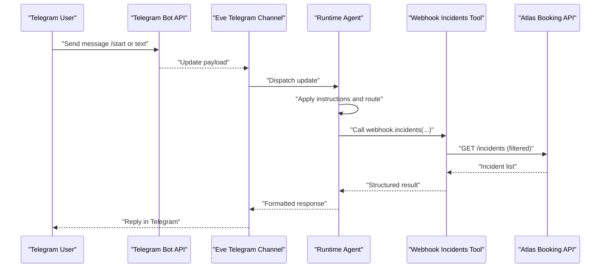
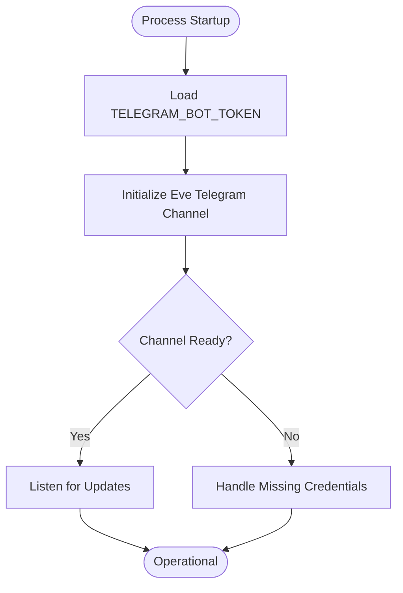
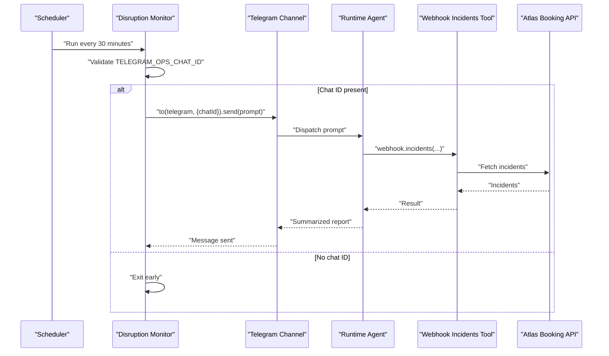
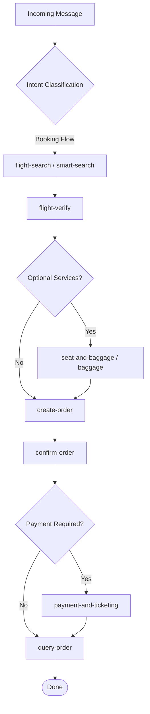
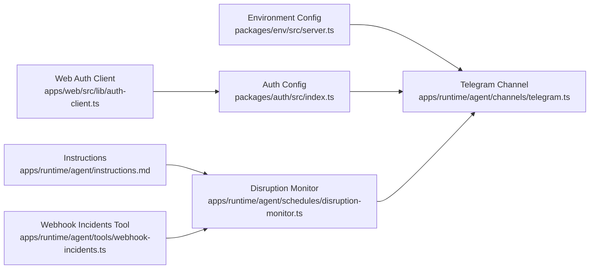

# Telegram Bot Channel

<cite>
**Referenced Files in This Document**
- [telegram.ts](file://apps/runtime/agent/channels/telegram.ts)
- [disruption-monitor.ts](file://apps/runtime/agent/schedules/disruption-monitor.ts)
- [instructions.md](file://apps/runtime/agent/instructions.md)
- [webhook-incidents.ts](file://apps/runtime/agent/tools/webhook-incidents.ts)
- [server.ts](file://packages/env/src/server.ts)
- [index.ts (auth)](file://packages/auth/src/index.ts)
- [auth-client.ts](file://apps/web/src/lib/auth-client.ts)
- [0000_breezy_la_nuit.sql](file://packages/db/src/migrations/0000_breezy_la_nuit.sql)
- [package.json (runtime)](file://apps/runtime/package.json)
</cite>

## Table of Contents

1. [Introduction](#introduction)
2. [Project Structure](#project-structure)
3. [Core Components](#core-components)
4. [Architecture Overview](#architecture-overview)
5. [Detailed Component Analysis](#detailed-component-analysis)
6. [Dependency Analysis](#dependency-analysis)
7. [Performance Considerations](#performance-considerations)
8. [Troubleshooting Guide](#troubleshooting-guide)
9. [Conclusion](#conclusion)
10. [Appendices](#appendices)

## Introduction

This document explains the Telegram bot channel implementation within the runtime agent. It covers how the Telegram channel is configured, how messages are routed and handled by the agent, how scheduled operations send proactive messages to Telegram, and how user sessions integrate with external services via Composio. It also provides guidance on command routing patterns, inline keyboard support, file sharing capabilities, conversation state management, rate limiting, error handling, testing strategies, scaling considerations, and monitoring metrics.

## Project Structure

The Telegram integration is implemented as a channel adapter that wires environment-based credentials into the Eve framework’s Telegram channel. The runtime agent uses this channel for both receiving incoming Telegram updates and sending outbound messages. A scheduled job periodically sends operational alerts to a designated Telegram chat using the same channel.

**Diagram sources**

- [telegram.ts:1-5](file://apps/runtime/agent/channels/telegram.ts#L1-L5)
- [disruption-monitor.ts:1-20](file://apps/runtime/agent/schedules/disruption-monitor.ts#L1-L20)
- [instructions.md:1-38](file://apps/runtime/agent/instructions.md#L1-L38)
- [webhook-incidents.ts:1-54](file://apps/runtime/agent/tools/webhook-incidents.ts#L1-L54)
- [index.ts (auth):1-42](file://packages/auth/src/index.ts#L1-L42)
- [server.ts:1-29](file://packages/env/src/server.ts#L1-L29)
- [auth-client.ts:1-7](file://apps/web/src/lib/auth-client.ts#L1-L7)

**Section sources**

- [telegram.ts:1-5](file://apps/runtime/agent/channels/telegram.ts#L1-L5)
- [disruption-monitor.ts:1-20](file://apps/runtime/agent/schedules/disruption-monitor.ts#L1-L20)
- [instructions.md:1-38](file://apps/runtime/agent/instructions.md#L1-L38)
- [webhook-incidents.ts:1-54](file://apps/runtime/agent/tools/webhook-incidents.ts#L1-L54)
- [server.ts:1-29](file://packages/env/src/server.ts#L1-L29)
- [index.ts (auth):1-42](file://packages/auth/src/index.ts#L1-L42)
- [auth-client.ts:1-7](file://apps/web/src/lib/auth-client.ts#L1-L7)

## Core Components

- Telegram Channel Adapter: Initializes the Telegram channel with a bot token sourced from environment variables.
- Scheduled Disruption Monitor: Periodically queries incident data and posts summaries to a Telegram ops chat.
- Agent Instructions: Define the conversation flow, tool usage, and safety rules for booking and post-booking tasks.
- Webhook Incidents Tool: Provides read-only access to flight incidents via the Atlas client.
- Environment Configuration: Declares required Telegram-related environment variables.
- Auth Integration: Integrates Telegram login via Better Auth and exposes a web client plugin.

Key responsibilities:

- Receive and process Telegram updates through the Eve framework’s Telegram channel.
- Route user inputs to the agent based on instructions and available tools.
- Send proactive notifications via scheduled jobs.
- Manage user sessions and integrations through Composio.

**Section sources**

- [telegram.ts:1-5](file://apps/runtime/agent/channels/telegram.ts#L1-L5)
- [disruption-monitor.ts:1-20](file://apps/runtime/agent/schedules/disruption-monitor.ts#L1-L20)
- [instructions.md:1-38](file://apps/runtime/agent/instructions.md#L1-L38)
- [webhook-incidents.ts:1-54](file://apps/runtime/agent/tools/webhook-incidents.ts#L1-L54)
- [server.ts:1-29](file://packages/env/src/server.ts#L1-L29)
- [index.ts (auth):1-42](file://packages/auth/src/index.ts#L1-L42)

## Architecture Overview

The runtime agent integrates with Telegram via the Eve framework’s Telegram channel. Incoming messages are processed according to agent instructions and may call tools like webhook-incidents to fetch data from external APIs. Scheduled jobs use the same channel to send proactive messages to a specific chat. Authentication for Telegram login is configured separately and integrated with the web application.

**Diagram sources**

- [telegram.ts:1-5](file://apps/runtime/agent/channels/telegram.ts#L1-L5)
- [instructions.md:1-38](file://apps/runtime/agent/instructions.md#L1-L38)
- [webhook-incidents.ts:1-54](file://apps/runtime/agent/tools/webhook-incidents.ts#L1-L54)

## Detailed Component Analysis

### Telegram Channel Setup

- Purpose: Configure the Telegram channel with a bot token from environment variables.
- Behavior: Delegates all Telegram I/O to the Eve framework; the runtime only supplies credentials.
- Extensibility: Additional options can be passed to the channel factory if needed.

**Diagram sources**

- [telegram.ts:1-5](file://apps/runtime/agent/channels/telegram.ts#L1-L5)
- [server.ts:1-29](file://packages/env/src/server.ts#L1-L29)

**Section sources**

- [telegram.ts:1-5](file://apps/runtime/agent/channels/telegram.ts#L1-L5)
- [server.ts:1-29](file://packages/env/src/server.ts#L1-L29)

### Scheduled Disruption Monitoring

- Purpose: Periodically check for new flight incidents and notify an operations chat.
- Behavior: Uses Eve schedules to run at a cron interval, constructs a prompt, and sends it to a specified chat ID via the Telegram channel.
- Safety: Skips execution if the target chat ID is not configured.

**Diagram sources**

- [disruption-monitor.ts:1-20](file://apps/runtime/agent/schedules/disruption-monitor.ts#L1-L20)
- [webhook-incidents.ts:1-54](file://apps/runtime/agent/tools/webhook-incidents.ts#L1-L54)

**Section sources**

- [disruption-monitor.ts:1-20](file://apps/runtime/agent/schedules/disruption-monitor.ts#L1-L20)
- [webhook-incidents.ts:1-54](file://apps/runtime/agent/tools/webhook-incidents.ts#L1-L54)

### Agent Instructions and Command Routing

- Purpose: Define the canonical workflow for flight bookings and post-booking tasks, including delegation to specialist subagents.
- Routing: The agent follows a strict sequence (search, verify, optional services, create order, confirm, pay, track). Tools are invoked based on user intent and context.
- Safety: Enforces idempotency constraints and prevents accidental retries on critical actions.

**Diagram sources**

- [instructions.md:1-38](file://apps/runtime/agent/instructions.md#L1-L38)

**Section sources**

- [instructions.md:1-38](file://apps/runtime/agent/instructions.md#L1-L38)

### File Sharing Capabilities

- Capability: The Telegram channel supports sending files (photos, documents, etc.) via the underlying Telegram Bot API.
- Usage: When the agent determines that a file should be shared (e.g., tickets, receipts), it instructs the channel to send the appropriate media type.
- Note: Specific file-handling logic is delegated to the Eve framework; ensure content types and sizes comply with Telegram limits.

[No sources needed since this section provides general guidance]

### Inline Keyboard Support

- Capability: Inline keyboards can be used to guide users through multi-step flows (e.g., selecting dates, confirming orders).
- Usage: Construct inline keyboard payloads when responding to user intents; handle callback queries to advance state.
- Note: Implementation details are managed by the Eve framework; focus on defining meaningful button labels and callbacks aligned with the agent’s workflow.

[No sources needed since this section provides general guidance]

### User State Management in Conversations

- Approach: Maintain conversation state within the agent’s session context. Use structured prompts and tool outputs to track progress across turns.
- External Sessions: For integrations (e.g., Google Calendar, Gmail), leverage Composio sessions to persist connection state per user.
- Persistence: Ensure sensitive identifiers (order numbers, PNRs) are treated as opaque values and never logged or repeated unnecessarily.

**Section sources**

- [instructions.md:1-38](file://apps/runtime/agent/instructions.md#L1-L38)

### Integrating with External Services via Telegram

- Pattern: Use tools to call external APIs (e.g., Atlas booking API) and relay results back to Telegram.
- Example: The webhook-incidents tool queries flight incidents and summarizes them for the user or ops chat.
- Security: Keep credentials out of logs and restrict access to necessary scopes.

**Section sources**

- [webhook-incidents.ts:1-54](file://apps/runtime/agent/tools/webhook-incidents.ts#L1-L54)

## Dependency Analysis

The Telegram channel depends on environment configuration and the Eve framework. Scheduled jobs depend on the channel and tools. Auth configuration integrates Telegram login with the web app.

**Diagram sources**

- [server.ts:1-29](file://packages/env/src/server.ts#L1-L29)
- [telegram.ts:1-5](file://apps/runtime/agent/channels/telegram.ts#L1-L5)
- [index.ts (auth):1-42](file://packages/auth/src/index.ts#L1-L42)
- [auth-client.ts:1-7](file://apps/web/src/lib/auth-client.ts#L1-L7)
- [disruption-monitor.ts:1-20](file://apps/runtime/agent/schedules/disruption-monitor.ts#L1-L20)
- [instructions.md:1-38](file://apps/runtime/agent/instructions.md#L1-L38)
- [webhook-incidents.ts:1-54](file://apps/runtime/agent/tools/webhook-incidents.ts#L1-L54)

**Section sources**

- [server.ts:1-29](file://packages/env/src/server.ts#L1-L29)
- [telegram.ts:1-5](file://apps/runtime/agent/channels/telegram.ts#L1-L5)
- [index.ts (auth):1-42](file://packages/auth/src/index.ts#L1-L42)
- [auth-client.ts:1-7](file://apps/web/src/lib/auth-client.ts#L1-L7)
- [disruption-monitor.ts:1-20](file://apps/runtime/agent/schedules/disruption-monitor.ts#L1-L20)
- [instructions.md:1-38](file://apps/runtime/agent/instructions.md#L1-L38)
- [webhook-incidents.ts:1-54](file://apps/runtime/agent/tools/webhook-incidents.ts#L1-L54)

## Performance Considerations

- Rate Limiting: Respect Telegram Bot API rate limits and implement backoff/retry for transient failures. Avoid excessive polling; prefer webhooks where supported by the framework.
- Concurrency: Process updates concurrently but guard against duplicate processing for the same update ID.
- Payload Size: Keep responses concise; split long outputs into multiple messages if needed.
- Scheduling: Tune cron intervals for scheduled jobs to balance freshness and load.

[No sources needed since this section provides general guidance]

## Troubleshooting Guide

- Missing Credentials: If TELEGRAM_BOT_TOKEN is absent, the channel cannot initialize. Validate environment variables at startup.
- Ops Chat Not Configured: The disruption monitor exits early without TELEGRAM_OPS_CHAT_ID. Ensure the variable is set in production.
- Auth Integration: Verify Telegram login plugin configuration and base URL settings.
- Database Fields: Ensure user records include Telegram identifiers for linking accounts.

Common checks:

- Confirm TELEGRAM_BOT_TOKEN and TELEGRAM_BOT_USERNAME are present and valid.
- Validate TELEGRAM_OPS_CHAT_ID for scheduled notifications.
- Review auth plugin setup and CORS/trusted origins.

**Section sources**

- [telegram.ts:1-5](file://apps/runtime/agent/channels/telegram.ts#L1-L5)
- [disruption-monitor.ts:1-20](file://apps/runtime/agent/schedules/disruption-monitor.ts#L1-L20)
- [index.ts (auth):1-42](file://packages/auth/src/index.ts#L1-L42)
- [server.ts:1-29](file://packages/env/src/server.ts#L1-L29)
- [0000_breezy_la_nuit.sql:29-41](file://packages/db/src/migrations/0000_breezy_la_nuit.sql#L29-L41)

## Conclusion

The Telegram bot channel is configured via the Eve framework with environment-driven credentials. The runtime agent processes messages according to well-defined instructions and leverages tools to interact with external services. Scheduled jobs enable proactive notifications to operations chats. Authentication integrates Telegram login with the web application, and user sessions are managed through Composio. Following the recommended practices for rate limiting, error handling, testing, scaling, and monitoring will ensure reliable and performant Telegram bot operations.

[No sources needed since this section summarizes without analyzing specific files]

## Appendices

### Environment Variables

- TELEGRAM_BOT_TOKEN: Required for initializing the Telegram channel and auth plugin.
- TELEGRAM_BOT_USERNAME: Used by the auth plugin for Telegram login.
- TELEGRAM_OPS_CHAT_ID: Target chat for scheduled operational notifications.

**Section sources**

- [server.ts:1-29](file://packages/env/src/server.ts#L1-L29)
- [index.ts (auth):1-42](file://packages/auth/src/index.ts#L1-L42)
- [disruption-monitor.ts:1-20](file://apps/runtime/agent/schedules/disruption-monitor.ts#L1-L20)

### Runtime Dependencies

- The runtime package includes dependencies such as the Eve framework, AI libraries, and Composio SDK, enabling channel integration, scheduling, and external service interactions.

**Section sources**

- [package.json (runtime):1-30](file://apps/runtime/package.json#L1-L30)
