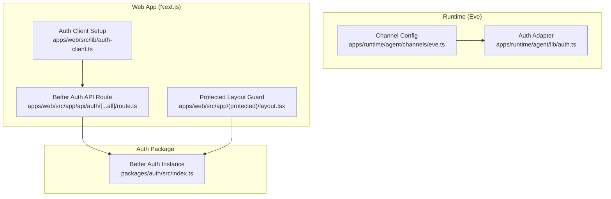
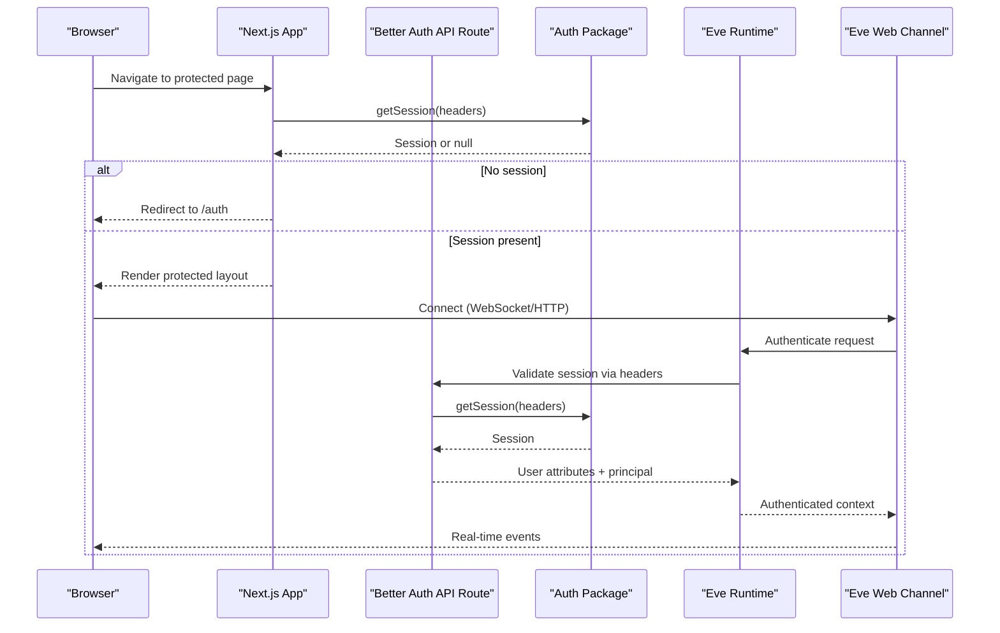
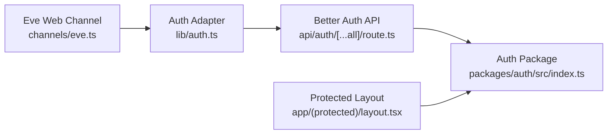

# Web Channel (Eve)

<cite>
**Referenced Files in This Document**
- [eve.ts](file://apps/runtime/agent/channels/eve.ts)
- [auth.ts](file://apps/runtime/agent/lib/auth.ts)
- [route.ts](file://apps/web/src/app/api/auth/[...all]/route.ts)
- [index.ts](file://packages/auth/src/index.ts)
- [layout.tsx](file://apps/web/src/app/(protected)/layout.tsx)
- [auth-client.ts](file://apps/web/src/lib/auth-client.ts)
- [SKILL.md](file://.agents/skills/better-auth-best-practices/SKILL.md)
</cite>

## Table of Contents

1. Introduction
2. Project Structure
3. Core Components
4. Architecture Overview
5. Detailed Component Analysis
6. Dependency Analysis
7. Performance Considerations
8. Troubleshooting Guide
9. Conclusion

## Introduction

This document explains the web channel implementation built with the Eve framework, integrated with Better Auth for session-based authentication and Vercel OIDC for environment-aware identity verification. It covers configuration setup, CORS behavior, session management, real-time communication patterns via Eve channels, customization options, file uploads through the web interface, rich media support, integration with existing Next.js applications, security considerations (including CSRF protection and secure sessions), troubleshooting connectivity issues, and performance optimization techniques.

## Project Structure

The web channel is defined as an Eve channel that composes multiple authentication strategies and enables CORS for browser-based clients. The Next.js application exposes a Better Auth API route to handle authentication flows and protects routes by validating sessions server-side.

**Diagram sources**

- [eve.ts:1-9](file://apps/runtime/agent/channels/eve.ts#L1-L9)
- [auth.ts:1-26](file://apps/runtime/agent/lib/auth.ts#L1-L26)
- [route.ts:1-5](file://apps/web/src/app/api/auth/[...all]/route.ts#L1-L5)
- [index.ts:1-43](file://packages/auth/src/index.ts#L1-L43)
- [layout.tsx:1-66](<file://apps/web/src/app/(protected)/layout.tsx#L1-L66>)
- [auth-client.ts:1-8](file://apps/web/src/lib/auth-client.ts#L1-L8)

**Section sources**

- [eve.ts:1-9](file://apps/runtime/agent/channels/eve.ts#L1-L9)
- [route.ts:1-5](file://apps/web/src/app/api/auth/[...all]/route.ts#L1-L5)
- [index.ts:1-43](file://packages/auth/src/index.ts#L1-L43)
- [layout.tsx:1-66](<file://apps/web/src/app/(protected)/layout.tsx#L1-L66>)
- [auth-client.ts:1-8](file://apps/web/src/lib/auth-client.ts#L1-L8)

## Core Components

- Eve Web Channel Configuration: Defines authentication providers and CORS settings for the web channel.
- Better Auth Integration: Provides session retrieval and user attributes mapping for Eve’s auth adapter.
- Next.js Auth API Route: Exposes Better Auth endpoints using Next.js handlers.
- Protected Routes: Enforces authentication on protected pages by checking sessions server-side.
- Auth Client: Initializes client-side plugins for Better Auth.

Key responsibilities:

- Authentication orchestration across local development, Vercel OIDC, and Better Auth sessions.
- CORS enabling for cross-origin requests from browsers.
- Session validation and redirection for protected areas.

**Section sources**

- [eve.ts:1-9](file://apps/runtime/agent/channels/eve.ts#L1-L9)
- [auth.ts:1-26](file://apps/runtime/agent/lib/auth.ts#L1-L26)
- [route.ts:1-5](file://apps/web/src/app/api/auth/[...all]/route.ts#L1-L5)
- [layout.tsx:1-66](<file://apps/web/src/app/(protected)/layout.tsx#L1-L66>)
- [auth-client.ts:1-8](file://apps/web/src/lib/auth-client.ts#L1-L8)

## Architecture Overview

The runtime configures an Eve channel with multiple auth strategies and CORS enabled. Browser clients authenticate via the Next.js Better Auth API route, which uses the centralized auth package. Protected layouts validate sessions server-side before rendering content. Real-time communication occurs over Eve channels once authenticated.

**Diagram sources**

- [layout.tsx:22-33](<file://apps/web/src/app/(protected)/layout.tsx#L22-L33>)
- [route.ts:1-5](file://apps/web/src/app/api/auth/[...all]/route.ts#L1-L5)
- [index.ts:10-43](file://packages/auth/src/index.ts#L10-L43)
- [auth.ts:4-25](file://apps/runtime/agent/lib/auth.ts#L4-L25)
- [eve.ts:6-9](file://apps/runtime/agent/channels/eve.ts#L6-L9)

## Detailed Component Analysis

### Eve Web Channel Configuration

- Composes multiple authentication strategies: Better Auth, Vercel OIDC, and local development mode.
- Enables CORS to allow browser-based clients to connect securely.
- Serves as the entry point for real-time communication after authentication.

Customization tips:

- Add or reorder auth strategies to prioritize preferred identity providers.
- Adjust CORS policy if you need to restrict origins beyond enabling all.

**Section sources**

- [eve.ts:1-9](file://apps/runtime/agent/channels/eve.ts#L1-L9)

### Better Auth Adapter for Eve

- Extracts session from incoming requests and maps user attributes (email, name, optional picture).
- Returns principal information required by Eve to identify users within channels.

Security notes:

- Ensure headers are passed correctly to getSession to avoid cookie/session mismatches.
- Validate issuer and principal types to prevent impersonation.

**Section sources**

- [auth.ts:1-26](file://apps/runtime/agent/lib/auth.ts#L1-L26)

### Next.js Better Auth API Route

- Exposes Better Auth endpoints using Next.js handlers for GET and POST.
- Centralizes authentication flows (login, logout, social sign-in) behind a single route.

Integration guidance:

- Use this route for client-side auth operations via the Better Auth client.
- Keep secrets and trusted origins configured in the auth package.

**Section sources**

- [route.ts:1-5](file://apps/web/src/app/api/auth/[...all]/route.ts#L1-L5)
- [index.ts:10-43](file://packages/auth/src/index.ts#L10-L43)

### Protected Layout Guard

- Validates sessions server-side before rendering protected content.
- Redirects unauthenticated users to the login page.

Best practices:

- Always perform session checks on server components/layouts for sensitive routes.
- Combine with input validation and authorization checks in server actions.

**Section sources**

- [layout.tsx:22-33](<file://apps/web/src/app/(protected)/layout.tsx#L22-L33>)

### Auth Client Setup

- Initializes Better Auth client with plugins such as Telegram integration and last login method tracking.
- Provides a consistent client interface for authentication operations across the app.

Usage:

- Call client methods to initiate login flows and manage sessions from the browser.

**Section sources**

- [auth-client.ts:1-8](file://apps/web/src/lib/auth-client.ts#L1-L8)

### Real-Time Communication Patterns

- Once authenticated, clients connect to the Eve web channel to receive real-time updates.
- Authentication context is established per request using session headers, ensuring secure event delivery.

Patterns:

- Use authenticated connections to subscribe to channel events.
- Handle reconnection and error states gracefully in the client.

[No sources needed since this section provides general guidance]

### Customizing Web Channel Behavior

- Modify the channel configuration to add new auth strategies or adjust CORS policies.
- Extend the auth adapter to include additional user attributes or custom claims.

Examples:

- Add enterprise OIDC providers by composing additional strategies.
- Restrict CORS to specific domains for production environments.

**Section sources**

- [eve.ts:6-9](file://apps/runtime/agent/channels/eve.ts#L6-L9)
- [auth.ts:4-25](file://apps/runtime/agent/lib/auth.ts#L4-L25)

### File Uploads Through the Web Interface

- Use Next.js API routes or server actions to handle multipart uploads.
- Validate file types and sizes server-side; store files securely and return references to clients.
- Integrate upload progress and error handling in the UI.

Recommendations:

- Stream large files to reduce memory usage.
- Use signed URLs for direct uploads to storage services when appropriate.

[No sources needed since this section provides general guidance]

### Rich Media Support

- Accept common media formats (images, audio, video) and provide previews where possible.
- Implement client-side compression or transcoding for optimal delivery.
- Cache media assets and use CDNs for improved performance.

[No sources needed since this section provides general guidance]

### Integrating With Existing Web Applications

- Embed the Eve channel client into your existing Next.js app.
- Reuse the Better Auth client for unified authentication across features.
- Protect routes and enforce session checks consistently.

[No sources needed since this section provides general guidance]

## Dependency Analysis

The web channel depends on:

- Eve channel primitives and auth utilities.
- Better Auth instance configured with database adapter, plugins, and trusted origins.
- Next.js handlers to expose auth endpoints.
- Server-side session checks in protected layouts.

**Diagram sources**

- [eve.ts:1-9](file://apps/runtime/agent/channels/eve.ts#L1-L9)
- [auth.ts:1-26](file://apps/runtime/agent/lib/auth.ts#L1-L26)
- [route.ts:1-5](file://apps/web/src/app/api/auth/[...all]/route.ts#L1-L5)
- [index.ts:1-43](file://packages/auth/src/index.ts#L1-L43)
- [layout.tsx:1-66](<file://apps/web/src/app/(protected)/layout.tsx#L1-L66>)

**Section sources**

- [eve.ts:1-9](file://apps/runtime/agent/channels/eve.ts#L1-L9)
- [auth.ts:1-26](file://apps/runtime/agent/lib/auth.ts#L1-L26)
- [route.ts:1-5](file://apps/web/src/app/api/auth/[...all]/route.ts#L1-L5)
- [index.ts:1-43](file://packages/auth/src/index.ts#L1-L43)
- [layout.tsx:1-66](<file://apps/web/src/app/(protected)/layout.tsx#L1-L66>)

## Performance Considerations

- Prefer server-side session checks to minimize client-side auth overhead.
- Enable CORS only for necessary origins in production to reduce attack surface.
- Optimize real-time message payloads; batch updates where possible.
- Use efficient data fetching patterns and avoid waterfalls in server components.
- Leverage caching for static assets and frequently accessed data.

[No sources needed since this section provides general guidance]

## Troubleshooting Guide

Common issues and resolutions:

- CORS errors: Ensure the channel has CORS enabled and trusted origins match your frontend domain.
- Session not found: Verify that headers are forwarded correctly to getSession and cookies are set appropriately.
- Redirect loops: Confirm protected layouts check sessions and redirect to /auth when missing.
- WebSocket connection failures: Check network policies, proxy configurations, and ensure the channel endpoint is reachable.

Security checklist:

- Use secure cookies and enable CSRF protections in Better Auth configuration.
- Avoid disabling origin checks unless absolutely necessary.
- Validate inputs and enforce authorization in server actions and API routes.

References:

- Better Auth best practices for session strategies, CSRF, and rate limiting.

**Section sources**

- [SKILL.md:86-131](file://.agents/skills/better-auth-best-practices/SKILL.md#L86-L131)
- [layout.tsx:22-33](<file://apps/web/src/app/(protected)/layout.tsx#L22-L33>)
- [route.ts:1-5](file://apps/web/src/app/api/auth/[...all]/route.ts#L1-L5)

## Conclusion

The web channel implementation leverages Eve’s flexible channel model combined with Better Auth and Vercel OIDC to provide secure, real-time communication for web clients. By configuring CORS, enforcing server-side session checks, and following security best practices, you can build robust integrations that scale safely. Customize authentication strategies, optimize performance, and troubleshoot connectivity issues using the guidance provided.
