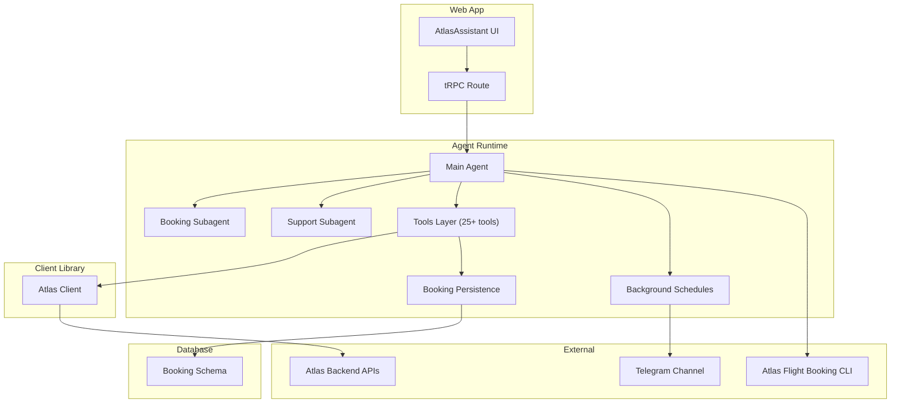
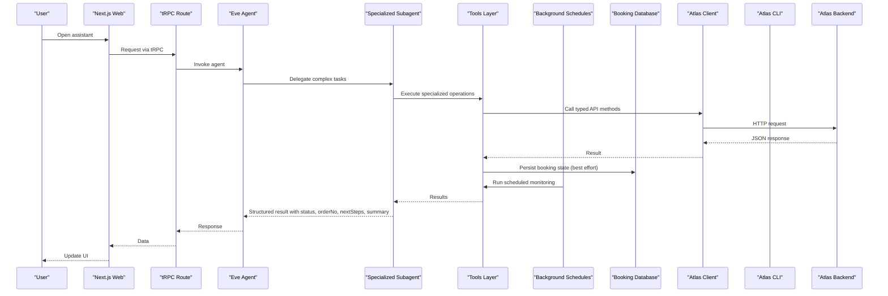
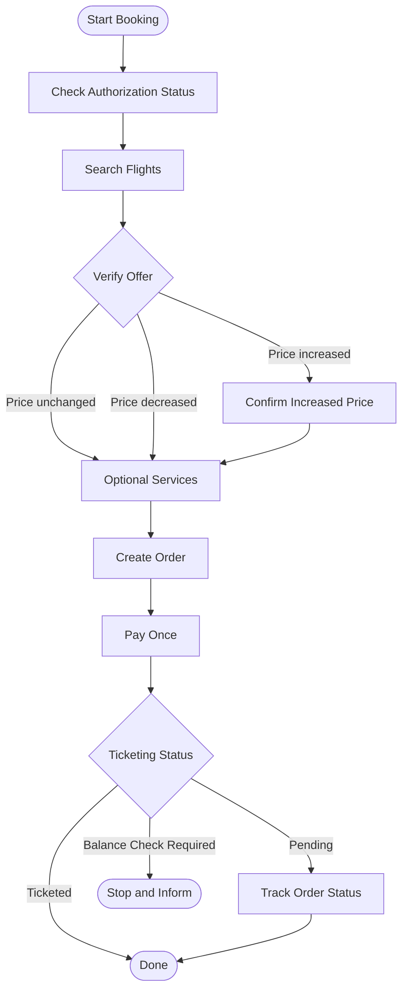
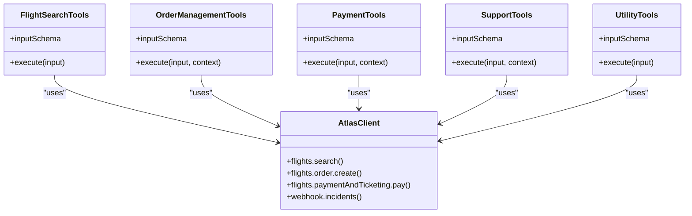
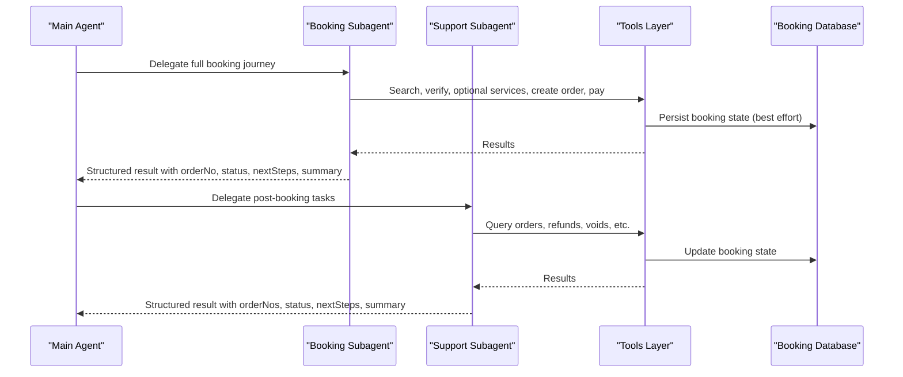
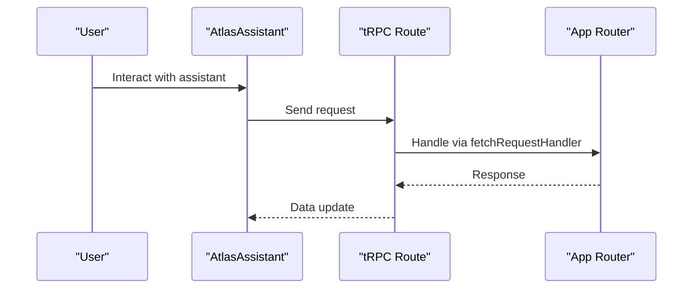
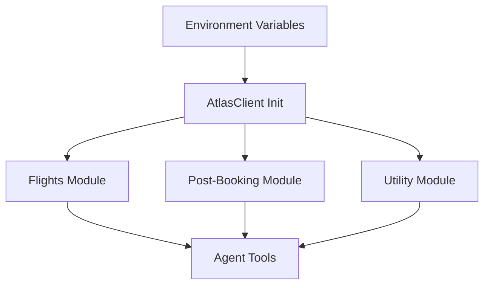
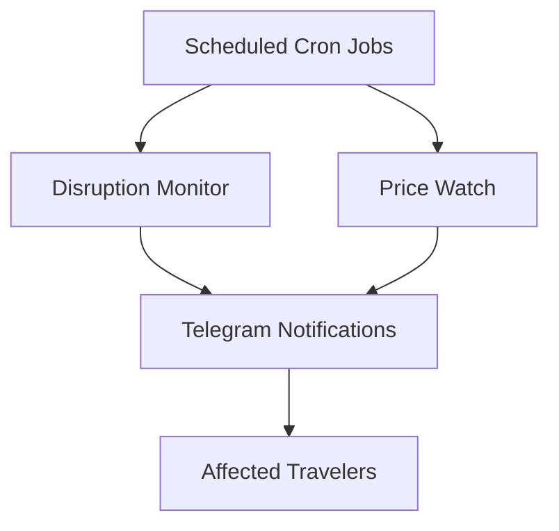
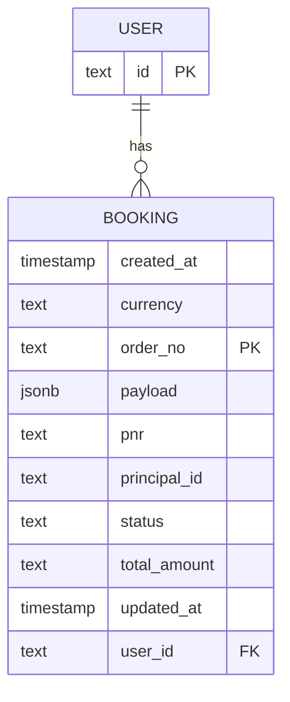
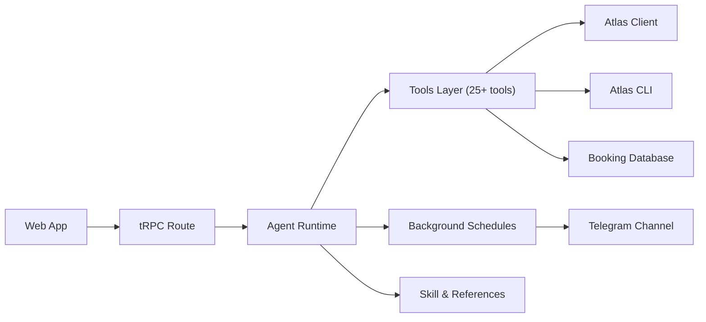

# Flight Booking Agent System

<cite>
**Referenced Files in This Document**
- [README.md](file://README.md)
- [package.json](file://package.json)
- [SKILL.md](file://.agents/skills/atlas-flight-booking/SKILL.md)
- [booking-workflow.md](file://.agents/skills/atlas-flight-booking/references/booking-workflow.md)
- [cli-contract.md](file://.agents/skills/atlas-flight-booking/references/cli-contract.md)
- [instructions.md](file://apps/runtime/agent/instructions.md)
- [agent.ts](file://apps/runtime/agent/agent.ts)
- [booking agent.ts](file://apps/runtime/agent/subagents/booking/agent.ts)
- [support agent.ts](file://apps/runtime/agent/subagents/support/agent.ts)
- [booking instructions.md](file://apps/runtime/agent/subagents/booking/instructions.md)
- [support instructions.md](file://apps/runtime/agent/subagents/support/instructions.md)
- [flight-search.ts](file://apps/runtime/agent/tools/flight-search.ts)
- [create-order.ts](file://apps/runtime/agent/tools/create-order.ts)
- [payment-and-ticketing.ts](file://apps/runtime/agent/tools/payment-and-ticketing.ts)
- [smart-search.ts](file://apps/runtime/agent/tools/smart-search.ts)
- [price-compare-search.ts](file://apps/runtime/agent/tools/price-compare-search.ts)
- [webhook-incidents.ts](file://apps/runtime/agent/tools/webhook-incidents.ts)
- [refunds.ts](file://apps/runtime/agent/tools/refunds.ts)
- [query-order.ts](file://apps/runtime/agent/tools/query-order.ts)
- [disruption-monitor.ts](file://apps/runtime/agent/schedules/disruption-monitor.ts)
- [price-watch.ts](file://apps/runtime/agent/schedules/price-watch.ts)
- [bookings.ts](file://apps/runtime/agent/lib/bookings.ts)
- [booking schema](file://packages/db/src/schema/booking.ts)
- [atlas-assistant.tsx](file://apps/web/src/components/atlas-assistant.tsx)
- [trpc route.ts](file://apps/web/src/app/api/trpc/[trpc]/route.ts)
- [index.ts](file://packages/atlas/src/index.ts)
</cite>

## Update Summary

**Changes Made**

- Enhanced booking and support subagents with structured outputs using Zod validation schemas
- Added standardized result formats with order numbers, status enums, next steps, and human-readable summaries
- Improved programmatic handling of subagent responses through consistent output structures
- Updated tool implementations to persist booking state with structured data for better tracking

## Table of Contents

1. Introduction
2. Project Structure
3. Core Components
4. Architecture Overview
5. Detailed Component Analysis
6. Background Scheduling System
7. Persistent Booking Database
8. Dependency Analysis
9. Performance Considerations
10. Troubleshooting Guide
11. Conclusion

## Introduction

This document explains the enhanced Flight Booking Agent System implemented in the Atlas monorepo. The system now features a comprehensive AI agent architecture with specialized subagents for end-to-end booking and post-booking support, backed by 25+ specialized tools, background scheduling for automated monitoring, and persistent booking state management. The system orchestrates flight search, verification, optional services (seats and baggage), order creation, payment, ticketing, and comprehensive post-booking support using well-defined CLI contracts and tool layers.

The enhanced architecture includes:

- A Next.js web application that hosts the user interface and tRPC endpoints
- An Eve-based runtime agent with comprehensive tools for booking operations
- Specialized subagents for end-to-end booking and post-booking support tasks with structured outputs
- Background scheduling for disruption monitoring and price tracking
- Persistent booking database schema with best-effort persistence
- A shared Atlas client package exposing typed APIs for flights and post-booking features
- Skill and reference documents that define safe workflows, authorization flows, and CLI usage rules

The design emphasizes safety checkpoints, explicit user approvals, idempotent reads, strict handling of side effects, and automated monitoring of flight disruptions and price changes.

## Project Structure

At a high level:

- apps/web: Next.js frontend with UI components and tRPC API routes
- apps/runtime: Eve agent runtime with comprehensive tools, subagents, schedules, and instructions
- packages/atlas: Typed client library for Atlas APIs (flights, post-booking, utility)
- packages/db: Persistent database schema for booking state management
- .agents/skills/atlas-flight-booking: Skill definition and references governing CLI usage and workflow

**Diagram sources**

- [atlas-assistant.tsx:122-173](file://apps/web/src/components/atlas-assistant.tsx#L122-L173)
- [trpc route.ts:6-13](file://apps/web/src/app/api/trpc/[trpc]/route.ts#L6-L13)
- [agent.ts:1-7](file://apps/runtime/agent/agent.ts#L1-L7)
- [booking agent.ts:1-25](file://apps/runtime/agent/subagents/booking/agent.ts#L1-L25)
- [support agent.ts:1-22](file://apps/runtime/agent/subagents/support/agent.ts#L1-L22)
- [disruption-monitor.ts:1-21](file://apps/runtime/agent/schedules/disruption-monitor.ts#L1-L21)
- [price-watch.ts:1-26](file://apps/runtime/agent/schedules/price-watch.ts#L1-L26)
- [bookings.ts:1-144](file://apps/runtime/agent/lib/bookings.ts#L1-L144)
- [booking schema:1-44](file://packages/db/src/schema/booking.ts#L1-L44)

**Section sources**

- [README.md:1-107](file://README.md#L1-L107)
- [package.json:1-66](file://package.json#L1-L66)

## Core Components

- **Enhanced Agent Runtime**: Defines the model and orchestrates tools and subagents according to safety rules and workflow references
- **Comprehensive Tools Layer**: 25+ specialized tools encapsulating specific booking operations with validation schemas and approval guards
- **Specialized Subagents**: Dedicated agents for end-to-end booking and post-booking support tasks with focused responsibilities and structured outputs
- **Background Scheduling**: Automated monitoring for flight disruptions and price changes via scheduled tasks
- **Persistent State Management**: Best-effort booking database schema for tracking order lifecycle events
- **Web Application**: Provides the assistant UI and tRPC endpoint to integrate with the backend
- **Atlas Client**: Centralizes API configuration and exposes typed modules for flights and post-booking

Key responsibilities:

- Enforce safe booking workflow and mandatory checkpoints across all subagents
- Preserve opaque IDs exactly as returned by external systems
- Require explicit user confirmation before side-effecting operations
- Provide clear status communication for pending or uncertain outcomes
- Monitor flight disruptions and price changes automatically
- Persist booking state with best-effort reliability
- Return structured outputs with standardized formats for programmatic handling

**Updated** Enhanced subagents now return structured outputs with Zod validation schemas including order numbers, status enums, next steps, and human-readable summaries for better programmatic handling.

**Section sources**

- [instructions.md:1-38](file://apps/runtime/agent/instructions.md#L1-L38)
- [booking instructions.md:1-21](file://apps/runtime/agent/subagents/booking/instructions.md#L1-L21)
- [support instructions.md:1-17](file://apps/runtime/agent/subagents/support/instructions.md#L1-L17)
- [SKILL.md:1-71](file://.agents/skills/atlas-flight-booking/SKILL.md#L1-L71)
- [booking-workflow.md:1-63](file://.agents/skills/atlas-flight-booking/references/booking-workflow.md#L1-L63)
- [cli-contract.md:1-78](file://.agents/skills/atlas-flight-booking/references/cli-contract.md#L1-L78)
- [bookings.ts:95-144](file://apps/runtime/agent/lib/bookings.ts#L95-L144)
- [booking agent.ts:9-23](file://apps/runtime/agent/subagents/booking/agent.ts#L9-L23)
- [support agent.ts:9-20](file://apps/runtime/agent/subagents/support/agent.ts#L9-L20)

## Architecture Overview

The enhanced system follows a layered architecture with specialized components:

- **Presentation**: Next.js UI component for the assistant panel
- **Integration**: tRPC route to bridge frontend requests to the agent runtime
- **Orchestration**: Main agent coordinates tools and delegates to specialized subagents
- **Execution**: Comprehensive tools call the Atlas client or invoke the CLI for booking operations
- **Background Processing**: Scheduled tasks monitor disruptions and track prices
- **Persistence**: Best-effort booking state management with database schema
- **External**: Atlas backend APIs, Atlas Flight Booking CLI, and Telegram notifications

**Diagram sources**

- [atlas-assistant.tsx:122-173](file://apps/web/src/components/atlas-assistant.tsx#L122-L173)
- [trpc route.ts:6-13](file://apps/web/src/app/api/trpc/[trpc]/route.ts#L6-L13)
- [booking agent.ts:1-25](file://apps/runtime/agent/subagents/booking/agent.ts#L1-L25)
- [support agent.ts:1-22](file://apps/runtime/agent/subagents/support/agent.ts#L1-L22)
- [disruption-monitor.ts:1-21](file://apps/runtime/agent/schedules/disruption-monitor.ts#L1-L21)
- [price-watch.ts:1-26](file://apps/runtime/agent/schedules/price-watch.ts#L1-L26)
- [bookings.ts:100-144](file://apps/runtime/agent/lib/bookings.ts#L100-L144)

## Detailed Component Analysis

### Enhanced Agent Orchestration and Safety Rules

The main agent now orchestrates a comprehensive ecosystem of specialized subagents and tools while maintaining strict safety protocols:

- **Identity and workflow**: The main agent defines identity and enforces a strict sequence: search, verify, optional services, create order, confirm, pay, track
- **Intelligent Delegation**: Complex journeys are delegated to the booking subagent; post-booking tasks go to the support subagent based on task complexity
- **Safety Enforcement**: Opaque IDs must be preserved; side effects must not be retried automatically; unclear results require status checks instead of retries
- **Background Monitoring**: Automated disruption monitoring and price tracking run independently of user interactions
- **Structured Outputs**: Both subagents return standardized results with order numbers, status enums, next steps, and human-readable summaries

**Updated** Subagents now use Zod validation schemas to ensure consistent output formats, making it easier for parent agents to process results programmatically.

**Diagram sources**

- [instructions.md:5-15](file://apps/runtime/agent/instructions.md#L5-L15)
- [booking instructions.md:5-13](file://apps/runtime/agent/subagents/booking/instructions.md#L5-L13)
- [booking-workflow.md:1-63](file://.agents/skills/atlas-flight-booking/references/booking-workflow.md#L1-L63)

**Section sources**

- [instructions.md:1-38](file://apps/runtime/agent/instructions.md#L1-L38)
- [booking instructions.md:1-21](file://apps/runtime/agent/subagents/booking/instructions.md#L1-L21)
- [support instructions.md:1-17](file://apps/runtime/agent/subagents/support/instructions.md#L1-L17)
- [SKILL.md:39-62](file://.agents/skills/atlas-flight-booking/SKILL.md#L39-L62)
- [booking agent.ts:9-23](file://apps/runtime/agent/subagents/booking/agent.ts#L9-L23)
- [support agent.ts:9-20](file://apps/runtime/agent/subagents/support/agent.ts#L9-L20)

### Comprehensive Tools Layer

The system now includes 25+ specialized tools organized into functional categories:

**Flight Search Tools:**

- `flight-search`: Basic flight search with validation
- `smart-search`: Intelligent search with flexible date handling
- `price-compare-search`: Multi-date fare comparison

**Order Management Tools:**

- `create-order`: Order creation with passenger details and booking state persistence
- `confirm-order`: Order finalization
- `query-order`: Order status and details
- `order-list`: Browse multiple orders

**Payment and Ticketing Tools:**

- `payment-and-ticketing`: Payment processing and ticket issuance with booking state persistence
- `balance`: Account balance checking
- `stop-ticket-issuance`: Halt ticket generation

**Post-Booking Support Tools:**

- `refunds`: Process refund requests with booking state persistence
- `void-order`: Cancel orders
- `regenerate-order`: Reissue tickets
- `post-ticketing-ancillaries`: Add services after ticketing

**PNR and Incident Management:**

- `extract-pnr`: Extract PNR from bookings
- `pnr-claim`: Claim existing PNRs
- `webhook-incidents`: Monitor flight disruptions

**Utility Tools:**

- `baggage`: Manage baggage options
- `seat-and-baggage`: Combined seat and baggage selection
- `email-query`: Email-based order lookup
- `get-offer`/`get-offer-price`: Offer retrieval
- `composio`: Integration with external services
- `route-export`: Export route information

**Diagram sources**

- [flight-search.ts:1-62](file://apps/runtime/agent/tools/flight-search.ts#L1-L62)
- [smart-search.ts:1-30](file://apps/runtime/agent/tools/smart-search.ts#L1-L30)
- [price-compare-search.ts:1-30](file://apps/runtime/agent/tools/price-compare-search.ts#L1-L30)
- [create-order.ts:1-70](file://apps/runtime/agent/tools/create-order.ts#L1-L70)
- [payment-and-ticketing.ts:1-25](file://apps/runtime/agent/tools/payment-and-ticketing.ts#L1-L25)
- [webhook-incidents.ts:1-54](file://apps/runtime/agent/tools/webhook-incidents.ts#L1-L54)
- [refunds.ts:1-27](file://apps/runtime/agent/tools/refunds.ts#L1-L27)
- [query-order.ts:1-19](file://apps/runtime/agent/tools/query-order.ts#L1-L19)

**Section sources**

- [flight-search.ts:1-62](file://apps/runtime/agent/tools/flight-search.ts#L1-L62)
- [smart-search.ts:1-30](file://apps/runtime/agent/tools/smart-search.ts#L1-L30)
- [price-compare-search.ts:1-30](file://apps/runtime/agent/tools/price-compare-search.ts#L1-L30)
- [create-order.ts:1-70](file://apps/runtime/agent/tools/create-order.ts#L1-L70)
- [payment-and-ticketing.ts:1-25](file://apps/runtime/agent/tools/payment-and-ticketing.ts#L1-L25)
- [webhook-incidents.ts:1-54](file://apps/runtime/agent/tools/webhook-incidents.ts#L1-L54)
- [refunds.ts:1-27](file://apps/runtime/agent/tools/refunds.ts#L1-L27)
- [query-order.ts:1-19](file://apps/runtime/agent/tools/query-order.ts#L1-L19)

### Specialized Subagents

The system now features two dedicated subagents with focused responsibilities and structured outputs:

**Booking Subagent:**

- Handles end-to-end booking flow with gated approvals at each critical step
- Follows strict workflow: search → verify → optional services → create order → confirm → pay → track
- Manages passenger details collection and validation
- Ensures single-use execution for order creation and payment
- Returns structured results with order number, status enum, next steps, and human-readable summary

**Support Subagent:**

- Manages post-booking tasks including order status, disruptions, PNR management
- Handles refunds, voids, ticket regeneration, and ancillary services
- Monitors webhook incidents for schedule changes and cancellations
- Provides comprehensive order lifecycle management
- Returns structured results with order numbers array, status enum, next steps, and human-readable summary

**Updated** Both subagents now use Zod validation schemas to ensure consistent output formats, making it easier for parent agents to process results programmatically.

**Diagram sources**

- [booking agent.ts:1-25](file://apps/runtime/agent/subagents/booking/agent.ts#L1-L25)
- [support agent.ts:1-22](file://apps/runtime/agent/subagents/support/agent.ts#L1-L22)
- [booking instructions.md:5-13](file://apps/runtime/agent/subagents/booking/instructions.md#L5-L13)
- [support instructions.md:5-16](file://apps/runtime/agent/subagents/support/instructions.md#L5-L16)
- [bookings.ts:100-144](file://apps/runtime/agent/lib/bookings.ts#L100-L144)

**Section sources**

- [booking agent.ts:1-25](file://apps/runtime/agent/subagents/booking/agent.ts#L1-L25)
- [support agent.ts:1-22](file://apps/runtime/agent/subagents/support/agent.ts#L1-L22)
- [booking instructions.md:1-21](file://apps/runtime/agent/subagents/booking/instructions.md#L1-L21)
- [support instructions.md:1-17](file://apps/runtime/agent/subagents/support/instructions.md#L1-L17)
- [instructions.md:17-24](file://apps/runtime/agent/instructions.md#L17-L24)

### Web Application Integration

- Assistant UI: Renders a collapsible panel with suggestions and composer; currently placeholder until AI backend integration
- tRPC route: Configures context and forwards requests to the router for processing

**Diagram sources**

- [atlas-assistant.tsx:122-173](file://apps/web/src/components/atlas-assistant.tsx#L122-L173)
- [trpc route.ts:6-13](file://apps/web/src/app/api/trpc/[trpc]/route.ts#L6-L13)

**Section sources**

- [atlas-assistant.tsx:122-173](file://apps/web/src/components/atlas-assistant.tsx#L122-L173)
- [trpc route.ts:6-13](file://apps/web/src/app/api/trpc/[trpc]/route.ts#L6-L13)

### Atlas Client Configuration

- Centralizes environment-based configuration for API URL and credentials
- Exposes typed modules for flights and post-booking operations

**Diagram sources**

- [index.ts:1-41](file://packages/atlas/src/index.ts#L1-L41)

**Section sources**

- [index.ts:1-41](file://packages/atlas/src/index.ts#L1-L41)

## Background Scheduling System

The enhanced system includes automated background scheduling for continuous monitoring and proactive customer service:

**Disruption Monitor:**

- Runs every 30 minutes to check for new flight incidents
- Sends Telegram notifications with incident summaries
- Filters out previously reported incidents to avoid duplicate alerts
- Provides actionable guidance for affected travelers

**Price Watch:**

- Runs daily at 2 AM to monitor fare changes
- Compares current prices against previously reported fares
- Reports meaningful price drops with route, dates, airline, and new fare details
- Configurable via environment variables for specific routes

**Diagram sources**

- [disruption-monitor.ts:1-21](file://apps/runtime/agent/schedules/disruption-monitor.ts#L1-L21)
- [price-watch.ts:1-26](file://apps/runtime/agent/schedules/price-watch.ts#L1-L26)

**Section sources**

- [disruption-monitor.ts:1-21](file://apps/runtime/agent/schedules/disruption-monitor.ts#L1-L21)
- [price-watch.ts:1-26](file://apps/runtime/agent/schedules/price-watch.ts#L1-L26)

## Persistent Booking Database

The system now includes a robust database schema for tracking booking lifecycle events with best-effort persistence:

**Booking Schema Features:**

- Primary key: Atlas order number (natural key)
- Best-effort snapshot of raw API responses at latest lifecycle event
- User attribution with support for both authenticated users and channel principals
- Timestamps for created_at and updated_at with automatic updates
- Index on userId for efficient querying

**Persistence Strategy:**

- Upsert operations on conflict (orderNo) to maintain latest state
- Best-effort design: database failures never block booking flow
- Flexible payload storage for evolving API structures
- Support for various field names across different API responses

**Updated** Tools now persist booking state during key operations like order creation, payment, and refund requests to maintain comprehensive tracking of booking lifecycle events.

**Diagram sources**

- [booking schema:1-44](file://packages/db/src/schema/booking.ts#L1-L44)

**Section sources**

- [booking schema:1-44](file://packages/db/src/schema/booking.ts#L1-L44)
- [bookings.ts:1-144](file://apps/runtime/agent/lib/bookings.ts#L1-L144)
- [create-order.ts:14-17](file://apps/runtime/agent/tools/create-order.ts#L14-L17)
- [payment-and-ticketing.ts:14-17](file://apps/runtime/agent/tools/payment-and-ticketing.ts#L14-L17)
- [refunds.ts:14-17](file://apps/runtime/agent/tools/refunds.ts#L14-L17)

## Dependency Analysis

- The agent runtime depends on comprehensive tools which depend on the Atlas client, CLI contract, and database persistence
- The web app depends on tRPC to communicate with the backend; the assistant UI is decoupled from implementation details
- Background schedules operate independently with their own dependencies on channels and tools
- Skill and reference documents constrain tool usage and ensure consistent behavior across environments

**Diagram sources**

- [trpc route.ts:6-13](file://apps/web/src/app/api/trpc/[trpc]/route.ts#L6-L13)
- [agent.ts:1-7](file://apps/runtime/agent/agent.ts#L1-L7)
- [disruption-monitor.ts:1-21](file://apps/runtime/agent/schedules/disruption-monitor.ts#L1-L21)
- [price-watch.ts:1-26](file://apps/runtime/agent/schedules/price-watch.ts#L1-L26)
- [bookings.ts:1-144](file://apps/runtime/agent/lib/bookings.ts#L1-L144)

**Section sources**

- [package.json:1-66](file://package.json#L1-L66)
- [cli-contract.md:1-78](file://.agents/skills/atlas-flight-booking/references/cli-contract.md#L1-L78)

## Performance Considerations

- Prefer batched or parallel searches when supporting flexible dates, while preserving per-date results separately
- Avoid unnecessary retries for side-effecting operations; rely on status queries for clarity
- Use minimal payloads and validated schemas to reduce parsing overhead
- Cache read-only data where appropriate and avoid redundant network calls
- Implement best-effort database persistence to prevent blocking critical booking flows
- Optimize background scheduling intervals to balance responsiveness with resource usage
- Use pagination for large result sets in incident queries and order listings
- Leverage structured outputs from subagents to minimize processing overhead in parent agents

**Updated** Structured outputs from subagents reduce parsing overhead and enable more efficient programmatic handling of results.

## Troubleshooting Guide

Common issues and resolutions:

- Authorization required: Follow the login flow and poll once after user confirmation; resume only when authorized
- Unclear payment result: Query order status instead of retrying payment; never reuse confirmation IDs
- Pending ticketing: Explain ongoing processing and provide order link if available; do not treat as failure
- Balance insufficient: Inform user to check balance; do not attempt payment again without resolution
- Seat unavailability: Present fallback options before order creation; map natural language choices to CLI seat policy
- Database persistence failures: Continue booking flow despite database errors (best-effort design)
- Background schedule failures: Check environment variables and channel connectivity for scheduled tasks
- Subagent output validation errors: Ensure input data matches expected Zod schemas for structured outputs

**Updated** New troubleshooting guidance for handling structured output validation errors from subagents.

Operational references:

- Authorization and diagnostics commands
- Search, verify, optional services, order, payment, and status commands
- Response envelope fields and branching logic
- Background schedule configuration and monitoring
- Database schema relationships and query patterns
- Subagent structured output schemas and validation rules

**Section sources**

- [cli-contract.md:9-28](file://.agents/skills/atlas-flight-booking/references/cli-contract.md#L9-L28)
- [cli-contract.md:29-78](file://.agents/skills/atlas-flight-booking/references/cli-contract.md#L29-L78)
- [booking-workflow.md:1-63](file://.agents/skills/atlas-flight-booking/references/booking-workflow.md#L1-L63)
- [SKILL.md:39-62](file://.agents/skills/atlas-flight-booking/SKILL.md#L39-L62)
- [bookings.ts:140-144](file://apps/runtime/agent/lib/bookings.ts#L140-L144)
- [booking agent.ts:9-23](file://apps/runtime/agent/subagents/booking/agent.ts#L9-L23)
- [support agent.ts:9-20](file://apps/runtime/agent/subagents/support/agent.ts#L9-L20)

## Conclusion

The enhanced Flight Booking Agent System integrates a comprehensive AI agent architecture with specialized subagents, 25+ specialized tools, background scheduling for automated monitoring, and persistent booking state management. The system delivers safe and reliable flight booking experiences through explicit approvals, preserved opaque identifiers, clear status communication, and automated disruption and price monitoring.

The modular structure allows easy extension for additional tools, subagents, and integrations while maintaining consistency through shared contracts and references. The best-effort persistence design ensures that database failures never block critical booking flows, while background scheduling provides proactive customer service through automated monitoring of flight disruptions and price changes.

Key improvements include:

- Specialized subagents for focused booking and support responsibilities with structured outputs
- Comprehensive tool coverage for all aspects of flight booking lifecycle
- Automated background monitoring for disruptions and price changes
- Robust database schema for tracking booking state with best-effort persistence
- Enhanced safety protocols and error handling throughout the system
- Standardized result formats with order numbers, status enums, next steps, and human-readable summaries for better programmatic handling

**Updated** The addition of structured outputs using Zod validation schemas enhances programmatic handling of subagent responses, making the system more reliable and easier to integrate with other components.

[No sources needed since this section summarizes without analyzing specific files]
