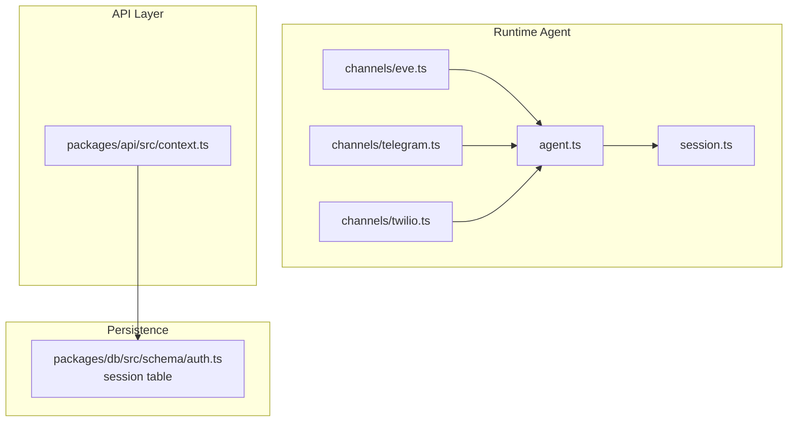
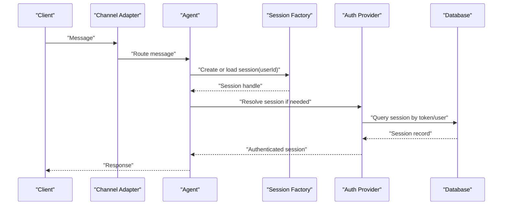
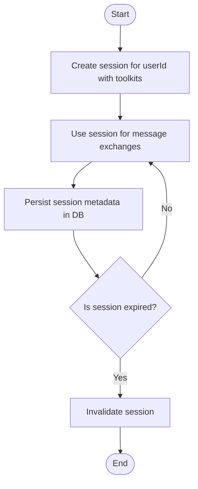
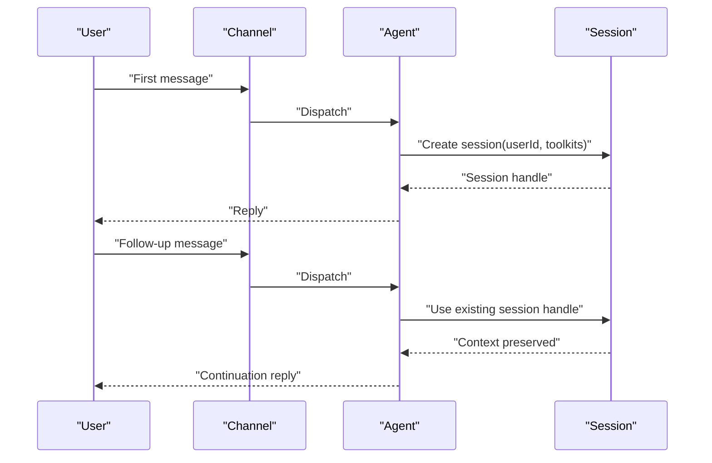
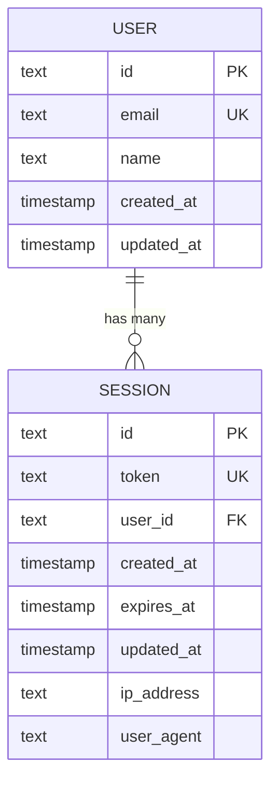
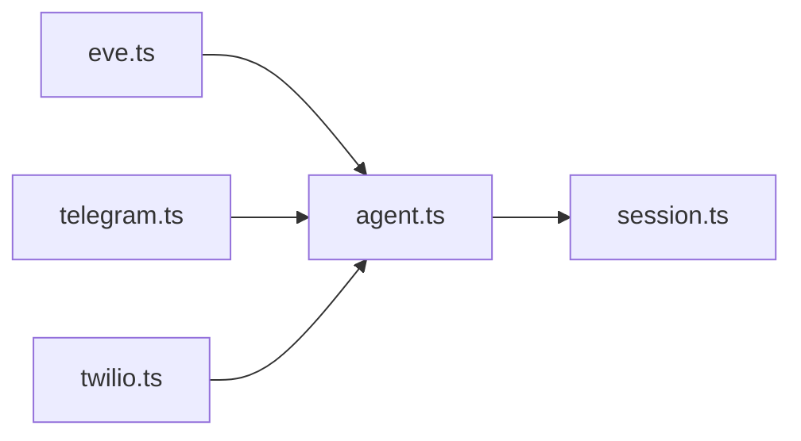
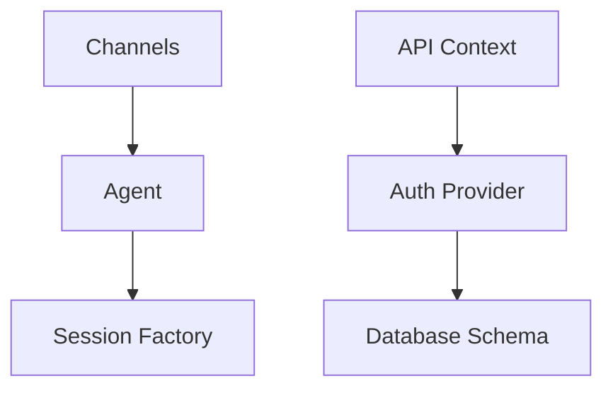

# Session Management

<cite>
**Referenced Files in This Document**
- [session.ts](file://apps/runtime/agent/session.ts)
- [agent.ts](file://apps/runtime/agent/agent.ts)
- [eve.ts](file://apps/runtime/agent/channels/eve.ts)
- [telegram.ts](file://apps/runtime/agent/channels/telegram.ts)
- [twilio.ts](file://apps/runtime/agent/channels/twilio.ts)
- [auth.ts](file://packages/db/src/schema/auth.ts)
- [context.ts](file://packages/api/src/context.ts)
</cite>

## Table of Contents

1. Introduction
2. Project Structure
3. Core Components
4. Architecture Overview
5. Detailed Component Analysis
6. Dependency Analysis
7. Performance Considerations
8. Troubleshooting Guide
9. Conclusion

## Introduction

This document explains the session management system that underpins conversation state and context persistence across channels. It covers how sessions are created, stored, and maintained; how conversation context is preserved across message exchanges; and how memory and storage are managed for scalability. It also provides guidance on implementing timeouts, cleanup, recovery, and best practices for multi-turn interactions with large conversations.

## Project Structure

The runtime agent integrates multiple messaging channels (Eve, Telegram, Twilio) and uses a session abstraction to manage toolkits and conversation context. Authentication and user sessions are persisted in a relational database via schema definitions, while API requests resolve the current session through an authentication provider.

**Diagram sources**

- [agent.ts:1-8](file://apps/runtime/agent/agent.ts#L1-L8)
- [session.ts:1-19](file://apps/runtime/agent/session.ts#L1-L19)
- [eve.ts:1-10](file://apps/runtime/agent/channels/eve.ts#L1-L10)
- [telegram.ts:1-6](file://apps/runtime/agent/channels/telegram.ts#L1-L6)
- [twilio.ts:1-7](file://apps/runtime/agent/channels/twilio.ts#L1-L7)
- [context.ts:1-15](file://packages/api/src/context.ts#L1-L15)
- [auth.ts:21-39](file://packages/db/src/schema/auth.ts#L21-L39)

**Section sources**

- [agent.ts:1-8](file://apps/runtime/agent/agent.ts#L1-L8)
- [session.ts:1-19](file://apps/runtime/agent/session.ts#L1-L19)
- [eve.ts:1-10](file://apps/runtime/agent/channels/eve.ts#L1-L10)
- [telegram.ts:1-6](file://apps/runtime/agent/channels/telegram.ts#L1-L6)
- [twilio.ts:1-7](file://apps/runtime/agent/channels/twilio.ts#L1-L7)
- [context.ts:1-15](file://packages/api/src/context.ts#L1-L15)
- [auth.ts:21-39](file://packages/db/src/schema/auth.ts#L21-L39)

## Core Components

- Agent definition: Declares the model used by the runtime agent.
- Session factory: Creates a session bound to a set of toolkits for integrations such as calendar, email, maps, and messaging.
- Channel adapters: Configure per-channel settings and authentication where applicable.
- API context: Resolves the authenticated user session from incoming requests.
- Database schema: Defines the persistent session entity with lifecycle fields and indexes.

Key responsibilities:

- Create and associate sessions with users and toolkits.
- Provide channel-specific configuration for inbound/outbound messaging.
- Resolve active sessions for API endpoints to enforce authorization.
- Persist session metadata for auditing and lifecycle management.

**Section sources**

- [agent.ts:1-8](file://apps/runtime/agent/agent.ts#L1-L8)
- [session.ts:1-19](file://apps/runtime/agent/session.ts#L1-L19)
- [eve.ts:1-10](file://apps/runtime/agent/channels/eve.ts#L1-L10)
- [telegram.ts:1-6](file://apps/runtime/agent/channels/telegram.ts#L1-L6)
- [twilio.ts:1-7](file://apps/runtime/agent/channels/twilio.ts#L1-L7)
- [context.ts:1-15](file://packages/api/src/context.ts#L1-L15)
- [auth.ts:21-39](file://packages/db/src/schema/auth.ts#L21-L39)

## Architecture Overview

The system separates concerns between channel transport, session orchestration, and persistence:

- Channels receive messages and route them to the agent.
- The agent uses a session to maintain conversation context and toolkit bindings.
- API endpoints use the auth provider to resolve the current user session for authorization.
- The database stores session records with timestamps and identifiers for lifecycle tracking.

**Diagram sources**

- [session.ts:1-19](file://apps/runtime/agent/session.ts#L1-L19)
- [context.ts:1-15](file://packages/api/src/context.ts#L1-L15)
- [auth.ts:21-39](file://packages/db/src/schema/auth.ts#L21-L39)

## Detailed Component Analysis

### Session Lifecycle

- Creation: A session is created for a user with a predefined set of toolkits. This binds the agent’s capabilities to the session.
- Usage: Each message exchange within the same session preserves context via the session handle returned at creation.
- Persistence: User-level sessions are persisted in the database with timestamps and identifiers for lifecycle management.
- Termination: Sessions expire based on configured expiration times; expired sessions are invalidated by the auth layer.

**Diagram sources**

- [session.ts:1-19](file://apps/runtime/agent/session.ts#L1-L19)
- [auth.ts:21-39](file://packages/db/src/schema/auth.ts#L21-L39)

**Section sources**

- [session.ts:1-19](file://apps/runtime/agent/session.ts#L1-L19)
- [auth.ts:21-39](file://packages/db/src/schema/auth.ts#L21-L39)

### Context Preservation Across Message Exchanges

- The session object returned at creation acts as the context handle for subsequent interactions.
- Toolkits attached to the session enable cross-service operations within the same conversation thread.
- For multi-turn conversations, reuse the same session handle to preserve conversation history and state.

**Diagram sources**

- [session.ts:1-19](file://apps/runtime/agent/session.ts#L1-L19)

**Section sources**

- [session.ts:1-19](file://apps/runtime/agent/session.ts#L1-L19)

### Storage Mechanisms and Data Structures

- Persistent session entity: Stores identifiers, tokens, timestamps, and user linkage for lifecycle control and auditing.
- Indexing: An index on user_id supports efficient lookup of sessions per user.
- API resolution: The API context retrieves the current session using headers, enabling authorization checks.

**Diagram sources**

- [auth.ts:4-39](file://packages/db/src/schema/auth.ts#L4-L39)

**Section sources**

- [auth.ts:21-39](file://packages/db/src/schema/auth.ts#L21-L39)
- [context.ts:1-15](file://packages/api/src/context.ts#L1-L15)

### Channel Integration and Session Maintenance

- Eve channel: Configured with authentication providers and CORS settings.
- Telegram channel: Configured with bot credentials.
- Twilio channel: Configured with phone number and allowed senders.
- These channels integrate with the agent, which uses sessions to maintain conversation state per user.

**Diagram sources**

- [eve.ts:1-10](file://apps/runtime/agent/channels/eve.ts#L1-L10)
- [telegram.ts:1-6](file://apps/runtime/agent/channels/telegram.ts#L1-L6)
- [twilio.ts:1-7](file://apps/runtime/agent/channels/twilio.ts#L1-L7)
- [agent.ts:1-8](file://apps/runtime/agent/agent.ts#L1-L8)
- [session.ts:1-19](file://apps/runtime/agent/session.ts#L1-L19)

**Section sources**

- [eve.ts:1-10](file://apps/runtime/agent/channels/eve.ts#L1-L10)
- [telegram.ts:1-6](file://apps/runtime/agent/channels/telegram.ts#L1-L6)
- [twilio.ts:1-7](file://apps/runtime/agent/channels/twilio.ts#L1-L7)
- [agent.ts:1-8](file://apps/runtime/agent/agent.ts#L1-L8)
- [session.ts:1-19](file://apps/runtime/agent/session.ts#L1-L19)

### Creating New Sessions

- Use the session factory to create a session for a given user, binding it to a set of toolkits required for the conversation.
- Reuse the returned session handle for all subsequent interactions in that conversation thread.

**Section sources**

- [session.ts:1-19](file://apps/runtime/agent/session.ts#L1-L19)

### Managing Conversation History

- Maintain a single session handle per conversation thread to preserve context across turns.
- Avoid creating new sessions for follow-up messages unless explicitly starting a new conversation.

**Section sources**

- [session.ts:1-19](file://apps/runtime/agent/session.ts#L1-L19)

### Implementing Session Timeouts

- Leverage the session entity’s expiration field to determine validity.
- On each request, validate the session’s expiration before processing; reject expired sessions.

**Section sources**

- [auth.ts:21-39](file://packages/db/src/schema/auth.ts#L21-L39)

### Handling Session Recovery

- If a session is missing or invalid, create a new session for the user with the appropriate toolkits.
- Ensure downstream components reinitialize context based on the new session handle.

**Section sources**

- [session.ts:1-19](file://apps/runtime/agent/session.ts#L1-L19)

## Dependency Analysis

- The agent depends on the session factory to obtain a context handle for toolkits.
- Channels depend on the agent to process messages.
- The API context depends on the auth provider to resolve sessions from request headers.
- The database schema defines the session entity used by the auth provider.

**Diagram sources**

- [agent.ts:1-8](file://apps/runtime/agent/agent.ts#L1-L8)
- [session.ts:1-19](file://apps/runtime/agent/session.ts#L1-L19)
- [context.ts:1-15](file://packages/api/src/context.ts#L1-L15)
- [auth.ts:21-39](file://packages/db/src/schema/auth.ts#L21-L39)

**Section sources**

- [agent.ts:1-8](file://apps/runtime/agent/agent.ts#L1-L8)
- [session.ts:1-19](file://apps/runtime/agent/session.ts#L1-L19)
- [context.ts:1-15](file://packages/api/src/context.ts#L1-L15)
- [auth.ts:21-39](file://packages/db/src/schema/auth.ts#L21-L39)

## Performance Considerations

- Large conversations:
  - Keep only necessary context in memory; offload long histories to persistent storage when feasible.
  - Avoid recreating sessions for follow-ups; reuse handles to minimize overhead.
- Serialization:
  - Minimize payload duplication when passing data across boundaries; prefer references where possible.
- I/O efficiency:
  - Cache frequent reads (e.g., config or small lookups) in memory to reduce synchronous storage calls.
- Cleanup:
  - Periodically purge expired sessions and archive old conversation logs to prevent unbounded growth.

[No sources needed since this section provides general guidance]

## Troubleshooting Guide

- Session not found:
  - Verify that the session exists and is not expired; recreate if necessary.
- Authorization failures:
  - Ensure the API context correctly resolves the session from request headers.
- Channel issues:
  - Confirm channel configurations (credentials, CORS, allowed senders) are correct.

**Section sources**

- [context.ts:1-15](file://packages/api/src/context.ts#L1-L15)
- [eve.ts:1-10](file://apps/runtime/agent/channels/eve.ts#L1-L10)
- [telegram.ts:1-6](file://apps/runtime/agent/channels/telegram.ts#L1-L6)
- [twilio.ts:1-7](file://apps/runtime/agent/channels/twilio.ts#L1-L7)

## Conclusion

The session management system combines a runtime session factory with persistent session records to support multi-turn conversations across channels. By reusing session handles, enforcing expiration, and maintaining clean separation between channels, agent logic, and persistence, the system scales to handle large conversations while preserving context reliably. Follow the recommended patterns for creation, reuse, timeout handling, and cleanup to ensure robust operation.
