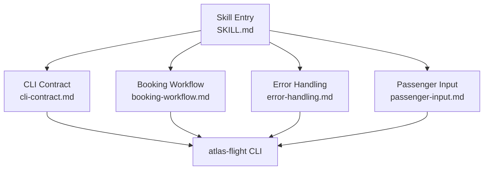
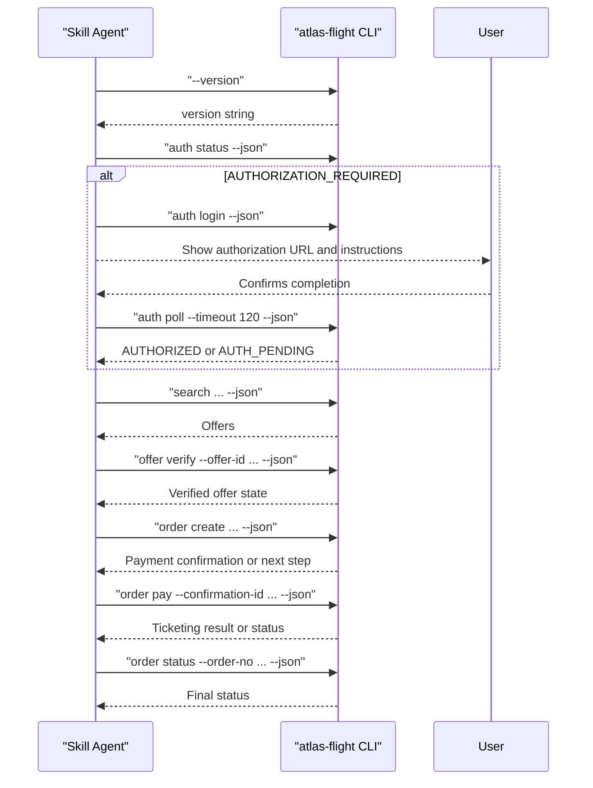
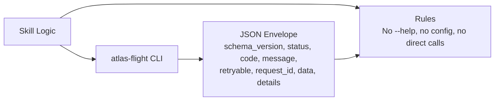

# CLI Contract and Commands

<cite>
**Referenced Files in This Document**
- [cli-contract.md](file://.agents/skills/atlas-flight-booking/references/cli-contract.md)
- [SKILL.md](file://.agents/skills/atlas-flight-booking/SKILL.md)
- [booking-workflow.md](file://.agents/skills/atlas-flight-booking/references/booking-workflow.md)
- [error-handling.md](file://.agents/skills/atlas-flight-booking/references/error-handling.md)
- [passenger-input.md](file://.agents/skills/atlas-flight-booking/references/passenger-input.md)
</cite>

## Table of Contents

1. Introduction
2. Project Structure
3. Core Components
4. Architecture Overview
5. Detailed Component Analysis
6. Dependency Analysis
7. Performance Considerations
8. Troubleshooting Guide
9. Conclusion
10. Appendices

## Introduction

This document defines the CLI contract that governs how a skill interacts with the atlas-flight booking tool. It specifies every supported command, required parameters, input/output formats, execution patterns, authentication handling, version compatibility, error codes, retry behavior, timeouts, and troubleshooting guidance. It is intended for developers integrating or operating the skill so they can construct valid commands and handle responses deterministically.

## Project Structure

The CLI contract is defined within the skill’s reference materials and enforced by the skill’s entry rules. The relevant files are:

- cli-contract.md: Canonical command set, flags, response envelope, and operational rules.
- SKILL.md: Version requirements, installation/upgrade flow, authorization prerequisites, and high-level workflow constraints.
- booking-workflow.md: End-to-end process from search to ticketing, including checkpoints and side-effect safety.
- error-handling.md: Stable error codes and agent behaviors for all phases.
- passenger-input.md: Passenger payload construction and one-time delivery via stdin or file.

**Diagram sources**

- [SKILL.md:1-71](file://.agents/skills/atlas-flight-booking/SKILL.md#L1-L71)
- [cli-contract.md:1-78](file://.agents/skills/atlas-flight-booking/references/cli-contract.md#L1-L78)
- [booking-workflow.md:1-63](file://.agents/skills/atlas-flight-booking/references/booking-workflow.md#L1-L63)
- [error-handling.md:1-74](file://.agents/skills/atlas-flight-booking/references/error-handling.md#L1-L74)
- [passenger-input.md:1-52](file://.agents/skills/atlas-flight-booking/references/passenger-input.md#L1-L52)

**Section sources**

- [SKILL.md:1-71](file://.agents/skills/atlas-flight-booking/SKILL.md#L1-L71)
- [cli-contract.md:1-78](file://.agents/skills/atlas-flight-booking/references/cli-contract.md#L1-L78)

## Core Components

- Command surface: Authorization, diagnostics, search, offer listing, verification, optional services (baggage/seat), order creation, payment, and status polling.
- Response envelope: Every subcommand returns a JSON envelope with fields such as schema_version, status, code, message, retryable, request_id, data, and details. Branch on code; never parse message.
- ID preservation: All opaque identifiers must be preserved exactly as returned across steps.
- Safety: No direct service calls, no configuration inspection, no --help probing, no repeated side effects.

Key responsibilities per phase:

- Authorization and diagnostics: Check version, auth status, login when required, bounded poll once.
- Search and verify: New search with required inputs, replay retained search, list offers, verify selected offer, confirm price increases.
- Optional services: List/select/remove baggage and seats only when supported and requested.
- Order and payment: Create order once, pay once, query status for follow-ups, avoid retries on side effects.
- Error handling: Map stable codes to safe behaviors, respect retryable semantics, and never guess internal states.

**Section sources**

- [cli-contract.md:3-78](file://.agents/skills/atlas-flight-booking/references/cli-contract.md#L3-L78)
- [booking-workflow.md:1-63](file://.agents/skills/atlas-flight-booking/references/booking-workflow.md#L1-L63)
- [error-handling.md:1-74](file://.agents/skills/atlas-flight-booking/references/error-handling.md#L1-L74)

## Architecture Overview

The skill orchestrates the CLI through a strict sequence:

1. Verify minimum CLI version and install/upgrade if needed.
2. Check authorization; prompt user to authorize when required; poll once after confirmation.
3. Search flights with complete inputs; list offers; verify selected offer.
4. Optionally select baggage/seats if supported and requested.
5. Collect passenger details and create order once.
6. Present payment summary; pay once with exact confirmation ID.
7. Query order status for later checks; do not treat pending as failure.

**Diagram sources**

- [SKILL.md:28-37](file://.agents/skills/atlas-flight-booking/SKILL.md#L28-L37)
- [cli-contract.md:11-17](file://.agents/skills/atlas-flight-booking/references/cli-contract.md#L11-L17)
- [cli-contract.md:31-63](file://.agents/skills/atlas-flight-booking/references/cli-contract.md#L31-L63)
- [booking-workflow.md:31-58](file://.agents/skills/atlas-flight-booking/references/booking-workflow.md#L31-L58)

## Detailed Component Analysis

### Authorization and Diagnostics

- Version check: Run without --json; enforce minimum version and upgrade path.
- Auth status: Always run before search work.
- Login flow: On AUTHORIZATION_REQUIRED, present authorization URL as a descriptive link with brief instructions; stop turn until user confirms completion.
- Poll once: After user confirmation, run bounded poll with timeout; resume only on AUTHORIZED; on AUTH_PENDING, wait for user action.

Command reference:

- Version: atlas-flight --version
- Auth status: atlas-flight auth status --json
- Start authorization: atlas-flight auth login --json
- Poll once: atlas-flight auth poll --timeout 120 --json
- Diagnose readiness: atlas-flight doctor --json

Response handling:

- Branch on code; preserve any returned URLs and blockers; do not invent fields.

**Section sources**

- [SKILL.md:28-37](file://.agents/skills/atlas-flight-booking/SKILL.md#L28-L37)
- [cli-contract.md:11-27](file://.agents/skills/atlas-flight-booking/references/cli-contract.md#L11-L27)
- [error-handling.md:7-17](file://.agents/skills/atlas-flight-booking/references/error-handling.md#L7-L17)

### Search and Offer Verification

- New search requires origin, destination, depart date, adults; optional return-date, children, infants, airline(s), currency, multiple-fare-families.
- Replay retained search when appropriate.
- List offers using search_id; verify selected offer using offer_id.
- Handle price changes: decreased continues; increased requires explicit confirmation before confirming price; unchanged continues.

Command reference:

- New search: atlas-flight search --origin {origin} --destination {destination} --depart {YYYY-MM-DD} --adults {count} [--return-date ...] [--children ...] [--infants ...] [--airline ...] [--currency ...] [--multiple-fare-families] --json
- Replay search: atlas-flight search --json
- List offers: atlas-flight offer list --search-id {search_id} --json
- Verify offer: atlas-flight offer verify --offer-id {offer_id} --json
- Confirm increased price: atlas-flight booking confirm-price --booking-id {booking_id} --json

Response handling:

- Preserve search_id and offer_id; branch on code; handle OFFER_EXPIRED/FLIGHT_UNAVAILABLE by replays or new searches; do not reuse reference-only offers.

**Section sources**

- [cli-contract.md:29-41](file://.agents/skills/atlas-flight-booking/references/cli-contract.md#L29-L41)
- [booking-workflow.md:1-15](file://.agents/skills/atlas-flight-booking/references/booking-workflow.md#L1-L15)
- [error-handling.md:19-30](file://.agents/skills/atlas-flight-booking/references/error-handling.md#L19-L30)

### Optional Services: Baggage and Seats

- Only list/select/remove when supported and requested.
- Use IDs from the latest list response; bind selections to traveler_id and segment_id.
- Unavailability of a service does not block main booking flow.

Command reference:

- List baggage: atlas-flight booking baggage list --booking-id {booking_id} --json
- Select baggage: atlas-flight booking baggage select --booking-id {booking_id} --traveler-id {traveler_id} --segment-id {segment_id} --baggage-id {baggage_id} --json
- Remove baggage: atlas-flight booking baggage remove --booking-id {booking_id} --traveler-id {traveler_id} --segment-id {segment_id} --json
- List seats: atlas-flight booking seat list --booking-id {booking_id} --json
- Select seat: atlas-flight booking seat select --booking-id {booking_id} --traveler-id {traveler_id} --segment-id {segment_id} --seat-id {seat_id} --json
- Remove seat: atlas-flight booking seat remove --booking-id {booking_id} --traveler-id {traveler_id} --segment-id {segment_id} --json

Response handling:

- On BAGGAGE_UNAVAILABLE or SEAT_UNAVAILABLE, skip that service and continue.

**Section sources**

- [cli-contract.md:43-54](file://.agents/skills/atlas-flight-booking/references/cli-contract.md#L43-L54)
- [booking-workflow.md:17-29](file://.agents/skills/atlas-flight-booking/references/booking-workflow.md#L17-L29)
- [error-handling.md:32-43](file://.agents/skills/atlas-flight-booking/references/error-handling.md#L32-L43)

### Order Creation and Payment

- Create order once with either stdin or an absolute file path; never mix both.
- Seat policy applies only to order create; choose among continue-without-seat, cancel-order, accept-similar-seat based on user preference.
- Present current payment summary and order_url when present; obtain explicit approval before paying.
- Pay once with exact payment_confirmation_id; never reuse.

Command reference:

- Create order (stdin): atlas-flight order create --booking-id {booking_id} --passengers-stdin --json
- Create order (file): atlas-flight order create --booking-id {booking_id} --passengers-file {absolute_path} --json
- Pay: atlas-flight order pay --confirmation-id {payment_confirmation_id} --json

Response handling:

- On PAYMENT_CONFIRMATION_REQUIRED, show masked summary and order_url when present; wait for explicit approval.
- On uncertain results, query order status instead of repeating side effects.

**Section sources**

- [cli-contract.md:56-73](file://.agents/skills/atlas-flight-booking/references/cli-contract.md#L56-L73)
- [booking-workflow.md:31-58](file://.agents/skills/atlas-flight-booking/references/booking-workflow.md#L31-L58)
- [error-handling.md:44-63](file://.agents/skills/atlas-flight-booking/references/error-handling.md#L44-L63)

### Status Checking and Ticketing

- Use order status for all follow-up checks; do not describe pending as failure.
- If status unavailable and retryable=true, retry identical query at most once.

Command reference:

- Query and poll ticketing: atlas-flight order status --order-no {order_no} --json

Response handling:

- TICKETED: report success with masked details and order_url when present.
- TICKETING_PENDING: explain processing continues; show order_url when present.
- For unknown or processing states, rely on order status queries.

**Section sources**

- [cli-contract.md:56-63](file://.agents/skills/atlas-flight-booking/references/cli-contract.md#L56-L63)
- [booking-workflow.md:48-59](file://.agents/skills/atlas-flight-booking/references/booking-workflow.md#L48-L59)
- [error-handling.md:56-63](file://.agents/skills/atlas-flight-booking/references/error-handling.md#L56-L63)

### Passenger Input Schema and Delivery

- Collect only required fields from verification response; use provided traveler_id and passenger_type.
- Prefer one-time stdin delivery; pass absolute file path only when already provided by user.
- Construct a single JSON object with passengers array and contact object; omit optional fields unless supplied.

Payload shape:

- passengers: array of objects with traveler_id, name (FAMILY/GIVEN uppercase), passenger_type (adult|child|infant), gender (M|F), birthday (YYYY-MM-DD), nationality (ISO-2), document (type PP|GA|TW|TB|HY, number, issuing_country ISO-2, expires YYYY-MM-DD).
- contact: name (FAMILY/GIVEN), email (optional), mobile (00-country_code-local_number).

Delivery rule:

- Passengers-stdin: start order create with --passengers-stdin, send one JSON object, close stdin.
- Passengers-file: pass absolute path with --passengers-file; do not read or print the file.

**Section sources**

- [passenger-input.md:1-52](file://.agents/skills/atlas-flight-booking/references/passenger-input.md#L1-L52)

## Dependency Analysis

The skill depends on the CLI for all operations. The CLI enforces a stable JSON envelope and stable error codes. The skill must:

- Enforce minimum CLI version and upgrade automatically when needed.
- Respect authorization boundaries and bounded polling.
- Treat all IDs as opaque and preserve them exactly.
- Avoid direct API calls and configuration introspection.

**Diagram sources**

- [cli-contract.md:3-78](file://.agents/skills/atlas-flight-booking/references/cli-contract.md#L3-L78)
- [SKILL.md:28-37](file://.agents/skills/atlas-flight-booking/SKILL.md#L28-L37)

**Section sources**

- [cli-contract.md:3-78](file://.agents/skills/atlas-flight-booking/references/cli-contract.md#L3-L78)
- [SKILL.md:28-37](file://.agents/skills/atlas-flight-booking/SKILL.md#L28-L37)

## Performance Considerations

- Use bounded polling for authorization (timeout 120 seconds) and avoid automatic loops.
- Limit retries to at most one identical read-only command when retryable=true.
- Do not repeat side-effecting commands (order creation, payment); prefer status queries.
- Compare prices only within the same currency; group or separate other currencies clearly.
- Avoid unnecessary re-searches; verify previously selected offers when possible.

[No sources needed since this section provides general guidance]

## Troubleshooting Guide

Common issues and resolutions:

- Missing or expired authorization: Follow login flow; present authorization URL; poll once after user confirmation; resume only on AUTHORIZED.
- Service temporarily unavailable: Retry identical read-only command at most once when retryable=true.
- Invalid arguments: Correct only identified fields; rebuild payloads once.
- Uncertain payment or order state: Query order status; never repay or recreate orders.
- Secure store unavailable: Report and stop; do not proceed.
- Credential rejected: Report neutral CLI result and stop; recovery exhausted.

Operational tips:

- Always branch on code; never parse message.
- Keep internal causes out of user-facing output.
- When ticketing activation is required, present the returned URL as a descriptive link and wait for user completion.

**Section sources**

- [error-handling.md:7-74](file://.agents/skills/atlas-flight-booking/references/error-handling.md#L7-L74)
- [cli-contract.md:19-27](file://.agents/skills/atlas-flight-booking/references/cli-contract.md#L19-L27)

## Conclusion

The CLI contract provides a deterministic interface between the skill and the atlas-flight booking tool. By adhering to the specified commands, parameters, response envelope, and error handling rules, integrators can implement reliable flight search, verification, optional services, order creation, payment, and status checking workflows. Strict adherence to version requirements, authorization flows, and safety rules ensures predictable behavior and protects against unintended side effects.

[No sources needed since this section summarizes without analyzing specific files]

## Appendices

### Command Reference Summary

- Authorization and diagnostics
  - atlas-flight --version
  - atlas-flight auth status --json
  - atlas-flight auth login --json
  - atlas-flight auth poll --timeout 120 --json
  - atlas-flight doctor --json
- Search and verification
  - atlas-flight search --origin {origin} --destination {destination} --depart {YYYY-MM-DD} --adults {count} [--return-date ...] [--children ...] [--infants ...] [--airline ...] [--currency ...] [--multiple-fare-families] --json
  - atlas-flight search --json
  - atlas-flight offer list --search-id {search_id} --json
  - atlas-flight offer verify --offer-id {offer_id} --json
  - atlas-flight booking confirm-price --booking-id {booking_id} --json
- Optional services
  - atlas-flight booking baggage list --booking-id {booking_id} --json
  - atlas-flight booking baggage select --booking-id {booking_id} --traveler-id {traveler_id} --segment-id {segment_id} --baggage-id {baggage_id} --json
  - atlas-flight booking baggage remove --booking-id {booking_id} --traveler-id {traveler_id} --segment-id {segment_id} --json
  - atlas-flight booking seat list --booking-id {booking_id} --json
  - atlas-flight booking seat select --booking-id {booking_id} --traveler-id {traveler_id} --segment-id {segment_id} --seat-id {seat_id} --json
  - atlas-flight booking seat remove --booking-id {booking_id} --traveler-id {traveler_id} --segment-id {segment_id} --json
- Order, payment, and status
  - atlas-flight order create --booking-id {booking_id} --passengers-stdin --json
  - atlas-flight order create --booking-id {booking_id} --passengers-file {absolute_path} --json
  - atlas-flight order pay --confirmation-id {payment_confirmation_id} --json
  - atlas-flight order status --order-no {order_no} --json

**Section sources**

- [cli-contract.md:11-63](file://.agents/skills/atlas-flight-booking/references/cli-contract.md#L11-L63)

### Response Envelope Fields

- schema_version: Indicates envelope schema version.
- status: High-level status indicator.
- code: Stable machine-readable code used for branching logic.
- message: Human-readable message; do not parse for logic.
- retryable: Boolean indicating whether a read-only command may be retried once.
- request_id: Unique identifier for tracing requests.
- data: Operation-specific payload containing IDs, URLs, summaries, and requirements.
- details: Additional context for errors or corrections.

Handling rules:

- Always branch on code.
- Treat all IDs as opaque and preserve them exactly.
- Use data.order_url only when present; never invent links.

**Section sources**

- [cli-contract.md:75-78](file://.agents/skills/atlas-flight-booking/references/cli-contract.md#L75-L78)

### Example Workflows

#### Search and Verify

- Construct a new search with required fields and optional filters; run --json.
- List offers using search_id; verify selected offer using offer_id.
- Handle price change: decreased continues; increased requires explicit confirmation; unchanged continues.

**Section sources**

- [cli-contract.md:29-41](file://.agents/skills/atlas-flight-booking/references/cli-contract.md#L29-L41)
- [booking-workflow.md:1-15](file://.agents/skills/atlas-flight-booking/references/booking-workflow.md#L1-L15)

#### Booking with Optional Services

- After verification, list and optionally select baggage/seats if supported and requested.
- Ensure selections are bound to traveler_id and segment_id; use IDs from latest list response.

**Section sources**

- [cli-contract.md:43-54](file://.agents/skills/atlas-flight-booking/references/cli-contract.md#L43-L54)
- [booking-workflow.md:17-29](file://.agents/skills/atlas-flight-booking/references/booking-workflow.md#L17-L29)

#### Order Creation and Payment

- Create order once with stdin or file; include seat-policy only on order create.
- Present payment summary and order_url when present; obtain explicit approval.
- Pay once with exact confirmation ID; never reuse.

**Section sources**

- [cli-contract.md:56-73](file://.agents/skills/atlas-flight-booking/references/cli-contract.md#L56-L73)
- [booking-workflow.md:31-58](file://.agents/skills/atlas-flight-booking/references/booking-workflow.md#L31-L58)

#### Status Checking

- Use order status for all follow-ups; do not treat pending as failure.
- If unavailable and retryable=true, retry identical query at most once.

**Section sources**

- [cli-contract.md:56-63](file://.agents/skills/atlas-flight-booking/references/cli-contract.md#L56-L63)
- [booking-workflow.md:48-59](file://.agents/skills/atlas-flight-booking/references/booking-workflow.md#L48-L59)
