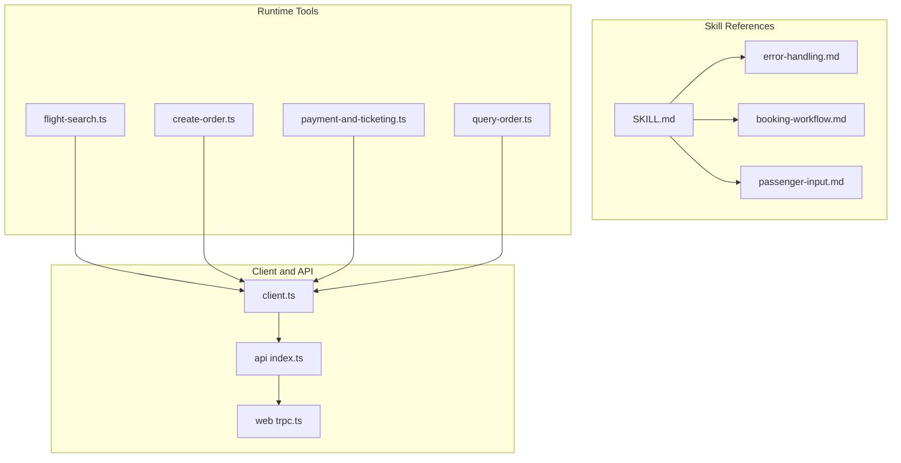
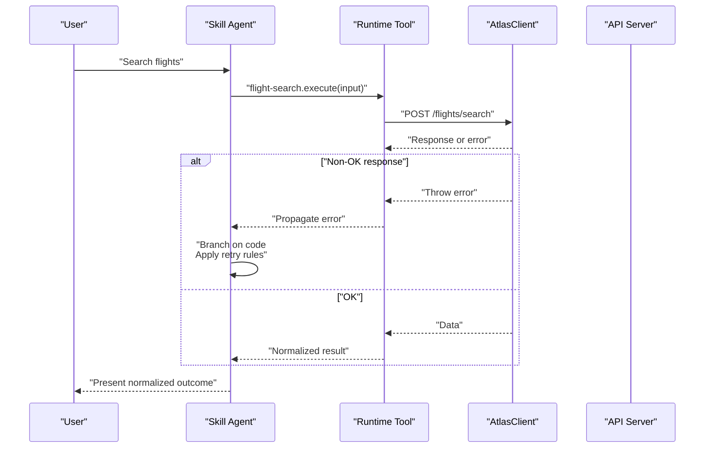
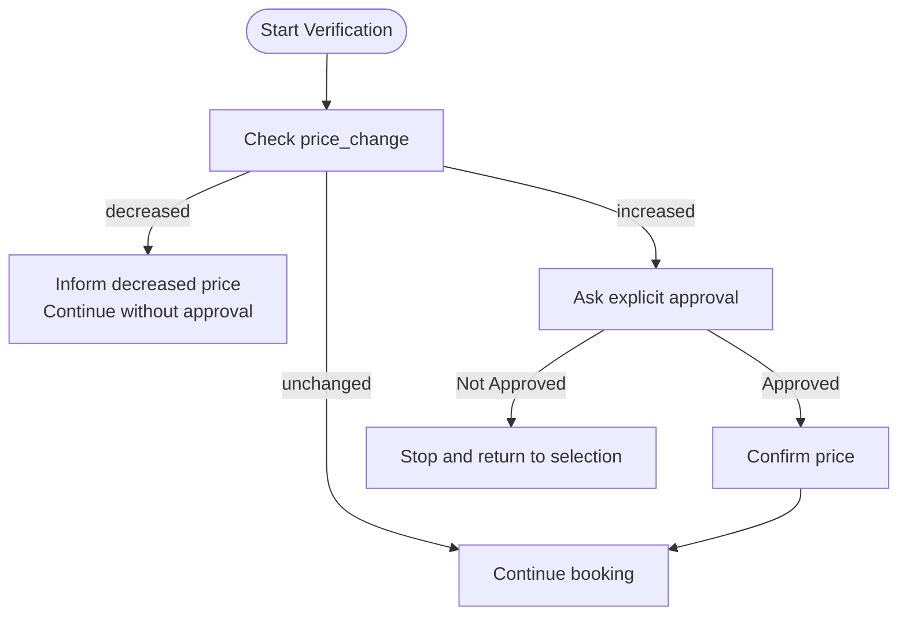
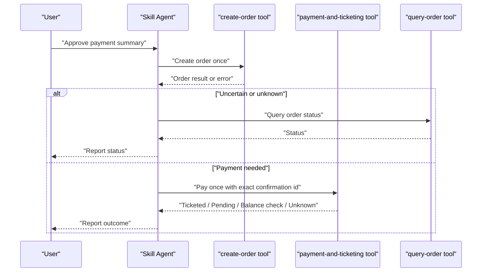
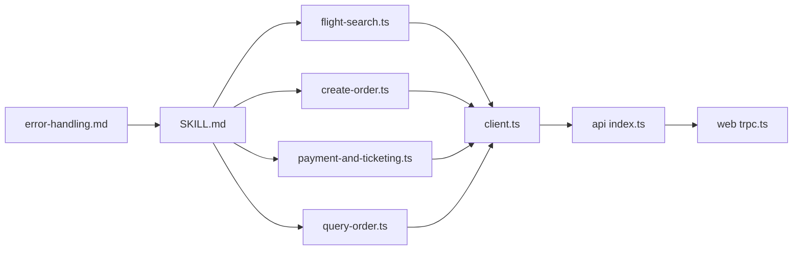

# Error Handling Strategies

<cite>
**Referenced Files in This Document**
- [SKILL.md](file://.agents/skills/atlas-flight-booking/SKILL.md)
- [error-handling.md](file://.agents/skills/atlas-flight-booking/references/error-handling.md)
- [booking-workflow.md](file://.agents/skills/atlas-flight-booking/references/booking-workflow.md)
- [passenger-input.md](file://.agents/skills/atlas-flight-booking/references/passenger-input.md)
- [flight-search.ts](file://apps/runtime/agent/tools/flight-search.ts)
- [create-order.ts](file://apps/runtime/agent/tools/create-order.ts)
- [payment-and-ticketing.ts](file://apps/runtime/agent/tools/payment-and-ticketing.ts)
- [query-order.ts](file://apps/runtime/agent/tools/query-order.ts)
- [client.ts](file://packages/atlas/src/client.ts)
- [index.ts](file://packages/api/src/index.ts)
- [trpc.ts](file://apps/web/src/utils/trpc.ts)
</cite>

## Table of Contents

1. Introduction
2. Project Structure
3. Core Components
4. Architecture Overview
5. Detailed Component Analysis
6. Dependency Analysis
7. Performance Considerations
8. Troubleshooting Guide
9. Conclusion

## Introduction

This document defines the error handling strategies for the flight booking skill. It consolidates the normalized error codes, retry and fallback rules, user communication patterns, logging requirements, and production monitoring guidance. The goal is to ensure consistent, safe, and user-friendly behavior across search, verification, optional services, order creation, payment, ticketing, and status checks.

The skill operates through a CLI-driven workflow. Errors are handled by branching on stable response codes rather than parsing free-form messages. Side-effecting operations (order creation and payment) must never be retried automatically; read-only operations may be retried once when explicitly marked as retryable.

## Project Structure

The error handling strategy spans three layers:

- Skill references define the canonical error codes and agent behaviors.
- Runtime tools wrap API calls and enforce safety constraints (e.g., one-time execution, explicit approvals).
- Client and API layers provide network transport and server-side error signaling.

**Diagram sources**

- [error-handling.md:1-74](file://.agents/skills/atlas-flight-booking/references/error-handling.md#L1-L74)
- [booking-workflow.md:1-63](file://.agents/skills/atlas-flight-booking/references/booking-workflow.md#L1-L63)
- [passenger-input.md:1-52](file://.agents/skills/atlas-flight-booking/references/passenger-input.md#L1-L52)
- [SKILL.md:1-71](file://.agents/skills/atlas-flight-booking/SKILL.md#L1-L71)
- [flight-search.ts:1-62](file://apps/runtime/agent/tools/flight-search.ts#L1-L62)
- [create-order.ts:1-66](file://apps/runtime/agent/tools/create-order.ts#L1-L66)
- [payment-and-ticketing.ts:1-21](file://apps/runtime/agent/tools/payment-and-ticketing.ts#L1-L21)
- [query-order.ts:1-19](file://apps/runtime/agent/tools/query-order.ts#L1-L19)
- [client.ts:1-41](file://packages/atlas/src/client.ts#L1-L41)
- [index.ts:1-26](file://packages/api/src/index.ts#L1-L26)
- [trpc.ts:1-40](file://apps/web/src/utils/trpc.ts#L1-L40)

**Section sources**

- [SKILL.md:1-71](file://.agents/skills/atlas-flight-booking/SKILL.md#L1-L71)
- [error-handling.md:1-74](file://.agents/skills/atlas-flight-booking/references/error-handling.md#L1-L74)

## Core Components

- Normalized error routing: Branch on stable `code` fields from the CLI/API responses. Never parse human-readable `message` fields for logic. Keep internal causes out of user-facing output.
- Safety boundaries:
  - Read-only commands may be retried at most once when `retryable=true`.
  - Order creation and payment must never be retried automatically.
  - If side effects might have occurred, switch to query-only flows using returned identifiers.
- User communication: Present only normalized fields and stable codes. Provide actionable next steps and links when present. Do not expose internal service codes or numeric upstream statuses.

Key responsibilities by component:

- Skill references: Define all error codes, agent behavior, and recovery rules.
- Runtime tools: Enforce one-time execution for side effects, validate inputs with schemas, and delegate to the Atlas client.
- Atlas client: Perform HTTP requests and throw standardized errors on non-OK responses.
- API layer: Use typed procedure guards to signal authorization and other errors consistently.
- Web client: Surface errors via toast notifications and offer retry actions where appropriate.

**Section sources**

- [error-handling.md:1-74](file://.agents/skills/atlas-flight-booking/references/error-handling.md#L1-L74)
- [booking-workflow.md:1-63](file://.agents/skills/atlas-flight-booking/references/booking-workflow.md#L1-L63)
- [passenger-input.md:1-52](file://.agents/skills/atlas-flight-booking/references/passenger-input.md#L1-L52)
- [flight-search.ts:1-62](file://apps/runtime/agent/tools/flight-search.ts#L1-L62)
- [create-order.ts:1-66](file://apps/runtime/agent/tools/create-order.ts#L1-L66)
- [payment-and-ticketing.ts:1-21](file://apps/runtime/agent/tools/payment-and-ticketing.ts#L1-L21)
- [query-order.ts:1-19](file://apps/runtime/agent/tools/query-order.ts#L1-L19)
- [client.ts:1-41](file://packages/atlas/src/client.ts#L1-L41)
- [index.ts:1-26](file://packages/api/src/index.ts#L1-L26)
- [trpc.ts:1-40](file://apps/web/src/utils/trpc.ts#L1-L40)

## Architecture Overview

The error handling architecture enforces strict separation between read and write paths, with centralized normalization and clear user messaging.

**Diagram sources**

- [flight-search.ts:1-62](file://apps/runtime/agent/tools/flight-search.ts#L1-L62)
- [client.ts:23-39](file://packages/atlas/src/client.ts#L23-L39)
- [error-handling.md:1-74](file://.agents/skills/atlas-flight-booking/references/error-handling.md#L1-L74)

## Detailed Component Analysis

### Authorization and Access Errors

- Codes and behaviors:
  - AUTHORIZATION_REQUIRED: Start login flow, present authorization URL, stop without polling until user confirms completion, then poll once and resume if authorized.
  - AUTH_PENDING: Explain incomplete authorization; wait for user confirmation before polling again.
  - AUTH_EXPIRED / AUTH_SESSION_MISSING: Start a new authorization flow.
  - AUTH_SERVICE_UNAVAILABLE: Retain pending session; retry identical auth read once when retryable.
  - SUBSCRIPTION_REQUIRED: Branch on ticketing_blocker; explain limitations and present activation URL when available.
  - SECURE_STORE_UNAVAILABLE: Report and stop.
  - CREDENTIAL_REJECTED: Report neutral result and stop.

- User communication:
  - Always present descriptive links when provided.
  - Do not expose internal service codes or numeric upstream statuses.
  - Explain account options (existing vs new) and next steps clearly.

- Retry and fallback:
  - Only identical reads may be retried once when retryable.
  - No automatic loops; rely on user confirmation to proceed.

**Section sources**

- [error-handling.md:7-18](file://.agents/skills/atlas-flight-booking/references/error-handling.md#L7-L18)
- [SKILL.md:26-38](file://.agents/skills/atlas-flight-booking/SKILL.md#L26-L38)

### Search and Verification Errors

- Codes and behaviors:
  - SEARCH_NO_RESULTS: Treat as successful empty search; suggest alternative dates.
  - SEARCH_LIMIT_REACHED: Report limit; do not retry automatically.
  - OFFER_EXPIRED / BOOKING_EXPIRED: Replay retained search once; collect new inputs if unavailable; never reuse old IDs.
  - PRICE_CONFIRMATION_REQUIRED / PRICE_CHANGED: Present old and new totals; obtain explicit confirmation before continuing.
  - PRICE_VERIFICATION_UNAVAILABLE: Retry verify command once when retryable.
  - FLIGHT_UNAVAILABLE: Offer a new search.
  - BOOKING_INPUT_INVALID: Correct only identified fields; otherwise stop.

- Data flow:
  - Preserve selected offer_id and price_status; re-verify only that ID.
  - Compare total_price within same currency; group or separate other currencies.

**Diagram sources**

- [booking-workflow.md:1-16](file://.agents/skills/atlas-flight-booking/references/booking-workflow.md#L1-L16)
- [error-handling.md:19-31](file://.agents/skills/atlas-flight-booking/references/error-handling.md#L19-L31)

**Section sources**

- [error-handling.md:19-31](file://.agents/skills/atlas-flight-booking/references/error-handling.md#L19-L31)
- [booking-workflow.md:1-16](file://.agents/skills/atlas-flight-booking/references/booking-workflow.md#L1-L16)

### Optional Services and Passengers

- Codes and behaviors:
  - BAGGAGE_UNAVAILABLE / SEAT_UNAVAILABLE: Skip the service and continue main flow.
  - ANCILLARY_SELECTION_INVALID: Relist service; ask user to choose current option or continue without it.
  - PASSENGER_INFO_REQUIRED / PASSENGER_INFO_INVALID / CONTACT_INFO_INVALID: Collect only missing or invalid fields listed in details.fields; rebuild payload once; do not repeat rejected values.
  - PASSENGER_COMBINATION_UNSUPPORTED: Report and stop.

- Input handling:
  - Use verification response as source of truth for required fields.
  - Prefer one-time delivery via stdin; avoid echoing or logging personal data.

**Section sources**

- [error-handling.md:32-43](file://.agents/skills/atlas-flight-booking/references/error-handling.md#L32-L43)
- [passenger-input.md:1-52](file://.agents/skills/atlas-flight-booking/references/passenger-input.md#L1-L52)

### Order Creation, Payment, and Ticketing

- Codes and behaviors:
  - PAYMENT_CONFIRMATION_REQUIRED: Present masked summary and order link when present; wait for explicit approval.
  - PAYMENT_CONFIRMATION_INVALID: Do not pay; require fresh order and confirmation.
  - PRICE_CHANGED: Do not create another order; search and verify again before asking for decision.
  - ORDER_CREATION_UNAVAILABLE: Report and stop.
  - PAYMENT_METHOD_UNAVAILABLE: Report unavailability; show order link when present.
  - PAYMENT_DEADLINE_EXPIRED: Report expiry; do not pay.
  - PAYMENT_BALANCE_CHECK_REQUIRED: Explain possible insufficient balance; show order link when present; never pay again.
  - ORDER_CREATION_UNKNOWN / DUPLICATE_BOOKING_SUSPECTED: Never create again; show order link if returned; otherwise report uncertainty.
  - PAYMENT_STATUS_UNKNOWN / PAYMENT_PROCESSING: Never pay again; query order status using order_no.
  - TICKETED / TICKETING_PENDING / ORDER_CANCELLED / ORDER_NOT_FOUND: Report outcomes neutrally; show order link when present.
  - ORDER_STATUS_UNAVAILABLE: Retry status query once when retryable; never repay.
  - UNSUPPORTED_BOOKING_FLOW / BOOKING_STATE_INVALID / ORDER_STATE_INVALID: Report and stop; do not reconstruct state.

- Critical safety rule:
  - Never retry order creation or payment automatically, even when retryable appears elsewhere.
  - On uncertain results, use query-only flows with returned identifiers.

**Diagram sources**

- [create-order.ts:1-66](file://apps/runtime/agent/tools/create-order.ts#L1-L66)
- [payment-and-ticketing.ts:1-21](file://apps/runtime/agent/tools/payment-and-ticketing.ts#L1-L21)
- [query-order.ts:1-19](file://apps/runtime/agent/tools/query-order.ts#L1-L19)
- [booking-workflow.md:31-63](file://.agents/skills/atlas-flight-booking/references/booking-workflow.md#L31-L63)
- [error-handling.md:44-64](file://.agents/skills/atlas-flight-booking/references/error-handling.md#L44-L64)

**Section sources**

- [error-handling.md:44-64](file://.agents/skills/atlas-flight-booking/references/error-handling.md#L44-L64)
- [booking-workflow.md:31-63](file://.agents/skills/atlas-flight-booking/references/booking-workflow.md#L31-L63)

### General Failures and Network Issues

- Codes and behaviors:
  - INVALID_ARGUMENT: Correct only identified argument or field.
  - SERVICE_TEMPORARILY_UNAVAILABLE: Repeat identical read-only command once when retryable; never repeat order creation or payment.
  - SERVICE_REQUEST_FAILED / SERVICE_RESPONSE_INVALID: Report inability to complete; if side effect might have occurred, follow query-only rule.

- Client-level handling:
  - Non-OK HTTP responses raise errors with status and payload; callers should branch on normalized codes rather than raw messages.

**Section sources**

- [error-handling.md:65-74](file://.agents/skills/atlas-flight-booking/references/error-handling.md#L65-L74)
- [client.ts:23-39](file://packages/atlas/src/client.ts#L23-L39)

### API and Web Error Signaling

- Server-side:
  - Procedures can throw typed errors with codes and messages for unauthorized access or other conditions.
- Client-side:
  - React Query onError surfaces errors via toast notifications and offers a retry action to invalidate queries.

**Section sources**

- [index.ts:11-25](file://packages/api/src/index.ts#L11-L25)
- [trpc.ts:7-19](file://apps/web/src/utils/trpc.ts#L7-L19)

## Dependency Analysis

Error handling depends on consistent contracts between components:

- Skill references define the contract for codes and behaviors.
- Runtime tools implement the contract by calling APIs and enforcing safety rules.
- Atlas client provides transport and throws on non-OK responses.
- API layer signals errors via typed procedures.
- Web client displays errors and supports retries.

**Diagram sources**

- [error-handling.md:1-74](file://.agents/skills/atlas-flight-booking/references/error-handling.md#L1-L74)
- [SKILL.md:1-71](file://.agents/skills/atlas-flight-booking/SKILL.md#L1-L71)
- [flight-search.ts:1-62](file://apps/runtime/agent/tools/flight-search.ts#L1-L62)
- [create-order.ts:1-66](file://apps/runtime/agent/tools/create-order.ts#L1-L66)
- [payment-and-ticketing.ts:1-21](file://apps/runtime/agent/tools/payment-and-ticketing.ts#L1-L21)
- [query-order.ts:1-19](file://apps/runtime/agent/tools/query-order.ts#L1-L19)
- [client.ts:1-41](file://packages/atlas/src/client.ts#L1-L41)
- [index.ts:1-26](file://packages/api/src/index.ts#L1-L26)
- [trpc.ts:1-40](file://apps/web/src/utils/trpc.ts#L1-L40)

**Section sources**

- [error-handling.md:1-74](file://.agents/skills/atlas-flight-booking/references/error-handling.md#L1-L74)
- [SKILL.md:1-71](file://.agents/skills/atlas-flight-booking/SKILL.md#L1-L71)

## Performance Considerations

- Limit retries to one attempt for read-only operations when explicitly marked retryable.
- Avoid unnecessary revalidation; rely on query-only flows after uncertain side effects.
- Defer await until needed to reduce blocking during error paths.
- Group searches by date ranges to minimize redundant calls while preserving correctness.

[No sources needed since this section provides general guidance]

## Troubleshooting Guide

- Debugging techniques:
  - Inspect normalized codes and fields; never parse message text for logic.
  - When side effects are uncertain, use order status queries with returned identifiers.
  - For authorization issues, ensure the correct flow is started based on code (new login vs continuation).
- Error tracking and monitoring:
  - Log normalized codes and context (e.g., operation type, retry flag) without exposing personal data.
  - Track frequency of specific codes (e.g., SERVICE_TEMPORARILY_UNAVAILABLE, PAYMENT_BALANCE_CHECK_REQUIRED) to detect upstream degradation.
  - Alert on repeated failures in critical paths (order creation, payment).
- Production strategies:
  - Graceful degradation: skip optional services when unavailable; continue core booking flow.
  - User experience: present neutral, actionable messages; include order links when available; avoid technical jargon.
  - Safety: never auto-retry order creation or payment; always require explicit user approval for payment.

**Section sources**

- [error-handling.md:1-74](file://.agents/skills/atlas-flight-booking/references/error-handling.md#L1-L74)
- [booking-workflow.md:31-63](file://.agents/skills/atlas-flight-booking/references/booking-workflow.md#L31-L63)
- [passenger-input.md:1-52](file://.agents/skills/atlas-flight-booking/references/passenger-input.md#L1-L52)
- [client.ts:23-39](file://packages/atlas/src/client.ts#L23-L39)
- [trpc.ts:7-19](file://apps/web/src/utils/trpc.ts#L7-L19)

## Conclusion

The flight booking skill implements a robust, code-based error handling strategy that prioritizes safety, clarity, and recoverability. By branching on stable codes, limiting retries, enforcing explicit approvals for side effects, and providing normalized user messages, the system ensures reliable operations even under network failures, rate limits, service unavailability, validation errors, and business rule violations. Monitoring and graceful degradation further enhance resilience in production environments.

[No sources needed since this section summarizes without analyzing specific files]
