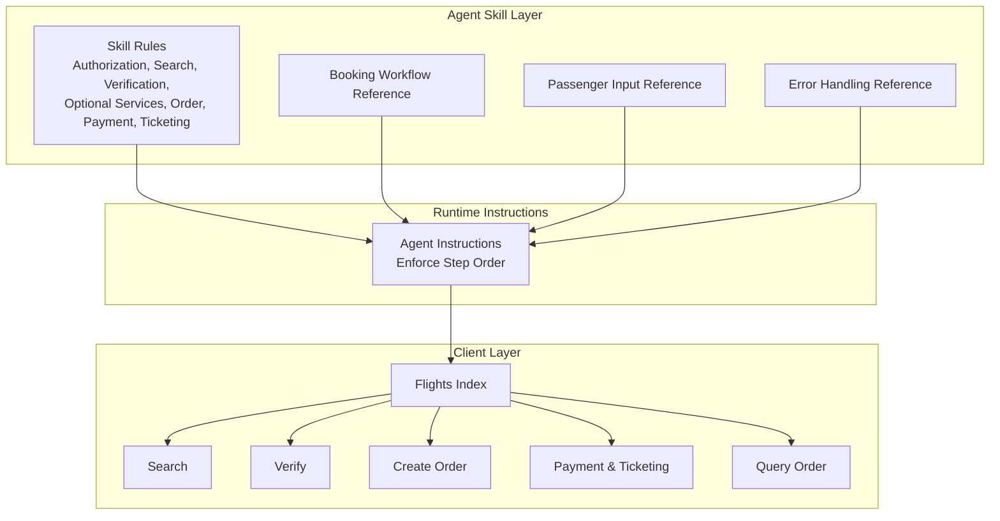
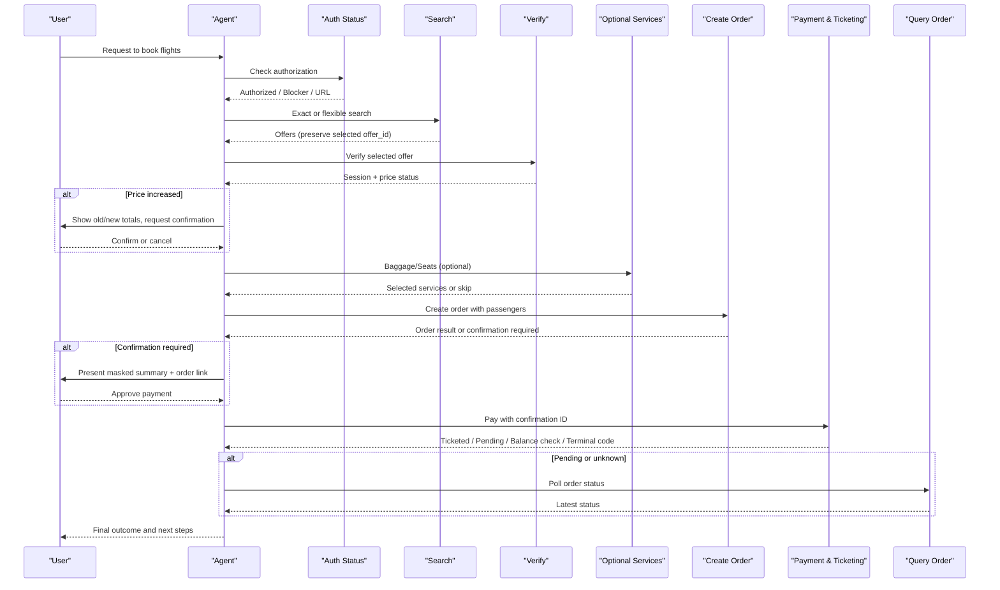
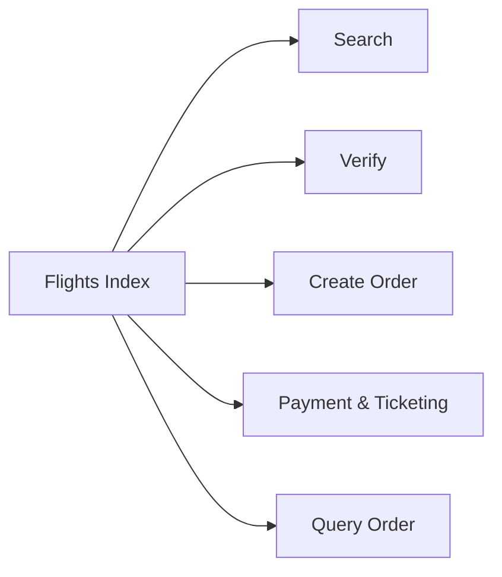

# Flight Booking Workflow

<cite>
**Referenced Files in This Document**
- [SKILL.md](file://.agents/skills/atlas-flight-booking/SKILL.md)
- [booking-workflow.md](file://.agents/skills/atlas-flight-booking/references/booking-workflow.md)
- [passenger-input.md](file://.agents/skills/atlas-flight-booking/references/passenger-input.md)
- [error-handling.md](file://.agents/skills/atlas-flight-booking/references/error-handling.md)
- [instructions.md](file://apps/runtime/agent/instructions.md)
- [index.ts (flights)](file://packages/atlas/src/flights/index.ts)
- [search.ts](file://packages/atlas/src/flights/search.ts)
- [verify.ts](file://packages/atlas/src/flights/verify.ts)
- [create-order.ts](file://packages/atlas/src/flights/create-order.ts)
- [payment-and-ticketing.ts](file://packages/atlas/src/flights/payment-and-ticketing.ts)
- [query-order.ts](file://packages/atlas/src/flights/query-order.ts)
</cite>

## Table of Contents

1. Introduction
2. Project Structure
3. Core Components
4. Architecture Overview
5. Detailed Component Analysis
6. Dependency Analysis
7. Performance Considerations
8. Troubleshooting Guide
9. Conclusion

## Introduction

This document describes the end-to-end flight booking workflow from search to ticketing, including authorization checks, search and verification, optional services selection, passenger input collection, order creation, payment processing, and post-booking status monitoring. It explains decision points, error handling, user confirmation requirements, and state management across each stage. It also covers common scenarios such as flexible dates, price changes, seat availability issues, and payment failures, and clarifies how search, verification, booking, and post-booking operations integrate.

## Project Structure

The repository implements a skill-driven agent workflow that orchestrates the Atlas Flight Booking CLI and exposes typed client methods for each step of the journey. The key elements are:

- Skill definitions and references that define safe behavior, mandatory checkpoints, and error handling rules.
- Runtime instructions that enforce a strict sequence of steps.
- A typed client layer that encapsulates API calls for search, verify, order creation, payment/ticketing, and order query.

**Diagram sources**

- [SKILL.md:26-63](file://.agents/skills/atlas-flight-booking/SKILL.md#L26-L63)
- [booking-workflow.md:1-63](file://.agents/skills/atlas-flight-booking/references/booking-workflow.md#L1-L63)
- [passenger-input.md:1-52](file://.agents/skills/atlas-flight-booking/references/passenger-input.md#L1-L52)
- [error-handling.md:1-74](file://.agents/skills/atlas-flight-booking/references/error-handling.md#L1-L74)
- [instructions.md:5-15](file://apps/runtime/agent/instructions.md#L5-L15)
- [index.ts (flights):1-12](file://packages/atlas/src/flights/index.ts#L1-L12)

**Section sources**

- [SKILL.md:26-63](file://.agents/skills/atlas-flight-booking/SKILL.md#L26-L63)
- [instructions.md:5-15](file://apps/runtime/agent/instructions.md#L5-L15)
- [index.ts (flights):1-12](file://packages/atlas/src/flights/index.ts#L1-L12)

## Core Components

- Authorization and readiness:
  - Check authorization status before any search or booking action.
  - Handle activation blockers and present activation links when required.
- Search:
  - Support exact and flexible date searches; normalize offers and preserve selected offer IDs.
  - For comparison-only results, stop at search and do not proceed to verification or ticketing.
- Verification:
  - Confirm current price and obtain session context.
  - Branch on price change: continue if unchanged or decreased; require explicit confirmation if increased.
- Optional services:
  - Offer baggage and seats only when supported and requested.
  - Capture fallback preference if a selected seat becomes unavailable during order creation.
- Passenger input:
  - Collect only required fields based on verification requirements.
  - Use one-time stdin delivery for passenger data; avoid echoing or logging personal data.
- Order creation:
  - Create order once with session, routing identifier, and passenger details.
  - On uncertainty, never retry automatically; rely on status queries.
- Payment and ticketing:
  - Present current masked payment summary and order link (when available).
  - Pay exactly once with the returned confirmation ID.
  - Branch on terminal codes and pending states; use status queries for later checks.
- Post-booking:
  - Monitor ticketing status using order query; treat pending as ongoing processing.

**Section sources**

- [SKILL.md:26-63](file://.agents/skills/atlas-flight-booking/SKILL.md#L26-L63)
- [booking-workflow.md:1-63](file://.agents/skills/atlas-flight-booking/references/booking-workflow.md#L1-L63)
- [passenger-input.md:1-52](file://.agents/skills/atlas-flight-booking/references/passenger-input.md#L1-L52)
- [error-handling.md:1-74](file://.agents/skills/atlas-flight-booking/references/error-handling.md#L1-L74)
- [instructions.md:5-15](file://apps/runtime/agent/instructions.md#L5-L15)

## Architecture Overview

The workflow is orchestrated by the agent following skill rules and runtime instructions. Each step maps to a specific client method that posts to a backend endpoint.

**Diagram sources**

- [SKILL.md:26-63](file://.agents/skills/atlas-flight-booking/SKILL.md#L26-L63)
- [booking-workflow.md:1-63](file://.agents/skills/atlas-flight-booking/references/booking-workflow.md#L1-L63)
- [passenger-input.md:1-52](file://.agents/skills/atlas-flight-booking/references/passenger-input.md#L1-L52)
- [error-handling.md:1-74](file://.agents/skills/atlas-flight-booking/references/error-handling.md#L1-L74)
- [instructions.md:5-15](file://apps/runtime/agent/instructions.md#L5-L15)
- [search.ts:36-40](file://packages/atlas/src/flights/search.ts#L36-L40)
- [verify.ts:15-19](file://packages/atlas/src/flights/verify.ts#L15-L19)
- [create-order.ts:11-15](file://packages/atlas/src/flights/create-order.ts#L11-L15)
- [payment-and-ticketing.ts:14-18](file://packages/atlas/src/flights/payment-and-ticketing.ts#L14-L18)
- [query-order.ts:14-18](file://packages/atlas/src/flights/query-order.ts#L14-L18)

## Detailed Component Analysis

### Authorization and Readiness

- Before searching or booking, check authorization status.
- If blocked by top-up or activation, explain limitations and present the provided activation URL.
- After user confirms completion, poll once and resume only when authorized.

Decision points:

- AUTHORIZATION_REQUIRED: Start login flow and stop until user completes it.
- SUBSCRIPTION_REQUIRED/TICKETING_ACTIVATION_REQUIRED: Explain blocker and present activation URL.
- AUTH_EXPIRED/AUTH_SESSION_MISSING: Restart authorization.

Error handling:

- AUTH_PENDING: Wait for user confirmation before polling again.
- AUTH_SERVICE_UNAVAILABLE: Retry identical read once when allowed.

**Section sources**

- [SKILL.md:26-38](file://.agents/skills/atlas-flight-booking/SKILL.md#L26-L38)
- [error-handling.md:7-17](file://.agents/skills/atlas-flight-booking/references/error-handling.md#L7-L17)

### Search Operations

- Support exact and flexible date searches. Normalize offers and compare total prices within the same currency.
- Preserve selected offer’s original date and opaque IDs.
- For comparison-only results, stop at search and do not proceed to verification or ticketing.

Flexible dates:

- Resolve relative/fuzzy dates against current date/timezone.
- For ranges, run one complete search per calendar date, retain search IDs and offer IDs separately, then merge normalized results.

Error handling:

- OFFER_EXPIRED/BOOKING_EXPIRED: Replay retained search once; otherwise collect new inputs.
- FLIGHT_UNAVAILABLE: Report unavailability and offer a new search.
- SEARCH_NO_RESULTS: Treat as successful empty search; suggest alternatives.

**Section sources**

- [SKILL.md:39-51](file://.agents/skills/atlas-flight-booking/SKILL.md#L39-L51)
- [error-handling.md:19-31](file://.agents/skills/atlas-flight-booking/references/error-handling.md#L19-L31)
- [search.ts:36-40](file://packages/atlas/src/flights/search.ts#L36-L40)

### Verification and Price Change Handling

- Verify the selected offer to confirm current price and obtain session context.
- Branch on price change:
  - Unchanged: Continue.
  - Decreased: Inform user and continue without re-approval.
  - Increased: Stop and obtain explicit confirmation before proceeding.

Error handling:

- PRICE_VERIFICATION_UNAVAILABLE: Retry identical verify once when allowed.
- PRICE_CONFIRMATION_REQUIRED: Present old/new totals and wait for confirmation.

**Section sources**

- [booking-workflow.md:3-15](file://.agents/skills/atlas-flight-booking/references/booking-workflow.md#L3-L15)
- [error-handling.md:19-31](file://.agents/skills/atlas-flight-booking/references/error-handling.md#L19-L31)
- [verify.ts:15-19](file://packages/atlas/src/flights/verify.ts#L15-L19)

### Optional Services Selection

- Only list supported services when the user wants them.
- Seat fallback policy must be captured before selecting a seat: continue without seat, cancel order if unavailable, or accept a similar seat.
- Service unavailability does not block the main booking flow.

Error handling:

- BAGGAGE_UNAVAILABLE/SEAT_UNAVAILABLE: Skip service and continue.
- ANCILLARY_SELECTION_INVALID: Relist options and ask user to choose or continue without it.

**Section sources**

- [booking-workflow.md:17-30](file://.agents/skills/atlas-flight-booking/references/booking-workflow.md#L17-L30)
- [error-handling.md:32-43](file://.agents/skills/atlas-flight-booking/references/error-handling.md#L32-L43)

### Passenger Input Collection

- Use verification response to determine required fields; carry traveler IDs and passenger types from verification.
- Prefer one-time stdin delivery for passenger data; never echo or log personal data.
- Correct only identified fields on validation errors and rebuild the full payload once.

Error handling:

- PASSENGER_INFO_REQUIRED/PASSENGER_INFO_INVALID/CONTACT_INFO_INVALID: Ask only for missing or invalid fields and resubmit once.

**Section sources**

- [passenger-input.md:1-52](file://.agents/skills/atlas-flight-booking/references/passenger-input.md#L1-L52)
- [error-handling.md:32-43](file://.agents/skills/atlas-flight-booking/references/error-handling.md#L32-L43)

### Order Creation

- Create order once with session, routing identifier, and passenger details.
- Do not retry automatically; on uncertainty, rely on status queries.

Error handling:

- ORDER_CREATION_UNAVAILABLE: Report and stop.
- ORDER_CREATION_UNKNOWN/DUPLICATE_BOOKING_SUSPECTED: Never create again; show order link if returned.

**Section sources**

- [booking-workflow.md:31-41](file://.agents/skills/atlas-flight-booking/references/booking-workflow.md#L31-L41)
- [error-handling.md:44-63](file://.agents/skills/atlas-flight-booking/references/error-handling.md#L44-L63)
- [create-order.ts:11-15](file://packages/atlas/src/flights/create-order.ts#L11-L15)

### Payment Processing

- Present current masked payment summary and order link (when available), then wait for explicit approval.
- Pay exactly once with the returned confirmation ID; never reuse or pay twice.

Error handling:

- PAYMENT_CONFIRMATION_REQUIRED: Present summary and order link; wait for approval.
- PAYMENT_METHOD_UNAVAILABLE/PAYMENT_DEADLINE_EXPIRED: Report and stop.
- PAYMENT_BALANCE_CHECK_REQUIRED: Explain insufficient balance possibility; do not pay again.

**Section sources**

- [booking-workflow.md:42-47](file://.agents/skills/atlas-flight-booking/references/booking-workflow.md#L42-L47)
- [error-handling.md:44-63](file://.agents/skills/atlas-flight-booking/references/error-handling.md#L44-L63)
- [payment-and-ticketing.ts:14-18](file://packages/atlas/src/flights/payment-and-ticketing.ts#L14-L18)

### Ticketing Status Monitoring

- Branch on payment result:
  - TICKETED: Report success with masked details and order link (when available).
  - TICKETING_PENDING: Explain ongoing processing and show order link (when available).
  - PAYMENT_BALANCE_CHECK_REQUIRED: Advise checking balance; do not pay again.
- For later checks, use order status only; do not describe pending as failure.

Error handling:

- PAYMENT_STATUS_UNKNOWN/PAYMENT_PROCESSING: Query order status using order number.
- ORDER_STATUS_UNAVAILABLE: Retry identical status query once when allowed.

**Section sources**

- [booking-workflow.md:48-59](file://.agents/skills/atlas-flight-booking/references/booking-workflow.md#L48-L59)
- [error-handling.md:44-63](file://.agents/skills/atlas-flight-booking/references/error-handling.md#L44-L63)
- [query-order.ts:14-18](file://packages/atlas/src/flights/query-order.ts#L14-L18)

### Scenario Playbooks

#### Flexible Dates

- Resolve fuzzy dates to absolute dates and present interpreted dates with results.
- For ranges, run one search per date, retain search IDs and offer IDs separately, then merge normalized results.
- Compare total prices within the same currency; group or separate other currencies clearly.

**Section sources**

- [SKILL.md:43-51](file://.agents/skills/atlas-flight-booking/SKILL.md#L43-L51)

#### Price Changes

- Unchanged: Continue.
- Decreased: Inform user and continue without re-approval.
- Increased: Stop, show old/new totals, and obtain explicit confirmation before continuing.

**Section sources**

- [booking-workflow.md:3-15](file://.agents/skills/atlas-flight-booking/references/booking-workflow.md#L3-L15)
- [error-handling.md:19-31](file://.agents/skills/atlas-flight-booking/references/error-handling.md#L19-L31)

#### Seat Availability Issues

- Before selecting a seat, capture fallback preference: continue without seat, cancel order if unavailable, or accept a similar seat.
- If seat unavailable, skip seat and continue booking.

**Section sources**

- [booking-workflow.md:17-30](file://.agents/skills/atlas-flight-booking/references/booking-workflow.md#L17-L30)
- [error-handling.md:32-43](file://.agents/skills/atlas-flight-booking/references/error-handling.md#L32-L43)

#### Payment Failures

- PAYMENT_BALANCE_CHECK_REQUIRED: Explain possible insufficient balance; do not pay again; show order link if available.
- PAYMENT_METHOD_UNAVAILABLE/PAYMENT_DEADLINE_EXPIRED: Report and stop.
- For unknown or processing states, query order status instead of repaying.

**Section sources**

- [booking-workflow.md:48-59](file://.agents/skills/atlas-flight-booking/references/booking-workflow.md#L48-L59)
- [error-handling.md:44-63](file://.agents/skills/atlas-flight-booking/references/error-handling.md#L44-L63)

## Dependency Analysis

The client layer exposes discrete functions for each workflow step. The index aggregates these into a cohesive flights API surface used by higher-level orchestration.

**Diagram sources**

- [index.ts (flights):1-12](file://packages/atlas/src/flights/index.ts#L1-L12)

**Section sources**

- [index.ts (flights):1-12](file://packages/atlas/src/flights/index.ts#L1-L12)

## Performance Considerations

- Minimize redundant network calls:
  - Reuse verified sessions and offer IDs where valid.
  - Avoid repeated order creation or payment attempts.
- Batch comparisons efficiently:
  - For flexible date ranges, run one search per date and merge normalized results after all attempts complete.
- Prefer read-only retries:
  - Allow at most one retry for read-only operations when explicitly allowed.
- Defer expensive operations:
  - Delay optional services until after verification and only when requested.

[No sources needed since this section provides general guidance]

## Troubleshooting Guide

Common issues and resolutions:

- Authorization blockers:
  - Follow activation flows and present provided URLs; poll once after user confirmation.
- Search limitations:
  - Empty results: suggest alternative dates; respect limits and do not auto-retry.
- Verification hiccups:
  - Retry verify once when allowed; handle expired offers by replaying search.
- Passenger data errors:
  - Correct only specified fields and resubmit once; avoid echoing personal data.
- Order and payment uncertainties:
  - Never retry side-effecting commands; query order status when an order number exists.
- Ticketing delays:
  - Treat pending as ongoing; use order status for updates; show order link when available.

**Section sources**

- [error-handling.md:7-74](file://.agents/skills/atlas-flight-booking/references/error-handling.md#L7-L74)
- [booking-workflow.md:1-63](file://.agents/skills/atlas-flight-booking/references/booking-workflow.md#L1-L63)

## Conclusion

The flight booking workflow is a carefully sequenced process that enforces safety through mandatory checkpoints, explicit user confirmations, and strict error handling. By separating concerns into authorization, search, verification, optional services, passenger input, order creation, payment, and ticketing, the system ensures reliability and clarity. The client layer provides stable endpoints for each step, while skill references and runtime instructions guide consistent behavior across scenarios like flexible dates, price changes, seat availability, and payment failures.

[No sources needed since this section summarizes without analyzing specific files]
