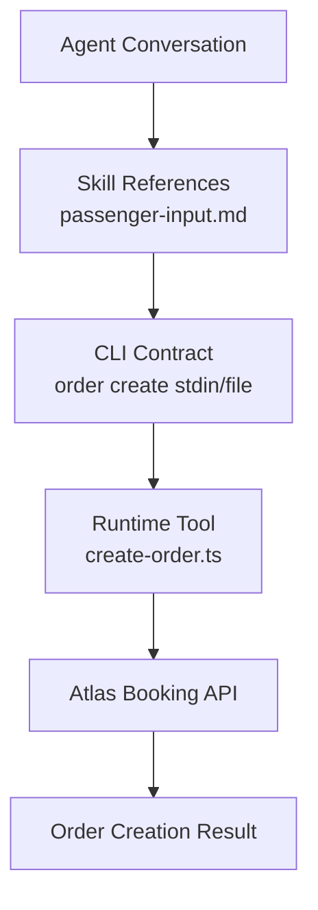
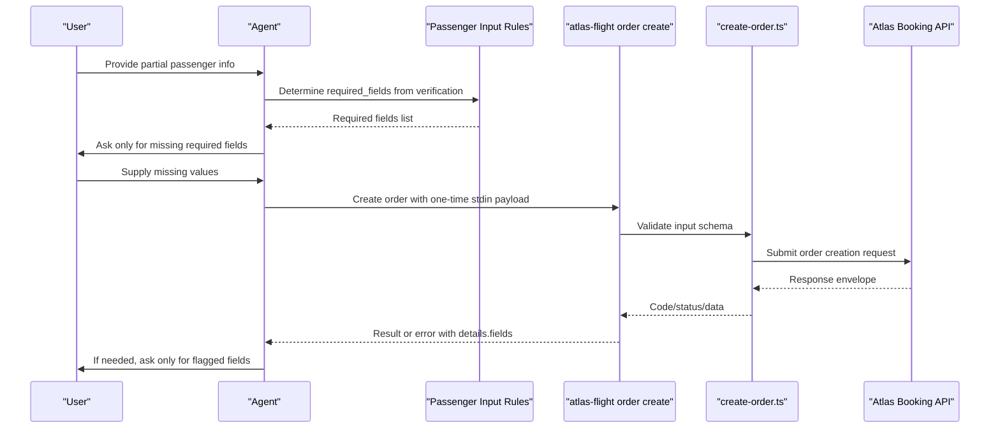
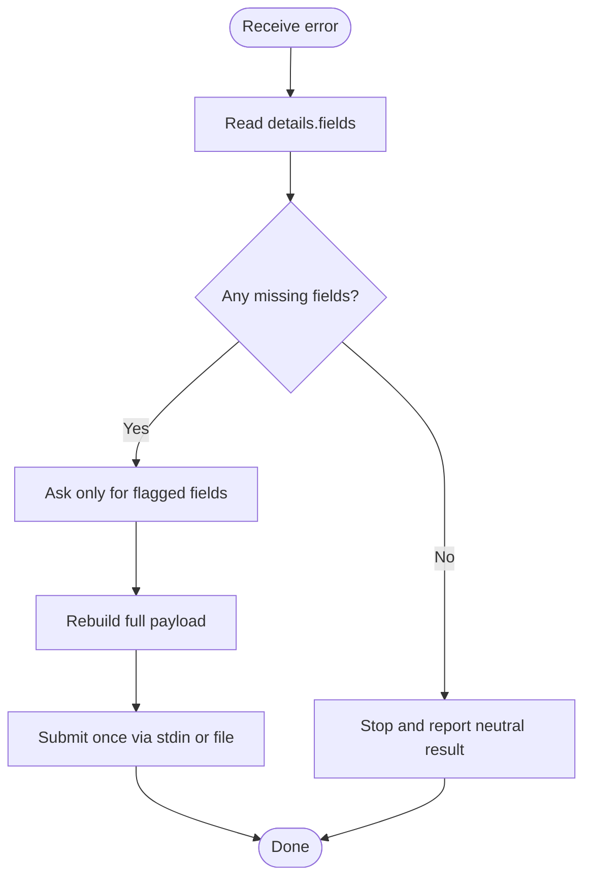
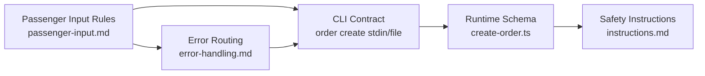

# Passenger Input Handling

<cite>
**Referenced Files in This Document**
- [SKILL.md](file://.agents/skills/atlas-flight-booking/SKILL.md)
- [passenger-input.md](file://.agents/skills/atlas-flight-booking/references/passenger-input.md)
- [booking-workflow.md](file://.agents/skills/atlas-flight-booking/references/booking-workflow.md)
- [error-handling.md](file://.agents/skills/atlas-flight-booking/references/error-handling.md)
- [cli-contract.md](file://.agents/skills/atlas-flight-booking/references/cli-contract.md)
- [create-order.ts](file://apps/runtime/agent/tools/create-order.ts)
- [instructions.md](file://apps/runtime/agent/instructions.md)
</cite>

## Table of Contents

1. [Introduction](#introduction)
2. [Project Structure](#project-structure)
3. [Core Components](#core-components)
4. [Architecture Overview](#architecture-overview)
5. [Detailed Component Analysis](#detailed-component-analysis)
6. [Dependency Analysis](#dependency-analysis)
7. [Performance Considerations](#performance-considerations)
8. [Troubleshooting Guide](#troubleshooting-guide)
9. [Conclusion](#conclusion)
10. [Appendices](#appendices)

## Introduction

This document explains how the flight booking skill collects and validates passenger information through natural language conversation, transforms it into a secure payload for order creation, and maintains data consistency across the booking flow. It covers the data model, required fields, validation rules, correction flows, edge cases (adults, children, infants), special requirements handling, integration with external systems via the CLI, privacy considerations, and security measures for sensitive passenger data.

## Project Structure

The passenger input handling is defined primarily by skill references and enforced by runtime tooling:

- Skill references define collection rules, payload shape, safe correction behavior, and integration points with the CLI.
- The runtime tool enforces an input schema for order creation and delegates to the Atlas booking API.
- Safety instructions govern how IDs and personal data are handled throughout the agent lifecycle.

**Diagram sources**

- [passenger-input.md:1-52](file://.agents/skills/atlas-flight-booking/references/passenger-input.md#L1-L52)
- [cli-contract.md:56-74](file://.agents/skills/atlas-flight-booking/references/cli-contract.md#L56-L74)
- [create-order.ts:1-66](file://apps/runtime/agent/tools/create-order.ts#L1-L66)

**Section sources**

- [passenger-input.md:1-52](file://.agents/skills/atlas-flight-booking/references/passenger-input.md#L1-L52)
- [cli-contract.md:56-74](file://.agents/skills/atlas-flight-booking/references/cli-contract.md#L56-L74)
- [create-order.ts:1-66](file://apps/runtime/agent/tools/create-order.ts#L1-L66)

## Core Components

- Data model and payload shape for passengers and contact details.
- Collection strategy driven by verification response requirements.
- One-time delivery via CLI stdin or file, with strict privacy constraints.
- Runtime schema enforcement for order creation inputs.
- Error routing for missing or invalid passenger/contact data.

Key responsibilities:

- Ask only for missing required fields identified by the system.
- Preserve traveler IDs and types from verification; never invent them.
- Build a single JSON payload and submit once.
- Correct only the specific fields flagged by errors.

**Section sources**

- [passenger-input.md:3-15](file://.agents/skills/atlas-flight-booking/references/passenger-input.md#L3-L15)
- [passenger-input.md:17-47](file://.agents/skills/atlas-flight-booking/references/passenger-input.md#L17-L47)
- [create-order.ts:15-64](file://apps/runtime/agent/tools/create-order.ts#L15-L64)

## Architecture Overview

The passenger input flow integrates conversation, skill rules, CLI, and runtime tooling:

**Diagram sources**

- [passenger-input.md:3-15](file://.agents/skills/atlas-flight-booking/references/passenger-input.md#L3-L15)
- [passenger-input.md:17-47](file://.agents/skills/atlas-flight-booking/references/passenger-input.md#L17-L47)
- [cli-contract.md:56-74](file://.agents/skills/atlas-flight-booking/references/cli-contract.md#L56-L74)
- [create-order.ts:1-66](file://apps/runtime/agent/tools/create-order.ts#L1-L66)

## Detailed Component Analysis

### Data Model and Payload Shape

- Passengers array: each entry includes traveler identity, name, type, gender, birthday, nationality, and optional travel document details.
- Contact object: requires a name; email and mobile are optional unless explicitly requested by the system.
- Name format: uppercase FAMILY/GIVEN.
- Mobile number format: country calling code prefixed with “00”, followed by a hyphen and local number.
- Document fields: type codes, number, issuing country ISO-2, expiry date.

Validation highlights:

- Names must follow the specified case and structure.
- Dates must be in YYYY-MM-DD format.
- Nationality and issuing country must be ISO-2 codes.
- Gender must be M or F.
- Passenger type must match adult, child, or infant as returned by verification.

Data transformation:

- Convert user-provided values into normalized formats before building the payload.
- Preserve exact document numbers and traveler IDs from verification.
- Omit optional fields that are neither required nor supplied.

**Section sources**

- [passenger-input.md:17-47](file://.agents/skills/atlas-flight-booking/references/passenger-input.md#L17-L47)
- [create-order.ts:15-64](file://apps/runtime/agent/tools/create-order.ts#L15-L64)

### Collection Strategy Through Natural Language

- Use the verification response as the source of truth for required fields.
- Ask only for missing values; do not re-ask for already provided data.
- Carry traveler_id and passenger_type from verification; never invent IDs.
- For contact, ask for name if not available; email/mobile remain optional unless specifically required.

Conversation pattern:

- Present minimal prompts for missing fields.
- Confirm understanding implicitly by building the full payload once all required fields are collected.
- Avoid echoing or logging personal data.

**Section sources**

- [passenger-input.md:3-15](file://.agents/skills/atlas-flight-booking/references/passenger-input.md#L3-L15)
- [passenger-input.md:17-47](file://.agents/skills/atlas-flight-booking/references/passenger-input.md#L17-L47)

### Validation Rules and Safe Correction Flow

Errors may indicate missing or invalid passenger or contact information. The correct approach:

- Read only the field names listed in details.fields.
- Ask the user for those specific fields.
- Rebuild the complete one-time payload and submit once.
- Never repeat rejected personal data in explanations.

Flowchart of correction logic:

**Diagram sources**

- [passenger-input.md:49-52](file://.agents/skills/atlas-flight-booking/references/passenger-input.md#L49-L52)
- [error-handling.md:32-43](file://.agents/skills/atlas-flight-booking/references/error-handling.md#L32-L43)

**Section sources**

- [passenger-input.md:49-52](file://.agents/skills/atlas-flight-booking/references/passenger-input.md#L49-L52)
- [error-handling.md:32-43](file://.agents/skills/atlas-flight-booking/references/error-handling.md#L32-L43)

### Integration With External Systems

- Prefer one-time stdin submission to the CLI for order creation.
- Alternatively, accept an absolute local file path and pass it to the CLI without reading or printing its contents.
- Do not mix stdin and file input in the same operation.
- Preserve all opaque IDs exactly as returned by the system.

Integration notes:

- The runtime tool validates the input schema before delegating to the Atlas booking API.
- All side effects (order creation, payment) are controlled and require explicit confirmation where applicable.

**Section sources**

- [passenger-input.md:9-15](file://.agents/skills/atlas-flight-booking/references/passenger-input.md#L9-L15)
- [cli-contract.md:56-74](file://.agents/skills/atlas-flight-booking/references/cli-contract.md#L56-L74)
- [create-order.ts:1-66](file://apps/runtime/agent/tools/create-order.ts#L1-L66)

### Handling Different Passenger Types

- Adult, child, and infant types are carried from verification; do not infer or change them.
- Ensure required fields align with the passenger type (for example, birthdays for children and infants).
- Respect any airline or system constraints surfaced by verification or error responses.

Practical guidance:

- When collecting birthdays, ensure valid dates and appropriate ages for child/infant categories.
- Keep document requirements consistent with passenger type and route regulations when indicated by the system.

**Section sources**

- [passenger-input.md:3-7](file://.agents/skills/atlas-flight-booking/references/passenger-input.md#L3-L7)
- [passenger-input.md:17-47](file://.agents/skills/atlas-flight-booking/references/passenger-input.md#L17-L47)

### Special Requirements Handling

- Optional services such as baggage and seats are separate from passenger input and should not block order creation.
- Seat policy selection applies at order creation time and must be chosen explicitly by the user.
- If a selected seat becomes unavailable during order creation, follow the pre-agreed policy (continue without seat, cancel order, or accept similar seat).

**Section sources**

- [booking-workflow.md:17-33](file://.agents/skills/atlas-flight-booking/references/booking-workflow.md#L17-L33)
- [cli-contract.md:65-72](file://.agents/skills/atlas-flight-booking/references/cli-contract.md#L65-L72)

### Privacy, Security, and Data Retention

Privacy and security principles:

- Do not echo, save, log, or copy passenger payloads into chat, logs, shell history, or files.
- Treat every ID as opaque and pass it back exactly as received.
- Never share other passengers’ personal data.
- Use the Agent runtime’s stdin channel for sensitive payloads; avoid interpolating personal values into command arguments.

Operational safeguards:

- One-time delivery minimizes exposure windows.
- Errors instruct the agent to avoid repeating rejected personal data in explanations.
- Side-effect commands (order creation, payment) are not retried automatically.

**Section sources**

- [passenger-input.md:9-15](file://.agents/skills/atlas-flight-booking/references/passenger-input.md#L9-L15)
- [passenger-input.md:49-52](file://.agents/skills/atlas-flight-booking/references/passenger-input.md#L49-L52)
- [instructions.md:32-37](file://apps/runtime/agent/instructions.md#L32-L37)

## Dependency Analysis

The passenger input process depends on several components:

**Diagram sources**

- [passenger-input.md:1-52](file://.agents/skills/atlas-flight-booking/references/passenger-input.md#L1-L52)
- [cli-contract.md:56-74](file://.agents/skills/atlas-flight-booking/references/cli-contract.md#L56-L74)
- [create-order.ts:1-66](file://apps/runtime/agent/tools/create-order.ts#L1-L66)
- [error-handling.md:32-43](file://.agents/skills/atlas-flight-booking/references/error-handling.md#L32-L43)
- [instructions.md:32-37](file://apps/runtime/agent/instructions.md#L32-L37)

**Section sources**

- [passenger-input.md:1-52](file://.agents/skills/atlas-flight-booking/references/passenger-input.md#L1-L52)
- [cli-contract.md:56-74](file://.agents/skills/atlas-flight-booking/references/cli-contract.md#L56-L74)
- [create-order.ts:1-66](file://apps/runtime/agent/tools/create-order.ts#L1-L66)
- [error-handling.md:32-43](file://.agents/skills/atlas-flight-booking/references/error-handling.md#L32-L43)
- [instructions.md:32-37](file://apps/runtime/agent/instructions.md#L32-L37)

## Performance Considerations

- Minimize conversational round-trips by asking only for missing required fields.
- Use one-time payload submission to reduce repeated processing and exposure risk.
- Avoid unnecessary retries; side effects are not retried automatically.
- Keep transformations minimal and deterministic to prevent delays.

[No sources needed since this section provides general guidance]

## Troubleshooting Guide

Common issues and resolutions:

- Missing passenger or contact fields: read details.fields, ask only for those fields, rebuild payload, submit once.
- Invalid passenger or contact data: correct only the flagged fields; do not repeat rejected values.
- Unavailable optional services: continue booking without them; they do not block order creation.
- Unclear payment or order status: query order status using the returned order number; do not retry payment or order creation.

Error routing references:

- Passenger and contact corrections: PASSENGER_INFO_REQUIRED, PASSENGER_INFO_INVALID, CONTACT_INFO_INVALID.
- Optional service unavailability: BAGGAGE_UNAVAILABLE, SEAT_UNAVAILABLE.
- Order and payment uncertainty: ORDER_CREATION_UNKNOWN, PAYMENT_STATUS_UNKNOWN, TICKETING_PENDING.

**Section sources**

- [passenger-input.md:49-52](file://.agents/skills/atlas-flight-booking/references/passenger-input.md#L49-L52)
- [error-handling.md:32-63](file://.agents/skills/atlas-flight-booking/references/error-handling.md#L32-L63)

## Conclusion

Passenger input handling in the flight booking skill emphasizes minimal, precise data collection driven by system-required fields, strict normalization and validation, and secure one-time delivery to the CLI. The design protects sensitive information, avoids unnecessary retries, and ensures consistency across the booking flow by relying on verification-driven requirements and robust error routing.

[No sources needed since this section summarizes without analyzing specific files]

## Appendices

### Appendix A: Field Reference Summary

- Passengers: traveler_id, name, passenger_type, gender, birthday, nationality, document (type, number, issuing_country, expires).
- Contact: name (required), email (optional), mobile (optional unless requested).
- Formats: FAMILY/GIVEN uppercase names; YYYY-MM-DD dates; ISO-2 country codes; M/F gender; mobile as 00-country_code-local_number.

**Section sources**

- [passenger-input.md:17-47](file://.agents/skills/atlas-flight-booking/references/passenger-input.md#L17-L47)
- [create-order.ts:15-64](file://apps/runtime/agent/tools/create-order.ts#L15-L64)

### Appendix B: Operational Checklist

- Verify authorization and offer before collecting passenger details.
- Collect only missing required fields from verification.
- Build a single JSON payload and submit via stdin or file.
- Do not echo, save, or log personal data.
- On errors, correct only flagged fields and resubmit once.
- Respect seat policy choices and optional service availability.

**Section sources**

- [passenger-input.md:3-15](file://.agents/skills/atlas-flight-booking/references/passenger-input.md#L3-L15)
- [passenger-input.md:49-52](file://.agents/skills/atlas-flight-booking/references/passenger-input.md#L49-L52)
- [booking-workflow.md:17-33](file://.agents/skills/atlas-flight-booking/references/booking-workflow.md#L17-L33)
- [cli-contract.md:56-74](file://.agents/skills/atlas-flight-booking/references/cli-contract.md#L56-L74)
