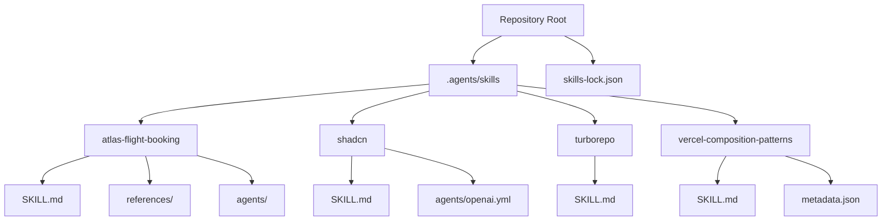
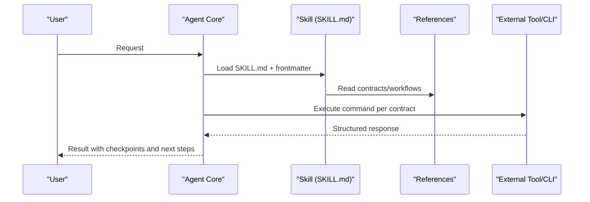
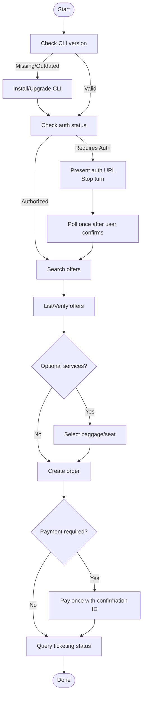
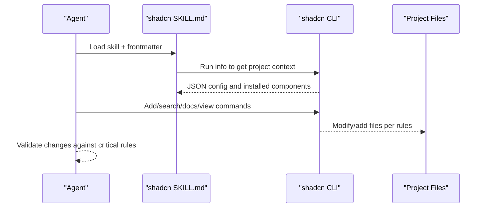
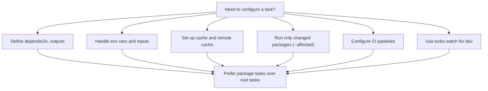
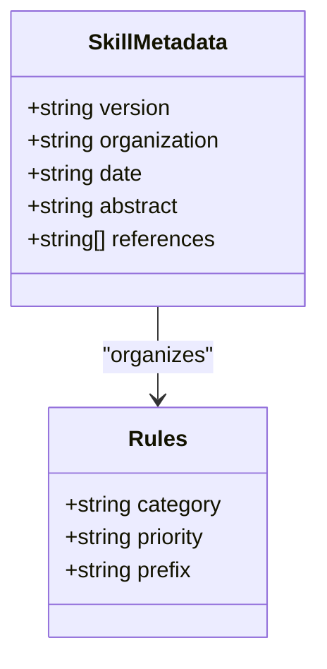
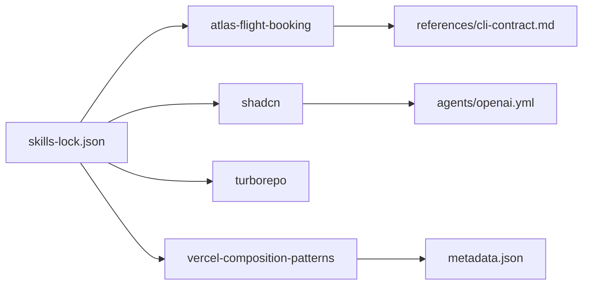

# Skill Structure and Definition

<cite>
**Referenced Files in This Document**
- [skills-lock.json](file://skills-lock.json)
- [README.md](file://README.md)
- [.agents/skills/atlas-flight-booking/SKILL.md](file://.agents/skills/atlas-flight-booking/SKILL.md)
- [.agents/skills/atlas-flight-booking/references/cli-contract.md](file://.agents/skills/atlas-flight-booking/references/cli-contract.md)
- [.agents/skills/shadcn/SKILL.md](file://.agents/skills/shadcn/SKILL.md)
- [.agents/skills/shadcn/agents/openai.yml](file://.agents/skills/shadcn/agents/openai.yml)
- [.agents/skills/turborepo/SKILL.md](file://.agents/skills/turborepo/SKILL.md)
- [.agents/skills/vercel-composition-patterns/SKILL.md](file://.agents/skills/vercel-composition-patterns/SKILL.md)
- [.agents/skills/vercel-composition-patterns/metadata.json](file://.agents/skills/vercel-composition-patterns/metadata.json)
</cite>

## Table of Contents

1. Introduction
2. Project Structure
3. Core Components
4. Architecture Overview
5. Detailed Component Analysis
6. Dependency Analysis
7. Performance Considerations
8. Troubleshooting Guide
9. Conclusion

## Introduction

This document explains the skill structure and definition system used by the agent core. Skills are modular units that encapsulate domain knowledge, workflows, and command contracts behind a standardized SKILL.md file with YAML frontmatter. The system enables agents to:

- Discover skills and their capabilities from structured metadata
- Load relevant references and rules for complex tasks
- Execute safe, deterministic commands via explicit contracts
- Version and pin skills consistently across environments

The repository demonstrates multiple real-world skills (flight booking, UI component management, monorepo build orchestration, React composition patterns) that illustrate best practices for organizing capability descriptions, start procedures, reference organization, and integration with the agent core through structured prompts and command contracts.

## Project Structure

Skills live under .agents/skills/<skill-name>/ and follow a consistent layout:

- SKILL.md: Primary entry point with YAML frontmatter and narrative instructions
- references/: Domain-specific guidance, contracts, and detailed procedures
- agents/: Optional agent interface metadata (e.g., display name, icons)
- assets/, rules/, evals/, cli.md, registry.md: Optional supporting files depending on skill scope

At the repository root, skills-lock.json pins installed skills, their sources, paths, and computed hashes for reproducible installs.

**Diagram sources**

- [skills-lock.json:1-78](file://skills-lock.json#L1-L78)
- [.agents/skills/atlas-flight-booking/SKILL.md:1-71](file://.agents/skills/atlas-flight-booking/SKILL.md#L1-L71)
- [.agents/skills/shadcn/SKILL.md:1-274](file://.agents/skills/shadcn/SKILL.md#L1-L274)
- [.agents/skills/shadcn/agents/openai.yml:1-6](file://.agents/skills/shadcn/agents/openai.yml#L1-L6)
- [.agents/skills/turborepo/SKILL.md:1-800](file://.agents/skills/turborepo/SKILL.md#L1-L800)
- [.agents/skills/vercel-composition-patterns/SKILL.md:1-76](file://.agents/skills/vercel-composition-patterns/SKILL.md#L1-L76)
- [.agents/skills/vercel-composition-patterns/metadata.json:1-12](file://.agents/skills/vercel-composition-patterns/metadata.json#L1-L12)

**Section sources**

- [skills-lock.json:1-78](file://skills-lock.json#L1-L78)
- [README.md:79-94](file://README.md#L79-L94)

## Core Components

- SKILL.md with YAML frontmatter: Declares name, description, optional user-invocable flags, allowed tools, version, and other metadata. It also contains the operational narrative: capability questions, start procedures, workflows, safety rules, and references.
- references/: Contains precise contracts, workflows, error handling, and domain-specific procedures that the agent reads before executing actions.
- agents/: Optional interface metadata for how the skill is presented to users or other systems.
- metadata.json: Optional structured metadata for authoring, versioning, and linking canonical references.

Key responsibilities:

- Capability discovery and routing based on frontmatter fields
- Deterministic execution via explicit command contracts in references
- Safe operation with mandatory checkpoints and minimal side effects
- Version pinning and integrity checks via skills-lock.json

**Section sources**

- [.agents/skills/atlas-flight-booking/SKILL.md:1-71](file://.agents/skills/atlas-flight-booking/SKILL.md#L1-L71)
- [.agents/skills/shadcn/SKILL.md:1-274](file://.agents/skills/shadcn/SKILL.md#L1-L274)
- [.agents/skills/turborepo/SKILL.md:1-800](file://.agents/skills/turborepo/SKILL.md#L1-L800)
- [.agents/skills/vercel-composition-patterns/SKILL.md:1-76](file://.agents/skills/vercel-composition-patterns/SKILL.md#L1-L76)
- [.agents/skills/vercel-composition-patterns/metadata.json:1-12](file://.agents/skills/vercel-composition-patterns/metadata.json#L1-L12)
- [.agents/skills/shadcn/agents/openai.yml:1-6](file://.agents/skills/shadcn/agents/openai.yml#L1-L6)

## Architecture Overview

The agent core loads a skill’s SKILL.md and its referenced documents to execute domain-specific workflows safely. For example, the flight booking skill orchestrates CLI operations using a strict contract defined in references/cli-contract.md, while shadcn skill uses project context and CLI commands to manage components. Turborepo skill provides decision trees and configuration patterns for monorepo builds.

**Diagram sources**

- [.agents/skills/atlas-flight-booking/SKILL.md:26-63](file://.agents/skills/atlas-flight-booking/SKILL.md#L26-L63)
- [.agents/skills/atlas-flight-booking/references/cli-contract.md:9-77](file://.agents/skills/atlas-flight-booking/references/cli-contract.md#L9-L77)
- [.agents/skills/shadcn/SKILL.md:14-21](file://.agents/skills/shadcn/SKILL.md#L14-L21)
- [.agents/skills/turborepo/SKILL.md:99-216](file://.agents/skills/turborepo/SKILL.md#L99-L216)

## Detailed Component Analysis

### Flight Booking Skill

- Frontmatter defines name and description; narrative includes capability questions, start procedure, search/booking workflow, mandatory checkpoints, safety rules, and references.
- Start procedure enforces minimum CLI version, bootstraps tooling if missing, performs authorization, and resumes interrupted tasks deterministically.
- References define exact commands, response envelope, and state transitions for authorization, search, optional services, order creation, payment, and ticketing.

**Diagram sources**

- [.agents/skills/atlas-flight-booking/SKILL.md:26-63](file://.agents/skills/atlas-flight-booking/SKILL.md#L26-L63)
- [.agents/skills/atlas-flight-booking/references/cli-contract.md:9-77](file://.agents/skills/atlas-flight-booking/references/cli-contract.md#L9-L77)

**Section sources**

- [.agents/skills/atlas-flight-booking/SKILL.md:1-71](file://.agents/skills/atlas-flight-booking/SKILL.md#L1-L71)
- [.agents/skills/atlas-flight-booking/references/cli-contract.md:1-78](file://.agents/skills/atlas-flight-booking/references/cli-contract.md#L1-L78)

### shadcn/ui Skill

- Frontmatter declares name, description, user-invocable flag, and allowed tools to constrain execution surface.
- Uses project context injection to adapt to different frameworks, package managers, and component bases.
- Provides critical rules, key patterns, component selection guidance, and a comprehensive workflow for adding/updating components safely.

**Diagram sources**

- [.agents/skills/shadcn/SKILL.md:1-21](file://.agents/skills/shadcn/SKILL.md#L1-L21)
- [.agents/skills/shadcn/SKILL.md:175-205](file://.agents/skills/shadcn/SKILL.md#L175-L205)

**Section sources**

- [.agents/skills/shadcn/SKILL.md:1-274](file://.agents/skills/shadcn/SKILL.md#L1-L274)
- [.agents/skills/shadcn/agents/openai.yml:1-6](file://.agents/skills/shadcn/agents/openai.yml#L1-L6)

### Turborepo Skill

- Frontmatter includes version metadata and triggers for monorepo tasks.
- Provides decision trees for task configuration, caching, filtering, environment variables, CI setup, watch mode, and package structure.
- Emphasizes package tasks over root tasks, correct use of turbo run vs shorthand, and anti-patterns to avoid.

**Diagram sources**

- [.agents/skills/turborepo/SKILL.md:1-13](file://.agents/skills/turborepo/SKILL.md#L1-L13)
- [.agents/skills/turborepo/SKILL.md:99-216](file://.agents/skills/turborepo/SKILL.md#L99-L216)

**Section sources**

- [.agents/skills/turborepo/SKILL.md:1-800](file://.agents/skills/turborepo/SKILL.md#L1-L800)

### Vercel Composition Patterns Skill

- Frontmatter includes license, author, and version metadata.
- Organizes rules by priority and category, with quick reference and links to detailed rule files.
- Demonstrates how to structure a skill focused on architectural guidelines and code standards.

**Diagram sources**

- [.agents/skills/vercel-composition-patterns/metadata.json:1-12](file://.agents/skills/vercel-composition-patterns/metadata.json#L1-L12)
- [.agents/skills/vercel-composition-patterns/SKILL.md:24-56](file://.agents/skills/vercel-composition-patterns/SKILL.md#L24-L56)

**Section sources**

- [.agents/skills/vercel-composition-patterns/SKILL.md:1-76](file://.agents/skills/vercel-composition-patterns/SKILL.md#L1-L76)
- [.agents/skills/vercel-composition-patterns/metadata.json:1-12](file://.agents/skills/vercel-composition-patterns/metadata.json#L1-L12)

## Dependency Analysis

- skills-lock.json pins each skill’s source, type, path, and computed hash, ensuring reproducible installs and integrity verification.
- Skills depend on external tools (CLIs, SDKs) invoked via explicit commands defined in references.
- Some skills include additional metadata or agent interface files to control presentation and behavior.

**Diagram sources**

- [skills-lock.json:1-78](file://skills-lock.json#L1-L78)
- [.agents/skills/atlas-flight-booking/references/cli-contract.md:1-78](file://.agents/skills/atlas-flight-booking/references/cli-contract.md#L1-L78)
- [.agents/skills/shadcn/agents/openai.yml:1-6](file://.agents/skills/shadcn/agents/openai.yml#L1-L6)
- [.agents/skills/vercel-composition-patterns/metadata.json:1-12](file://.agents/skills/vercel-composition-patterns/metadata.json#L1-L12)

**Section sources**

- [skills-lock.json:1-78](file://skills-lock.json#L1-L78)

## Performance Considerations

- Prefer package-level tasks and explicit dependencies to maximize parallelization and caching (see Turborepo skill).
- Use minimal, targeted CLI invocations and avoid unnecessary retries or broad scans.
- Leverage project context to avoid redundant detection and to tailor commands to the current environment.
- Keep references concise and authoritative to reduce cognitive load and parsing overhead.

[No sources needed since this section provides general guidance]

## Troubleshooting Guide

- Authorization failures: Follow the contract’s prescribed flow—present the authorization URL, stop the turn, poll once after user confirmation, and resume only when authorized.
- Version mismatches: Enforce minimum versions at start; bootstrap or upgrade tooling automatically when missing or outdated.
- Command errors: Consume structured responses, branch on codes, preserve opaque IDs, and retry read-only operations at most once.
- Environment issues: Ensure required variables are declared in task configurations and included in inputs where necessary.

**Section sources**

- [.agents/skills/atlas-flight-booking/references/cli-contract.md:9-27](file://.agents/skills/atlas-flight-booking/references/cli-contract.md#L9-L27)
- [.agents/skills/atlas-flight-booking/SKILL.md:26-38](file://.agents/skills/atlas-flight-booking/SKILL.md#L26-L38)
- [.agents/skills/turborepo/SKILL.md:679-691](file://.agents/skills/turborepo/SKILL.md#L679-L691)

## Conclusion

The skill system standardizes how agents encapsulate domain expertise, enforce safe execution, and integrate with external tools through explicit contracts. By organizing skills around SKILL.md frontmatter, robust references, and optional metadata, teams can create reusable, versioned, and maintainable modules that scale with complexity. Adopting the demonstrated patterns—clear capability statements, deterministic start procedures, strict command contracts, and organized references—ensures reliable automation and consistent outcomes across diverse domains.
