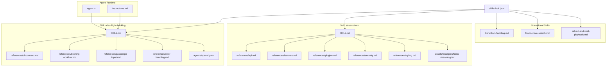
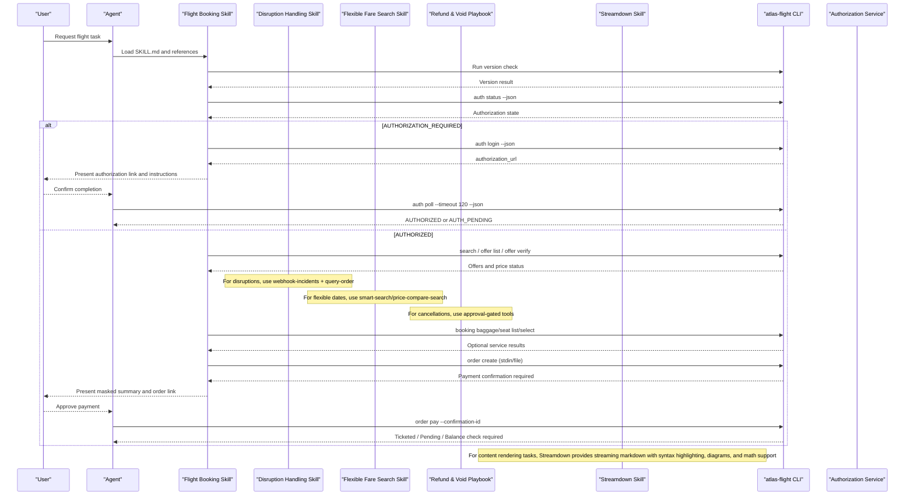
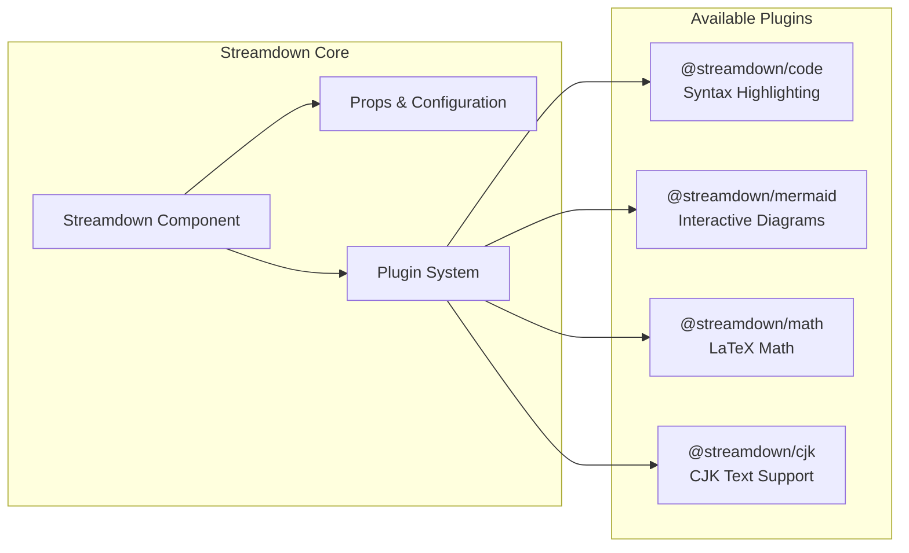
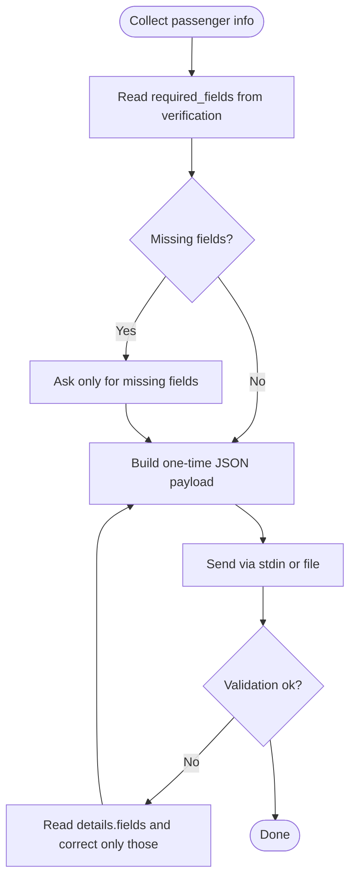
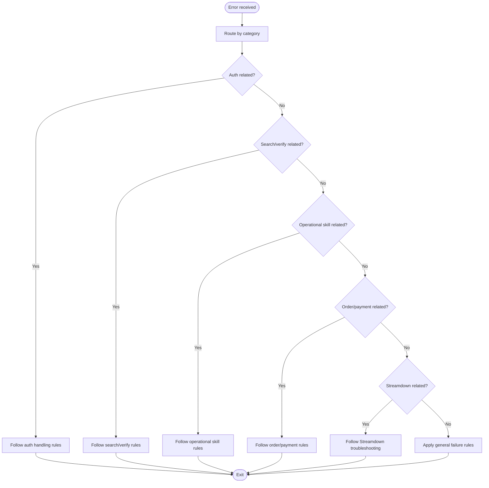
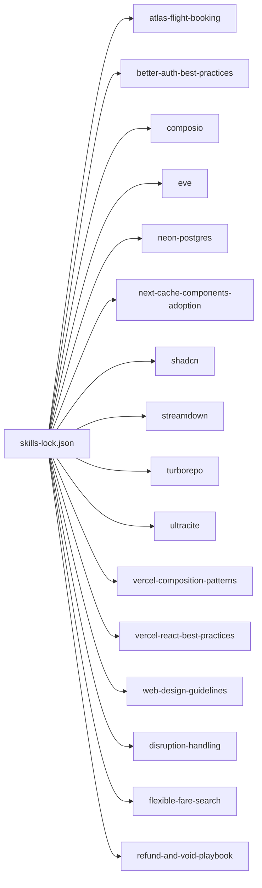
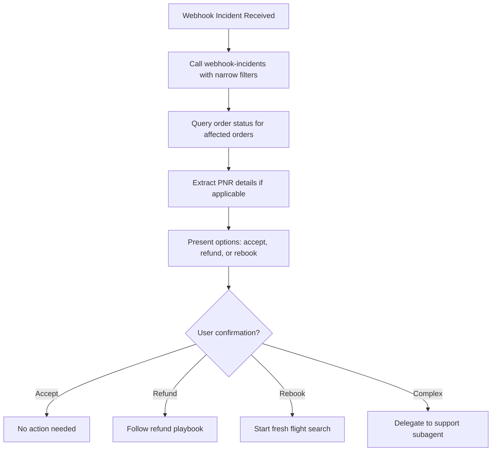
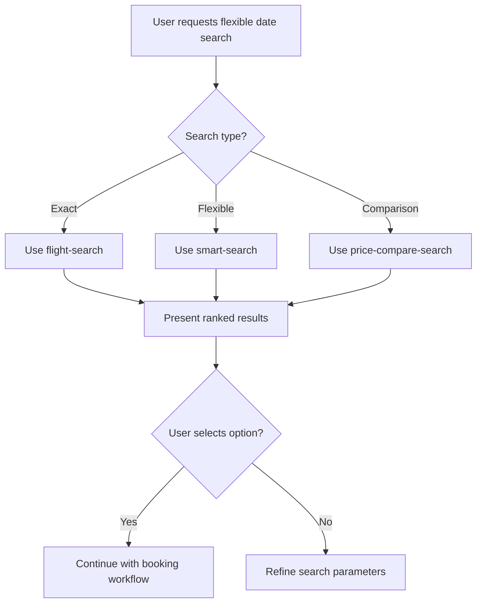
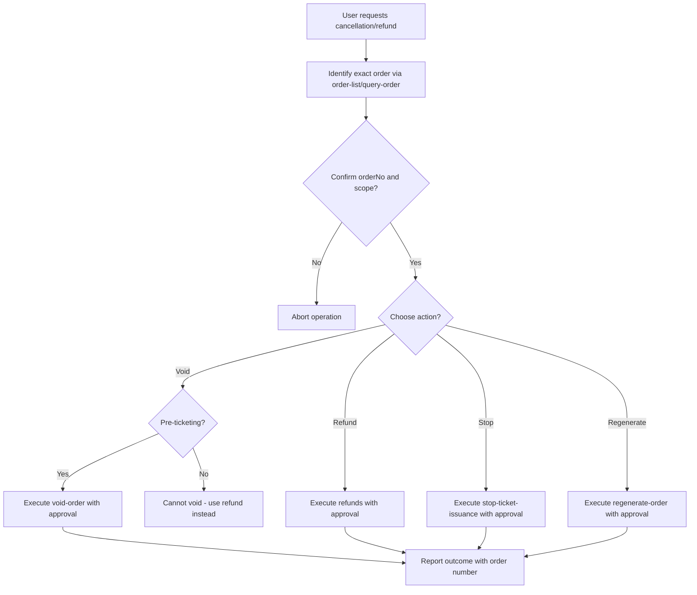

# Skill System

<cite>
**Referenced Files in This Document**
- [SKILL.md](file://.agents/skills/atlas-flight-booking/SKILL.md)
- [cli-contract.md](file://.agents/skills/atlas-flight-booking/references/cli-contract.md)
- [booking-workflow.md](file://.agents/skills/atlas-flight-booking/references/booking-workflow.md)
- [passenger-input.md](file://.agents/skills/atlas-flight-booking/references/passenger-input.md)
- [error-handling.md](file://.agents/skills/atlas-flight-booking/references/error-handling.md)
- [openai.yaml](file://.agents/skills/atlas-flight-booking/agents/openai.yaml)
- [streamdown SKILL.md](file://.agents/skills/streamdown/SKILL.md)
- [streamdown api.md](file://.agents/skills/streamdown/references/api.md)
- [streamdown features.md](file://.agents/skills/streamdown/references/features.md)
- [streamdown plugins.md](file://.agents/skills/streamdown/references/plugins.md)
- [streamdown security.md](file://.agents/skills/streamdown/references/security.md)
- [streamdown styling.md](file://.agents/skills/streamdown/references/styling.md)
- [basic-streaming.tsx](file://.agents/skills/streamdown/assets/examples/basic-streaming.tsx)
- [skills-lock.json](file://skills-lock.json)
- [agent.ts](file://apps/runtime/agent/agent.ts)
- [instructions.md](file://apps/runtime/agent/instructions.md)
- [package.json](file://apps/runtime/package.json)
- [disruption-handling.md](file://apps/runtime/agent/skills/disruption-handling.md)
- [flexible-fare-search.md](file://apps/runtime/agent/skills/flexible-fare-search.md)
- [refund-and-void-playbook.md](file://apps/runtime/agent/skills/refund-and-void-playbook.md)
- [webhook-incidents.ts](file://apps/runtime/agent/tools/webhook-incidents.ts)
- [smart-search.ts](file://apps/runtime/agent/tools/smart-search.ts)
- [price-compare-search.ts](file://apps/runtime/agent/tools/price-compare-search.ts)
- [refunds.ts](file://apps/runtime/agent/tools/refunds.ts)
- [void-order.ts](file://apps/runtime/agent/tools/void-order.ts)
- [stop-ticket-issuance.ts](file://apps/runtime/agent/tools/stop-ticket-issuance.ts)
- [regenerate-order.ts](file://apps/runtime/agent/tools/regenerate-order.ts)
- [support instructions.md](file://apps/runtime/agent/subagents/support/instructions.md)
</cite>

## Update Summary

**Changes Made**

- Added comprehensive documentation for three new operational skills: disruption handling, flexible fare search, and refund/void playbook
- Enhanced post-booking workflow section with disruption management procedures
- Updated tool integration patterns to include new search and cancellation capabilities
- Expanded error handling strategies to cover irreversible actions and confirmation workflows
- Added support subagent delegation patterns for complex cases

## Table of Contents

1. [Introduction](#introduction)
2. [Project Structure](#project-structure)
3. [Core Components](#core-components)
4. [Architecture Overview](#architecture-overview)
5. [Detailed Component Analysis](#detailed-component-analysis)
6. [Dependency Analysis](#dependency-analysis)
7. [Performance Considerations](#performance-considerations)
8. [Troubleshooting Guide](#troubleshooting-guide)
9. [Conclusion](#conclusion)
10. [Appendices](#appendices)

## Introduction

This document explains the skill system that organizes agent behaviors and domain knowledge into reusable, versioned modules. It focuses on how skills are structured, defined, and integrated with the agent core, using the Atlas Flight Booking skill as a comprehensive example. The system now includes specialized skills like Streamdown for streaming-optimized React Markdown rendering with syntax highlighting, Mermaid diagrams, math rendering, and CJK support, plus operational skills for disruption handling, flexible fare searches, and comprehensive refund/void workflows. You will learn workflow definitions, CLI contracts, passenger input handling, error management strategies, and best practices for creating custom skills, defining dependencies, implementing prompts, and testing functionality.

## Project Structure

Skills are stored under .agents/skills/<skill-name>. Each skill typically includes:

- A SKILL.md file that defines capability, behavior, and references to detailed guides.
- A references directory containing stable contracts and workflows (e.g., CLI contract, booking workflow, passenger input, error handling).
- Optional agents configuration files for display metadata and default prompts.
- A global skills-lock.json that pins installed skills to their sources and versions.

The agent runtime is minimal and delegates execution to the framework; skills provide the operational guidance and contracts the agent follows at runtime.



**Diagram sources**

- [agent.ts:1-8](file://apps/runtime/agent/agent.ts#L1-L8)
- [instructions.md:1-4](file://apps/runtime/agent/instructions.md#L1-L4)
- [SKILL.md:1-71](file://.agents/skills/atlas-flight-booking/SKILL.md#L1-L71)
- [streamdown SKILL.md:1-177](file://.agents/skills/streamdown/SKILL.md#L1-L177)
- [disruption-handling.md:1-16](file://apps/runtime/agent/skills/disruption-handling.md#L1-L16)
- [flexible-fare-search.md:1-17](file://apps/runtime/agent/skills/flexible-fare-search.md#L1-L17)
- [refund-and-void-playbook.md:1-27](file://apps/runtime/agent/skills/refund-and-void-playbook.md#L1-L27)
- [skills-lock.json:1-84](file://skills-lock.json#L1-L84)

**Section sources**

- [SKILL.md:1-71](file://.agents/skills/atlas-flight-booking/SKILL.md#L1-L71)
- [streamdown SKILL.md:1-177](file://.agents/skills/streamdown/SKILL.md#L1-L177)
- [disruption-handling.md:1-16](file://apps/runtime/agent/skills/disruption-handling.md#L1-L16)
- [flexible-fare-search.md:1-17](file://apps/runtime/agent/skills/flexible-fare-search.md#L1-L17)
- [refund-and-void-playbook.md:1-27](file://apps/runtime/agent/skills/refund-and-void-playbook.md#L1-L27)
- [skills-lock.json:1-84](file://skills-lock.json#L1-L84)
- [agent.ts:1-8](file://apps/runtime/agent/agent.ts#L1-L8)
- [instructions.md:1-4](file://apps/runtime/agent/instructions.md#L1-L4)

## Core Components

- **Flight Booking Skill**: Declares name, description, minimum supported tooling versions, start-up procedures, search and booking rules, mandatory checkpoints, safety constraints, and references to detailed guides.
- **Streamdown Skill**: Streaming-optimized React Markdown renderer with built-in streaming support, security, and interactive controls. Triggers on installing/configuring Streamdown, setting up plugins (code, mermaid, math, cjk), styling/theming, AI streaming integration, security configuration, carets/static mode usage, and troubleshooting Tailwind/Shiki/Vite issues.
- **Disruption Handling Skill**: Procedural guide for managing flight disruptions, schedule changes, cancellations, and incident alerts with triage, verification, and option presentation workflows.
- **Flexible Fare Search Skill**: Strategy guide for handling flexible date searches, fare comparisons, and cheapest day queries using smart-search and price-compare-search tools.
- **Refund and Void Playbook**: Comprehensive procedural guide for cancellations, refunds, voids, stop ticket issuance, and order regeneration with explicit warnings about irreversible actions and proper confirmation workflows.
- **CLI Contract**: Enumerates exact commands, response envelope fields, and strict rules for authorization, search, optional services, order creation, payment, and status queries.
- **Booking Workflow**: Defines safe end-to-end flow from search and verification through optional services, passenger input, order creation, payment confirmation, and ticketing outcomes.
- **Passenger Input**: Specifies collection rules, one-time delivery via stdin or file, payload shape, and safe correction flows.
- **Error Handling**: Maps every non-success code to normalized agent behavior, including retry limits, side-effect uncertainty, and user-facing messaging.
- **Plugin Architecture**: Modular plugin system supporting code highlighting (@streamdown/code), Mermaid diagrams (@streamdown/mermaid), LaTeX math (@streamdown/math), and CJK text support (@streamdown/cjk).
- **Agent Interface Metadata**: Provides display name, short description, and default prompt for integration points.

**Updated** Added three new operational skills covering disruption handling, flexible fare search strategies, and comprehensive refund/void procedures with explicit safety protocols.

**Section sources**

- [SKILL.md:1-71](file://.agents/skills/atlas-flight-booking/SKILL.md#L1-L71)
- [streamdown SKILL.md:1-177](file://.agents/skills/streamdown/SKILL.md#L1-L177)
- [disruption-handling.md:1-16](file://apps/runtime/agent/skills/disruption-handling.md#L1-L16)
- [flexible-fare-search.md:1-17](file://apps/runtime/agent/skills/flexible-fare-search.md#L1-L17)
- [refund-and-void-playbook.md:1-27](file://apps/runtime/agent/skills/refund-and-void-playbook.md#L1-L27)
- [cli-contract.md:1-78](file://.agents/skills/atlas-flight-booking/references/cli-contract.md#L1-L78)
- [booking-workflow.md:1-63](file://.agents/skills/atlas-flight-booking/references/booking-workflow.md#L1-L63)
- [passenger-input.md:1-52](file://.agents/skills/atlas-flight-booking/references/passenger-input.md#L1-L52)
- [error-handling.md:1-74](file://.agents/skills/atlas-flight-booking/references/error-handling.md#L1-L74)
- [openai.yaml:1-5](file://.agents/skills/atlas-flight-booking/agents/openai.yaml#L1-L5)

## Architecture Overview

At runtime, the agent loads the skill's SKILL.md and its referenced guides to orchestrate external tooling (the Atlas Flight Booking CLI). The skill enforces version checks, authorization, search, verification, optional services, passenger data collection, order creation, payment confirmation, and ticketing status. All operations branch on stable codes and preserve opaque IDs exactly as returned.

For content rendering, Streamdown provides streaming-optimized markdown rendering with real-time updates, syntax highlighting, diagram support, and mathematical notation rendering.

Operational skills extend the booking workflow with post-booking management capabilities including disruption handling, flexible fare searches, and comprehensive refund/void procedures with explicit safety protocols.



**Diagram sources**

- [SKILL.md:26-66](file://.agents/skills/atlas-flight-booking/SKILL.md#L26-L66)
- [cli-contract.md:9-77](file://.agents/skills/atlas-flight-booking/references/cli-contract.md#L9-L77)
- [booking-workflow.md:1-63](file://.agents/skills/atlas-flight-booking/references/booking-workflow.md#L1-L63)
- [disruption-handling.md:7-15](file://apps/runtime/agent/skills/disruption-handling.md#L7-L15)
- [flexible-fare-search.md:7-16](file://apps/runtime/agent/skills/flexible-fare-search.md#L7-L16)
- [refund-and-void-playbook.md:7-26](file://apps/runtime/agent/skills/refund-and-void-playbook.md#L7-L26)
- [streamdown SKILL.md:11-97](file://.agents/skills/streamdown/SKILL.md#L11-L97)

## Detailed Component Analysis

### Skill Definition Patterns

- **Capability declaration**: Name, description, and when to trigger.
- **Minimum supported tooling**: Enforce CLI version before any operation.
- **Start procedure**: Detect and install required tooling if missing, then perform authorization checks.
- **References**: Point to stable contracts for commands, workflows, inputs, and errors.
- **Safety and checkpoints**: Define mandatory stops for authorization, price increases, seat fallbacks, and payment.
- **Plugin-based architecture**: Streamdown uses modular plugins for code highlighting, diagrams, math, and CJK support.

**Updated** Added operational skill patterns for disruption handling, flexible fare search, and refund/void procedures with explicit safety protocols and confirmation workflows.

**Section sources**

- [SKILL.md:1-71](file://.agents/skills/atlas-flight-booking/SKILL.md#L1-L71)
- [streamdown SKILL.md:1-177](file://.agents/skills/streamdown/SKILL.md#L1-L177)
- [disruption-handling.md:1-16](file://apps/runtime/agent/skills/disruption-handling.md#L1-L16)
- [flexible-fare-search.md:1-17](file://apps/runtime/agent/skills/flexible-fare-search.md#L1-L17)
- [refund-and-void-playbook.md:1-27](file://apps/runtime/agent/skills/refund-and-void-playbook.md#L1-L27)

### CLI Contract and Command Flow

- Exact commands: Use only documented commands; request JSON output for all subcommands.
- Response envelope: Read schema_version, status, code, message, retryable, request_id, data, details; treat IDs as opaque and payment confirmation IDs as single-use.
- Authorization flow: Login, present authorization URL, bounded poll once, resume after AUTHORIZED.
- Search and verification: One departure date per new search; flexible-date comparisons orchestrated by the agent; preserve search_id and offer_id; verify selected offers; confirm increased prices explicitly.
- Optional services: List and select baggage/seat only when supported; map natural-language choices to CLI seat-policy values.
- Order and payment: Create order once; prefer stdin for passenger data; present current payment summary; pay once with exact confirmation ID; query status for uncertain outcomes.

**Updated** Added operational command flows for disruption handling, flexible fare searches, and refund/void procedures with approval gates and safety protocols.

```mermaid
flowchart TD
Start(["Start"]) --> Ver["Verify CLI version"]
Ver --> Auth{"Authorized?"}
Auth --> |No| Login["Run auth login"]
Login --> Poll["Poll once (bounded timeout)"]
Poll --> AuthOk{"AUTHORIZED?"}
AuthOk --> |Yes| Search["Search and list offers"]
AuthOk --> |No| Wait["Wait for user confirmation"]
Search --> Verify["Verify selected offer"]
Verify --> OptSvc{"Optional services needed?"}
OptSvc --> |Yes| Services["List/select baggage/seat"]
OptSvc --> |No| Order["Create order (stdin/file)"]
Services --> Order
Order --> PayReq{"Payment confirmation required?"}
PayReq --> |Yes| Summary["Present masked summary + order link"]
Summary --> Approve{"User approves?"}
Approve --> |Yes| Pay["order pay with confirmation-id"]
Approve --> |No| Stop["Stop"]
PayReq --> |No| Status["Query order status"]
Pay --> Result{"Ticketed / Pending / Balance check"}
Result --> End(["End"])
Note over Search : For flexible dates, use smart-search or price-compare-search
Note over Order : For disruptions, use webhook-incidents first
Note over Status : For cancellations, use approval-gated refund/void tools
```

**Diagram sources**

- [cli-contract.md:9-77](file://.agents/skills/atlas-flight-booking/references/cli-contract.md#L9-L77)
- [booking-workflow.md:1-63](file://.agents/skills/atlas-flight-booking/references/booking-workflow.md#L1-L63)
- [disruption-handling.md:7-15](file://apps/runtime/agent/skills/disruption-handling.md#L7-L15)
- [flexible-fare-search.md:7-16](file://apps/runtime/agent/skills/flexible-fare-search.md#L7-L16)
- [refund-and-void-playbook.md:7-26](file://apps/runtime/agent/skills/refund-and-void-playbook.md#L7-L26)

**Section sources**

- [cli-contract.md:1-78](file://.agents/skills/atlas-flight-booking/references/cli-contract.md#L1-L78)
- [booking-workflow.md:1-63](file://.agents/skills/atlas-flight-booking/references/booking-workflow.md#L1-L63)
- [disruption-handling.md:1-16](file://apps/runtime/agent/skills/disruption-handling.md#L1-L16)
- [flexible-fare-search.md:1-17](file://apps/runtime/agent/skills/flexible-fare-search.md#L1-L17)
- [refund-and-void-playbook.md:1-27](file://apps/runtime/agent/skills/refund-and-void-playbook.md#L1-L27)

### Operational Skills Integration

#### Disruption Handling Workflow

The disruption handling skill provides a systematic approach to managing flight disruptions, schedule changes, cancellations, and incident alerts:

1. **Triage**: Call `webhook-incidents` with narrow filters (orderNo, pnr, or time window) - read-only and safe to repeat
2. **Verify Current State**: For each affected order, call `query-order` to confirm ticketing status and live itinerary
3. **Get Booking Details**: If incident references a PNR you manage, use `extract-pnr` to read booking details
4. **Explain Options**: Present changes in plain language with options: accept change, refund (follow refund playbook), or rebook (new order)
5. **Never Act Unilaterally**: Require explicit user confirmation for refunds, voids, and rebookings
6. **Delegate Complex Cases**: Delegate multi-order or multi-passenger cases to support subagent

#### Flexible Fare Search Strategy

The flexible fare search skill handles various date flexibility scenarios:

- **Exact Dates**: Use standard `flight-search` with normal booking workflow
- **Flexible Dates**: Use `smart-search` which accepts flight-search style inputs with flexible date handling
- **Fare Comparison**: Use `price-compare-search` to compare fares across dates for single routes

Key rules include confirming route/date windows/passenger counts, presenting ranked results with trade-offs, and continuing with standard booking workflow upon selection.

#### Refund and Void Procedures

The refund and void playbook provides comprehensive procedures for cancellations with explicit safety protocols:

**Before Any Call**:

- Identify exact order via `order-list` and `query-order`
- Confirm with user: exact `orderNo` and scope (full/partial via `subOrderNo`)
- Understand differences between void-order (irreversible, pre-ticketing), refunds (ticketed orders), stop-ticket-issuance (pending ticketing), and regenerate-order (failed orders)

**During Execution**:

- Each tool is approval-gated - never work around prompts
- Check balance first for refund paths involving wallet credit
- Never retry automatically on failures

**After Completion**:

- Query `query-order` instead of retrying failed calls
- Treat pending states as processing, not failures
- Report outcomes with order numbers and expected follow-ups

**Updated** Added comprehensive operational skills with explicit safety protocols, approval gates, and confirmation workflows for critical business operations.

**Section sources**

- [disruption-handling.md:7-15](file://apps/runtime/agent/skills/disruption-handling.md#L7-L15)
- [flexible-fare-search.md:7-16](file://apps/runtime/agent/skills/flexible-fare-search.md#L7-L16)
- [refund-and-void-playbook.md:7-26](file://apps/runtime/agent/skills/refund-and-void-playbook.md#L7-L26)
- [webhook-incidents.ts:7-53](file://apps/runtime/agent/tools/webhook-incidents.ts#L7-L53)
- [smart-search.ts:7-29](file://apps/runtime/agent/tools/smart-search.ts#L7-L29)
- [price-compare-search.ts:7-29](file://apps/runtime/agent/tools/price-compare-search.ts#L7-L29)
- [refunds.ts:10-26](file://apps/runtime/agent/tools/refunds.ts#L10-L26)
- [void-order.ts:10-26](file://apps/runtime/agent/tools/void-order.ts#L10-L26)
- [stop-ticket-issuance.ts:8-18](file://apps/runtime/agent/tools/stop-ticket-issuance.ts#L8-L18)
- [regenerate-order.ts:8-18](file://apps/runtime/agent/tools/regenerate-order.ts#L8-L18)

### Streamdown Plugin Architecture

Streamdown implements a modular plugin system for extending markdown rendering capabilities:

- **Code Highlighting** (@streamdown/code): Syntax highlighting via Shiki with 200+ languages, lazy loading, and theme support.
- **Mermaid Diagrams** (@streamdown/mermaid): Interactive diagrams including flowcharts, sequence diagrams, state diagrams, and more.
- **Math Rendering** (@streamdown/math): LaTeX math rendering via KaTeX with inline and block notation support.
- **CJK Support** (@streamdown/cjk): Chinese, Japanese, Korean text support with proper punctuation handling.



**Diagram sources**

- [streamdown SKILL.md:130-145](file://.agents/skills/streamdown/SKILL.md#L130-L145)
- [streamdown plugins.md:14-30](file://.agents/skills/streamdown/references/plugins.md#L14-L30)

**Section sources**

- [streamdown SKILL.md:130-145](file://.agents/skills/streamdown/SKILL.md#L130-L145)
- [streamdown plugins.md:1-257](file://.agents/skills/streamdown/references/plugins.md#L1-L257)

### Passenger Input Handling

- Collection rule: Ask only for required fields from verification; carry traveler_id and passenger_type from CLI; do not invent IDs.
- One-time delivery: Prefer stdin for a single JSON payload; never echo or log personal data; use file path only when provided by the user.
- Payload shape: Build passengers array and contact object; uppercase names; preserve document numbers; format mobile numbers with country code.
- Safe correction: On validation failures, read details.fields, ask only for those fields, rebuild full payload, and submit once.



**Diagram sources**

- [passenger-input.md:1-52](file://.agents/skills/atlas-flight-booking/references/passenger-input.md#L1-L52)

**Section sources**

- [passenger-input.md:1-52](file://.agents/skills/atlas-flight-booking/references/passenger-input.md#L1-L52)

### Error Management Strategies

- Branch on code, never message; keep internal causes out of user-facing output.
- Authorization: Handle required, pending, expired, session missing, service unavailable, subscription required, secure store unavailable, credential rejected.
- Search and verification: Treat no results as empty success; handle limit reached, expired offers/bookings, price confirmation, verification unavailability, flight unavailable, invalid input.
- Optional services and passengers: Skip unavailable services; relist invalid selections; correct only specified fields; report unsupported combinations.
- Order, payment, ticketing: Present summaries for confirmation; avoid duplicate orders/payments; query status for unknown or processing states; report ticketed/pending/cancelled/not found; respect retryable flags without repeating side effects.
- **Operational Skills Errors**:
  - Disruption handling: Handle webhook incidents filtering, order status verification, and PNR extraction failures
  - Flexible fare search: Manage smart-search and price-compare-search limitations and result formatting
  - Refund/void procedures: Address approval gate bypasses, irreversible action warnings, and pending state handling
- Streamdown-specific errors: Handle Tailwind configuration issues, Shiki warnings, Vite SSR problems, and plugin loading failures.

**Updated** Added operational skill error handling for disruption management, flexible fare searches, and refund/void procedures with explicit warnings about irreversible actions and proper confirmation workflows.



**Diagram sources**

- [error-handling.md:1-74](file://.agents/skills/atlas-flight-booking/references/error-handling.md#L1-L74)
- [disruption-handling.md:7-15](file://apps/runtime/agent/skills/disruption-handling.md#L7-L15)
- [flexible-fare-search.md:11-16](file://apps/runtime/agent/skills/flexible-fare-search.md#L11-L16)
- [refund-and-void-playbook.md:17-26](file://apps/runtime/agent/skills/refund-and-void-playbook.md#L17-L26)
- [streamdown features.md:185-227](file://.agents/skills/streamdown/references/features.md#L185-L227)

**Section sources**

- [error-handling.md:1-74](file://.agents/skills/atlas-flight-booking/references/error-handling.md#L1-L74)
- [disruption-handling.md:1-16](file://apps/runtime/agent/skills/disruption-handling.md#L1-L16)
- [flexible-fare-search.md:1-17](file://apps/runtime/agent/skills/flexible-fare-search.md#L1-L17)
- [refund-and-void-playbook.md:1-27](file://apps/runtime/agent/skills/refund-and-void-playbook.md#L1-L27)
- [streamdown features.md:185-227](file://.agents/skills/streamdown/references/features.md#L185-L227)

### Integration with Agent Core

- The agent runtime is minimal and uses the framework to define an agent instance. Skills supply the operational logic and contracts.
- Default instructions provide identity context; skills override behavior with precise workflows and CLI usage.
- The runtime package declares dependencies including the agent framework used to compile and run agents.
- Streamdown integrates seamlessly with AI streaming frameworks like Vercel AI SDK for real-time content rendering.
- **Operational Skills Integration**: New operational skills integrate with existing booking workflow through shared tools and support subagent delegation for complex cases.

**Updated** Added operational skills integration with existing booking workflow and support subagent delegation patterns for complex disruption and cancellation cases.

**Section sources**

- [agent.ts:1-8](file://apps/runtime/agent/agent.ts#L1-L8)
- [instructions.md:1-4](file://apps/runtime/agent/instructions.md#L1-L4)
- [package.json:1-29](file://apps/runtime/package.json#L1-L29)
- [streamdown SKILL.md:61-97](file://.agents/skills/streamdown/SKILL.md#L61-L97)
- [support instructions.md:1-17](file://apps/runtime/agent/subagents/support/instructions.md#L1-L17)

## Dependency Analysis

Skills are pinned and tracked centrally. The lock file records each skill's source repository, type, relative path within the source, and a computed hash to ensure integrity and reproducibility.



**Updated** Added three new operational skills to the dependency graph showing integration with the overall skill ecosystem.

**Diagram sources**

- [skills-lock.json:1-84](file://skills-lock.json#L1-L84)

**Section sources**

- [skills-lock.json:1-84](file://skills-lock.json#L1-L84)

## Performance Considerations

- Minimize network calls: Reuse retained search_id and offer_id where allowed; avoid unnecessary re-searches.
- Batch comparisons on the agent side: For flexible dates, issue one complete search per requested date and merge results locally rather than relying on unsupported range arguments.
- Respect retryable flags: Limit retries to one identical read-only command; never repeat side-effecting operations like order creation or payment.
- Prefer stdin for passenger data: Reduces argument size and avoids echoing sensitive data into logs or history.
- Streamdown performance: Utilize memoization, lazy language loading, and streaming optimizations for efficient markdown rendering.
- Plugin efficiency: Install only required Streamdown plugins to minimize bundle size and improve load times.
- **Operational Skills Performance**:
  - Use narrow filters for webhook incidents to reduce API load
  - Cache order status checks during disruption handling workflows
  - Batch flexible fare searches for optimal performance
  - Avoid redundant approval prompts in refund/void workflows

**Updated** Added operational skill performance considerations for disruption handling, flexible fare searches, and refund/void procedures.

[No sources needed since this section provides general guidance]

## Troubleshooting Guide

Common issues and resolutions:

- Authorization required or pending: Follow login and bounded poll steps; wait for user confirmation before polling again.
- Offer expired or flight unavailable: Replay retained search once; if still unavailable, collect new inputs and search again.
- Price increased: Present old and new totals; obtain explicit confirmation before continuing.
- Seat unavailable: Ask user policy (continue without seat, cancel order, accept similar seat); pass the corresponding seat-policy to order creation.
- Payment balance check required: Explain possible insufficient balance; show order link when available; do not retry payment.
- Unknown order or payment status: Query order status using order_no; do not replay side-effecting commands.
- **Disruption Handling Issues**:
  - Webhook incidents filter too broad: Narrow filters by orderNo, pnr, or time window
  - PNR extraction failures: Ensure identifying fields match prior API responses exactly
  - Complex multi-order cases: Delegate to support subagent with complete context
- **Flexible Fare Search Issues**:
  - Smart-search limitations: Fall back to multiple exact date searches if flexible search returns nothing
  - Price comparison accuracy: Verify route and passenger counts match across searches
  - Result formatting: Present ranked lists with key trade-offs, not raw routing payloads
- **Refund/Void Issues**:
  - Approval gate bypasses: Never work around prompts; require explicit user confirmation
  - Irreversible action warnings: Clearly explain void-order irreversibility before proceeding
  - Pending state confusion: Distinguish between processing (not failure) and actual failures
  - Automatic retry attempts: Always query order status instead of retrying failed calls
- **Streamdown-specific issues**:
  - Tailwind styles missing: Add `@source` directive or `content` entry for `node_modules/streamdown/dist/*.js`
  - Math not rendering: Import `katex/dist/katex.min.css`
  - Caret not showing: Both `caret` prop AND `isAnimating={true}` are required
  - Copy buttons during streaming: Disabled automatically when `isAnimating={true}`
  - Link safety modal appearing: Enabled by default; disable with `linkSafety={{ enabled: false }}`
  - Shiki warning in Next.js: Install `shiki` explicitly, add to `transpilePackages`
  - `allowedTags` not working: Only works with default rehype plugins
  - Math uses `$$` not `$`: Single dollar is disabled by default to avoid currency conflicts

**Updated** Added comprehensive troubleshooting sections for disruption handling, flexible fare search, and refund/void procedures with specific error scenarios and resolution steps.

**Section sources**

- [error-handling.md:1-74](file://.agents/skills/atlas-flight-booking/references/error-handling.md#L1-L74)
- [booking-workflow.md:1-63](file://.agents/skills/atlas-flight-booking/references/booking-workflow.md#L1-L63)
- [disruption-handling.md:7-15](file://apps/runtime/agent/skills/disruption-handling.md#L7-L15)
- [flexible-fare-search.md:11-16](file://apps/runtime/agent/skills/flexible-fare-search.md#L11-L16)
- [refund-and-void-playbook.md:17-26](file://apps/runtime/agent/skills/refund-and-void-playbook.md#L17-L26)
- [streamdown SKILL.md:167-177](file://.agents/skills/streamdown/SKILL.md#L167-L177)
- [streamdown features.md:185-227](file://.agents/skills/streamdown/references/features.md#L185-L227)

## Conclusion

The skill system encapsulates complex domain workflows into clear, versioned modules that guide the agent to interact safely and reliably with external tools. The Atlas Flight Booking skill demonstrates robust patterns for authorization, search and verification, optional services, passenger input, order creation, payment confirmation, and error handling. The addition of Streamdown skill provides powerful markdown rendering capabilities with streaming support, syntax highlighting, diagrams, math rendering, and internationalization. The new operational skills for disruption handling, flexible fare search, and comprehensive refund/void procedures extend the system with critical post-booking management capabilities, featuring explicit safety protocols, approval gates, and confirmation workflows for irreversible actions. By following these patterns, teams can build custom skills that integrate seamlessly with the agent core while maintaining consistency, safety, and reproducibility.

[No sources needed since this section summarizes without analyzing specific files]

## Appendices

### Creating Custom Skills

- Define SKILL.md with name, description, capability scope, minimum supported tooling, start procedure, and references to detailed guides.
- Provide references for CLI contracts, workflows, inputs, and error handling to keep behavior deterministic.
- Add agent metadata (display name, short description, default prompt) if integrating with UI surfaces.
- Consider plugin-based architecture for extensible functionality like Streamdown's modular design.
- **Operational Skills Pattern**: Include explicit safety protocols, approval gates, and confirmation workflows for critical business operations.

**Updated** Added operational skill creation patterns with emphasis on safety protocols and approval workflows.

**Section sources**

- [SKILL.md:1-71](file://.agents/skills/atlas-flight-booking/SKILL.md#L1-L71)
- [openai.yaml:1-5](file://.agents/skills/atlas-flight-booking/agents/openai.yaml#L1-L5)
- [streamdown SKILL.md:130-145](file://.agents/skills/streamdown/SKILL.md#L130-L145)
- [disruption-handling.md:1-16](file://apps/runtime/agent/skills/disruption-handling.md#L1-L16)
- [flexible-fare-search.md:1-17](file://apps/runtime/agent/skills/flexible-fare-search.md#L1-L17)
- [refund-and-void-playbook.md:1-27](file://apps/runtime/agent/skills/refund-and-void-playbook.md#L1-L27)

### Defining Skill Dependencies

- Pin skills in skills-lock.json to ensure reproducible environments and integrity via computed hashes.
- Reference external documentation or SDKs within skill references when APIs may change over time.
- For Streamdown-based skills, specify required plugins and their versions for consistent behavior.
- **Operational Skill Dependencies**: Ensure proper tool integration and support subagent access for complex cases.

**Updated** Added operational skill dependency management with tool integration and support subagent requirements.

**Section sources**

- [skills-lock.json:1-84](file://skills-lock.json#L1-L84)

### Implementing Skill-Specific Prompts

- Use agent metadata to set display_name, short_description, and default_prompt for consistent user experience across integrations.
- For Streamdown integration, configure appropriate props like `isAnimating`, `caret`, and plugin configurations based on use case.
- **Operational Skill Prompts**: Include explicit warnings for irreversible actions and confirmation workflows for critical operations.

**Updated** Added operational skill prompt patterns with safety warnings and confirmation workflows.

**Section sources**

- [openai.yaml:1-5](file://.agents/skills/atlas-flight-booking/agents/openai.yaml#L1-L5)
- [streamdown SKILL.md:61-97](file://.agents/skills/streamdown/SKILL.md#L61-L97)
- [refund-and-void-playbook.md:17-26](file://apps/runtime/agent/skills/refund-and-void-playbook.md#L17-L26)

### Testing Skill Functionality

- Dry-run searches and verifications using retained IDs where permitted.
- Validate passenger payload construction against required fields and payload shape.
- Simulate error paths by reviewing expected codes and ensuring correct branching behavior.
- Test Streamdown rendering with various markdown content, plugins, and edge cases.
- Verify plugin loading, theme switching, and streaming behavior in different environments.
- **Operational Skill Testing**: Validate disruption handling workflows, flexible fare search strategies, and refund/void procedures with approval gates.

**Updated** Added operational skill testing scenarios for disruption handling, flexible fare searches, and refund/void procedures.

**Section sources**

- [cli-contract.md:1-78](file://.agents/skills/atlas-flight-booking/references/cli-contract.md#L1-L78)
- [passenger-input.md:1-52](file://.agents/skills/atlas-flight-booking/references/passenger-input.md#L1-L52)
- [error-handling.md:1-74](file://.agents/skills/atlas-flight-booking/references/error-handling.md#L1-L74)
- [basic-streaming.tsx:1-41](file://.agents/skills/streamdown/assets/examples/basic-streaming.tsx#L1-L41)
- [disruption-handling.md:7-15](file://apps/runtime/agent/skills/disruption-handling.md#L7-L15)
- [flexible-fare-search.md:11-16](file://apps/runtime/agent/skills/flexible-fare-search.md#L11-L16)
- [refund-and-void-playbook.md:17-26](file://apps/runtime/agent/skills/refund-and-void-playbook.md#L17-L26)

### Best Practices for Complex Business Logic

- Keep business rules in references (workflows, contracts, error handling) rather than embedding them in conversational text.
- Enforce mandatory checkpoints to prevent unsafe side effects.
- Preserve opaque IDs exactly and treat payment confirmation IDs as single-use.
- Avoid exposing internal service codes or messages; normalize outcomes for users.
- For Streamdown integration, follow security best practices with proper sanitization and link safety configurations.
- **Operational Skills Best Practices**:
  - Always require explicit user confirmation for irreversible actions
  - Use approval gates and never work around prompts
  - Provide clear warnings about action consequences
  - Delegate complex multi-order cases to support subagents
  - Treat pending states as processing, not failures

**Updated** Added operational skill best practices with emphasis on safety protocols, approval workflows, and complex case delegation.

**Section sources**

- [booking-workflow.md:1-63](file://.agents/skills/atlas-flight-booking/references/booking-workflow.md#L1-L63)
- [error-handling.md:1-74](file://.agents/skills/atlas-flight-booking/references/error-handling.md#L1-L74)
- [cli-contract.md:1-78](file://.agents/skills/atlas-flight-booking/references/cli-contract.md#L1-L78)
- [streamdown security.md:1-202](file://.agents/skills/streamdown/references/security.md#L1-L202)
- [disruption-handling.md:14-15](file://apps/runtime/agent/skills/disruption-handling.md#L14-L15)
- [refund-and-void-playbook.md:17-26](file://apps/runtime/agent/skills/refund-and-void-playbook.md#L17-L26)

### Streamdown Implementation Examples

- **Basic Streaming**: Minimal setup with Vercel AI SDK integration for real-time chat responses.
- **Full-Featured**: Complete implementation with all plugins, carets, link safety, and interactive controls.
- **Static Mode**: Blog and documentation rendering without streaming overhead.
- **Custom Security**: Strict security configurations for AI-generated content.
- **With Caret**: Streaming content with visual cursor indicators.

**New Section** Added comprehensive Streamdown implementation examples demonstrating various use cases and configurations.

**Section sources**

- [streamdown SKILL.md:157-166](file://.agents/skills/streamdown/SKILL.md#L157-L166)
- [basic-streaming.tsx:1-41](file://.agents/skills/streamdown/assets/examples/basic-streaming.tsx#L1-L41)

### Operational Skill Implementation Examples

#### Disruption Handling Example



**Diagram sources**

- [disruption-handling.md:7-15](file://apps/runtime/agent/skills/disruption-handling.md#L7-L15)
- [webhook-incidents.ts:7-53](file://apps/runtime/agent/tools/webhook-incidents.ts#L7-L53)

#### Flexible Fare Search Example



**Diagram sources**

- [flexible-fare-search.md:7-16](file://apps/runtime/agent/skills/flexible-fare-search.md#L7-L16)
- [smart-search.ts:7-29](file://apps/runtime/agent/tools/smart-search.ts#L7-L29)
- [price-compare-search.ts:7-29](file://apps/runtime/agent/tools/price-compare-search.ts#L7-L29)

#### Refund and Void Example



**Diagram sources**

- [refund-and-void-playbook.md:7-26](file://apps/runtime/agent/skills/refund-and-void-playbook.md#L7-L26)
- [void-order.ts:10-26](file://apps/runtime/agent/tools/void-order.ts#L10-L26)
- [refunds.ts:10-26](file://apps/runtime/agent/tools/refunds.ts#L10-L26)
- [stop-ticket-issuance.ts:8-18](file://apps/runtime/agent/tools/stop-ticket-issuance.ts#L8-L18)
- [regenerate-order.ts:8-18](file://apps/runtime/agent/tools/regenerate-order.ts#L8-L18)
