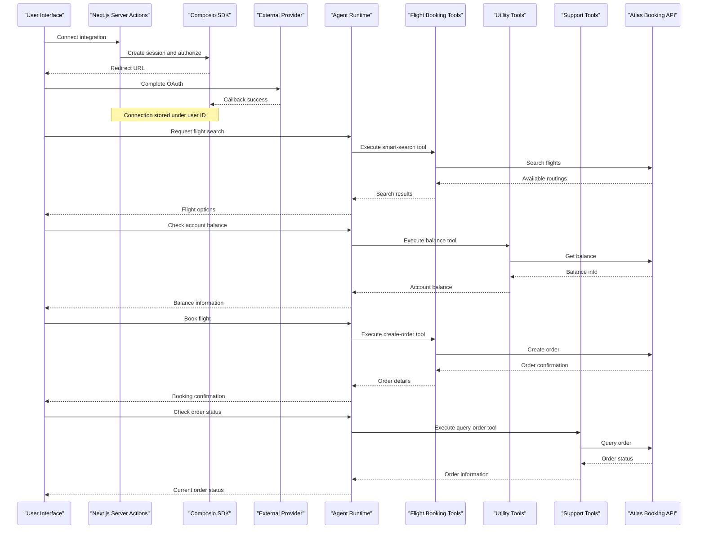
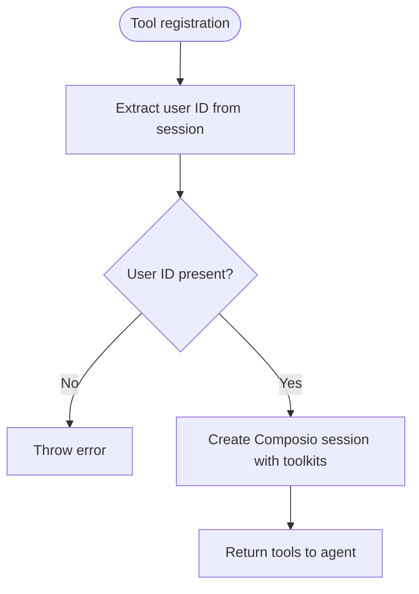
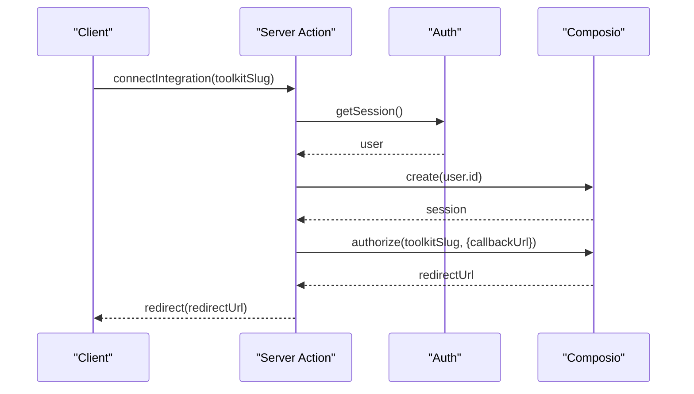
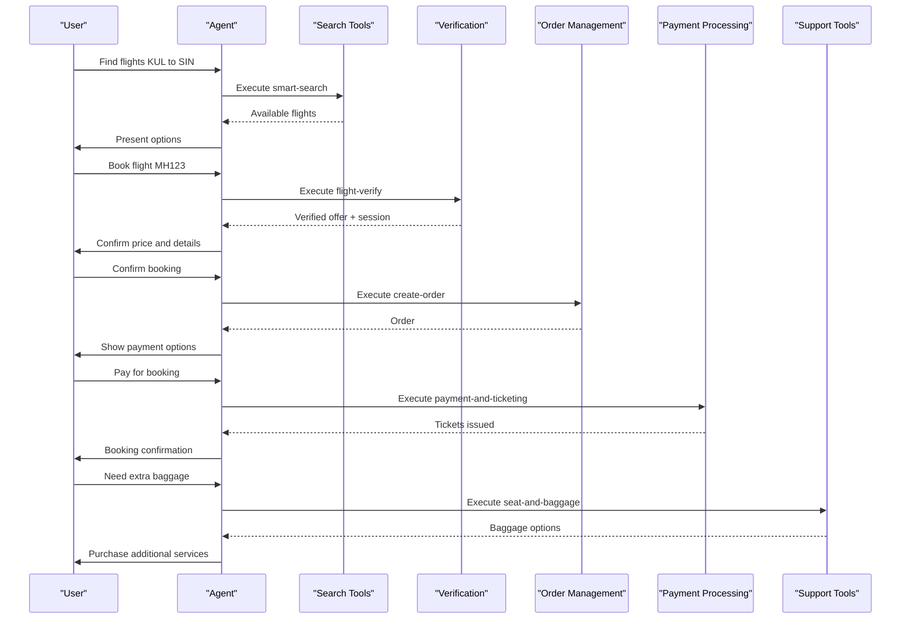
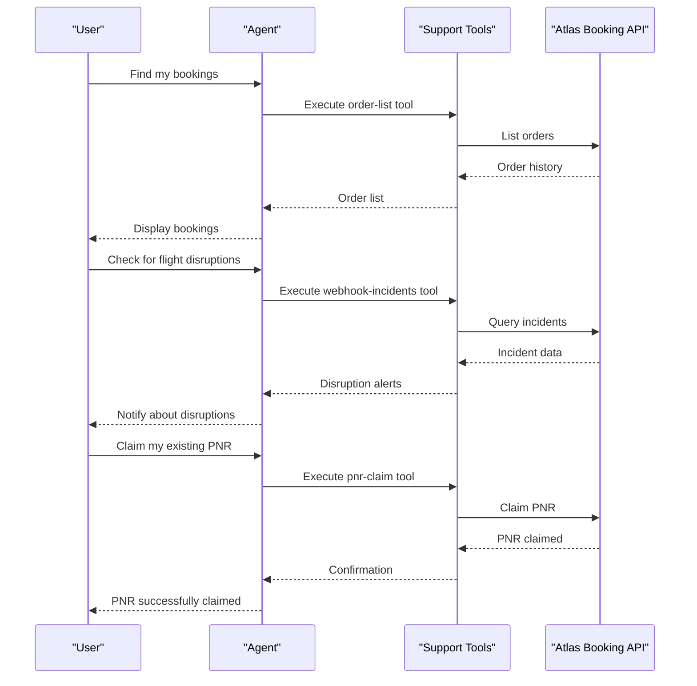
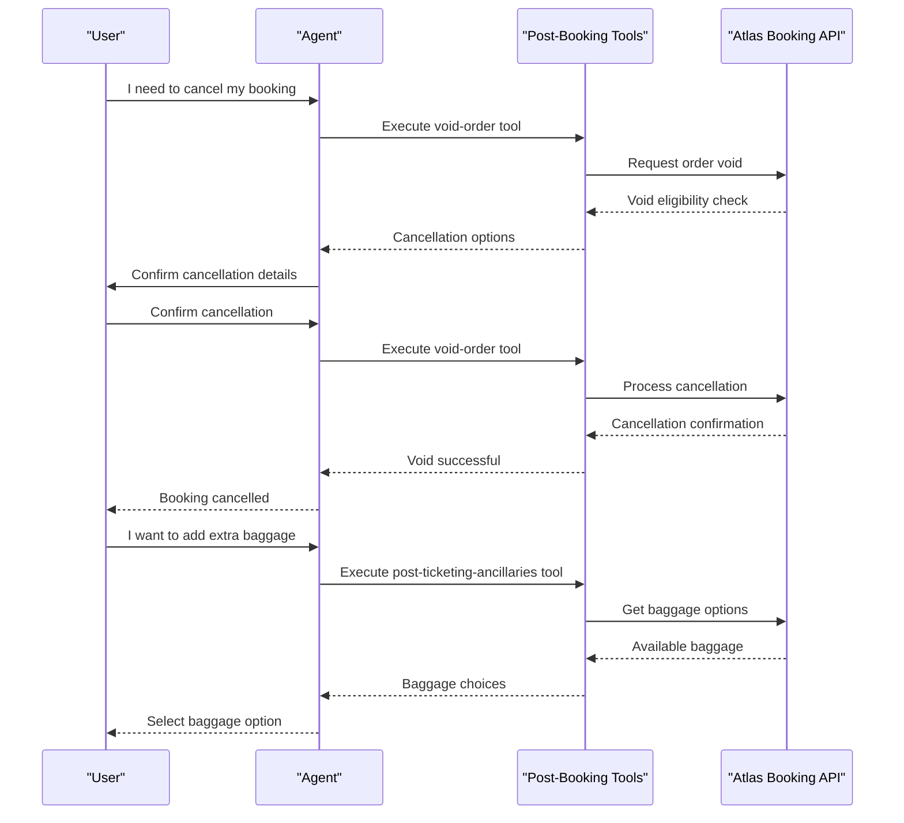
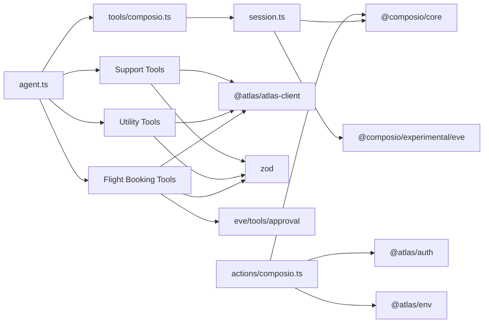

# Tool System

<cite>
**Referenced Files in This Document**
- [composio.ts](file://apps/runtime/agent/tools/composio.ts)
- [session.ts](file://apps/runtime/agent/session.ts)
- [agent.ts](file://apps/runtime/agent/agent.ts)
- [composio.ts](file://apps/web/src/app/actions/composio.ts)
- [platform.md](file://.agents/skills/composio/references/platform.md)
- [errors.md](file://.agents/skills/composio/references/errors.md)
- [SKILL.md](file://.agents/skills/composio/SKILL.md)
- [package.json](file://apps/runtime/package.json)
- [smart-search.ts](file://apps/runtime/agent/tools/smart-search.ts)
- [price-compare-search.ts](file://apps/runtime/agent/tools/price-compare-search.ts)
- [get-offer-price.ts](file://apps/runtime/agent/tools/get-offer-price.ts)
- [get-offer.ts](file://apps/runtime/agent/tools/get-offer.ts)
- [flight-search.ts](file://apps/runtime/agent/tools/flight-search.ts)
- [flight-verify.ts](file://apps/runtime/agent/tools/flight-verify.ts)
- [create-order.ts](file://apps/runtime/agent/tools/create-order.ts)
- [confirm-order.ts](file://apps/runtime/agent/tools/confirm-order.ts)
- [payment-and-ticketing.ts](file://apps/runtime/agent/tools/payment-and-ticketing.ts)
- [query-order.ts](file://apps/runtime/agent/tools/query-order.ts)
- [refunds.ts](file://apps/runtime/agent/tools/refunds.ts)
- [void-order.ts](file://apps/runtime/agent/tools/void-order.ts)
- [regenerate-order.ts](file://apps/runtime/agent/tools/regenerate-order.ts)
- [post-ticketing-ancillaries.ts](file://apps/runtime/agent/tools/post-ticketing-ancillaries.ts)
- [baggage.ts](file://apps/runtime/agent/tools/baggage.ts)
- [balance.ts](file://apps/runtime/agent/tools/balance.ts)
- [email-query.ts](file://apps/runtime/agent/tools/email-query.ts)
- [route-export.ts](file://apps/runtime/agent/tools/route-export.ts)
- [seat-and-baggage.ts](file://apps/runtime/agent/tools/seat-and-baggage.ts)
- [extract-pnr.ts](file://apps/runtime/agent/tools/extract-pnr.ts)
- [pnr-claim.ts](file://apps/runtime/agent/tools/pnr-claim.ts)
- [order-list.ts](file://apps/runtime/agent/tools/order-list.ts)
- [webhook-incidents.ts](file://apps/runtime/agent/tools/webhook-incidents.ts)
</cite>

## Update Summary

**Changes Made**

- Expanded flight booking tools section with comprehensive 25+ specialized functions covering search, verification, order management, payment processing, and post-booking operations
- Added detailed documentation for new utility tools including balance checking, email queries, route exports, and incident monitoring
- Enhanced tool architecture documentation with complete Zod validation schema patterns for all flight booking tools
- Updated workflow diagrams to reflect the complete end-to-end flight booking lifecycle
- Added comprehensive support tools documentation for PNR management, order listing, and incident handling
- Expanded security considerations for financial transactions and sensitive passenger data protection

## Table of Contents

1. [Introduction](#introduction)
2. [Project Structure](#project-structure)
3. [Core Components](#core-components)
4. [Architecture Overview](#architecture-overview)
5. [Detailed Component Analysis](#detailed-component-analysis)
6. [Flight Booking Tools](#flight-booking-tools)
7. [Utility and Support Tools](#utility-and-support-tools)
8. [Post-Booking Operations](#post-booking-operations)
9. [Dependency Analysis](#dependency-analysis)
10. [Performance Considerations](#performance-considerations)
11. [Troubleshooting Guide](#troubleshooting-guide)
12. [Conclusion](#conclusion)
13. [Appendices](#appendices)

## Introduction

This document explains the tool system that extends agent capabilities through pluggable tools, with a focus on the built-in Composio integration for third-party service access and the comprehensive flight booking toolset. The system now includes over 25 specialized functions covering the entire airline reservation lifecycle from initial search to post-booking support operations. It covers tool architecture, registration patterns, execution flow, authentication and request/response handling, error management, custom tool creation, schema definition and validation using Zod, composition patterns, parameter passing between tools, security considerations, testing guidelines, and monitoring usage patterns.

## Project Structure

The tool system is implemented across multiple areas:

- Runtime agent tools: where tools are defined and bound to the agent runtime
- Flight booking tools: specialized tools for airline reservation workflows
- Utility tools: supporting functions for account management and data retrieval
- Support tools: post-booking operations and customer service functions
- Web server actions: where user-facing integrations (connect/disconnect/list) are handled
- Subagent tools: specialized tools for booking and support workflows

```mermaid
graph TB
subgraph "Runtime Agent"
A["agent.ts"]
T["tools/composio.ts"]
S["session.ts"]
end
subgraph "Flight Search Tools"
F1["smart-search.ts"]
F2["price-compare-search.ts"]
F3["get-offer.ts"]
F4["get-offer-price.ts"]
end
subgraph "Order Management"
F5["create-order.ts"]
F6["confirm-order.ts"]
F7["query-order.ts"]
F8["regenerate-order.ts"]
F9["void-order.ts"]
end
subgraph "Payment & Ticketing"
F10["payment-and-ticketing.ts"]
F11["stop-ticket-issuance.ts"]
end
subgraph "Support Tools"
F12["order-list.ts"]
F13["extract-pnr.ts"]
F14["pnr-claim.ts"]
F15["webhook-incidents.ts"]
end
subgraph "Utility Tools"
U1["balance.ts"]
U2["email-query.ts"]
U3["route-export.ts"]
end
A --> T
A --> F1
A --> F2
A --> F3
A --> F4
A --> F5
A --> F6
A --> F7
A --> F8
A --> F9
A --> F10
A --> F11
A --> F12
A --> F13
A --> F14
A --> F15
A --> U1
A --> U2
A --> U3
T --> S
```

**Diagram sources**

- [agent.ts:1-8](file://apps/runtime/agent/agent.ts#L1-L8)
- [composio.ts:1-12](file://apps/runtime/agent/tools/composio.ts#L1-L12)
- [session.ts:1-19](file://apps/runtime/agent/session.ts#L1-L19)
- [smart-search.ts:1-30](file://apps/runtime/agent/tools/smart-search.ts#L1-L30)
- [price-compare-search.ts:1-30](file://apps/runtime/agent/tools/price-compare-search.ts#L1-L30)
- [get-offer.ts:1-24](file://apps/runtime/agent/tools/get-offer.ts#L1-L24)
- [get-offer-price.ts:1-24](file://apps/runtime/agent/tools/get-offer-price.ts#L1-L24)
- [create-order.ts:1-70](file://apps/runtime/agent/tools/create-order.ts#L1-L70)
- [confirm-order.ts:1-39](file://apps/runtime/agent/tools/confirm-order.ts#L1-L39)
- [query-order.ts:1-19](file://apps/runtime/agent/tools/query-order.ts#L1-L19)
- [regenerate-order.ts:1-19](file://apps/runtime/agent/tools/regenerate-order.ts#L1-L19)
- [void-order.ts:1-27](file://apps/runtime/agent/tools/void-order.ts#L1-L27)
- [payment-and-ticketing.ts:1-25](file://apps/runtime/agent/tools/payment-and-ticketing.ts#L1-L25)
- [stop-ticket-issuance.ts:1-20](file://apps/runtime/agent/tools/stop-ticket-issuance.ts#L1-L20)
- [order-list.ts:1-23](file://apps/runtime/agent/tools/order-list.ts#L1-L23)
- [extract-pnr.ts:1-15](file://apps/runtime/agent/tools/extract-pnr.ts#L1-L15)
- [pnr-claim.ts:1-17](file://apps/runtime/agent/tools/pnr-claim.ts#L1-L17)
- [webhook-incidents.ts:1-54](file://apps/runtime/agent/tools/webhook-incidents.ts#L1-L54)
- [balance.ts:1-15](file://apps/runtime/agent/tools/balance.ts#L1-L15)
- [email-query.ts:1-15](file://apps/runtime/agent/tools/email-query.ts#L1-L15)
- [route-export.ts:1-15](file://apps/runtime/agent/tools/route-export.ts#L1-L15)

**Section sources**

- [agent.ts:1-8](file://apps/runtime/agent/agent.ts#L1-L8)
- [composio.ts:1-12](file://apps/runtime/agent/tools/composio.ts#L1-L12)
- [session.ts:1-19](file://apps/runtime/agent/session.ts#L1-L19)
- [composio.ts:1-85](file://apps/web/src/app/actions/composio.ts#L1-L85)

## Core Components

- Agent definition: Declares the model used by the agent
- Tool registration: Binds a Composio session to the agent via a tool factory
- Session management: Creates a per-user Composio session scoped to specific toolkits
- Web integration actions: Handles OAuth connect/disconnect and lists active connections
- Flight booking tools: Comprehensive set of tools for end-to-end flight reservation workflows
- Utility tools: Supporting functions for account management and data retrieval
- Support tools: Post-booking operations and customer service functionality

Key responsibilities:

- The agent uses a model provider and receives tools at runtime
- Tools are provided by a Composio session configured for selected toolkits
- User identity flows from the agent session into the Composio session
- Web actions manage user-initiated connection lifecycle using the project API key
- Flight booking tools handle complex multi-step reservation workflows with proper approval gates
- Utility tools provide essential account and data management capabilities
- Support tools enable comprehensive post-booking customer service operations

**Section sources**

- [agent.ts:1-8](file://apps/runtime/agent/agent.ts#L1-L8)
- [composio.ts:1-12](file://apps/runtime/agent/tools/composio.ts#L1-L12)
- [session.ts:1-19](file://apps/runtime/agent/session.ts#L1-L19)
- [composio.ts:1-85](file://apps/web/src/app/actions/composio.ts#L1-L85)

## Architecture Overview

The tool system composes an agent with a dynamic set of third-party tools via Composio sessions and provides comprehensive flight booking capabilities. The runtime binds both general toolsets and flight-specific tools to the agent, while the web layer manages user connections to external services.

**Diagram sources**

- [composio.ts:13-33](file://apps/web/src/app/actions/composio.ts#L13-L33)
- [session.ts:1-19](file://apps/runtime/agent/session.ts#L1-L19)
- [composio.ts:1-12](file://apps/runtime/agent/tools/composio.ts#L1-L12)
- [smart-search.ts:1-30](file://apps/runtime/agent/tools/smart-search.ts#L1-L30)
- [balance.ts:1-15](file://apps/runtime/agent/tools/balance.ts#L1-L15)
- [create-order.ts:1-70](file://apps/runtime/agent/tools/create-order.ts#L1-L70)
- [query-order.ts:1-19](file://apps/runtime/agent/tools/query-order.ts#L1-L19)

## Detailed Component Analysis

### Agent Definition

- Purpose: Defines the LLM model used by the agent
- Behavior: The agent receives tools at runtime; this file sets the model configuration

**Section sources**

- [agent.ts:1-8](file://apps/runtime/agent/agent.ts#L1-L8)

### Tool Registration Pattern

- Purpose: Registers a toolset backed by a Composio session for the current user
- Flow:
  - Extracts user identity from the agent session
  - Validates presence of user ID
  - Returns a Composio session configured for selected toolkits
- Error handling: Throws when user identity is missing

**Diagram sources**

- [composio.ts:5-11](file://apps/runtime/agent/tools/composio.ts#L5-L11)
- [session.ts:6-18](file://apps/runtime/agent/session.ts#L6-L18)

**Section sources**

- [composio.ts:1-12](file://apps/runtime/agent/tools/composio.ts#L1-L12)
- [session.ts:1-19](file://apps/runtime/agent/session.ts#L1-L19)

### Session Management

- Purpose: Creates a per-user Composio session scoped to specific toolkits
- Behavior: Initializes a client with an Eve provider and creates a session with a predefined toolkit list
- Security: Uses the application's user identity to scope tool access

**Section sources**

- [session.ts:1-19](file://apps/runtime/agent/session.ts#L1-L19)

### Web Integration Actions

- Purpose: Provide server-side actions to connect, disconnect, and list integrations for the current user
- Authentication: Reads the authenticated session and validates user presence
- Authorization: Uses the project API key to create a session and generate a Connect Link
- Connection lifecycle:
  - Connect: Creates a session, authorizes a toolkit, and redirects to the provider
  - Disconnect: Lists accounts for the user and deletes matching active or initiated connections
  - List: Returns slugs of active or initiated connections for the user

**Diagram sources**

- [composio.ts:13-33](file://apps/web/src/app/actions/composio.ts#L13-L33)

**Section sources**

- [composio.ts:1-85](file://apps/web/src/app/actions/composio.ts#L1-L85)

### Built-in Composio Meta Tools

- Purpose: Enable discovery, multi-execution, and connection management within the agent conversation
- Examples include searching tools, retrieving schemas, managing connections, waiting for connections, and remote workbench/bash utilities
- Guidance: Keep connection management enabled for interactive agents; do not build provider OAuth flows manually

**Section sources**

- [platform.md:106-120](file://.agents/skills/composio/references/platform.md#L106-L120)

### Custom Tools and Schema Validation

- Patterns:
  - Use the existing tool registration pattern to bind new toolsets to the agent
  - Define input/output schemas using Zod validation library to ensure correctness before execution
  - Validate parameters early and return structured errors for invalid inputs
- Execution:
  - Wrap tool calls in try/catch blocks
  - Normalize errors into consistent responses for the agent
- Composition:
  - Chain multiple tools by passing outputs from one tool as inputs to another
  - Use meta tools to discover available operations and their schemas dynamically

[No sources needed since this section provides general guidance]

### Parameter Passing Between Tools

- Strategy:
  - Capture tool outputs and map them to required inputs for subsequent tools
  - Use explicit schema contracts to avoid type mismatches
  - Prefer deterministic transformations and clear naming conventions for shared data
- Safety:
  - Validate intermediate results before forwarding to downstream tools
  - Handle partial failures gracefully with retries or fallbacks

[No sources needed since this section provides general guidance]

### Security Considerations

- Identity scoping: Always derive the user identity from the agent session and pass it to the Composio session to isolate tool access per user
- Secrets management: Store the project API key in environment variables; never hardcode or log secrets
- OAuth flows: Rely on Composio Connect Links; do not implement provider-specific OAuth in your codebase
- Least privilege: Scope toolkits to only those required for the task
- Output sanitization: Avoid logging sensitive data from provider responses
- Financial transactions: Require explicit user approval for payment-related operations
- Passenger data protection: Handle personal information according to privacy regulations
- Incident monitoring: Use webhook incidents tool to track and respond to flight disruptions proactively

**Section sources**

- [composio.ts:5-11](file://apps/runtime/agent/tools/composio.ts#L5-L11)
- [composio.ts:1-85](file://apps/web/src/app/actions/composio.ts#L1-L85)
- [platform.md:106-120](file://.agents/skills/composio/references/platform.md#L106-L120)

### Testing Guidelines

- Unit tests:
  - Validate tool schemas and parameter coercion
  - Mock external provider calls to assert behavior without network dependencies
- Integration tests:
  - Use test user IDs and sandboxed environments where supported
  - Verify Connect Link generation and callback handling paths
- Regression tests:
  - Record expected tool schemas and behaviors to detect breaking changes

[No sources needed since this section provides general guidance]

### Monitoring Usage Patterns

- Evidence-first debugging: Capture and inspect log or request IDs before changing credentials or code
- CLI diagnostics: Use provided commands to view logs and connection states when applicable
- Metrics: Track tool invocation counts, latency, and error rates per toolkit and user
- Incident tracking: Monitor webhook incidents for proactive customer service responses

**Section sources**

- [errors.md:5-17](file://.agents/skills/composio/references/errors.md#L5-L17)

## Flight Booking Tools

The flight booking system provides a comprehensive set of tools for end-to-end airline reservation workflows. These tools follow a standardized pattern with Zod validation schemas and proper approval gates for financial transactions.

### Flight Search Tools

#### Smart Search

- Purpose: Flexible flight search with intelligent date handling
- Input: Accepts standard flight search parameters with optional fields
- Output: Returns available routings with fares and pricing information
- Validation: Uses loose object schema for flexible input handling
- Use case: Best for exploratory searches where dates may be flexible

#### Price Compare Search

- Purpose: Price comparison flight search across multiple dates
- Input: Standard flight search parameters with date flexibility
- Output: Comparative pricing data across different travel dates
- Validation: Enforces trip type and passenger count constraints
- Use case: Ideal for finding the best prices across date ranges

#### Offer Details

- Purpose: Retrieve detailed offer information for a specific routing
- Input: Requires routing identifier or session ID from previous search
- Output: Provides comprehensive offer details including fare rules and restrictions
- Validation: Ensures valid routing identifiers and session context

#### Offer Pricing

- Purpose: Retrieve current pricing for a specific offer
- Input: Requires routing identifier and session ID from search or verification
- Output: Returns up-to-date pricing information for the selected offer
- Validation: Confirms offer validity and pricing availability

### Flight Verification and Ordering

#### Flight Verification

- Purpose: Verify selected flight offer before creating order
- Input: Requires routing identifier from search results
- Output: Returns session ID and routing identifier for order creation
- Validation: Ensures routing identifier format and existence
- Critical step: Must be performed before order creation to lock pricing

#### Order Creation

- Purpose: Create flight booking order from verified offer
- Input: Requires session ID, routing identifier, and passenger details
- Output: Returns order number and confirmation details
- Approval: Requires explicit user approval due to financial implications
- Persistence: Automatically persists booking state for tracking

#### Order Confirmation

- Purpose: Confirm created order and obtain payment URL
- Input: Requires order number and optional iframe/redirect settings
- Output: Returns confirmation status and payment instructions
- Approval: Requires explicit user approval for order finalization

### Payment and Ticketing

#### Payment Processing

- Purpose: Process payment and issue tickets for confirmed orders
- Input: Requires order number exactly as returned by creation
- Output: Returns payment confirmation and ticket issuance status
- Approval: Requires explicit user approval for payment processing
- Idempotency: Prevents duplicate payments through confirmation ID tracking

#### Stop Ticket Issuance

- Purpose: Halt automatic ticket issuance for pending orders
- Input: Requires order number of the order to stop
- Output: Returns confirmation that ticket issuance has been stopped
- Use case: Useful when manual review or additional steps are required

### Flight Booking Workflow Diagram

**Diagram sources**

- [smart-search.ts:1-30](file://apps/runtime/agent/tools/smart-search.ts#L1-L30)
- [price-compare-search.ts:1-30](file://apps/runtime/agent/tools/price-compare-search.ts#L1-L30)
- [get-offer.ts:1-24](file://apps/runtime/agent/tools/get-offer.ts#L1-L24)
- [get-offer-price.ts:1-24](file://apps/runtime/agent/tools/get-offer-price.ts#L1-L24)
- [flight-verify.ts:1-21](file://apps/runtime/agent/tools/flight-verify.ts#L1-L21)
- [create-order.ts:1-70](file://apps/runtime/agent/tools/create-order.ts#L1-L70)
- [confirm-order.ts:1-39](file://apps/runtime/agent/tools/confirm-order.ts#L1-L39)
- [payment-and-ticketing.ts:1-25](file://apps/runtime/agent/tools/payment-and-ticketing.ts#L1-L25)
- [seat-and-baggage.ts:1-20](file://apps/runtime/agent/tools/seat-and-baggage.ts#L1-L20)

### Zod Validation Schema Patterns

All flight booking tools use Zod for robust input validation:

#### Search Tool Schema Pattern

- Required fields: Origin/destination cities, travel dates, passenger counts
- Optional filters: Airlines, currency preferences, airport codes
- Type safety: Enforces integer passenger counts and date formats
- Descriptions: Comprehensive field descriptions for better UX

#### Order Creation Schema Pattern

- Nested objects: Passenger details with contact information
- Enum validation: Gender and passenger type constraints
- Format validation: Date formats and phone number patterns
- Business rules: Minimum passenger requirements and data completeness

#### Financial Transaction Schema Pattern

- Strict validation: Exact order numbers from previous operations
- Approval gates: Explicit user confirmation for all financial operations
- Idempotency: Prevention of duplicate payments and confirmations
- Error handling: Clear error messages for invalid order states

**Section sources**

- [smart-search.ts:13-28](file://apps/runtime/agent/tools/smart-search.ts#L13-L28)
- [price-compare-search.ts:13-28](file://apps/runtime/agent/tools/price-compare-search.ts#L13-L28)
- [get-offer.ts:13-22](file://apps/runtime/agent/tools/get-offer.ts#L13-L22)
- [get-offer-price.ts:13-22](file://apps/runtime/agent/tools/get-offer-price.ts#L13-L22)
- [create-order.ts:19-68](file://apps/runtime/agent/tools/create-order.ts#L19-L68)
- [payment-and-ticketing.ts:19-23](file://apps/runtime/agent/tools/payment-and-ticketing.ts#L19-L23)
- [confirm-order.ts:19-37](file://apps/runtime/agent/tools/confirm-order.ts#L19-L37)

## Utility and Support Tools

The system includes comprehensive utility and support tools for account management, data retrieval, and customer service operations.

### Account Management Tools

#### Balance Checking

- Purpose: Check the Atlas booking API account balance
- Input: No parameters required
- Output: Returns current account balance information
- Use case: Essential before expensive bookings to prevent payment failures
- Read-only: Safe for repeated queries without side effects

### Data Retrieval Tools

#### Email Query

- Purpose: Query booking-related itinerary emails for existing bookings
- Input: Flexible query parameters for email-based searches
- Output: Returns booking information associated with email addresses
- Use case: Customer service for locating bookings by passenger email

#### Route Export

- Purpose: Export supported flight routes from the Atlas booking API
- Input: No parameters required
- Output: Returns comprehensive list of bookable routes
- Use case: Route planning and availability checking

### Support Operations

#### Order Listing

- Purpose: List flight orders with pagination support
- Input: Optional page index and size parameters
- Output: Returns paginated list of orders with metadata
- Use case: Browse user's booking history and locate specific orders

#### PNR Management

- **PNR Extraction**: Extract PNR details for existing bookings
- **PNR Claiming**: Claim existing PNRs for management through the platform
- **Use cases**: Customer service operations and booking consolidation

#### Incident Monitoring

- Purpose: List flight incident events (schedule changes, cancellations, disruptions)
- Input: Extensive filtering options including airline, time windows, passenger details
- Output: Paginated incident reports with detailed event information
- Use case: Proactive customer service and disruption management

### Support Tools Workflow Diagram

**Diagram sources**

- [order-list.ts:1-23](file://apps/runtime/agent/tools/order-list.ts#L1-L23)
- [webhook-incidents.ts:1-54](file://apps/runtime/agent/tools/webhook-incidents.ts#L1-L54)
- [pnr-claim.ts:1-17](file://apps/runtime/agent/tools/pnr-claim.ts#L1-L17)
- [extract-pnr.ts:1-15](file://apps/runtime/agent/tools/extract-pnr.ts#L1-L15)
- [email-query.ts:1-15](file://apps/runtime/agent/tools/email-query.ts#L1-L15)
- [route-export.ts:1-15](file://apps/runtime/agent/tools/route-export.ts#L1-L15)

**Section sources**

- [balance.ts:1-15](file://apps/runtime/agent/tools/balance.ts#L1-L15)
- [email-query.ts:1-15](file://apps/runtime/agent/tools/email-query.ts#L1-L15)
- [route-export.ts:1-15](file://apps/runtime/agent/tools/route-export.ts#L1-L15)
- [order-list.ts:1-23](file://apps/runtime/agent/tools/order-list.ts#L1-L23)
- [extract-pnr.ts:1-15](file://apps/runtime/agent/tools/extract-pnr.ts#L1-L15)
- [pnr-claim.ts:1-17](file://apps/runtime/agent/tools/pnr-claim.ts#L1-L17)
- [webhook-incidents.ts:1-54](file://apps/runtime/agent/tools/webhook-incidents.ts#L1-L54)

## Post-Booking Operations

The system provides comprehensive post-booking operations for managing reservations after ticket issuance.

### Refund Processing

- Purpose: Create refund requests for eligible orders
- Input: Requires order number and optional sub-order for partial refunds
- Output: Returns refund request status and processing timeline
- Approval: Requires explicit user approval for financial reversals
- Compliance: Follows airline refund policies and timing constraints

### Order Voiding

- Purpose: Cancel orders before ticketing occurs
- Input: Requires order number and optional sub-order for partial voids
- Output: Returns void confirmation and any applicable fees
- Approval: Requires explicit user approval due to irreversible nature
- Timing: Only available before ticket issuance

### Order Regeneration

- Purpose: Regenerate expired or invalidated orders
- Input: Requires order number of the original order
- Output: Returns new order details with updated pricing and availability
- Approval: Requires explicit user approval for re-pricing
- Use case: When original orders expire before completion

### Ancillary Services

- Purpose: Access additional services for ticketed orders
- Input: Requires order number of ticketed order
- Output: Returns available ancillary services like baggage and seat selection
- Read-only: Safe for browsing available options
- Enhancement: Improves passenger experience with personalized services

### Post-Booking Operations Workflow

**Diagram sources**

- [refunds.ts:1-27](file://apps/runtime/agent/tools/refunds.ts#L1-L27)
- [void-order.ts:1-27](file://apps/runtime/agent/tools/void-order.ts#L1-L27)
- [regenerate-order.ts:1-19](file://apps/runtime/agent/tools/regenerate-order.ts#L1-L19)
- [post-ticketing-ancillaries.ts:1-20](file://apps/runtime/agent/tools/post-ticketing-ancillaries.ts#L1-L20)

**Section sources**

- [refunds.ts:1-27](file://apps/runtime/agent/tools/refunds.ts#L1-L27)
- [void-order.ts:1-27](file://apps/runtime/agent/tools/void-order.ts#L1-L27)
- [regenerate-order.ts:1-19](file://apps/runtime/agent/tools/regenerate-order.ts#L1-L19)
- [post-ticketing-ancillaries.ts:1-20](file://apps/runtime/agent/tools/post-ticketing-ancillaries.ts#L1-L20)

## Dependency Analysis

The runtime depends on the agent framework, Composio SDKs, and Atlas booking API clients to provide tools. The web app depends on authentication and environment configuration to manage user connections.

**Diagram sources**

- [agent.ts:1-8](file://apps/runtime/agent/agent.ts#L1-L8)
- [composio.ts:1-12](file://apps/runtime/agent/tools/composio.ts#L1-L12)
- [session.ts:1-19](file://apps/runtime/agent/session.ts#L1-L19)
- [smart-search.ts:1-30](file://apps/runtime/agent/tools/smart-search.ts#L1-L30)
- [balance.ts:1-15](file://apps/runtime/agent/tools/balance.ts#L1-L15)
- [order-list.ts:1-23](file://apps/runtime/agent/tools/order-list.ts#L1-L23)
- [composio.ts:1-85](file://apps/web/src/app/actions/composio.ts#L1-L85)
- [package.json:15-24](file://apps/runtime/package.json#L15-L24)

**Section sources**

- [package.json:15-24](file://apps/runtime/package.json#L15-L24)

## Performance Considerations

- Reuse sessions: For multi-turn conversations, persist and resume session IDs instead of creating new sessions per message
- Toolkit scoping: Limit toolkits to reduce overhead and minimize attack surface
- Caching: Cache non-sensitive metadata like available tool schemas where appropriate
- Rate limits: Respect provider rate limits and implement backoff strategies
- Flight search optimization: Use smart search for flexible queries and standard search for precise lookups
- Order state persistence: Leverage built-in booking state management to avoid redundant API calls
- Payment efficiency: Implement idempotent payment operations to prevent duplicate charges
- Batch operations: Use pagination effectively for large datasets like order listings
- Incident monitoring: Implement efficient filtering for incident queries to reduce API load

**Section sources**

- [platform.md:100-104](file://.agents/skills/composio/references/platform.md#L100-L104)

## Troubleshooting Guide

- Start with evidence: Obtain the log or request ID and inspect dashboard logs before altering credentials or code
- Tool not found: Discover tools at runtime via meta tools; avoid guessing slugs
- Authentication boundaries:
  - Project/session 401: Check project credential validity and association
  - Provider connected-account 401: Reconnect the provider account and retry
- Common provider constraints: Review known issues such as Google app blocks, disabled APIs, Slack quotas, Microsoft tenant consent, and GitHub App setup steps
- Branding and production auth: Move to dedicated OAuth apps for branding, scopes, and quotas before launch
- Flight booking issues:
  - Search failures: Verify airport codes and date formats
  - Order creation errors: Ensure routing identifiers are current and valid
  - Payment problems: Check order status before attempting payment
  - Refund limitations: Verify eligibility and timing constraints
- Balance issues: Check account balance before expensive operations using the balance tool
- Incident detection: Use webhook incidents tool to identify and respond to flight disruptions
- PNR management: Verify PNR ownership and claim status before attempting operations

**Section sources**

- [errors.md:5-56](file://.agents/skills/composio/references/errors.md#L5-L56)

## Conclusion

The tool system integrates the agent with third-party services through a robust Composio-based architecture while providing comprehensive flight booking capabilities with over 25 specialized functions. Tools are registered via a session-scoped factory, ensuring secure, user-isolated access to external APIs. The web layer manages connection lifecycles using managed OAuth flows, while the flight booking tools offer end-to-end reservation workflows with proper validation, approval gates, and state management. The extensive utility and support tools provide comprehensive account management, data retrieval, and customer service capabilities. By following the guidelines here, you can extend the system with custom tools, compose complex workflows, and maintain strong security and performance characteristics.

## Appendices

### Quick Reference: Key Files and Responsibilities

- Agent definition: Sets the model used by the agent
- Tool registration: Binds a per-user Composio session to the agent
- Session management: Configures toolkits and creates user-scoped sessions
- Web actions: Handles connect, disconnect, and list operations for user integrations
- Flight booking tools: Provide comprehensive airline reservation workflows with validation and approval
- Utility tools: Support account management and data retrieval operations
- Support tools: Enable post-booking customer service and incident management

**Section sources**

- [agent.ts:1-8](file://apps/runtime/agent/agent.ts#L1-L8)
- [composio.ts:1-12](file://apps/runtime/agent/tools/composio.ts#L1-L12)
- [session.ts:1-19](file://apps/runtime/agent/session.ts#L1-L19)
- [composio.ts:1-85](file://apps/web/src/app/actions/composio.ts#L1-L85)

### Complete Flight Booking Tool Categories

- **Search Tools**: Smart search, price compare search, offer details, offer pricing
- **Verification Tools**: Flight verification for price and availability
- **Order Management**: Create, confirm, query, regenerate, void orders
- **Payment Processing**: Payment and ticketing operations, stop ticket issuance
- **Ancillary Services**: Seat and baggage selection, additional services
- **Utility Tools**: Balance checking, email queries, route exports
- **Support Tools**: Order listing, PNR extraction and claiming, incident monitoring
- **Post-Booking**: Refunds, ancillary services, incident management

**Section sources**

- [smart-search.ts:1-30](file://apps/runtime/agent/tools/smart-search.ts#L1-L30)
- [price-compare-search.ts:1-30](file://apps/runtime/agent/tools/price-compare-search.ts#L1-L30)
- [get-offer.ts:1-24](file://apps/runtime/agent/tools/get-offer.ts#L1-L24)
- [get-offer-price.ts:1-24](file://apps/runtime/agent/tools/get-offer-price.ts#L1-L24)
- [flight-verify.ts:1-21](file://apps/runtime/agent/tools/flight-verify.ts#L1-L21)
- [create-order.ts:1-70](file://apps/runtime/agent/tools/create-order.ts#L1-L70)
- [confirm-order.ts:1-39](file://apps/runtime/agent/tools/confirm-order.ts#L1-L39)
- [payment-and-ticketing.ts:1-25](file://apps/runtime/agent/tools/payment-and-ticketing.ts#L1-L25)
- [stop-ticket-issuance.ts:1-20](file://apps/runtime/agent/tools/stop-ticket-issuance.ts#L1-L20)
- [seat-and-baggage.ts:1-20](file://apps/runtime/agent/tools/seat-and-baggage.ts#L1-L20)
- [balance.ts:1-15](file://apps/runtime/agent/tools/balance.ts#L1-L15)
- [email-query.ts:1-15](file://apps/runtime/agent/tools/email-query.ts#L1-L15)
- [route-export.ts:1-15](file://apps/runtime/agent/tools/route-export.ts#L1-L15)
- [order-list.ts:1-23](file://apps/runtime/agent/tools/order-list.ts#L1-L23)
- [extract-pnr.ts:1-15](file://apps/runtime/agent/tools/extract-pnr.ts#L1-L15)
- [pnr-claim.ts:1-17](file://apps/runtime/agent/tools/pnr-claim.ts#L1-L17)
- [webhook-incidents.ts:1-54](file://apps/runtime/agent/tools/webhook-incidents.ts#L1-L54)
- [refunds.ts:1-27](file://apps/runtime/agent/tools/refunds.ts#L1-L27)
- [void-order.ts:1-27](file://apps/runtime/agent/tools/void-order.ts#L1-L27)
- [regenerate-order.ts:1-19](file://apps/runtime/agent/tools/regenerate-order.ts#L1-L19)
- [post-ticketing-ancillaries.ts:1-20](file://apps/runtime/agent/tools/post-ticketing-ancillaries.ts#L1-L20)
