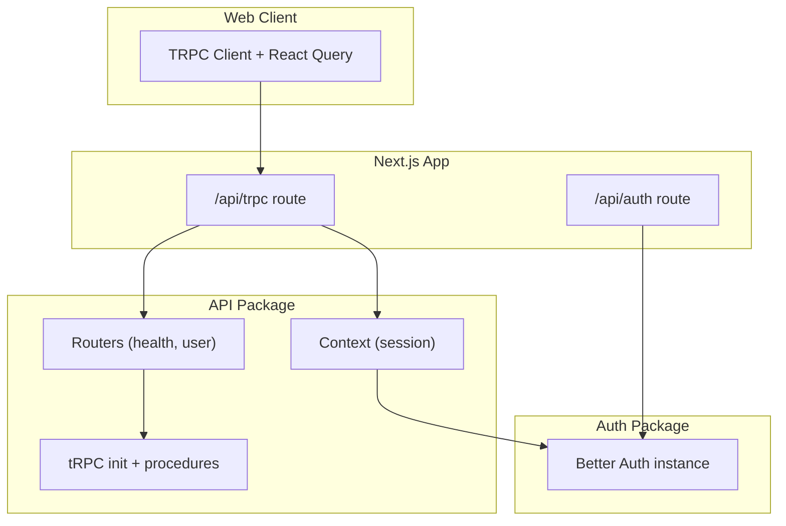
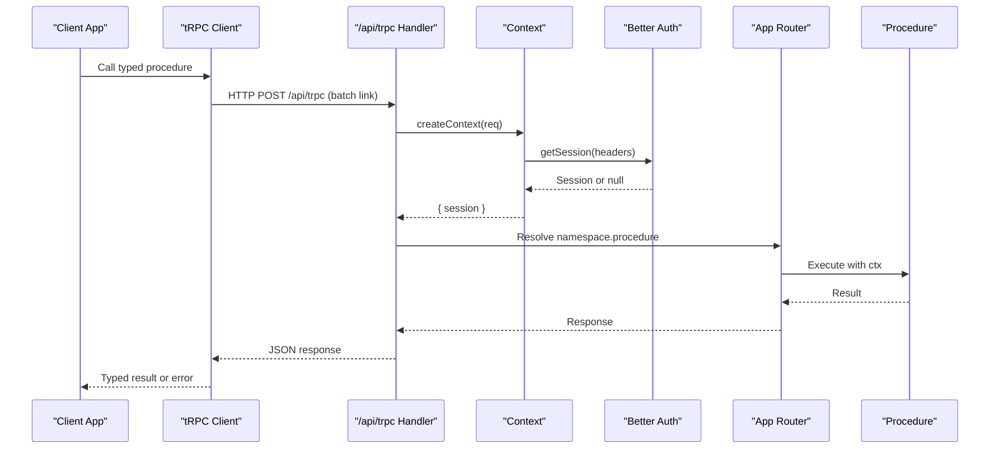
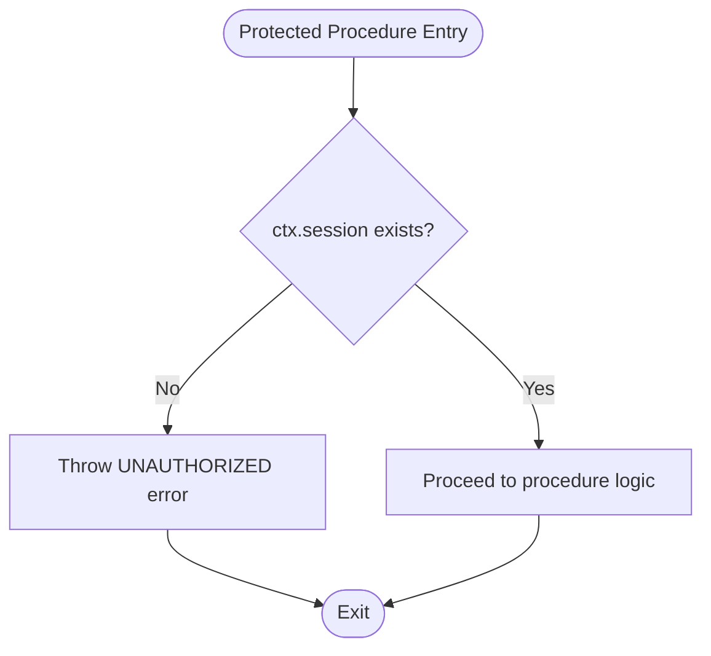
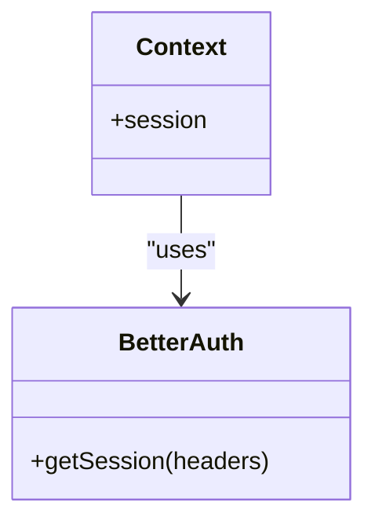
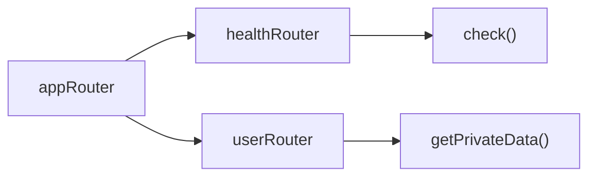
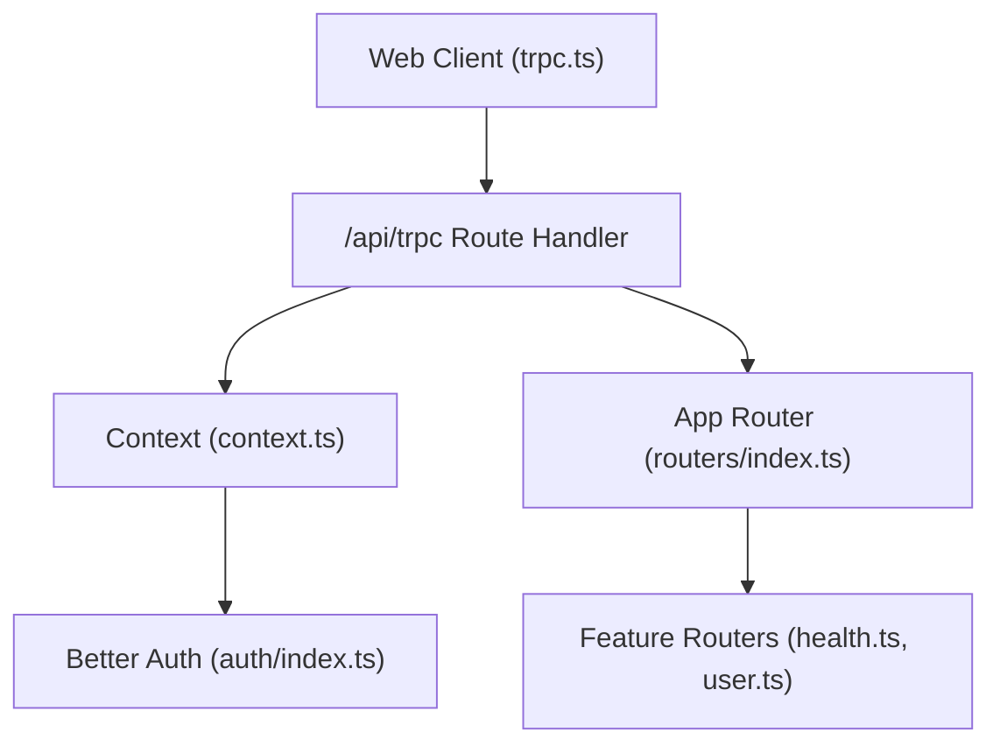

# API Layer

<cite>
**Referenced Files in This Document**
- [route.ts](file://apps/web/src/app/api/trpc/[trpc]/route.ts)
- [index.ts](file://packages/api/src/index.ts)
- [context.ts](file://packages/api/src/context.ts)
- [index.ts](file://packages/api/src/routers/index.ts)
- [health.ts](file://packages/api/src/routers/health.ts)
- [user.ts](file://packages/api/src/routers/user.ts)
- [route.ts](file://apps/web/src/app/api/auth/[...all]/route.ts)
- [index.ts](file://packages/auth/src/index.ts)
- [trpc.ts](file://apps/web/src/utils/trpc.ts)
</cite>

## Table of Contents

1. [Introduction](#introduction)
2. [Project Structure](#project-structure)
3. [Core Components](#core-components)
4. [Architecture Overview](#architecture-overview)
5. [Detailed Component Analysis](#detailed-component-analysis)
6. [Dependency Analysis](#dependency-analysis)
7. [Performance Considerations](#performance-considerations)
8. [Troubleshooting Guide](#troubleshooting-guide)
9. [Conclusion](#conclusion)
10. [Appendices](#appendices)

## Introduction

This document describes the tRPC-based backend layer that provides end-to-end type-safe APIs for the application. It covers the tRPC setup and configuration, router organization, procedure patterns for public and protected endpoints, middleware implementation, authentication integration with Better Auth, request validation using Zod schemas (recommended pattern), error handling strategies, available API procedures, endpoint specifications, client-side usage examples, performance optimization techniques, testing approaches, and debugging strategies.

## Project Structure

The API layer is organized into a Next.js route handler that wires tRPC to the app router, a shared tRPC context that resolves sessions via Better Auth, and modular routers for features such as health checks and user operations. The web client configures a typed tRPC client with React Query integration and batched HTTP links.

**Diagram sources**

- [route.ts:1-14](file://apps/web/src/app/api/trpc/[trpc]/route.ts#L1-L14)
- [index.ts:1-26](file://packages/api/src/index.ts#L1-L26)
- [context.ts:1-15](file://packages/api/src/context.ts#L1-L15)
- [index.ts:1-11](file://packages/api/src/routers/index.ts#L1-L11)
- [health.ts:1-6](file://packages/api/src/routers/health.ts#L1-L6)
- [user.ts:1-9](file://packages/api/src/routers/user.ts#L1-L9)
- [route.ts:1-5](file://apps/web/src/app/api/auth/[...all]/route.ts#L1-L5)
- [index.ts:1-43](file://packages/auth/src/index.ts#L1-L43)
- [trpc.ts:1-40](file://apps/web/src/utils/trpc.ts#L1-L40)

**Section sources**

- [route.ts:1-14](file://apps/web/src/app/api/trpc/[trpc]/route.ts#L1-L14)
- [index.ts:1-11](file://packages/api/src/routers/index.ts#L1-L11)
- [trpc.ts:1-40](file://apps/web/src/utils/trpc.ts#L1-L40)

## Core Components

- tRPC initialization and procedure helpers:
  - Public procedures: no auth required.
  - Protected procedures: enforce session presence; otherwise throw an unauthorized error.
- Context:
  - Resolves the current session from Better Auth using the incoming NextRequest headers.
- Router composition:
  - Aggregates feature routers under namespaces (e.g., health, user).
- Route handlers:
  - tRPC handler at /api/trpc exposing GET/POST.
  - Better Auth handler at /api/auth for authentication flows.
- Web client:
  - Typed tRPC client with httpBatchLink and React Query integration, sending credentials with requests.

**Section sources**

- [index.ts:1-26](file://packages/api/src/index.ts#L1-L26)
- [context.ts:1-15](file://packages/api/src/context.ts#L1-L15)
- [index.ts:1-11](file://packages/api/src/routers/index.ts#L1-L11)
- [route.ts:1-14](file://apps/web/src/app/api/trpc/[trpc]/route.ts#L1-L14)
- [route.ts:1-5](file://apps/web/src/app/api/auth/[...all]/route.ts#L1-L5)
- [trpc.ts:1-40](file://apps/web/src/utils/trpc.ts#L1-L40)

## Architecture Overview

The request flow starts at the Next.js route handler, which constructs the tRPC context by fetching the session via Better Auth. Requests are routed through the composed appRouter to feature-specific routers. Procedures validate inputs (via Zod where used) and return typed responses. The client uses a typed proxy to call procedures with full compile-time safety.

**Diagram sources**

- [route.ts:1-14](file://apps/web/src/app/api/trpc/[trpc]/route.ts#L1-L14)
- [context.ts:1-15](file://packages/api/src/context.ts#L1-L15)
- [index.ts:1-43](file://packages/auth/src/index.ts#L1-L43)
- [index.ts:1-11](file://packages/api/src/routers/index.ts#L1-L11)
- [index.ts:1-26](file://packages/api/src/index.ts#L1-L26)

## Detailed Component Analysis

### tRPC Initialization and Procedure Patterns

- Public procedures:
  - Use the base tRPC procedure without additional middleware. Suitable for health checks and other unauthenticated endpoints.
- Protected procedures:
  - Middleware checks for a session in the context. If missing, throws a standardized UNAUTHORIZED error. When present, proceeds with the procedure.

**Diagram sources**

- [index.ts:11-25](file://packages/api/src/index.ts#L11-L25)

**Section sources**

- [index.ts:1-26](file://packages/api/src/index.ts#L1-L26)

### Context and Authentication Integration

- Context creation:
  - Extracts the session from the incoming request headers using Better Auth’s getSession API.
  - Returns a context object containing the resolved session.
- Better Auth configuration:
  - Initializes Better Auth with Drizzle adapter, email/password, Telegram plugin, last login method, Next cookies support, social providers, and trusted origins.

**Diagram sources**

- [context.ts:1-15](file://packages/api/src/context.ts#L1-L15)
- [index.ts:1-43](file://packages/auth/src/index.ts#L1-L43)

**Section sources**

- [context.ts:1-15](file://packages/api/src/context.ts#L1-L15)
- [index.ts:1-43](file://packages/auth/src/index.ts#L1-L43)

### Router Organization and Available Procedures

- Router composition:
  - The app router aggregates feature routers under namespaces. Currently includes health and user.
- Health router:
  - Provides a public query to check system health.
- User router:
  - Provides a protected query that returns private data along with the authenticated user from the session.

**Diagram sources**

- [index.ts:1-11](file://packages/api/src/routers/index.ts#L1-L11)
- [health.ts:1-6](file://packages/api/src/routers/health.ts#L1-L6)
- [user.ts:1-9](file://packages/api/src/routers/user.ts#L1-L9)

**Section sources**

- [index.ts:1-11](file://packages/api/src/routers/index.ts#L1-L11)
- [health.ts:1-6](file://packages/api/src/routers/health.ts#L1-L6)
- [user.ts:1-9](file://packages/api/src/routers/user.ts#L1-L9)

### Request Validation Using Zod Schemas

- Recommended pattern:
  - Define input schemas with Zod within each procedure to validate and coerce request payloads.
  - Apply .input(schema) on procedures to ensure type-safe validation and inference.
- Benefits:
  - Centralized validation rules, consistent error messages, and automatic TypeScript inference for both inputs and outputs.

[No sources needed since this section provides general guidance]

### Error Handling Strategies

- Unauthorized access:
  - Protected procedures throw a standardized UNAUTHORIZED error when no session is present.
- General errors:
  - Use TRPCError with appropriate codes and messages for domain-specific failures.
- Client-side handling:
  - React Query onError can surface errors to users and provide retry actions.

**Section sources**

- [index.ts:11-25](file://packages/api/src/index.ts#L11-L25)
- [trpc.ts:7-20](file://apps/web/src/utils/trpc.ts#L7-L20)

### Endpoint Specifications

- tRPC transport:
  - Base URL: /api/trpc
  - Methods: GET, POST (batched via httpBatchLink)
  - Authentication: Cookies included automatically by the client; server validates via context.
- Better Auth endpoints:
  - Base URL: /api/auth
  - Methods: GET, POST (handled by Better Auth)
  - Purpose: Authentication flows (login, logout, social providers, etc.)

Procedures:

- health.check
  - Type: Query
  - Auth: None (public)
  - Input: None
  - Output: String status
- user.getPrivateData
  - Type: Query
  - Auth: Required (protected)
  - Input: None
  - Output: Object containing message and user from session

**Section sources**

- [route.ts:1-14](file://apps/web/src/app/api/trpc/[trpc]/route.ts#L1-L14)
- [route.ts:1-5](file://apps/web/src/app/api/auth/[...all]/route.ts#L1-L5)
- [health.ts:1-6](file://packages/api/src/routers/health.ts#L1-L6)
- [user.ts:1-9](file://packages/api/src/routers/user.ts#L1-L9)

### Practical Examples of Client-Side API Calls

- Calling a public procedure:
  - Invoke the health check query through the typed client and handle the string response.
- Calling a protected procedure:
  - Ensure the browser sends cookies (credentials: include) so the server can resolve the session.
  - Handle potential UNAUTHORIZED errors gracefully.

[No sources needed since this section provides general guidance]

### Performance Optimization Techniques

- Batched requests:
  - The client uses httpBatchLink to reduce network overhead by batching multiple calls.
- Credentials handling:
  - Include credentials to maintain session state across requests.
- Caching:
  - Leverage React Query caching and invalidation to minimize redundant calls.

**Section sources**

- [trpc.ts:1-40](file://apps/web/src/utils/trpc.ts#L1-L40)

## Dependency Analysis

The following diagram shows how components depend on each other during a typical request.

**Diagram sources**

- [trpc.ts:1-40](file://apps/web/src/utils/trpc.ts#L1-L40)
- [route.ts:1-14](file://apps/web/src/app/api/trpc/[trpc]/route.ts#L1-L14)
- [context.ts:1-15](file://packages/api/src/context.ts#L1-L15)
- [index.ts:1-43](file://packages/auth/src/index.ts#L1-L43)
- [index.ts:1-11](file://packages/api/src/routers/index.ts#L1-L11)
- [health.ts:1-6](file://packages/api/src/routers/health.ts#L1-L6)
- [user.ts:1-9](file://packages/api/src/routers/user.ts#L1-L9)

**Section sources**

- [trpc.ts:1-40](file://apps/web/src/utils/trpc.ts#L1-L40)
- [route.ts:1-14](file://apps/web/src/app/api/trpc/[trpc]/route.ts#L1-L14)
- [context.ts:1-15](file://packages/api/src/context.ts#L1-L15)
- [index.ts:1-43](file://packages/auth/src/index.ts#L1-L43)
- [index.ts:1-11](file://packages/api/src/routers/index.ts#L1-L11)
- [health.ts:1-6](file://packages/api/src/routers/health.ts#L1-L6)
- [user.ts:1-9](file://packages/api/src/routers/user.ts#L1-L9)

## Performance Considerations

- Prefer batched requests to reduce round trips.
- Cache read-heavy queries using React Query options.
- Keep procedures small and focused to improve maintainability and testability.
- Validate inputs early to fail fast and avoid unnecessary processing.

[No sources needed since this section provides general guidance]

## Troubleshooting Guide

Common issues and resolutions:

- Unauthorized errors on protected procedures:
  - Verify that cookies are sent with requests (credentials: include).
  - Ensure the session exists in the context by checking Better Auth configuration and cookie settings.
- CORS or origin mismatches:
  - Confirm trustedOrigins in Better Auth matches your frontend origin.
- Validation errors:
  - Add Zod schemas to procedures to catch malformed inputs early and return clear error messages.
- Debugging tips:
  - Log context resolution and session presence in development.
  - Inspect network requests to confirm batching and payload shapes.

**Section sources**

- [index.ts:11-25](file://packages/api/src/index.ts#L11-L25)
- [trpc.ts:7-20](file://apps/web/src/utils/trpc.ts#L7-L20)
- [index.ts:1-43](file://packages/auth/src/index.ts#L1-L43)

## Conclusion

The tRPC-based API layer provides a strongly-typed, secure, and scalable foundation for building end-to-end APIs. With Better Auth integration, robust context handling, and modular routers, it supports both public and protected endpoints effectively. Adopting Zod for input validation and leveraging React Query for caching and error handling further enhances reliability and performance.

[No sources needed since this section summarizes without analyzing specific files]

## Appendices

### Testing Approaches for API Procedures

- Unit tests:
  - Test individual procedures by mocking the context and asserting behavior.
- Integration tests:
  - Spin up a test server and call procedures over HTTP to verify end-to-end flows.
- Auth scenarios:
  - Test both authorized and unauthorized paths to ensure proper enforcement.

[No sources needed since this section provides general guidance]

### Debugging Strategies for Common Issues

- Inspect session resolution:
  - Confirm that getSession returns the expected session based on request headers.
- Validate client configuration:
  - Ensure credentials are included and the endpoint URL is correct.
- Review error codes:
  - Map UNAUTHORIZED and other TRPCError codes to user-friendly messages.

[No sources needed since this section provides general guidance]
