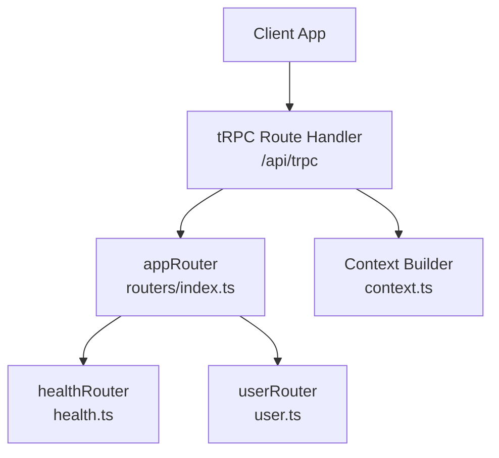
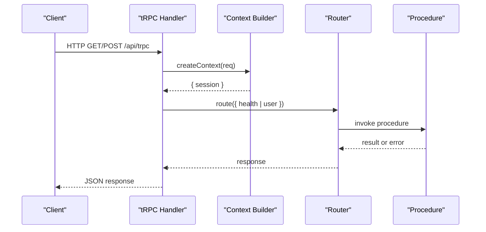
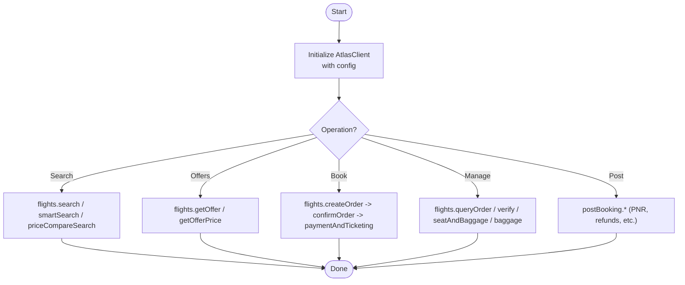
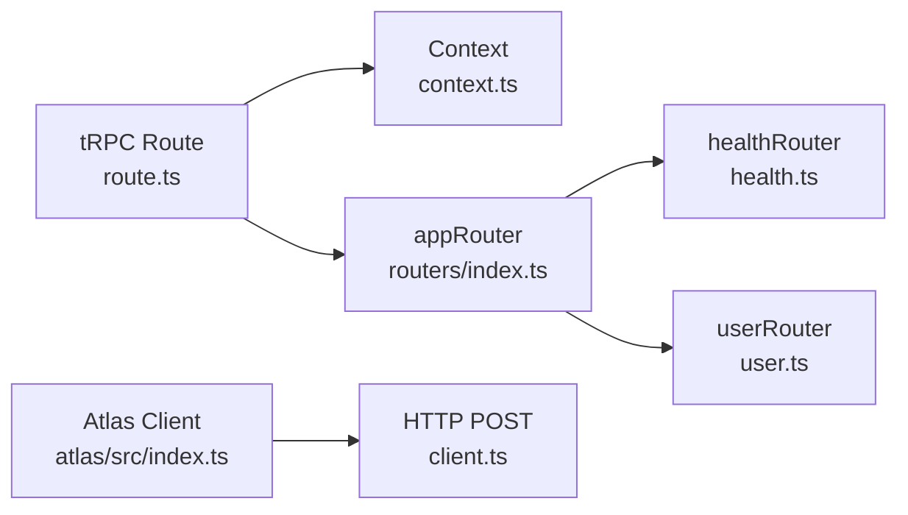

# API Procedures Reference

<cite>
**Referenced Files in This Document**
- [route.ts](file://apps/web/src/app/api/trpc/[trpc]/route.ts)
- [index.ts (API)](file://packages/api/src/index.ts)
- [context.ts](file://packages/api/src/context.ts)
- [index.ts (Routers)](file://packages/api/src/routers/index.ts)
- [health.ts](file://packages/api/src/routers/health.ts)
- [user.ts](file://packages/api/src/routers/user.ts)
- [index.ts (Atlas Client)](file://packages/atlas/src/index.ts)
- [client.ts](file://packages/atlas/src/client.ts)
- [flights index.ts](file://packages/atlas/src/flights/index.ts)
- [search.ts](file://packages/atlas/src/flights/search.ts)
- [smart-search.ts](file://packages/atlas/src/flights/smart-search.ts)
- [get-offer.ts](file://packages/atlas/src/flights/get-offer.ts)
- [get-offer-price.ts](file://packages/atlas/src/flights/get-offer-price.ts)
- [price-compare-search.ts](file://packages/atlas/src/flights/price-compare-search.ts)
- [create-order.ts](file://packages/atlas/src/flights/create-order.ts)
- [confirm-order.ts](file://packages/atlas/src/flights/confirm-order.ts)
- [payment-and-ticketing.ts](file://packages/atlas/src/flights/payment-and-ticketing.ts)
- [query-order.ts](file://packages/atlas/src/flights/query-order.ts)
- [seat.ts](file://packages/atlas/src/flights/seat.ts)
- [baggage.ts](file://packages/atlas/src/flights/baggage.ts)
- [verify.ts](file://packages/atlas/src/flights/verify.ts)
- [post-booking index.ts](file://packages/atlas/src/post-booking/index.ts)
- [extract-pnr.ts](file://packages/atlas/src/post-booking/extract-pnr.ts)
- [order-list.ts](file://packages/atlas/src/post-booking/order-list.ts)
- [pnr-claim.ts](file://packages/atlas/src/post-booking/pnr-claim.ts)
- [post-ticketing-ancillaries.ts](file://packages/atlas/src/post-booking/post-ticketing-ancillaries.ts)
- [refunds.ts](file://packages/atlas/src/post-booking/refunds.ts)
- [regenerate-order.ts](file://packages/atlas/src/post-booking/regenerate-order.ts)
- [stop-ticket-issuance-1.ts](file://packages/atlas/src/post-booking/stop-ticket-issuance-1.ts)
- [void.ts](file://packages/atlas/src/post-booking/void.ts)
</cite>

## Table of Contents

1. Introduction
2. Project Structure
3. Core Components
4. Architecture Overview
5. Detailed Component Analysis
6. Dependency Analysis
7. Performance Considerations
8. Troubleshooting Guide
9. Conclusion

## Introduction

This document provides a comprehensive API reference for the tRPC procedures exposed by this project, including both public and protected endpoints. It also documents the flight booking capabilities provided by the Atlas client integration. The goal is to help developers understand how to call each procedure from client applications, what inputs are expected, what responses are returned, and how errors are handled.

## Project Structure

The tRPC server is mounted at /api/trpc and uses a fetch adapter. Routers are organized under packages/api/src/routers, with a health check router and a user router. The Atlas client package exposes flight search, reservation, and post-booking operations that can be used within tRPC procedures or directly by backend services.

**Diagram sources**

- [route.ts:6-13](file://apps/web/src/app/api/trpc/[trpc]/route.ts#L6-L13)
- [index.ts (Routers):5-8](file://packages/api/src/routers/index.ts#L5-L8)
- [health.ts:3-5](file://packages/api/src/routers/health.ts#L3-L5)
- [user.ts:3-8](file://packages/api/src/routers/user.ts#L3-L8)
- [context.ts:4-11](file://packages/api/src/context.ts#L4-L11)

**Section sources**

- [route.ts:6-13](file://apps/web/src/app/api/trpc/[trpc]/route.ts#L6-L13)
- [index.ts (Routers):5-8](file://packages/api/src/routers/index.ts#L5-L8)

## Core Components

- tRPC initialization and middleware:
  - Public procedures: no authentication required.
  - Protected procedures: require an active session; otherwise return UNAUTHORIZED.
- Context:
  - Builds a session from incoming requests using the auth provider.
- Routers:
  - health.check: simple health probe.
  - user.getPrivateData: returns private data only when authenticated.

**Section sources**

- [index.ts (API):5-25](file://packages/api/src/index.ts#L5-L25)
- [context.ts:4-11](file://packages/api/src/context.ts#L4-L11)
- [health.ts:3-5](file://packages/api/src/routers/health.ts#L3-L5)
- [user.ts:3-8](file://packages/api/src/routers/user.ts#L3-L8)

## Architecture Overview

The tRPC endpoint serves as the single entry point for all procedures. Each request goes through context creation (session resolution), then routing to the appropriate router and procedure. For protected procedures, middleware enforces authentication before execution.

**Diagram sources**

- [route.ts:6-13](file://apps/web/src/app/api/trpc/[trpc]/route.ts#L6-L13)
- [context.ts:4-11](file://packages/api/src/context.ts#L4-L11)
- [index.ts (Routers):5-8](file://packages/api/src/routers/index.ts#L5-L8)

## Detailed Component Analysis

### tRPC Procedure Registry

- Endpoint: /api/trpc
- Methods: GET, POST
- Behavior: Uses fetchRequestHandler with appRouter and dynamic context.

**Section sources**

- [route.ts:6-13](file://apps/web/src/app/api/trpc/[trpc]/route.ts#L6-L13)

### Authentication and Authorization

- Public procedures: accessible without authentication.
- Protected procedures: enforce session presence; missing session yields UNAUTHORIZED.

Error behavior:

- Code: UNAUTHORIZED
- Message: Authentication required
- Cause: No session

**Section sources**

- [index.ts (API):11-25](file://packages/api/src/index.ts#L11-L25)

### Health Check Procedures

- health.check
  - Purpose: Verify service availability.
  - Access: Public
  - Input: None
  - Output: String status (e.g., "OK")
  - Usage example: Call GET/POST to /api/trpc/health/check

**Section sources**

- [health.ts:3-5](file://packages/api/src/routers/health.ts#L3-L5)

### User Management Procedures

- user.getPrivateData
  - Purpose: Retrieve user-specific private data.
  - Access: Protected (requires session)
  - Input: None
  - Output: Object containing message and user profile from session
  - Usage example: Call /api/trpc/user/getPrivateData with valid session headers

Notes:

- Use protected procedures whenever user identity or sensitive data is involved.
- Use public procedures for non-sensitive checks like health.

**Section sources**

- [user.ts:3-8](file://packages/api/src/routers/user.ts#L3-L8)
- [context.ts:4-11](file://packages/api/src/context.ts#L4-L11)

### Flight Booking Procedures (Atlas Client)

The Atlas client encapsulates external flight APIs. These are not tRPC procedures themselves but are available for use within your application’s backend or tRPC procedures. They include search, offer retrieval, order creation, confirmation, payment/ticketing, seat/baggage selection, verification, and post-booking operations.

Key modules:

- Search and offers:
  - search
  - smartSearch
  - getOffer
  - getOfferPrice
  - priceCompareSearch
- Reservation lifecycle:
  - createOrder
  - confirmOrder
  - paymentAndTicketing
  - queryOrder
  - verify
- Ancillaries:
  - seatAndBaggage
  - baggage
- Post-booking:
  - extractPnr
  - orderList
  - pnrClaim
  - postTicketingAncillaries
  - refunds
  - regenerateOrder
  - stopTicketIssuance1
  - void

Usage pattern:

- Initialize the Atlas client with environment variables (API URL, client ID, client secret).
- Invoke methods on flights.* or postBooking.* namespaces.
- Errors from the external API surface as exceptions thrown by the client.

**Diagram sources**

- [index.ts (Atlas Client):36-76](file://packages/atlas/src/index.ts#L36-L76)
- [client.ts:23-39](file://packages/atlas/src/client.ts#L23-L39)

**Section sources**

- [index.ts (Atlas Client):36-76](file://packages/atlas/src/index.ts#L36-L76)
- [client.ts:1-41](file://packages/atlas/src/client.ts#L1-L41)
- [flights index.ts:1-13](file://packages/atlas/src/flights/index.ts#L1-L13)
- [post-booking index.ts:1-9](file://packages/atlas/src/post-booking/index.ts#L1-L9)

#### Example: Calling a tRPC Procedure from a Client

- To call a public procedure:
  - Endpoint: /api/trpc/health/check
  - Method: GET or POST
  - Request body: none
  - Response: string status
- To call a protected procedure:
  - Endpoint: /api/trpc/user/getPrivateData
  - Include session cookies or headers as configured by your auth provider
  - Response: object with message and user

[No sources needed since this section provides general guidance]

## Dependency Analysis

- The tRPC handler depends on:
  - Context builder to resolve sessions
  - appRouter to dispatch to routers
- Routers depend on:
  - publicProcedure and protectedProcedure definitions
- Atlas client depends on:
  - Environment configuration
  - HTTP transport to external APIs

**Diagram sources**

- [route.ts:6-13](file://apps/web/src/app/api/trpc/[trpc]/route.ts#L6-L13)
- [context.ts:4-11](file://packages/api/src/context.ts#L4-L11)
- [index.ts (Routers):5-8](file://packages/api/src/routers/index.ts#L5-L8)
- [health.ts:3-5](file://packages/api/src/routers/health.ts#L3-L5)
- [user.ts:3-8](file://packages/api/src/routers/user.ts#L3-L8)
- [index.ts (Atlas Client):36-76](file://packages/atlas/src/index.ts#L36-L76)
- [client.ts:23-39](file://packages/atlas/src/client.ts#L23-L39)

**Section sources**

- [route.ts:6-13](file://apps/web/src/app/api/trpc/[trpc]/route.ts#L6-L13)
- [index.ts (Routers):5-8](file://packages/api/src/routers/index.ts#L5-L8)
- [index.ts (Atlas Client):36-76](file://packages/atlas/src/index.ts#L36-L76)

## Performance Considerations

- Keep tRPC procedures lightweight; delegate heavy work to background jobs if necessary.
- Cache read-heavy queries where appropriate (e.g., flight offers) to reduce external API calls.
- Use connection pooling and timeouts for external HTTP calls via the Atlas client.
- Avoid unnecessary re-authentication by reusing sessions across requests.

[No sources needed since this section provides general guidance]

## Troubleshooting Guide

Common issues and resolutions:

- UNAUTHORIZED on protected procedures:
  - Ensure the request includes a valid session (cookies or headers).
  - Verify the context builder successfully resolves the session.
- External API errors from Atlas client:
  - Non-2xx responses throw errors with status and payload details.
  - Inspect the error message and status code to diagnose upstream failures.
- Health check failures:
  - If health.check does not return OK, check server startup and dependencies.

**Section sources**

- [index.ts (API):11-25](file://packages/api/src/index.ts#L11-L25)
- [client.ts:23-39](file://packages/atlas/src/client.ts#L23-L39)

## Conclusion

This API exposes a minimal set of tRPC procedures for health monitoring and user-scoped data access, along with a robust Atlas client for end-to-end flight booking workflows. Use public procedures for non-sensitive checks and protected procedures for anything requiring authentication. Integrate the Atlas client within your backend or tRPC procedures to implement search, reservation, and post-booking features.
