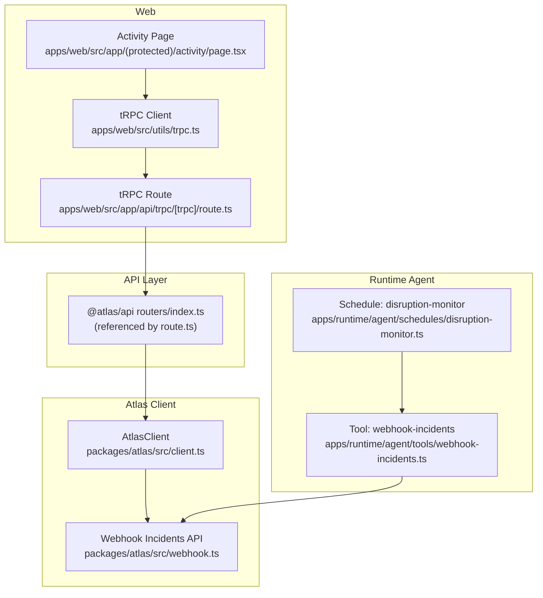
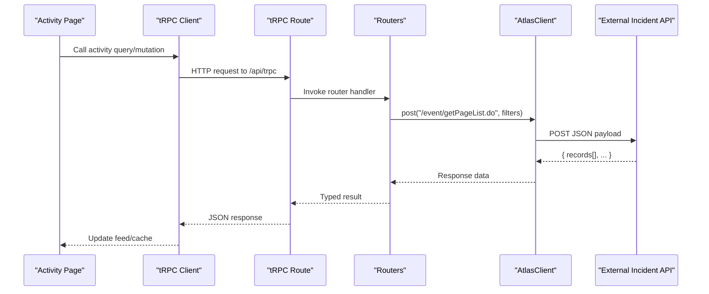
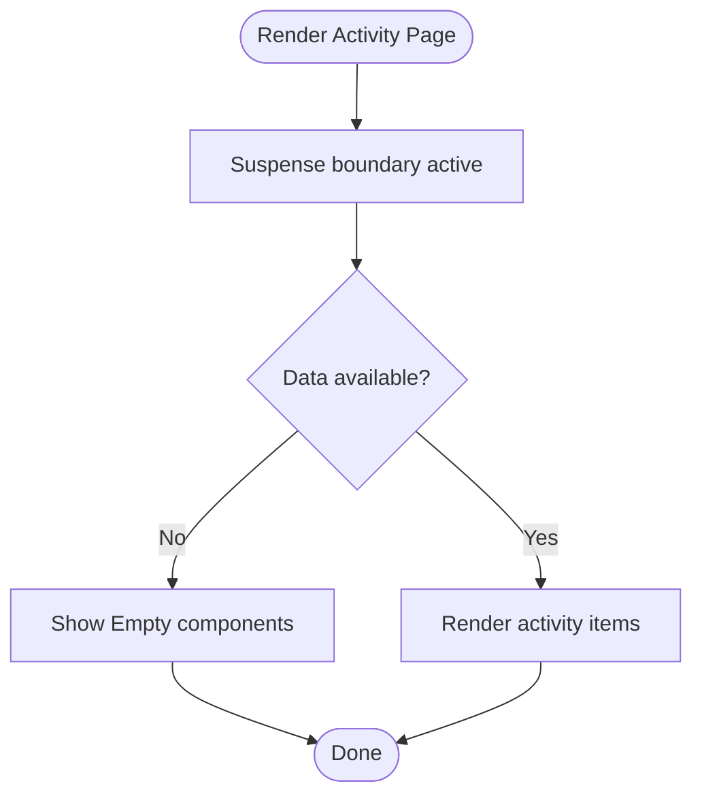
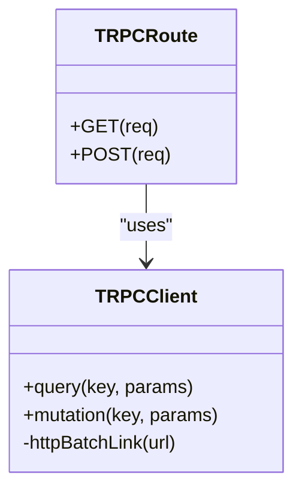
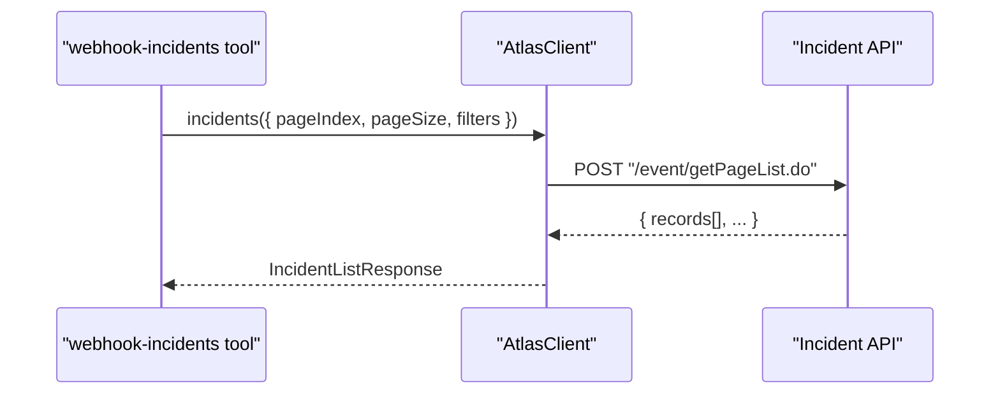
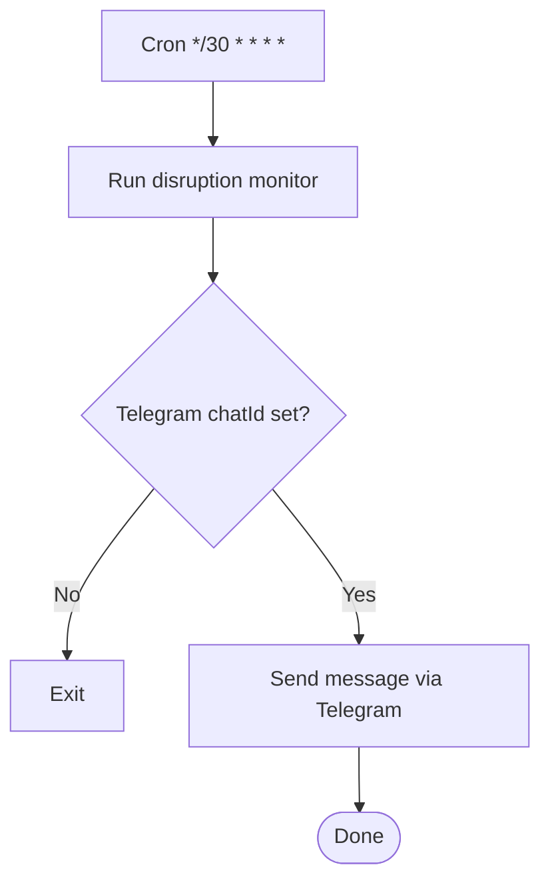
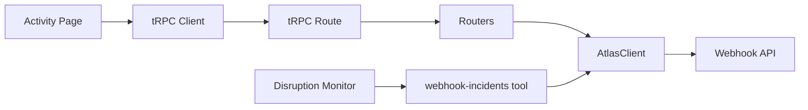

# Activity Tracking Procedures

<cite>
**Referenced Files in This Document**
- [activity/page.tsx](file://apps/web/src/app/(protected)/activity/page.tsx)
- [empty.tsx](file://packages/ui/src/components/empty.tsx)
- [route.ts](file://apps/web/src/app/api/trpc/[trpc]/route.ts)
- [trpc.ts](file://apps/web/src/utils/trpc.ts)
- [client.ts](file://packages/atlas/src/client.ts)
- [webhook.ts](file://packages/atlas/src/webhook.ts)
- [webhook-incidents.ts](file://apps/runtime/agent/tools/webhook-incidents.ts)
- [disruption-monitor.ts](file://apps/runtime/agent/schedules/disruption-monitor.ts)
</cite>

## Table of Contents

1. Introduction
2. Project Structure
3. Core Components
4. Architecture Overview
5. Detailed Component Analysis
6. Dependency Analysis
7. Performance Considerations
8. Troubleshooting Guide
9. Conclusion

## Introduction

This document describes the activity tracking procedures implemented in the project, focusing on real-time monitoring endpoints that track user actions, system events, and collaborative activities. It explains event types, data structures, and mechanisms for subscribing to activity streams, filtering by type or user, and rendering activity feeds in the UI. It also covers performance considerations for high-frequency updates and best practices for handling large volumes of activity data.

## Project Structure

The activity feature spans the web application, API layer, and runtime agent:

- Web UI provides an activity page placeholder and a trpc client for data access.
- The API exposes a tRPC endpoint used by the client.
- The Atlas client package encapsulates HTTP calls to external services (e.g., incident/event APIs).
- The runtime agent includes tools and schedules to poll and notify about incidents.

**Diagram sources**

- [activity/page.tsx:11-29](<file://apps/web/src/app/(protected)/activity/page.tsx#L11-L29>)
- [trpc.ts:22-39](file://apps/web/src/utils/trpc.ts#L22-L39)
- [route.ts:6-12](file://apps/web/src/app/api/trpc/[trpc]/route.ts#L6-L12)
- [client.ts:7-39](file://packages/atlas/src/client.ts#L7-L39)
- [webhook.ts:57-65](file://packages/atlas/src/webhook.ts#L57-L65)
- [webhook-incidents.ts:7-12](file://apps/runtime/agent/tools/webhook-incidents.ts#L7-L12)
- [disruption-monitor.ts:5-19](file://apps/runtime/agent/schedules/disruption-monitor.ts#L5-L19)

**Section sources**

- [activity/page.tsx:11-29](<file://apps/web/src/app/(protected)/activity/page.tsx#L11-L29>)
- [trpc.ts:22-39](file://apps/web/src/utils/trpc.ts#L22-L39)
- [route.ts:6-12](file://apps/web/src/app/api/trpc/[trpc]/route.ts#L6-L12)
- [client.ts:7-39](file://packages/atlas/src/client.ts#L7-L39)
- [webhook.ts:57-65](file://packages/atlas/src/webhook.ts#L57-L65)
- [webhook-incidents.ts:7-12](file://apps/runtime/agent/tools/webhook-incidents.ts#L7-L12)
- [disruption-monitor.ts:5-19](file://apps/runtime/agent/schedules/disruption-monitor.ts#L5-L19)

## Core Components

- Activity Page: A protected route that currently renders an empty state with a loading boundary. It is the intended entry point for displaying activity history.
- Empty UI Components: Reusable components to render empty states consistently.
- tRPC Client and Route: Provide a typed, batched client for fetching data from server-side routers.
- Atlas Client: Encapsulates authenticated POST requests to external services.
- Webhook Incidents Tool: Exposes a tool to list flight incident events with filters and pagination.
- Disruption Monitor Schedule: Periodically triggers incident checks and notifications via Telegram.

Key responsibilities:

- UI: Present activity feed and handle loading/empty states.
- Client: Fetch and cache activity data via tRPC.
- Server: Implement routers to aggregate and return activity/incident data.
- External Integration: Use Atlas client to query incident/event endpoints.
- Automation: Schedule periodic checks and push notifications.

**Section sources**

- [activity/page.tsx:11-29](<file://apps/web/src/app/(protected)/activity/page.tsx#L11-L29>)
- [empty.tsx:5-92](file://packages/ui/src/components/empty.tsx#L5-L92)
- [trpc.ts:7-39](file://apps/web/src/utils/trpc.ts#L7-L39)
- [route.ts:6-12](file://apps/web/src/app/api/trpc/[trpc]/route.ts#L6-L12)
- [client.ts:7-39](file://packages/atlas/src/client.ts#L7-L39)
- [webhook.ts:13-65](file://packages/atlas/src/webhook.ts#L13-L65)
- [webhook-incidents.ts:7-44](file://apps/runtime/agent/tools/webhook-incidents.ts#L7-L44)
- [disruption-monitor.ts:5-19](file://apps/runtime/agent/schedules/disruption-monitor.ts#L5-L19)

## Architecture Overview

The activity tracking architecture integrates UI, API, and external systems:

- The Activity Page uses the tRPC client to fetch activity data from server routers.
- The tRPC route delegates to routers which can call the Atlas client to retrieve incident/event data.
- The Atlas client authenticates and posts to external endpoints defined in the webhook module.
- The runtime agent periodically polls incidents and notifies via channels (e.g., Telegram).

**Diagram sources**

- [activity/page.tsx:11-29](<file://apps/web/src/app/(protected)/activity/page.tsx#L11-L29>)
- [trpc.ts:22-39](file://apps/web/src/utils/trpc.ts#L22-L39)
- [route.ts:6-12](file://apps/web/src/app/api/trpc/[trpc]/route.ts#L6-L12)
- [client.ts:23-39](file://packages/atlas/src/client.ts#L23-L39)
- [webhook.ts:57-65](file://packages/atlas/src/webhook.ts#L57-L65)

## Detailed Component Analysis

### Activity Page and UI

- Purpose: Placeholder for activity history with a Suspense boundary and empty state.
- Behavior: Renders a friendly empty message when no activity exists; ready to be extended with data fetching and rendering logic.
- Extensibility: Can integrate with tRPC queries to load and display activities, using the provided Empty components for consistent UX.

**Diagram sources**

- [activity/page.tsx:11-29](<file://apps/web/src/app/(protected)/activity/page.tsx#L11-L29>)
- [empty.tsx:5-92](file://packages/ui/src/components/empty.tsx#L5-L92)

**Section sources**

- [activity/page.tsx:11-29](<file://apps/web/src/app/(protected)/activity/page.tsx#L11-L29>)
- [empty.tsx:5-92](file://packages/ui/src/components/empty.tsx#L5-L92)

### tRPC Client and Route

- Purpose: Provide a strongly-typed client for calling server-side routers and a Next.js route handler for tRPC over HTTP.
- Behavior: Uses httpBatchLink to batch requests and includes credentials for authentication. Error handling surfaces toast notifications via QueryCache.
- Usage: The Activity Page should use this client to fetch activity data through defined router methods.

**Diagram sources**

- [trpc.ts:22-39](file://apps/web/src/utils/trpc.ts#L22-L39)
- [route.ts:6-12](file://apps/web/src/app/api/trpc/[trpc]/route.ts#L6-L12)

**Section sources**

- [trpc.ts:7-39](file://apps/web/src/utils/trpc.ts#L7-L39)
- [route.ts:6-12](file://apps/web/src/app/api/trpc/[trpc]/route.ts#L6-L12)

### Atlas Client and Webhook Incidents

- Purpose: Authenticate and call external incident/event endpoints with structured payloads and receive paginated results.
- Data Structures:
  - RegisterWebhookRequest: cid?, url
  - RegisterWebhookResponse: status, msg?
  - IncidentListRequest: eventId?, orderNo?, eventType?, pnr?, paxName?, paxEmail?, airline?, eventStatus[]?, eventTimeStart?, eventTimeEnd?, depTimeStart?, depTimeEnd?, updateTimeStart?, pageIndex?, pageSize
  - IncidentListResponse: records[] with fields like eventId, orderNo, subOrderNo?, eventType, eventStatus, eventTime?, extraInfo?, confirmedResult?, confirmedRemark?, clientCode?, createTime?, updateIme?, airline?, depTime?, confirmTime?, confirmUsr?, notified?, pnr?, paxName?, paxEmail?
- Methods:
  - incidents(input): POST "/event/getPageList.do"
  - register(input): POST "/updateWebhookURL.do"

**Diagram sources**

- [webhook-incidents.ts:7-44](file://apps/runtime/agent/tools/webhook-incidents.ts#L7-L44)
- [client.ts:23-39](file://packages/atlas/src/client.ts#L23-L39)
- [webhook.ts:13-65](file://packages/atlas/src/webhook.ts#L13-L65)

**Section sources**

- [client.ts:7-39](file://packages/atlas/src/client.ts#L7-L39)
- [webhook.ts:13-65](file://packages/atlas/src/webhook.ts#L13-L65)
- [webhook-incidents.ts:7-44](file://apps/runtime/agent/tools/webhook-incidents.ts#L7-L44)

### Disruption Monitor Schedule

- Purpose: Periodically check for new flight incidents and send summaries to a Telegram channel.
- Behavior: Runs on a cron schedule, invokes the webhook-incidents tool via app auth, and sends messages only for new incidents not previously reported.

**Diagram sources**

- [disruption-monitor.ts:5-19](file://apps/runtime/agent/schedules/disruption-monitor.ts#L5-L19)

**Section sources**

- [disruption-monitor.ts:5-19](file://apps/runtime/agent/schedules/disruption-monitor.ts#L5-L19)

## Dependency Analysis

- The Activity Page depends on UI components and Suspense boundaries.
- The tRPC client depends on TanStack Query and Sonner for caching and error feedback.
- The tRPC route depends on the app router and context provider.
- The Atlas client depends on environment configuration (clientId, clientSecret) and performs authenticated POSTs.
- The webhook tool depends on the Atlas client and defines input schemas for filtering.
- The disruption monitor depends on environment variables and the webhook tool.

**Diagram sources**

- [activity/page.tsx:11-29](<file://apps/web/src/app/(protected)/activity/page.tsx#L11-L29>)
- [trpc.ts:22-39](file://apps/web/src/utils/trpc.ts#L22-L39)
- [route.ts:6-12](file://apps/web/src/app/api/trpc/[trpc]/route.ts#L6-L12)
- [client.ts:7-39](file://packages/atlas/src/client.ts#L7-L39)
- [webhook.ts:57-65](file://packages/atlas/src/webhook.ts#L57-L65)
- [webhook-incidents.ts:7-44](file://apps/runtime/agent/tools/webhook-incidents.ts#L7-L44)
- [disruption-monitor.ts:5-19](file://apps/runtime/agent/schedules/disruption-monitor.ts#L5-L19)

**Section sources**

- [activity/page.tsx:11-29](<file://apps/web/src/app/(protected)/activity/page.tsx#L11-L29>)
- [trpc.ts:22-39](file://apps/web/src/utils/trpc.ts#L22-L39)
- [route.ts:6-12](file://apps/web/src/app/api/trpc/[trpc]/route.ts#L6-L12)
- [client.ts:7-39](file://packages/atlas/src/client.ts#L7-L39)
- [webhook.ts:57-65](file://packages/atlas/src/webhook.ts#L57-L65)
- [webhook-incidents.ts:7-44](file://apps/runtime/agent/tools/webhook-incidents.ts#L7-L44)
- [disruption-monitor.ts:5-19](file://apps/runtime/agent/schedules/disruption-monitor.ts#L5-L19)

## Performance Considerations

- Batch and Cache:
  - Use tRPC’s httpBatchLink to reduce network overhead and leverage TanStack Query caching to avoid redundant requests.
- Pagination and Filtering:
  - Always pass pageSize and pageIndex to limit payload size.
  - Apply filters (eventType, eventStatus, time windows, orderNo, airline) to minimize data returned.
- Real-Time Updates:
  - For high-frequency updates, prefer incremental updates and deduplication strategies (e.g., Set/Map lookups) to avoid re-rendering duplicates.
  - Consider debouncing or throttling UI updates if receiving bursts of events.
- Non-blocking Side Effects:
  - Use non-blocking patterns for logging/analytics to prevent blocking responses.
- Memory Management:
  - Limit the number of retained items in memory; implement eviction policies for long-running sessions.
- Error Handling:
  - Surface errors gracefully with retry options and user feedback.

[No sources needed since this section provides general guidance]

## Troubleshooting Guide

- Authentication Issues:
  - Ensure clientId and clientSecret are configured in the Atlas client to avoid 4xx/5xx responses.
- Network Errors:
  - Verify connectivity to external incident endpoints and inspect response payloads for error details.
- UI Feedback:
  - Confirm that tRPC error handling shows user-friendly messages and offers retry actions.
- Scheduling Failures:
  - Validate environment variables (e.g., Telegram chatId) required by the disruption monitor.

**Section sources**

- [client.ts:23-39](file://packages/atlas/src/client.ts#L23-L39)
- [trpc.ts:7-19](file://apps/web/src/utils/trpc.ts#L7-L19)
- [disruption-monitor.ts:5-19](file://apps/runtime/agent/schedules/disruption-monitor.ts#L5-L19)

## Conclusion

The activity tracking setup provides a foundation for monitoring user actions, system events, and collaborative activities through a combination of UI placeholders, tRPC-based data access, and external incident integrations. To complete the feature, implement server-side routers to aggregate activity data, wire up the Activity Page to fetch and render activities, and adopt the recommended performance and error-handling practices for high-volume, real-time scenarios.

[No sources needed since this section summarizes without analyzing specific files]
