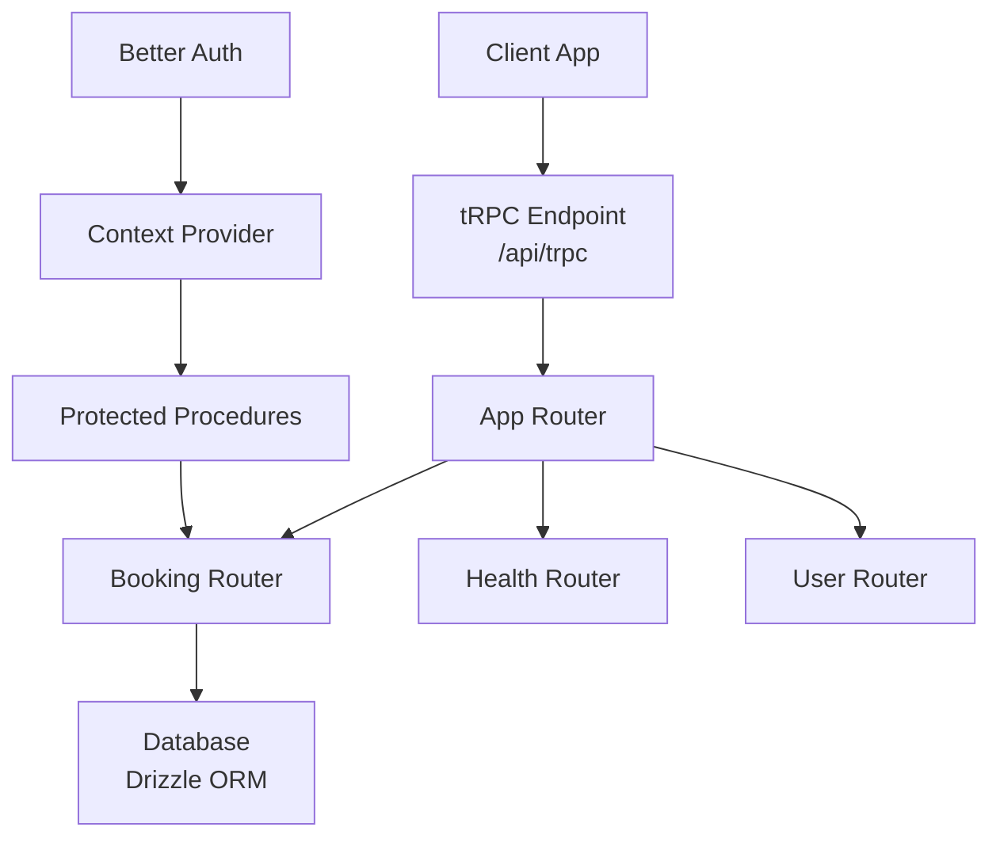
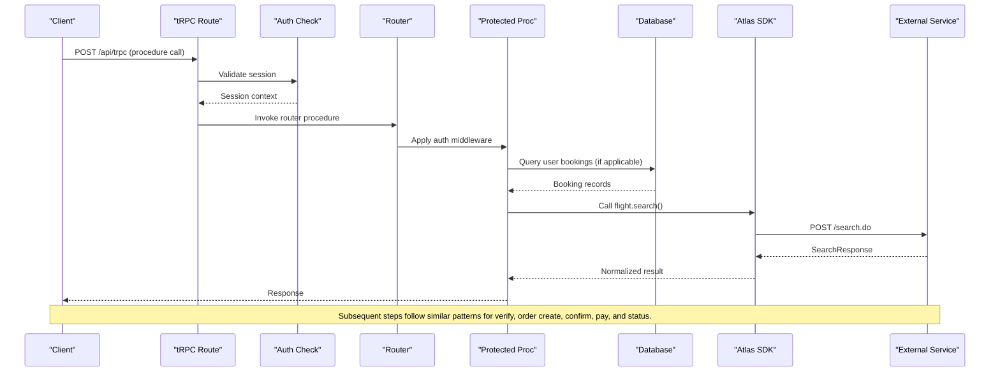
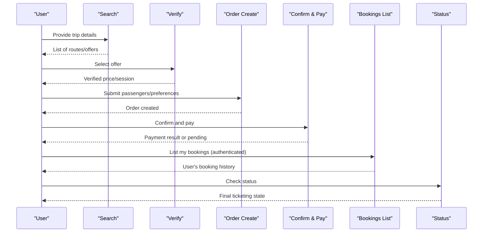
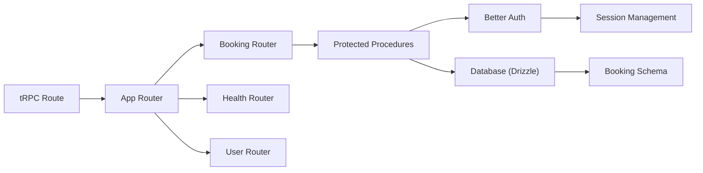
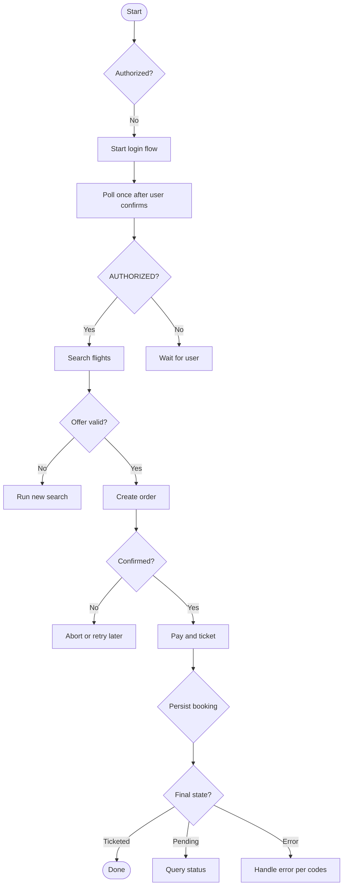

# Flight Booking Procedures

<cite>
**Referenced Files in This Document**
- [route.ts](file://apps/web/src/app/api/trpc/[trpc]/route.ts)
- [index.ts (routers)](file://packages/api/src/routers/index.ts)
- [booking.ts (router)](file://packages/api/src/routers/booking.ts)
- [context.ts](file://packages/api/src/context.ts)
- [index.ts (api)](file://packages/api/src/index.ts)
- [auth.ts (schema)](file://packages/db/src/schema/auth.ts)
- [booking.ts (schema)](file://packages/db/src/schema/booking.ts)
- [search.ts](file://packages/atlas/src/flights/search.ts)
- [verify.ts](file://packages/atlas/src/flights/verify.ts)
- [create-order.ts](file://packages/atlas/src/flights/create-order.ts)
- [confirm-order.ts](file://packages/atlas/src/flights/confirm-order.ts)
- [payment-and-ticketing.ts](file://packages/atlas/src/flights/payment-and-ticketing.ts)
- [bookings.ts (runtime persistence)](file://apps/runtime/agent/lib/bookings.ts)
- [SKILL.md](file://.agents/skills/atlas-flight-booking/SKILL.md)
- [booking-workflow.md](file://.agents/skills/atlas-flight-booking/references/booking-workflow.md)
- [cli-contract.md](file://.agents/skills/atlas-flight-booking/references/cli-contract.md)
- [error-handling.md](file://.agents/skills/atlas-flight-booking/references/error-handling.md)
- [passenger-input.md](file://.agents/skills/atlas-flight-booking/references/passenger-input.md)
</cite>

## Update Summary

**Changes Made**

- Added new protected API endpoint for listing user bookings with database integration
- Enhanced authentication requirements using Better Auth with session-based authorization
- Integrated Drizzle ORM schema for booking persistence layer
- Updated tRPC router structure to include booking procedures
- Added best-effort booking persistence from runtime agent operations

## Table of Contents

1. [Introduction](#introduction)
2. [Project Structure](#project-structure)
3. [Core Components](#core-components)
4. [Architecture Overview](#architecture-overview)
5. [Detailed Component Analysis](#detailed-component-analysis)
6. [Protected Booking Endpoints](#protected-booking-endpoints)
7. [Database Persistence Layer](#database-persistence-layer)
8. [Authentication and Authorization](#authentication-and-authorization)
9. [Dependency Analysis](#dependency-analysis)
10. [Performance Considerations](#performance-considerations)
11. [Troubleshooting Guide](#troubleshooting-guide)
12. [Conclusion](#conclusion)
13. [Appendices](#appendices)

## Introduction

This document provides detailed API documentation for flight booking procedures exposed via tRPC and implemented through the Atlas client. It covers:

- Flight search and verification
- Reservation creation and confirmation
- Payment and ticketing
- Protected booking listing endpoints
- Cancellation and status checks
- Database persistence and authentication requirements

The implementation uses a Next.js tRPC endpoint that delegates to an Atlas SDK which calls external booking APIs, with enhanced security through protected procedures and persistent storage of booking records.

## Project Structure

The application exposes a single tRPC entry point that wires the app router to a fetch-based handler. The current router includes health, user, and booking modules; flight booking functionality is provided by the Atlas SDK and integrated with database persistence.

**Diagram sources**

- [route.ts:1-14](file://apps/web/src/app/api/trpc/[trpc]/route.ts#L1-L14)
- [index.ts (routers):1-12](file://packages/api/src/routers/index.ts#L1-L12)
- [booking.ts (router):1-16](file://packages/api/src/routers/booking.ts#L1-L16)
- [context.ts:1-14](file://packages/api/src/context.ts#L1-L14)

**Section sources**

- [route.ts:1-14](file://apps/web/src/app/api/trpc/[trpc]/route.ts#L1-L14)
- [index.ts (routers):1-12](file://packages/api/src/routers/index.ts#L1-L12)

## Core Components

- tRPC endpoint: A Next.js route that handles GET/POST requests and invokes the app router.
- Context: Provides session information from Better Auth authentication.
- Protected procedures: Middleware that enforces authentication requirements.
- Atlas SDK flights module: Implements search, verify, order creation, confirmation, payment/ticketing, and related operations.
- Database persistence: Best-effort storage of booking lifecycle events.

Key responsibilities:

- Search flights with flexible criteria and return normalized results.
- Verify selected offers to lock pricing and availability.
- Create orders with passenger details and optional ancillaries.
- Confirm orders and initiate payment flows.
- Process payment and ticket issuance or handle pending states.
- Query order status and support cancellation where applicable.
- List user bookings with authentication and authorization.

**Section sources**

- [route.ts:1-14](file://apps/web/src/app/api/trpc/[trpc]/route.ts#L1-L14)
- [context.ts:1-14](file://packages/api/src/context.ts#L1-L14)
- [index.ts (api):1-26](file://packages/api/src/index.ts#L1-L26)
- [booking.ts (router):1-16](file://packages/api/src/routers/booking.ts#L1-L16)

## Architecture Overview

The booking flow integrates four layers:

- Presentation layer: tRPC endpoints expose typed procedures to clients.
- Authentication layer: Better Auth provides session management and authorization.
- Orchestration layer: The Atlas SDK encapsulates external booking service calls and normalizes responses.
- Persistence layer: Drizzle ORM stores booking lifecycle events with best-effort semantics.

**Diagram sources**

- [route.ts:1-14](file://apps/web/src/app/api/trpc/[trpc]/route.ts#L1-L14)
- [context.ts:1-14](file://packages/api/src/context.ts#L1-L14)
- [index.ts (api):11-25](file://packages/api/src/index.ts#L11-L25)
- [booking.ts (router):7-15](file://packages/api/src/routers/booking.ts#L7-L15)

## Detailed Component Analysis

### Flight Search

Purpose:

- Accepts trip type, origin/destination, dates, passenger counts, airline filters, fare family options, currency, and request source.
- Returns routing results and metadata for downstream verification.

Input schema:

- tripType: string
- adultNum: number
- childNum: number
- infantNum: number
- fromCity: string
- fromAirport?: string
- toCity: string
- toAirport?: string
- fromDate: string
- retDate?: string
- airlines?: string[]
- fromFlightNumbers?: string[]
- retFlightNumbers?: string[]
- includeMultipleFareFamily?: boolean
- currency?: string | null
- displayCurrency?: string
- requestSource?: string | null

Response schema:

- status: number
- msg: string | null
- routings: unknown[]

Notes:

- Use this endpoint to populate offer lists and proceed to verification.
- For flexible dates, run multiple searches per requested date and merge results on the client/orchestrator side.

**Section sources**

- [search.ts:3-41](file://packages/atlas/src/flights/search.ts#L3-L41)

### Flight Verification

Purpose:

- Locks pricing and availability for a selected routing before order creation.

Input schema:

- routingIdentifier: string
- Additional fields may be required depending on the provider; pass-through supported.

Response schema:

- status: number
- msg: string | null
- sessionId?: string
- Additional provider-specific fields

Notes:

- After successful verification, use the returned session or identifiers when creating an order.
- If verification fails due to price changes or unavailability, re-run search and re-verify.

**Section sources**

- [verify.ts:3-20](file://packages/atlas/src/flights/verify.ts#L3-L20)

### Order Creation

Purpose:

- Creates a reservation using verified routing and passenger details.

Input schema:

- sessionId: string
- routingIdentifier: string
- Additional fields for passengers and preferences are passed through.

Response schema:

- Record<string, unknown> containing order identifiers and next steps.

Notes:

- Collect passenger data according to the passenger input reference and send it once.
- Do not retry order creation automatically; if uncertain, query status.

**Section sources**

- [create-order.ts:3-16](file://packages/atlas/src/flights/create-order.ts#L3-L16)

### Order Confirmation and Payment Initiation

Purpose:

- Generates a confirmation URL or initiates a payment flow for the created order.

Input schema:

- orderNo: string
- redirectUri?: string | null
- iframe?: boolean
- timeout?: number

Response schema:

- status: number
- msg: string | null
- confirmationUrl: string

Notes:

- Present the confirmation URL to the user and wait for completion.
- After confirmation, proceed to payment and ticketing.

**Section sources**

- [confirm-order.ts:3-21](file://packages/atlas/src/flights/confirm-order.ts#L3-L21)

### Payment and Ticketing

Purpose:

- Processes payment and attempts ticket issuance for the order.

Input schema:

- orderNo: string
- Additional payment fields as required by the provider.

Response schema:

- status: number
- msg: string | null
- Additional fields indicating ticketing state

Notes:

- Handle terminal states such as ticketed or pending ticketing.
- On balance check requirements or payment failures, guide users to resolve issues without retrying payment blindly.

**Section sources**

- [payment-and-ticketing.ts:3-19](file://packages/atlas/src/flights/payment-and-ticketing.ts#L3-L19)

### End-to-End Booking Workflow

Sequence:

1. Search flights with desired criteria.
2. Verify selected offer to lock price and availability.
3. Create order with passenger details.
4. Confirm order and obtain confirmation URL or payment initiation.
5. Pay and process ticketing.
6. Persist booking record to database (best effort).
7. Query order status until final state.

[No sources needed since this diagram shows conceptual workflow, not actual code structure]

### Optional Services: Seats and Baggage

- Seat and baggage selection are supported during the booking flow.
- Selections must be bound to specific travelers and segments.
- If a selected seat becomes unavailable during order creation, apply the chosen policy: continue without seat, cancel order, or accept a similar seat.

Integration notes:

- Use the Atlas SDK's seat and baggage methods to list and select options.
- Only use IDs returned by the latest list responses.

**Section sources**

- [booking-workflow.md:17-31](file://.agents/skills/atlas-flight-booking/references/booking-workflow.md#L17-L31)
- [cli-contract.md:43-54](file://.agents/skills/atlas-flight-booking/references/cli-contract.md#L43-L54)

### Passenger Input

- Collect only required fields indicated by the verification response.
- Prefer one-time delivery via stdin to avoid exposing personal data in logs or arguments.
- Build a single JSON payload with passengers and contact info.

Payload shape:

- passengers: array of traveler entries including name, type, gender, birthday, nationality, and document details.
- contact: name, email (optional), mobile (optional).

Safe correction:

- On validation errors, ask only for the missing or invalid fields and resubmit once.

**Section sources**

- [passenger-input.md:1-52](file://.agents/skills/atlas-flight-booking/references/passenger-input.md#L1-L52)

### Authorization and CLI Integration

- Before searching or booking, ensure authorization is complete.
- Follow the CLI contract for login, polling, and diagnostics.
- When ticketing is not yet available, present activation instructions and stop until completed.

Operational rules:

- Preserve all opaque IDs exactly as returned.
- Branch on stable codes rather than messages.
- Respect limits and avoid retries on side-effecting operations.

**Section sources**

- [SKILL.md:26-56](file://.agents/skills/atlas-flight-booking/SKILL.md#L26-L56)
- [cli-contract.md:9-28](file://.agents/skills/atlas-flight-booking/references/cli-contract.md#L9-L28)

## Protected Booking Endpoints

### List Bookings

Purpose:

- Retrieves all bookings for the authenticated user, ordered by creation date (newest first).
- Requires valid authentication session to access user-specific booking data.

Authentication:

- Requires valid session via Better Auth middleware.
- Filters results to only show bookings belonging to the authenticated user.

Input schema:

- No input parameters required (uses authenticated user context).

Response schema:

- Array of booking records containing:
  - orderNo: string (primary key)
  - status: string (booking lifecycle state)
  - createdAt: timestamp
  - updatedAt: timestamp
  - userId: string (foreign key to user table)
  - principalId: string (optional, for non-user principals)
  - pnr: string (optional, passenger name record)
  - currency: string (optional)
  - totalAmount: string (optional)
  - payload: JSON object (optional, raw API response snapshot)

Error handling:

- UNAUTHORIZED: Missing or invalid session token
- DATABASE_ERROR: Database connection or query failure

Implementation notes:

- Uses Drizzle ORM for type-safe database queries
- Applies WHERE clause to filter by authenticated user ID
- Orders results by creation date in descending order
- Best-effort persistence design ensures booking flow continues even if database writes fail

**Section sources**

- [booking.ts (router):7-15](file://packages/api/src/routers/booking.ts#L7-L15)
- [booking.ts (schema):11-36](file://packages/db/src/schema/booking.ts#L11-L36)

## Database Persistence Layer

### Booking Schema

The booking table stores one row per Atlas order, upserted by the agent as the order moves through its lifecycle (created → confirmed → issued, or refunded/voided). Persistence is best effort: a failed write never blocks the booking flow.

Schema definition:

- orderNo: text primary key (natural key from Atlas)
- status: text (required, lifecycle state)
- createdAt: timestamp (auto-generated)
- updatedAt: timestamp (auto-updated)
- userId: text (foreign key to user table, nullable)
- principalId: text (optional, for non-user channel principals)
- pnr: text (optional, passenger name record)
- currency: text (optional)
- totalAmount: text (optional)
- payload: jsonb (optional, raw API response snapshot)

Indexes:

- booking_userId_idx: Index on userId for efficient user-specific queries

Relationships:

- One-to-one relationship with user table via userId foreign key
- Cascading delete behavior when user is removed

Best-effort persistence design:

- Database failures are caught and swallowed in the persistence layer
- Booking flow continues even if persistence fails
- Ensures reliability of money-critical operations

**Section sources**

- [booking.ts (schema):1-44](file://packages/db/src/schema/booking.ts#L1-L44)
- [bookings.ts (runtime persistence):100-143](file://apps/runtime/agent/lib/bookings.ts#L100-L143)

## Authentication and Authorization

### Better Auth Integration

The system uses Better Auth for comprehensive authentication and session management with support for multiple providers including email/password, Google OAuth, and Telegram authentication.

Configuration:

- Database adapter using Drizzle ORM with PostgreSQL
- Email and password authentication enabled
- Social providers: Google OAuth configured
- Telegram integration with bot authentication
- Next.js cookies plugin for browser sessions
- Last login method tracking plugin

Session management:

- Sessions stored in database with expiration tracking
- IP address and user agent logging for security
- Automatic cleanup of expired sessions
- Secure cookie handling for cross-origin requests

Context provider:

- tRPC context extracts session from incoming requests
- Session data injected into procedure context for authorization
- Type-safe session access throughout the application

Protected procedures:

- Middleware validates session existence before processing
- Throws UNAUTHORIZED error for missing sessions
- Provides type-safe session access in protected procedures

**Section sources**

- [auth.ts (schema):1-101](file://packages/db/src/schema/auth.ts#L1-L101)
- [context.ts:1-14](file://packages/api/src/context.ts#L1-L14)
- [index.ts (api):11-25](file://packages/api/src/index.ts#L11-L25)

## Dependency Analysis

- tRPC route depends on the app router and fetch adapter.
- The app router composes health, user, and booking routers.
- Booking router depends on database schema and protected procedures.
- Better Auth provides authentication services and session management.
- Drizzle ORM handles database operations with type safety.
- The Atlas SDK encapsulates HTTP calls to external booking endpoints and returns normalized types.

**Diagram sources**

- [route.ts:1-14](file://apps/web/src/app/api/trpc/[trpc]/route.ts#L1-L14)
- [index.ts (routers):1-12](file://packages/api/src/routers/index.ts#L1-L12)
- [booking.ts (router):1-16](file://packages/api/src/routers/booking.ts#L1-L16)
- [index.ts (api):11-25](file://packages/api/src/index.ts#L11-L25)

**Section sources**

- [route.ts:1-14](file://apps/web/src/app/api/trpc/[trpc]/route.ts#L1-L14)
- [index.ts (routers):1-12](file://packages/api/src/routers/index.ts#L1-L12)

## Performance Considerations

- Batch searches for flexible dates on the orchestrator side to minimize redundant network calls.
- Cache verified offers briefly to reduce repeated verification under high load.
- Avoid unnecessary retries on side-effecting operations; rely on idempotent status queries.
- Use pagination or limit parameters where supported by the external service to control payload sizes.
- Database indexes optimize user-specific booking queries.
- Best-effort persistence prevents booking flow delays from database operations.
- Session caching reduces authentication overhead for subsequent requests.

[No sources needed since this section provides general guidance]

## Troubleshooting Guide

Common error scenarios and recommended actions:

- Authorization required or expired: Start login flow, present authorization URL, and poll once after user confirmation.
- No results found: Suggest alternative dates or adjust filters.
- Offer expired or flight unavailable: Re-run search and re-verify.
- Price increased: Show old and new totals and obtain explicit confirmation before proceeding.
- Payment balance check required: Inform the user about potential insufficient balance and do not retry payment.
- Order creation unknown or duplicate suspected: Do not create another order; show order link if available and query status.
- Payment status unknown or processing: Query order status instead of repaying.
- Ticketed or pending ticketing: Report final or ongoing state and provide order link when available.
- Database persistence failure: Continue booking flow (best-effort design); log error for monitoring.

Error handling principles:

- Branch on stable codes, never parse messages.
- Keep internal causes out of user-facing output.
- Limit retries for read-only operations; never retry order creation or payment.
- Handle authentication errors gracefully with clear user feedback.
- Monitor database connectivity without blocking critical booking operations.

**Section sources**

- [error-handling.md:1-74](file://.agents/skills/atlas-flight-booking/references/error-handling.md#L1-L74)
- [booking-workflow.md:1-63](file://.agents/skills/atlas-flight-booking/references/booking-workflow.md#L1-L63)

## Conclusion

The flight booking system integrates a tRPC layer with the Atlas SDK to provide a robust, secure, and user-friendly booking experience. With the addition of protected booking endpoints, database persistence, and enhanced authentication, the system now offers comprehensive booking lifecycle management while maintaining reliability through best-effort persistence and proper error handling. By following the defined workflows, input/output schemas, and error handling strategies, developers can implement reliable search, verification, reservation, payment, and ticketing processes while maintaining compliance with external service contracts and safety checkpoints.

[No sources needed since this section summarizes without analyzing specific files]

## Appendices

### Example: Complete Booking Workflow with Persistence

- Step 1: Search flights with origin, destination, dates, and passenger counts.
- Step 2: Verify selected offer to lock price and availability.
- Step 3: Create order with passenger details and optional ancillaries.
- Step 4: Confirm order and initiate payment flow.
- Step 5: Pay and process ticketing; handle pending or terminal states.
- Step 6: Persist booking record to database (best effort).
- Step 7: Query order status until ticketing completes.
- Step 8: List user bookings to view booking history.

[No sources needed since this section provides general guidance]

### Example: Error Handling Flowchart

[No sources needed since this diagram shows conceptual workflow, not actual code structure]

### Database Schema Reference

The booking table structure supports comprehensive tracking of flight booking lifecycle events with best-effort persistence semantics. Key design principles include:

- Natural primary key using Atlas order numbers
- Flexible payload storage for varying API responses
- User attribution with support for both user accounts and channel principals
- Timestamp tracking for audit and debugging purposes
- Foreign key relationships ensuring referential integrity

**Section sources**

- [booking.ts (schema):11-36](file://packages/db/src/schema/booking.ts#L11-L36)
- [auth.ts (schema):4-19](file://packages/db/src/schema/auth.ts#L4-L19)
