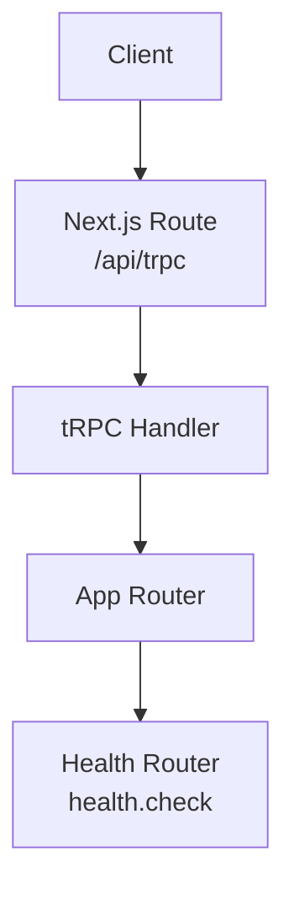
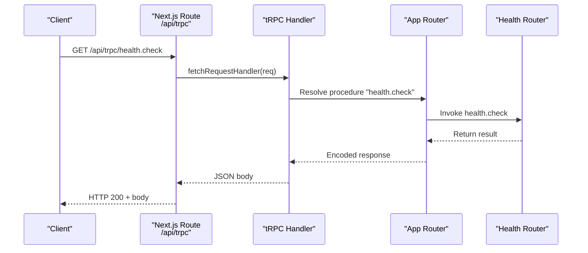
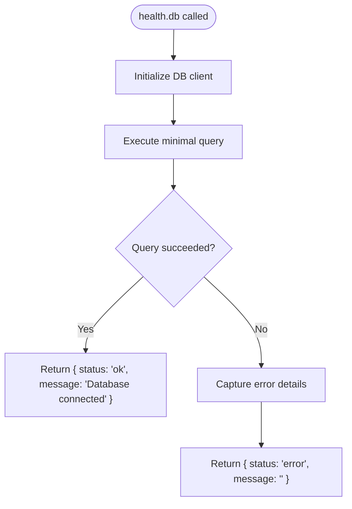
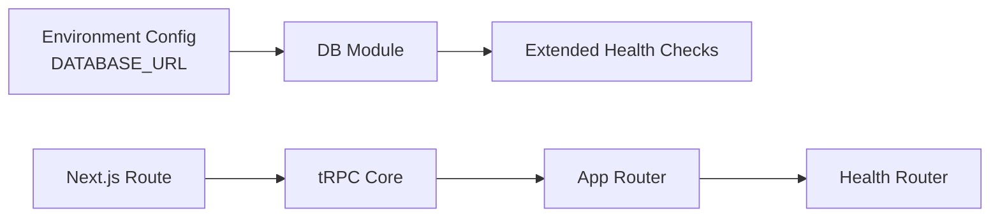

# System Health Check Procedures

<cite>
**Referenced Files in This Document**
- [health.ts](file://packages/api/src/routers/health.ts)
- [index.ts (routers)](file://packages/api/src/routers/index.ts)
- [route.ts (tRPC adapter)](file://apps/web/src/app/api/trpc/[trpc]/route.ts)
- [index.ts (api core)](file://packages/api/src/index.ts)
- [index.ts (db)](file://packages/db/src/index.ts)
- [server.ts (env)](file://packages/env/src/server.ts)
</cite>

## Table of Contents

1. Introduction
2. Project Structure
3. Core Components
4. Architecture Overview
5. Detailed Component Analysis
6. Dependency Analysis
7. Performance Considerations
8. Troubleshooting Guide
9. Conclusion

## Introduction

This document describes the system health check procedures for the application, focusing on:

- The health monitoring endpoint that reports system status
- How to extend it to verify database connectivity and service availability
- Response formats, status codes, and diagnostic information
- Production implementation guidance, alerting strategies, and troubleshooting using health data

The current codebase exposes a tRPC-based health check under the /api/trpc endpoint. It is currently a simple readiness probe returning an OK string.

## Project Structure

Health checks are implemented as a tRPC router and mounted into the application router. The Next.js API route delegates requests to the tRPC handler, which routes them to the health router.

**Diagram sources**

- [route.ts (tRPC adapter):1-13](file://apps/web/src/app/api/trpc/[trpc]/route.ts#L1-L13)
- [index.ts (routers):1-11](file://packages/api/src/routers/index.ts#L1-L11)
- [health.ts:1-6](file://packages/api/src/routers/health.ts#L1-L6)

**Section sources**

- [route.ts (tRPC adapter):1-13](file://apps/web/src/app/api/trpc/[trpc]/route.ts#L1-L13)
- [index.ts (routers):1-11](file://packages/api/src/routers/index.ts#L1-L11)
- [health.ts:1-6](file://packages/api/src/routers/health.ts#L1-L6)

## Core Components

- Health router: Defines the health check procedure. Currently returns a simple success string.
- App router: Aggregates routers including health.
- tRPC adapter: Exposes the app router via Next.js GET/POST at /api/trpc.
- Environment configuration: Provides DATABASE_URL used by the database layer.
- Database layer: Creates a Neon HTTP client with Drizzle ORM.

Key responsibilities:

- Health router: Provide a lightweight readiness probe.
- tRPC adapter: Route incoming requests to the correct procedure.
- Environment and DB modules: Enable future liveness checks against the database.

**Section sources**

- [health.ts:1-6](file://packages/api/src/routers/health.ts#L1-L6)
- [index.ts (routers):1-11](file://packages/api/src/routers/index.ts#L1-L11)
- [route.ts (tRPC adapter):1-13](file://apps/web/src/app/api/trpc/[trpc]/route.ts#L1-L13)
- [server.ts (env):1-28](file://packages/env/src/server.ts#L1-L28)
- [index.ts (db):1-13](file://packages/db/src/index.ts#L1-L13)

## Architecture Overview

The health check flows through the Next.js API route into tRPC, then to the health router. Future enhancements can add database connectivity checks using the existing db module and environment variables.

**Diagram sources**

- [route.ts (tRPC adapter):1-13](file://apps/web/src/app/api/trpc/[trpc]/route.ts#L1-L13)
- [index.ts (routers):1-11](file://packages/api/src/routers/index.ts#L1-L11)
- [health.ts:1-6](file://packages/api/src/routers/health.ts#L1-L6)

## Detailed Component Analysis

### Health Endpoint: health.check

- Purpose: Readiness probe indicating the API process is up and able to respond.
- Current behavior: Returns a simple success string.
- Access: Public procedure; no authentication required.
- Mounting: Mounted under the health namespace in the app router.

Response format and status codes

- HTTP status: 200 when the procedure executes successfully.
- Body: A JSON-encoded tRPC response containing the procedure result. For this endpoint, the result is a simple string.
- Errors: If the procedure throws, tRPC will encode a structured error response with a standard error shape and appropriate HTTP status.

Operational notes

- Keep the endpoint fast and side-effect free.
- Avoid heavy I/O or external calls in the default path to ensure quick responses.
- Use separate endpoints or fields for deeper liveness checks (e.g., database connectivity).

Implementation reference

- Procedure definition and mounting: [health.ts:1-6](file://packages/api/src/routers/health.ts#L1-L6), [index.ts (routers):1-11](file://packages/api/src/routers/index.ts#L1-L11)
- Request routing: [route.ts (tRPC adapter):1-13](file://apps/web/src/app/api/trpc/[trpc]/route.ts#L1-L13)

**Section sources**

- [health.ts:1-6](file://packages/api/src/routers/health.ts#L1-L6)
- [index.ts (routers):1-11](file://packages/api/src/routers/index.ts#L1-L11)
- [route.ts (tRPC adapter):1-13](file://apps/web/src/app/api/trpc/[trpc]/route.ts#L1-L13)

### Extending Health Checks: Database Connectivity Liveness

Recommended approach

- Add a new procedure (for example, health.db) that attempts a minimal query to validate database connectivity.
- Use the existing database module to create a connection and run a lightweight query.
- Return a structured status object indicating connectivity and any diagnostics.

Data flow for a database liveness check

References

- Database initialization and schema binding: [index.ts (db):1-13](file://packages/db/src/index.ts#L1-L13)
- Environment variable for database URL: [server.ts (env):1-28](file://packages/env/src/server.ts#L1-L28)

**Section sources**

- [index.ts (db):1-13](file://packages/db/src/index.ts#L1-L13)
- [server.ts (env):1-28](file://packages/env/src/server.ts#L1-L28)

### tRPC Context and Error Handling

- Public vs protected procedures: The API defines publicProcedure and protectedProcedure. Health checks should use publicProcedure to avoid authentication overhead.
- Error encoding: When a procedure throws, tRPC encodes errors with a standardized shape and HTTP status.

References

- tRPC setup and procedures: [index.ts (api core):1-26](file://packages/api/src/index.ts#L1-L26)

**Section sources**

- [index.ts (api core):1-26](file://packages/api/src/index.ts#L1-L26)

## Dependency Analysis

The health check depends on:

- tRPC server infrastructure for request handling and response encoding
- The Next.js API route for exposing the endpoint
- Optional dependencies for extended checks (database module and environment config)

**Diagram sources**

- [index.ts (api core):1-26](file://packages/api/src/index.ts#L1-L26)
- [index.ts (routers):1-11](file://packages/api/src/routers/index.ts#L1-L11)
- [index.ts (db):1-13](file://packages/db/src/index.ts#L1-L13)
- [server.ts (env):1-28](file://packages/env/src/server.ts#L1-L28)
- [route.ts (tRPC adapter):1-13](file://apps/web/src/app/api/trpc/[trpc]/route.ts#L1-L13)

**Section sources**

- [index.ts (api core):1-26](file://packages/api/src/index.ts#L1-L26)
- [index.ts (routers):1-11](file://packages/api/src/routers/index.ts#L1-L11)
- [index.ts (db):1-13](file://packages/db/src/index.ts#L1-L13)
- [server.ts (env):1-28](file://packages/env/src/server.ts#L1-L28)
- [route.ts (tRPC adapter):1-13](file://apps/web/src/app/api/trpc/[trpc]/route.ts#L1-L13)

## Performance Considerations

- Keep health endpoints lightweight and fast to minimize load on the system and reduce false positives.
- Avoid network calls in the default readiness probe; reserve external checks for dedicated liveness endpoints.
- Cache or rate-limit expensive checks if you add more comprehensive probes.
- Ensure timeouts and retries are configured appropriately in orchestrators (e.g., Kubernetes liveness/readiness probes).

[No sources needed since this section provides general guidance]

## Troubleshooting Guide

Common issues and how to diagnose them using health data:

- Endpoint not reachable
  - Verify the Next.js route is deployed and accessible at /api/trpc.
  - Confirm the app router includes the health router.

- Unexpected error responses
  - Inspect the tRPC error structure returned by the handler for code, message, and cause.
  - Review whether the procedure requires authentication (protectedProcedure) unintentionally.

- Database connectivity failures (when adding liveness checks)
  - Validate DATABASE_URL environment variable is set and valid.
  - Check network access to the database host and firewall rules.
  - Confirm credentials and permissions.

- High latency or timeouts
  - Identify slow operations in extended health checks.
  - Optimize queries or remove non-essential checks from critical paths.

References

- tRPC error handling and procedure definitions: [index.ts (api core):1-26](file://packages/api/src/index.ts#L1-L26)
- Database initialization and environment: [index.ts (db):1-13](file://packages/db/src/index.ts#L1-L13), [server.ts (env):1-28](file://packages/env/src/server.ts#L1-L28)

**Section sources**

- [index.ts (api core):1-26](file://packages/api/src/index.ts#L1-L26)
- [index.ts (db):1-13](file://packages/db/src/index.ts#L1-L13)
- [server.ts (env):1-28](file://packages/env/src/server.ts#L1-L28)

## Conclusion

The system currently exposes a simple readiness health check via tRPC at /api/trpc/health.check. It returns a successful response when the API process is healthy. To support production-grade monitoring:

- Extend the health router with a database liveness check using the existing db module and environment configuration.
- Standardize response shapes to include status, timestamp, and diagnostic details.
- Configure your orchestration platform to poll these endpoints and trigger alerts based on status changes.

[No sources needed since this section summarizes without analyzing specific files]
