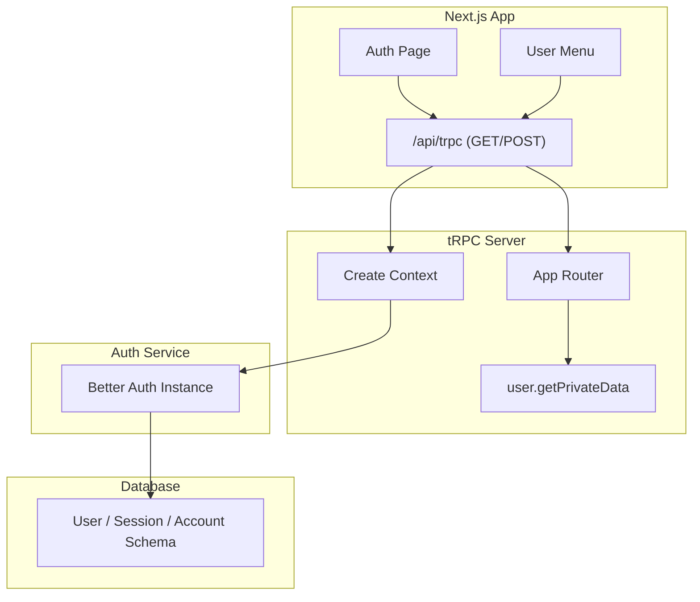
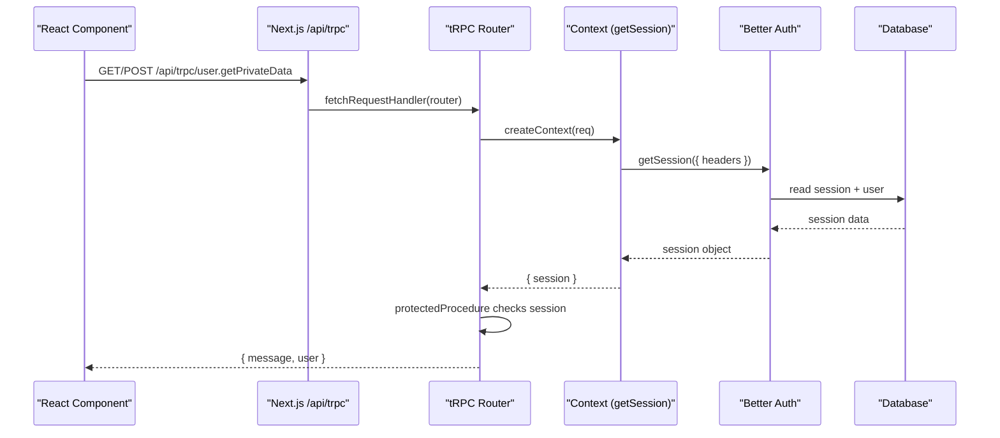
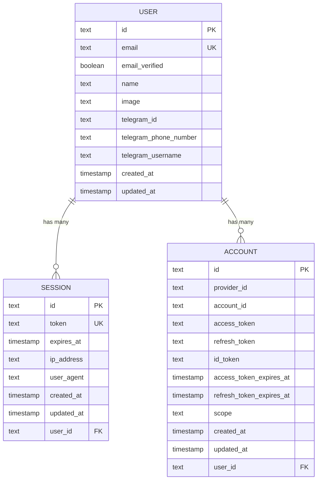
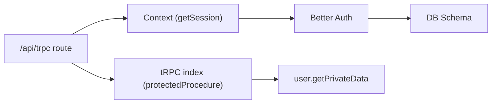

# User Management Procedures

<cite>
**Referenced Files in This Document**
- [packages/api/src/index.ts](file://packages/api/src/index.ts)
- [packages/api/src/context.ts](file://packages/api/src/context.ts)
- [packages/api/src/routers/index.ts](file://packages/api/src/routers/index.ts)
- [packages/api/src/routers/user.ts](file://packages/api/src/routers/user.ts)
- [apps/web/src/app/api/trpc/[trpc]/route.ts](file://apps/web/src/app/api/trpc/[trpc]/route.ts)
- [packages/auth/src/index.ts](file://packages/auth/src/index.ts)
- [packages/db/src/schema/auth.ts](file://packages/db/src/schema/auth.ts)
- [apps/web/src/lib/auth-client.ts](file://apps/web/src/lib/auth-client.ts)
- [apps/web/src/components/auth.tsx](file://apps/web/src/components/auth.tsx)
- [apps/web/src/components/user-menu.tsx](file://apps/web/src/components/user-menu.tsx)
</cite>

## Table of Contents

1. Introduction
2. Project Structure
3. Core Components
4. Architecture Overview
5. Detailed Component Analysis
6. Dependency Analysis
7. Performance Considerations
8. Troubleshooting Guide
9. Conclusion

## Introduction

This document provides detailed API documentation for user management procedures in the project. It covers tRPC endpoints for retrieving and updating user profiles, as well as authentication operations (sign-in, sign-out, session retrieval). For each procedure, it specifies HTTP method, URL pattern, request parameters, response schemas, and authentication requirements. It also includes error handling patterns, validation rules, and client-side implementation examples using React components.

## Project Structure

The user management system is implemented across several packages:

- Authentication setup and session handling via Better Auth
- tRPC server with protected procedures
- Next.js API route that exposes tRPC over HTTP
- Client-side hooks and UI components for authentication flows

**Diagram sources**

- [apps/web/src/app/api/trpc/[trpc]/route.ts:1-14](file://apps/web/src/app/api/trpc/[trpc]/route.ts#L1-L14)
- [packages/api/src/context.ts:1-15](file://packages/api/src/context.ts#L1-L15)
- [packages/api/src/routers/index.ts:1-10](file://packages/api/src/routers/index.ts#L1-L10)
- [packages/api/src/routers/user.ts:1-9](file://packages/api/src/routers/user.ts#L1-L9)
- [packages/auth/src/index.ts:1-43](file://packages/auth/src/index.ts#L1-L43)
- [packages/db/src/schema/auth.ts:1-101](file://packages/db/src/schema/auth.ts#L1-L101)

**Section sources**

- [apps/web/src/app/api/trpc/[trpc]/route.ts:1-14](file://apps/web/src/app/api/trpc/[trpc]/route.ts#L1-L14)
- [packages/api/src/routers/index.ts:1-10](file://packages/api/src/routers/index.ts#L1-L10)
- [packages/api/src/routers/user.ts:1-9](file://packages/api/src/routers/user.ts#L1-L9)
- [packages/auth/src/index.ts:1-43](file://packages/auth/src/index.ts#L1-L43)
- [packages/db/src/schema/auth.ts:1-101](file://packages/db/src/schema/auth.ts#L1-L101)

## Core Components

- tRPC context creation retrieves the current session from Better Auth and attaches it to the tRPC context for use in procedures.
- Protected procedures enforce authentication by checking for a valid session; otherwise, they return an UNAUTHORIZED error.
- The user router currently exposes a single protected query to retrieve private data including the authenticated user’s profile fields.
- The Next.js API route mounts the tRPC router under /api/trpc and handles both GET and POST requests.

Key responsibilities:

- Session resolution and injection into tRPC context
- Authentication enforcement for protected routes
- Exposing typed procedures for client consumption

**Section sources**

- [packages/api/src/context.ts:1-15](file://packages/api/src/context.ts#L1-L15)
- [packages/api/src/index.ts:1-25](file://packages/api/src/index.ts#L1-L25)
- [packages/api/src/routers/user.ts:1-9](file://packages/api/src/routers/user.ts#L1-L9)
- [apps/web/src/app/api/trpc/[trpc]/route.ts:1-14](file://apps/web/src/app/api/trpc/[trpc]/route.ts#L1-L14)

## Architecture Overview

The authentication and user management flow integrates Better Auth with tRPC:

**Diagram sources**

- [apps/web/src/app/api/trpc/[trpc]/route.ts:1-14](file://apps/web/src/app/api/trpc/[trpc]/route.ts#L1-L14)
- [packages/api/src/context.ts:1-15](file://packages/api/src/context.ts#L1-L15)
- [packages/api/src/index.ts:1-25](file://packages/api/src/index.ts#L1-L25)
- [packages/api/src/routers/user.ts:1-9](file://packages/api/src/routers/user.ts#L1-L9)
- [packages/auth/src/index.ts:1-43](file://packages/auth/src/index.ts#L1-L43)
- [packages/db/src/schema/auth.ts:1-101](file://packages/db/src/schema/auth.ts#L1-L101)

## Detailed Component Analysis

### tRPC Endpoints: User Procedures

- Endpoint: /api/trpc/user.getPrivateData
- HTTP Methods: GET or POST (tRPC supports both; GET used for queries)
- Authentication: Required (protectedProcedure enforces session presence)
- Request Parameters: None (query)
- Response Schema:
  - message: string
  - user: object containing at least id, email, name, image (as provided by Better Auth session)
- Error Handling:
  - UNAUTHORIZED when no session is present
  - Other tRPC errors propagated as-is

Typical usage:

- Retrieve the current user’s profile after login
- Guard access to user-specific features

**Section sources**

- [packages/api/src/routers/user.ts:1-9](file://packages/api/src/routers/user.ts#L1-L9)
- [packages/api/src/index.ts:1-25](file://packages/api/src/index.ts#L1-L25)
- [apps/web/src/app/api/trpc/[trpc]/route.ts:1-14](file://apps/web/src/app/api/trpc/[trpc]/route.ts#L1-L14)

### Authentication Operations (Client-Side)

- Sign In with Social Providers (Google, Telegram)
  - Triggered from the auth page component
  - Uses better-auth client plugins
  - Redirects to provider and back to callbackURL
- Sign Out
  - Clears session and navigates away
- Session Retrieval
  - useSession hook returns current session state and loading status

Client integration points:

- Auth client configuration with plugins
- UI components for sign-in buttons and user menu

**Section sources**

- [apps/web/src/lib/auth-client.ts:1-8](file://apps/web/src/lib/auth-client.ts#L1-L8)
- [apps/web/src/components/auth.tsx:1-69](file://apps/web/src/components/auth.tsx#L1-L69)
- [apps/web/src/components/user-menu.tsx:1-62](file://apps/web/src/components/user-menu.tsx#L1-L62)

### Data Models and Relationships

- User table includes identity fields and optional social identifiers
- Session table stores active sessions linked to users
- Account table stores OAuth account metadata linked to users

**Diagram sources**

- [packages/db/src/schema/auth.ts:1-101](file://packages/db/src/schema/auth.ts#L1-L101)

## Dependency Analysis

- The tRPC router depends on the protected procedure middleware to enforce authentication.
- The tRPC context depends on Better Auth to resolve sessions from incoming requests.
- The Next.js API route wires the tRPC router and context to HTTP handlers.
- The database schema defines the underlying storage for users, sessions, and accounts.

**Diagram sources**

- [apps/web/src/app/api/trpc/[trpc]/route.ts:1-14](file://apps/web/src/app/api/trpc/[trpc]/route.ts#L1-L14)
- [packages/api/src/index.ts:1-25](file://packages/api/src/index.ts#L1-L25)
- [packages/api/src/context.ts:1-15](file://packages/api/src/context.ts#L1-L15)
- [packages/api/src/routers/user.ts:1-9](file://packages/api/src/routers/user.ts#L1-L9)
- [packages/auth/src/index.ts:1-43](file://packages/auth/src/index.ts#L1-L43)
- [packages/db/src/schema/auth.ts:1-101](file://packages/db/src/schema/auth.ts#L1-L101)

**Section sources**

- [packages/api/src/index.ts:1-25](file://packages/api/src/index.ts#L1-L25)
- [packages/api/src/context.ts:1-15](file://packages/api/src/context.ts#L1-L15)
- [packages/api/src/routers/user.ts:1-9](file://packages/api/src/routers/user.ts#L1-L9)
- [apps/web/src/app/api/trpc/[trpc]/route.ts:1-14](file://apps/web/src/app/api/trpc/[trpc]/route.ts#L1-L14)
- [packages/auth/src/index.ts:1-43](file://packages/auth/src/index.ts#L1-L43)
- [packages/db/src/schema/auth.ts:1-101](file://packages/db/src/schema/auth.ts#L1-L101)

## Performance Considerations

- Use GET for read-only queries to leverage caching and browser optimizations.
- Keep protected procedures lightweight; avoid heavy computations inside them.
- Ensure database indexes exist for frequently queried fields (e.g., session.user_id).
- Prefer client-side session hooks to minimize redundant network calls.

[No sources needed since this section provides general guidance]

## Troubleshooting Guide

Common issues and resolutions:

- UNAUTHORIZED errors on protected endpoints:
  - Verify that the request includes valid cookies/headers for Better Auth session retrieval.
  - Confirm that the session exists and has not expired.
- Session not available in context:
  - Check that the tRPC context correctly passes headers to Better Auth’s getSession.
- Client-side session state inconsistencies:
  - Ensure the auth client is configured with required plugins and that components use useSession for reactive updates.

Error handling patterns:

- tRPC protectedProcedure throws UNAUTHORIZED when ctx.session is missing.
- Better Auth manages session lifecycle and cookie handling; inspect logs if sessions are unexpectedly cleared.

**Section sources**

- [packages/api/src/index.ts:11-25](file://packages/api/src/index.ts#L11-L25)
- [packages/api/src/context.ts:1-15](file://packages/api/src/context.ts#L1-L15)
- [apps/web/src/components/user-menu.tsx:1-62](file://apps/web/src/components/user-menu.tsx#L1-L62)

## Conclusion

The user management system combines Better Auth for authentication and tRPC for type-safe APIs. Currently, a protected endpoint retrieves the authenticated user’s profile. Authentication flows are handled client-side via the Better Auth client, with UI components for sign-in and sign-out. To extend functionality, add new protected procedures for updating user profiles and other user-related operations, following the established patterns for context, protection, and error handling.

[No sources needed since this section summarizes without analyzing specific files]
