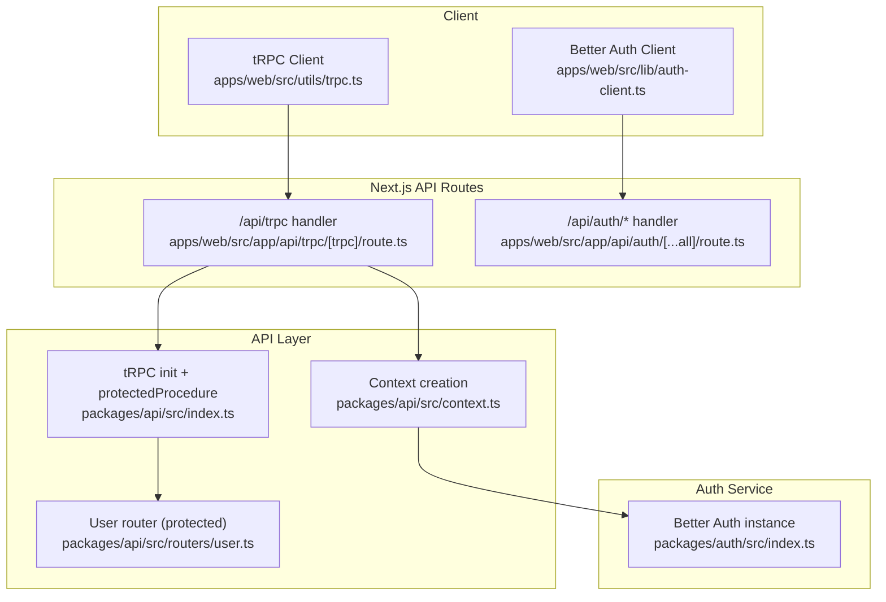
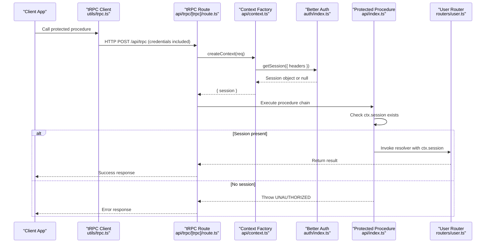
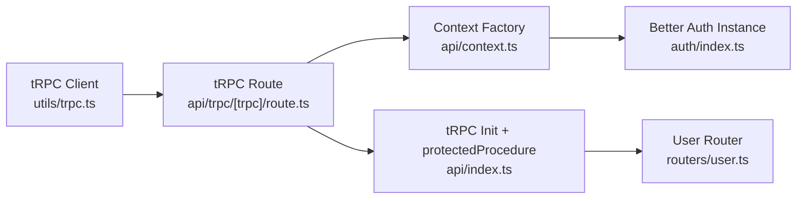

# Authentication and Authorization

<cite>
**Referenced Files in This Document**
- [index.ts](file://packages/api/src/index.ts)
- [context.ts](file://packages/api/src/context.ts)
- [route.ts](file://apps/web/src/app/api/trpc/[trpc]/route.ts)
- [route.ts](file://apps/web/src/app/api/auth/[...all]/route.ts)
- [index.ts](file://packages/auth/src/index.ts)
- [user.ts](file://packages/api/src/routers/user.ts)
- [trpc.ts](file://apps/web/src/utils/trpc.ts)
- [auth-client.ts](file://apps/web/src/lib/auth-client.ts)
</cite>

## Table of Contents

1. Introduction
2. Project Structure
3. Core Components
4. Architecture Overview
5. Detailed Component Analysis
6. Dependency Analysis
7. Performance Considerations
8. Troubleshooting Guide
9. Conclusion

## Introduction

This document explains how authentication and authorization are implemented in the API layer using Better Auth and tRPC. It covers session management, user context injection, the protectedProcedure implementation that enforces authentication checks, the end-to-end flow from client to server (including token validation and session handling), examples of accessing authenticated user data, implementing role-based access control, and handling unauthorized requests. Security considerations and best practices for protecting sensitive endpoints are also included.

## Project Structure

The authentication and authorization mechanisms span several layers:

- Client-side: a tRPC client configured to send credentials with requests and a Better Auth client for sign-in/sign-out flows.
- API routes: Next.js handlers for tRPC and Better Auth endpoints.
- tRPC core: shared initialization, context creation, and procedure definitions including protectedProcedure.
- Router modules: feature routers that use public or protected procedures.

**Diagram sources**

- [trpc.ts:22-34](file://apps/web/src/utils/trpc.ts#L22-L34)
- [auth-client.ts:5-7](file://apps/web/src/lib/auth-client.ts#L5-L7)
- [route.ts:6-13](file://apps/web/src/app/api/trpc/[trpc]/route.ts#L6-L13)
- [route.ts:1-4](file://apps/web/src/app/api/auth/[...all]/route.ts#L1-L4)
- [index.ts:5-25](file://packages/api/src/index.ts#L5-L25)
- [context.ts:4-12](file://packages/api/src/context.ts#L4-L12)
- [index.ts:10-42](file://packages/auth/src/index.ts#L10-L42)
- [user.ts:3-8](file://packages/api/src/routers/user.ts#L3-L8)

**Section sources**

- [route.ts:6-13](file://apps/web/src/app/api/trpc/[trpc]/route.ts#L6-L13)
- [route.ts:1-4](file://apps/web/src/app/api/auth/[...all]/route.ts#L1-L4)
- [index.ts:5-25](file://packages/api/src/index.ts#L5-L25)
- [context.ts:4-12](file://packages/api/src/context.ts#L4-L12)
- [index.ts:10-42](file://packages/auth/src/index.ts#L10-L42)
- [user.ts:3-8](file://packages/api/src/routers/user.ts#L3-L8)
- [trpc.ts:22-34](file://apps/web/src/utils/trpc.ts#L22-L34)
- [auth-client.ts:5-7](file://apps/web/src/lib/auth-client.ts#L5-L7)

## Core Components

- tRPC initialization and protectedProcedure: centralizes authentication enforcement by checking for a valid session in the context before executing any protected procedure.
- Context creation: resolves the current session from Better Auth using request headers and attaches it to the tRPC context.
- Better Auth configuration: sets up database adapter, plugins (including nextCookies), social providers, and trusted origins.
- tRPC route handler: wires the app router and context factory into the fetch adapter.
- Client configuration: ensures cookies are sent with tRPC calls and provides Better Auth client methods for sign-in/out.

Key responsibilities:

- Enforce authentication at the procedure boundary via protectedProcedure.
- Provide typed, consistent session access in all procedures through ctx.session.
- Centralize auth setup and routing so clients only interact with stable endpoints.

**Section sources**

- [index.ts:5-25](file://packages/api/src/index.ts#L5-L25)
- [context.ts:4-12](file://packages/api/src/context.ts#L4-L12)
- [index.ts:10-42](file://packages/auth/src/index.ts#L10-L42)
- [route.ts:6-13](file://apps/web/src/app/api/trpc/[trpc]/route.ts#L6-L13)
- [trpc.ts:22-34](file://apps/web/src/utils/trpc.ts#L22-L34)

## Architecture Overview

The authentication flow integrates Better Auth’s session mechanism with tRPC’s middleware-like procedure chain. The client includes credentials so cookies are persisted and sent automatically. On each tRPC call, the server reconstructs the session and injects it into the context. Protected procedures then validate the presence of a session and proceed with business logic.

**Diagram sources**

- [trpc.ts:22-34](file://apps/web/src/utils/trpc.ts#L22-L34)
- [route.ts:6-13](file://apps/web/src/app/api/trpc/[trpc]/route.ts#L6-L13)
- [context.ts:4-12](file://packages/api/src/context.ts#L4-L12)
- [index.ts:11-25](file://packages/api/src/index.ts#L11-L25)
- [user.ts:3-8](file://packages/api/src/routers/user.ts#L3-L8)
- [index.ts:10-42](file://packages/auth/src/index.ts#L10-L42)

## Detailed Component Analysis

### tRPC Context and Session Injection

- The context factory extracts the current session from Better Auth using the incoming request headers.
- The resulting session is attached to the tRPC context, making it available to all procedures.
- This approach ensures that session resolution happens once per request and is reused across the procedure chain.

Security notes:

- Always pass the full request headers to Better Auth’s getSession to ensure cookie-based sessions resolve correctly.
- Avoid leaking sensitive headers or tokens beyond what is necessary.

**Section sources**

- [context.ts:4-12](file://packages/api/src/context.ts#L4-L12)

### protectedProcedure Implementation

- A reusable tRPC middleware that validates the presence of a session in the context.
- If no session is found, it throws a standardized UNAUTHORIZED error with a clear message.
- If a session exists, it proceeds to the next step in the chain, preserving the session in the context.

Usage pattern:

- Wrap any procedure that requires authentication with protectedProcedure.
- Access the authenticated user via ctx.session.user inside the resolver.

Error behavior:

- Unauthorized responses are returned consistently to clients, enabling uniform error handling on the frontend.

**Section sources**

- [index.ts:11-25](file://packages/api/src/index.ts#L11-L25)

### tRPC Route Handler

- Binds the application router and context factory to the fetch adapter.
- Exposes GET and POST handlers for the /api/trpc endpoint.
- Ensures that each request goes through createContext, which resolves the session.

Integration points:

- Works seamlessly with Better Auth because the same request headers are forwarded to session resolution.
- Compatible with client configurations that include credentials.

**Section sources**

- [route.ts:6-13](file://apps/web/src/app/api/trpc/[trpc]/route.ts#L6-L13)

### Better Auth Configuration

- Initializes Better Auth with a Drizzle adapter, email/password support, Telegram plugin, last login method tracking, and nextCookies integration.
- Configures social providers and trusted origins.
- Uses environment variables for secrets and provider credentials.

Security considerations:

- Ensure BETTER_AUTH_SECRET is set and rotated periodically.
- Configure CORS and trusted origins to restrict where cookies can be sent.
- Keep provider credentials secure and rotate them regularly.

**Section sources**

- [index.ts:10-42](file://packages/auth/src/index.ts#L10-L42)

### Client-Side Integration

- tRPC client is configured with httpBatchLink and credentials: "include" to persist and send cookies automatically.
- Better Auth client is created with plugins for Telegram and last login method tracking.

Operational notes:

- Credentials must be enabled on the client to maintain sessions across requests.
- Use the Better Auth client for sign-in/sign-out flows; tRPC calls will then carry the session cookies.

**Section sources**

- [trpc.ts:22-34](file://apps/web/src/utils/trpc.ts#L22-L34)
- [auth-client.ts:5-7](file://apps/web/src/lib/auth-client.ts#L5-L7)

### Example: Accessing Authenticated User Data

- A protected procedure demonstrates reading ctx.session.user and returning it alongside a message.
- This pattern should be used for any endpoint that needs to operate on behalf of the authenticated user.

Implementation reference:

- See the user router’s protected query that returns user data.

**Section sources**

- [user.ts:3-8](file://packages/api/src/routers/user.ts#L3-L8)

### Role-Based Access Control (RBAC)

- Extend protectedProcedure to enforce roles by inspecting ctx.session.user.role (or equivalent).
- Throw an appropriate error when the user lacks required permissions.
- Keep role checks close to the procedure boundary to minimize risk.

Suggested approach:

- Create a higher-order middleware or extend protectedProcedure to accept a role requirement and validate it before proceeding.
- Centralize role constants and policies to avoid duplication.

[No sources needed since this section proposes patterns not directly implemented in the referenced files]

### Handling Unauthorized Requests

- When a protected procedure detects a missing or invalid session, it returns a standardized UNAUTHORIZED error.
- Clients should handle this error by redirecting to login or prompting re-authentication.

Client-side handling:

- Use the tRPC client’s error hooks to detect UNAUTHORIZED and trigger sign-in flows.
- Show user-friendly messages and provide retry options after successful authentication.

**Section sources**

- [index.ts:11-25](file://packages/api/src/index.ts#L11-L25)

## Dependency Analysis

The following diagram shows how components depend on each other during authentication and authorization:

**Diagram sources**

- [trpc.ts:22-34](file://apps/web/src/utils/trpc.ts#L22-L34)
- [route.ts:6-13](file://apps/web/src/app/api/trpc/[trpc]/route.ts#L6-L13)
- [context.ts:4-12](file://packages/api/src/context.ts#L4-L12)
- [index.ts:5-25](file://packages/api/src/index.ts#L5-L25)
- [user.ts:3-8](file://packages/api/src/routers/user.ts#L3-L8)
- [index.ts:10-42](file://packages/auth/src/index.ts#L10-L42)

**Section sources**

- [trpc.ts:22-34](file://apps/web/src/utils/trpc.ts#L22-L34)
- [route.ts:6-13](file://apps/web/src/app/api/trpc/[trpc]/route.ts#L6-L13)
- [context.ts:4-12](file://packages/api/src/context.ts#L4-L12)
- [index.ts:5-25](file://packages/api/src/index.ts#L5-L25)
- [user.ts:3-8](file://packages/api/src/routers/user.ts#L3-L8)
- [index.ts:10-42](file://packages/auth/src/index.ts#L10-L42)

## Performance Considerations

- Session resolution occurs once per request in the context factory; avoid redundant session lookups in resolvers.
- Batch tRPC requests to reduce network overhead while maintaining security boundaries.
- Cache non-sensitive derived data within procedures if appropriate, but never cache session state.
- Keep Better Auth plugins minimal and only enable features you need to reduce startup cost.

[No sources needed since this section provides general guidance]

## Troubleshooting Guide

Common issues and resolutions:

- Missing session in protected procedures:
  - Verify that the client sends credentials with requests.
  - Ensure cookies are not blocked by browser settings or CORS misconfiguration.
  - Confirm that Better Auth’s nextCookies plugin is enabled and baseURL is correct.
- Unauthorized errors on protected endpoints:
  - Check that the session is valid and not expired.
  - Validate that the request headers include the session cookie.
  - Review the protectedProcedure error handling to ensure consistent responses.
- Social login or Telegram plugin issues:
  - Confirm environment variables for provider credentials are set.
  - Ensure trustedOrigins includes your frontend domain.

**Section sources**

- [index.ts:11-25](file://packages/api/src/index.ts#L11-L25)
- [trpc.ts:22-34](file://apps/web/src/utils/trpc.ts#L22-L34)
- [index.ts:10-42](file://packages/auth/src/index.ts#L10-L42)

## Conclusion

This system uses Better Auth to manage sessions and tRPC to enforce authentication at the procedure boundary via protectedProcedure. The context factory centralizes session resolution, ensuring consistent and secure access to user data across all protected endpoints. By configuring the client to include credentials and standardizing unauthorized error handling, the application maintains a robust and developer-friendly authentication and authorization model. For additional security, implement role-based checks in protected procedures, keep secrets and provider credentials secure, and review CORS and trusted origins carefully.

[No sources needed since this section summarizes without analyzing specific files]
