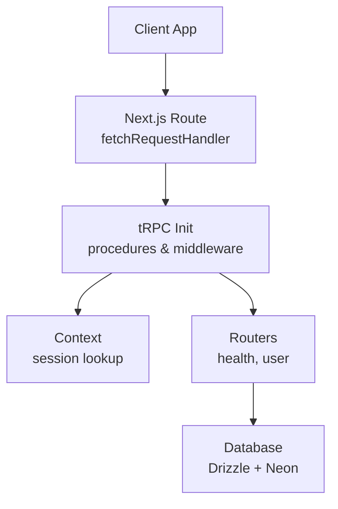
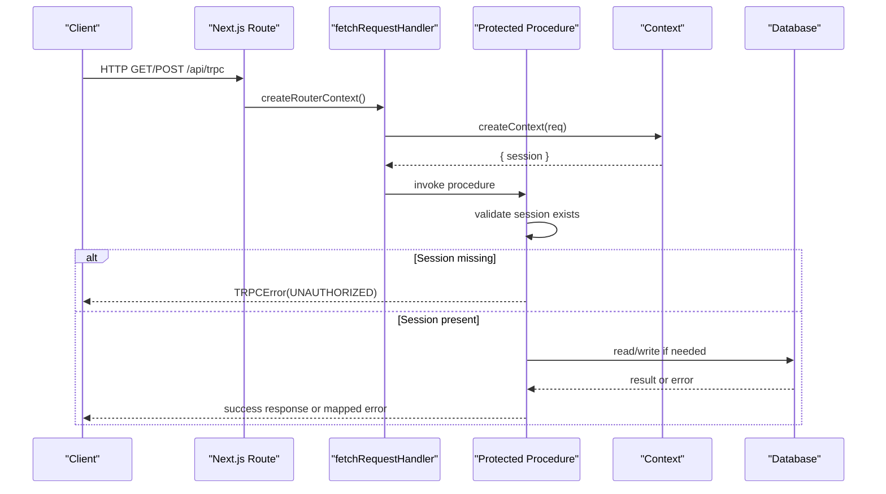
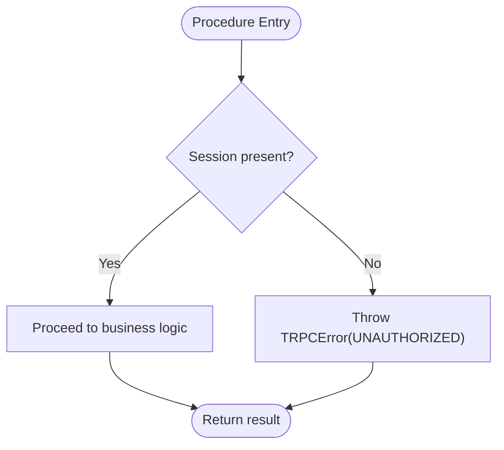
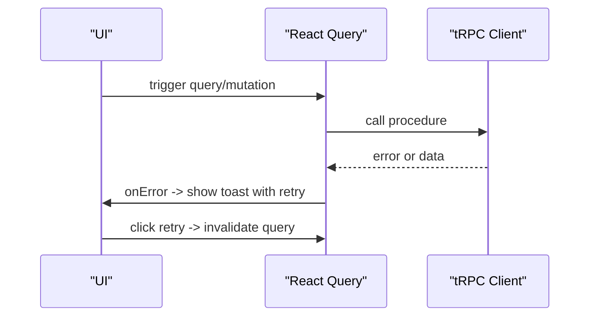
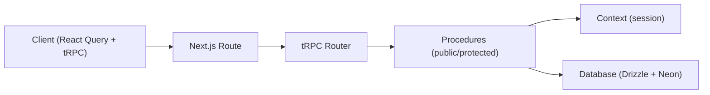

# Error Handling and Validation

<cite>
**Referenced Files in This Document**
- [route.ts](file://apps/web/src/app/api/trpc/[trpc]/route.ts)
- [index.ts](file://packages/api/src/index.ts)
- [context.ts](file://packages/api/src/context.ts)
- [index.ts](file://packages/api/src/routers/index.ts)
- [health.ts](file://packages/api/src/routers/health.ts)
- [user.ts](file://packages/api/src/routers/user.ts)
- [trpc.ts](file://apps/web/src/utils/trpc.ts)
- [index.ts](file://packages/db/src/index.ts)
</cite>

## Table of Contents

1. Introduction
2. Project Structure
3. Core Components
4. Architecture Overview
5. Detailed Component Analysis
6. Dependency Analysis
7. Performance Considerations
8. Troubleshooting Guide
9. Conclusion
10. Appendices

## Introduction

This document explains how the API layer handles errors and validates inputs using tRPC, Zod, and custom error strategies. It covers:

- Request validation with Zod schemas
- Custom error types and consistent error responses via TRPCError
- Authentication and authorization checks
- Client-side error handling and retry patterns
- Database error handling and safe error messaging
- Logging, monitoring, debugging, security considerations, and rate limiting guidance

## Project Structure

The API is implemented as a tRPC server mounted on a Next.js route. The core modules include:

- tRPC initialization and procedure definitions (public vs protected)
- Context creation for session resolution
- Routers for health and user endpoints
- Next.js route handler that wires context and router to fetchRequestHandler
- Client configuration for React Query integration and error handling

**Diagram sources**

- [route.ts:6-13](file://apps/web/src/app/api/trpc/[trpc]/route.ts#L6-L13)
- [index.ts:1-25](file://packages/api/src/index.ts#L1-L25)
- [context.ts:4-12](file://packages/api/src/context.ts#L4-L12)
- [index.ts:1-11](file://packages/api/src/routers/index.ts#L1-L11)
- [index.ts:7-12](file://packages/db/src/index.ts#L7-L12)

**Section sources**

- [route.ts:1-13](file://apps/web/src/app/api/trpc/[trpc]/route.ts#L1-L13)
- [index.ts:1-25](file://packages/api/src/index.ts#L1-L25)
- [context.ts:1-15](file://packages/api/src/context.ts#L1-L15)
- [index.ts:1-11](file://packages/api/src/routers/index.ts#L1-L11)
- [health.ts:1-6](file://packages/api/src/routers/health.ts#L1-L6)
- [user.ts:1-9](file://packages/api/src/routers/user.ts#L1-L9)
- [index.ts:7-12](file://packages/db/src/index.ts#L7-L12)

## Core Components

- tRPC initialization and procedures:
  - Public procedures accept unauthenticated requests.
  - Protected procedures enforce authentication by checking the session in context; missing sessions throw a standardized UNAUTHORIZED error.
- Context:
  - Resolves the current session from request headers using the auth library.
- Routers:
  - Health check endpoint returns a simple status string.
  - User endpoints demonstrate protected access and returning authenticated data.
- Next.js route:
  - Wires the tRPC router and context into fetchRequestHandler for GET/POST.

Key responsibilities:

- Centralized error categorization via TRPCError codes.
- Consistent client error shape across all procedures.
- Clear separation between input validation (Zod) and authorization (session checks).

**Section sources**

- [index.ts:1-25](file://packages/api/src/index.ts#L1-L25)
- [context.ts:4-12](file://packages/api/src/context.ts#L4-L12)
- [health.ts:1-6](file://packages/api/src/routers/health.ts#L1-L6)
- [user.ts:1-9](file://packages/api/src/routers/user.ts#L1-L9)
- [route.ts:6-13](file://apps/web/src/app/api/trpc/[trpc]/route.ts#L6-L13)

## Architecture Overview

End-to-end flow for a protected query:

**Diagram sources**

- [route.ts:6-13](file://apps/web/src/app/api/trpc/[trpc]/route.ts#L6-L13)
- [index.ts:11-25](file://packages/api/src/index.ts#L11-L25)
- [context.ts:4-12](file://packages/api/src/context.ts#L4-L12)
- [index.ts:7-12](file://packages/db/src/index.ts#L7-L12)

## Detailed Component Analysis

### tRPC Procedures and Middleware

- Public procedures:
  - Accept any input; add Zod validation at the procedure level when needed.
- Protected procedures:
  - Enforce authentication by verifying ctx.session.
  - Throw a standardized TRPCError with code UNAUTHORIZED when unauthorized.
- Benefits:
  - Centralized authorization logic reduces duplication.
  - Consistent error shape improves client handling.

**Diagram sources**

- [index.ts:11-25](file://packages/api/src/index.ts#L11-L25)

**Section sources**

- [index.ts:1-25](file://packages/api/src/index.ts#L1-L25)

### Context and Session Resolution

- Context resolves the session from request headers using the auth library.
- If no session is found, protected procedures will fail with UNAUTHORIZED.
- Extensibility: additional per-request data (e.g., user roles, tenant id) can be added here.

**Section sources**

- [context.ts:4-12](file://packages/api/src/context.ts#L4-L12)

### Routers: Health and User

- Health router:
  - Simple health check returning a status string.
- User router:
  - Demonstrates protected access and returning authenticated user data.

**Section sources**

- [health.ts:1-6](file://packages/api/src/routers/health.ts#L1-L6)
- [user.ts:1-9](file://packages/api/src/routers/user.ts#L1-L9)

### Next.js Route Handler

- Mounts tRPC at /api/trpc using fetchRequestHandler.
- Provides a factory to build context per request.
- Exposes both GET and POST handlers.

**Section sources**

- [route.ts:1-13](file://apps/web/src/app/api/trpc/[trpc]/route.ts#L1-L13)

### Client-Side Error Handling and Retry

- React Query client integrates with tRPC via httpBatchLink.
- Global onError shows a toast with the error message and provides a “retry” action that invalidates the query.
- Credentials are included to support session-based auth.

**Diagram sources**

- [trpc.ts:7-19](file://apps/web/src/utils/trpc.ts#L7-L19)
- [trpc.ts:22-39](file://apps/web/src/utils/trpc.ts#L22-L39)

**Section sources**

- [trpc.ts:7-19](file://apps/web/src/utils/trpc.ts#L7-L19)
- [trpc.ts:22-39](file://apps/web/src/utils/trpc.ts#L22-L39)

### Input Validation with Zod

- Use Zod schemas to validate inputs at the edge of each procedure.
- Recommended pattern:
  - Define a schema per procedure input.
  - Parse and transform input inside the procedure resolver.
  - On parse failure, throw a TRPCError with code BAD_REQUEST and a clear message.
- Example categories:
  - Required fields, format constraints (email, UUID), numeric ranges, enums.
  - Nested objects and arrays for complex payloads.
- Benefits:
  - Strongly typed contracts between client and server.
  - Early failure with precise error messages.

[No sources needed since this section provides general guidance]

### Database Error Handling

- Database client is created via Drizzle with Neon.
- When database operations fail:
  - Catch specific error types where possible.
  - Map to domain-friendly TRPCError codes (e.g., CONFLICT, INTERNAL_SERVER_ERROR).
  - Avoid leaking internal details to clients; log full stack server-side.
- Best practices:
  - Wrap transactions to ensure consistency.
  - Use retries only for transient network/database errors.

**Section sources**

- [index.ts:7-12](file://packages/db/src/index.ts#L7-L12)

### Retry Logic Guidelines

- Identify retryable errors:
  - Network timeouts, temporary service unavailability, database connection issues.
- Implement exponential backoff with jitter.
- Do not retry idempotent-only reads unless necessary; avoid re-executing mutations unless they are idempotent.
- Respect upstream signals (e.g., 429 Too Many Requests) and do not retry aggressively.

[No sources needed since this section provides general guidance]

### Error Categorization and Response Shape

- Use TRPCError codes consistently:
  - UNAUTHORIZED for missing or invalid session.
  - FORBIDDEN for insufficient permissions.
  - BAD_REQUEST for validation failures.
  - NOT_FOUND for missing resources.
  - CONFLICT for duplicate entries.
  - INTERNAL_SERVER_ERROR for unexpected server errors.
- Keep messages user-friendly; never expose stack traces or secrets.

**Section sources**

- [index.ts:11-25](file://packages/api/src/index.ts#L11-L25)

### Security Considerations for Error Messages

- Never log or return sensitive data (tokens, passwords, PII).
- Sanitize error messages before sending to clients.
- Log detailed diagnostics server-side only.
- Validate and sanitize all inputs to prevent injection.

[No sources needed since this section provides general guidance]

### Rate Limiting Strategies

- Apply rate limiting at the API boundary:
  - Per IP or per-user basis.
  - Configurable windows and limits.
- Combine with caching for read-heavy endpoints.
- Return appropriate status codes (e.g., 429) and messages.

[No sources needed since this section provides general guidance]

## Dependency Analysis

High-level dependencies among components:

**Diagram sources**

- [route.ts:6-13](file://apps/web/src/app/api/trpc/[trpc]/route.ts#L6-L13)
- [index.ts:1-25](file://packages/api/src/index.ts#L1-L25)
- [context.ts:4-12](file://packages/api/src/context.ts#L4-L12)
- [index.ts:7-12](file://packages/db/src/index.ts#L7-L12)
- [trpc.ts:22-39](file://apps/web/src/utils/trpc.ts#L22-L39)

**Section sources**

- [route.ts:1-13](file://apps/web/src/app/api/trpc/[trpc]/route.ts#L1-L13)
- [index.ts:1-25](file://packages/api/src/index.ts#L1-L25)
- [context.ts:1-15](file://packages/api/src/context.ts#L1-L15)
- [index.ts:7-12](file://packages/db/src/index.ts#L7-L12)
- [trpc.ts:22-39](file://apps/web/src/utils/trpc.ts#L22-L39)

## Performance Considerations

- Batch requests using httpBatchLink to reduce latency.
- Cache queries with React Query; set appropriate stale times and refetch policies.
- Minimize payload sizes; validate early to avoid unnecessary processing.
- Use connection pooling for databases; avoid long-running transactions.

[No sources needed since this section provides general guidance]

## Troubleshooting Guide

Common issues and resolutions:

- Unauthorized errors:
  - Ensure cookies/credentials are sent with requests.
  - Verify session existence in context.
- Validation errors:
  - Check Zod schemas for required fields and formats.
  - Inspect client-provided payloads against expected shapes.
- Database errors:
  - Review logs for connection or query failures.
  - Map known error codes to user-friendly messages.
- Client-side retries:
  - Use the built-in retry action to re-fetch failed queries.
  - Investigate root cause before enabling aggressive retries.

**Section sources**

- [index.ts:11-25](file://packages/api/src/index.ts#L11-L25)
- [trpc.ts:7-19](file://apps/web/src/utils/trpc.ts#L7-L19)

## Conclusion

The API layer uses tRPC procedures with centralized authentication checks and TRPCError for consistent error handling. Input validation should be enforced with Zod at each procedure boundary. Client-side error handling leverages React Query to surface errors and provide retry actions. For robustness, implement careful database error mapping, safe logging, and consider rate limiting and caching to improve reliability and performance.

## Appendices

### Example Patterns (Guidelines)

- Validating complex inputs:
  - Define nested Zod schemas for objects and arrays.
  - Use .refine for cross-field validation.
  - Throw BAD_REQUEST with field-specific messages.
- Handling database errors:
  - Catch and map to domain errors.
  - Preserve transactional integrity.
- Implementing retry logic:
  - Use exponential backoff with jitter.
  - Limit retries for non-idempotent operations.

[No sources needed since this section provides general guidance]
