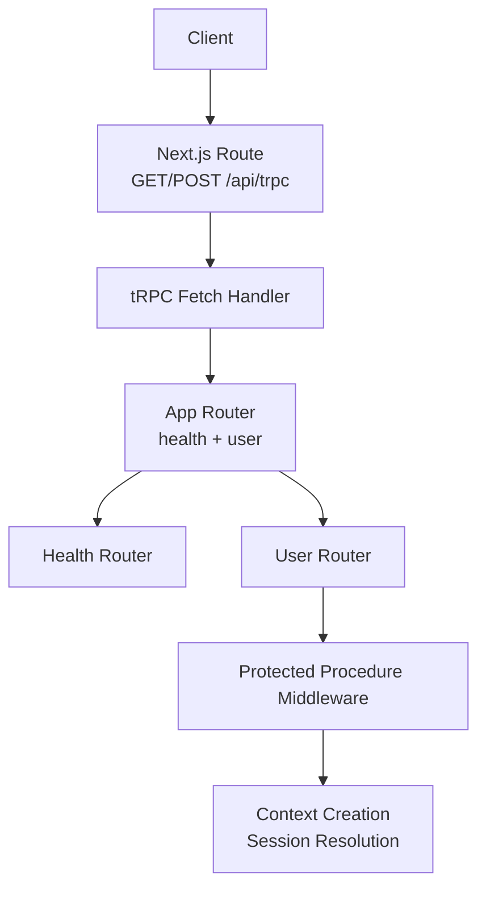
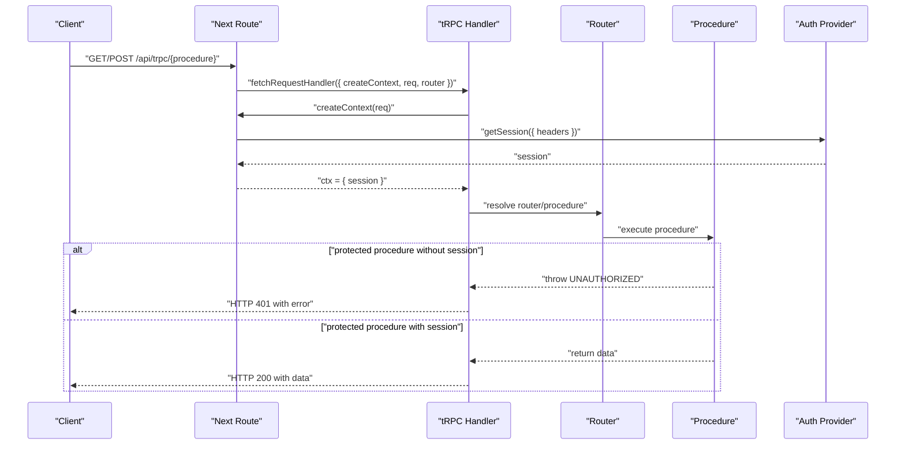
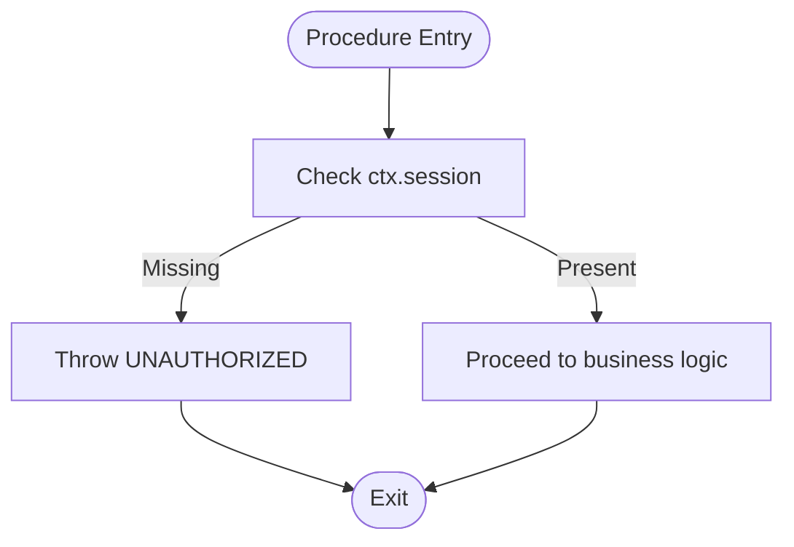
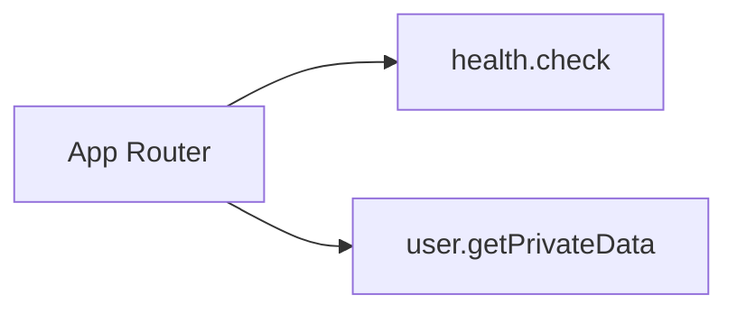
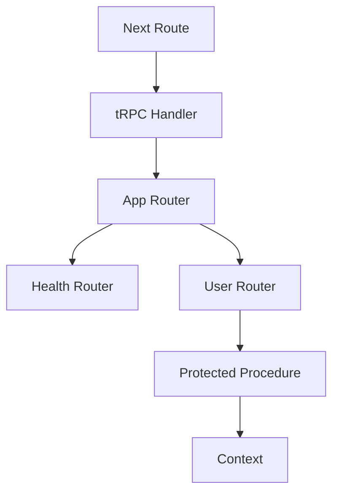

# Testing Strategies

<cite>
**Referenced Files in This Document**
- [route.ts](file://apps/web/src/app/api/trpc/[trpc]/route.ts)
- [index.ts](file://packages/api/src/index.ts)
- [context.ts](file://packages/api/src/context.ts)
- [index.ts](file://packages/api/src/routers/index.ts)
- [health.ts](file://packages/api/src/routers/health.ts)
- [user.ts](file://packages/api/src/routers/user.ts)
- [package.json](file://packages/api/package.json)
- [package.json](file://apps/web/package.json)
</cite>

## Table of Contents

1. Introduction
2. Project Structure
3. Core Components
4. Architecture Overview
5. Detailed Component Analysis
6. Dependency Analysis
7. Performance Considerations
8. Troubleshooting Guide
9. Conclusion

## Introduction

This document provides comprehensive testing strategies for the API layer, focusing on tRPC procedures, authentication flows, error scenarios, and schema validation. It covers unit tests, integration tests, and end-to-end (E2E) approaches, along with guidance on mocking external dependencies, organizing test files, performance testing, coverage requirements, continuous integration, and debugging failed tests.

## Project Structure

The API is implemented using tRPC with a Next.js adapter. The key pieces are:

- A Next.js route that handles GET/POST requests and delegates to tRPC’s fetch handler.
- A shared tRPC initialization exposing public and protected procedures.
- Context creation that resolves the session from the auth provider.
- Routers for health checks and user-related operations.



**Diagram sources**

- [route.ts:1-14](file://apps/web/src/app/api/trpc/[trpc]/route.ts#L1-L14)
- [index.ts:1-26](file://packages/api/src/index.ts#L1-L26)
- [context.ts:1-15](file://packages/api/src/context.ts#L1-L15)
- [index.ts:1-11](file://packages/api/src/routers/index.ts#L1-L11)
- [health.ts:1-6](file://packages/api/src/routers/health.ts#L1-L6)
- [user.ts:1-9](file://packages/api/src/routers/user.ts#L1-L9)

**Section sources**

- [route.ts:1-14](file://apps/web/src/app/api/trpc/[trpc]/route.ts#L1-L14)
- [index.ts:1-26](file://packages/api/src/index.ts#L1-L26)
- [context.ts:1-15](file://packages/api/src/context.ts#L1-L15)
- [index.ts:1-11](file://packages/api/src/routers/index.ts#L1-L11)
- [health.ts:1-6](file://packages/api/src/routers/health.ts#L1-L6)
- [user.ts:1-9](file://packages/api/src/routers/user.ts#L1-L9)

## Core Components

- tRPC setup and procedure types:
  - Public procedures for unauthenticated endpoints.
  - Protected procedures that enforce session presence and throw an unauthorized error when missing.
- Context:
  - Resolves the current session from the auth provider using request headers.
- Routers:
  - Health router exposes a simple check endpoint.
  - User router exposes a protected query returning private data and user info.

Testing implications:

- Unit tests should call procedures directly with a mocked context to isolate logic.
- Integration tests should exercise the Next.js route and tRPC handler with realistic requests.
- E2E tests should hit the deployed or local server to validate full flows including authentication.

**Section sources**

- [index.ts:1-26](file://packages/api/src/index.ts#L1-L26)
- [context.ts:1-15](file://packages/api/src/context.ts#L1-L15)
- [health.ts:1-6](file://packages/api/src/routers/health.ts#L1-L6)
- [user.ts:1-9](file://packages/api/src/routers/user.ts#L1-L9)

## Architecture Overview

The request lifecycle for tRPC in this project:

1. The client sends a GET/POST to /api/trpc.
2. The Next.js route constructs a tRPC context by calling the context factory with the incoming request.
3. The tRPC fetch handler routes the call to the appropriate router/procedure.
4. Protected procedures validate the session; if absent, they raise an unauthorized error.
5. Procedures return typed responses validated by Zod schemas (if used in routers).



**Diagram sources**

- [route.ts:1-14](file://apps/web/src/app/api/trpc/[trpc]/route.ts#L1-L14)
- [context.ts:1-15](file://packages/api/src/context.ts#L1-L15)
- [index.ts:1-26](file://packages/api/src/index.ts#L1-L26)

## Detailed Component Analysis

### tRPC Initialization and Procedures

- Public vs protected procedures:
  - Public procedures can be called without authentication.
  - Protected procedures enforce session presence and throw a standardized unauthorized error when missing.
- Implications for testing:
  - For public procedures, verify successful responses and input/output validation.
  - For protected procedures, test both authenticated and unauthenticated paths.



**Diagram sources**

- [index.ts:11-25](file://packages/api/src/index.ts#L11-L25)

**Section sources**

- [index.ts:1-26](file://packages/api/src/index.ts#L1-L26)

### Context and Authentication

- Context creation calls the auth provider to resolve the session from request headers.
- Tests must provide a valid session for protected procedures or simulate its absence to trigger authorization errors.

```mermaid
classDiagram
class ContextFactory {
+createContext(req) Context
}
class AuthProvider {
+getSession({ headers }) Session
}
ContextFactory --> AuthProvider : "uses"
```

**Diagram sources**

- [context.ts:1-15](file://packages/api/src/context.ts#L1-L15)

**Section sources**

- [context.ts:1-15](file://packages/api/src/context.ts#L1-L15)

### Routers and Endpoints

- Health router:
  - Exposes a public query returning a simple status string.
- User router:
  - Exposes a protected query returning private data and user information from the session.



**Diagram sources**

- [index.ts:1-11](file://packages/api/src/routers/index.ts#L1-L11)
- [health.ts:1-6](file://packages/api/src/routers/health.ts#L1-L6)
- [user.ts:1-9](file://packages/api/src/routers/user.ts#L1-L9)

**Section sources**

- [index.ts:1-11](file://packages/api/src/routers/index.ts#L1-L11)
- [health.ts:1-6](file://packages/api/src/routers/health.ts#L1-L6)
- [user.ts:1-9](file://packages/api/src/routers/user.ts#L1-L9)

## Dependency Analysis

- The Next.js route depends on:
  - The tRPC fetch handler.
  - The app router and context factory.
- The app router composes health and user routers.
- The user router depends on protected procedures and context session.



**Diagram sources**

- [route.ts:1-14](file://apps/web/src/app/api/trpc/[trpc]/route.ts#L1-L14)
- [index.ts:1-26](file://packages/api/src/index.ts#L1-L26)
- [index.ts:1-11](file://packages/api/src/routers/index.ts#L1-L11)
- [context.ts:1-15](file://packages/api/src/context.ts#L1-L15)

**Section sources**

- [route.ts:1-14](file://apps/web/src/app/api/trpc/[trpc]/route.ts#L1-L14)
- [index.ts:1-26](file://packages/api/src/index.ts#L1-L26)
- [index.ts:1-11](file://packages/api/src/routers/index.ts#L1-L11)
- [context.ts:1-15](file://packages/api/src/context.ts#L1-L15)

## Performance Considerations

- Minimize network calls in unit tests by mocking the auth provider and any database or external services.
- Use fast in-memory mocks for session resolution to keep unit tests quick.
- For integration tests, consider using a lightweight test database or fixtures to avoid cold starts.
- Profile critical paths under load using synthetic requests to identify bottlenecks in context creation or procedure execution.

[No sources needed since this section provides general guidance]

## Troubleshooting Guide

Common issues and how to address them:

- Unauthorized errors:
  - Ensure tests provide a valid session for protected procedures.
  - Verify that the context factory receives correct headers and that the auth provider returns a session.
- Schema validation failures:
  - If procedures use Zod schemas, assert response shapes match expected types.
  - Inspect error messages returned by tRPC for detailed validation feedback.
- Flaky integration tests:
  - Stabilize environment variables and mock time-dependent behavior.
  - Isolate tests from global state and ensure proper teardown.

Debugging steps:

- Log the constructed context in tests to confirm session presence.
- Capture and print tRPC error objects to inspect codes and messages.
- Use step-through debugging in your test runner to inspect middleware execution.

**Section sources**

- [index.ts:11-25](file://packages/api/src/index.ts#L11-L25)
- [context.ts:1-15](file://packages/api/src/context.ts#L1-L15)

## Conclusion

Adopt a layered testing strategy:

- Unit tests for procedures with mocked context and dependencies.
- Integration tests hitting the Next.js route with realistic requests and sessions.
- E2E tests validating full authentication and workflow flows. Focus on clear assertions over response schemas, robust error handling, and maintainable test organization to ensure reliability and speed.

[No sources needed since this section summarizes without analyzing specific files]

## Appendices

### Test File Organization

- Place unit tests next to source files or in a dedicated tests directory mirroring the package structure.
- Group tests by router (e.g., health, user) and by concern (auth, error cases).
- Keep helpers for creating contexts, sessions, and request fixtures in a shared test utilities module.

[No sources needed since this section provides general guidance]

### Mocking External Dependencies

- Mock the auth provider’s getSession to return controlled session payloads.
- Mock any database or third-party clients used within procedures to isolate logic.
- Use dependency injection patterns where possible to swap implementations in tests.

[No sources needed since this section provides general guidance]

### Validating Response Schemas

- Assert exact response shapes for public and protected procedures.
- Leverage TypeScript types generated from tRPC to ensure compile-time safety.
- Add explicit schema assertions for edge cases and error responses.

[No sources needed since this section provides general guidance]

### Testing Authenticated Procedures

- Provide a valid session in the context for protected procedures.
- Test unauthorized access by omitting the session and asserting the expected error code and message.
- Validate that user-specific data is correctly returned when authenticated.

**Section sources**

- [index.ts:11-25](file://packages/api/src/index.ts#L11-L25)
- [user.ts:1-9](file://packages/api/src/routers/user.ts#L1-L9)

### Error Scenarios

- Unauthorized: assert UNAUTHORIZED when no session is present.
- Validation errors: assert structured error responses when inputs are invalid.
- Unexpected errors: assert consistent error handling and safe responses.

**Section sources**

- [index.ts:11-25](file://packages/api/src/index.ts#L11-L25)

### Performance Testing Approaches

- Use load testing tools to send concurrent requests to the tRPC endpoint.
- Measure latency and throughput for health and user procedures.
- Identify slow context creation or external calls and optimize accordingly.

[No sources needed since this section provides general guidance]

### Coverage Requirements

- Aim for high branch coverage on protected procedures to ensure all auth paths are exercised.
- Include coverage for error branches and validation failures.
- Track coverage across packages to prevent regressions.

[No sources needed since this section provides general guidance]

### Continuous Integration Setup

- Run unit tests in parallel per package.
- Execute integration tests against a stable environment with mocked or seeded dependencies.
- Gate merges on passing tests and coverage thresholds.

[No sources needed since this section provides general guidance]

### Debugging Failed Tests

- Enable verbose logging in tests to capture context and request details.
- Reproduce failures locally with the same environment variables and fixtures.
- Use targeted test runs to isolate problematic suites.

[No sources needed since this section provides general guidance]

### Tools and Frameworks

- The repository uses tRPC with Zod for schema validation and Next.js for routing.
- Choose a test runner compatible with your stack (e.g., Vitest or Jest) and integrate with your CI pipeline.
- Use HTTP clients for integration/E2E tests to simulate real requests to the tRPC endpoint.

**Section sources**

- [package.json:13-22](file://packages/api/package.json#L13-L22)
- [package.json:11-35](file://apps/web/package.json#L11-L35)
