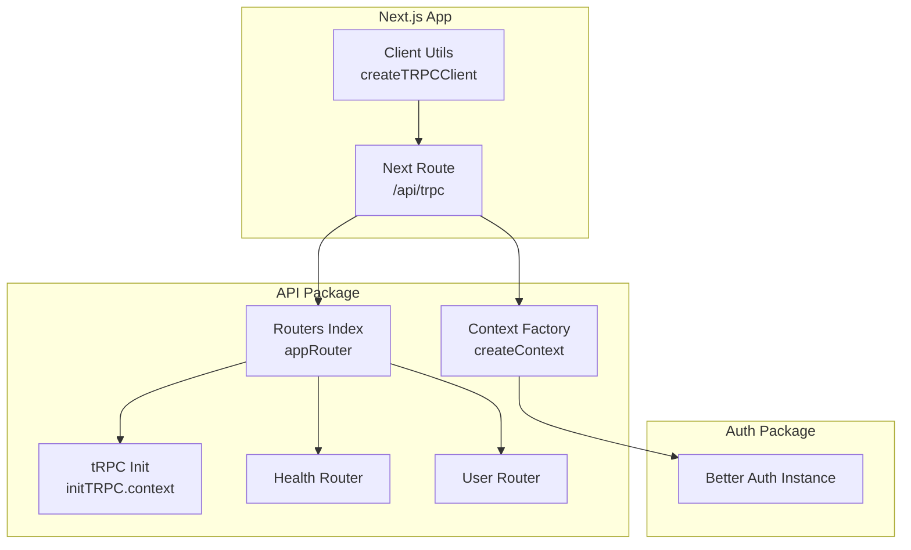
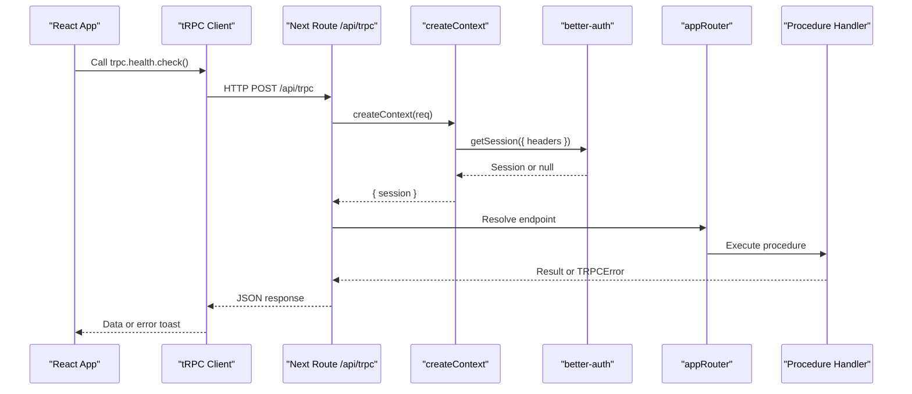
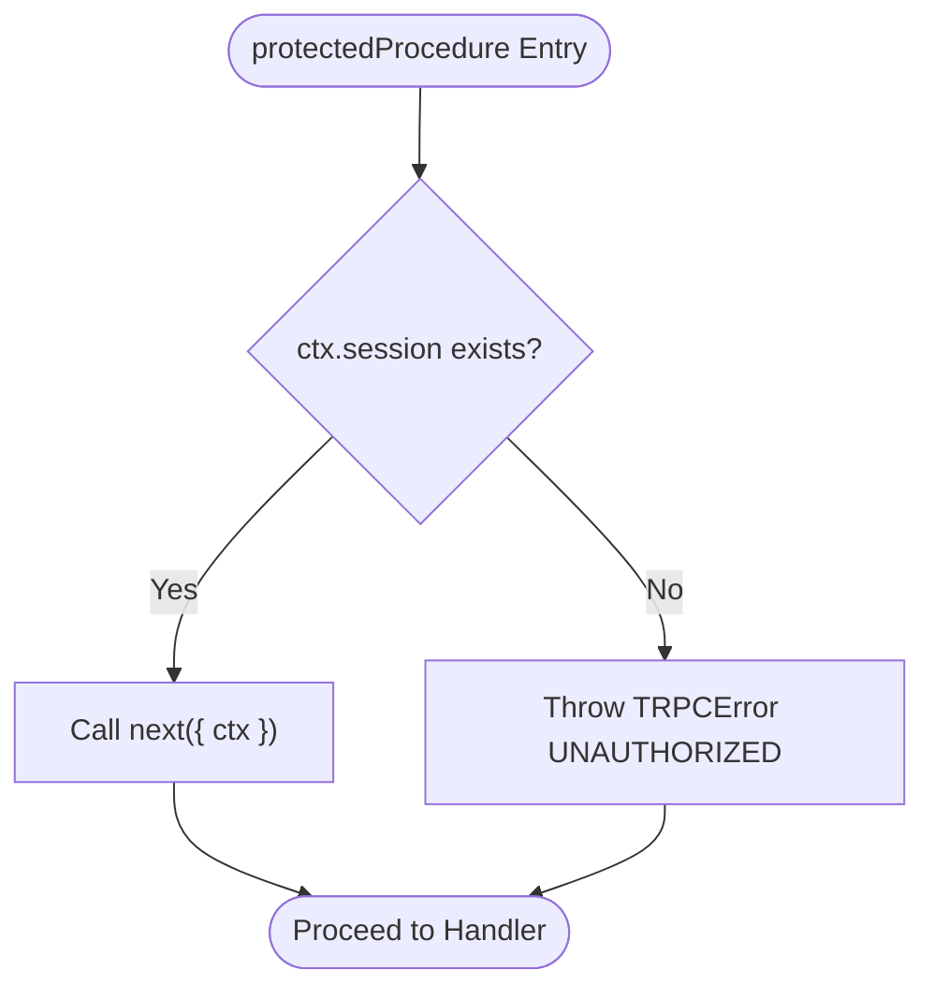
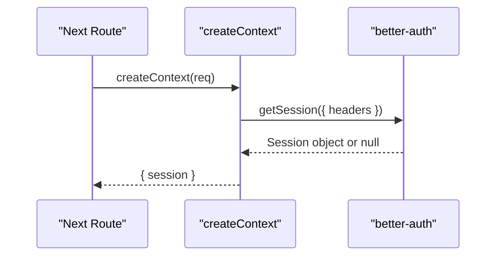
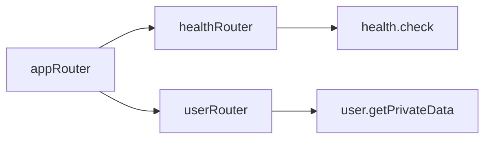
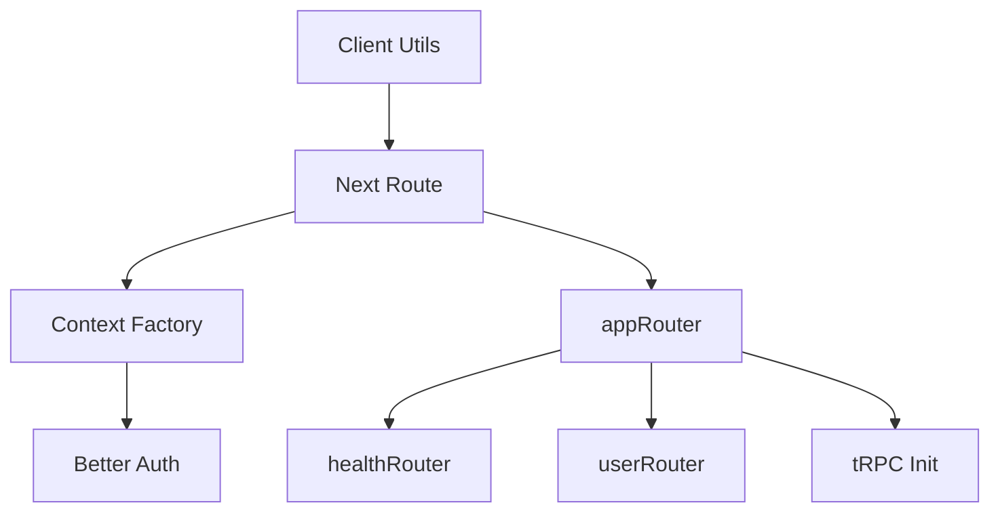

# tRPC Setup and Configuration

<cite>
**Referenced Files in This Document**
- [packages/api/src/index.ts](file://packages/api/src/index.ts)
- [packages/api/src/context.ts](file://packages/api/src/context.ts)
- [packages/api/src/routers/index.ts](file://packages/api/src/routers/index.ts)
- [packages/api/src/routers/health.ts](file://packages/api/src/routers/health.ts)
- [packages/api/src/routers/user.ts](file://packages/api/src/routers/user.ts)
- [apps/web/src/app/api/trpc/[trpc]/route.ts](file://apps/web/src/app/api/trpc/[trpc]/route.ts)
- [apps/web/src/utils/trpc.ts](file://apps/web/src/utils/trpc.ts)
- [packages/auth/src/index.ts](file://packages/auth/src/index.ts)
</cite>

## Table of Contents

1. Introduction
2. Project Structure
3. Core Components
4. Architecture Overview
5. Detailed Component Analysis
6. Dependency Analysis
7. Performance Considerations
8. Troubleshooting Guide
9. Conclusion

## Introduction

This document explains how tRPC is set up and configured in the Atlas API layer. It covers initialization, context creation, middleware setup, public and protected procedures, router organization, client integration, error handling with TRPCError, and best practices for designing procedures.

## Project Structure

The tRPC implementation is split across a server package and Next.js app:

- Server-side tRPC core and routers live under packages/api.
- The Next.js route handler wires tRPC into HTTP at apps/web.
- Client utilities configure the tRPC client under apps/web.



**Diagram sources**

- [apps/web/src/app/api/trpc/[trpc]/route.ts:1-14](file://apps/web/src/app/api/trpc/[trpc]/route.ts#L1-L14)
- [packages/api/src/index.ts:1-25](file://packages/api/src/index.ts#L1-L25)
- [packages/api/src/context.ts:1-15](file://packages/api/src/context.ts#L1-L15)
- [packages/api/src/routers/index.ts:1-11](file://packages/api/src/routers/index.ts#L1-L11)
- [packages/api/src/routers/health.ts:1-6](file://packages/api/src/routers/health.ts#L1-L6)
- [packages/api/src/routers/user.ts:1-9](file://packages/api/src/routers/user.ts#L1-L9)
- [packages/auth/src/index.ts:1-43](file://packages/auth/src/index.ts#L1-L43)

**Section sources**

- [apps/web/src/app/api/trpc/[trpc]/route.ts:1-14](file://apps/web/src/app/api/trpc/[trpc]/route.ts#L1-L14)
- [packages/api/src/index.ts:1-25](file://packages/api/src/index.ts#L1-L25)
- [packages/api/src/routers/index.ts:1-11](file://packages/api/src/routers/index.ts#L1-L11)

## Core Components

- tRPC initialization and procedure factories:
  - A typed tRPC instance is created with the application Context type.
  - Exposed helpers include router, publicProcedure, and protectedProcedure.
- Context factory:
  - Builds per-request context by fetching the session using the auth package.
- Routers:
  - Grouped by feature (health, user), then composed into an appRouter.
- Next.js route handler:
  - Wires fetchRequestHandler to createContext and appRouter.
- Client:
  - Configures httpBatchLink and integrates with React Query.

Key responsibilities:

- Initialization centralizes types and reusable procedure builders.
- Context isolates request-scoped data (session).
- Middleware enforces authentication on protected endpoints.
- Routers organize procedures by domain.

**Section sources**

- [packages/api/src/index.ts:1-25](file://packages/api/src/index.ts#L1-L25)
- [packages/api/src/context.ts:1-15](file://packages/api/src/context.ts#L1-L15)
- [packages/api/src/routers/index.ts:1-11](file://packages/api/src/routers/index.ts#L1-L11)
- [apps/web/src/app/api/trpc/[trpc]/route.ts:1-14](file://apps/web/src/app/api/trpc/[trpc]/route.ts#L1-L14)
- [apps/web/src/utils/trpc.ts:1-40](file://apps/web/src/utils/trpc.ts#L1-L40)

## Architecture Overview

End-to-end flow from client to server:



**Diagram sources**

- [apps/web/src/utils/trpc.ts:1-40](file://apps/web/src/utils/trpc.ts#L1-L40)
- [apps/web/src/app/api/trpc/[trpc]/route.ts:1-14](file://apps/web/src/app/api/trpc/[trpc]/route.ts#L1-L14)
- [packages/api/src/context.ts:1-15](file://packages/api/src/context.ts#L1-L15)
- [packages/auth/src/index.ts:1-43](file://packages/auth/src/index.ts#L1-L43)
- [packages/api/src/routers/index.ts:1-11](file://packages/api/src/routers/index.ts#L1-L11)
- [packages/api/src/routers/health.ts:1-6](file://packages/api/src/routers/health.ts#L1-L6)

## Detailed Component Analysis

### tRPC Initialization and Procedure Patterns

- Initialization:
  - Creates a typed tRPC instance bound to the Context type.
  - Exposes router and procedure builders for reuse.
- publicProcedure:
  - Base procedure without extra checks; suitable for health checks and public reads.
- protectedProcedure:
  - Adds middleware that validates ctx.session exists.
  - Throws a TRPCError with UNAUTHORIZED when missing.
  - Passes through validated context to downstream handlers.



**Diagram sources**

- [packages/api/src/index.ts:1-25](file://packages/api/src/index.ts#L1-L25)

**Section sources**

- [packages/api/src/index.ts:1-25](file://packages/api/src/index.ts#L1-L25)

### Context Creation and Authentication Integration

- Context factory:
  - Reads request headers and retrieves the session via better-auth.
  - Returns a consistent context shape including session.
- Type safety:
  - Context type is inferred from the factory return type.



**Diagram sources**

- [apps/web/src/app/api/trpc/[trpc]/route.ts:1-14](file://apps/web/src/app/api/trpc/[trpc]/route.ts#L1-L14)
- [packages/api/src/context.ts:1-15](file://packages/api/src/context.ts#L1-L15)
- [packages/auth/src/index.ts:1-43](file://packages/auth/src/index.ts#L1-L43)

**Section sources**

- [packages/api/src/context.ts:1-15](file://packages/api/src/context.ts#L1-L15)
- [packages/auth/src/index.ts:1-43](file://packages/auth/src/index.ts#L1-L43)

### Router Organization and Procedures

- Composition:
  - Feature routers are grouped and exported as appRouter.
- Example routers:
  - Health: public read-only check.
  - User: demonstrates a protected query accessing session.user.



**Diagram sources**

- [packages/api/src/routers/index.ts:1-11](file://packages/api/src/routers/index.ts#L1-L11)
- [packages/api/src/routers/health.ts:1-6](file://packages/api/src/routers/health.ts#L1-L6)
- [packages/api/src/routers/user.ts:1-9](file://packages/api/src/routers/user.ts#L1-L9)

**Section sources**

- [packages/api/src/routers/index.ts:1-11](file://packages/api/src/routers/index.ts#L1-L11)
- [packages/api/src/routers/health.ts:1-6](file://packages/api/src/routers/health.ts#L1-L6)
- [packages/api/src/routers/user.ts:1-9](file://packages/api/src/routers/user.ts#L1-L9)

### Client-Side Integration

- Links and credentials:
  - Uses httpBatchLink pointing to /api/trpc.
  - Ensures cookies are included via credentials: "include".
- Error UX:
  - Integrates with React Query cache onError to show toast notifications and offer retry.

```mermaid
sequenceDiagram
participant UI as "React Component"
participant TRPC as "tRPC Proxy"
participant Link as "httpBatchLink"
participant Route as "/api/trpc"
UI->>TRPC : trpc.user.getPrivateData()
TRPC->>Link : Batched request
Link->>Route : POST /api/trpc with cookies
Route-->>Link : Response
Link-->>TRPC : Typed result or error
TRPC-->>UI : Data or error toast
```

**Diagram sources**

- [apps/web/src/utils/trpc.ts:1-40](file://apps/web/src/utils/trpc.ts#L1-L40)
- [apps/web/src/app/api/trpc/[trpc]/route.ts:1-14](file://apps/web/src/app/api/trpc/[trpc]/route.ts#L1-L14)

**Section sources**

- [apps/web/src/utils/trpc.ts:1-40](file://apps/web/src/utils/trpc.ts#L1-L40)

### Creating New Procedures

- Public procedure example pattern:
  - Use publicProcedure.query or .mutation for endpoints that do not require authentication.
- Protected procedure example pattern:
  - Use protectedProcedure to enforce session presence before executing logic.
- Accessing context:
  - Read ctx.session inside the handler to access authenticated user data.

Guidance:

- Place new feature routers under packages/api/src/routers and compose them in the index.
- Keep each router focused on a single domain to maintain cohesion.

**Section sources**

- [packages/api/src/routers/health.ts:1-6](file://packages/api/src/routers/health.ts#L1-L6)
- [packages/api/src/routers/user.ts:1-9](file://packages/api/src/routers/user.ts#L1-L9)
- [packages/api/src/routers/index.ts:1-11](file://packages/api/src/routers/index.ts#L1-L11)

### Implementing Custom Middleware

- Pattern:
  - Attach additional behavior via procedure.use(...) to inspect or transform ctx before the handler runs.
- Common uses:
  - Logging, metrics, rate limiting, role-based authorization, input normalization.
- Best practice:
  - Keep middleware small and composable; chain multiple middlewares if needed.

Note:

- The existing protectedProcedure demonstrates the standard use pattern for enforcing preconditions.

**Section sources**

- [packages/api/src/index.ts:1-25](file://packages/api/src/index.ts#L1-L25)

### Error Handling Strategies with TRPCError

- Centralized errors:
  - Use TRPCError to return structured errors with code and message.
- Unauthenticated access:
  - Enforced in protectedProcedure when session is missing.
- Client experience:
  - Errors surface to the client and can be handled via React Query onError for user feedback.

Best practices:

- Map business errors to appropriate TRPCError codes (e.g., UNAUTHORIZED, NOT_FOUND, CONFLICT).
- Avoid leaking internal details in messages; log full details server-side.

**Section sources**

- [packages/api/src/index.ts:1-25](file://packages/api/src/index.ts#L1-L25)
- [apps/web/src/utils/trpc.ts:1-40](file://apps/web/src/utils/trpc.ts#L1-L40)

### Best Practices for Procedure Design

- Input validation:
  - Validate inputs early; consider adding a validation step before business logic.
- Separation of concerns:
  - Keep routers focused; move complex logic to services or libraries outside routers.
- Security:
  - Always rely on protectedProcedure for sensitive operations; never trust client-provided roles.
- Observability:
  - Add logging/metrics in middleware for consistent telemetry.
- Performance:
  - Prefer batching requests on the client; avoid N+1 queries in handlers.

[No sources needed since this section provides general guidance]

## Dependency Analysis

High-level dependencies between components:



**Diagram sources**

- [apps/web/src/utils/trpc.ts:1-40](file://apps/web/src/utils/trpc.ts#L1-L40)
- [apps/web/src/app/api/trpc/[trpc]/route.ts:1-14](file://apps/web/src/app/api/trpc/[trpc]/route.ts#L1-L14)
- [packages/api/src/context.ts:1-15](file://packages/api/src/context.ts#L1-L15)
- [packages/auth/src/index.ts:1-43](file://packages/auth/src/index.ts#L1-L43)
- [packages/api/src/routers/index.ts:1-11](file://packages/api/src/routers/index.ts#L1-L11)
- [packages/api/src/routers/health.ts:1-6](file://packages/api/src/routers/health.ts#L1-L6)
- [packages/api/src/routers/user.ts:1-9](file://packages/api/src/routers/user.ts#L1-L9)
- [packages/api/src/index.ts:1-25](file://packages/api/src/index.ts#L1-L25)

**Section sources**

- [packages/api/package.json:1-28](file://packages/api/package.json#L1-L28)

## Performance Considerations

- Batching:
  - The client uses httpBatchLink to reduce network overhead.
- Context cost:
  - Session retrieval happens per request; ensure efficient caching strategies in your auth provider if applicable.
- Minimal work in middleware:
  - Keep middleware lightweight to avoid latency spikes.
- Database access:
  - Ensure queries are optimized and avoid unnecessary joins in hot paths.

[No sources needed since this section provides general guidance]

## Troubleshooting Guide

Common issues and resolutions:

- Unauthorized errors:
  - Occur when calling protectedProcedure without a valid session. Verify cookies are sent and session exists.
- Missing context fields:
  - If ctx.session is undefined, confirm the auth provider returns a session and headers are forwarded correctly.
- Client errors:
  - Inspect React Query onError to see error messages; add retries where appropriate.

Checklist:

- Ensure credentials: "include" is set on the client link.
- Confirm the Next route passes req.headers to getSession.
- Validate that protectedProcedure is used for any sensitive endpoints.

**Section sources**

- [packages/api/src/index.ts:1-25](file://packages/api/src/index.ts#L1-L25)
- [apps/web/src/utils/trpc.ts:1-40](file://apps/web/src/utils/trpc.ts#L1-L40)
- [packages/api/src/context.ts:1-15](file://packages/api/src/context.ts#L1-L15)

## Conclusion

The Atlas API layer uses a clean tRPC setup with typed context, clear separation between public and protected procedures, and modular routers. Authentication is enforced via middleware, and errors are standardized using TRPCError. Follow the patterns shown here to extend functionality safely and consistently while maintaining strong typing and good developer experience.
