# AI Runtime System

<cite>
**Referenced Files in This Document**
- [agent.ts](file://apps/runtime/agent/agent.ts)
- [session.ts](file://apps/runtime/agent/session.ts)
- [instructions.md](file://apps/runtime/agent/instructions.md)
- [eve.ts](file://apps/runtime/agent/channels/eve.ts)
- [telegram.ts](file://apps/runtime/agent/channels/telegram.ts)
- [twilio.ts](file://apps/runtime/agent/channels/twilio.ts)
- [composio.ts](file://apps/runtime/agent/tools/composio.ts)
- [create-order.ts](file://apps/runtime/agent/tools/create-order.ts)
- [flight-search.ts](file://apps/runtime/agent/tools/flight-search.ts)
- [flight-verify.ts](file://apps/runtime/agent/tools/flight-verify.ts)
- [smart-search.ts](file://apps/runtime/agent/tools/smart-search.ts)
- [price-compare-search.ts](file://apps/runtime/agent/tools/price-compare-search.ts)
- [get-offer.ts](file://apps/runtime/agent/tools/get-offer.ts)
- [get-offer-price.ts](file://apps/runtime/agent/tools/get-offer-price.ts)
- [booking-agent.ts](file://apps/runtime/agent/subagents/booking/agent.ts)
- [support-agent.ts](file://apps/runtime/agent/subagents/support/agent.ts)
- [booking-instructions.md](file://apps/runtime/agent/subagents/booking/instructions.md)
- [support-instructions.md](file://apps/runtime/agent/subagents/support/instructions.md)
- [disruption-monitor.ts](file://apps/runtime/agent/schedules/disruption-monitor.ts)
- [price-watch.ts](file://apps/runtime/agent/schedules/price-watch.ts)
- [evals.config.ts](file://apps/runtime/evals/evals.config.ts)
- [smoke.eval.ts](file://apps/runtime/evals/atlas/smoke.eval.ts)
- [payment-requires-approval.eval.ts](file://apps/runtime/evals/atlas/payment-requires-approval.eval.ts)
- [package.json](file://apps/runtime/package.json)
- [README.md](file://README.md)
</cite>

## Update Summary

**Changes Made**

- Enhanced agent configuration with dynamic model selection via EVE_TASK_MODEL environment variable for cost optimization
- Implemented improved compaction settings with 0.75 threshold for better context management during booking workflows
- Added strict token limits (2M input, 200K output per session) for production-ready cost management
- Configured 7-day session timeouts to prevent resource exhaustion and optimize costs
- Updated subagent configurations to leverage dynamic model selection for background tasks

## Table of Contents

1. [Introduction](#introduction)
2. [Project Structure](#project-structure)
3. [Core Components](#core-components)
4. [Architecture Overview](#architecture-overview)
5. [Detailed Component Analysis](#detailed-component-analysis)
6. [Dependency Analysis](#dependency-analysis)
7. [Performance Considerations](#performance-considerations)
8. [Troubleshooting Guide](#troubleshooting-guide)
9. [Conclusion](#conclusion)
10. [Appendices](#appendices)

## Introduction

This document describes the AI runtime system built on the Eve framework that orchestrates specialized agents and processes messages across multiple channels (web, Telegram, SMS). The system features a sophisticated multi-agent architecture with dedicated booking and support subagents, comprehensive tool sets for flight operations, background scheduling for automated monitoring, and a robust evaluation infrastructure for quality assurance. It explains how sessions are managed, how tools integrate with external services via Composio, and how the channel abstraction unifies inputs.

**Updated** Enhanced with production-ready cost management features including dynamic model selection, strict token limits, and optimized compaction settings for efficient resource utilization.

## Project Structure

The runtime lives under apps/runtime and is organized around:

- Main agent definition and configuration with advanced cost controls
- Specialized subagents for booking and support workflows with dynamic model selection
- Session management for tool integrations
- Channel adapters for web, Telegram, and SMS
- Comprehensive tool sets including flight booking flows and Composio toolkits
- Background scheduling for automated monitoring tasks
- Evaluation infrastructure for testing and quality assurance

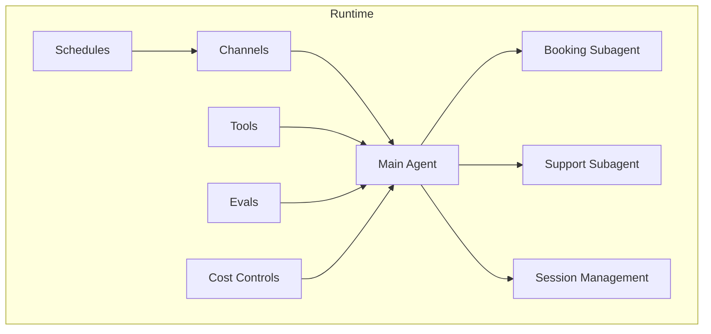

**Diagram sources**

- [agent.ts:1-35](file://apps/runtime/agent/agent.ts#L1-L35)
- [booking-agent.ts:1-25](file://apps/runtime/agent/subagents/booking/agent.ts#L1-L25)
- [support-agent.ts:1-22](file://apps/runtime/agent/subagents/support/agent.ts#L1-L22)
- [session.ts:1-19](file://apps/runtime/agent/session.ts#L1-L19)
- [disruption-monitor.ts:1-21](file://apps/runtime/agent/schedules/disruption-monitor.ts#L1-L21)
- [price-watch.ts:1-26](file://apps/runtime/agent/schedules/price-watch.ts#L1-L26)

**Section sources**

- [README.md:79-94](file://README.md#L79-L94)
- [package.json:1-30](file://apps/runtime/package.json#L1-L30)

## Core Components

- **Main Agent**: Orchestrates conversation flow using configured model and coordinates specialized subagents with dynamic model selection based on task type
- **Specialized Subagents**: Dedicated agents for booking workflows and post-booking support with specific tool sets and optimized model usage
- **Session Management**: Creates isolated contexts per user with curated toolkits for secure integrations
- **Channel Abstraction**: Unified message ingestion from web (Eve), Telegram, and SMS (Twilio)
- **Comprehensive Tool System**: Extensive set of tools for flight operations, order management, and external service integration
- **Background Scheduling**: Automated monitoring and price tracking through scheduled tasks
- **Evaluation Infrastructure**: Testing framework for validating agent behavior and tool performance
- **Cost Management**: Production-ready features including dynamic model selection, strict token limits, and optimized compaction

Key responsibilities:

- **Main Agent**: Routes requests to appropriate subagents and manages overall conversation state with cost-aware model selection
- **Booking Subagent**: Handles end-to-end flight booking with strict workflow enforcement and optimized model usage
- **Support Subagent**: Manages existing orders, PNR operations, and customer support tasks with cost-efficient processing
- **Sessions**: Ensure each user has isolated toolkit context for secure, scoped integrations
- **Channels**: Normalize incoming events into common format for agent pipeline
- **Tools**: Expose typed, validated operations for interacting with external systems
- **Schedules**: Execute periodic tasks for monitoring and alerts with optimized resource usage
- **Evals**: Validate agent behavior and ensure quality standards
- **Cost Controls**: Enforce token limits, manage session lifecycles, and optimize model selection for cost efficiency

**Updated** Enhanced with production-ready cost management features that automatically select optimal models and enforce strict resource limits.

**Section sources**

- [agent.ts:1-35](file://apps/runtime/agent/agent.ts#L1-L35)
- [booking-agent.ts:1-25](file://apps/runtime/agent/subagents/booking/agent.ts#L1-L25)
- [support-agent.ts:1-22](file://apps/runtime/agent/subagents/support/agent.ts#L1-L22)
- [session.ts:1-19](file://apps/runtime/agent/session.ts#L1-L19)
- [booking-instructions.md:1-21](file://apps/runtime/agent/subagents/booking/instructions.md#L1-L21)
- [support-instructions.md:1-17](file://apps/runtime/agent/subagents/support/instructions.md#L1-L17)

## Architecture Overview

The runtime implements a sophisticated multi-agent architecture where a main coordinator agent delegates tasks to specialized subagents with dynamic model selection. Each subagent has its own focused tool set and instructions. Background schedules run automated monitoring tasks, while the evaluation infrastructure ensures quality and reliability. Cost management features provide production-ready safeguards against excessive resource consumption.

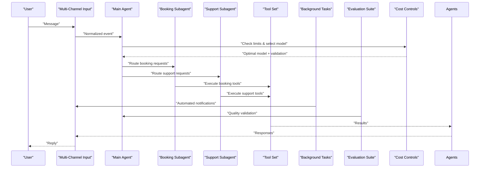

**Diagram sources**

- [agent.ts:1-35](file://apps/runtime/agent/agent.ts#L1-L35)
- [booking-agent.ts:1-25](file://apps/runtime/agent/subagents/booking/agent.ts#L1-L25)
- [support-agent.ts:1-22](file://apps/runtime/agent/subagents/support/agent.ts#L1-L22)
- [disruption-monitor.ts:1-21](file://apps/runtime/agent/schedules/disruption-monitor.ts#L1-L21)
- [price-watch.ts:1-26](file://apps/runtime/agent/schedules/price-watch.ts#L1-L26)
- [smoke.eval.ts:1-13](file://apps/runtime/evals/atlas/smoke.eval.ts#L1-L13)

## Detailed Component Analysis

### Enhanced Agent Configuration with Dynamic Model Selection

The system now features sophisticated dynamic model selection that optimizes costs by choosing appropriate models based on task type. The main agent uses a primary model for interactive conversations while background tasks and subagents can utilize cheaper models through the EVE_TASK_MODEL environment variable.

**Updated** Added dynamic model selection with EVE_TASK_MODEL environment variable support

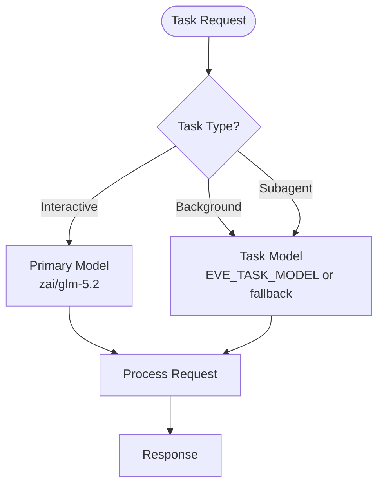

**Diagram sources**

- [agent.ts:24-33](file://apps/runtime/agent/agent.ts#L24-L33)
- [booking-agent.ts:7](file://apps/runtime/agent/subagents/booking/agent.ts#L7)
- [support-agent.ts:7](file://apps/runtime/agent/subagents/support/agent.ts#L7)

**Section sources**

- [agent.ts:1-35](file://apps/runtime/agent/agent.ts#L1-L35)
- [booking-agent.ts:1-25](file://apps/runtime/agent/subagents/booking/agent.ts#L1-L25)
- [support-agent.ts:1-22](file://apps/runtime/agent/subagents/support/agent.ts#L1-L22)

### Production-Ready Cost Management Features

The system includes comprehensive cost management features designed for production deployments:

**Strict Token Limits:**

- Maximum 2M input tokens per session to prevent runaway costs
- Maximum 200K output tokens per session for controlled response generation
- Automatic session pausing when limits are approached

**Optimized Compaction Settings:**

- 0.75 threshold percentage for earlier context compaction
- Prevents late payment steps from exceeding context windows during booking workflows
- Balances memory usage with conversation continuity

**Session Timeouts:**

- 7-day session timeout for booking journeys (appropriate for flight booking timelines)
- Prevents indefinite resource consumption from abandoned sessions
- Optimizes server resource allocation

**Dynamic Model Selection:**

- Interactive conversations use premium models for quality responses
- Background tasks and subagents use cost-optimized models
- Environment variable control via EVE_TASK_MODEL for flexible deployment

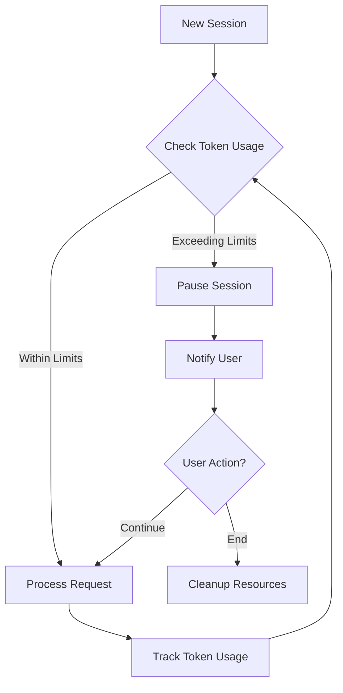

**Diagram sources**

- [agent.ts:16-23](file://apps/runtime/agent/agent.ts#L16-L23)

**Section sources**

- [agent.ts:10-23](file://apps/runtime/agent/agent.ts#L10-L23)

### Multi-Agent Orchestration

The system uses a hierarchical agent architecture where a main coordinator agent delegates specialized tasks to domain-specific subagents. This separation of concerns improves maintainability and allows each subagent to have focused instructions and tool sets.

**Updated** Enhanced with dynamic model selection for cost optimization

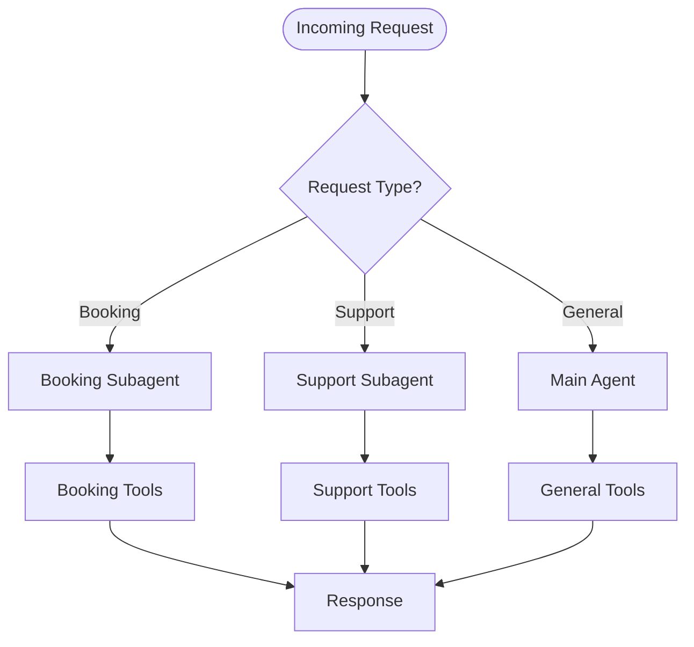

**Diagram sources**

- [agent.ts:1-35](file://apps/runtime/agent/agent.ts#L1-L35)
- [booking-agent.ts:1-25](file://apps/runtime/agent/subagents/booking/agent.ts#L1-L25)
- [support-agent.ts:1-22](file://apps/runtime/agent/subagents/support/agent.ts#L1-L22)

**Section sources**

- [agent.ts:1-35](file://apps/runtime/agent/agent.ts#L1-L35)
- [booking-agent.ts:1-25](file://apps/runtime/agent/subagents/booking/agent.ts#L1-L25)
- [support-agent.ts:1-22](file://apps/runtime/agent/subagents/support/agent.ts#L1-L22)

### Specialized Subagents

#### Booking Subagent

The booking subagent handles end-to-end flight booking workflows with strict adherence to safety protocols and explicit confirmation requirements at critical steps. Now optimized with dynamic model selection for cost efficiency.

**Capabilities:**

- Flight search with flexible date handling
- Fare verification and price comparison
- Seat and baggage selection
- Order creation and confirmation
- Payment processing with approval gates

**Safety Rules:**

- Treats all IDs as opaque values
- Never retries order creation or payment automatically
- Requires explicit user confirmation before financial transactions
- Reports outcomes concisely with relevant URLs

**Cost Optimization:**

- Uses EVE_TASK_MODEL for background processing
- Structured output schema for efficient communication
- Optimized model selection reduces operational costs

#### Support Subagent

The support subagent manages post-booking operations including order status checks, PNR management, refunds, and ticketing holds. Enhanced with cost-aware model selection.

**Capabilities:**

- Order lookup and status monitoring
- PNR extraction and claim management
- Ancillary services management
- Refund processing and order voiding
- Webhook incident monitoring

**Safety Rules:**

- Confirms exact order numbers and scope before changes
- Never retries automatic modifications
- Treats pending ticketing as ongoing processing
- Reports outcomes with clear next steps

**Cost Optimization:**

- Leverages dynamic model selection for background tasks
- Efficient structured output reduces token usage
- Optimized processing for high-volume support scenarios

**Section sources**

- [booking-instructions.md:1-21](file://apps/runtime/agent/subagents/booking/instructions.md#L1-L21)
- [support-instructions.md:1-17](file://apps/runtime/agent/subagents/support/instructions.md#L1-L17)
- [booking-agent.ts:1-25](file://apps/runtime/agent/subagents/booking/agent.ts#L1-L25)
- [support-agent.ts:1-22](file://apps/runtime/agent/subagents/support/agent.ts#L1-L22)

### Enhanced Tool System

The tool system has been significantly expanded with comprehensive flight booking and support capabilities.

**Flight Search Tools:**

- `flight-search`: Basic flight search with route and date parameters
- `smart-search`: Flexible date handling with intelligent search
- `price-compare-search`: Price comparison across multiple dates
- `get-offer`: Retrieve detailed offer information
- `get-offer-price`: Get current pricing for offers

**Order Management Tools:**

- `create-order`: Create new booking orders
- `confirm-order`: Finalize orders and obtain confirmations
- `query-order`: Check order status and details
- `order-list`: List user's orders
- `regenerate-order`: Regenerate existing orders

**Payment and Ticketing Tools:**

- `payment-and-ticketing`: Process payments and ticket issuance
- `stop-ticket-issuance`: Halt ticketing process
- `void-order`: Cancel orders
- `refunds`: Process refund requests

**PNR and Ancillary Tools:**

- `extract-pnr`: Extract booking details from PNR
- `pnr-claim`: Attach PNR to user account
- `post-ticketing-ancillaries`: Add ancillary services
- `seat-and-baggage`: Manage seating and baggage
- `baggage`: Handle baggage operations
- `balance`: Check account balance

**Monitoring Tools:**

- `webhook-incidents`: Monitor flight disruptions and incidents

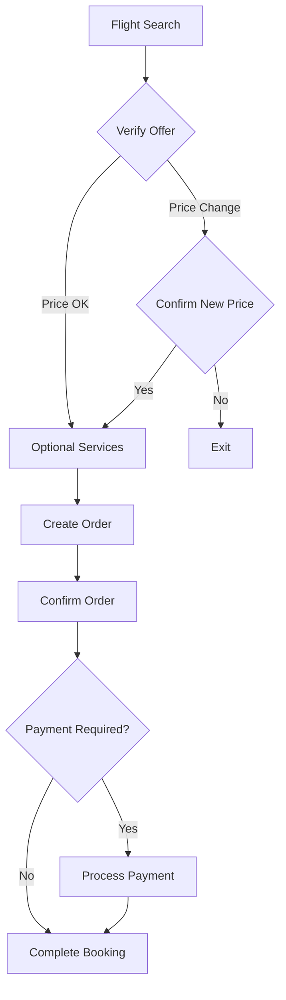

**Diagram sources**

- [smart-search.ts:1-30](file://apps/runtime/agent/tools/smart-search.ts#L1-L30)
- [price-compare-search.ts:1-30](file://apps/runtime/agent/tools/price-compare-search.ts#L1-L30)
- [get-offer.ts:1-24](file://apps/runtime/agent/tools/get-offer.ts#L1-L24)
- [get-offer-price.ts:1-24](file://apps/runtime/agent/tools/get-offer-price.ts#L1-L24)

**Section sources**

- [smart-search.ts:1-30](file://apps/runtime/agent/tools/smart-search.ts#L1-L30)
- [price-compare-search.ts:1-30](file://apps/runtime/agent/tools/price-compare-search.ts#L1-L30)
- [get-offer.ts:1-24](file://apps/runtime/agent/tools/get-offer.ts#L1-L24)
- [get-offer-price.ts:1-24](file://apps/runtime/agent/tools/get-offer-price.ts#L1-L24)

### Background Scheduling Capabilities

The system includes automated background tasks for monitoring and alerting through scheduled jobs. These tasks benefit from dynamic model selection for cost optimization.

**Disruption Monitor:**

- Runs every 30 minutes to check for flight incidents
- Sends Telegram notifications about new disruptions
- Summarizes affected orders and recommended actions
- Avoids duplicate reporting within conversations

**Price Watch:**

- Runs daily at 2 AM to monitor fare changes
- Compares current prices against previously reported fares
- Reports meaningful price drops with route and airline details
- Configurable through environment variables

**Cost Optimization:**

- Background tasks use EVE_TASK_MODEL for cost efficiency
- Scheduled execution minimizes resource usage during off-peak hours
- Optimized notification delivery reduces bandwidth consumption

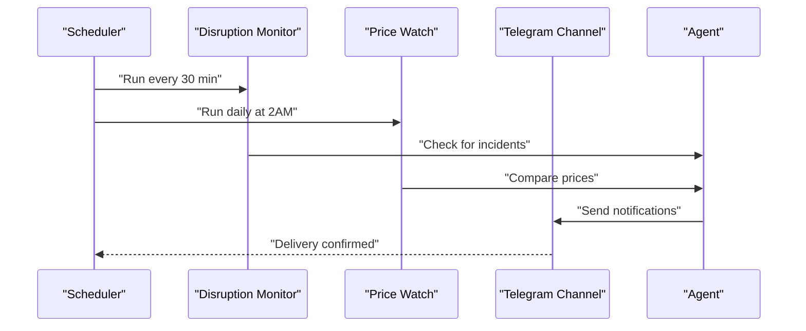

**Diagram sources**

- [disruption-monitor.ts:1-21](file://apps/runtime/agent/schedules/disruption-monitor.ts#L1-L21)
- [price-watch.ts:1-26](file://apps/runtime/agent/schedules/price-watch.ts#L1-L26)

**Section sources**

- [disruption-monitor.ts:1-21](file://apps/runtime/agent/schedules/disruption-monitor.ts#L1-L21)
- [price-watch.ts:1-26](file://apps/runtime/agent/schedules/price-watch.ts#L1-L26)

### Evaluation Infrastructure

The system includes a comprehensive evaluation framework for testing agent behavior and ensuring quality standards.

**Smoke Tests:**

- Validates basic agent functionality and responses
- Ensures agent introduces itself correctly
- Verifies capability announcements

**Behavioral Tests:**

- Tests payment approval workflows
- Validates tool invocation patterns
- Ensures proper input request handling

**Configuration:**

- Centralized evaluation configuration
- Test scenario definitions
- Assertion frameworks for response validation

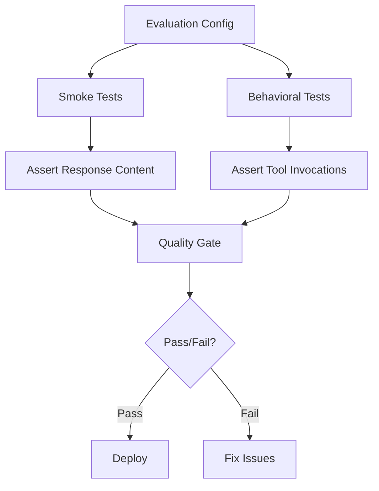

**Diagram sources**

- [evals.config.ts:1-4](file://apps/runtime/evals/evals.config.ts#L1-L4)
- [smoke.eval.ts:1-13](file://apps/runtime/evals/atlas/smoke.eval.ts#L1-L13)
- [payment-requires-approval.eval.ts:1-18](file://apps/runtime/evals/atlas/payment-requires-approval.eval.ts#L1-L18)

**Section sources**

- [evals.config.ts:1-4](file://apps/runtime/evals/evals.config.ts#L1-L4)
- [smoke.eval.ts:1-13](file://apps/runtime/evals/atlas/smoke.eval.ts#L1-L13)
- [payment-requires-approval.eval.ts:1-18](file://apps/runtime/evals/atlas/payment-requires-approval.eval.ts#L1-L18)

### Channel Abstraction (Web, Telegram, SMS)

- Web (Eve): Configured with authentication providers and CORS; normalizes HTTP events into the agent pipeline.
- Telegram: Uses a bot token to receive and send messages.
- SMS (Twilio): Accepts inbound messages from a configured phone number and allows flexible sender filtering.

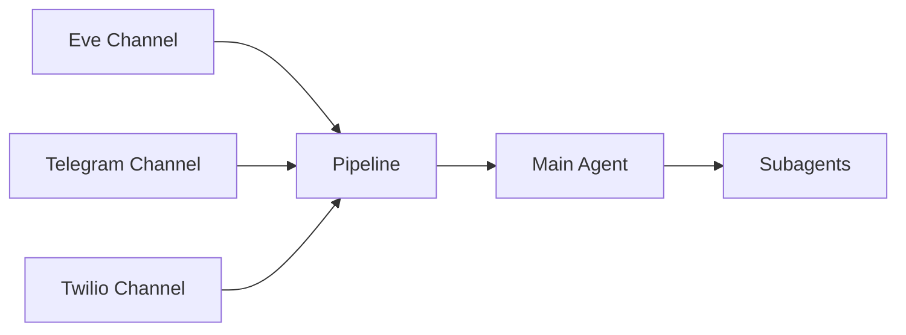

**Diagram sources**

- [eve.ts:1-10](file://apps/runtime/agent/channels/eve.ts#L1-L10)
- [telegram.ts:1-6](file://apps/runtime/agent/channels/telegram.ts#L1-L6)
- [twilio.ts:1-7](file://apps/runtime/agent/channels/twilio.ts#L1-L7)

**Section sources**

- [eve.ts:1-10](file://apps/runtime/agent/channels/eve.ts#L1-L10)
- [telegram.ts:1-6](file://apps/runtime/agent/channels/telegram.ts#L1-L6)
- [twilio.ts:1-7](file://apps/runtime/agent/channels/twilio.ts#L1-L7)

### Message Processing Pipeline

- Ingestion: Channels normalize inputs into a common event shape.
- Routing: Events are routed to the main agent which delegates to appropriate subagents.
- Tool invocation: Subagents call specialized tools based on their domain expertise.
- Execution: Tools validate inputs, call external APIs, and return structured results.
- Response: Agents compose replies back to the originating channel.

**Updated** Enhanced with cost-aware model selection and token limit enforcement

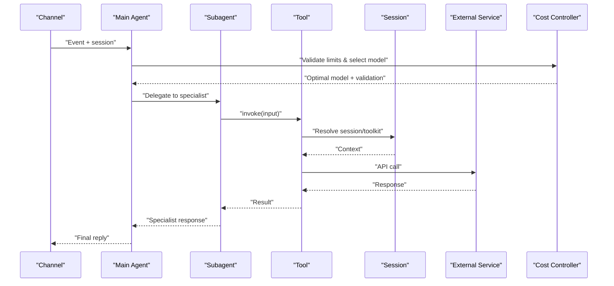

**Diagram sources**

- [composio.ts:1-12](file://apps/runtime/agent/tools/composio.ts#L1-L12)
- [session.ts:1-19](file://apps/runtime/agent/session.ts#L1-L19)
- [agent.ts:16-33](file://apps/runtime/agent/agent.ts#L16-L33)

**Section sources**

- [composio.ts:1-12](file://apps/runtime/agent/tools/composio.ts#L1-L12)
- [session.ts:1-19](file://apps/runtime/agent/session.ts#L1-L19)
- [agent.ts:16-33](file://apps/runtime/agent/agent.ts#L16-L33)

### Creating Custom Agents

- Define an agent with a chosen model.
- Optionally attach instructions to guide behavior.
- Configure channels to route messages into the agent.
- Add tools to extend capabilities.

**Updated** Enhanced with dynamic model selection and cost management features

Steps:

- Create a new agent file and specify the model.
- Add or update instructions if needed.
- Wire up channels to your deployment environment.
- Register tools to enable external interactions.
- Configure cost controls and token limits for production use.

**Section sources**

- [agent.ts:1-35](file://apps/runtime/agent/agent.ts#L1-L35)
- [instructions.md:1-4](file://apps/runtime/agent/instructions.md#L1-L4)

### Implementing New Channels

To add a new channel:

- Use the appropriate channel factory from the framework.
- Provide required credentials or configuration.
- Ensure CORS and auth settings match your deployment.

Examples:

- Web channel: configure auth providers and CORS.
- Telegram channel: provide a bot token.
- SMS channel: configure allowed senders and messaging origin.

**Section sources**

- [eve.ts:1-10](file://apps/runtime/agent/channels/eve.ts#L1-L10)
- [telegram.ts:1-6](file://apps/runtime/agent/channels/telegram.ts#L1-L6)
- [twilio.ts:1-7](file://apps/runtime/agent/channels/twilio.ts#L1-L7)

### Developing Tools for Third-Party APIs

To create a tool:

- Define a typed input schema for validation.
- Implement execute to call the external service.
- Return structured results for the agent to consume.

Patterns observed:

- Use a client library to interact with the target API.
- Validate inputs with a schema library.
- For sensitive actions, enforce approval policies.

**Section sources**

- [smart-search.ts:1-30](file://apps/runtime/agent/tools/smart-search.ts#L1-L30)
- [price-compare-search.ts:1-30](file://apps/runtime/agent/tools/price-compare-search.ts#L1-L30)
- [get-offer.ts:1-24](file://apps/runtime/agent/tools/get-offer.ts#L1-L24)
- [get-offer-price.ts:1-24](file://apps/runtime/agent/tools/get-offer-price.ts#L1-L24)

## Dependency Analysis

The runtime depends on:

- Eve framework for agent orchestration and channels
- Composio for toolkit integration and session management
- Atlas client for flight booking operations
- Zod for input validation
- Better Auth for web channel authentication

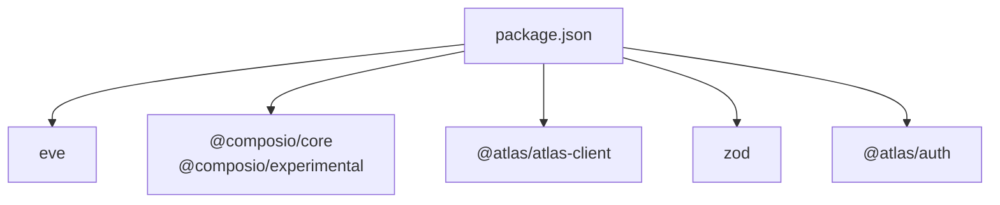

**Diagram sources**

- [package.json:15-24](file://apps/runtime/package.json#L15-L24)

**Section sources**

- [package.json:1-30](file://apps/runtime/package.json#L1-L30)

## Performance Considerations

- Concurrency: Handle high message throughput by leveraging asynchronous tool calls and avoiding blocking operations in the agent loop.
- Caching: Cache frequent lookups (e.g., flight availability) where appropriate to reduce latency and costs.
- Rate limiting: Respect external API rate limits and implement retry/backoff strategies.
- Resource usage: Keep tool payloads minimal and avoid unnecessary data transfers.
- Scaling: Deploy channels horizontally and ensure sessions scale independently per user.
- Background tasks: Optimize schedule execution frequency and payload sizes for monitoring tasks.
- Evaluation overhead: Run evaluations in parallel and cache test results where possible.
- **Cost Optimization**: Leverage dynamic model selection, enforce strict token limits, and optimize compaction settings for production efficiency.
- **Session Management**: Utilize 7-day session timeouts to prevent resource exhaustion and optimize server utilization.

**Updated** Enhanced with production-ready cost optimization strategies and resource management features.

## Troubleshooting Guide

Common issues and mitigations:

- Missing user context in tools: Ensure the session contains a valid user ID before invoking tools.
- Authentication failures: Verify channel auth configuration and environment variables for bots or phone numbers.
- Invalid tool inputs: Rely on schema validation to catch malformed requests early.
- External API errors: Implement retries and clear error propagation back to the agent for user-friendly responses.
- Subagent routing issues: Ensure proper request classification and delegation logic.
- Schedule failures: Monitor cron job execution and handle missing environment variables gracefully.
- Evaluation failures: Review test assertions and update expectations when behavior changes intentionally.
- **Cost Limit Issues**: Monitor token usage and adjust limits based on workload patterns.
- **Model Selection Problems**: Verify EVE_TASK_MODEL environment variable configuration for background tasks.
- **Session Timeout Issues**: Review session activity patterns and adjust timeout settings if needed.

Operational tips:

- Log tool invocations and outcomes for observability.
- Monitor session creation and toolkit initialization.
- Alert on repeated failures in critical tools (e.g., flight verify/order).
- Track schedule execution times and success rates.
- Monitor evaluation pass/fail rates over time.
- **Cost Monitoring**: Track token usage patterns and model selection effectiveness.
- **Resource Optimization**: Monitor session lifecycle and cleanup efficiency.

**Updated** Enhanced with cost management troubleshooting and monitoring guidance.

**Section sources**

- [composio.ts:1-12](file://apps/runtime/agent/tools/composio.ts#L1-L12)
- [telegram.ts:1-6](file://apps/runtime/agent/channels/telegram.ts#L1-L6)
- [twilio.ts:1-7](file://apps/runtime/agent/channels/twilio.ts#L1-L7)
- [agent.ts:16-33](file://apps/runtime/agent/agent.ts#L16-L33)

## Conclusion

The runtime provides a sophisticated, modular AI agent platform built on Eve with advanced multi-agent orchestration capabilities. It features specialized subagents for distinct domains, comprehensive tool sets for flight operations, background scheduling for automated monitoring, and a robust evaluation infrastructure for quality assurance. The system centralizes session management via Composio, standardizes message processing across multiple channels, and provides extensible patterns for adding new agents, channels, tools, and automated tasks while maintaining scalability, reliability, and clarity.

**Updated** Enhanced with production-ready cost management features including dynamic model selection, strict token limits, optimized compaction settings, and 7-day session timeouts for efficient resource utilization and cost control in production environments.

## Appendices

### Example Workflows

#### Enhanced Flight Booking Workflow

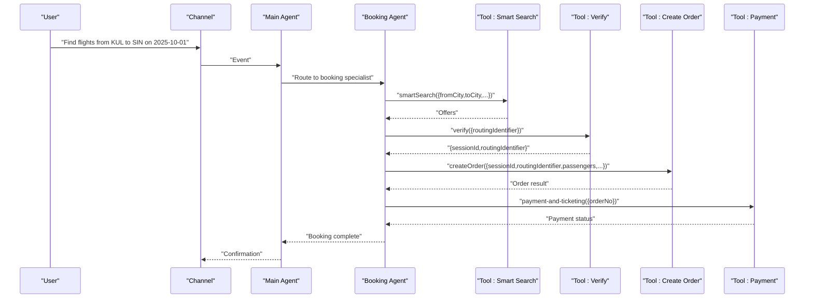

**Diagram sources**

- [smart-search.ts:1-30](file://apps/runtime/agent/tools/smart-search.ts#L1-L30)
- [flight-verify.ts:1-21](file://apps/runtime/agent/tools/flight-verify.ts#L1-L21)
- [create-order.ts:1-66](file://apps/runtime/agent/tools/create-order.ts#L1-L66)

#### Background Monitoring Workflow

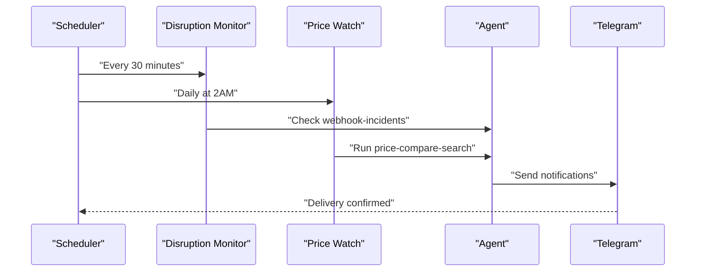

**Diagram sources**

- [disruption-monitor.ts:1-21](file://apps/runtime/agent/schedules/disruption-monitor.ts#L1-L21)
- [price-watch.ts:1-26](file://apps/runtime/agent/schedules/price-watch.ts#L1-L26)

#### Evaluation Testing Workflow

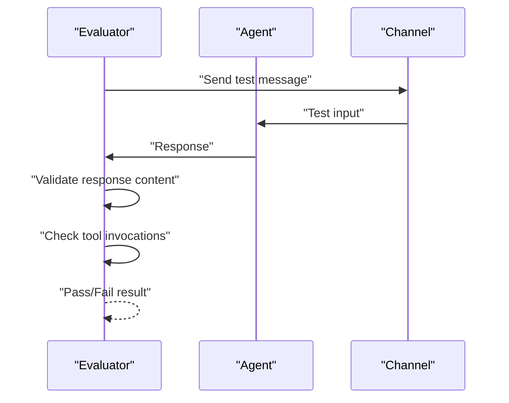

**Diagram sources**

- [smoke.eval.ts:1-13](file://apps/runtime/evals/atlas/smoke.eval.ts#L1-L13)
- [payment-requires-approval.eval.ts:1-18](file://apps/runtime/evals/atlas/payment-requires-approval.eval.ts#L1-L18)

### Cost Management Configuration Examples

#### Environment Variables for Dynamic Model Selection

```bash
# Set custom model for background tasks
export EVE_TASK_MODEL="cheaper-model-id"

# Default primary model remains unchanged for interactive conversations
# Primary model: zai/glm-5.2
```

#### Token Limit Configuration

```typescript
// Current production configuration
limits: {
  maxInputTokensPerSession: 2_000_000,    // 2M input tokens
  maxOutputTokensPerSession: 200_000,     // 200K output tokens
  sessionTimeoutMs: 7 * 24 * 60 * 60 * 1000 // 7 days
}
```

#### Compaction Settings

```typescript
// Optimized for booking workflows
compaction: {
  thresholdPercent: 0.75; // Earlier compaction than default 0.9
}
```

**Section sources**

- [agent.ts:1-35](file://apps/runtime/agent/agent.ts#L1-L35)
