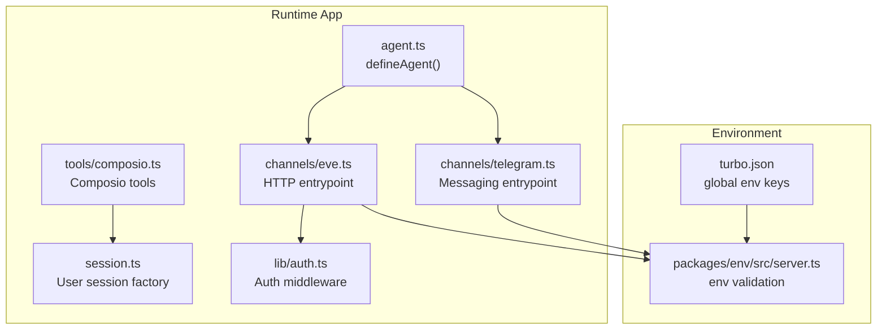
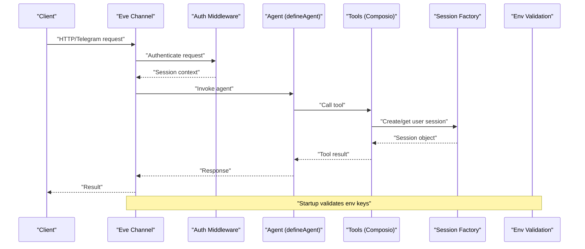
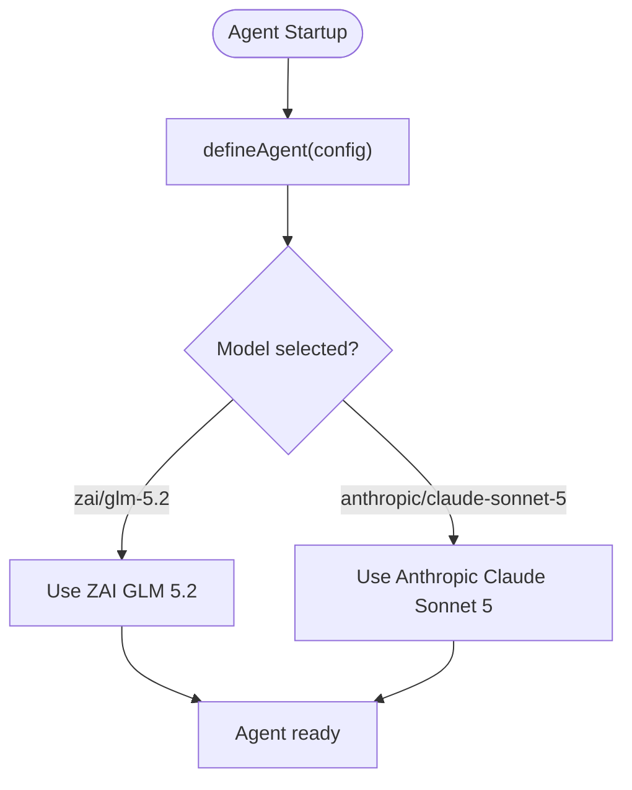
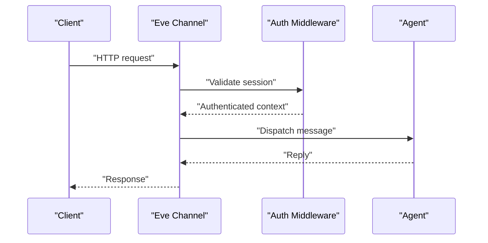
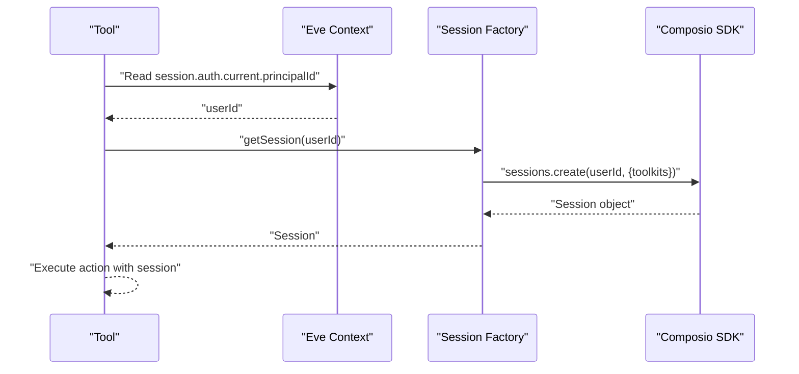
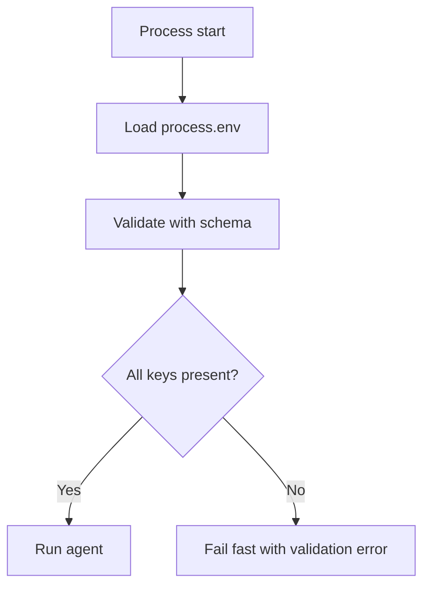
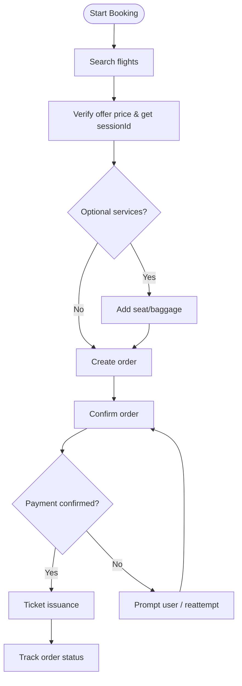
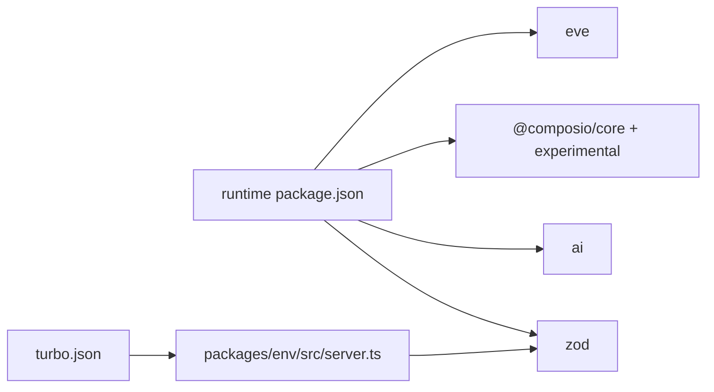

# Agent Lifecycle Management

<cite>
**Referenced Files in This Document**
- [agent.ts](file://apps/runtime/agent/agent.ts)
- [session.ts](file://apps/runtime/agent/session.ts)
- [instructions.md](file://apps/runtime/agent/instructions.md)
- [eve.ts](file://apps/runtime/agent/channels/eve.ts)
- [telegram.ts](file://apps/runtime/agent/channels/telegram.ts)
- [auth.ts](file://apps/runtime/agent/lib/auth.ts)
- [composio.ts](file://apps/runtime/agent/tools/composio.ts)
- [package.json](file://apps/runtime/package.json)
- [turbo.json](file://turbo.json)
- [server.ts](file://packages/env/src/server.ts)
</cite>

## Table of Contents

1. [Introduction](#introduction)
2. [Project Structure](#project-structure)
3. [Core Components](#core-components)
4. [Architecture Overview](#architecture-overview)
5. [Detailed Component Analysis](#detailed-component-analysis)
6. [Dependency Analysis](#dependency-analysis)
7. [Performance Considerations](#performance-considerations)
8. [Troubleshooting Guide](#troubleshooting-guide)
9. [Conclusion](#conclusion)
10. [Appendices](#appendices)

## Introduction

This document explains the agent lifecycle management system built on the Eve framework within this repository. It covers how agents are defined using defineAgent(), model configuration options, and initialization patterns. It also documents the full lifecycle from creation to execution, including startup hooks, runtime state management, and graceful shutdown procedures. The guide details how agents are configured with different AI models (anthropic/claude-sonnet-5 and zai/glm-5.2), environment-specific settings, and how to create custom agents. Finally, it addresses scaling strategies, resource management, and monitoring agent performance metrics.

## Project Structure

The runtime application is organized around an Eve-based agent:

- Agent definition and model selection live under apps/runtime/agent.
- Channels expose the agent over HTTP (Eve channel) and messaging platforms (Telegram).
- Tools integrate external services via Composio and domain APIs.
- Environment variables are centrally validated and consumed across the app.
- Build and run commands are provided by the Eve tooling.

**Diagram sources**

- [agent.ts:1-7](file://apps/runtime/agent/agent.ts#L1-L7)
- [eve.ts:1-10](file://apps/runtime/agent/channels/eve.ts#L1-L10)
- [telegram.ts:1-6](file://apps/runtime/agent/channels/telegram.ts#L1-L6)
- [composio.ts:1-12](file://apps/runtime/agent/tools/composio.ts#L1-L12)
- [session.ts:1-19](file://apps/runtime/agent/session.ts#L1-L19)
- [auth.ts:1-26](file://apps/runtime/agent/lib/auth.ts#L1-L26)
- [server.ts:1-28](file://packages/env/src/server.ts#L1-L28)
- [turbo.json:1-51](file://turbo.json#L1-L51)

**Section sources**

- [package.json:1-30](file://apps/runtime/package.json#L1-L30)
- [turbo.json:1-51](file://turbo.json#L1-L51)

## Core Components

- Agent definition: The agent is created via defineAgent() with a model selector. In this project, the active model is set to zai/glm-5.2, while anthropic/claude-sonnet-5 is available as a commented alternative.
- Channels:
  - HTTP channel (Eve): Provides CORS-enabled HTTP access with authentication layers (Better Auth, Vercel OIDC, local dev).
  - Telegram channel: Connects via bot token from environment variables.
- Tools:
  - Composio integration: Creates user-scoped sessions for third-party toolkits (e.g., Google Calendar, Gmail, Slack, Notion, etc.).
- Authentication:
  - Better Auth integration extracts user attributes and principal identifiers into the Eve session context.
- Environment:
  - Centralized environment schema validates required keys such as API keys, URLs, and tokens used by channels and tools.

**Section sources**

- [agent.ts:1-7](file://apps/runtime/agent/agent.ts#L1-L7)
- [eve.ts:1-10](file://apps/runtime/agent/channels/eve.ts#L1-L10)
- [telegram.ts:1-6](file://apps/runtime/agent/channels/telegram.ts#L1-L6)
- [composio.ts:1-12](file://apps/runtime/agent/tools/composio.ts#L1-L12)
- [session.ts:1-19](file://apps/runtime/agent/session.ts#L1-L19)
- [auth.ts:1-26](file://apps/runtime/agent/lib/auth.ts#L1-L26)
- [server.ts:1-28](file://packages/env/src/server.ts#L1-L28)

## Architecture Overview

The runtime exposes the agent through multiple channels. Requests enter via HTTP or Telegram, pass through authentication, and invoke the agent’s tools. Tools may rely on user sessions managed by Composio to call external integrations. Environment configuration ensures all required secrets and endpoints are present at startup.

**Diagram sources**

- [eve.ts:1-10](file://apps/runtime/agent/channels/eve.ts#L1-L10)
- [auth.ts:1-26](file://apps/runtime/agent/lib/auth.ts#L1-L26)
- [agent.ts:1-7](file://apps/runtime/agent/agent.ts#L1-L7)
- [composio.ts:1-12](file://apps/runtime/agent/tools/composio.ts#L1-L12)
- [session.ts:1-19](file://apps/runtime/agent/session.ts#L1-L19)
- [server.ts:1-28](file://packages/env/src/server.ts#L1-L28)

## Detailed Component Analysis

### Agent Definition and Model Configuration

- defineAgent(): Declares the agent and selects the underlying model provider and model identifier.
- Model options:
  - anthropic/claude-sonnet-5: Available as a commented option.
  - zai/glm-5.2: Currently active model.
- Initialization pattern: Minimal configuration; additional parameters can be added to the defineAgent() config object as supported by the framework.

**Diagram sources**

- [agent.ts:1-7](file://apps/runtime/agent/agent.ts#L1-L7)

**Section sources**

- [agent.ts:1-7](file://apps/runtime/agent/agent.ts#L1-L7)

### Channels and Authentication

- HTTP channel (Eve):
  - Enables CORS.
  - Chains multiple auth providers: Better Auth, Vercel OIDC, and local development mode.
- Telegram channel:
  - Uses TELEGRAM_BOT_TOKEN from environment to connect to Telegram bots.

**Diagram sources**

- [eve.ts:1-10](file://apps/runtime/agent/channels/eve.ts#L1-L10)
- [auth.ts:1-26](file://apps/runtime/agent/lib/auth.ts#L1-L26)

**Section sources**

- [eve.ts:1-10](file://apps/runtime/agent/channels/eve.ts#L1-L10)
- [telegram.ts:1-6](file://apps/runtime/agent/channels/telegram.ts#L1-L6)
- [auth.ts:1-26](file://apps/runtime/agent/lib/auth.ts#L1-L26)

### Tooling and Session Management

- Composio tools:
  - derive user identity from the Eve session context.
  - create a user-scoped session with a predefined set of toolkits (e.g., Google Calendar, Gmail, Slack, Notion, Google Sheets, Google Maps, Telegram).
- Session factory:
  - Encapsulates session creation and toolkit configuration for reuse across tools.

**Diagram sources**

- [composio.ts:1-12](file://apps/runtime/agent/tools/composio.ts#L1-L12)
- [session.ts:1-19](file://apps/runtime/agent/session.ts#L1-L19)

**Section sources**

- [composio.ts:1-12](file://apps/runtime/agent/tools/composio.ts#L1-L12)
- [session.ts:1-19](file://apps/runtime/agent/session.ts#L1-L19)

### Environment Configuration

- Centralized environment schema validates required keys for both server-side usage and global task configuration.
- Global environment keys include API keys, URLs, and tokens necessary for channels and tools.

**Diagram sources**

- [server.ts:1-28](file://packages/env/src/server.ts#L1-L28)
- [turbo.json:1-51](file://turbo.json#L1-L51)

**Section sources**

- [server.ts:1-28](file://packages/env/src/server.ts#L1-L28)
- [turbo.json:1-51](file://turbo.json#L1-L51)

### Agent Instructions and Workflow

- The agent follows a strict flight booking workflow embedded in instructions, ensuring consistent behavior across interactions.
- Safety rules enforce idempotency and data protection during order creation, payment, and post-booking operations.

**Diagram sources**

- [instructions.md:1-29](file://apps/runtime/agent/instructions.md#L1-L29)

**Section sources**

- [instructions.md:1-29](file://apps/runtime/agent/instructions.md#L1-L29)

## Dependency Analysis

- Runtime scripts:
  - build/dev/start commands delegate to the Eve CLI.
- Dependencies:
  - eve: core framework for agent definition, channels, and runtime.
  - @composio/core and @composio/experimental: tool integrations and session management.
  - ai: LLM client utilities.
  - zod: runtime type validation used by environment schema.
- Global environment keys are declared in the monorepo configuration to ensure they are available across tasks.

**Diagram sources**

- [package.json:1-30](file://apps/runtime/package.json#L1-L30)
- [server.ts:1-28](file://packages/env/src/server.ts#L1-L28)
- [turbo.json:1-51](file://turbo.json#L1-L51)

**Section sources**

- [package.json:1-30](file://apps/runtime/package.json#L1-L30)
- [turbo.json:1-51](file://turbo.json#L1-L51)

## Performance Considerations

- Model selection:
  - Choose between zai/glm-5.2 and anthropic/claude-sonnet-5 based on cost, latency, and capability requirements.
- Session reuse:
  - Reuse user sessions for tool calls to minimize overhead when invoking multiple tools per request.
- Channel concurrency:
  - HTTP channel supports concurrent requests; ensure downstream tools handle rate limits and retries gracefully.
- Environment validation:
  - Fail fast on missing or invalid environment variables to avoid runtime surprises.
- Monitoring:
  - Instrument tool calls and channel responses with timing and error rates to track performance.
  - Log key steps in the booking workflow for observability without exposing sensitive data.

[No sources needed since this section provides general guidance]

## Troubleshooting Guide

- Authentication failures:
  - Ensure Better Auth and Vercel OIDC are correctly configured and that the request headers carry valid sessions.
- Missing environment variables:
  - Validate that all required keys exist (e.g., COMPOSIO_API_KEY, TELEGRAM_BOT_TOKEN, ATLAS_* keys).
- Unauthorized tool access:
  - Tools require a valid principalId in the session context; verify auth middleware runs before tool invocation.
- Session creation errors:
  - Check that the user ID exists and that the requested toolkits are enabled for the session.
- Graceful shutdown:
  - Use the Eve CLI start command to manage process lifecycle; ensure any long-running tool calls complete or are aborted cleanly on termination signals.

**Section sources**

- [auth.ts:1-26](file://apps/runtime/agent/lib/auth.ts#L1-L26)
- [server.ts:1-28](file://packages/env/src/server.ts#L1-L28)
- [composio.ts:1-12](file://apps/runtime/agent/tools/composio.ts#L1-L12)
- [session.ts:1-19](file://apps/runtime/agent/session.ts#L1-L19)

## Conclusion

This runtime implements an Eve-based agent with clear separation of concerns: agent definition, channels, tools, authentication, and environment configuration. The agent uses a configurable model, robust authentication, and user-scoped sessions for external integrations. By following the documented lifecycle and best practices, teams can scale agents, manage resources effectively, and monitor performance reliably.

[No sources needed since this section summarizes without analyzing specific files]

## Appendices

### Creating Custom Agents

- Define a new agent file using defineAgent() and select the desired model.
- Add channels for your preferred entrypoints (HTTP, messaging).
- Implement tools to interact with external services, leveraging session factories where appropriate.
- Configure environment variables and validate them centrally.

**Section sources**

- [agent.ts:1-7](file://apps/runtime/agent/agent.ts#L1-L7)
- [eve.ts:1-10](file://apps/runtime/agent/channels/eve.ts#L1-L10)
- [telegram.ts:1-6](file://apps/runtime/agent/channels/telegram.ts#L1-L6)
- [composio.ts:1-12](file://apps/runtime/agent/tools/composio.ts#L1-L12)
- [session.ts:1-19](file://apps/runtime/agent/session.ts#L1-L19)
- [server.ts:1-28](file://packages/env/src/server.ts#L1-L28)

### Configuring Model Parameters

- Switch models by updating the model field in defineAgent().
- Supported examples in this codebase:
  - zai/glm-5.2 (active)
  - anthropic/claude-sonnet-5 (available)

**Section sources**

- [agent.ts:1-7](file://apps/runtime/agent/agent.ts#L1-L7)

### Handling Agent State Transitions

- Follow the instruction-driven workflow to ensure consistent transitions: search → verify → optional services → create order → confirm → pay → track.
- Enforce safety rules to prevent duplicate payments and protect sensitive data.

**Section sources**

- [instructions.md:1-29](file://apps/runtime/agent/instructions.md#L1-L29)

### Scaling Strategies and Resource Management

- Horizontal scaling:
  - Deploy multiple instances behind a load balancer; ensure shared state (if any) is externalized.
- Rate limiting:
  - Respect external service quotas in tools; implement backoff and retry policies.
- Concurrency control:
  - Limit parallel tool invocations per request to avoid overwhelming downstream systems.
- Observability:
  - Track request durations, error rates, and tool success/failure metrics.

[No sources needed since this section provides general guidance]
