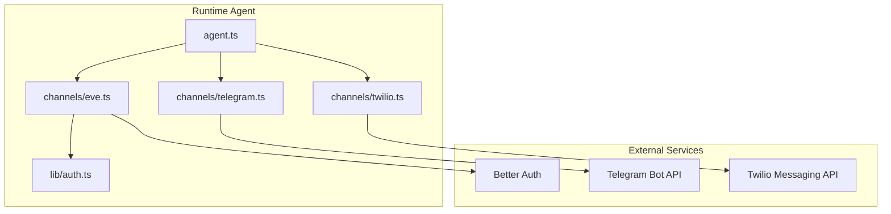
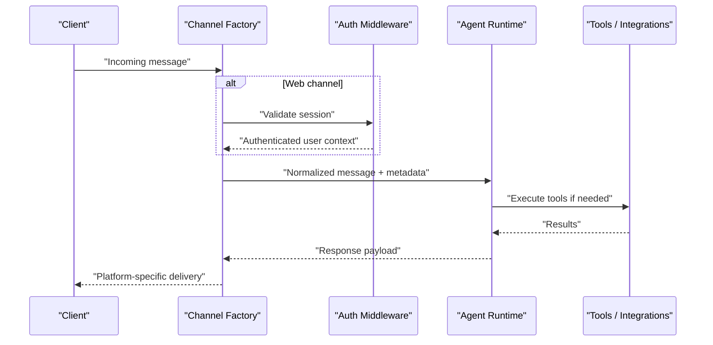
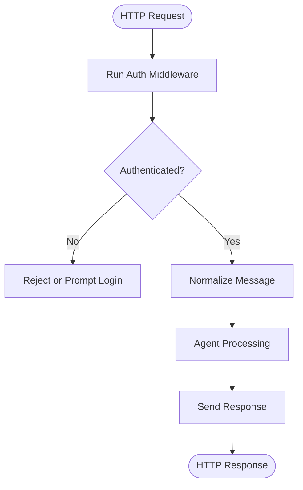
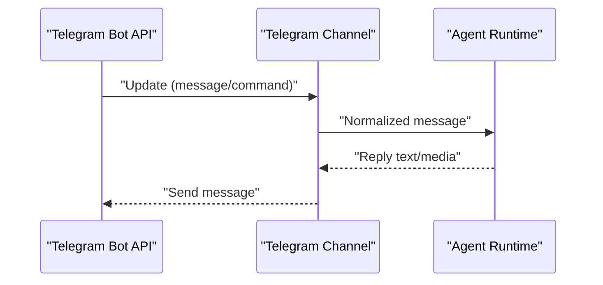
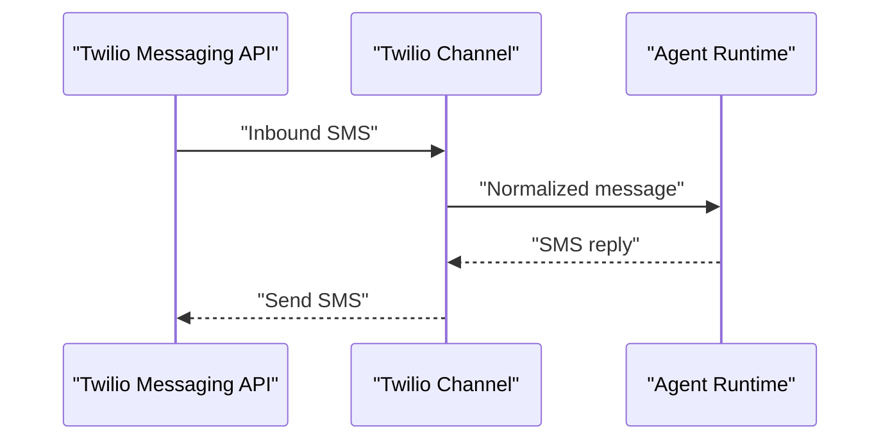
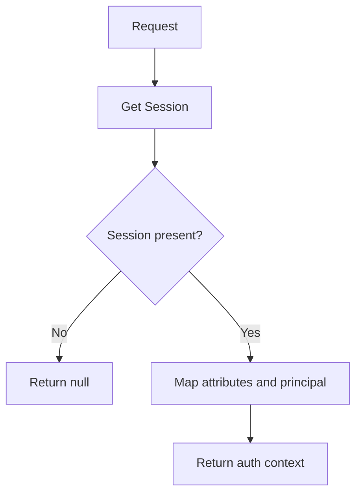
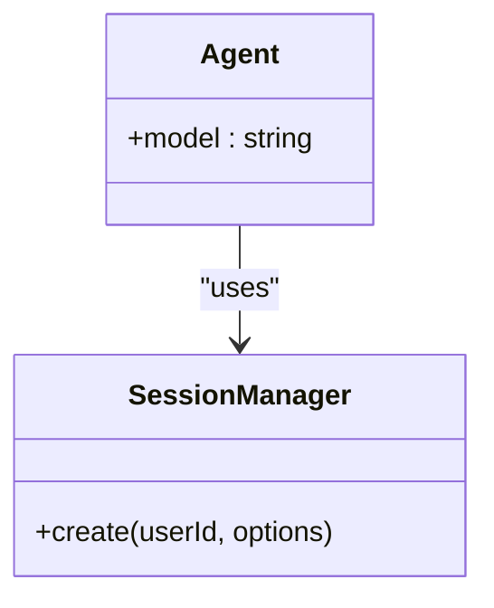
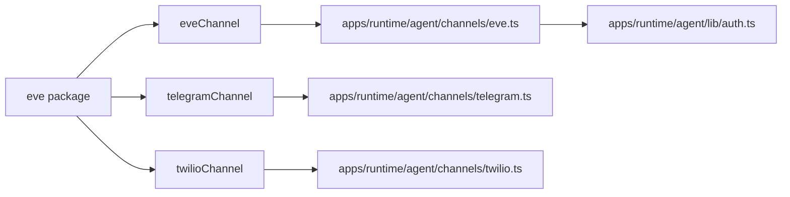

# Channel Abstraction Layer

<cite>
**Referenced Files in This Document**
- [eve.ts](file://apps/runtime/agent/channels/eve.ts)
- [telegram.ts](file://apps/runtime/agent/channels/telegram.ts)
- [twilio.ts](file://apps/runtime/agent/channels/twilio.ts)
- [auth.ts](file://apps/runtime/agent/lib/auth.ts)
- [agent.ts](file://apps/runtime/agent/agent.ts)
- [session.ts](file://apps/runtime/agent/session.ts)
- [package.json](file://apps/runtime/package.json)
- [SKILL.md](file://.agents/skills/eve/SKILL.md)
</cite>

## Table of Contents

1. [Introduction](#introduction)
2. [Project Structure](#project-structure)
3. [Core Components](#core-components)
4. [Architecture Overview](#architecture-overview)
5. [Detailed Component Analysis](#detailed-component-analysis)
6. [Dependency Analysis](#dependency-analysis)
7. [Performance Considerations](#performance-considerations)
8. [Troubleshooting Guide](#troubleshooting-guide)
9. [Conclusion](#conclusion)
10. [Appendices](#appendices)

## Introduction

This document explains the channel abstraction layer that enables unified message processing across multiple platforms: web (Eve), Telegram, and SMS (Twilio). It covers the channel interface design, message format standardization, event handling patterns, and per-channel configuration. It also provides guidance for implementing custom channels, handling channel-specific features, managing connectivity, scaling, load balancing, and troubleshooting channel-specific issues.

The runtime integrates with the Eve framework to define an agent and expose multiple channels through a consistent interface. Each channel is configured via a factory function provided by the framework, allowing platform-specific options while preserving a uniform message model at the application boundary.

## Project Structure

At a high level, the channel layer lives under apps/runtime/agent/channels and wires into the agent defined in apps/runtime/agent/agent.ts. Authentication for the web channel is implemented in apps/runtime/agent/lib/auth.ts and leverages Better Auth. The project depends on the eve package for channel factories and agent runtime.

**Diagram sources**

- [agent.ts:1-8](file://apps/runtime/agent/agent.ts#L1-L8)
- [eve.ts:1-9](file://apps/runtime/agent/channels/eve.ts#L1-L9)
- [telegram.ts:1-5](file://apps/runtime/agent/channels/telegram.ts#L1-L5)
- [twilio.ts:1-6](file://apps/runtime/agent/channels/twilio.ts#L1-L6)
- [auth.ts:1-26](file://apps/runtime/agent/lib/auth.ts#L1-L26)

**Section sources**

- [agent.ts:1-8](file://apps/runtime/agent/agent.ts#L1-L8)
- [package.json:15-24](file://apps/runtime/package.json#L15-L24)

## Core Components

- Channel factories:
  - Web channel via Eve channel factory
  - Telegram channel via Telegram factory
  - SMS channel via Twilio factory
- Authentication integration for the web channel using Better Auth
- Agent definition that ties channels to the AI agent runtime

Key responsibilities:

- Normalize incoming messages from each channel into a common model consumed by the agent
- Route outbound responses back to the originating channel
- Provide per-channel configuration (credentials, allowed origins, messaging sender identity)
- Expose a consistent interface for tools and session management

**Section sources**

- [eve.ts:1-9](file://apps/runtime/agent/channels/eve.ts#L1-L9)
- [telegram.ts:1-5](file://apps/runtime/agent/channels/telegram.ts#L1-L5)
- [twilio.ts:1-6](file://apps/runtime/agent/channels/twilio.ts#L1-L6)
- [auth.ts:1-26](file://apps/runtime/agent/lib/auth.ts#L1-L26)
- [agent.ts:1-8](file://apps/runtime/agent/agent.ts#L1-L8)

## Architecture Overview

The architecture centers around the Eve framework’s channel abstractions. Each channel file configures a specific transport and exposes it to the agent runtime. The web channel adds authentication middleware, while Telegram and Twilio channels configure credentials and platform-specific settings.

**Diagram sources**

- [eve.ts:1-9](file://apps/runtime/agent/channels/eve.ts#L1-L9)
- [auth.ts:1-26](file://apps/runtime/agent/lib/auth.ts#L1-L26)
- [agent.ts:1-8](file://apps/runtime/agent/agent.ts#L1-L8)

## Detailed Component Analysis

### Web Channel (Eve)

- Purpose: Provides a web-based channel with CORS enabled and integrated authentication.
- Configuration:
  - Enables CORS
  - Chains multiple auth strategies including Better Auth, Vercel OIDC, and local dev mode
- Authentication:
  - Extracts session via Better Auth and maps it to Eve’s expected attributes and principal identifiers
- Event handling:
  - Normalizes HTTP requests into agent messages and returns responses over the same channel

**Diagram sources**

- [eve.ts:1-9](file://apps/runtime/agent/channels/eve.ts#L1-L9)
- [auth.ts:1-26](file://apps/runtime/agent/lib/auth.ts#L1-L26)

**Section sources**

- [eve.ts:1-9](file://apps/runtime/agent/channels/eve.ts#L1-L9)
- [auth.ts:1-26](file://apps/runtime/agent/lib/auth.ts#L1-L26)

### Telegram Channel

- Purpose: Connects the agent to Telegram via a bot token.
- Configuration:
  - Supplies a bot token resolver from environment variables
- Event handling:
  - Receives updates from Telegram and forwards them to the agent
  - Sends replies back through the Telegram Bot API

**Diagram sources**

- [telegram.ts:1-5](file://apps/runtime/agent/channels/telegram.ts#L1-L5)
- [agent.ts:1-8](file://apps/runtime/agent/agent.ts#L1-L8)

**Section sources**

- [telegram.ts:1-5](file://apps/runtime/agent/channels/telegram.ts#L1-L5)

### Twilio SMS Channel

- Purpose: Enables SMS messaging via Twilio.
- Configuration:
  - Sets allowed senders and the “from” phone number from environment variables
- Event handling:
  - Inbound SMS triggers agent processing
  - Outbound SMS delivered via Twilio Messaging API

**Diagram sources**

- [twilio.ts:1-6](file://apps/runtime/agent/channels/twilio.ts#L1-L6)
- [agent.ts:1-8](file://apps/runtime/agent/agent.ts#L1-L8)

**Section sources**

- [twilio.ts:1-6](file://apps/runtime/agent/channels/twilio.ts#L1-L6)

### Authentication Integration (Web)

- Purpose: Bridges Better Auth sessions into Eve’s channel auth pipeline.
- Behavior:
  - Reads session from request headers
  - Maps user attributes and identifies principal type and issuer
  - Returns null when no session exists, causing downstream rejection or redirect

**Diagram sources**

- [auth.ts:1-26](file://apps/runtime/agent/lib/auth.ts#L1-L26)

**Section sources**

- [auth.ts:1-26](file://apps/runtime/agent/lib/auth.ts#L1-L26)

### Agent Definition and Tooling

- Purpose: Defines the AI model used by the agent and connects tools/integrations.
- Notes:
  - The agent uses a specified model provider
  - Session creation for tool integrations is handled via Composio with an Eve provider

**Diagram sources**

- [agent.ts:1-8](file://apps/runtime/agent/agent.ts#L1-L8)
- [session.ts:1-19](file://apps/runtime/agent/session.ts#L1-L19)

**Section sources**

- [agent.ts:1-8](file://apps/runtime/agent/agent.ts#L1-L8)
- [session.ts:1-19](file://apps/runtime/agent/session.ts#L1-L19)

## Dependency Analysis

- The runtime depends on the eve package for channel factories and agent runtime.
- Channels import their respective factories from the eve package and configure them with environment-driven credentials.
- The web channel composes multiple auth strategies, one of which relies on Better Auth.

**Diagram sources**

- [package.json:15-24](file://apps/runtime/package.json#L15-L24)
- [eve.ts:1-9](file://apps/runtime/agent/channels/eve.ts#L1-L9)
- [telegram.ts:1-5](file://apps/runtime/agent/channels/telegram.ts#L1-L5)
- [twilio.ts:1-6](file://apps/runtime/agent/channels/twilio.ts#L1-L6)
- [auth.ts:1-26](file://apps/runtime/agent/lib/auth.ts#L1-L26)

**Section sources**

- [package.json:15-24](file://apps/runtime/package.json#L15-L24)

## Performance Considerations

- Rate limiting:
  - Configure per-channel rate limits at the platform level (e.g., Telegram Bot API rate limits, Twilio throttling policies) and within the agent’s response generation to avoid exceeding quotas.
- Concurrency:
  - Use asynchronous processing for long-running tool calls; ensure channels can handle concurrent inbound messages without blocking.
- Caching:
  - Cache frequent lookups (e.g., user profiles, flight availability) to reduce external API calls.
- Backpressure:
  - Implement queues or worker pools for heavy workloads to prevent memory pressure and maintain responsiveness.
- Observability:
  - Add metrics and logging around message throughput, latency, and error rates per channel.

[No sources needed since this section provides general guidance]

## Troubleshooting Guide

- Web channel authentication failures:
  - Verify session retrieval and attribute mapping; ensure CORS is enabled and origin matches client expectations.
- Telegram connectivity:
  - Confirm bot token is set and accessible; check webhook registration and polling status; inspect error logs from Telegram updates.
- Twilio messaging errors:
  - Validate “from” phone number and allowed senders; verify account credentials and SMS quota; review delivery receipts and error codes.
- Common diagnostics:
  - Log normalized messages and responses to confirm data shape consistency across channels.
  - Inspect environment variables and secrets for correctness.
  - Use health checks to validate channel readiness before routing traffic.

**Section sources**

- [eve.ts:1-9](file://apps/runtime/agent/channels/eve.ts#L1-L9)
- [telegram.ts:1-5](file://apps/runtime/agent/channels/telegram.ts#L1-L5)
- [twilio.ts:1-6](file://apps/runtime/agent/channels/twilio.ts#L1-L6)
- [auth.ts:1-26](file://apps/runtime/agent/lib/auth.ts#L1-L26)

## Conclusion

The channel abstraction layer provides a unified interface for processing messages from web, Telegram, and SMS channels. By leveraging Eve’s channel factories and integrating authentication where required, the system normalizes inputs and routes outputs consistently to the agent. Proper configuration, observability, and rate limiting ensure reliable operation across platforms. Extensibility is straightforward: implement new channels using the provided factories and adhere to the normalized message model.

[No sources needed since this section summarizes without analyzing specific files]

## Appendices

### Implementing a Custom Channel

- Steps:
  - Import the appropriate channel factory from the eve package
  - Configure credentials and platform-specific options
  - Ensure normalization of inbound messages and formatting of outbound responses
  - Integrate with authentication if applicable
  - Test with sample payloads and monitor error paths

[No sources needed since this section provides general guidance]

### Managing Connectivity

- Health checks:
  - Periodically ping external services to detect outages
- Retry and fallback:
  - Implement exponential backoff and circuit breakers for transient failures
- Secrets management:
  - Store tokens and keys securely; rotate regularly

[No sources needed since this section provides general guidance]

### Scaling and Load Balancing

- Horizontal scaling:
  - Run multiple instances behind a load balancer; ensure stateless processing or shared state via external stores
- Queue-based processing:
  - Offload heavy tasks to background workers
- Auto-scaling:
  - Scale based on queue depth and CPU/memory utilization

[No sources needed since this section provides general guidance]

### References

- Eve framework usage and documentation location guidance

**Section sources**

- [SKILL.md:1-21](file://.agents/skills/eve/SKILL.md#L1-L21)
