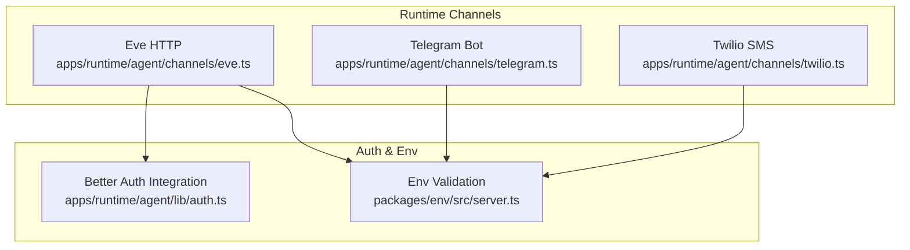
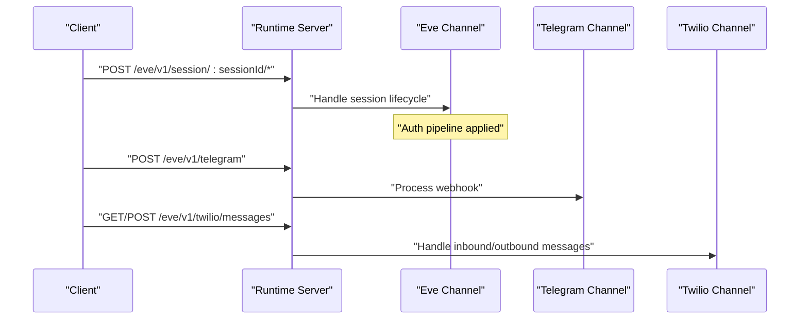
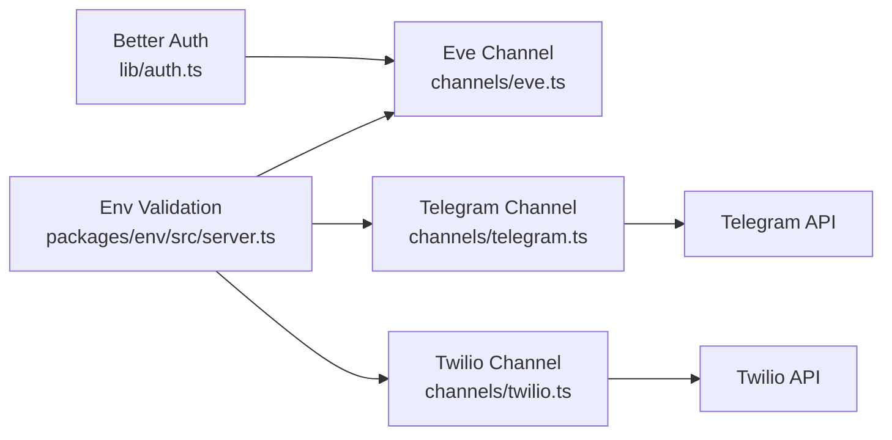

# Channel Configuration

<cite>
**Referenced Files in This Document**
- [eve.ts](file://apps/runtime/agent/channels/eve.ts)
- [telegram.ts](file://apps/runtime/agent/channels/telegram.ts)
- [twilio.ts](file://apps/runtime/agent/channels/twilio.ts)
- [auth.ts](file://apps/runtime/agent/lib/auth.ts)
- [server.ts](file://packages/env/src/server.ts)
- [package.json](file://apps/runtime/package.json)
- [AGENTS.md](file://apps/runtime/AGENTS.md)
- [agent-summary.json](file://apps/runtime/.eve/agent-summary.json)
</cite>

## Table of Contents

1. [Introduction](#introduction)
2. [Project Structure](#project-structure)
3. [Core Components](#core-components)
4. [Architecture Overview](#architecture-overview)
5. [Detailed Component Analysis](#detailed-component-analysis)
6. [Dependency Analysis](#dependency-analysis)
7. [Performance Considerations](#performance-considerations)
8. [Troubleshooting Guide](#troubleshooting-guide)
9. [Conclusion](#conclusion)
10. [Appendices](#appendices)

## Introduction

This document explains how to configure and operate the runtime’s channels: Eve (HTTP), Telegram, and Twilio SMS. It covers environment variables, authentication credentials, platform-specific settings, connection parameters, rate limiting considerations, error handling options, security best practices, and production deployment requirements for each channel.

## Project Structure

The runtime exposes three channel adapters under apps/runtime/agent/channels:

- Eve HTTP channel with integrated authentication and CORS
- Telegram bot channel using a bot token
- Twilio messaging channel using a sender phone number

Environment variables are centrally validated in packages/env/src/server.ts and consumed by the channels at runtime. The runtime uses the eve framework for building and serving these channels.

**Diagram sources**

- [eve.ts:1-9](file://apps/runtime/agent/channels/eve.ts#L1-L9)
- [telegram.ts:1-5](file://apps/runtime/agent/channels/telegram.ts#L1-L5)
- [twilio.ts:1-6](file://apps/runtime/agent/channels/twilio.ts#L1-L6)
- [auth.ts:1-25](file://apps/runtime/agent/lib/auth.ts#L1-L25)
- [server.ts:1-29](file://packages/env/src/server.ts#L1-L29)

**Section sources**

- [package.json:9-13](file://apps/runtime/package.json#L9-L13)
- [AGENTS.md:1-32](file://apps/runtime/AGENTS.md#L1-L32)

## Core Components

- Eve HTTP channel: Configured with an auth pipeline (Better Auth, Vercel OIDC, local dev) and CORS enabled.
- Telegram channel: Requires a bot token provided via environment variable.
- Twilio channel: Requires a sender phone number from environment variable; includes allowFrom configuration.

Environment variables are validated at startup, ensuring required keys exist and conform to expected formats.

**Section sources**

- [eve.ts:1-9](file://apps/runtime/agent/channels/eve.ts#L1-L9)
- [telegram.ts:1-5](file://apps/runtime/agent/channels/telegram.ts#L1-L5)
- [twilio.ts:1-6](file://apps/runtime/agent/channels/twilio.ts#L1-L6)
- [server.ts:1-29](file://packages/env/src/server.ts#L1-L29)

## Architecture Overview

The runtime exposes endpoints for each channel. The agent summary shows the registered routes for Eve sessions, Telegram webhooks, and Twilio message handlers.

**Diagram sources**

- [agent-summary.json:187-241](file://apps/runtime/.eve/agent-summary.json#L187-L241)

## Detailed Component Analysis

### Eve HTTP Channel

- Purpose: Provides HTTP-based session management with built-in authentication and CORS.
- Authentication: Uses Better Auth to extract user session attributes and identity, plus Vercel OIDC and local development auth strategies.
- CORS: Enabled globally for cross-origin requests.
- Endpoints: Session operations such as clear, reset, and streaming are exposed under /eve/v1/session/:sessionId.

Setup steps:

1. Ensure environment variables for authentication and runtime URL are set.
2. Start the runtime using the provided scripts.
3. Configure your client to call the session endpoints with appropriate headers for authentication.

Security considerations:

- Keep secrets out of code; rely on environment variables.
- Restrict CORS origins in production if needed.
- Use HTTPS in production.

Production notes:

- Validate all environment variables at startup.
- Enable secure cookies and proper session storage.
- Monitor logs and errors from the auth pipeline.

**Section sources**

- [eve.ts:1-9](file://apps/runtime/agent/channels/eve.ts#L1-L9)
- [auth.ts:1-25](file://apps/runtime/agent/lib/auth.ts#L1-L25)
- [agent-summary.json:187-214](file://apps/runtime/.eve/agent-summary.json#L187-L214)

### Telegram Bot Channel

- Purpose: Receives and processes Telegram bot updates via a webhook endpoint.
- Credentials: Requires a bot token provided through an environment variable.
- Endpoint: Webhook is handled at /eve/v1/telegram.

Setup steps:

1. Create a Telegram bot and obtain the bot token.
2. Set TELEGRAM_BOT_TOKEN in your environment.
3. Point Telegram’s webhook to the runtime’s /eve/v1/telegram endpoint.
4. Start the runtime and verify webhook delivery.

Security considerations:

- Store the bot token securely in your environment or secret manager.
- Validate incoming payloads if necessary at the gateway level.

Production notes:

- Ensure the runtime is reachable from Telegram’s servers.
- Use HTTPS for the webhook URL.
- Monitor rate limits imposed by Telegram and handle retries gracefully.

**Section sources**

- [telegram.ts:1-5](file://apps/runtime/agent/channels/telegram.ts#L1-L5)
- [server.ts:1-29](file://packages/env/src/server.ts#L1-L29)
- [agent-summary.json:215-222](file://apps/runtime/.eve/agent-summary.json#L215-L222)

### Twilio SMS Channel

- Purpose: Handles inbound and outbound SMS via Twilio.
- Credentials: Requires a sender phone number from an environment variable and allows configuring allowed senders.
- Endpoints: GET and POST /eve/v1/twilio/messages.

Setup steps:

1. Obtain a Twilio phone number and set TWILIO_PHONE_NUMBER in your environment.
2. Configure the runtime’s messaging “from” address.
3. Set up Twilio webhook to point to the runtime’s /eve/v1/twilio/messages endpoint.
4. Start the runtime and test inbound/outbound messaging.

Security considerations:

- Restrict allowed senders in production by tightening allowFrom.
- Protect the webhook endpoint behind network-level controls if possible.

Production notes:

- Use HTTPS for the webhook URL.
- Implement idempotency for message processing.
- Monitor Twilio usage and costs.

**Section sources**

- [twilio.ts:1-6](file://apps/runtime/agent/channels/twilio.ts#L1-L6)
- [server.ts:1-29](file://packages/env/src/server.ts#L1-L29)
- [agent-summary.json:223-241](file://apps/runtime/.eve/agent-summary.json#L223-L241)

## Dependency Analysis

Channels depend on:

- Environment validation to ensure required keys are present and correctly formatted.
- Authentication integration for the Eve channel.
- External services (Telegram, Twilio) for messaging.

**Diagram sources**

- [server.ts:1-29](file://packages/env/src/server.ts#L1-L29)
- [eve.ts:1-9](file://apps/runtime/agent/channels/eve.ts#L1-L9)
- [telegram.ts:1-5](file://apps/runtime/agent/channels/telegram.ts#L1-L5)
- [twilio.ts:1-6](file://apps/runtime/agent/channels/twilio.ts#L1-L6)
- [auth.ts:1-25](file://apps/runtime/agent/lib/auth.ts#L1-L25)

**Section sources**

- [server.ts:1-29](file://packages/env/src/server.ts#L1-L29)
- [eve.ts:1-9](file://apps/runtime/agent/channels/eve.ts#L1-L9)
- [telegram.ts:1-5](file://apps/runtime/agent/channels/telegram.ts#L1-L5)
- [twilio.ts:1-6](file://apps/runtime/agent/channels/twilio.ts#L1-L6)
- [auth.ts:1-25](file://apps/runtime/agent/lib/auth.ts#L1-L25)

## Performance Considerations

- Rate limiting: Respect external service limits (Telegram and Twilio). Implement backoff and retry logic where applicable.
- Connection parameters: Ensure timeouts and retries are tuned for your deployment environment.
- Error handling: Normalize upstream errors and avoid exposing sensitive details to clients.
- CORS: In production, restrict CORS origins to known domains.

[No sources needed since this section provides general guidance]

## Troubleshooting Guide

Common issues and resolutions:

- Missing environment variables: Startup will fail if required keys are absent due to validation.
- Authentication failures: Verify session retrieval and issuer configuration in the auth pipeline.
- Webhook not receiving events: Confirm public HTTPS URLs and correct endpoint paths for Telegram and Twilio.
- CORS errors: Adjust CORS settings or origin restrictions for browser-based clients.

Operational tips:

- Use the runtime build/start scripts to run consistently across environments.
- Log and monitor channel health and error rates.
- Validate configurations before deploying changes.

**Section sources**

- [server.ts:1-29](file://packages/env/src/server.ts#L1-L29)
- [auth.ts:1-25](file://apps/runtime/agent/lib/auth.ts#L1-L25)
- [package.json:9-13](file://apps/runtime/package.json#L9-L13)

## Conclusion

The runtime provides three channels—Eve HTTP, Telegram, and Twilio—each with specific configuration needs. Securely manage credentials via environment variables, validate them at startup, and follow platform-specific setup steps for webhooks and endpoints. Apply security best practices and tune performance for production use.

[No sources needed since this section summarizes without analyzing specific files]

## Appendices

### Environment Variables Reference

- AI_GATEWAY_API_KEY
- ATLAS_API_URL
- ATLAS_CLIENT_ID
- ATLAS_CLIENT_SECRET
- BETTER_AUTH_SECRET
- BETTER_AUTH_URL
- COMPOSIO_API_KEY
- CORS_ORIGIN
- DATABASE_URL
- GOOGLE_CLIENT_ID
- GOOGLE_CLIENT_SECRET
- NODE_ENV
- RUNTIME_URL
- TELEGRAM_BOT_TOKEN
- TELEGRAM_BOT_USERNAME

These variables are validated at runtime and must be set appropriately for each environment.

**Section sources**

- [server.ts:1-29](file://packages/env/src/server.ts#L1-L29)

### Channel Endpoints Summary

- Eve: /eve/v1/session/:sessionId/* (clear, reset, stream)
- Telegram: /eve/v1/telegram (webhook)
- Twilio: /eve/v1/twilio/messages (GET/POST)

**Section sources**

- [agent-summary.json:187-241](file://apps/runtime/.eve/agent-summary.json#L187-L241)
