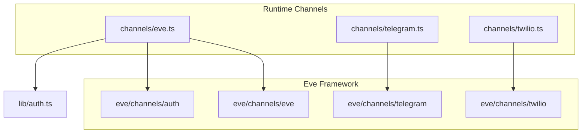
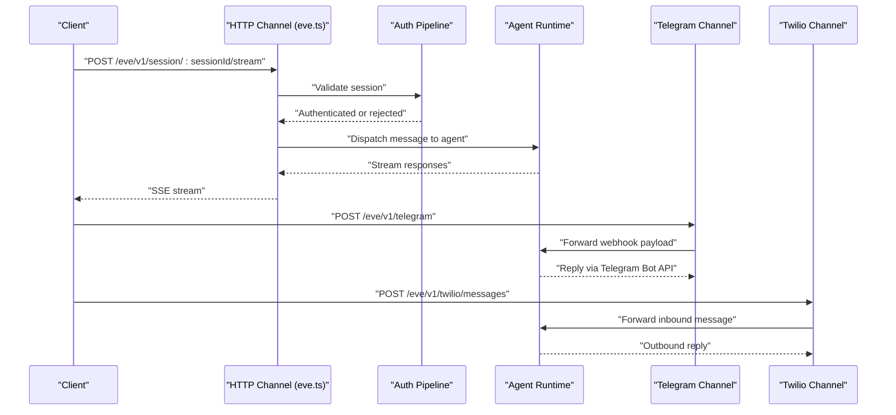
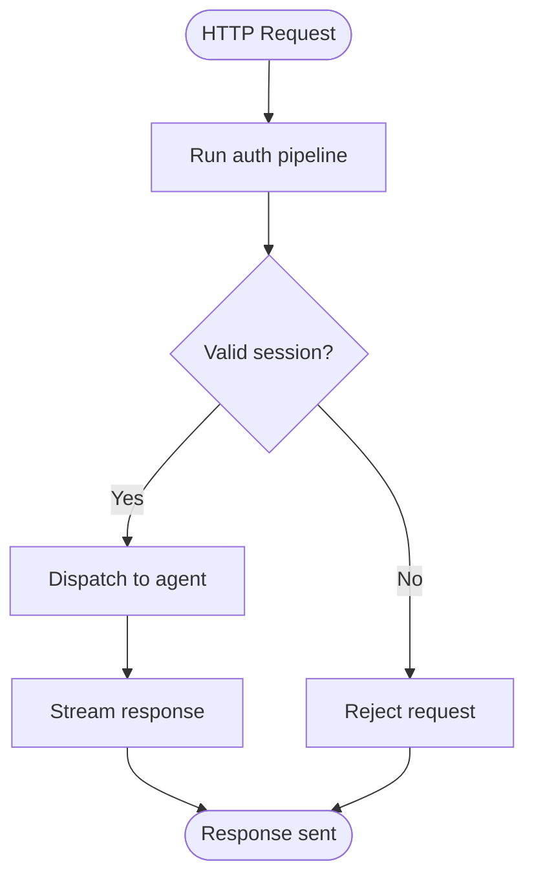
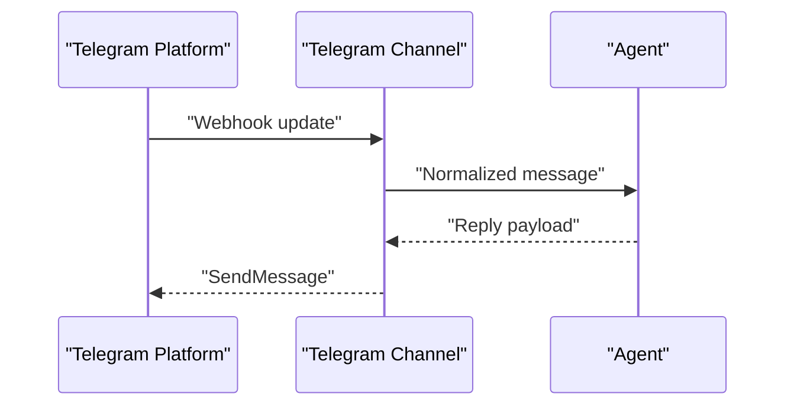
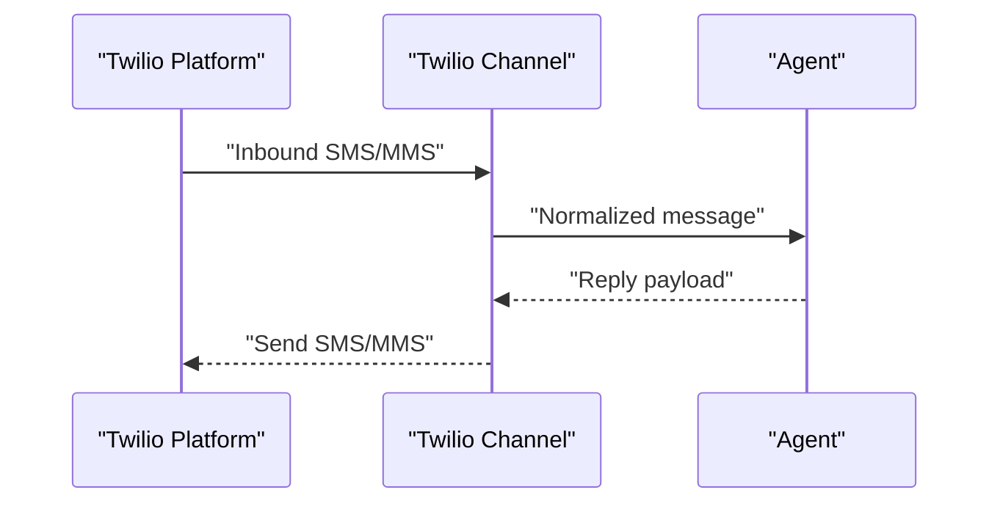
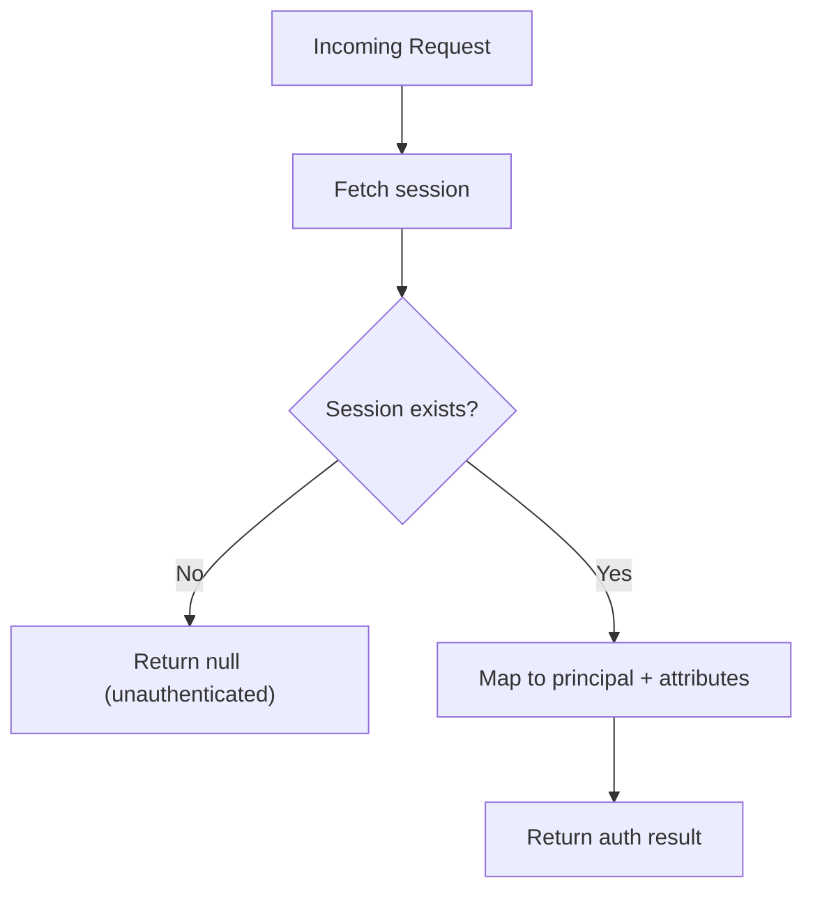
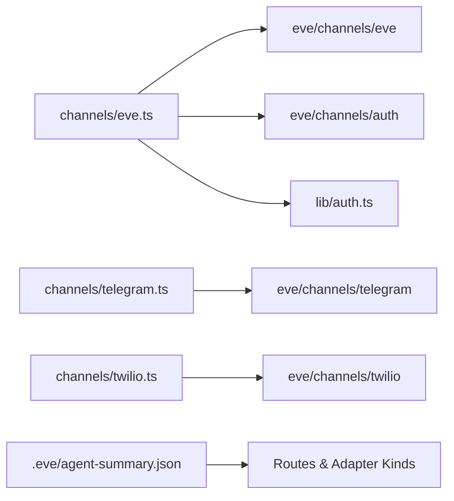

# Channel Interface Design

<cite>
**Referenced Files in This Document**
- [eve.ts](file://apps/runtime/agent/channels/eve.ts)
- [telegram.ts](file://apps/runtime/agent/channels/telegram.ts)
- [twilio.ts](file://apps/runtime/agent/channels/twilio.ts)
- [auth.ts](file://apps/runtime/agent/lib/auth.ts)
- [agent-summary.json](file://apps/runtime/.eve/agent-summary.json)
- [SKILL.md](file://.agents/skills/eve/SKILL.md)
- [AGENTS.md](file://apps/runtime/AGENTS.md)
</cite>

## Table of Contents

1. Introduction
2. Project Structure
3. Core Components
4. Architecture Overview
5. Detailed Component Analysis
6. Dependency Analysis
7. Performance Considerations
8. Troubleshooting Guide
9. Conclusion

## Introduction

This document explains the channel interface design used to standardize communication across different platforms in the runtime agent. The project uses the eve framework, which exposes a consistent channel abstraction for HTTP, Telegram, and Twilio integrations. Each channel is configured via a factory function that accepts platform-specific options while sharing common behaviors such as authentication, routing, and session management.

The goal is to provide a unified way to:

- Define channels with minimal boilerplate
- Standardize message handling and lifecycle events
- Centralize configuration and secrets
- Extend behavior per platform without duplicating logic

## Project Structure

Channels are defined under apps/runtime/agent/channels. Each file wires a specific platform into the eve runtime using its channel factory. The runtime also registers routes and adapter kinds through the eve tooling, which surfaces endpoints for each channel.

**Diagram sources**

- [eve.ts:1-9](file://apps/runtime/agent/channels/eve.ts#L1-L9)
- [telegram.ts:1-5](file://apps/runtime/agent/channels/telegram.ts#L1-L5)
- [twilio.ts:1-6](file://apps/runtime/agent/channels/twilio.ts#L1-L6)
- [auth.ts:1-26](file://apps/runtime/agent/lib/auth.ts#L1-L26)

**Section sources**

- [eve.ts:1-9](file://apps/runtime/agent/channels/eve.ts#L1-L9)
- [telegram.ts:1-5](file://apps/runtime/agent/channels/telegram.ts#L1-L5)
- [twilio.ts:1-6](file://apps/runtime/agent/channels/twilio.ts#L1-L6)
- [SKILL.md:1-21](file://.agents/skills/eve/SKILL.md#L1-L21)

## Core Components

- Eve HTTP channel: Provides session management, streaming, and REST endpoints for the agent. Configured with auth strategies and CORS.
- Telegram channel: Connects to Telegram via bot token credentials.
- Twilio channel: Handles SMS/MMS messaging with sender identity and allowlist settings.
- Auth integration: Bridges Better-Auth sessions into the eve channel auth pipeline.

Key responsibilities:

- Configuration: Each channel receives a typed config object from its factory.
- Authentication: The HTTP channel composes multiple auth strategies; custom auth can be injected.
- Routing: The runtime maps channels to URL paths and methods.

**Section sources**

- [eve.ts:1-9](file://apps/runtime/agent/channels/eve.ts#L1-L9)
- [telegram.ts:1-5](file://apps/runtime/agent/channels/telegram.ts#L1-L5)
- [twilio.ts:1-6](file://apps/runtime/agent/channels/twilio.ts#L1-L6)
- [auth.ts:1-26](file://apps/runtime/agent/lib/auth.ts#L1-L26)

## Architecture Overview

The runtime exposes three channel adapters, each backed by an eve channel factory. The HTTP channel additionally integrates application-level authentication and CORS. The eve tooling generates route entries that map logical channel files to concrete endpoints.

**Diagram sources**

- [agent-summary.json:187-241](file://apps/runtime/.eve/agent-summary.json#L187-L241)
- [eve.ts:1-9](file://apps/runtime/agent/channels/eve.ts#L1-L9)
- [telegram.ts:1-5](file://apps/runtime/agent/channels/telegram.ts#L1-L5)
- [twilio.ts:1-6](file://apps/runtime/agent/channels/twilio.ts#L1-L6)

## Detailed Component Analysis

### HTTP Channel (Eve)

- Purpose: Exposes session-based HTTP APIs including clear, reset, and streaming endpoints.
- Configuration:
  - auth: Array of auth strategies composed together.
  - cors: Boolean flag to enable CORS.
- Authentication:
  - Integrates Better-Auth session extraction and returns standardized principal attributes.
  - Also supports Vercel OIDC and local dev auth helpers provided by the framework.
- Typical flow:
  - Request arrives at session endpoints.
  - Auth middleware validates the session.
  - Agent processes the request and streams results back.

**Diagram sources**

- [eve.ts:1-9](file://apps/runtime/agent/channels/eve.ts#L1-L9)
- [auth.ts:1-26](file://apps/runtime/agent/lib/auth.ts#L1-L26)

**Section sources**

- [eve.ts:1-9](file://apps/runtime/agent/channels/eve.ts#L1-L9)
- [auth.ts:1-26](file://apps/runtime/agent/lib/auth.ts#L1-L26)
- [agent-summary.json:187-214](file://apps/runtime/.eve/agent-summary.json#L187-L214)

### Telegram Channel

- Purpose: Receives and replies to messages via Telegram Bot API.
- Configuration:
  - credentials.botToken: Resolved at runtime from environment variables.
- Behavior:
  - Webhook endpoint forwards incoming updates to the agent.
  - Replies are sent through the Telegram Bot API on behalf of the configured bot.

**Diagram sources**

- [telegram.ts:1-5](file://apps/runtime/agent/channels/telegram.ts#L1-L5)
- [agent-summary.json:215-222](file://apps/runtime/.eve/agent-summary.json#L215-L222)

**Section sources**

- [telegram.ts:1-5](file://apps/runtime/agent/channels/telegram.ts#L1-L5)
- [agent-summary.json:215-222](file://apps/runtime/.eve/agent-summary.json#L215-L222)

### Twilio Channel

- Purpose: Inbound/outbound messaging via Twilio.
- Configuration:
  - allowFrom: Controls allowed senders.
  - messaging.from: Sender phone number used for outbound replies.
- Behavior:
  - Webhook endpoints handle inbound messages and status callbacks.
  - Outbound replies use the configured sender identity.

**Diagram sources**

- [twilio.ts:1-6](file://apps/runtime/agent/channels/twilio.ts#L1-L6)
- [agent-summary.json:223-241](file://apps/runtime/.eve/agent-summary.json#L223-L241)

**Section sources**

- [twilio.ts:1-6](file://apps/runtime/agent/channels/twilio.ts#L1-L6)
- [agent-summary.json:223-241](file://apps/runtime/.eve/agent-summary.json#L223-L241)

### Authentication Integration

- Purpose: Extracts authenticated user context from Better-Auth sessions and maps it to the eve channel auth contract.
- Output:
  - Principal identifier and type.
  - Attributes such as email, name, and optional picture.
  - Issuer and authenticator metadata.

**Diagram sources**

- [auth.ts:1-26](file://apps/runtime/agent/lib/auth.ts#L1-L26)

**Section sources**

- [auth.ts:1-26](file://apps/runtime/agent/lib/auth.ts#L1-L26)

## Dependency Analysis

- Channel factories:
  - eveChannel, telegramChannel, twilioChannel are imported from the eve package and invoked with platform-specific configs.
- Auth composition:
  - The HTTP channel composes multiple auth strategies, including a custom Better-Auth handler.
- Route registration:
  - The runtime’s agent summary shows how each channel maps to HTTP endpoints and adapter kinds.

**Diagram sources**

- [eve.ts:1-9](file://apps/runtime/agent/channels/eve.ts#L1-L9)
- [telegram.ts:1-5](file://apps/runtime/agent/channels/telegram.ts#L1-L5)
- [twilio.ts:1-6](file://apps/runtime/agent/channels/twilio.ts#L1-L6)
- [auth.ts:1-26](file://apps/runtime/agent/lib/auth.ts#L1-L26)
- [agent-summary.json:187-241](file://apps/runtime/.eve/agent-summary.json#L187-L241)

**Section sources**

- [eve.ts:1-9](file://apps/runtime/agent/channels/eve.ts#L1-L9)
- [telegram.ts:1-5](file://apps/runtime/agent/channels/telegram.ts#L1-L5)
- [twilio.ts:1-6](file://apps/runtime/agent/channels/twilio.ts#L1-L6)
- [auth.ts:1-26](file://apps/runtime/agent/lib/auth.ts#L1-L26)
- [agent-summary.json:187-241](file://apps/runtime/.eve/agent-summary.json#L187-L241)

## Performance Considerations

- Streaming: The HTTP channel provides a streaming endpoint suitable for long-running agent interactions; prefer streaming over polling where possible.
- Auth overhead: Composing multiple auth strategies adds validation steps; ensure only necessary strategies are enabled in production.
- Credential resolution: Resolve secrets lazily (e.g., via functions) to avoid unnecessary lookups during cold starts.
- Rate limits: Respect platform rate limits for Telegram and Twilio when sending replies.

[No sources needed since this section provides general guidance]

## Troubleshooting Guide

- Unauthenticated requests:
  - Ensure the session exists and the auth pipeline returns a valid principal.
  - Verify CORS is enabled if calling from browsers.
- Missing credentials:
  - Confirm environment variables for Telegram bot token and Twilio phone number are set.
- Endpoint not found:
  - Validate that the channel files are present and the runtime has registered routes.
- Unexpected sender:
  - For Twilio, check allowFrom configuration to ensure the sender is permitted.

**Section sources**

- [eve.ts:1-9](file://apps/runtime/agent/channels/eve.ts#L1-L9)
- [telegram.ts:1-5](file://apps/runtime/agent/channels/telegram.ts#L1-L5)
- [twilio.ts:1-6](file://apps/runtime/agent/channels/twilio.ts#L1-L6)
- [auth.ts:1-26](file://apps/runtime/agent/lib/auth.ts#L1-L26)
- [agent-summary.json:187-241](file://apps/runtime/.eve/agent-summary.json#L187-L241)

## Conclusion

The channel interface design leverages the eve framework to unify cross-platform communication. By configuring each channel with a factory function, the runtime achieves consistent behavior for authentication, routing, and message handling while preserving platform-specific capabilities. This approach simplifies adding new channels and ensures predictable operation across HTTP, Telegram, and Twilio.

[No sources needed since this section summarizes without analyzing specific files]
