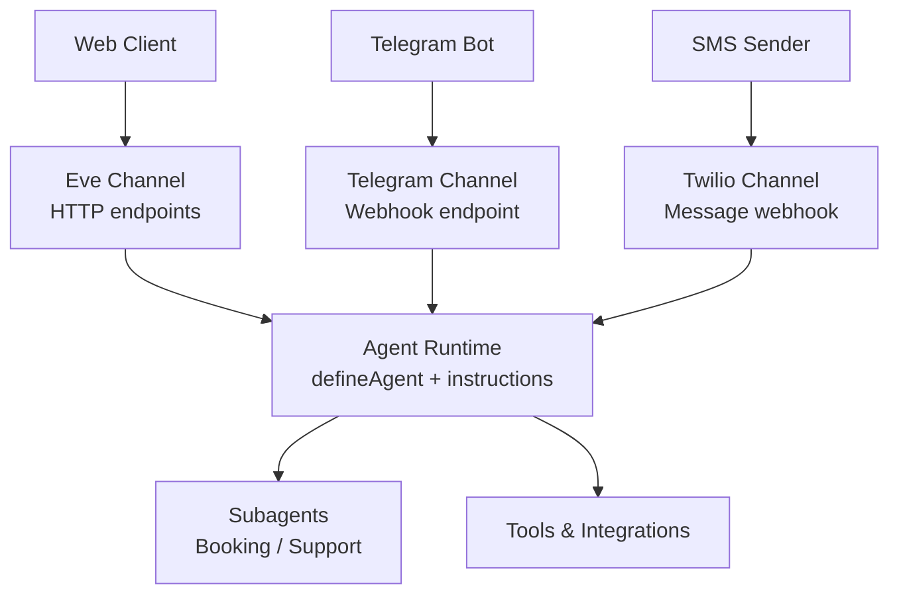
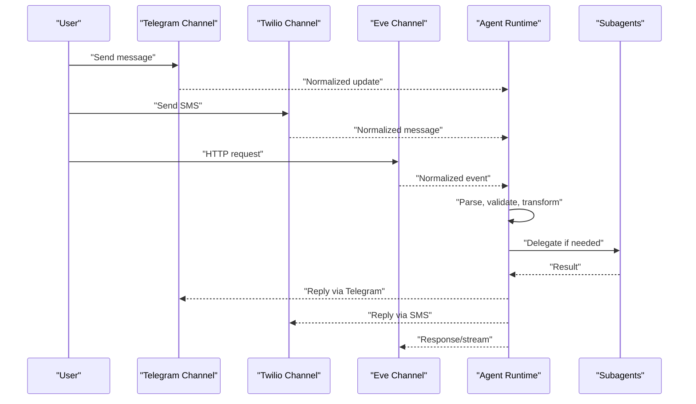
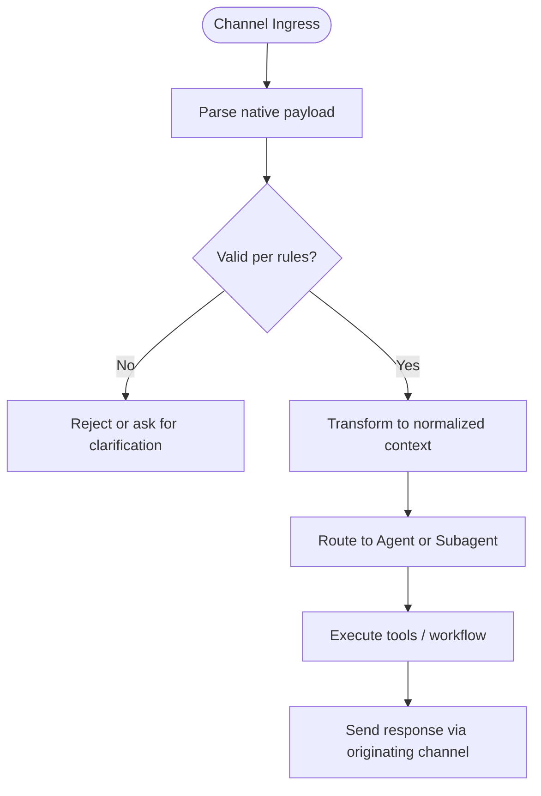
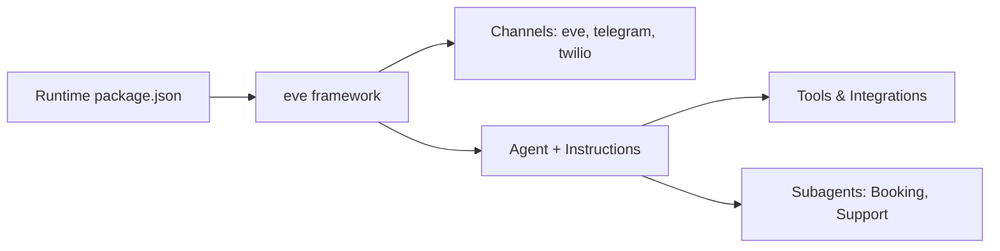

# Message Routing System

<cite>
**Referenced Files in This Document**
- [agent.ts](file://apps/runtime/agent/agent.ts)
- [instructions.md](file://apps/runtime/agent/instructions.md)
- [eve.ts](file://apps/runtime/agent/channels/eve.ts)
- [telegram.ts](file://apps/runtime/agent/channels/telegram.ts)
- [twilio.ts](file://apps/runtime/agent/channels/twilio.ts)
- [disruption-monitor.ts](file://apps/runtime/agent/schedules/disruption-monitor.ts)
- [booking-agent.ts](file://apps/runtime/agent/subagents/booking/agent.ts)
- [support-agent.ts](file://apps/runtime/agent/subagents/support/agent.ts)
- [package.json](file://apps/runtime/package.json)
</cite>

## Table of Contents

1. [Introduction](#introduction)
2. [Project Structure](#project-structure)
3. [Core Components](#core-components)
4. [Architecture Overview](#architecture-overview)
5. [Detailed Component Analysis](#detailed-component-analysis)
6. [Dependency Analysis](#dependency-analysis)
7. [Performance Considerations](#performance-considerations)
8. [Troubleshooting Guide](#troubleshooting-guide)
9. [Conclusion](#conclusion)

## Introduction

This document explains the message routing system that ingests incoming messages from multiple channels (web, Telegram, SMS), normalizes them into a common format, and routes them to the AI agent processing pipeline. It covers how channels are configured, how messages flow through the runtime, and how subagents handle specialized tasks. Where applicable, it also addresses queuing, retries, and dead letter handling based on available code and framework conventions.

## Project Structure

The runtime application is built with the eve framework and exposes multiple channels:

- Web channel via an HTTP-based Eve channel
- Telegram channel for bot updates
- Twilio channel for SMS webhooks
- Schedules that can proactively send messages to channels
- Subagents for domain-specific workflows (booking, support)

**Diagram sources**

- [eve.ts:1-9](file://apps/runtime/agent/channels/eve.ts#L1-L9)
- [telegram.ts:1-5](file://apps/runtime/agent/channels/telegram.ts#L1-L5)
- [twilio.ts:1-6](file://apps/runtime/agent/channels/twilio.ts#L1-L6)
- [agent.ts:1-7](file://apps/runtime/agent/agent.ts#L1-L7)
- [instructions.md:1-38](file://apps/runtime/agent/instructions.md#L1-L38)
- [booking-agent.ts:1-8](file://apps/runtime/agent/subagents/booking/agent.ts#L1-L8)
- [support-agent.ts:1-8](file://apps/runtime/agent/subagents/support/agent.ts#L1-L8)

**Section sources**

- [package.json:1-30](file://apps/runtime/package.json#L1-L30)
- [agent.ts:1-7](file://apps/runtime/agent/agent.ts#L1-L7)
- [instructions.md:1-38](file://apps/runtime/agent/instructions.md#L1-L38)

## Core Components

- Channels:
  - Eve (web): Configured with authentication options and CORS enabled; exposes HTTP endpoints for sessions and streaming.
  - Telegram: Configured with a bot token provider; receives updates via a webhook endpoint.
  - Twilio: Configured with allowed origins and messaging sender identity; receives SMS webhooks.
- Agent:
  - Main agent definition selects the model and orchestrates tool usage and subagent delegation.
- Instructions:
  - Define the conversation workflow, safety rules, and when to delegate to subagents.
- Subagents:
  - Booking agent handles end-to-end flight booking flows.
  - Support agent handles post-booking operations like order status, refunds, and disruptions.

**Section sources**

- [eve.ts:1-9](file://apps/runtime/agent/channels/eve.ts#L1-L9)
- [telegram.ts:1-5](file://apps/runtime/agent/channels/telegram.ts#L1-L5)
- [twilio.ts:1-6](file://apps/runtime/agent/channels/twilio.ts#L1-L6)
- [agent.ts:1-7](file://apps/runtime/agent/agent.ts#L1-L7)
- [instructions.md:1-38](file://apps/runtime/agent/instructions.md#L1-L38)
- [booking-agent.ts:1-8](file://apps/runtime/agent/subagents/booking/agent.ts#L1-L8)
- [support-agent.ts:1-8](file://apps/runtime/agent/subagents/support/agent.ts#L1-L8)

## Architecture Overview

Incoming messages from different channels are normalized by their respective channel adapters and then routed to the central agent runtime. The agent uses its instructions to decide whether to process the request directly or delegate to a subagent. Responses are sent back over the originating channel.

**Diagram sources**

- [telegram.ts:1-5](file://apps/runtime/agent/channels/telegram.ts#L1-L5)
- [twilio.ts:1-6](file://apps/runtime/agent/channels/twilio.ts#L1-L6)
- [eve.ts:1-9](file://apps/runtime/agent/channels/eve.ts#L1-L9)
- [agent.ts:1-7](file://apps/runtime/agent/agent.ts#L1-L7)
- [instructions.md:1-38](file://apps/runtime/agent/instructions.md#L1-L38)

## Detailed Component Analysis

### Channel Configuration and Normalization

- Eve (web) channel:
  - Enables authentication strategies and CORS.
  - Exposes session management and streaming endpoints used by clients.
- Telegram channel:
  - Uses a bot token provider to authenticate with Telegram.
  - Receives updates at a webhook endpoint and forwards them to the agent.
- Twilio channel:
  - Accepts messages from any sender and sets the outbound phone number.
  - Receives SMS webhooks and forwards them to the agent.

These configurations ensure that each channel’s native payload is accepted and passed into the runtime where normalization occurs before further processing.

**Section sources**

- [eve.ts:1-9](file://apps/runtime/agent/channels/eve.ts#L1-L9)
- [telegram.ts:1-5](file://apps/runtime/agent/channels/telegram.ts#L1-L5)
- [twilio.ts:1-6](file://apps/runtime/agent/channels/twilio.ts#L1-L6)

### Agent Orchestration and Delegation

- The main agent defines the model and acts as the entry point for all normalized messages.
- Instructions define:
  - A strict booking workflow (search, verify, optional services, create order, confirm, pay, track).
  - Delegation rules to subagents for complex journeys or post-booking tasks.
  - Safety rules to prevent unsafe retries or data exposure.

Delegation examples:

- Booking agent: Handles end-to-end booking flows with user approvals at gated steps.
- Support agent: Handles order lookups, disruption checks, refunds, voids, and ticketing holds.

**Section sources**

- [agent.ts:1-7](file://apps/runtime/agent/agent.ts#L1-L7)
- [instructions.md:1-38](file://apps/runtime/agent/instructions.md#L1-L38)
- [booking-agent.ts:1-8](file://apps/runtime/agent/subagents/booking/agent.ts#L1-L8)
- [support-agent.ts:1-8](file://apps/runtime/agent/subagents/support/agent.ts#L1-L8)

### Message Parsing, Validation, and Transformation

- Parsing: Each channel adapter parses its native payload (e.g., Telegram update, Twilio webhook, HTTP request) into a common internal representation consumed by the agent.
- Validation: The agent enforces safety rules and workflow constraints defined in instructions before executing tools or delegating.
- Transformation: Messages are transformed into context suitable for tools and subagents, including passing identifiers (routingIdentifier, sessionId, orderNo) exactly as received.

[No sources needed since this diagram shows conceptual workflow, not actual code structure]

### Custom Handlers, Routing Rules, and Filtering

- Routing rules:
  - The agent’s instructions determine when to delegate to subagents versus handling requests directly.
  - Schedules can trigger proactive messages to channels (e.g., checking incidents and reporting via Telegram).
- Filtering mechanisms:
  - Channel-level filters (e.g., allowing specific senders or enabling CORS) reduce noise.
  - Instruction-driven filtering ensures only relevant actions proceed (e.g., confirming exact order numbers before changes).

Example: A scheduled job sends a prompt to Telegram to check for new incidents and report only those not previously mentioned.

**Section sources**

- [instructions.md:17-31](file://apps/runtime/agent/instructions.md#L17-L31)
- [disruption-monitor.ts:1-20](file://apps/runtime/agent/schedules/disruption-monitor.ts#L1-L20)

### Queuing, Retry Logic, and Dead Letter Handling

- Queuing:
  - The runtime relies on the underlying platform and framework to manage concurrency and delivery semantics. No explicit queue configuration is present in the analyzed files.
- Retry logic:
  - Safety rules explicitly prohibit automatic retries for critical operations such as order creation, payment, refunds, voids, and regeneration.
  - For non-critical reads or checks, re-execution should be guided by user confirmation or explicit triggers.
- Dead letter handling:
  - There is no visible dead-letter queue implementation in the analyzed files. Failed deliveries or errors should be surfaced through logs and monitoring provided by the hosting environment and framework.

Recommendations:

- Use idempotency keys for sensitive operations to safely retry when appropriate.
- Implement explicit error boundaries and logging around tool calls to capture failures for later inspection.
- Add a dedicated handler for failed messages if long-term reliability requires persistence and replay.

**Section sources**

- [instructions.md:32-37](file://apps/runtime/agent/instructions.md#L32-L37)

## Dependency Analysis

The runtime depends on the eve framework for channel adapters, agent orchestration, and scheduling. Dependencies include authentication integrations and external toolkits via Composio.

**Diagram sources**

- [package.json:15-24](file://apps/runtime/package.json#L15-L24)
- [eve.ts:1-9](file://apps/runtime/agent/channels/eve.ts#L1-L9)
- [telegram.ts:1-5](file://apps/runtime/agent/channels/telegram.ts#L1-L5)
- [twilio.ts:1-6](file://apps/runtime/agent/channels/twilio.ts#L1-L6)
- [agent.ts:1-7](file://apps/runtime/agent/agent.ts#L1-L7)
- [instructions.md:1-38](file://apps/runtime/agent/instructions.md#L1-L38)
- [booking-agent.ts:1-8](file://apps/runtime/agent/subagents/booking/agent.ts#L1-L8)
- [support-agent.ts:1-8](file://apps/runtime/agent/subagents/support/agent.ts#L1-L8)

**Section sources**

- [package.json:15-24](file://apps/runtime/package.json#L15-L24)

## Performance Considerations

- Prefer direct handling for simple read-only queries to avoid subagent overhead.
- Use streaming endpoints exposed by the web channel for real-time responses where supported.
- Minimize redundant tool calls by caching results within a session when safe and appropriate.
- Ensure channel credentials are loaded efficiently and reused across requests.

[No sources needed since this section provides general guidance]

## Troubleshooting Guide

Common issues and mitigations:

- Authentication failures:
  - Verify channel credentials (e.g., Telegram bot token, Twilio phone number) are set correctly.
  - Confirm web channel auth strategies are enabled and configured.
- Misrouted messages:
  - Review instructions to ensure correct delegation rules and safety checks.
  - Check channel-level filters (e.g., allowFrom, CORS) to ensure expected traffic is permitted.
- Failed operations:
  - Do not auto-retry sensitive operations; instead, query status or ask for user confirmation.
  - Inspect logs and monitoring for tool call errors and network issues.

**Section sources**

- [telegram.ts:1-5](file://apps/runtime/agent/channels/telegram.ts#L1-L5)
- [twilio.ts:1-6](file://apps/runtime/agent/channels/twilio.ts#L1-L6)
- [eve.ts:1-9](file://apps/runtime/agent/channels/eve.ts#L1-L9)
- [instructions.md:32-37](file://apps/runtime/agent/instructions.md#L32-L37)

## Conclusion

The message routing system leverages the eve framework to ingest messages from web, Telegram, and SMS channels, normalize them, and route them to a central agent that follows strict instructions for parsing, validation, transformation, and delegation. Subagents specialize in booking and support workflows. While there is no explicit queue or dead letter implementation in the analyzed code, safety rules prevent unsafe retries and guide robust operation. For production resilience, consider adding explicit error handling, idempotency, and observability around tool calls and channel interactions.
