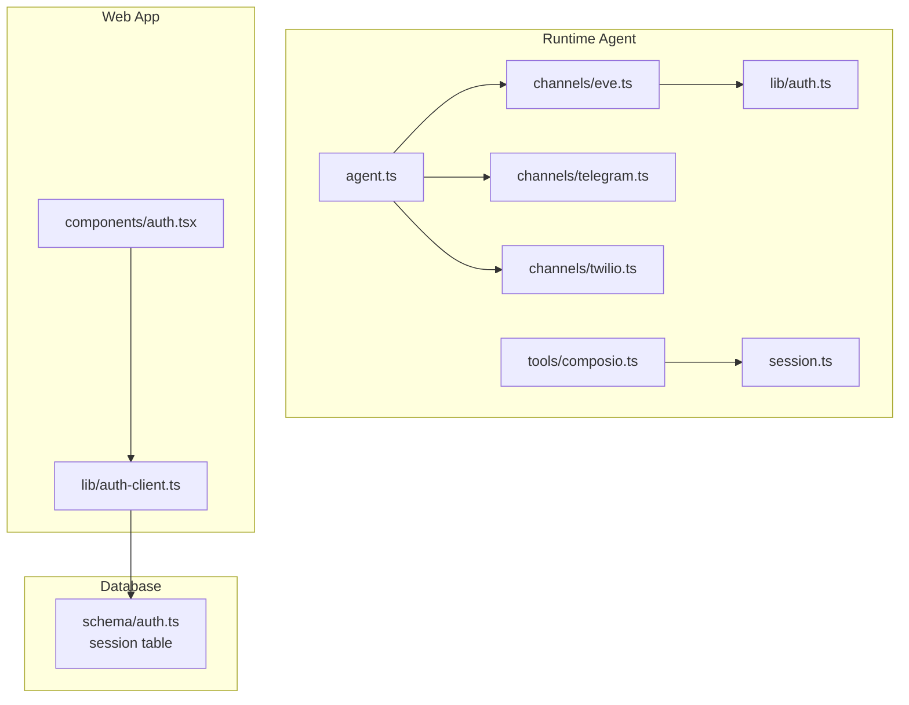
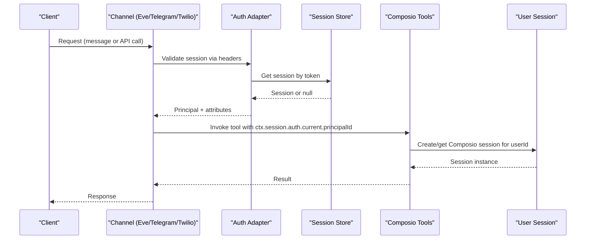
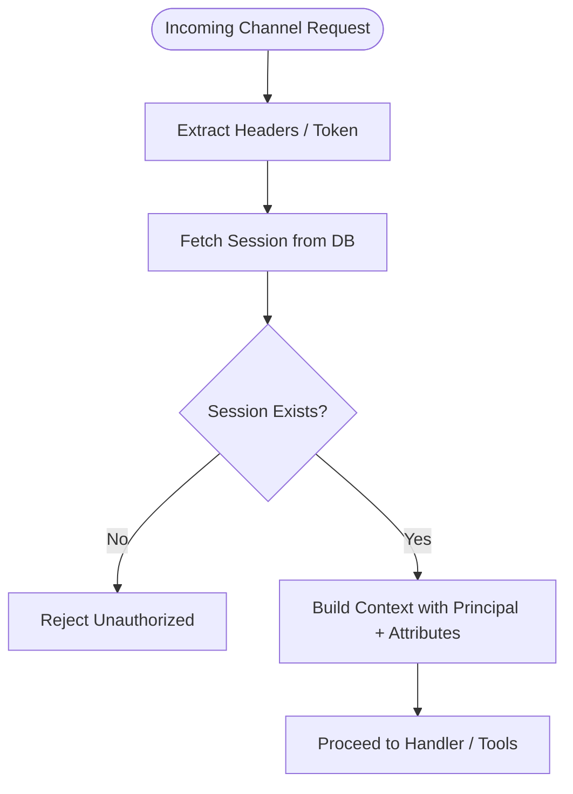
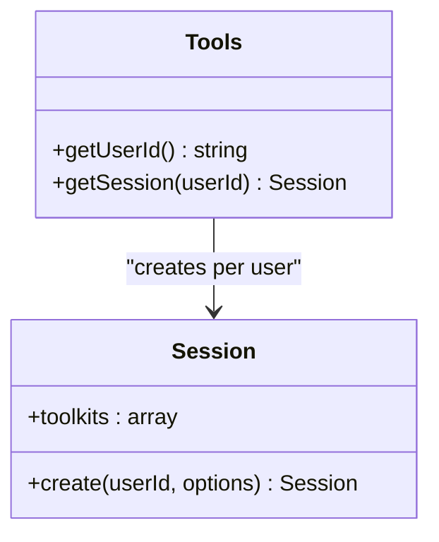
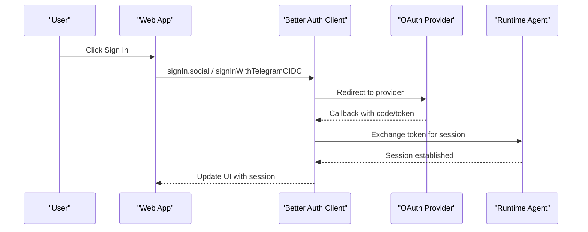
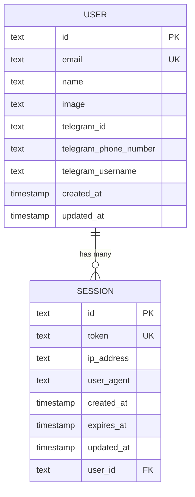
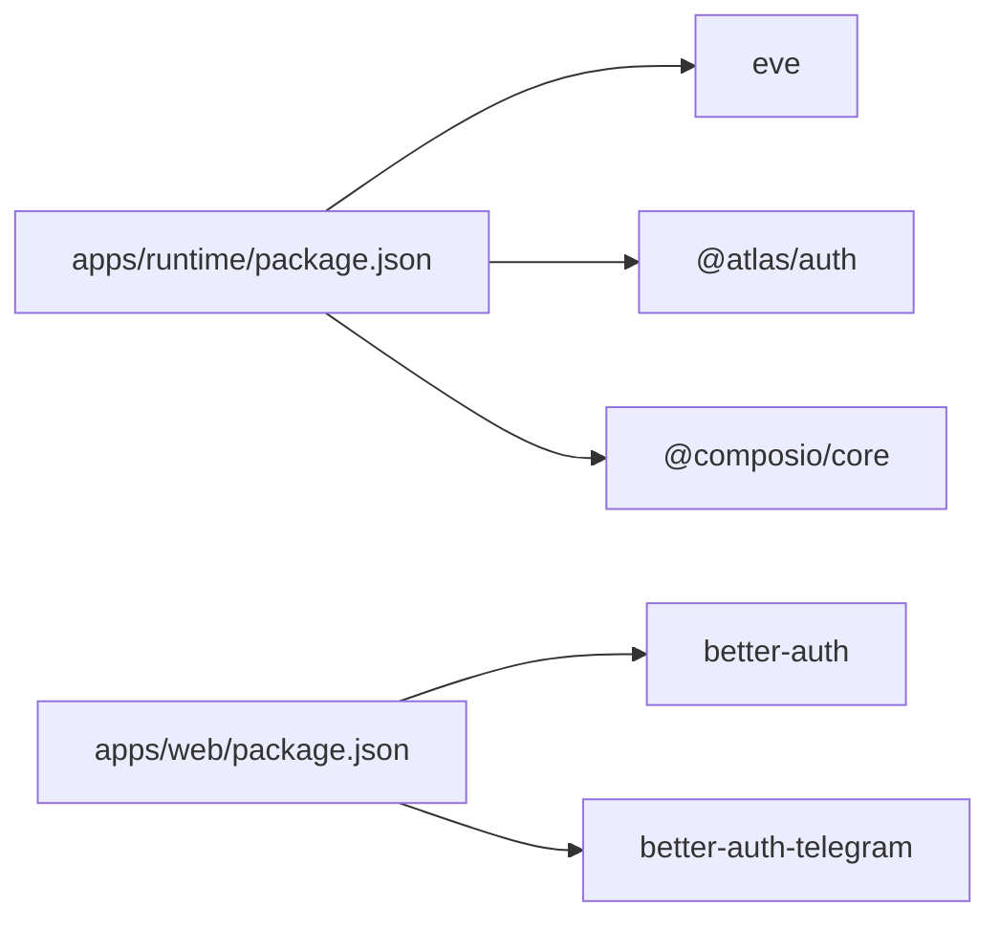

# Session Management

<cite>
**Referenced Files in This Document**
- [session.ts](file://apps/runtime/agent/session.ts)
- [auth.ts](file://apps/runtime/agent/lib/auth.ts)
- [eve.ts](file://apps/runtime/agent/channels/eve.ts)
- [telegram.ts](file://apps/runtime/agent/channels/telegram.ts)
- [twilio.ts](file://apps/runtime/agent/channels/twilio.ts)
- [agent.ts](file://apps/runtime/agent/agent.ts)
- [composio.ts](file://apps/runtime/agent/tools/composio.ts)
- [auth-client.ts](file://apps/web/src/lib/auth-client.ts)
- [auth.tsx](file://apps/web/src/components/auth.tsx)
- [auth.ts](file://packages/db/src/schema/auth.ts)
- [0000_snapshot.json](file://packages/db/src/migrations/meta/0000_snapshot.json)
- [package.json (runtime)](file://apps/runtime/package.json)
- [package.json (web)](file://apps/web/package.json)
</cite>

## Table of Contents

1. Introduction
2. Project Structure
3. Core Components
4. Architecture Overview
5. Detailed Component Analysis
6. Dependency Analysis
7. Performance Considerations
8. Troubleshooting Guide
9. Conclusion

## Introduction

This document explains the session management system that handles conversation state across multiple channels: web, Telegram, and SMS. It covers how sessions are created, authenticated, persisted, and managed throughout their lifecycle. It also documents security measures, concurrent session handling, conversation context maintenance, message history storage, expiration policies, and guidance for custom session stores, migration, serialization, scaling, memory optimization, and debugging.

## Project Structure

The runtime agent exposes channels for different communication platforms and integrates authentication and external tool sessions:

- Channels: Web (Eve), Telegram, SMS (Twilio)
- Authentication: Better Auth integration for web and channel auth
- Tool Sessions: Composio sessions per user to manage third-party integrations
- Persistence: Database schema for web sessions; tool sessions managed by Composio

**Diagram sources**

- [agent.ts:1-8](file://apps/runtime/agent/agent.ts#L1-L8)
- [eve.ts:1-10](file://apps/runtime/agent/channels/eve.ts#L1-L10)
- [telegram.ts:1-6](file://apps/runtime/agent/channels/telegram.ts#L1-L6)
- [twilio.ts:1-7](file://apps/runtime/agent/channels/twilio.ts#L1-L7)
- [auth.ts:1-26](file://apps/runtime/agent/lib/auth.ts#L1-L26)
- [composio.ts:1-11](file://apps/runtime/agent/tools/composio.ts#L1-L11)
- [session.ts:1-19](file://apps/runtime/agent/session.ts#L1-L19)
- [auth.tsx:1-69](file://apps/web/src/components/auth.tsx#L1-L69)
- [auth-client.ts:1-8](file://apps/web/src/lib/auth-client.ts#L1-L8)
- [auth.ts:21-39](file://packages/db/src/schema/auth.ts#L21-L39)

**Section sources**

- [agent.ts:1-8](file://apps/runtime/agent/agent.ts#L1-L8)
- [eve.ts:1-10](file://apps/runtime/agent/channels/eve.ts#L1-L10)
- [telegram.ts:1-6](file://apps/runtime/agent/channels/telegram.ts#L1-L6)
- [twilio.ts:1-7](file://apps/runtime/agent/channels/twilio.ts#L1-L7)
- [auth.ts:1-26](file://apps/runtime/agent/lib/auth.ts#L1-L26)
- [composio.ts:1-11](file://apps/runtime/agent/tools/composio.ts#L1-L11)
- [session.ts:1-19](file://apps/runtime/agent/session.ts#L1-L19)
- [auth.tsx:1-69](file://apps/web/src/components/auth.tsx#L1-L69)
- [auth-client.ts:1-8](file://apps/web/src/lib/auth-client.ts#L1-L8)
- [auth.ts:21-39](file://packages/db/src/schema/auth.ts#L21-L39)

## Core Components

- Channel definitions: Eve (web), Telegram, Twilio (SMS)
- Authentication adapter: Better Auth integration for channel requests
- Tool session manager: Composio session creation per user with toolkits
- Web client: Better Auth client with Telegram plugin and last login method tracking
- Database persistence: Session table with token, expiry, and user linkage

Key responsibilities:

- Authenticate incoming requests from each channel
- Create and manage tool sessions per user
- Persist web sessions in the database
- Provide a consistent identity across channels

**Section sources**

- [eve.ts:1-10](file://apps/runtime/agent/channels/eve.ts#L1-L10)
- [telegram.ts:1-6](file://apps/runtime/agent/channels/telegram.ts#L1-L6)
- [twilio.ts:1-7](file://apps/runtime/agent/channels/twilio.ts#L1-L7)
- [auth.ts:1-26](file://apps/runtime/agent/lib/auth.ts#L1-L26)
- [session.ts:1-19](file://apps/runtime/agent/session.ts#L1-L19)
- [auth-client.ts:1-8](file://apps/web/src/lib/auth-client.ts#L1-L8)
- [auth.tsx:1-69](file://apps/web/src/components/auth.tsx#L1-L69)
- [auth.ts:21-39](file://packages/db/src/schema/auth.ts#L21-L39)

## Architecture Overview

The runtime agent defines an agent and multiple channels. Each channel authenticates requests using Better Auth. For tool usage, the agent creates a Composio session per user to access integrated services. The web app uses Better Auth client to sign in via Google or Telegram and maintains a session stored in the database.

**Diagram sources**

- [auth.ts:1-26](file://apps/runtime/agent/lib/auth.ts#L1-L26)
- [composio.ts:1-11](file://apps/runtime/agent/tools/composio.ts#L1-L11)
- [session.ts:1-19](file://apps/runtime/agent/session.ts#L1-L19)
- [auth.ts:21-39](file://packages/db/src/schema/auth.ts#L21-L39)

## Detailed Component Analysis

### Channel Authentication and Identity

- Eve channel configures multiple auth strategies including Better Auth, Vercel OIDC, and local dev.
- Telegram and Twilio channels are configured with credentials and constraints.
- The Better Auth adapter extracts user attributes and principal identifiers from the request session.

**Diagram sources**

- [eve.ts:1-10](file://apps/runtime/agent/channels/eve.ts#L1-L10)
- [auth.ts:1-26](file://apps/runtime/agent/lib/auth.ts#L1-L26)
- [auth.ts:21-39](file://packages/db/src/schema/auth.ts#L21-L39)

**Section sources**

- [eve.ts:1-10](file://apps/runtime/agent/channels/eve.ts#L1-L10)
- [telegram.ts:1-6](file://apps/runtime/agent/channels/telegram.ts#L1-L6)
- [twilio.ts:1-7](file://apps/runtime/agent/channels/twilio.ts#L1-L7)
- [auth.ts:1-26](file://apps/runtime/agent/lib/auth.ts#L1-L26)

### Tool Session Management (Composio)

- Tools receive the authenticated user ID from the channel context.
- A Composio session is created per user with a predefined set of toolkits.
- This session encapsulates integrations like calendar, email, messaging, and more.

**Diagram sources**

- [composio.ts:1-11](file://apps/runtime/agent/tools/composio.ts#L1-L11)
- [session.ts:1-19](file://apps/runtime/agent/session.ts#L1-L19)

**Section sources**

- [composio.ts:1-11](file://apps/runtime/agent/tools/composio.ts#L1-L11)
- [session.ts:1-19](file://apps/runtime/agent/session.ts#L1-L19)

### Web Authentication Flow

- The web app uses a Better Auth client with Telegram plugin and last login method tracking.
- Users can sign in via Google or Telegram; the client manages session state and redirects appropriately.

**Diagram sources**

- [auth.tsx:1-69](file://apps/web/src/components/auth.tsx#L1-L69)
- [auth-client.ts:1-8](file://apps/web/src/lib/auth-client.ts#L1-L8)

**Section sources**

- [auth.tsx:1-69](file://apps/web/src/components/auth.tsx#L1-L69)
- [auth-client.ts:1-8](file://apps/web/src/lib/auth-client.ts#L1-L8)

### Persistence and Expiration Policies

- Web sessions are persisted in a database table with fields for token, expiry, IP address, user agent, and user linkage.
- An index on user_id supports efficient lookups by user.
- Expiration is enforced via the expires_at timestamp.

**Diagram sources**

- [auth.ts:1-39](file://packages/db/src/schema/auth.ts#L1-L39)
- [0000_snapshot.json:125-202](file://packages/db/src/migrations/meta/0000_snapshot.json#L125-L202)

**Section sources**

- [auth.ts:21-39](file://packages/db/src/schema/auth.ts#L21-L39)
- [0000_snapshot.json:125-202](file://packages/db/src/migrations/meta/0000_snapshot.json#L125-L202)

### Conversation Context and Message History

- Conversation context is maintained through the runtime agent’s execution context and tool sessions.
- Tool sessions carry user identity and toolkit scope; they enable multi-turn interactions with external services.
- Message history storage is not implemented in the provided files; consider adding a dedicated messages store if needed.

[No sources needed since this section provides conceptual guidance]

### Security Measures

- Channel requests are authenticated via Better Auth before processing.
- Web sessions use tokens with expiry and are tied to users.
- Tool sessions are scoped to user IDs and specific toolkits.

**Section sources**

- [auth.ts:1-26](file://apps/runtime/agent/lib/auth.ts#L1-L26)
- [auth.ts:21-39](file://packages/db/src/schema/auth.ts#L21-L39)
- [session.ts:1-19](file://apps/runtime/agent/session.ts#L1-L19)

### Concurrent Session Handling

- Multiple channels can authenticate concurrently using the same session mechanism.
- Ensure rate limiting and robust error handling at the channel layer to avoid contention.
- Use unique tokens and proper indexing for fast session retrieval.

[No sources needed since this section provides general guidance]

### Custom Session Stores, Migration, and Serialization

- To implement a custom session store, replace the session retrieval logic in the auth adapter with your own implementation while preserving the interface contract.
- For migration, version keys and migrate legacy data safely; wrap storage operations in try-catch to handle unavailable storage.
- Serialize only necessary fields to minimize payload size and reduce risk.

[No sources needed since this section provides general guidance]

### Scaling Considerations, Memory Optimization, Debugging

- Scale horizontally by ensuring session stores are shared and indexed efficiently.
- Optimize memory by caching frequent reads and avoiding heavy object graphs in session payloads.
- Debug by logging principal IDs, session existence checks, and tool session creation flows.

[No sources needed since this section provides general guidance]

## Dependency Analysis

The runtime depends on the eve framework, Better Auth, and Composio. The web app depends on Better Auth client and Telegram plugin.

**Diagram sources**

- [package.json (runtime):1-30](file://apps/runtime/package.json#L1-L30)
- [package.json (web):1-47](file://apps/web/package.json#L1-L47)

**Section sources**

- [package.json (runtime):1-30](file://apps/runtime/package.json#L1-L30)
- [package.json (web):1-47](file://apps/web/package.json#L1-L47)

## Performance Considerations

- Prefer minimal session payloads and avoid storing sensitive data in session tables.
- Cache frequently accessed session metadata in memory where appropriate.
- Use indexes on user_id for faster session queries.
- Avoid synchronous blocking calls in hot paths; batch operations when possible.

[No sources needed since this section provides general guidance]

## Troubleshooting Guide

Common issues and resolutions:

- Unauthorized errors: Verify that the request includes valid headers and that the session exists in the database.
- Missing principal: Ensure the auth adapter returns a principal ID and attributes.
- Tool session failures: Confirm the user ID is present in the channel context and that the Composio session is created successfully.
- Storage errors: Wrap localStorage/sessionStorage operations in try-catch; handle quota exceeded or private browsing modes gracefully.

**Section sources**

- [auth.ts:1-26](file://apps/runtime/agent/lib/auth.ts#L1-L26)
- [composio.ts:1-11](file://apps/runtime/agent/tools/composio.ts#L1-L11)
- [session.ts:1-19](file://apps/runtime/agent/session.ts#L1-L19)

## Conclusion

The session management system integrates channel authentication, persistent web sessions, and per-user tool sessions to support multi-channel conversations. Security is enforced via Better Auth and database-backed sessions, while tool sessions provide scoped access to external integrations. For production readiness, add explicit message history storage, implement robust expiration cleanup, and adopt best practices for scaling, memory optimization, and debugging.
