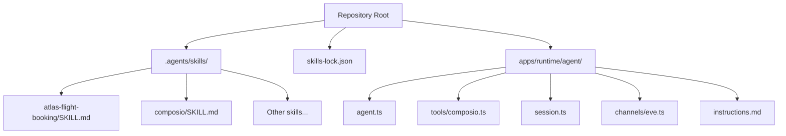
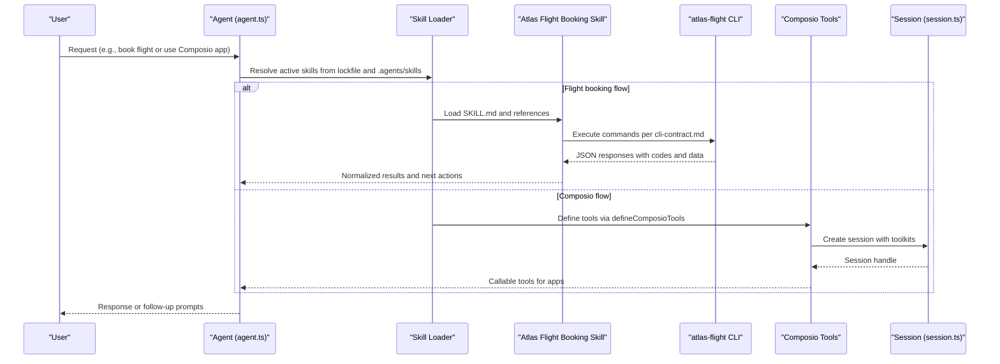
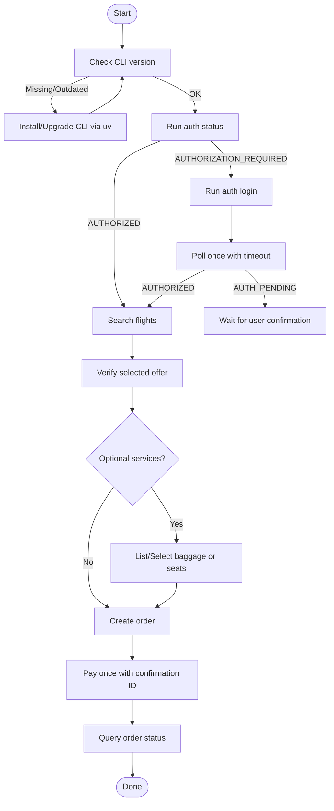
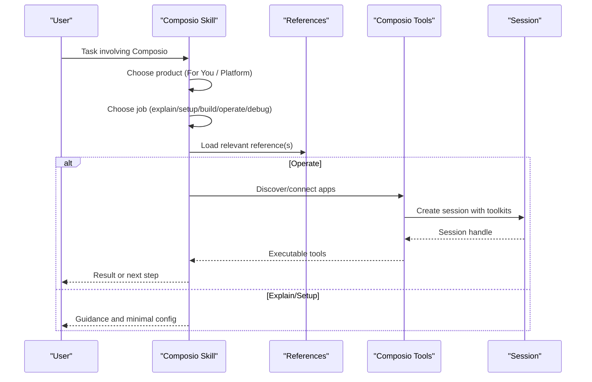
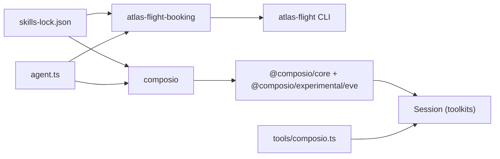

# Skill Loading and Configuration

<cite>
**Referenced Files in This Document**
- [skills-lock.json](file://skills-lock.json)
- [SKILL.md (atlas-flight-booking)](file://.agents/skills/atlas-flight-booking/SKILL.md)
- [cli-contract.md](file://.agents/skills/atlas-flight-booking/references/cli-contract.md)
- [SKILL.md (composio)](file://.agents/skills/composio/SKILL.md)
- [for-you.md](file://.agents/skills/composio/references/for-you.md)
- [platform.md](file://.agents/skills/composio/references/platform.md)
- [agent.ts](file://apps/runtime/agent/agent.ts)
- [session.ts](file://apps/runtime/agent/session.ts)
- [composio.ts](file://apps/runtime/agent/tools/composio.ts)
- [eve.ts (channel)](file://apps/runtime/agent/channels/eve.ts)
- [instructions.md](file://apps/runtime/agent/instructions.md)
</cite>

## Table of Contents

1. Introduction
2. Project Structure
3. Core Components
4. Architecture Overview
5. Detailed Component Analysis
6. Dependency Analysis
7. Performance Considerations
8. Troubleshooting Guide
9. Conclusion

## Introduction

This document explains the skill loading system that manages AI agent capabilities and behaviors. It covers how skills are discovered, loaded, and executed within the agent context; how skill files are structured; how configuration and dependencies are resolved; and how built-in skills like atlas-flight-booking and composio integrations work. It also provides guidance for creating custom skills, defining dependencies, versioning, conflict resolution, and performance optimization.

## Project Structure

Skills are organized under a dedicated directory with one folder per skill. Each skill typically includes:

- A SKILL.md file that defines the skill’s identity, description, and behavior rules.
- Optional references/, agents/, assets/, or other subdirectories to hold detailed contracts, tool definitions, and supporting documentation.
- A lockfile at the repository root that pins installed skills to specific sources and versions.

**Diagram sources**

- [skills-lock.json:1-78](file://skills-lock.json#L1-L78)
- [SKILL.md (atlas-flight-booking):1-71](file://.agents/skills/atlas-flight-booking/SKILL.md#L1-L71)
- [SKILL.md (composio):1-78](file://.agents/skills/composio/SKILL.md#L1-L78)
- [agent.ts:1-8](file://apps/runtime/agent/agent.ts#L1-L8)
- [composio.ts:1-12](file://apps/runtime/agent/tools/composio.ts#L1-L12)
- [session.ts:1-19](file://apps/runtime/agent/session.ts#L1-L19)
- [eve.ts (channel):1-10](file://apps/runtime/agent/channels/eve.ts#L1-L10)
- [instructions.md:1-38](file://apps/runtime/agent/instructions.md#L1-L38)

**Section sources**

- [skills-lock.json:1-78](file://skills-lock.json#L1-L78)
- [SKILL.md (atlas-flight-booking):1-71](file://.agents/skills/atlas-flight-booking/SKILL.md#L1-L71)
- [SKILL.md (composio):1-78](file://.agents/skills/composio/SKILL.md#L1-L78)

## Core Components

- Skill registry and pinning: The lockfile enumerates available skills, their sources, paths, and computed hashes to ensure deterministic installs and upgrades.
- Skill definition: Each SKILL.md declares name, description, and operational rules. Some skills include reference documents that define contracts and workflows.
- Agent runtime: The agent is defined via a framework entry point and can load tools and sessions. Channels provide authentication and transport.
- Tool integration: For example, Composio tools are defined and bound to session context.

Key responsibilities:

- Discovery: Read the skills directory and lockfile to determine which skills are active.
- Loading: Parse SKILL.md metadata and load referenced contracts when needed.
- Execution: Route user requests to appropriate skills and tools based on context and instructions.

**Section sources**

- [skills-lock.json:1-78](file://skills-lock.json#L1-L78)
- [SKILL.md (atlas-flight-booking):1-71](file://.agents/skills/atlas-flight-booking/SKILL.md#L1-L71)
- [SKILL.md (composio):1-78](file://.agents/skills/composio/SKILL.md#L1-L78)
- [agent.ts:1-8](file://apps/runtime/agent/agent.ts#L1-L8)
- [composio.ts:1-12](file://apps/runtime/agent/tools/composio.ts#L1-L12)
- [session.ts:1-19](file://apps/runtime/agent/session.ts#L1-L19)
- [eve.ts (channel):1-10](file://apps/runtime/agent/channels/eve.ts#L1-L10)

## Architecture Overview

The skill system combines declarative skill definitions with a runtime that loads them into an agent. Skills may orchestrate external CLI tools or SDKs through well-defined contracts.

**Diagram sources**

- [skills-lock.json:1-78](file://skills-lock.json#L1-L78)
- [SKILL.md (atlas-flight-booking):1-71](file://.agents/skills/atlas-flight-booking/SKILL.md#L1-L71)
- [cli-contract.md:1-78](file://.agents/skills/atlas-flight-booking/references/cli-contract.md#L1-L78)
- [SKILL.md (composio):1-78](file://.agents/skills/composio/SKILL.md#L1-L78)
- [composio.ts:1-12](file://apps/runtime/agent/tools/composio.ts#L1-L12)
- [session.ts:1-19](file://apps/runtime/agent/session.ts#L1-L19)

## Detailed Component Analysis

### Atlas Flight Booking Skill

Purpose:

- Guides the agent to operate exclusively through the Atlas Flight Booking CLI.
- Enforces strict command usage, response parsing, and safety checkpoints.

Structure:

- SKILL.md: High-level behavior, authorization flow, search/booking workflow, mandatory checkpoints, safety rules, and references.
- references/cli-contract.md: Exact commands, parameters, and response envelope schema to consume.

Dependency resolution:

- Requires the atlas-flight CLI at a minimum supported version.
- Uses uv to install or upgrade the CLI if missing or outdated.
- Authorization via CLI login and optional polling until authorized.

Execution pattern:

- Version check -> Auth status -> Search/Verify -> Optional services -> Order/Pay -> Status checks.
- Branches on CLI response code, never message. Preserves opaque IDs exactly.

**Diagram sources**

- [SKILL.md (atlas-flight-booking):1-71](file://.agents/skills/atlas-flight-booking/SKILL.md#L1-L71)
- [cli-contract.md:1-78](file://.agents/skills/atlas-flight-booking/references/cli-contract.md#L1-L78)

**Section sources**

- [SKILL.md (atlas-flight-booking):1-71](file://.agents/skills/atlas-flight-booking/SKILL.md#L1-L71)
- [cli-contract.md:1-78](file://.agents/skills/atlas-flight-booking/references/cli-contract.md#L1-L78)

### Composio Integration Skill

Purpose:

- Routes tasks across “For You” and “Platform” products.
- Loads only relevant guidance and uses canonical docs for volatile details.

Structure:

- SKILL.md: Product selection, job classification, guidance routing, stable rules, and canonical documentation links.
- references/for-you.md: MCP endpoint, consumer key header, client setup, CLI usage, and debugging tips.
- references/platform.md: Project access, sessions, tool selection, advanced options, and verification steps.

Execution pattern:

- Identify product (For You vs Platform).
- Identify job (explain, set up, build, operate, debug/migrate).
- Load only the relevant reference.
- Perform minimal changes and verify with safe tool calls when credentials and authorization are present.

**Diagram sources**

- [SKILL.md (composio):1-78](file://.agents/skills/composio/SKILL.md#L1-L78)
- [for-you.md:1-81](file://.agents/skills/composio/references/for-you.md#L1-L81)
- [platform.md:1-53](file://.agents/skills/composio/references/platform.md#L1-L53)
- [composio.ts:1-12](file://apps/runtime/agent/tools/composio.ts#L1-L12)
- [session.ts:1-19](file://apps/runtime/agent/session.ts#L1-L19)

**Section sources**

- [SKILL.md (composio):1-78](file://.agents/skills/composio/SKILL.md#L1-L78)
- [for-you.md:1-81](file://.agents/skills/composio/references/for-you.md#L1-L81)
- [platform.md:1-53](file://.agents/skills/composio/references/platform.md#L1-L53)
- [composio.ts:1-12](file://apps/runtime/agent/tools/composio.ts#L1-L12)
- [session.ts:1-19](file://apps/runtime/agent/session.ts#L1-L19)

### Agent Definition and Channel

- Agent definition: Declares the model used by the agent runtime.
- Channel: Configures authentication providers and CORS for the agent channel.

These components integrate with the skill loader to execute tasks using the configured model and authenticated channels.

**Section sources**

- [agent.ts:1-8](file://apps/runtime/agent/agent.ts#L1-L8)
- [eve.ts (channel):1-10](file://apps/runtime/agent/channels/eve.ts#L1-L10)

### Agent Instructions

- Centralized workflow instructions for flight booking and delegation patterns.
- Safety rules and post-booking operations.

These instructions guide the agent’s behavior when executing skills and tools.

**Section sources**

- [instructions.md:1-38](file://apps/runtime/agent/instructions.md#L1-L38)

## Dependency Analysis

- Skill pinning: The lockfile maps each skill to a source, type, path, and computed hash, ensuring deterministic installs and upgrades.
- Skill-to-tool dependencies:
  - atlas-flight-booking depends on the atlas-flight CLI and its contract.
  - composio depends on the Composio SDK and optionally MCP/CLI surfaces.
- Runtime dependencies:
  - Agent uses a framework-defined agent entry point.
  - Tools are bound to session context for user-scoped execution.

**Diagram sources**

- [skills-lock.json:1-78](file://skills-lock.json#L1-L78)
- [SKILL.md (atlas-flight-booking):1-71](file://.agents/skills/atlas-flight-booking/SKILL.md#L1-L71)
- [SKILL.md (composio):1-78](file://.agents/skills/composio/SKILL.md#L1-L78)
- [composio.ts:1-12](file://apps/runtime/agent/tools/composio.ts#L1-L12)
- [session.ts:1-19](file://apps/runtime/agent/session.ts#L1-L19)
- [agent.ts:1-8](file://apps/runtime/agent/agent.ts#L1-L8)

**Section sources**

- [skills-lock.json:1-78](file://skills-lock.json#L1-L78)

## Performance Considerations

- Lazy loading: Load only the references required for the current task to minimize overhead.
- Caching: Cache skill metadata and resolved tool schemas where applicable to avoid repeated discovery.
- Minimal I/O: Avoid unnecessary filesystem reads; rely on the lockfile to resolve exact skill paths.
- Bounded retries: Follow skill contracts for retry limits (e.g., single retry for read-only failures).
- Parallelism: When orchestrating multi-date searches or independent tool calls, parallelize safely while preserving state per search or offer.
- Version pinning: Use the lockfile to prevent drift and reduce re-resolution costs.

[No sources needed since this section provides general guidance]

## Troubleshooting Guide

Common issues and resolutions:

- CLI not found or outdated:
  - Ensure the atlas-flight CLI is installed and meets the minimum version. If missing or outdated, install or upgrade via the documented installer and tool manager.
- Authorization pending:
  - Follow the login flow and poll once with a bounded timeout. Do not start automatic polling loops.
- Offer expired or unavailable:
  - Re-run search if no current-price offer was selected or if verification reports expiration/unavailability.
- Payment uncertainty:
  - Query order status instead of retrying payment. Never reuse payment confirmation IDs.
- Composio connection errors:
  - Confirm correct product (For You vs Platform), credential type, and endpoint. Retrieve logs or request IDs before diagnosing.

Operational safeguards:

- Treat all IDs as opaque and preserve them exactly.
- Respect mandatory checkpoints (authorization, price increase, seat fallback, payment).
- Keep credentials out of logs and chat.

**Section sources**

- [SKILL.md (atlas-flight-booking):1-71](file://.agents/skills/atlas-flight-booking/SKILL.md#L1-L71)
- [cli-contract.md:1-78](file://.agents/skills/atlas-flight-booking/references/cli-contract.md#L1-L78)
- [SKILL.md (composio):1-78](file://.agents/skills/composio/SKILL.md#L1-L78)
- [for-you.md:1-81](file://.agents/skills/composio/references/for-you.md#L1-L81)

## Conclusion

The skill system combines declarative skill definitions with a runtime that discovers, loads, and executes skills deterministically via a lockfile. Built-in skills like atlas-flight-booking and composio demonstrate robust patterns for CLI orchestration and SDK-based integrations. By following the contracts, respecting safety checkpoints, and applying performance best practices, teams can create reliable, maintainable AI agent capabilities. Custom skills should mirror the established structure, define clear contracts, and leverage the lockfile for version control and conflict resolution.

[No sources needed since this section summarizes without analyzing specific files]
