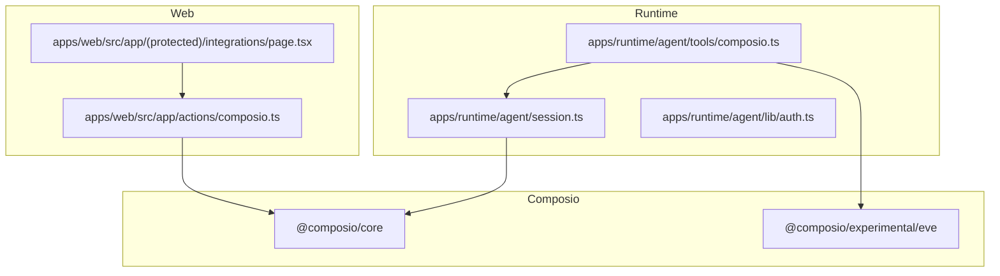
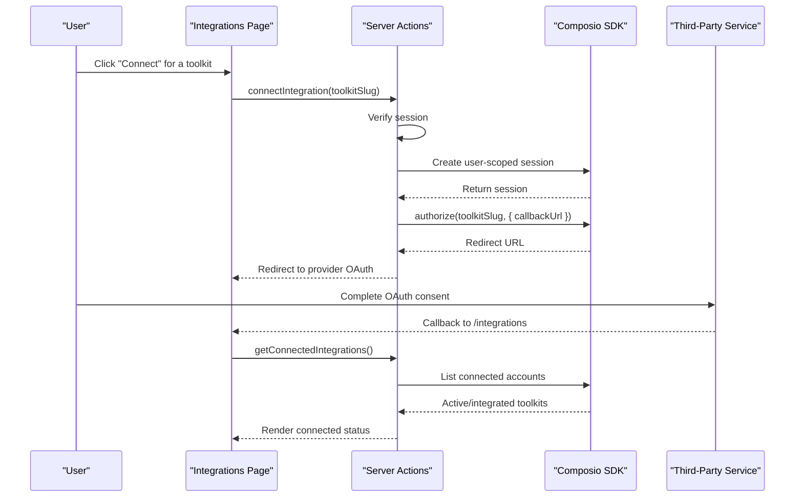
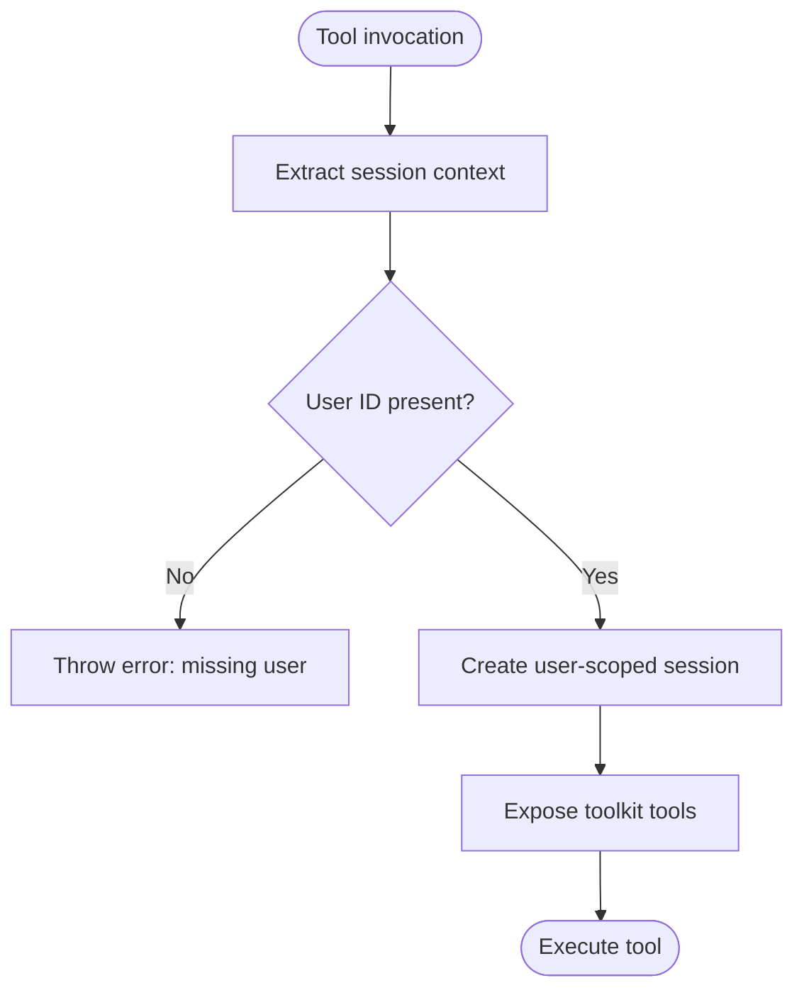
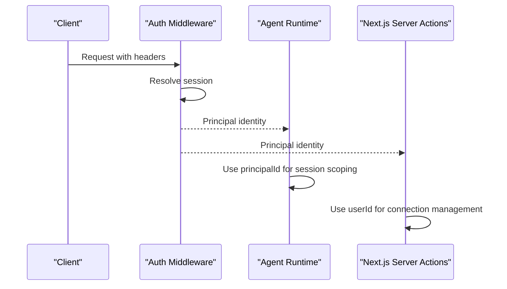
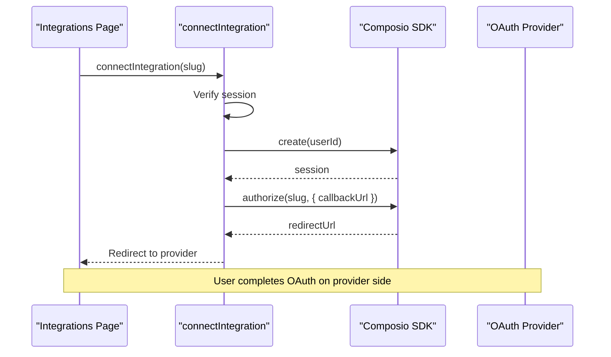
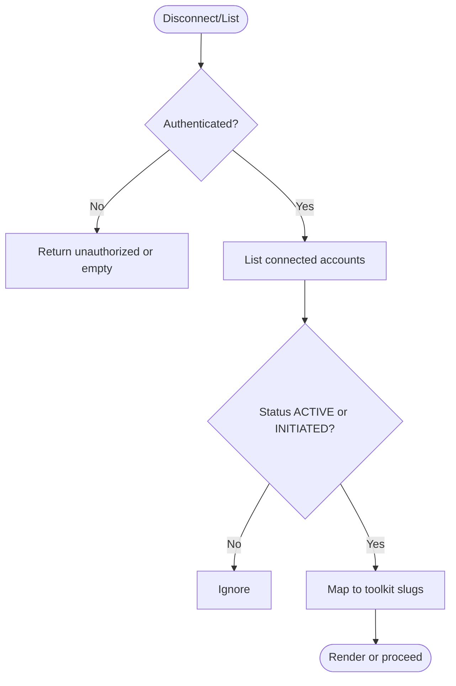
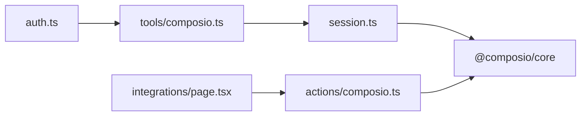

# Tool System and External Integrations

<cite>
**Referenced Files in This Document**
- [composio.ts](file://apps/runtime/agent/tools/composio.ts)
- [session.ts](file://apps/runtime/agent/session.ts)
- [auth.ts](file://apps/runtime/agent/lib/auth.ts)
- [composio.ts](file://apps/web/src/app/actions/composio.ts)
- [integrations/page.tsx](file://apps/web/src/app/(protected)/integrations/page.tsx)
- [SKILL.md](file://.agents/skills/composio/SKILL.md)
- [errors.md](file://.agents/skills/composio/references/errors.md)
- [platform.md](file://.agents/skills/composio/references/platform.md)
</cite>

## Table of Contents

1. [Introduction](#introduction)
2. [Project Structure](#project-structure)
3. [Core Components](#core-components)
4. [Architecture Overview](#architecture-overview)
5. [Detailed Component Analysis](#detailed-component-analysis)
6. [Dependency Analysis](#dependency-analysis)
7. [Performance Considerations](#performance-considerations)
8. [Troubleshooting Guide](#troubleshooting-guide)
9. [Conclusion](#conclusion)
10. [Appendices](#appendices)

## Introduction

This document explains the tool system that enables external service integrations through Composio. It covers how tools are registered, how parameters are validated, and how execution context is managed for authenticated users. It also documents the Composio integration for connecting to third-party services such as Google Calendar, Gmail, Slack, and Notion, including authentication flows, API key management, error handling, rate limits, custom tool development patterns, OAuth flows, composition strategies, caching approaches, and debugging techniques.

## Project Structure

The integration spans two main areas:

- Runtime agent tools that expose Composio-powered tools to the agent runtime
- Web actions that manage user connections to third-party services via a UI

**Diagram sources**

- [composio.ts:1-11](file://apps/runtime/agent/tools/composio.ts#L1-L11)
- [session.ts:1-19](file://apps/runtime/agent/session.ts#L1-L19)
- [auth.ts:1-26](file://apps/runtime/agent/lib/auth.ts#L1-L26)
- [composio.ts:1-85](file://apps/web/src/app/actions/composio.ts#L1-L85)
- [integrations/page.tsx](<file://apps/web/src/app/(protected)/integrations/page.tsx#L1-L151>)

**Section sources**

- [composio.ts:1-11](file://apps/runtime/agent/tools/composio.ts#L1-L11)
- [session.ts:1-19](file://apps/runtime/agent/session.ts#L1-L19)
- [auth.ts:1-26](file://apps/runtime/agent/lib/auth.ts#L1-L26)
- [composio.ts:1-85](file://apps/web/src/app/actions/composio.ts#L1-L85)
- [integrations/page.tsx](<file://apps/web/src/app/(protected)/integrations/page.tsx#L1-L151>)

## Core Components

- Tool registration: The runtime registers Composio tools using an adapter function that receives the current session context and returns a per-user session with selected toolkits enabled.
- Session management: A centralized session factory creates a Composio session scoped to the application’s user ID and restricts available toolkits to a curated list.
- Authentication: The runtime authenticates requests and extracts the principal user ID used to scope sessions and tool access.
- Web integration actions: Server actions handle connection lifecycle (connect, disconnect, list) and redirect users through Composio’s Connect Link flow.
- UI: A protected page lists supported integrations and allows users to connect or disconnect them.

Key responsibilities:

- Validate that a user is authenticated before exposing tools or initiating connections.
- Scope all external calls to the current user’s identity.
- Provide a consistent way to enable specific toolkits per session.

**Section sources**

- [composio.ts:1-11](file://apps/runtime/agent/tools/composio.ts#L1-L11)
- [session.ts:1-19](file://apps/runtime/agent/session.ts#L1-L19)
- [auth.ts:1-26](file://apps/runtime/agent/lib/auth.ts#L1-L26)
- [composio.ts:1-85](file://apps/web/src/app/actions/composio.ts#L1-L85)
- [integrations/page.tsx](<file://apps/web/src/app/(protected)/integrations/page.tsx#L1-L151>)

## Architecture Overview

The architecture separates concerns between runtime tool execution and web-driven connection management.

**Diagram sources**

- [composio.ts:13-33](file://apps/web/src/app/actions/composio.ts#L13-L33)
- [composio.ts:63-84](file://apps/web/src/app/actions/composio.ts#L63-L84)
- [integrations/page.tsx](<file://apps/web/src/app/(protected)/integrations/page.tsx#L74-L151>)

## Detailed Component Analysis

### Tool Registration and Execution Context

Tool registration binds the agent runtime to a per-user Composio session. The registration function:

- Extracts the authenticated user ID from the session context
- Validates presence of the user ID
- Returns a session configured with a predefined set of toolkits

This ensures that every tool call runs under the correct user identity and only exposes allowed toolkits.

**Diagram sources**

- [composio.ts:5-11](file://apps/runtime/agent/tools/composio.ts#L5-L11)
- [session.ts:6-18](file://apps/runtime/agent/session.ts#L6-L18)

**Section sources**

- [composio.ts:1-11](file://apps/runtime/agent/tools/composio.ts#L1-L11)
- [session.ts:1-19](file://apps/runtime/agent/session.ts#L1-L19)

### Session Factory and Toolkit Scoping

The session factory initializes a Composio client with a provider and creates a session for a given user ID. It scopes the session to a curated list of toolkits, which includes Google Calendar, Gmail, Slack, Notion, Google Sheets, Google Maps, Firecrawl, and Telegram.

Benefits:

- Limits exposure to only necessary integrations
- Simplifies permission and quota management
- Reduces attack surface by restricting available tools

**Section sources**

- [session.ts:1-19](file://apps/runtime/agent/session.ts#L1-L19)

### Authentication Flow

Authentication is handled by extracting the current session from the request and mapping it into a stable principal identity used by both the runtime and web layers.

**Diagram sources**

- [auth.ts:4-25](file://apps/runtime/agent/lib/auth.ts#L4-L25)
- [composio.ts:13-22](file://apps/web/src/app/actions/composio.ts#L13-L22)

**Section sources**

- [auth.ts:1-26](file://apps/runtime/agent/lib/auth.ts#L1-L26)
- [composio.ts:13-22](file://apps/web/src/app/actions/composio.ts#L13-L22)

### Connection Management (OAuth Flow)

The web layer provides server actions to:

- Initiate authorization for a specific toolkit via a Connect Link
- Disconnect existing accounts
- List currently connected integrations

**Diagram sources**

- [composio.ts:13-33](file://apps/web/src/app/actions/composio.ts#L13-L33)

**Section sources**

- [composio.ts:13-33](file://apps/web/src/app/actions/composio.ts#L13-L33)

### Disconnection and Listing

Disconnection enumerates active or initiated accounts for the current user and deletes matching accounts for a given toolkit slug. Listing filters accounts by status and maps them to toolkit slugs for UI rendering.

**Diagram sources**

- [composio.ts:35-84](file://apps/web/src/app/actions/composio.ts#L35-L84)

**Section sources**

- [composio.ts:35-84](file://apps/web/src/app/actions/composio.ts#L35-L84)

### UI for Integrations

The protected page renders cards for each supported integration and toggles between Connect and Disconnect based on the current connection state. It uses React Query to fetch and cache the list of connected integrations and invalidates queries after disconnection.

Supported integrations include Slack, Gmail, Google Calendar, Google Maps, Google Sheets, Notion, and Telegram.

**Section sources**

- [integrations/page.tsx](<file://apps/web/src/app/(protected)/integrations/page.tsx#L36-L72>)
- [integrations/page.tsx](<file://apps/web/src/app/(protected)/integrations/page.tsx#L74-L151>)

## Dependency Analysis

The tool system depends on:

- The agent runtime’s session and auth modules to establish identity
- The Composio SDK to create user-scoped sessions and manage connections
- Next.js server actions for secure, server-side operations
- The UI layer to present connection states and trigger flows

**Diagram sources**

- [auth.ts:1-26](file://apps/runtime/agent/lib/auth.ts#L1-L26)
- [composio.ts:1-11](file://apps/runtime/agent/tools/composio.ts#L1-L11)
- [session.ts:1-19](file://apps/runtime/agent/session.ts#L1-L19)
- [composio.ts:1-85](file://apps/web/src/app/actions/composio.ts#L1-L85)
- [integrations/page.tsx](<file://apps/web/src/app/(protected)/integrations/page.tsx#L1-L151>)

**Section sources**

- [auth.ts:1-26](file://apps/runtime/agent/lib/auth.ts#L1-L26)
- [composio.ts:1-11](file://apps/runtime/agent/tools/composio.ts#L1-L11)
- [session.ts:1-19](file://apps/runtime/agent/session.ts#L1-L19)
- [composio.ts:1-85](file://apps/web/src/app/actions/composio.ts#L1-L85)
- [integrations/page.tsx](<file://apps/web/src/app/(protected)/integrations/page.tsx#L1-L151>)

## Performance Considerations

- Session reuse: For multi-turn conversations, persist and resume the returned session ID instead of creating a new session per message to reduce overhead.
- Toolkit scoping: Limit toolkits to only those required by the feature to minimize discovery and permission checks.
- Connection listing: Use cache-busting where appropriate to ensure accurate UI state when connections change.
- Error retries: Implement bounded retries for transient provider errors; avoid unbounded loops.

[No sources needed since this section provides general guidance]

## Troubleshooting Guide

Common issues and recommended steps:

- Missing user identity: Ensure the session contains a valid principal ID before invoking tools. If absent, throw an error early.
- Unauthorized or expired project credentials: Validate the project key configuration and re-run credential checks without printing keys.
- Provider account issues: If a provider returns 401 during tool execution, reconnect the account via a fresh Connect Link and retry.
- Rate limits: Handle provider-specific rate limits (for example, Slack 429) by implementing backoff and considering dedicated apps for higher quotas.
- Logs and IDs: Capture and inspect the Composio log or request ID before changing credentials or code.

Operational tips:

- Keep credentials out of logs and source control.
- Prefer smallest configuration changes to resolve issues.
- Use canonical documentation for version-sensitive behavior.

**Section sources**

- [errors.md:5-61](file://.agents/skills/composio/references/errors.md#L5-L61)
- [platform.md:27-104](file://.agents/skills/composio/references/platform.md#L27-L104)
- [SKILL.md:52-67](file://.agents/skills/composio/SKILL.md#L52-L67)

## Conclusion

The tool system integrates external services through Composio by binding authenticated user sessions to scoped toolkits, managing OAuth-based connections via server actions, and presenting a clear UI for connection lifecycle. It emphasizes security (identity scoping), simplicity (curated toolkit list), and robustness (error handling and logging). Following the documented patterns ensures reliable integrations with services like Google Calendar, Gmail, Slack, and Notion while maintaining a clean separation between runtime tool execution and web-driven connection management.

[No sources needed since this section summarizes without analyzing specific files]

## Appendices

### API Key Management

- The web layer initializes the Composio client with a project API key loaded from environment variables.
- Keys should be stored securely and never printed or logged.
- First-time setup can write keys to local environment files; move them to your project’s secret mechanism for production.

**Section sources**

- [composio.ts:11-11](file://apps/web/src/app/actions/composio.ts#L11-L11)
- [platform.md:27-64](file://.agents/skills/composio/references/platform.md#L27-L64)

### Custom Tools and Composition Patterns

- Discover tools at runtime rather than hardcoding slugs.
- Compose workflows by chaining multiple tool calls within a single session.
- Use meta tools exposed by sessions to search and validate tool schemas before execution.
- For advanced scenarios, consider direct-tools presets and sandbox controls as appropriate.

**Section sources**

- [platform.md:106-123](file://.agents/skills/composio/references/platform.md#L106-L123)
- [SKILL.md:52-67](file://.agents/skills/composio/SKILL.md#L52-L67)

### Debugging External API Calls

- Capture the Composio log or request ID prior to diagnosing failures.
- Inspect dashboard logs and CLI logs for additional context.
- Identify whether the failure occurs at the project/session boundary or at the provider boundary.
- Reconnect accounts if provider tokens are revoked or expired.

**Section sources**

- [errors.md:5-41](file://.agents/skills/composio/references/errors.md#L5-L41)
