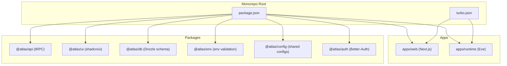
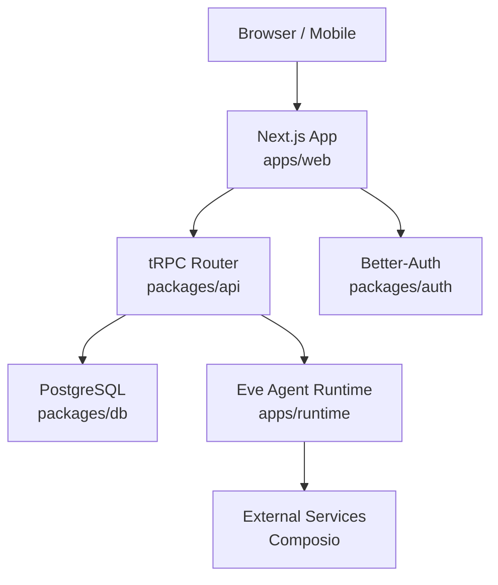
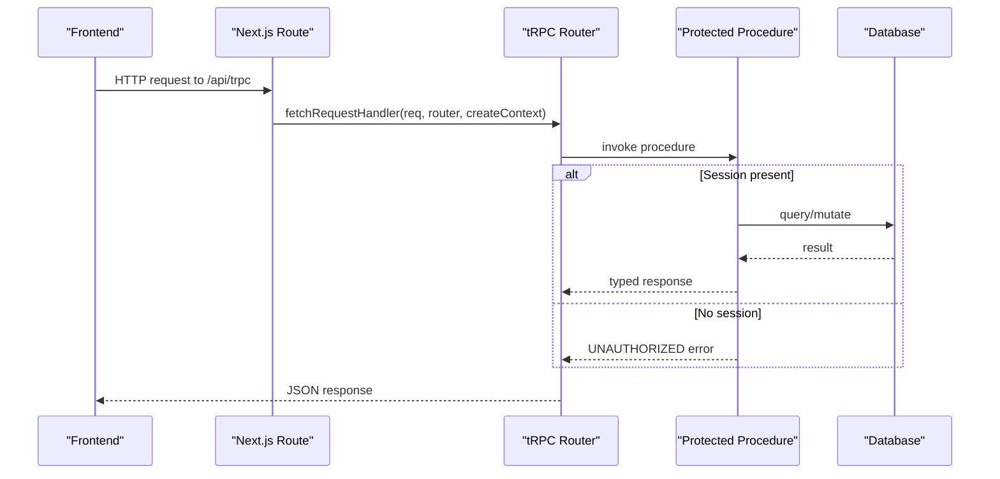
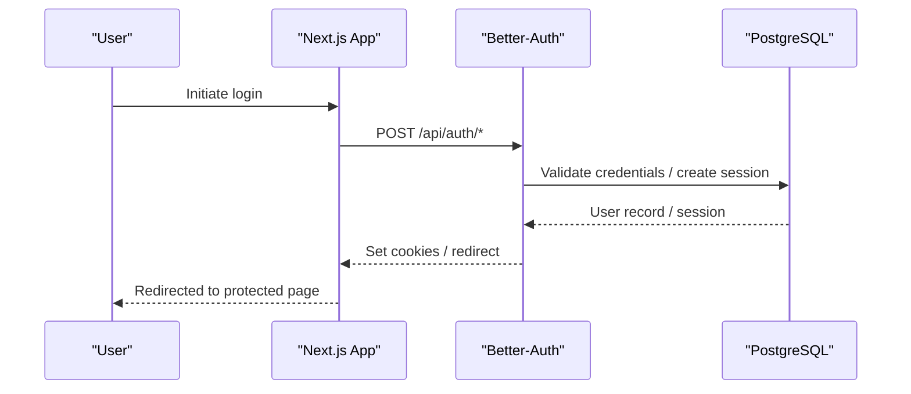
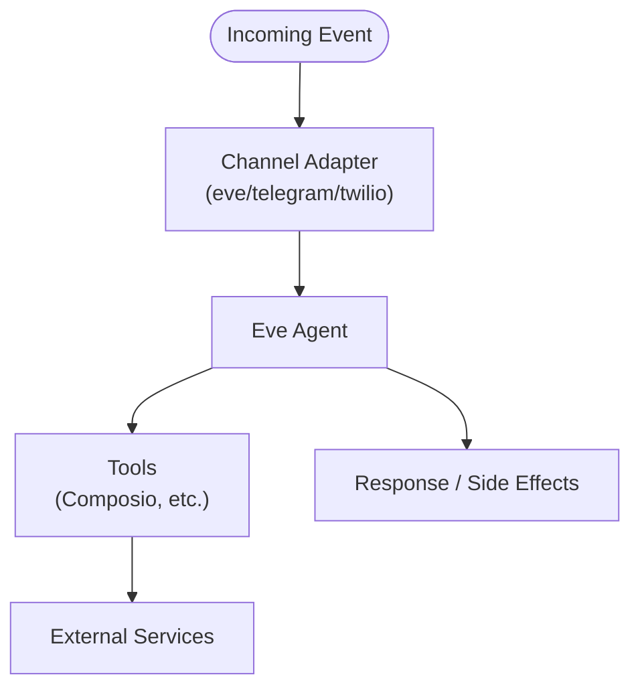
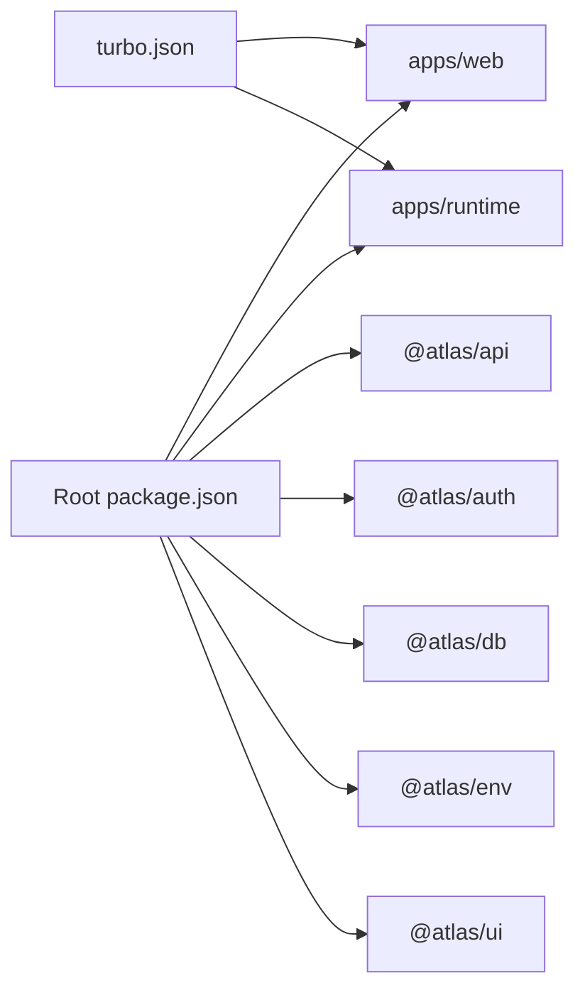

# Architecture Overview

<cite>
**Referenced Files in This Document**
- [package.json](file://package.json)
- [turbo.json](file://turbo.json)
- [README.md](file://README.md)
- [apps/web/package.json](file://apps/web/package.json)
- [apps/runtime/package.json](file://apps/runtime/package.json)
- [packages/api/src/index.ts](file://packages/api/src/index.ts)
- [packages/auth/src/index.ts](file://packages/auth/src/index.ts)
- [apps/web/src/app/api/trpc/[trpc]/route.ts](file://apps/web/src/app/api/trpc/[trpc]/route.ts)
- [apps/web/src/app/api/auth/[...all]/route.ts](file://apps/web/src/app/api/auth/[...all]/route.ts)
- [apps/runtime/agent/agent.ts](file://apps/runtime/agent/agent.ts)
</cite>

## Table of Contents

1. Introduction
2. Project Structure
3. Core Components
4. Architecture Overview
5. Detailed Component Analysis
6. Dependency Analysis
7. Performance Considerations
8. Troubleshooting Guide
9. Conclusion

## Introduction

This document explains the high-level architecture of the Atlas monorepo, focusing on layered design and component interactions across:

- Frontend: Next.js web application
- Backend API: tRPC-based API layer
- AI Runtime: Eve framework agent runtime
- Shared packages: reusable modules for auth, database, environment, UI, and configuration

It also documents how Turborepo orchestrates tasks and caching, how data flows between components, integration with external services via Composio, and cross-cutting concerns such as type safety, error handling, and security.

## Project Structure

Atlas is a Turborepo monorepo with two apps and multiple shared packages:

- apps/web: Next.js frontend that exposes tRPC endpoints and Better-Auth routes
- apps/runtime: Eve-based AI agent runtime with channels and tools
- packages/*: Shared libraries including API (tRPC), Auth (Better-Auth), DB (Drizzle schema), Env (validated env), UI (shared components), and Config

Turborepo defines global environment variables and task pipelines to build, lint, type-check, and run development servers consistently across packages.

**Diagram sources**

- [package.json:1-66](file://package.json#L1-L66)
- [turbo.json:1-52](file://turbo.json#L1-L52)

**Section sources**

- [package.json:1-66](file://package.json#L1-L66)
- [turbo.json:1-52](file://turbo.json#L1-L52)
- [README.md:79-107](file://README.md#L79-L107)

## Core Components

- Web app (Next.js): Provides UI and server-side routes for tRPC and authentication. It consumes shared packages for API client types, UI primitives, and environment validation.
- API layer (tRPC): Defines procedures with context and protection middleware; exposed via Next.js route handler.
- Auth (Better-Auth): Centralized authentication with Drizzle adapter, Telegram plugin, Google OAuth, cookies, and trusted origins.
- Database (Drizzle): Schema definitions and migrations under a PostgreSQL database.
- AI Runtime (Eve): Agent definition and channel integrations for processing requests through an event-driven pipeline.
- Shared packages: Environment validation, UI components, config, and API utilities.

Key responsibilities:

- Type safety: End-to-end types flow from server routers to client via tRPC and shared schemas.
- Security: Session checks in protected procedures; Better-Auth manages sessions and tokens; CORS and trusted origins configured centrally.
- Extensibility: Channels and tools in the runtime enable pluggable integrations (e.g., Composio).

**Section sources**

- [apps/web/package.json:1-47](file://apps/web/package.json#L1-L47)
- [apps/runtime/package.json:1-29](file://apps/runtime/package.json#L1-L29)
- [packages/api/src/index.ts:1-26](file://packages/api/src/index.ts#L1-L26)
- [packages/auth/src/index.ts:1-43](file://packages/auth/src/index.ts#L1-L43)

## Architecture Overview

The system follows a layered architecture:

- Presentation: Next.js pages and components render UI and call tRPC endpoints.
- API: tRPC router enforces input validation and authorization, then delegates to business logic.
- Data: Drizzle ORM interacts with PostgreSQL.
- AI Runtime: Eve agent processes asynchronous workflows, using channels and tools like Composio to interact with external services.

**Diagram sources**

- [apps/web/src/app/api/trpc/[trpc]/route.ts:1-14](file://apps/web/src/app/api/trpc/[trpc]/route.ts#L1-L14)
- [packages/api/src/index.ts:1-26](file://packages/api/src/index.ts#L1-L26)
- [packages/auth/src/index.ts:1-43](file://packages/auth/src/index.ts#L1-L43)
- [apps/runtime/agent/agent.ts:1-8](file://apps/runtime/agent/agent.ts#L1-L8)

## Detailed Component Analysis

### tRPC API Layer

- Initialization and context: The tRPC instance is created with typed context, enabling consistent session and request metadata across procedures.
- Procedures: Public and protected procedures are exported; protected procedures enforce session presence and return standardized errors when unauthorized.
- Route handler: Next.js route forwards GET/POST to tRPC’s fetch handler, wiring the app router and context factory.

**Diagram sources**

- [apps/web/src/app/api/trpc/[trpc]/route.ts:1-14](file://apps/web/src/app/api/trpc/[trpc]/route.ts#L1-L14)
- [packages/api/src/index.ts:1-26](file://packages/api/src/index.ts#L1-L26)

**Section sources**

- [packages/api/src/index.ts:1-26](file://packages/api/src/index.ts#L1-L26)
- [apps/web/src/app/api/trpc/[trpc]/route.ts:1-14](file://apps/web/src/app/api/trpc/[trpc]/route.ts#L1-L14)

### Authentication Flow (Better-Auth)

- Server setup: Better-Auth is configured with Drizzle adapter, email/password, Telegram plugin, Google OAuth, cookies, and trusted origins.
- Next.js integration: Routes under /api/auth are proxied to Better-Auth handlers for login, logout, and callbacks.
- Client usage: The web app uses the auth client to manage sessions and user state.

**Diagram sources**

- [packages/auth/src/index.ts:1-43](file://packages/auth/src/index.ts#L1-L43)
- [apps/web/src/app/api/auth/[...all]/route.ts:1-5](file://apps/web/src/app/api/auth/[...all]/route.ts#L1-L5)

**Section sources**

- [packages/auth/src/index.ts:1-43](file://packages/auth/src/index.ts#L1-L43)
- [apps/web/src/app/api/auth/[...all]/route.ts:1-5](file://apps/web/src/app/api/auth/[...all]/route.ts#L1-L5)

### AI Runtime (Eve Framework)

- Agent definition: The runtime defines an agent with a model provider, enabling conversational or workflow execution.
- Channels and tools: Channels (e.g., eve, telegram, twilio) and tools (e.g., composio) allow the agent to receive inputs and perform actions on external systems.
- Request processing: Incoming events are routed through channels into the agent, which can orchestrate multi-step tasks and integrate with external APIs.

**Diagram sources**

- [apps/runtime/agent/agent.ts:1-8](file://apps/runtime/agent/agent.ts#L1-L8)

**Section sources**

- [apps/runtime/package.json:1-29](file://apps/runtime/package.json#L1-L29)
- [apps/runtime/agent/agent.ts:1-8](file://apps/runtime/agent/agent.ts#L1-L8)

### Shared Packages

- @atlas/api: tRPC initialization, procedures, and routers; provides typed APIs consumed by the web app.
- @atlas/auth: Centralized auth configuration with plugins and adapters.
- @atlas/db: Drizzle schema and migrations for PostgreSQL.
- @atlas/env: Environment variable validation and schemas used across apps and packages.
- @atlas/ui: Shared shadcn/ui components and styles reused by the web app.
- @atlas/config: Shared TypeScript and tooling configurations.

These packages promote reuse, consistency, and strong typing across the monorepo.

**Section sources**

- [packages/api/src/index.ts:1-26](file://packages/api/src/index.ts#L1-L26)
- [packages/auth/src/index.ts:1-43](file://packages/auth/src/index.ts#L1-L43)
- [apps/web/package.json:1-47](file://apps/web/package.json#L1-L47)

## Dependency Analysis

- Monorepo workspaces: The root package.json declares workspaces for apps and packages, enabling unified dependency management and linking.
- Turborepo tasks: Global environment variables and task definitions ensure consistent builds, type checks, and dev runs across the workspace.
- Cross-package imports: The web app depends on @atlas/api, @atlas/auth, @atlas/env, and @atlas/ui; the runtime depends on @atlas/auth and external AI libraries.

**Diagram sources**

- [package.json:1-66](file://package.json#L1-L66)
- [turbo.json:1-52](file://turbo.json#L1-L52)

**Section sources**

- [package.json:1-66](file://package.json#L1-L66)
- [turbo.json:1-52](file://turbo.json#L1-L52)

## Performance Considerations

- Turborepo caching: Build outputs and caches are scoped per task; environment files influence cache keys to avoid stale builds.
- Incremental builds: DependsOn relationships ensure upstream dependencies rebuild before downstream tasks.
- Development mode: Dev tasks are persistent and uncached to support hot reloading.
- Network efficiency: tRPC reduces payload size via strict typing and minimal serialization overhead.
- Database access: Use Drizzle queries efficiently; consider batching and indexing strategies at the schema level.

[No sources needed since this section provides general guidance]

## Troubleshooting Guide

- Unauthorized access: Protected tRPC procedures throw UNAUTHORIZED when no session is present; verify Better-Auth cookie configuration and trusted origins.
- Environment misconfiguration: Ensure all global environment variables defined in Turborepo are set for both web and runtime tasks.
- Database connectivity: Confirm DATABASE_URL and Drizzle adapter settings; use db:migrate and db:studio to validate schema and connections.
- External integrations: For Composio and other tools, verify API keys and network access from the runtime environment.

**Section sources**

- [packages/api/src/index.ts:11-25](file://packages/api/src/index.ts#L11-L25)
- [turbo.json:4-19](file://turbo.json#L4-L19)
- [packages/auth/src/index.ts:10-39](file://packages/auth/src/index.ts#L10-L39)

## Conclusion

Atlas employs a clean, layered architecture with clear separation of concerns:

- Next.js serves as the presentation layer and tRPC gateway
- tRPC ensures type-safe APIs with robust authorization
- Better-Auth centralizes authentication and session management
- Drizzle models a strongly-typed data layer
- Eve powers an extensible AI runtime with channels and tools
- Turborepo coordinates builds, caching, and environment configuration

This design promotes maintainability, scalability, and developer productivity while providing secure and efficient communication across layers.

[No sources needed since this section summarizes without analyzing specific files]
