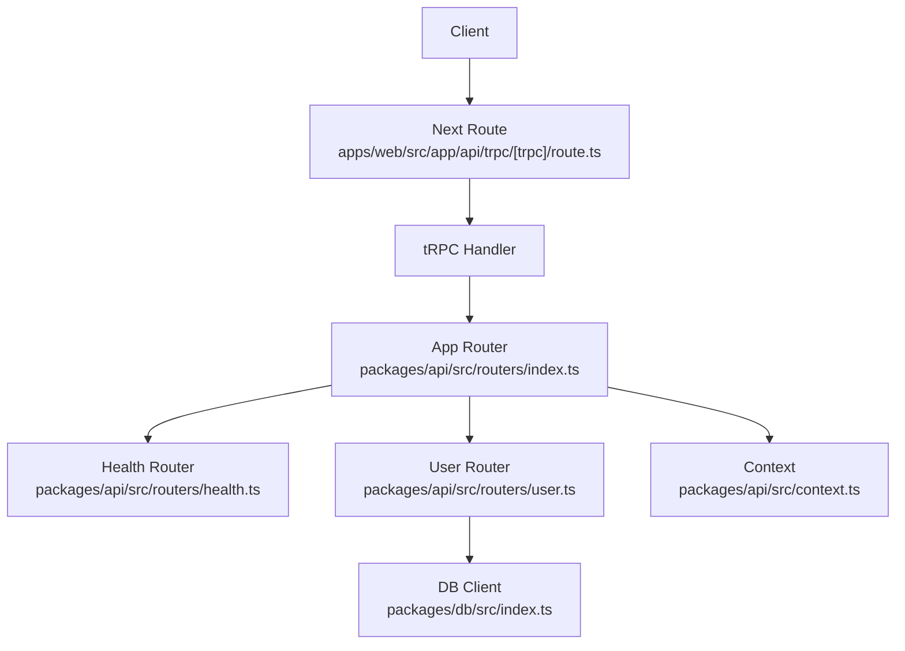
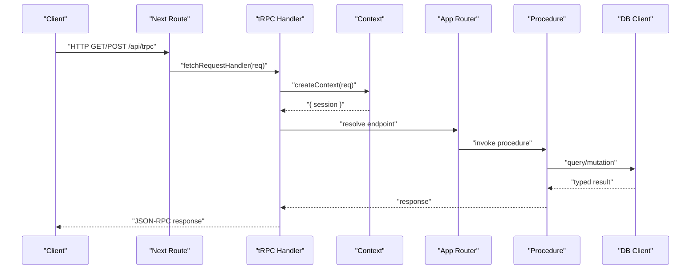
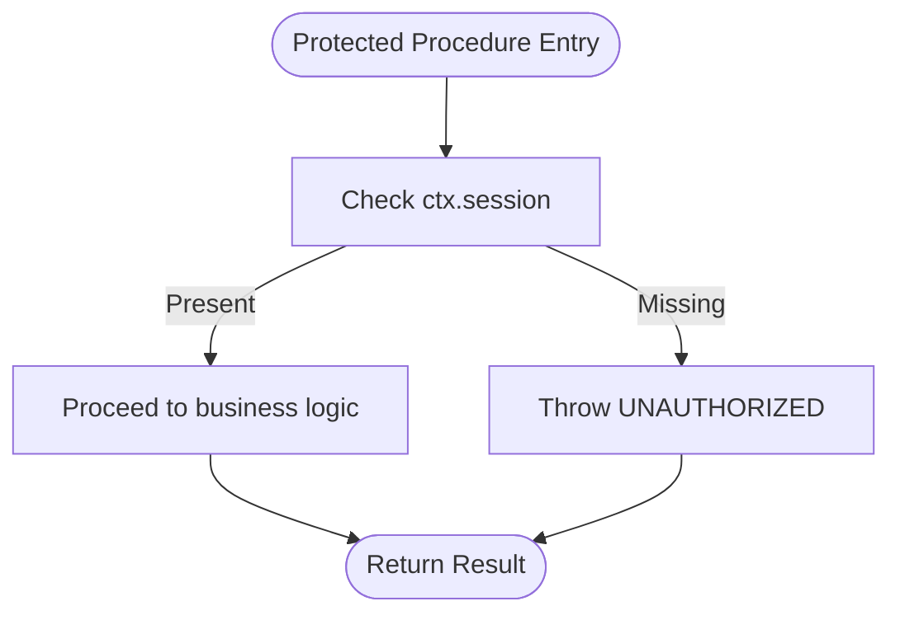
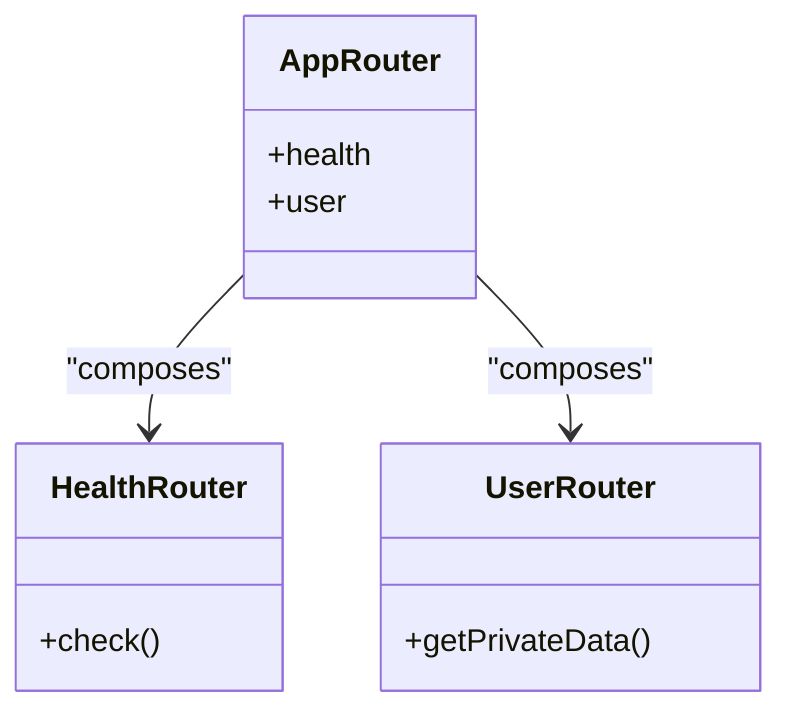
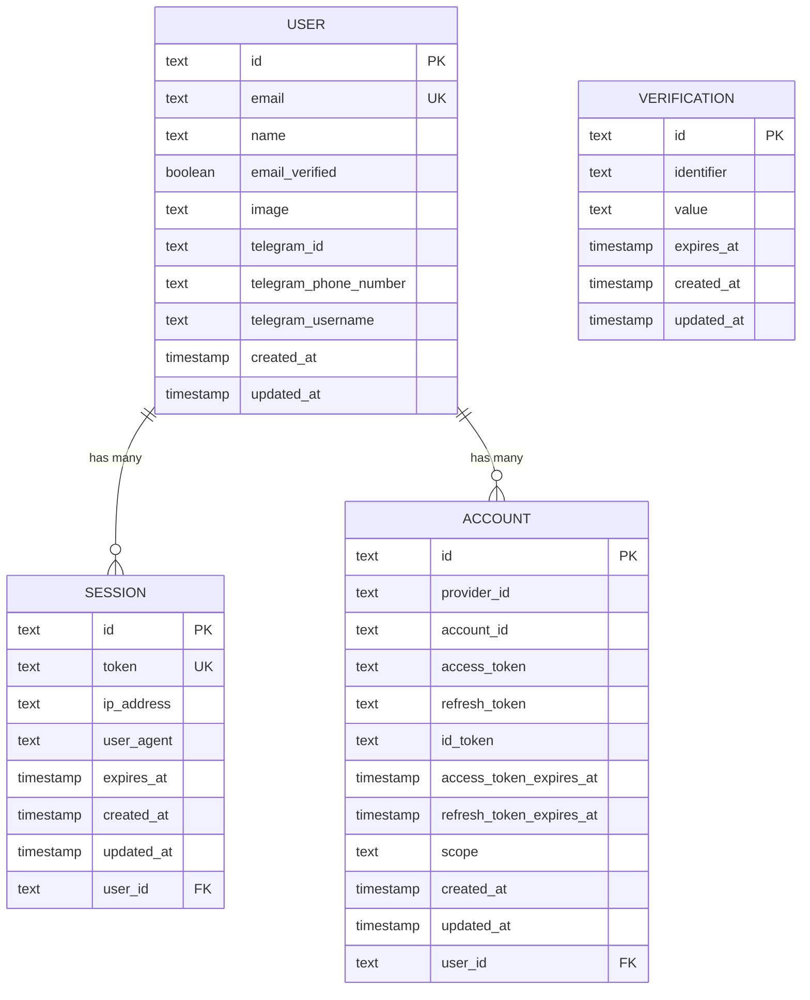
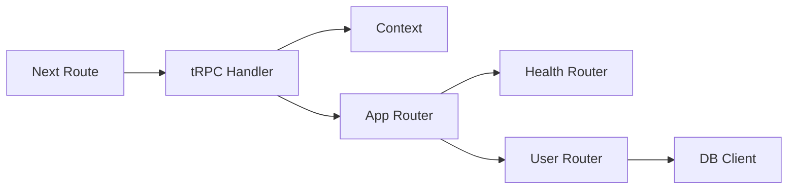

# Backend API Layer

<cite>
**Referenced Files in This Document**
- [route.ts](file://apps/web/src/app/api/trpc/[trpc]/route.ts)
- [index.ts](file://packages/api/src/index.ts)
- [context.ts](file://packages/api/src/context.ts)
- [index.ts](file://packages/api/src/routers/index.ts)
- [health.ts](file://packages/api/src/routers/health.ts)
- [user.ts](file://packages/api/src/routers/user.ts)
- [index.ts](file://packages/db/src/index.ts)
- [auth.ts](file://packages/db/src/schema/auth.ts)
</cite>

## Table of Contents

1. Introduction
2. Project Structure
3. Core Components
4. Architecture Overview
5. Detailed Component Analysis
6. Dependency Analysis
7. Performance Considerations
8. Troubleshooting Guide
9. Conclusion

## Introduction

This document explains the tRPC-based backend API layer with a focus on type-safe API design, router organization (public and protected procedures), input validation patterns using Zod, error handling strategies, middleware pipeline for authentication and request processing, CRUD procedure patterns, business logic encapsulation, and database interactions via Drizzle ORM. It also provides guidance on creating new endpoints, implementing authorization checks, handling complex queries, testing strategies, and performance optimization techniques.

## Project Structure

The API is implemented as a Next.js route that delegates to a tRPC app router defined in a shared package. The context resolves the authenticated session, routers define public and protected procedures, and the database package exposes a typed Drizzle client.

**Diagram sources**

- [route.ts:1-14](file://apps/web/src/app/api/trpc/[trpc]/route.ts#L1-L14)
- [index.ts:5-10](file://packages/api/src/routers/index.ts#L5-L10)
- [health.ts:1-6](file://packages/api/src/routers/health.ts#L1-L6)
- [user.ts:1-9](file://packages/api/src/routers/user.ts#L1-L9)
- [context.ts:1-15](file://packages/api/src/context.ts#L1-L15)
- [index.ts:1-13](file://packages/db/src/index.ts#L1-L13)

**Section sources**

- [route.ts:1-14](file://apps/web/src/app/api/trpc/[trpc]/route.ts#L1-L14)
- [index.ts:1-11](file://packages/api/src/routers/index.ts#L1-L11)

## Core Components

- tRPC initialization and procedure builders:
  - Public procedures are exposed without authentication.
  - Protected procedures enforce an active session and propagate it into the context for downstream use.
- Context:
  - Resolves the current session from the auth provider using request headers.
- Routers:
  - Aggregated into a single app router for type inference across the stack.
  - Feature-scoped routers (e.g., health, user) keep concerns separated.
- Database:
  - A typed Drizzle client created with Neon HTTP and schema definitions.

**Section sources**

- [index.ts:1-26](file://packages/api/src/index.ts#L1-L26)
- [context.ts:1-15](file://packages/api/src/context.ts#L1-L15)
- [index.ts:1-11](file://packages/api/src/routers/index.ts#L1-L11)
- [index.ts:1-13](file://packages/db/src/index.ts#L1-L13)

## Architecture Overview

The request lifecycle flows through the Next.js route handler into tRPC, which constructs a context per request, applies middleware (authentication), routes to the appropriate router/procedure, and returns a typed response.

**Diagram sources**

- [route.ts:1-14](file://apps/web/src/app/api/trpc/[trpc]/route.ts#L1-L14)
- [context.ts:1-15](file://packages/api/src/context.ts#L1-L15)
- [index.ts:1-11](file://packages/api/src/routers/index.ts#L1-L11)
- [index.ts:1-13](file://packages/db/src/index.ts#L1-L13)

## Detailed Component Analysis

### Authentication and Authorization Middleware

- Session resolution occurs in context by calling the auth provider with request headers.
- Protected procedures enforce that a session exists; otherwise, they throw a standardized unauthorized error.
- Authorization beyond authentication can be added within procedures by checking ctx.session properties against requested resources.

**Diagram sources**

- [index.ts:11-25](file://packages/api/src/index.ts#L11-L25)
- [context.ts:1-15](file://packages/api/src/context.ts#L1-L15)

**Section sources**

- [index.ts:11-25](file://packages/api/src/index.ts#L11-L25)
- [context.ts:1-15](file://packages/api/src/context.ts#L1-L15)

### Router Organization and Type Safety

- The app router aggregates feature routers, enabling end-to-end type inference for clients.
- Each feature router groups related procedures (e.g., health checks, user operations).
- Procedures are strongly typed inputs and outputs based on their implementation and any schemas used.

**Diagram sources**

- [index.ts:1-11](file://packages/api/src/routers/index.ts#L1-L11)
- [health.ts:1-6](file://packages/api/src/routers/health.ts#L1-L6)
- [user.ts:1-9](file://packages/api/src/routers/user.ts#L1-L9)

**Section sources**

- [index.ts:1-11](file://packages/api/src/routers/index.ts#L1-L11)
- [health.ts:1-6](file://packages/api/src/routers/health.ts#L1-L6)
- [user.ts:1-9](file://packages/api/src/routers/user.ts#L1-L9)

### Input Validation with Zod Schemas

- While the current routers do not include Zod schemas, the recommended pattern is to validate all inputs at the procedure boundary using Zod schemas.
- Benefits:
  - Runtime validation with precise error messages.
  - Compile-time types derived from schemas for both server and client.
- Example usage pattern:
  - Define a Zod schema for each mutation/query input.
  - Parse and assert inputs inside the procedure before executing business logic.
  - Return structured errors or success payloads.

[No sources needed since this section describes recommended patterns rather than specific code]

### Error Handling Strategies

- Unauthorized access:
  - Protected procedures throw a standardized UNAUTHORIZED error when no session is present.
- Input validation errors:
  - Use Zod parsing to return descriptive validation errors early.
- Business rule violations:
  - Throw domain-specific errors with clear codes/messages.
- Database errors:
  - Catch and map underlying errors to consistent API responses.

**Section sources**

- [index.ts:11-25](file://packages/api/src/index.ts#L11-L25)

### CRUD Operations and Database Interactions via Drizzle ORM

- The database package exports a typed Drizzle client configured with Neon HTTP and schema definitions.
- Recommended patterns:
  - Encapsulate data access in repository-like functions or service modules.
  - Use transactions for multi-step mutations to maintain consistency.
  - Compose queries with filters, joins, and selects to minimize over-fetching.
  - Leverage relations defined in the schema for readable queries.

**Diagram sources**

- [auth.ts:1-101](file://packages/db/src/schema/auth.ts#L1-L101)

**Section sources**

- [index.ts:1-13](file://packages/db/src/index.ts#L1-L13)
- [auth.ts:1-101](file://packages/db/src/schema/auth.ts#L1-L101)

### Creating New Endpoints

Steps to add a new endpoint:

1. Create or extend a feature router file under packages/api/src/routers.
2. Define a procedure:
   - Use publicProcedure for unauthenticated reads.
   - Use protectedProcedure for authenticated writes or sensitive reads.
3. Add input validation with Zod if needed.
4. Implement business logic and call the DB client for persistence.
5. Register the router in the app router aggregator.

**Section sources**

- [index.ts:1-11](file://packages/api/src/routers/index.ts#L1-L11)
- [health.ts:1-6](file://packages/api/src/routers/health.ts#L1-L6)
- [user.ts:1-9](file://packages/api/src/routers/user.ts#L1-L9)

### Implementing Authorization Checks

- For resource-level authorization:
  - After authentication, verify that the requesting user has permission to access the target resource.
  - Compare identifiers from ctx.session.user with the requested resource ID.
  - Throw a domain-specific error if unauthorized.

[No sources needed since this section describes general authorization patterns]

### Handling Complex Queries

- Use Drizzle relations and selective column projection to optimize queries.
- Apply pagination, filtering, and sorting at the query layer.
- Consider caching read-heavy queries where appropriate.

[No sources needed since this section provides general guidance]

## Dependency Analysis

High-level dependencies between components:

**Diagram sources**

- [route.ts:1-14](file://apps/web/src/app/api/trpc/[trpc]/route.ts#L1-L14)
- [index.ts:1-11](file://packages/api/src/routers/index.ts#L1-L11)
- [health.ts:1-6](file://packages/api/src/routers/health.ts#L1-L6)
- [user.ts:1-9](file://packages/api/src/routers/user.ts#L1-L9)
- [context.ts:1-15](file://packages/api/src/context.ts#L1-L15)
- [index.ts:1-13](file://packages/db/src/index.ts#L1-L13)

**Section sources**

- [route.ts:1-14](file://apps/web/src/app/api/trpc/[trpc]/route.ts#L1-L14)
- [index.ts:1-11](file://packages/api/src/routers/index.ts#L1-L11)

## Performance Considerations

- Minimize payload size by selecting only required columns in queries.
- Use indexes effectively (e.g., userId indexes already defined in schema).
- Cache frequent reads at the application or CDN level where applicable.
- Batch independent operations to reduce round trips.
- Avoid N+1 queries by leveraging relations and joins.

[No sources needed since this section provides general guidance]

## Troubleshooting Guide

Common issues and resolutions:

- Unauthorized errors:
  - Ensure the request includes valid session headers.
  - Verify that protected procedures are used for sensitive endpoints.
- Validation failures:
  - Validate inputs with Zod schemas and return detailed error messages.
- Database connectivity:
  - Confirm DATABASE_URL and Neon configuration.
  - Check migrations and schema alignment.

**Section sources**

- [index.ts:11-25](file://packages/api/src/index.ts#L11-L25)
- [index.ts:1-13](file://packages/db/src/index.ts#L1-L13)

## Conclusion

The API layer leverages tRPC for end-to-end type safety, a clean separation of concerns via routers, robust authentication through context and protected procedures, and a typed database layer with Drizzle ORM. By adopting Zod for input validation, standardizing error handling, and following best practices for queries and authorization, the system remains scalable, maintainable, and performant.
