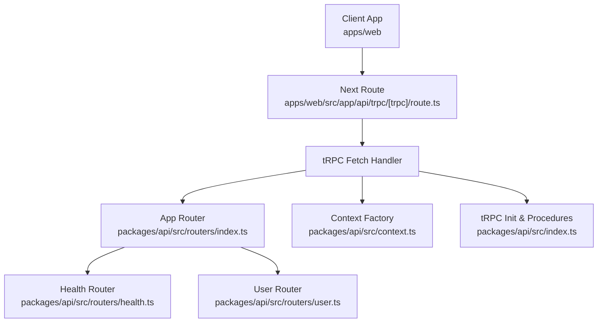
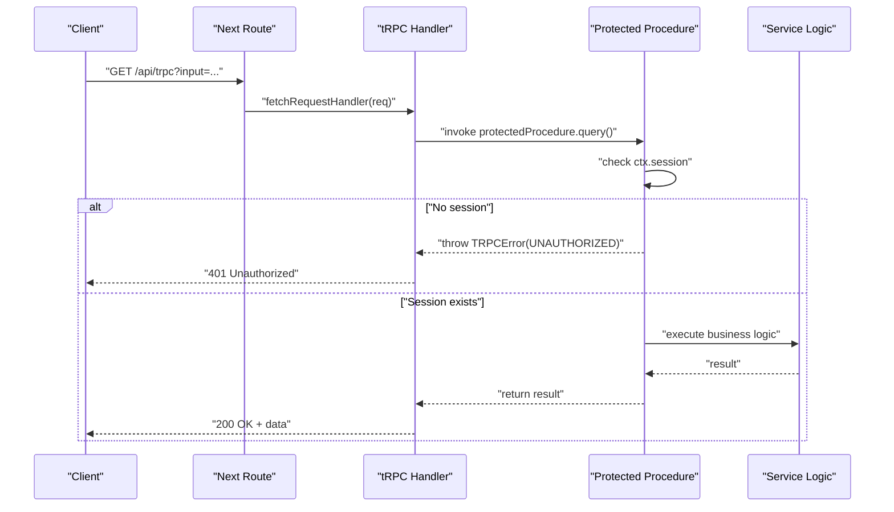
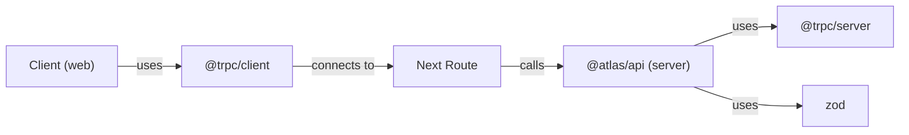

# Input Validation and Error Handling

<cite>
**Referenced Files in This Document**
- [route.ts](file://apps/web/src/app/api/trpc/[trpc]/route.ts)
- [index.ts](file://packages/api/src/index.ts)
- [context.ts](file://packages/api/src/context.ts)
- [index.ts](file://packages/api/src/routers/index.ts)
- [health.ts](file://packages/api/src/routers/health.ts)
- [user.ts](file://packages/api/src/routers/user.ts)
- [trpc.ts](file://apps/web/src/utils/trpc.ts)
- [package.json](file://packages/api/package.json)
</cite>

## Table of Contents

1. Introduction
2. Project Structure
3. Core Components
4. Architecture Overview
5. Detailed Component Analysis
6. Dependency Analysis
7. Performance Considerations
8. Troubleshooting Guide
9. Conclusion
10. Appendices

## Introduction

This document explains how input validation and error handling are implemented in the tRPC API layer for this project. It covers:

- How to integrate Zod schemas for request validation and type-safe parameters
- How to generate OpenAPI specifications from tRPC routers
- Error handling patterns using TRPCError, custom errors, propagation, and user-friendly messages
- Examples for complex nested objects, conditional rules, and async validations
- Internationalization strategies for error messages
- Logging and debugging techniques
- Guidelines for consistent error responses across all endpoints

## Project Structure

The tRPC API is exposed via a Next.js route that delegates to the tRPC fetch handler. The server-side package defines the tRPC context, procedures, and routers. The client package configures the tRPC client with error handling and retries.

**Diagram sources**

- [route.ts:1-13](file://apps/web/src/app/api/trpc/[trpc]/route.ts#L1-L13)
- [index.ts:1-25](file://packages/api/src/index.ts#L1-L25)
- [context.ts:1-15](file://packages/api/src/context.ts#L1-L15)
- [index.ts:1-11](file://packages/api/src/routers/index.ts#L1-L11)
- [health.ts:1-6](file://packages/api/src/routers/health.ts#L1-L6)
- [user.ts:1-9](file://packages/api/src/routers/user.ts#L1-L9)

**Section sources**

- [route.ts:1-13](file://apps/web/src/app/api/trpc/[trpc]/route.ts#L1-L13)
- [index.ts:1-25](file://packages/api/src/index.ts#L1-L25)
- [context.ts:1-15](file://packages/api/src/context.ts#L1-L15)
- [index.ts:1-11](file://packages/api/src/routers/index.ts#L1-L11)
- [health.ts:1-6](file://packages/api/src/routers/health.ts#L1-L6)
- [user.ts:1-9](file://packages/api/src/routers/user.ts#L1-L9)

## Core Components

- tRPC initialization and procedure builders:
  - Public and protected procedures are defined centrally. Protected procedures enforce authentication by throwing a standardized UNAUTHORIZED error when no session is present.
- Context factory:
  - Builds per-request context (e.g., session) used by procedures.
- Routers:
  - Feature-scoped routers (health, user) composed into an app router.
- Next.js route:
  - Exposes GET/POST handlers that invoke the tRPC fetch handler with the app router and context factory.
- Client configuration:
  - Configures HTTP batching and global error handling (e.g., toast notifications and retry).

Key responsibilities:

- Centralized error codes and messages for consistent API responses
- Type-safe contexts and procedures
- Clear separation between public and protected endpoints

**Section sources**

- [index.ts:1-25](file://packages/api/src/index.ts#L1-L25)
- [context.ts:1-15](file://packages/api/src/context.ts#L1-L15)
- [index.ts:1-11](file://packages/api/src/routers/index.ts#L1-L11)
- [health.ts:1-6](file://packages/api/src/routers/health.ts#L1-L6)
- [user.ts:1-9](file://packages/api/src/routers/user.ts#L1-L9)
- [route.ts:1-13](file://apps/web/src/app/api/trpc/[trpc]/route.ts#L1-L13)
- [trpc.ts:1-39](file://apps/web/src/utils/trpc.ts#L1-L39)

## Architecture Overview

End-to-end flow for a protected query:

**Diagram sources**

- [route.ts:1-13](file://apps/web/src/app/api/trpc/[trpc]/route.ts#L1-L13)
- [index.ts:11-25](file://packages/api/src/index.ts#L11-L25)
- [user.ts:1-9](file://packages/api/src/routers/user.ts#L1-L9)

## Detailed Component Analysis

### tRPC Initialization and Protected Procedures

- A central tRPC instance is created with typed context.
- Public procedures accept unauthenticated requests.
- Protected procedures validate session presence and throw a standardized UNAUTHORIZED error if missing.

Recommendations:

- Use protectedProcedure for any endpoint requiring authentication.
- Keep error messages concise and user-facing; log additional details server-side.

**Section sources**

- [index.ts:1-25](file://packages/api/src/index.ts#L1-L25)

### Context Factory

- Builds per-request context including session information.
- Ensures downstream procedures can rely on a consistent shape.

Best practices:

- Fail fast if required context cannot be resolved.
- Avoid leaking sensitive data in logs.

**Section sources**

- [context.ts:1-15](file://packages/api/src/context.ts#L1-L15)

### Routers Composition

- Feature routers (health, user) are composed into a single app router.
- Each router groups related procedures for clarity and maintainability.

Guidelines:

- Keep routers small and focused.
- Export types for client inference.

**Section sources**

- [index.ts:1-11](file://packages/api/src/routers/index.ts#L1-L11)
- [health.ts:1-6](file://packages/api/src/routers/health.ts#L1-L6)
- [user.ts:1-9](file://packages/api/src/routers/user.ts#L1-L9)

### Next.js Route Handler

- Exposes GET and POST handlers that delegate to tRPC’s fetch adapter.
- Provides the endpoint path and router to the handler.

Operational notes:

- Ensure credentials are included on client calls to support sessions.
- Keep the route minimal; put logic in routers and procedures.

**Section sources**

- [route.ts:1-13](file://apps/web/src/app/api/trpc/[trpc]/route.ts#L1-L13)

### Client Error Handling

- Global error hook displays user-friendly messages and offers retry actions.
- Batching reduces network overhead for multiple queries/mutations.

Client-side guidance:

- Surface actionable errors to users.
- Retry transient failures where appropriate.

**Section sources**

- [trpc.ts:1-39](file://apps/web/src/utils/trpc.ts#L1-L39)

### Zod Integration for Request Validation

Zod is available in the API package and can be integrated with tRPC procedures to validate inputs at the boundary.

Patterns:

- Define reusable schemas for shared inputs.
- Validate request bodies or query parameters before executing business logic.
- Return structured validation errors using tRPC’s error mechanisms.

Examples to implement:

- Complex nested objects: define nested schemas and use .refine() for cross-field checks.
- Conditional rules: use .superRefine() to add conditional constraints based on other fields.
- Async validation: perform database lookups inside .refine() or .superRefine() to enforce uniqueness or availability.

Type safety:

- Infer TypeScript types from schemas to ensure end-to-end type consistency.

OpenAPI generation:

- Use a tool such as tRPC OpenAPI to automatically generate OpenAPI specs from your routers and Zod schemas.

Note: Add these integrations within your routers/procedures following the existing structure.

[No sources needed since this section provides integration guidance without analyzing specific files]

### Error Handling Patterns

Standardized errors:

- Use TRPCError with explicit codes (e.g., UNAUTHORIZED, BAD_REQUEST, NOT_FOUND) and user-facing messages.
- Include cause or metadata for logging while keeping messages safe for clients.

Propagation:

- Throw errors early in procedures or middleware to short-circuit processing.
- Centralize error formatting in a single place to ensure consistency.

User-friendly messages:

- Provide clear, actionable feedback to clients.
- Log detailed diagnostics server-side for debugging.

Consistent response guidelines:

- Always include a stable error code and message.
- Avoid exposing internal stack traces or secrets to clients.

[No sources needed since this section provides general guidance]

### Internationalization Support for Error Messages

Strategies:

- Store user-facing messages in a localization resource keyed by error code.
- Resolve the locale from the request context and return localized messages.
- Keep technical details separate from i18n payloads.

Implementation tips:

- Map TRPCError codes to i18n keys.
- Fallback to English if a translation is missing.

[No sources needed since this section provides general guidance]

### Logging and Debugging Techniques

Server-side:

- Log full error details (codes, causes, request IDs) with appropriate levels.
- Mask sensitive data in logs.

Client-side:

- Display user-friendly messages and offer retry actions.
- Capture error context for analytics when necessary.

Debugging:

- Enable verbose logging in development.
- Use request IDs to correlate client and server logs.

[No sources needed since this section provides general guidance]

## Dependency Analysis

The API package depends on tRPC server/client and Zod. The Next route wires the tRPC handler to the app router and context.

**Diagram sources**

- [package.json:13-22](file://packages/api/package.json#L13-L22)
- [route.ts:1-13](file://apps/web/src/app/api/trpc/[trpc]/route.ts#L1-L13)
- [trpc.ts:1-39](file://apps/web/src/utils/trpc.ts#L1-L39)

**Section sources**

- [package.json:13-22](file://packages/api/package.json#L13-L22)
- [route.ts:1-13](file://apps/web/src/app/api/trpc/[trpc]/route.ts#L1-L13)
- [trpc.ts:1-39](file://apps/web/src/utils/trpc.ts#L1-L39)

## Performance Considerations

- Batch client requests to reduce round trips.
- Validate inputs early to fail fast and avoid unnecessary work.
- Cache expensive computations where appropriate.
- Keep context creation lightweight; defer heavy operations until needed.

[No sources needed since this section provides general guidance]

## Troubleshooting Guide

Common issues and resolutions:

- Authentication failures:
  - Ensure the client includes credentials and the session is present in context.
  - Check that protected procedures throw UNAUTHORIZED when session is missing.
- Validation errors:
  - Verify Zod schemas match expected inputs and provide clear messages.
  - Confirm client sends correctly shaped payloads.
- Network and batching:
  - Inspect client links and URL configuration.
  - Ensure CORS and cookies are configured for cross-origin scenarios.

Logging checklist:

- Record error codes, messages, and request identifiers.
- Avoid logging sensitive data.

[No sources needed since this section provides general guidance]

## Conclusion

This project establishes a solid foundation for tRPC-based APIs with centralized procedure definitions, typed context, and standardized error handling. By integrating Zod for validation, generating OpenAPI specs, and adopting consistent error patterns, you can deliver robust, type-safe, and user-friendly APIs. Apply the guidelines above to scale validation and error handling consistently across all endpoints.

[No sources needed since this section summarizes without analyzing specific files]

## Appendices

### Endpoints Reference

- Health check:
  - Endpoint: health.check
  - Method: Query
  - Auth: Public
  - Response: Status string
- Private data:
  - Endpoint: user.getPrivateData
  - Method: Query
  - Auth: Required (protected)
  - Response: Object containing message and user

**Section sources**

- [health.ts:1-6](file://packages/api/src/routers/health.ts#L1-L6)
- [user.ts:1-9](file://packages/api/src/routers/user.ts#L1-L9)
