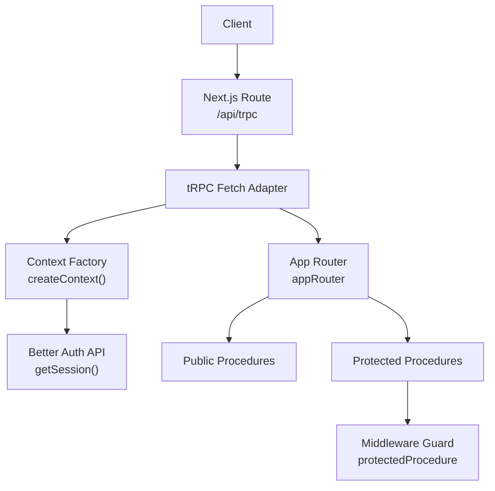
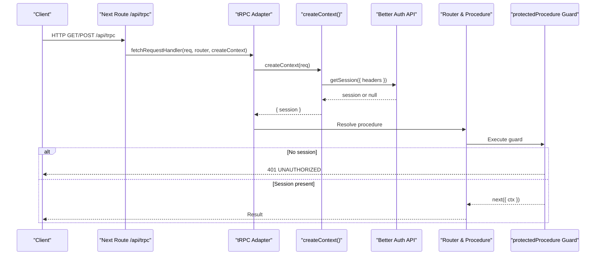
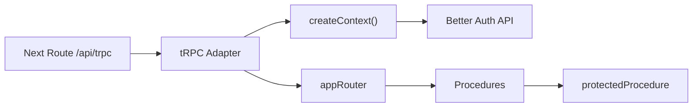

# Middleware and Authentication

<cite>
**Referenced Files in This Document**
- [route.ts](file://apps/web/src/app/api/trpc/[trpc]/route.ts)
- [context.ts](file://packages/api/src/context.ts)
- [index.ts](file://packages/api/src/index.ts)
- [index.ts](file://packages/api/src/routers/index.ts)
- [user.ts](file://packages/api/src/routers/user.ts)
- [health.ts](file://packages/api/src/routers/health.ts)
- [route.ts](file://apps/web/src/app/api/auth/[...all]/route.ts)
- [index.ts](file://packages/auth/src/index.ts)
- [auth-client.ts](file://apps/web/src/lib/auth-client.ts)
</cite>

## Table of Contents

1. Introduction
2. Project Structure
3. Core Components
4. Architecture Overview
5. Detailed Component Analysis
6. Dependency Analysis
7. Performance Considerations
8. Troubleshooting Guide
9. Conclusion
10. Appendices

## Introduction

This document explains the middleware implementation and authentication flow for the tRPC API layer. It covers the middleware pipeline, session management via Better Auth, user context injection into procedures, and how protected procedures enforce authentication. It also provides guidance on extending the system with custom middleware (logging, rate limiting, request transformation), security considerations (CSRF, secure sessions), and strategies for testing authenticated procedures and mocking contexts.

## Project Structure

The tRPC API is exposed through a Next.js route that delegates to tRPC’s fetch adapter. The tRPC context resolves the current session using Better Auth. Routers define public and protected procedures. An auth route proxies to Better Auth endpoints.

**Diagram sources**

- [route.ts:6-13](file://apps/web/src/app/api/trpc/[trpc]/route.ts#L6-L13)
- [context.ts:4-12](file://packages/api/src/context.ts#L4-L12)
- [index.ts:1-26](file://packages/api/src/index.ts#L1-L26)
- [index.ts:1-11](file://packages/api/src/routers/index.ts#L1-L11)

**Section sources**

- [route.ts:6-13](file://apps/web/src/app/api/trpc/[trpc]/route.ts#L6-L13)
- [context.ts:4-12](file://packages/api/src/context.ts#L4-L12)
- [index.ts:1-26](file://packages/api/src/index.ts#L1-L26)
- [index.ts:1-11](file://packages/api/src/routers/index.ts#L1-L11)

## Core Components

- tRPC initialization and procedure builders:
  - A shared t instance is created with typed context.
  - publicProcedure exposes an unprotected procedure.
  - protectedProcedure wraps execution to ensure a valid session exists before proceeding.
- Context factory:
  - Resolves the current session from Better Auth using request headers.
  - Exposes session (and optionally other per-request data) to all procedures.
- Routers:
  - appRouter composes feature routers (health, user).
  - Example protected procedure demonstrates accessing ctx.session.user.

Key behaviors:

- Unauthenticated access to protected procedures results in a standardized UNAUTHORIZED error.
- Authenticated requests carry session data into ctx for downstream use.

**Section sources**

- [index.ts:1-26](file://packages/api/src/index.ts#L1-L26)
- [context.ts:4-12](file://packages/api/src/context.ts#L4-L12)
- [index.ts:1-11](file://packages/api/src/routers/index.ts#L1-L11)
- [user.ts:1-9](file://packages/api/src/routers/user.ts#L1-L9)

## Architecture Overview

End-to-end flow for a tRPC call:

**Diagram sources**

- [route.ts:6-13](file://apps/web/src/app/api/trpc/[trpc]/route.ts#L6-L13)
- [context.ts:4-12](file://packages/api/src/context.ts#L4-L12)
- [index.ts:11-25](file://packages/api/src/index.ts#L11-L25)

## Detailed Component Analysis

### tRPC Context and Session Resolution

- The context factory reads incoming request headers and calls Better Auth’s getSession to resolve the current session.
- The resulting context object includes session, which is then available to all procedures.
- If no session is found, ctx.session will be null, causing protected procedures to fail authorization.

Security notes:

- Ensure cookies or bearer tokens are included in client requests so Better Auth can validate sessions.
- Configure trusted origins and secure cookie settings at the auth provider level.

**Section sources**

- [context.ts:4-12](file://packages/api/src/context.ts#L4-L12)

### Middleware Pipeline and Protected Procedures

- publicProcedure is a direct alias to t.procedure for open endpoints.
- protectedProcedure is a middleware that:
  - Checks ctx.session existence.
  - Throws a standardized UNAUTHORIZED error when missing.
  - Passes the validated session forward to the procedure.

Usage pattern:

- Apply protectedProcedure to any procedure that requires authentication.
- Access ctx.session.user inside the procedure body.

Error handling:

- Unauthorized errors are returned with a consistent code and message, enabling predictable client-side handling.

**Section sources**

- [index.ts:1-26](file://packages/api/src/index.ts#L1-L26)
- [user.ts:1-9](file://packages/api/src/routers/user.ts#L1-L9)

### Routers Composition

- appRouter aggregates feature routers (health, user).
- Health router exposes a public check endpoint.
- User router demonstrates a protected query returning private data and user info.

**Section sources**

- [index.ts:1-11](file://packages/api/src/routers/index.ts#L1-L11)
- [health.ts:1-6](file://packages/api/src/routers/health.ts#L1-L6)
- [user.ts:1-9](file://packages/api/src/routers/user.ts#L1-L9)

### Authentication Endpoints

- The Next.js route under /api/auth forwards all auth-related requests to Better Auth via toNextJsHandler.
- This enables login, logout, session refresh, and social flows without custom server logic.

**Section sources**

- [route.ts:1-5](file://apps/web/src/app/api/auth/[...all]/route.ts#L1-L5)
- [index.ts:10-42](file://packages/auth/src/index.ts#L10-L42)

### Client-Side Auth Integration

- The web app initializes a Better Auth client with plugins (e.g., Telegram) to support sign-in flows and last-login tracking.
- Use this client to trigger authentication flows and keep the session synchronized with the server.

**Section sources**

- [auth-client.ts:1-8](file://apps/web/src/lib/auth-client.ts#L1-L8)

## Dependency Analysis

High-level dependencies among components:

**Diagram sources**

- [route.ts:6-13](file://apps/web/src/app/api/trpc/[trpc]/route.ts#L6-L13)
- [context.ts:4-12](file://packages/api/src/context.ts#L4-L12)
- [index.ts:1-26](file://packages/api/src/index.ts#L1-L26)

**Section sources**

- [route.ts:6-13](file://apps/web/src/app/api/trpc/[trpc]/route.ts#L6-L13)
- [context.ts:4-12](file://packages/api/src/context.ts#L4-L12)
- [index.ts:1-26](file://packages/api/src/index.ts#L1-L26)

## Performance Considerations

- Minimize work in createContext: only fetch what you need (session). Avoid heavy DB calls here.
- Cache where appropriate: if you add per-request caches, ensure they are scoped to the request lifecycle.
- Keep middleware short and fast; offload expensive operations to background jobs or separate services.
- Prefer early exits in guards to avoid unnecessary processing.

[No sources needed since this section provides general guidance]

## Troubleshooting Guide

Common issues and resolutions:

- 401 UNAUTHORIZED on protected procedures:
  - Verify that the client sends cookies or tokens required by Better Auth.
  - Check that the request reaches /api/trpc and not a different path.
  - Confirm that Better Auth is configured with correct baseURL, secret, and trustedOrigins.
- Session not resolved:
  - Ensure headers include cookies or Authorization headers as expected by Better Auth.
  - Validate CORS and cookie domain/path settings if cross-origin.
- Auth endpoints not working:
  - Confirm /api/auth routes are proxied to Better Auth.
  - Check environment variables for providers and secrets.

**Section sources**

- [index.ts:11-25](file://packages/api/src/index.ts#L11-L25)
- [route.ts:1-5](file://apps/web/src/app/api/auth/[...all]/route.ts#L1-L5)
- [index.ts:10-42](file://packages/auth/src/index.ts#L10-L42)

## Conclusion

The tRPC layer uses a simple yet robust middleware model:

- Context resolves sessions via Better Auth.
- protectedProcedure enforces authentication consistently.
- Routers compose features cleanly with clear separation between public and protected endpoints. Extensibility points exist for logging, rate limiting, and request transformation. Security relies on proper session handling and provider configuration. Testing should focus on verifying unauthorized behavior and mocked authenticated contexts.

[No sources needed since this section summarizes without analyzing specific files]

## Appendices

### Custom Middleware Examples

Below are patterns you can implement as tRPC middleware. They are conceptual examples to guide implementation.

- Logging middleware
  - Purpose: Log method, path, input, duration, and result for observability.
  - Where: Compose around procedures or globally via t.procedure.use.
  - Notes: Avoid logging sensitive data; redact tokens and PII.

- Rate limiting middleware
  - Purpose: Limit requests per IP or user within a time window.
  - Where: Global or per-router.
  - Notes: Use a shared store (memory/db/Redis); consider sliding windows; return 429 when exceeded.

- Request transformation middleware
  - Purpose: Normalize inputs, parse headers, or inject metadata (e.g., tenantId).
  - Where: Before business logic; after validation if applicable.
  - Notes: Fail fast on invalid transformations; keep side effects minimal.

[No sources needed since this section provides conceptual guidance]

### Security Considerations

- CSRF protection:
  - Better Auth supports CSRF checks; do not disable unless you fully understand the risks.
  - Ensure same-site cookies and proper origins are configured.
- Secure session handling:
  - Use HTTPS-only cookies and secure flags.
  - Set appropriate expiration and update intervals.
  - Rotate secrets regularly and manage them securely.
- Input validation:
  - Always validate inputs at the procedure boundary.
  - Combine with Zod or similar libraries for strong typing and safety.
- Least privilege:
  - Only expose necessary procedures.
  - Enforce role-based checks in protected procedures when needed.

[No sources needed since this section provides general guidance]

### Testing Authenticated Procedures

- Unit tests:
  - Call procedures directly with a mock context containing a session.
  - Assert success paths and error paths (e.g., missing session).
- Integration tests:
  - Spin up a test server and send real HTTP requests to /api/trpc.
  - Provide valid cookies/tokens to simulate authenticated users.
- Mocking Better Auth:
  - Replace getSession with a stub that returns desired session shapes.
  - Test both authenticated and unauthenticated scenarios.
- Assertions:
  - Verify status codes, error codes (e.g., UNAUTHORIZED), and response payloads.
  - Ensure logs and metrics capture expected events.

[No sources needed since this section provides general guidance]
