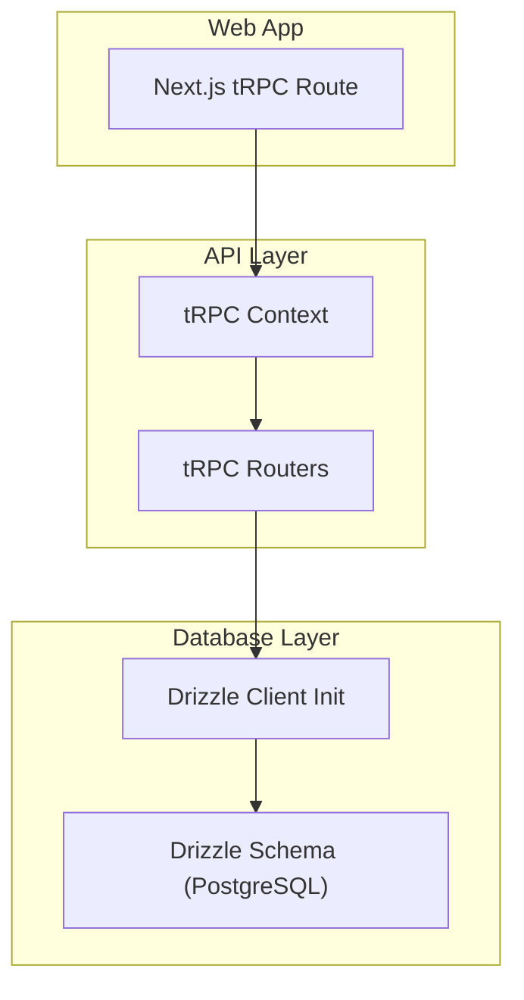
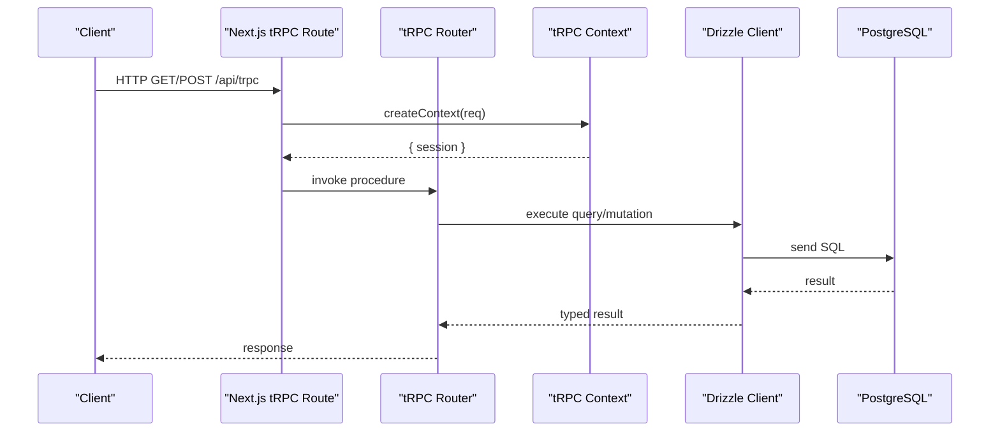
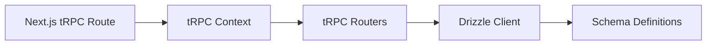

# Database Interaction Patterns

<cite>
**Referenced Files in This Document**
- [index.ts](file://packages/db/src/index.ts)
- [auth.ts](file://packages/db/src/schema/auth.ts)
- [drizzle.config.ts](file://packages/db/drizzle.config.ts)
- [package.json](file://packages/db/package.json)
- [context.ts](file://packages/api/src/context.ts)
- [index.ts](file://packages/api/src/index.ts)
- [route.ts](file://apps/web/src/app/api/trpc/[trpc]/route.ts)
- [health.ts](file://packages/api/src/routers/health.ts)
- [user.ts](file://packages/api/src/routers/user.ts)
</cite>

## Table of Contents

1. Introduction
2. Project Structure
3. Core Components
4. Architecture Overview
5. Detailed Component Analysis
6. Dependency Analysis
7. Performance Considerations
8. Troubleshooting Guide
9. Conclusion

## Introduction

This document explains how database interactions are structured using Drizzle ORM within a tRPC-based API layer. It covers query building strategies, transaction handling patterns, connection management, CRUD and complex queries, optimistic locking approaches, concurrency control, performance optimization, error handling, retry mechanisms, and connection pooling best practices. The guidance is grounded in the repository’s current setup and extended with recommended patterns for production use.

## Project Structure

The project uses a monorepo layout where:

- Database schema and client initialization live in packages/db.
- tRPC routers and context live in packages/api.
- The Next.js app exposes a tRPC endpoint in apps/web.

**Diagram sources**

- [route.ts:1-14](file://apps/web/src/app/api/trpc/[trpc]/route.ts#L1-L14)
- [context.ts:1-15](file://packages/api/src/context.ts#L1-L15)
- [index.ts:1-26](file://packages/api/src/index.ts#L1-L26)
- [index.ts:1-13](file://packages/db/src/index.ts#L1-L13)
- [auth.ts:1-101](file://packages/db/src/schema/auth.ts#L1-L101)

**Section sources**

- [route.ts:1-14](file://apps/web/src/app/api/trpc/[trpc]/route.ts#L1-L14)
- [context.ts:1-15](file://packages/api/src/context.ts#L1-L15)
- [index.ts:1-26](file://packages/api/src/index.ts#L1-L26)
- [index.ts:1-13](file://packages/db/src/index.ts#L1-L13)
- [auth.ts:1-101](file://packages/db/src/schema/auth.ts#L1-L101)

## Core Components

- Database client initialization: A Neon HTTP client is created and passed to Drizzle with the schema module. A shared instance is exported for reuse across the application.
- Schema definitions: PostgreSQL tables for user, session, account, and verification are defined with relations and indexes.
- tRPC setup: Public and protected procedures are defined; protected procedures enforce authentication via session checks.
- tRPC route handler: Next.js route forwards requests to tRPC with a context factory that resolves the session.

Key responsibilities:

- packages/db/src/index.ts: Creates and exports a typed Drizzle client bound to Neon HTTP.
- packages/db/src/schema/auth.ts: Declares tables, constraints, and relations used by queries.
- packages/api/src/index.ts: Initializes tRPC and defines procedure helpers.
- packages/api/src/context.ts: Builds request context (session).
- apps/web/src/app/api/trpc/[trpc]/route.ts: Wires Next.js routes to tRPC.

**Section sources**

- [index.ts:1-13](file://packages/db/src/index.ts#L1-L13)
- [auth.ts:1-101](file://packages/db/src/schema/auth.ts#L1-L101)
- [index.ts:1-26](file://packages/api/src/index.ts#L1-L26)
- [context.ts:1-15](file://packages/api/src/context.ts#L1-L15)
- [route.ts:1-14](file://apps/web/src/app/api/trpc/[trpc]/route.ts#L1-L14)

## Architecture Overview

The request flow from client to database:

- Client calls Next.js tRPC endpoint.
- tRPC creates context (resolves session).
- Router executes procedure logic.
- Procedure uses the Drizzle client to read/write data.
- Drizzle sends SQL over Neon HTTP to PostgreSQL.

**Diagram sources**

- [route.ts:1-14](file://apps/web/src/app/api/trpc/[trpc]/route.ts#L1-L14)
- [context.ts:1-15](file://packages/api/src/context.ts#L1-L15)
- [index.ts:1-26](file://packages/api/src/index.ts#L1-L26)
- [index.ts:1-13](file://packages/db/src/index.ts#L1-L13)

## Detailed Component Analysis

### Database Client and Connection Management

- The Drizzle client is initialized once per process using Neon HTTP with the DATABASE_URL from environment variables.
- A shared db instance is exported for reuse, minimizing repeated client creation overhead.
- Drizzle configuration points to the schema directory and migration output path.

Best practices:

- Keep a single client instance per process to leverage Neon’s connection pooling at the driver level.
- Avoid creating new clients per request; reuse the exported instance.
- Ensure DATABASE_URL is secure and correctly configured for your environment.

**Section sources**

- [index.ts:1-13](file://packages/db/src/index.ts#L1-L13)
- [drizzle.config.ts:1-15](file://packages/db/drizzle.config.ts#L1-L15)
- [package.json:1-30](file://packages/db/package.json#L1-L30)

### Schema Design and Relations

- Tables include user, session, account, and verification with timestamps and constraints.
- Relations are declared between user and its sessions/accounts.
- Indexes are added on frequently queried columns (e.g., userId, identifier).

Implications:

- Use relations to build type-safe joins and avoid manual join conditions.
- Leverage indexes to optimize lookups by foreign keys and unique identifiers.

**Section sources**

- [auth.ts:1-101](file://packages/db/src/schema/auth.ts#L1-L101)

### tRPC Procedures and Context

- Public procedures allow unauthenticated access (e.g., health check).
- Protected procedures enforce session presence and attach session to context.
- Example routers demonstrate simple queries returning contextual data.

Patterns:

- Centralize authorization in protectedProcedure middleware.
- Keep routers focused on business logic; delegate DB operations to dedicated modules.

**Section sources**

- [index.ts:1-26](file://packages/api/src/index.ts#L1-L26)
- [health.ts:1-6](file://packages/api/src/routers/health.ts#L1-L6)
- [user.ts:1-9](file://packages/api/src/routers/user.ts#L1-L9)

### Query Building Strategies

- Use Drizzle’s query builder for type safety and readability.
- Prefer selecting only needed fields to reduce payload size.
- Utilize relations for joins instead of raw SQL when possible.
- Add filters early to minimize data transfer.

Examples to implement:

- Read users with related accounts/sessions using relations.
- Filter sessions by userId with indexed lookup.
- Build paginated lists by combining limit/offset or keyset pagination.

[No sources needed since this section provides general guidance]

### Transaction Handling

- Wrap multiple writes in a transaction to ensure atomicity.
- Use Drizzle’s transaction API to group inserts/updates/deletes.
- Roll back on any failure to maintain consistency.

Recommended pattern:

- Start transaction before first write.
- Execute dependent operations within the transaction block.
- Commit if all succeed; rollback otherwise.

[No sources needed since this section provides general guidance]

### CRUD Operation Patterns

- Create: Insert rows with validated input; return created entities.
- Read: Select by primary key or indexed fields; include relations as needed.
- Update: Apply updates with explicit field selection; consider versioning for concurrency.
- Delete: Soft delete by marking status or hard delete with cascade rules.

[No sources needed since this section provides general guidance]

### Complex Joins and Aggregations

- Use relations to express multi-table joins cleanly.
- For aggregations (counts, sums), compute in SQL via Drizzle’s aggregation functions.
- Precompute aggregates in materialized views or summary tables for heavy analytics.

[No sources needed since this section provides general guidance]

### Optimistic Locking and Concurrent Updates

- Implement optimistic locking by adding a version column to updatable tables.
- On update, include WHERE version = expectedVersion; if affectedRows === 0, treat as conflict.
- Retry with refresh-and-retry semantics for transient conflicts.

[No sources needed since this section provides general guidance]

### Error Handling for Database Operations

- Catch and map database errors to tRPC errors with appropriate codes.
- Distinguish between validation errors, not found, and server/database errors.
- Log detailed diagnostics while avoiding leaking sensitive information to clients.

[No sources needed since this section provides general guidance]

### Retry Mechanisms

- Implement idempotent retries for transient failures (network timeouts, lock contention).
- Use exponential backoff with jitter to avoid thundering herds.
- Limit max retries and surface persistent failures to callers.

[No sources needed since this section provides general guidance]

### Connection Pooling Best Practices

- With Neon HTTP, rely on the driver’s built-in pooling; avoid per-request client creation.
- Tune pool size based on workload and database capacity.
- Monitor connection metrics and adjust settings under load.

**Section sources**

- [index.ts:1-13](file://packages/db/src/index.ts#L1-L13)
- [package.json:1-30](file://packages/db/package.json#L1-L30)

## Dependency Analysis

The following diagram shows how components depend on each other during a tRPC call that accesses the database.

**Diagram sources**

- [route.ts:1-14](file://apps/web/src/app/api/trpc/[trpc]/route.ts#L1-L14)
- [context.ts:1-15](file://packages/api/src/context.ts#L1-L15)
- [index.ts:1-26](file://packages/api/src/index.ts#L1-L26)
- [index.ts:1-13](file://packages/db/src/index.ts#L1-L13)
- [auth.ts:1-101](file://packages/db/src/schema/auth.ts#L1-L101)

**Section sources**

- [route.ts:1-14](file://apps/web/src/app/api/trpc/[trpc]/route.ts#L1-L14)
- [context.ts:1-15](file://packages/api/src/context.ts#L1-L15)
- [index.ts:1-26](file://packages/api/src/index.ts#L1-L26)
- [index.ts:1-13](file://packages/db/src/index.ts#L1-L13)
- [auth.ts:1-101](file://packages/db/src/schema/auth.ts#L1-L101)

## Performance Considerations

- Select only necessary columns to reduce network and memory usage.
- Use indexes on filter and join columns (e.g., userId, identifier).
- Paginate large datasets to prevent excessive payloads.
- Batch independent reads/writes where possible.
- Cache frequent reads at the application layer when appropriate.
- Monitor slow queries and refine them with EXPLAIN ANALYZE.

[No sources needed since this section provides general guidance]

## Troubleshooting Guide

Common issues and resolutions:

- Missing DATABASE_URL: Ensure environment variables are set and loaded by the runtime.
- Authentication failures: Verify session retrieval in context and protected procedure enforcement.
- Slow queries: Check missing indexes and refine filters/joins.
- Connection errors: Validate Neon credentials and network access; monitor driver logs.

Operational tips:

- Use Drizzle Studio to inspect schema and run queries interactively.
- Enable logging in development to trace SQL execution.
- Centralize error mapping to provide consistent responses.

**Section sources**

- [drizzle.config.ts:1-15](file://packages/db/drizzle.config.ts#L1-L15)
- [package.json:1-30](file://packages/db/package.json#L1-L30)
- [context.ts:1-15](file://packages/api/src/context.ts#L1-L15)
- [index.ts:1-26](file://packages/api/src/index.ts#L1-L26)

## Conclusion

The repository establishes a solid foundation for database interaction using Drizzle ORM with Neon HTTP and tRPC. By adhering to the patterns outlined—single client instance, typed schema-driven queries, robust transaction handling, optimistic locking, and careful error/retry strategies—you can build scalable and reliable APIs. Extend the schema and routers as needed, always prioritizing type safety, performance, and clear error handling.
