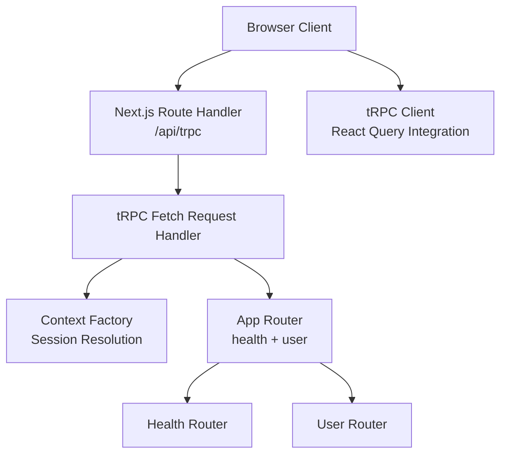
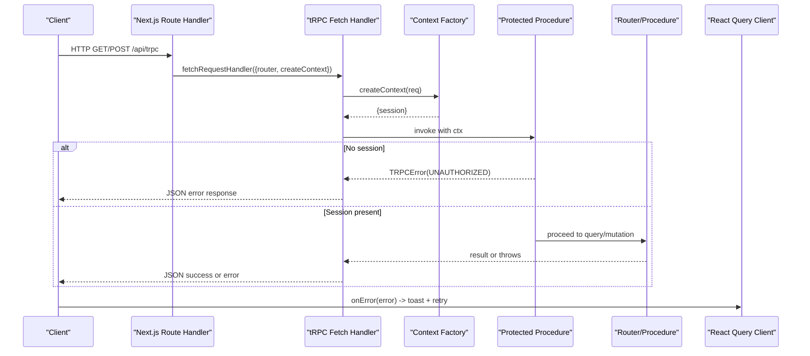
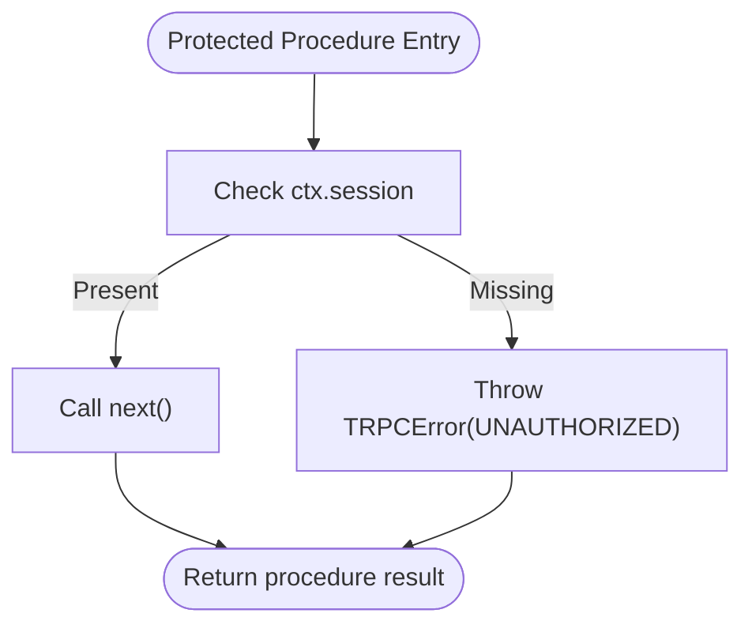
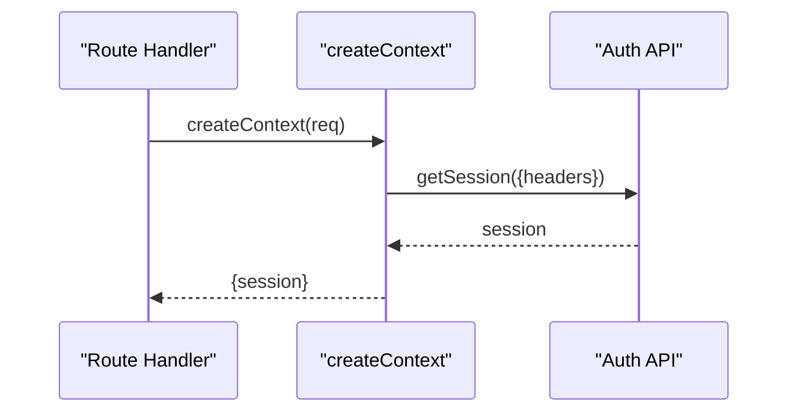
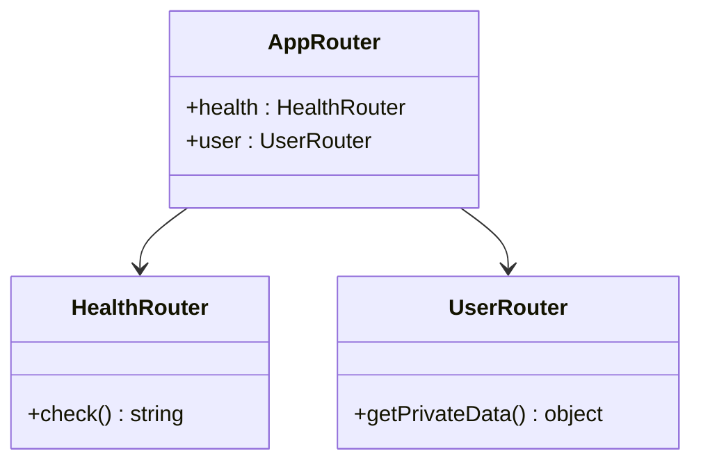
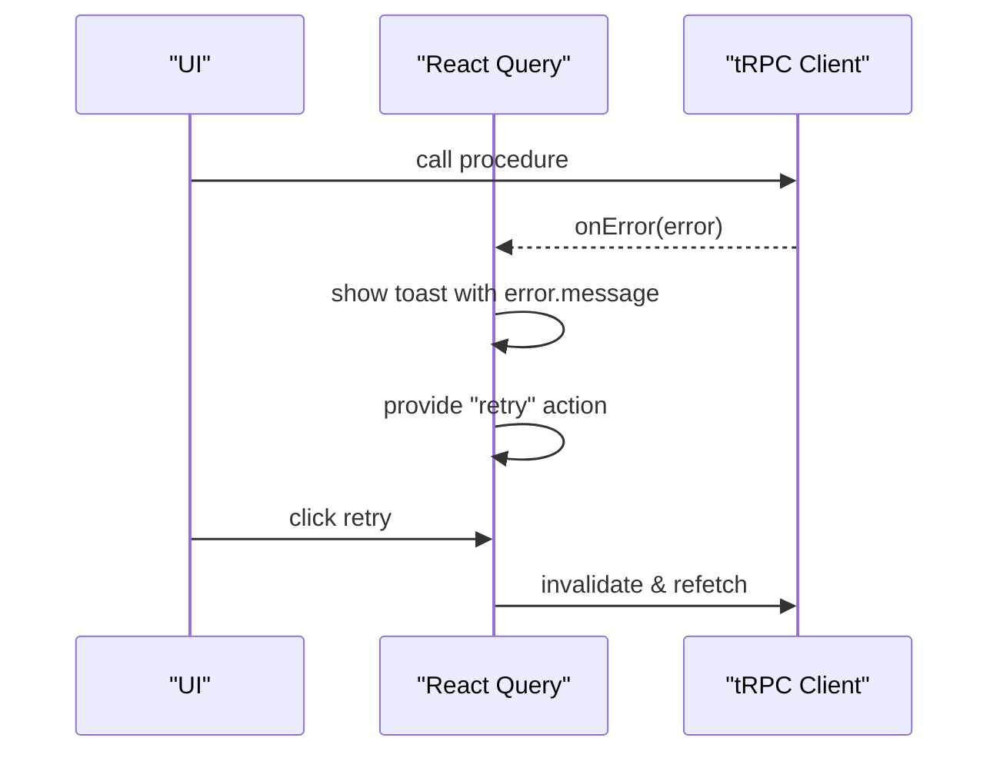
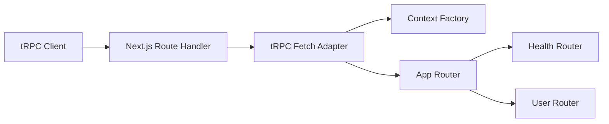

# Error Handling and Response Formatting

<cite>
**Referenced Files in This Document**
- [route.ts](file://apps/web/src/app/api/trpc/[trpc]/route.ts)
- [index.ts](file://packages/api/src/index.ts)
- [context.ts](file://packages/api/src/context.ts)
- [index.ts](file://packages/api/src/routers/index.ts)
- [health.ts](file://packages/api/src/routers/health.ts)
- [user.ts](file://packages/api/src/routers/user.ts)
- [trpc.ts](file://apps/web/src/utils/trpc.ts)
</cite>

## Table of Contents

1. Introduction
2. Project Structure
3. Core Components
4. Architecture Overview
5. Detailed Component Analysis
6. Dependency Analysis
7. Performance Considerations
8. Troubleshooting Guide
9. Conclusion

## Introduction

This document explains how error handling and response formatting are implemented for tRPC procedures in this project. It covers custom error types, error propagation patterns, client-side error handling, standardized response formats, success/failure patterns, status code conventions, global error handling strategies, logging approaches, debugging techniques, security considerations for error messages, and production best practices.

## Project Structure

The tRPC layer is composed of:

- A Next.js route handler that wires the tRPC router to HTTP requests.
- An API package that initializes tRPC, defines reusable procedures (public and protected), and composes routers.
- Routers for domain features (health, user).
- A client configuration that sets up React Query integration and a global error hook for user feedback.

**Diagram sources**

- [route.ts:1-14](file://apps/web/src/app/api/trpc/[trpc]/route.ts#L1-L14)
- [index.ts:1-26](file://packages/api/src/index.ts#L1-L26)
- [context.ts:1-15](file://packages/api/src/context.ts#L1-L15)
- [index.ts:1-11](file://packages/api/src/routers/index.ts#L1-L11)
- [health.ts:1-6](file://packages/api/src/routers/health.ts#L1-L6)
- [user.ts:1-9](file://packages/api/src/routers/user.ts#L1-L9)
- [trpc.ts:1-40](file://apps/web/src/utils/trpc.ts#L1-L40)

**Section sources**

- [route.ts:1-14](file://apps/web/src/app/api/trpc/[trpc]/route.ts#L1-L14)
- [index.ts:1-26](file://packages/api/src/index.ts#L1-L26)
- [context.ts:1-15](file://packages/api/src/context.ts#L1-L15)
- [index.ts:1-11](file://packages/api/src/routers/index.ts#L1-L11)
- [health.ts:1-6](file://packages/api/src/routers/health.ts#L1-L6)
- [user.ts:1-9](file://packages/api/src/routers/user.ts#L1-L9)
- [trpc.ts:1-40](file://apps/web/src/utils/trpc.ts#L1-L40)

## Core Components

- tRPC initialization and procedure builders:
  - Public procedures allow unauthenticated access.
  - Protected procedures enforce session presence and throw a structured error when missing.
- Context factory:
  - Resolves the current session from request headers.
- App router composition:
  - Aggregates feature routers (health, user).
- Next.js route handler:
  - Binds the fetch adapter to the app router and context factory.
- Client setup:
  - Configures React Query with a global onError hook to surface errors to users via toast notifications.

Key responsibilities:

- Centralized auth enforcement via a middleware-like procedure.
- Consistent error signaling using tRPC’s error type.
- Client-side error presentation and retry UX.

**Section sources**

- [index.ts:1-26](file://packages/api/src/index.ts#L1-L26)
- [context.ts:1-15](file://packages/api/src/context.ts#L1-L15)
- [index.ts:1-11](file://packages/api/src/routers/index.ts#L1-L11)
- [route.ts:1-14](file://apps/web/src/app/api/trpc/[trpc]/route.ts#L1-L14)
- [trpc.ts:1-40](file://apps/web/src/utils/trpc.ts#L1-L40)

## Architecture Overview

The request flow and error propagation across layers:

**Diagram sources**

- [route.ts:1-14](file://apps/web/src/app/api/trpc/[trpc]/route.ts#L1-L14)
- [index.ts:1-26](file://packages/api/src/index.ts#L1-L26)
- [context.ts:1-15](file://packages/api/src/context.ts#L1-L15)
- [trpc.ts:1-40](file://apps/web/src/utils/trpc.ts#L1-L40)

## Detailed Component Analysis

### Server-Side Error Types and Propagation

- Custom error signaling:
  - The protected procedure validates session presence and throws a structured error with a specific code and message when unauthorized.
- Error propagation:
  - Errors thrown inside procedures bubble up through the tRPC stack and are serialized into a standard JSON error envelope by the fetch adapter.
- Success responses:
  - Procedures return plain data objects; tRPC serializes them into a consistent JSON payload.

**Diagram sources**

- [index.ts:11-25](file://packages/api/src/index.ts#L11-L25)

**Section sources**

- [index.ts:11-25](file://packages/api/src/index.ts#L11-L25)

### Context and Authentication Flow

- Context creation:
  - Extracts session from request headers using the auth API.
- Implications:
  - If no session exists, downstream protected procedures will reject the request.

**Diagram sources**

- [context.ts:1-15](file://packages/api/src/context.ts#L1-L15)
- [route.ts:1-14](file://apps/web/src/app/api/trpc/[trpc]/route.ts#L1-L14)

**Section sources**

- [context.ts:1-15](file://packages/api/src/context.ts#L1-L15)
- [route.ts:1-14](file://apps/web/src/app/api/trpc/[trpc]/route.ts#L1-L14)

### Routers and Standardized Responses

- Health router:
  - Returns a simple success value for health checks.
- User router:
  - Exposes a protected query that returns private data only when authenticated.
- Response format:
  - Successful calls return typed data as defined by each procedure.
  - Errors are returned as structured error envelopes with code and message.

**Diagram sources**

- [health.ts:1-6](file://packages/api/src/routers/health.ts#L1-L6)
- [user.ts:1-9](file://packages/api/src/routers/user.ts#L1-L9)
- [index.ts:1-11](file://packages/api/src/routers/index.ts#L1-L11)

**Section sources**

- [health.ts:1-6](file://packages/api/src/routers/health.ts#L1-L6)
- [user.ts:1-9](file://packages/api/src/routers/user.ts#L1-L9)
- [index.ts:1-11](file://packages/api/src/routers/index.ts#L1-L11)

### Client-Side Error Handling and UX

- Global error hook:
  - React Query’s onError displays an error toast and provides a “retry” action to invalidate and refetch the query.
- Network behavior:
  - Credentials are included with every tRPC request to support session-based auth.
- Error display:
  - Uses the error message provided by server-side errors for user-facing feedback.

**Diagram sources**

- [trpc.ts:1-40](file://apps/web/src/utils/trpc.ts#L1-L40)

**Section sources**

- [trpc.ts:1-40](file://apps/web/src/utils/trpc.ts#L1-L40)

### Status Codes and Conventions

- Unauthorized errors:
  - Protected procedures throw a structured error with a specific code when authentication fails.
- Success responses:
  - Return typed payloads directly; tRPC handles serialization.
- Note:
  - The current implementation relies on tRPC’s default error mapping for HTTP status codes. For explicit control over status codes, consider extending the tRPC error handling at the adapter level.

**Section sources**

- [index.ts:11-25](file://packages/api/src/index.ts#L11-L25)

### Logging Strategies and Debugging Techniques

- Non-blocking side effects:
  - Use non-blocking mechanisms to perform logging or analytics after the response is sent to avoid blocking the request path.
- Production hygiene:
  - Remove debug statements from production code and prefer structured logging solutions.
- Practical tips:
  - Log contextual identifiers (e.g., request IDs) without sensitive data.
  - Capture error stacks on the server and correlate with client error messages.

[No sources needed since this section provides general guidance]

### Security Considerations for Error Messages

- Avoid leaking internals:
  - Do not expose stack traces, internal paths, or database details in user-facing messages.
- Sanitize inputs:
  - Validate and sanitize all inputs before processing to prevent injection and unexpected errors.
- Least privilege:
  - Ensure procedures validate authorization beyond just session presence where necessary.

[No sources needed since this section provides general guidance]

## Dependency Analysis

The following diagram shows how components depend on each other during a typical request:

**Diagram sources**

- [route.ts:1-14](file://apps/web/src/app/api/trpc/[trpc]/route.ts#L1-L14)
- [index.ts:1-26](file://packages/api/src/index.ts#L1-L26)
- [context.ts:1-15](file://packages/api/src/context.ts#L1-L15)
- [index.ts:1-11](file://packages/api/src/routers/index.ts#L1-L11)
- [health.ts:1-6](file://packages/api/src/routers/health.ts#L1-L6)
- [user.ts:1-9](file://packages/api/src/routers/user.ts#L1-L9)
- [trpc.ts:1-40](file://apps/web/src/utils/trpc.ts#L1-L40)

**Section sources**

- [route.ts:1-14](file://apps/web/src/app/api/trpc/[trpc]/route.ts#L1-L14)
- [index.ts:1-26](file://packages/api/src/index.ts#L1-L26)
- [context.ts:1-15](file://packages/api/src/context.ts#L1-L15)
- [index.ts:1-11](file://packages/api/src/routers/index.ts#L1-L11)
- [health.ts:1-6](file://packages/api/src/routers/health.ts#L1-L6)
- [user.ts:1-9](file://packages/api/src/routers/user.ts#L1-L9)
- [trpc.ts:1-40](file://apps/web/src/utils/trpc.ts#L1-L40)

## Performance Considerations

- Keep error checks early to fail fast and reduce unnecessary work.
- Prefer non-blocking operations for logging and analytics to avoid increasing latency.
- Batch network requests where possible to reduce round trips.
- Cache read-heavy queries appropriately to minimize repeated work.

[No sources needed since this section provides general guidance]

## Troubleshooting Guide

Common issues and resolutions:

- Unauthorized access:
  - Ensure the client includes credentials with requests and that the session is valid.
  - Verify that protected procedures receive a populated session in context.
- Unexpected client errors:
  - Inspect the global error hook to confirm error messages are surfaced correctly.
  - Use the provided retry action to reattempt failed queries.
- Debugging:
  - Add structured server logs around critical sections without exposing sensitive data.
  - Correlate client error messages with server-side logs using request identifiers.

**Section sources**

- [trpc.ts:1-40](file://apps/web/src/utils/trpc.ts#L1-L40)
- [index.ts:11-25](file://packages/api/src/index.ts#L11-L25)

## Conclusion

This project implements a clear separation of concerns for error handling and response formatting in tRPC:

- Server-side: Structured errors via a protected procedure ensure consistent authorization checks and error signaling.
- Client-side: React Query integrates a global error hook to inform users and enable retries.
- Best practices: Use non-blocking logging, sanitize error messages, and maintain strict input validation to secure and optimize the system.

[No sources needed since this section summarizes without analyzing specific files]
