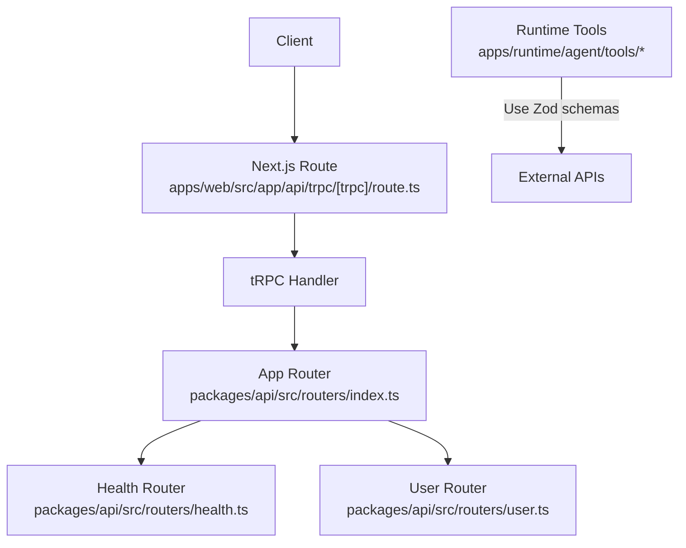
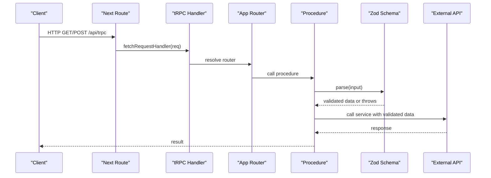
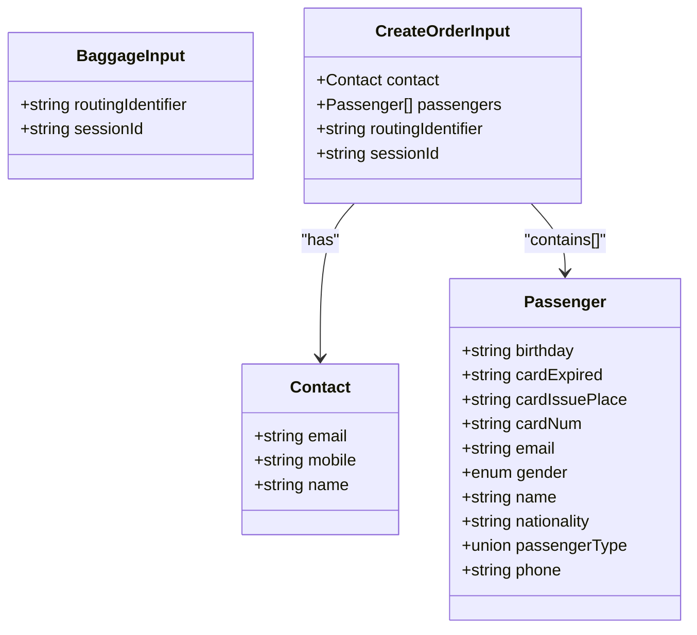
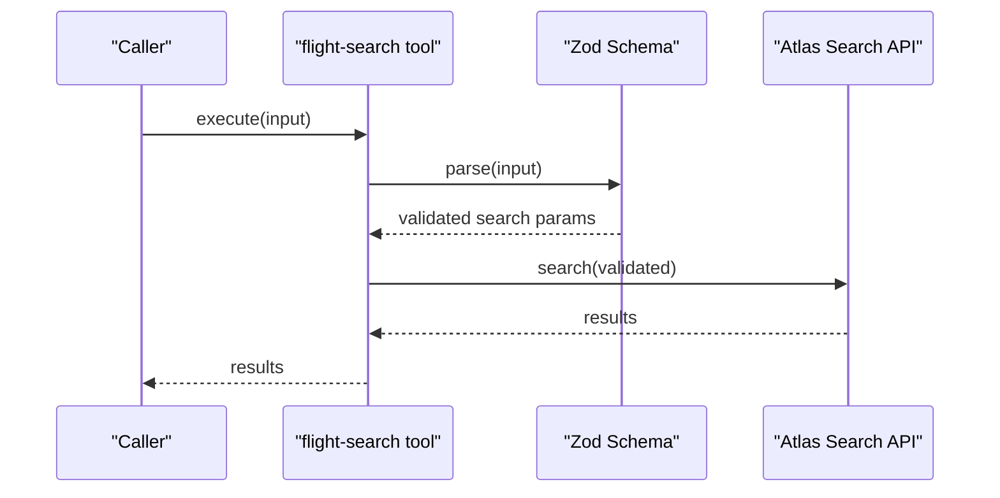
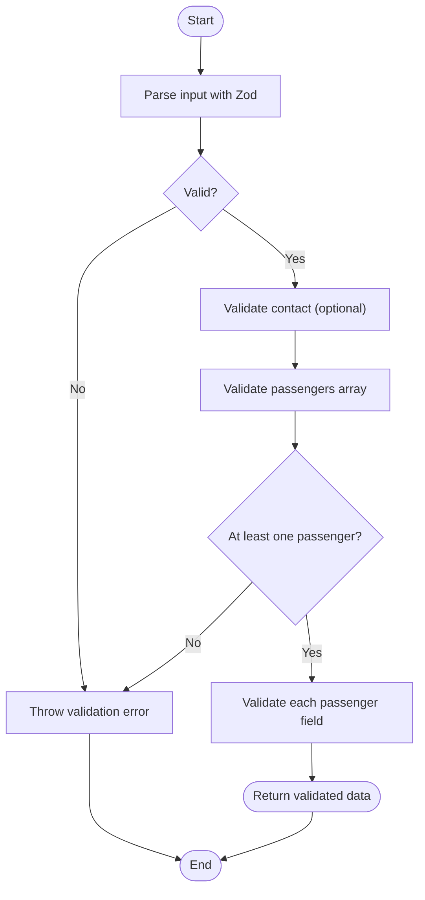
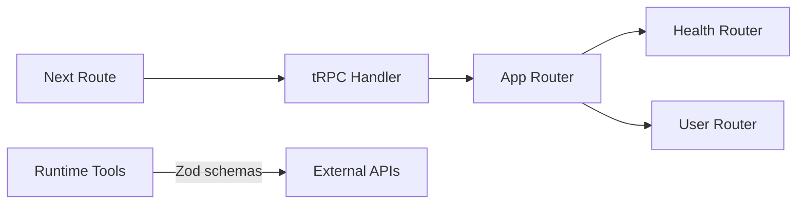

# Input Validation with Zod

<cite>
**Referenced Files in This Document**
- [route.ts](file://apps/web/src/app/api/trpc/[trpc]/route.ts)
- [index.ts](file://packages/api/src/index.ts)
- [routers/index.ts](file://packages/api/src/routers/index.ts)
- [health.ts](file://packages/api/src/routers/health.ts)
- [user.ts](file://packages/api/src/routers/user.ts)
- [baggage.ts](file://apps/runtime/agent/tools/baggage.ts)
- [create-order.ts](file://apps/runtime/agent/tools/create-order.ts)
- [flight-search.ts](file://apps/runtime/agent/tools/flight-search.ts)
- [confirm-order.ts](file://apps/runtime/agent/tools/confirm-order.ts)
- [email-query.ts](file://apps/runtime/agent/tools/email-query.ts)
</cite>

## Table of Contents

1. [Introduction](#introduction)
2. [Project Structure](#project-structure)
3. [Core Components](#core-components)
4. [Architecture Overview](#architecture-overview)
5. [Detailed Component Analysis](#detailed-component-analysis)
6. [Dependency Analysis](#dependency-analysis)
7. [Performance Considerations](#performance-considerations)
8. [Troubleshooting Guide](#troubleshooting-guide)
9. [Conclusion](#conclusion)

## Introduction

This document explains how to implement robust input validation using Zod schemas within tRPC procedures and related tooling in this repository. It covers schema definition patterns, error handling strategies, type inference from schemas, and techniques for validating complex nested objects, arrays, and optional fields. It also documents reusable validators, custom validation rules, integration approaches with form libraries, performance considerations for large payloads, and data-type-specific validation strategies.

## Project Structure

The project uses a Next.js API route to serve tRPC endpoints and organizes routers under a shared API package. Tool definitions in the runtime use Zod schemas to validate inputs before calling external APIs.

**Diagram sources**

- [route.ts:1-14](file://apps/web/src/app/api/trpc/[trpc]/route.ts#L1-L14)
- [routers/index.ts:1-11](file://packages/api/src/routers/index.ts#L1-L11)
- [health.ts:1-6](file://packages/api/src/routers/health.ts#L1-L6)
- [user.ts:1-9](file://packages/api/src/routers/user.ts#L1-L9)

**Section sources**

- [route.ts:1-14](file://apps/web/src/app/api/trpc/[trpc]/route.ts#L1-L14)
- [routers/index.ts:1-11](file://packages/api/src/routers/index.ts#L1-L11)

## Core Components

- tRPC initialization and procedure helpers are defined centrally, exposing public and protected procedures.
- Routers compose feature modules (health, user) into an app router.
- The Next.js route wires the tRPC handler to the app router and context creation.
- Runtime tools define Zod schemas as input contracts for external API calls.

Key responsibilities:

- Centralized tRPC setup with typed context and procedure guards.
- Modular routers that can be extended with validated procedures.
- Consistent input validation via Zod across runtime tools.

**Section sources**

- [index.ts:1-25](file://packages/api/src/index.ts#L1-L25)
- [routers/index.ts:1-11](file://packages/api/src/routers/index.ts#L1-L11)
- [route.ts:1-14](file://apps/web/src/app/api/trpc/[trpc]/route.ts#L1-L14)

## Architecture Overview

The request flow starts at the Next.js route, which delegates to the tRPC handler. The handler resolves the appropriate router and procedure. For runtime tools, Zod schemas validate inputs before invoking external services.

**Diagram sources**

- [route.ts:1-14](file://apps/web/src/app/api/trpc/[trpc]/route.ts#L1-L14)
- [routers/index.ts:1-11](file://packages/api/src/routers/index.ts#L1-L11)
- [health.ts:1-6](file://packages/api/src/routers/health.ts#L1-L6)
- [user.ts:1-9](file://packages/api/src/routers/user.ts#L1-L9)

## Detailed Component Analysis

### tRPC Setup and Procedures

- Centralized tRPC instance exposes public and protected procedures.
- Protected procedures enforce authentication by checking session context and throwing standardized errors when unauthorized.
- Routers import these procedures to build feature endpoints.

Validation strategy:

- Use Zod schemas inside procedures to parse and validate inputs.
- Leverage type inference from schemas to ensure end-to-end type safety.

Error handling:

- Use tRPC error codes and messages for consistent client-side handling.
- Validate early and fail fast on invalid inputs.

**Section sources**

- [index.ts:1-25](file://packages/api/src/index.ts#L1-L25)

### Routers Composition

- The app router composes health and user routers.
- Each router defines procedures that can accept validated inputs via Zod.

Best practices:

- Keep routers small and focused per domain.
- Reuse common schemas and validators across routers.

**Section sources**

- [routers/index.ts:1-11](file://packages/api/src/routers/index.ts#L1-L11)
- [health.ts:1-6](file://packages/api/src/routers/health.ts#L1-L6)
- [user.ts:1-9](file://packages/api/src/routers/user.ts#L1-L9)

### Next.js tRPC Route

- Wires the tRPC handler to the app router and provides context creation per request.
- Ensures all requests go through the same validation and middleware pipeline.

Integration note:

- Place Zod parsing inside procedures to keep routes thin and focused on transport concerns.

**Section sources**

- [route.ts:1-14](file://apps/web/src/app/api/trpc/[trpc]/route.ts#L1-L14)

### Runtime Tools with Zod Schemas

The runtime tools demonstrate practical Zod usage for validating inputs before calling external APIs.

- Simple object with required fields and descriptions:
  - See baggage tool input schema.
- Complex nested objects, arrays, and optional fields:
  - See create-order tool input schema with nested contact and passengers array.
- Optional fields and defaults:
  - See flight-search tool input schema with optional filters and defaults.
- Loose object validation:
  - See confirm-order and email-query tools using looseObject to allow extra keys while validating known fields.

Patterns demonstrated:

- Describing fields with .describe() for better documentation and UX.
- Using .optional(), .default(), .min(), .int(), and enums for precise constraints.
- Validating arrays with min length and item-level schemas.

**Section sources**

- [baggage.ts:1-20](file://apps/runtime/agent/tools/baggage.ts#L1-L20)
- [create-order.ts:1-66](file://apps/runtime/agent/tools/create-order.ts#L1-L66)
- [flight-search.ts:1-62](file://apps/runtime/agent/tools/flight-search.ts#L1-L62)
- [confirm-order.ts:1-35](file://apps/runtime/agent/tools/confirm-order.ts#L1-L35)
- [email-query.ts:1-15](file://apps/runtime/agent/tools/email-query.ts#L1-L15)

#### Class-like Schema Relationships

**Diagram sources**

- [baggage.ts:13-18](file://apps/runtime/agent/tools/baggage.ts#L13-L18)
- [create-order.ts:15-64](file://apps/runtime/agent/tools/create-order.ts#L15-L64)

#### Sequence: Flight Search Validation Flow

**Diagram sources**

- [flight-search.ts:7-12](file://apps/runtime/agent/tools/flight-search.ts#L7-L12)
- [flight-search.ts:13-60](file://apps/runtime/agent/tools/flight-search.ts#L13-L60)

#### Flowchart: Nested Object Validation

**Diagram sources**

- [create-order.ts:15-64](file://apps/runtime/agent/tools/create-order.ts#L15-L64)

## Dependency Analysis

- The Next.js route depends on the tRPC handler and app router.
- The app router composes feature routers.
- Feature routers depend on centralized tRPC utilities for procedures and context.
- Runtime tools depend on Zod schemas to validate inputs before calling external APIs.

**Diagram sources**

- [route.ts:1-14](file://apps/web/src/app/api/trpc/[trpc]/route.ts#L1-L14)
- [routers/index.ts:1-11](file://packages/api/src/routers/index.ts#L1-L11)
- [health.ts:1-6](file://packages/api/src/routers/health.ts#L1-L6)
- [user.ts:1-9](file://packages/api/src/routers/user.ts#L1-L9)

**Section sources**

- [route.ts:1-14](file://apps/web/src/app/api/trpc/[trpc]/route.ts#L1-L14)
- [routers/index.ts:1-11](file://packages/api/src/routers/index.ts#L1-L11)

## Performance Considerations

- Prefer lazy parsing: parse only when needed to avoid unnecessary overhead on read-only paths.
- Use .default() for optional fields to reduce client-side branching and payload size.
- Avoid deep nesting where possible; flatten frequently accessed fields to minimize parsing cost.
- For large payloads:
  - Stream or chunk data at the transport layer if applicable.
  - Validate incrementally by splitting schemas into smaller units and composing them.
  - Cache parsed results when reusing the same input within a request lifecycle.
- Choose strict vs loose validation based on trust boundaries:
  - Use strict schemas for untrusted inputs.
  - Use looseObject for internal integrations where extra keys may be present but not harmful.

[No sources needed since this section provides general guidance]

## Troubleshooting Guide

Common issues and resolutions:

- Validation errors:
  - Ensure all required fields are provided and match expected types.
  - Use .describe() to clarify expectations in error messages.
- Unexpected extra keys:
  - Switch to looseObject if downstream systems add unknown fields.
- Optional fields not working:
  - Confirm .optional() is applied correctly and default values are set where necessary.
- Authentication failures:
  - Verify protected procedures throw standardized errors when session is missing.

Where to look:

- Procedure-level parsing and error throwing.
- Router composition to ensure correct endpoint mapping.
- Runtime tool schemas for input contracts.

**Section sources**

- [index.ts:11-25](file://packages/api/src/index.ts#L11-L25)
- [create-order.ts:15-64](file://apps/runtime/agent/tools/create-order.ts#L15-L64)
- [flight-search.ts:13-60](file://apps/runtime/agent/tools/flight-search.ts#L13-L60)
- [confirm-order.ts:15-33](file://apps/runtime/agent/tools/confirm-order.ts#L15-L33)

## Conclusion

This codebase demonstrates clear, maintainable input validation using Zod across tRPC procedures and runtime tools. By centralizing tRPC setup, composing modular routers, and defining precise Zod schemas with descriptive metadata, the system achieves strong typing, reliable validation, and scalable architecture. Adopting the patterns shown here—reusable validators, careful handling of optional and nested data, and thoughtful error strategies—will improve reliability and developer experience across the application.
