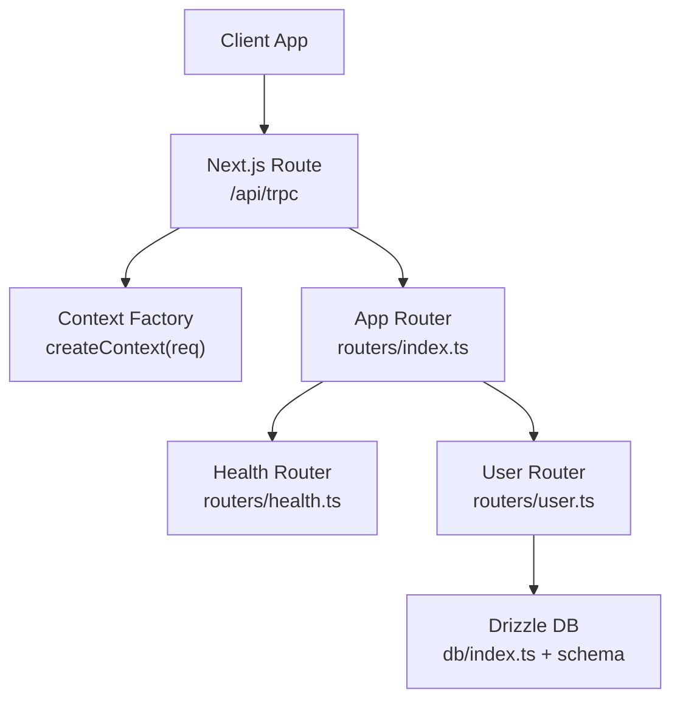
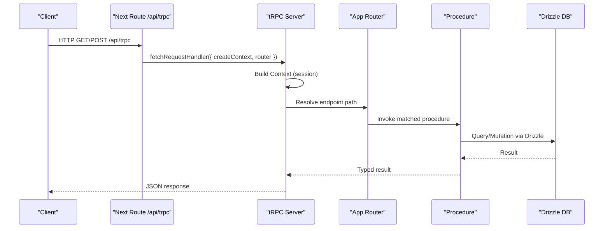
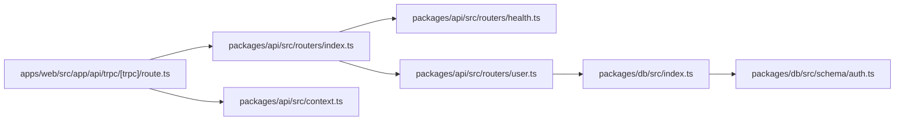
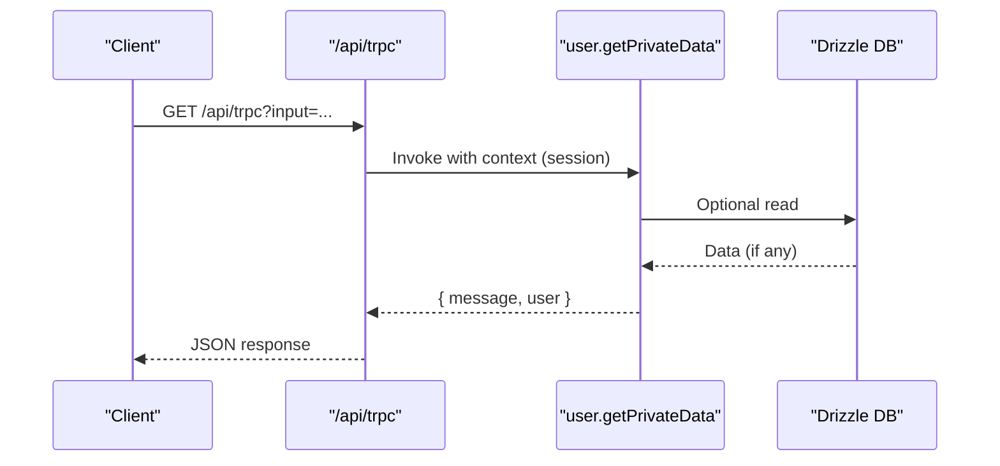

# Procedure Patterns and Design

<cite>
**Referenced Files in This Document**
- [packages/api/src/index.ts](file://packages/api/src/index.ts)
- [packages/api/src/context.ts](file://packages/api/src/context.ts)
- [packages/api/src/routers/index.ts](file://packages/api/src/routers/index.ts)
- [packages/api/src/routers/health.ts](file://packages/api/src/routers/health.ts)
- [packages/api/src/routers/user.ts](file://packages/api/src/routers/user.ts)
- [apps/web/src/app/api/trpc/[trpc]/route.ts](file://apps/web/src/app/api/trpc/[trpc]/route.ts)
- [apps/web/src/utils/trpc.ts](file://apps/web/src/utils/trpc.ts)
- [packages/db/src/index.ts](file://packages/db/src/index.ts)
- [packages/db/src/schema/auth.ts](file://packages/db/src/schema/auth.ts)
</cite>

## Table of Contents

1. [Introduction](#introduction)
2. [Project Structure](#project-structure)
3. [Core Components](#core-components)
4. [Architecture Overview](#architecture-overview)
5. [Detailed Component Analysis](#detailed-component-analysis)
6. [Dependency Analysis](#dependency-analysis)
7. [Performance Considerations](#performance-considerations)
8. [Troubleshooting Guide](#troubleshooting-guide)
9. [Conclusion](#conclusion)
10. [Appendices](#appendices)

## Introduction

This document explains the tRPC procedure patterns and design principles used in the Atlas API layer. It covers:

- Public vs protected procedures and how authorization is enforced
- Input validation using Zod schemas and output type inference
- CRUD operation patterns, business logic encapsulation, and database interactions via Drizzle ORM
- Complex queries, transactions, and authorization checks
- Error handling strategies, custom error types, and response formatting
- Guidelines for organizing procedures by domain and maintaining end-to-end type safety

## Project Structure

The API is implemented as a Next.js route that wires tRPC to an application router composed of feature routers. The data layer uses Drizzle ORM with a Neon serverless driver.

**Diagram sources**

- [apps/web/src/app/api/trpc/[trpc]/route.ts:1-14](file://apps/web/src/app/api/trpc/[trpc]/route.ts#L1-L14)
- [packages/api/src/routers/index.ts:1-11](file://packages/api/src/routers/index.ts#L1-L11)
- [packages/api/src/routers/health.ts:1-6](file://packages/api/src/routers/health.ts#L1-L6)
- [packages/api/src/routers/user.ts:1-9](file://packages/api/src/routers/user.ts#L1-L9)
- [packages/db/src/index.ts:1-13](file://packages/db/src/index.ts#L1-L13)

**Section sources**

- [apps/web/src/app/api/trpc/[trpc]/route.ts:1-14](file://apps/web/src/app/api/trpc/[trpc]/route.ts#L1-L14)
- [packages/api/src/routers/index.ts:1-11](file://packages/api/src/routers/index.ts#L1-L11)

## Core Components

- tRPC initialization and procedure builders: public and protected procedures are defined centrally to ensure consistent behavior across all endpoints.
- Context factory: resolves the current session per request and exposes it to procedures.
- Routers: feature-based routers (health, user) grouped into an app router.
- Database client: Drizzle ORM configured with Neon HTTP for serverless environments.

Key responsibilities:

- Authorization: protected procedures enforce session presence before executing handlers.
- Type safety: shared context and typed routers propagate types from server to client.
- Data access: Drizzle models and relations define the schema and relationships.

**Section sources**

- [packages/api/src/index.ts:1-26](file://packages/api/src/index.ts#L1-L26)
- [packages/api/src/context.ts:1-15](file://packages/api/src/context.ts#L1-L15)
- [packages/api/src/routers/index.ts:1-11](file://packages/api/src/routers/index.ts#L1-L11)
- [packages/db/src/index.ts:1-13](file://packages/db/src/index.ts#L1-L13)

## Architecture Overview

End-to-end flow from client to database:

**Diagram sources**

- [apps/web/src/app/api/trpc/[trpc]/route.ts:1-14](file://apps/web/src/app/api/trpc/[trpc]/route.ts#L1-L14)
- [packages/api/src/index.ts:1-26](file://packages/api/src/index.ts#L1-L26)
- [packages/api/src/routers/index.ts:1-11](file://packages/api/src/routers/index.ts#L1-L11)
- [packages/db/src/index.ts:1-13](file://packages/db/src/index.ts#L1-L13)

## Detailed Component Analysis

### tRPC Initialization and Procedures

- Centralized tRPC instance provides typed router and procedure builders.
- Public procedures: no additional middleware; suitable for health checks or unauthenticated reads.
- Protected procedures: middleware enforces a valid session; otherwise throws a standardized unauthorized error.

Design notes:

- Use protectedProcedure for any mutation or sensitive read.
- Keep authorization checks centralized to avoid duplication.

**Section sources**

- [packages/api/src/index.ts:1-26](file://packages/api/src/index.ts#L1-L26)

### Context and Session Resolution

- Context factory retrieves the session from the auth provider using request headers.
- Context type is inferred from the factory return value, ensuring type-safe access in procedures.

Usage pattern:

- Access ctx.session inside procedures to identify the caller and enforce authorization.

**Section sources**

- [packages/api/src/context.ts:1-15](file://packages/api/src/context.ts#L1-L15)

### Routers and Endpoints

- Feature routers group related procedures (e.g., health, user).
- App router composes feature routers and exports a typed AppRouter for client usage.

Examples in codebase:

- Health check: a simple public query returning a status string.
- User router: a protected query demonstrating session access.

**Section sources**

- [packages/api/src/routers/index.ts:1-11](file://packages/api/src/routers/index.ts#L1-L11)
- [packages/api/src/routers/health.ts:1-6](file://packages/api/src/routers/health.ts#L1-L6)
- [packages/api/src/routers/user.ts:1-9](file://packages/api/src/routers/user.ts#L1-L9)

### Database Layer with Drizzle ORM

- Drizzle client is created with Neon HTTP driver and schema definitions.
- Schema defines tables and relations for users, sessions, accounts, and verifications.

Recommendations:

- Encapsulate data access in repository-like functions within the db package or a dedicated services layer.
- Use relations to express joins and reduce manual SQL.

**Section sources**

- [packages/db/src/index.ts:1-13](file://packages/db/src/index.ts#L1-L13)
- [packages/db/src/schema/auth.ts:1-101](file://packages/db/src/schema/auth.ts#L1-L101)

### Client Integration and Type Inference

- The web app configures a tRPC client with batching and credentials enabled.
- The client imports the server’s AppRouter type to infer input/output types automatically.

Benefits:

- Zero-copy type contracts between server and client.
- Compile-time errors when inputs/outputs change.

**Section sources**

- [apps/web/src/utils/trpc.ts:1-39](file://apps/web/src/utils/trpc.ts#L1-L39)

### Public vs Protected Procedures

- Public procedures: no authentication required; use for non-sensitive operations like health checks.
- Protected procedures: require a valid session; throw a standardized UNAUTHORIZED error if missing.

Guidelines:

- Prefer protectedProcedure for any operation that touches user-specific data.
- For fine-grained authorization (e.g., resource ownership), add additional checks inside the procedure handler.

**Section sources**

- [packages/api/src/index.ts:11-25](file://packages/api/src/index.ts#L11-L25)
- [packages/api/src/routers/health.ts:1-6](file://packages/api/src/routers/health.ts#L1-L6)
- [packages/api/src/routers/user.ts:1-9](file://packages/api/src/routers/user.ts#L1-L9)

### Input Validation with Zod Schemas

Recommended pattern:

- Define a Zod schema per procedure input.
- Parse and validate inputs at the start of the procedure handler.
- Return early on validation failure to keep control flow simple.

Type inference:

- Derive TypeScript types from Zod schemas to ensure compile-time safety.
- Reuse schemas across multiple procedures where appropriate.

Error mapping:

- Convert Zod parse errors into tRPC errors with clear messages and codes.

[No sources needed since this section provides general guidance]

### Output Type Inference

- Export typed results from procedures so clients receive strongly-typed responses.
- Avoid returning raw database rows directly; project to DTOs or plain objects to stabilize the API surface.

Best practices:

- Keep response shapes minimal and stable.
- Use discriminated unions for polymorphic responses when necessary.

[No sources needed since this section provides general guidance]

### CRUD Operation Patterns

Suggested structure:

- Group CRUD endpoints under a domain router (e.g., user, booking).
- Each endpoint validates inputs, enforces authorization, performs DB operations, and returns typed results.

Example flows:

- Create: validate input, assert permissions, insert via Drizzle, return created entity.
- Read: validate filters, apply pagination/sorting, query via Drizzle, return entities.
- Update: validate input, authorize ownership, update via Drizzle, return updated entity.
- Delete: authorize ownership, delete via Drizzle, return success indicator.

[No sources needed since this section provides general guidance]

### Business Logic Encapsulation

- Move complex logic out of procedures into reusable service functions.
- Keep procedures thin: validate, authorize, call service, format response.
- Services can compose multiple DB calls and coordinate side effects.

Benefits:

- Testability and reusability.
- Clear separation of concerns.

[No sources needed since this section provides general guidance]

### Database Interaction Patterns with Drizzle

- Use the provided db client and schema to perform queries and mutations.
- Leverage relations for joins and readability.
- For complex queries, prefer Drizzle query builder methods over raw SQL when possible.

Transaction support:

- Use Drizzle’s transaction APIs to wrap multiple writes atomically.
- Roll back on any error to maintain consistency.

**Section sources**

- [packages/db/src/index.ts:1-13](file://packages/db/src/index.ts#L1-L13)
- [packages/db/src/schema/auth.ts:1-101](file://packages/db/src/schema/auth.ts#L1-L101)

### Authorization Checks

- Enforce authentication via protectedProcedure middleware.
- Implement authorization inside procedures to verify resource ownership or roles.
- Fail fast with clear errors when authorization fails.

Patterns:

- Ownership checks: compare ctx.session.user.id with target resource id.
- Role checks: assert required role(s) from session metadata.

**Section sources**

- [packages/api/src/index.ts:11-25](file://packages/api/src/index.ts#L11-L25)

### Error Handling Strategies

- Use tRPC errors for structured failures (e.g., UNAUTHORIZED, NOT_FOUND, BAD_REQUEST).
- Map domain errors to tRPC errors with descriptive messages.
- Avoid leaking internal details to clients; log full stack traces server-side.

Response formatting:

- Standardize success envelopes if needed (e.g., { data, meta }).
- Keep error payloads consistent for client consumption.

**Section sources**

- [packages/api/src/index.ts:11-25](file://packages/api/src/index.ts#L11-L25)

### Organizing Procedures by Domain

- Create a router per domain (e.g., user, booking, activity).
- Compose them in the app router to form a single typed API surface.
- Keep each router focused and small to improve navigation and testing.

**Section sources**

- [packages/api/src/routers/index.ts:1-11](file://packages/api/src/routers/index.ts#L1-L11)

### Maintaining Type Safety Throughout the Call Chain

- Share the AppRouter type with the client to infer all endpoints.
- Validate inputs with Zod and derive TS types from schemas.
- Return explicit, stable response types from procedures.

**Section sources**

- [apps/web/src/utils/trpc.ts:1-39](file://apps/web/src/utils/trpc.ts#L1-L39)
- [packages/api/src/routers/index.ts:1-11](file://packages/api/src/routers/index.ts#L1-L11)

## Dependency Analysis

High-level dependencies among components:

**Diagram sources**

- [apps/web/src/app/api/trpc/[trpc]/route.ts:1-14](file://apps/web/src/app/api/trpc/[trpc]/route.ts#L1-L14)
- [packages/api/src/routers/index.ts:1-11](file://packages/api/src/routers/index.ts#L1-L11)
- [packages/api/src/routers/health.ts:1-6](file://packages/api/src/routers/health.ts#L1-L6)
- [packages/api/src/routers/user.ts:1-9](file://packages/api/src/routers/user.ts#L1-L9)
- [packages/api/src/context.ts:1-15](file://packages/api/src/context.ts#L1-L15)
- [packages/db/src/index.ts:1-13](file://packages/db/src/index.ts#L1-L13)
- [packages/db/src/schema/auth.ts:1-101](file://packages/db/src/schema/auth.ts#L1-L101)

**Section sources**

- [apps/web/src/app/api/trpc/[trpc]/route.ts:1-14](file://apps/web/src/app/api/trpc/[trpc]/route.ts#L1-L14)
- [packages/api/src/routers/index.ts:1-11](file://packages/api/src/routers/index.ts#L1-L11)
- [packages/db/src/index.ts:1-13](file://packages/db/src/index.ts#L1-L13)

## Performance Considerations

- Use tRPC batching on the client to reduce network overhead.
- Keep procedures lean; delegate heavy work to services.
- Index frequently queried columns in the database schema.
- Prefer selective field projection to minimize payload sizes.
- Cache expensive reads at the application level when appropriate.

[No sources needed since this section provides general guidance]

## Troubleshooting Guide

Common issues and resolutions:

- Unauthorized errors: ensure the request includes cookies/headers for session resolution and that protectedProcedure is used for sensitive endpoints.
- Validation errors: confirm Zod schemas match expected inputs and handle parse errors consistently.
- Database connectivity: verify DATABASE_URL and environment configuration for the Neon driver.
- Type mismatches: align client and server types by sharing the AppRouter and keeping response shapes stable.

**Section sources**

- [packages/api/src/index.ts:11-25](file://packages/api/src/index.ts#L11-L25)
- [apps/web/src/utils/trpc.ts:1-39](file://apps/web/src/utils/trpc.ts#L1-L39)
- [packages/db/src/index.ts:1-13](file://packages/db/src/index.ts#L1-L13)

## Conclusion

The Atlas API layer leverages tRPC for type-safe, modular APIs with clear boundaries between public and protected operations. By centralizing authorization, validating inputs with Zod, and using Drizzle ORM for data access, the system maintains strong typing and predictable behavior. Organizing procedures by domain and encapsulating business logic ensures scalability and testability. Adopting the patterns outlined here will help you build robust, secure, and maintainable APIs.

## Appendices

### Example: Request Flow for a Protected User Query

**Diagram sources**

- [packages/api/src/routers/user.ts:1-9](file://packages/api/src/routers/user.ts#L1-L9)
- [apps/web/src/app/api/trpc/[trpc]/route.ts:1-14](file://apps/web/src/app/api/trpc/[trpc]/route.ts#L1-L14)
- [packages/db/src/index.ts:1-13](file://packages/db/src/index.ts#L1-L13)
