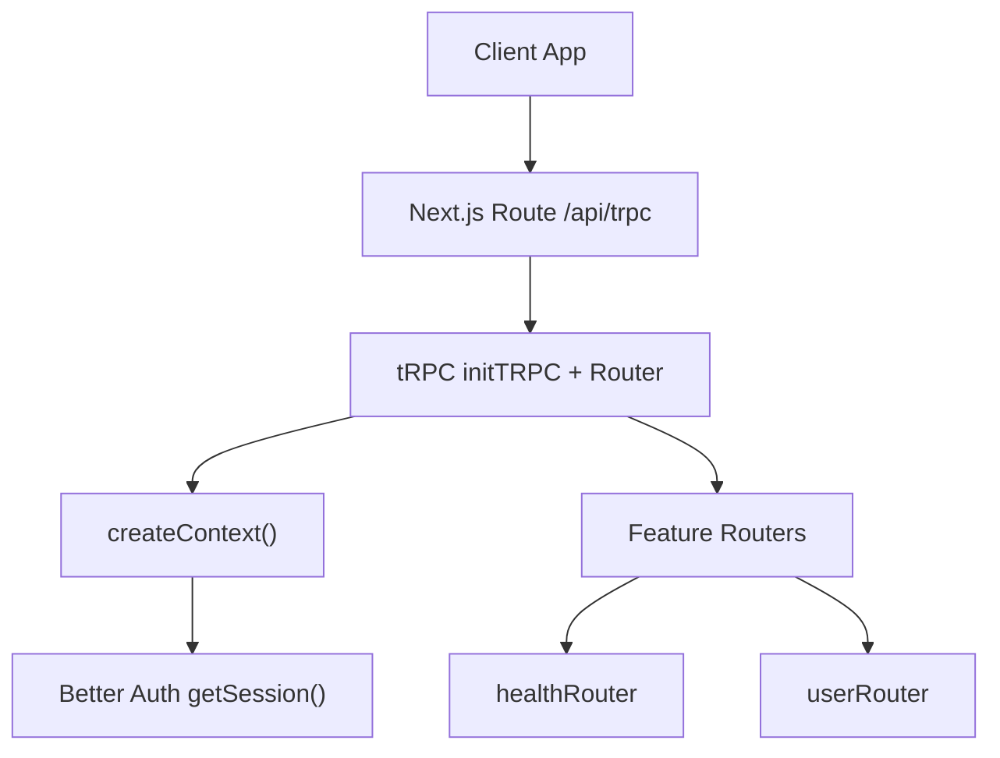
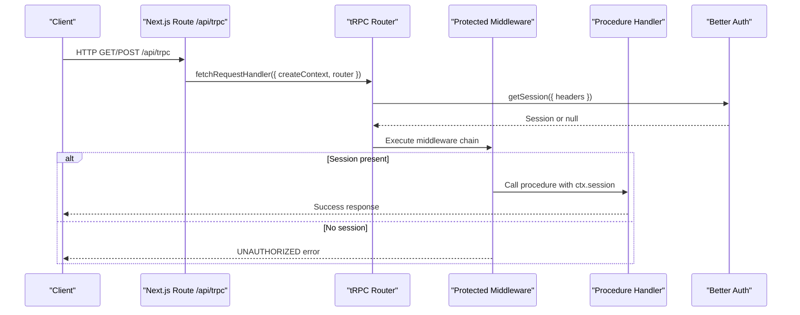
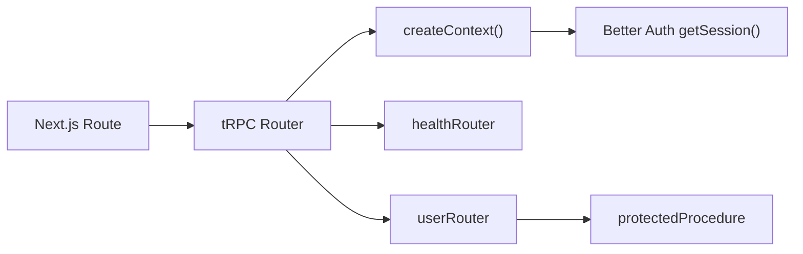

# Procedure Types and Authentication

<cite>
**Referenced Files in This Document**
- [route.ts](file://apps/web/src/app/api/trpc/[trpc]/route.ts)
- [context.ts](file://packages/api/src/context.ts)
- [index.ts](file://packages/api/src/index.ts)
- [index.ts](file://packages/api/src/routers/index.ts)
- [health.ts](file://packages/api/src/routers/health.ts)
- [user.ts](file://packages/api/src/routers/user.ts)
- [index.ts](file://packages/auth/src/index.ts)
- [auth-client.ts](file://apps/web/src/lib/auth-client.ts)
</cite>

## Table of Contents

1. Introduction
2. Project Structure
3. Core Components
4. Architecture Overview
5. Detailed Component Analysis
6. Dependency Analysis
7. Performance Considerations
8. Troubleshooting Guide
9. Conclusion

## Introduction

This document explains the tRPC procedure types used in the Atlas API layer, focusing on public versus protected procedures, authentication context handling, and session management. It shows how to create authenticated procedures that access user context, implement authorization checks (including role-based access control), and handle unauthenticated requests safely. It also covers best practices for type safety and middleware patterns within this codebase.

## Project Structure

The tRPC API is exposed via a Next.js route handler that wires up the app router and creates a per-request context using Better Auth. Routers are organized by feature under packages/api/src/routers. The auth package configures Better Auth with database, plugins, and cookies.

**Diagram sources**

- [route.ts:1-14](file://apps/web/src/app/api/trpc/[trpc]/route.ts#L1-L14)
- [index.ts:1-26](file://packages/api/src/index.ts#L1-L26)
- [context.ts:1-15](file://packages/api/src/context.ts#L1-L15)
- [index.ts:1-11](file://packages/api/src/routers/index.ts#L1-L11)
- [health.ts:1-6](file://packages/api/src/routers/health.ts#L1-L6)
- [user.ts:1-9](file://packages/api/src/routers/user.ts#L1-L9)

**Section sources**

- [route.ts:1-14](file://apps/web/src/app/api/trpc/[trpc]/route.ts#L1-L14)
- [index.ts:1-26](file://packages/api/src/index.ts#L1-L26)
- [context.ts:1-15](file://packages/api/src/context.ts#L1-L15)
- [index.ts:1-11](file://packages/api/src/routers/index.ts#L1-L11)
- [health.ts:1-6](file://packages/api/src/routers/health.ts#L1-L6)
- [user.ts:1-9](file://packages/api/src/routers/user.ts#L1-L9)
- [index.ts:1-43](file://packages/auth/src/index.ts#L1-L43)

## Core Components

- tRPC initialization and procedure types:
  - Public procedures: no authentication required; suitable for health checks and open endpoints.
  - Protected procedures: enforce a valid session before allowing execution; throw an UNAUTHORIZED error when missing.
- Context creation:
  - Per-request context fetches the current session from Better Auth using request headers.
  - The resulting context exposes session (and a placeholder auth field).
- Router composition:
  - Feature routers are composed into a single app router for tRPC routing.

Key implementation references:

- Procedure types and middleware: [index.ts:1-26](file://packages/api/src/index.ts#L1-L26)
- Context factory: [context.ts:1-15](file://packages/api/src/context.ts#L1-L15)
- Router assembly: [index.ts:1-11](file://packages/api/src/routers/index.ts#L1-L11)

**Section sources**

- [index.ts:1-26](file://packages/api/src/index.ts#L1-L26)
- [context.ts:1-15](file://packages/api/src/context.ts#L1-L15)
- [index.ts:1-11](file://packages/api/src/routers/index.ts#L1-L11)

## Architecture Overview

End-to-end flow for a tRPC call:

**Diagram sources**

- [route.ts:1-14](file://apps/web/src/app/api/trpc/[trpc]/route.ts#L1-L14)
- [context.ts:1-15](file://packages/api/src/context.ts#L1-L15)
- [index.ts:1-26](file://packages/api/src/index.ts#L1-L26)

**Section sources**

- [route.ts:1-14](file://apps/web/src/app/api/trpc/[trpc]/route.ts#L1-L14)
- [context.ts:1-15](file://packages/api/src/context.ts#L1-L15)
- [index.ts:1-26](file://packages/api/src/index.ts#L1-L26)

## Detailed Component Analysis

### Public vs Protected Procedures

- Public procedures:
  - Use the base procedure without authentication checks.
  - Example: health check endpoint returns a simple status.
- Protected procedures:
  - Enforce a valid session via middleware.
  - If no session exists, return an UNAUTHORIZED error.
  - When authorized, handlers can safely read ctx.session.user.

References:

- Public procedure usage: [health.ts:1-6](file://packages/api/src/routers/health.ts#L1-L6)
- Protected procedure definition and enforcement: [index.ts:11-25](file://packages/api/src/index.ts#L11-L25)
- Protected procedure usage accessing user: [user.ts:1-9](file://packages/api/src/routers/user.ts#L1-L9)

**Section sources**

- [health.ts:1-6](file://packages/api/src/routers/health.ts#L1-L6)
- [index.ts:11-25](file://packages/api/src/index.ts#L11-L25)
- [user.ts:1-9](file://packages/api/src/routers/user.ts#L1-L9)

### Authentication Context Handling

- Context creation:
  - Each tRPC request constructs a context by calling Better Auth’s getSession with the incoming request headers.
  - The context includes session (nullable) and an additional auth field.
- Implications:
  - Any procedure can read ctx.session; protected procedures ensure it is non-null before proceeding.

References:

- Context factory: [context.ts:1-15](file://packages/api/src/context.ts#L1-L15)

**Section sources**

- [context.ts:1-15](file://packages/api/src/context.ts#L1-L15)

### Session Management

- Server-side:
  - Sessions are retrieved per request using Better Auth with cookie/header propagation.
  - The auth configuration enables email/password, social providers, Telegram plugin, last login method tracking, and Next.js cookie integration.
- Client-side:
  - The web app initializes a Better Auth client with matching plugins to support sign-in flows and session synchronization.

References:

- Auth server setup: [index.ts:1-43](file://packages/auth/src/index.ts#L1-L43)
- Auth client setup: [auth-client.ts:1-8](file://apps/web/src/lib/auth-client.ts#L1-L8)

**Section sources**

- [index.ts:1-43](file://packages/auth/src/index.ts#L1-L43)
- [auth-client.ts:1-8](file://apps/web/src/lib/auth-client.ts#L1-L8)

### Creating Authenticated Procedures and Accessing User Context

- To create an authenticated procedure:
  - Use the protected procedure type so the middleware validates the session.
  - Inside the handler, access ctx.session.user for identity and attributes.
- Example reference:
  - A protected query returning private data and the current user: [user.ts:1-9](file://packages/api/src/routers/user.ts#L1-L9)

Best practice:

- Always use protected procedures for any endpoint that reads or writes user-specific data.

**Section sources**

- [user.ts:1-9](file://packages/api/src/routers/user.ts#L1-L9)

### Implementing Authorization Checks and Role-Based Access Control

- Within protected procedures, you can add authorization logic after confirming the session exists.
- Typical pattern:
  - Read ctx.session.user.
  - Check roles or ownership (e.g., admin role or resource ownership).
  - Throw an appropriate error if not authorized.
- While specific RBAC rules are not defined in the provided files, the protected procedure guarantees a session, making it safe to perform role checks inside handlers.

Guidance:

- Place authorization checks at the start of each protected procedure to fail fast.
- Keep authorization logic close to the business action for clarity and testability.

[No sources needed since this section provides general guidance based on existing protected procedure behavior]

### Handling Unauthenticated Requests

- Behavior:
  - Protected procedures throw an UNAUTHORIZED error when no session is present.
  - Clients should handle this error to prompt sign-in or redirect to login.
- Reference:
  - Middleware enforcement: [index.ts:11-25](file://packages/api/src/index.ts#L11-L25)

**Section sources**

- [index.ts:11-25](file://packages/api/src/index.ts#L11-L25)

### Securing Sensitive Endpoints

- Use protected procedures for all mutations and sensitive queries.
- Combine with input validation (e.g., Zod schemas) to ensure safe processing.
- Add explicit authorization checks inside handlers to enforce fine-grained permissions.

[No sources needed since this section provides general guidance]

### Best Practices for Procedure Type Safety and Middleware Patterns

- Type safety:
  - Initialize tRPC with a typed context to get full IntelliSense and compile-time checks for ctx.session and other fields.
  - Compose routers to maintain strong typing across the API surface.
- Middleware patterns:
  - Centralize cross-cutting concerns (authentication, logging, metrics) in reusable middleware.
  - Keep authorization checks close to the procedure to avoid accidental bypass.
- Router organization:
  - Group related procedures into feature routers and compose them into a single app router.

References:

- Typed context and procedure types: [index.ts:1-26](file://packages/api/src/index.ts#L1-L26)
- Router composition: [index.ts:1-11](file://packages/api/src/routers/index.ts#L1-L11)

**Section sources**

- [index.ts:1-26](file://packages/api/src/index.ts#L1-L26)
- [index.ts:1-11](file://packages/api/src/routers/index.ts#L1-L11)

## Dependency Analysis

High-level dependencies between components:

**Diagram sources**

- [route.ts:1-14](file://apps/web/src/app/api/trpc/[trpc]/route.ts#L1-L14)
- [index.ts:1-26](file://packages/api/src/index.ts#L1-L26)
- [context.ts:1-15](file://packages/api/src/context.ts#L1-L15)
- [health.ts:1-6](file://packages/api/src/routers/health.ts#L1-L6)
- [user.ts:1-9](file://packages/api/src/routers/user.ts#L1-L9)

**Section sources**

- [route.ts:1-14](file://apps/web/src/app/api/trpc/[trpc]/route.ts#L1-L14)
- [index.ts:1-26](file://packages/api/src/index.ts#L1-L26)
- [context.ts:1-15](file://packages/api/src/context.ts#L1-L15)
- [health.ts:1-6](file://packages/api/src/routers/health.ts#L1-L6)
- [user.ts:1-9](file://packages/api/src/routers/user.ts#L1-L9)

## Performance Considerations

- Session retrieval:
  - getSession is called per request; ensure efficient cookie/header handling and consider caching strategies where appropriate.
- Middleware overhead:
  - Keep middleware lightweight; move heavy work out of the critical path.
- Router composition:
  - Organize routers by feature to reduce cold-start and improve maintainability.

[No sources needed since this section provides general guidance]

## Troubleshooting Guide

Common issues and resolutions:

- UNAUTHORIZED errors on protected endpoints:
  - Ensure the client sends proper cookies/headers so Better Auth can resolve the session.
  - Verify that the Next.js route passes headers to getSession.
- Missing session in context:
  - Confirm that createContext uses the correct request headers.
- Client-side session sync:
  - Ensure the Better Auth client is initialized with the same plugins used on the server.

References:

- Protected procedure error handling: [index.ts:11-25](file://packages/api/src/index.ts#L11-L25)
- Context header usage: [context.ts:1-15](file://packages/api/src/context.ts#L1-L15)
- Auth client plugins: [auth-client.ts:1-8](file://apps/web/src/lib/auth-client.ts#L1-L8)

**Section sources**

- [index.ts:11-25](file://packages/api/src/index.ts#L11-L25)
- [context.ts:1-15](file://packages/api/src/context.ts#L1-L15)
- [auth-client.ts:1-8](file://apps/web/src/lib/auth-client.ts#L1-L8)

## Conclusion

The Atlas API layer uses tRPC with clear separation between public and protected procedures. Protected procedures enforce authentication via middleware and provide safe access to ctx.session.user for authorization checks. Sessions are managed server-side through Better Auth and propagated via request headers, while the client maintains synchronized sessions using a matching auth client. Following these patterns ensures secure, type-safe APIs with robust authentication and authorization controls.
