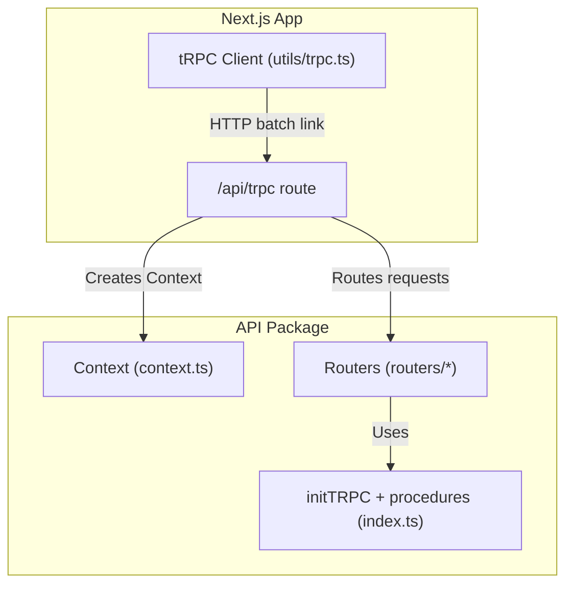
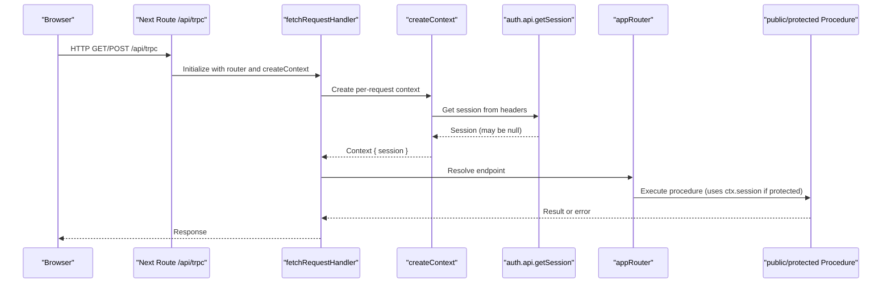
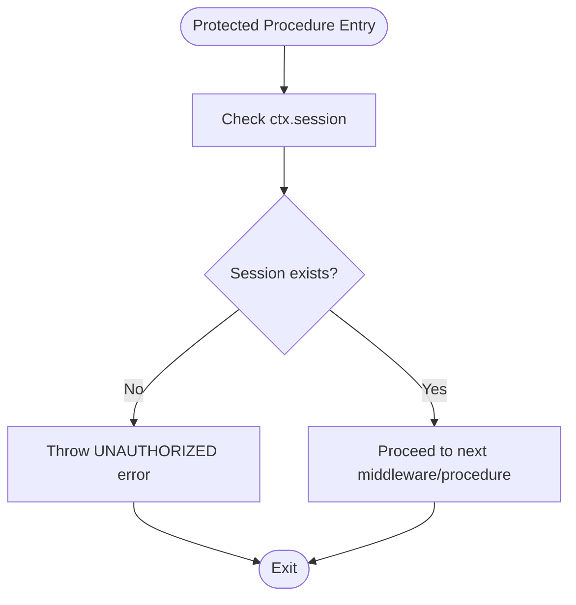
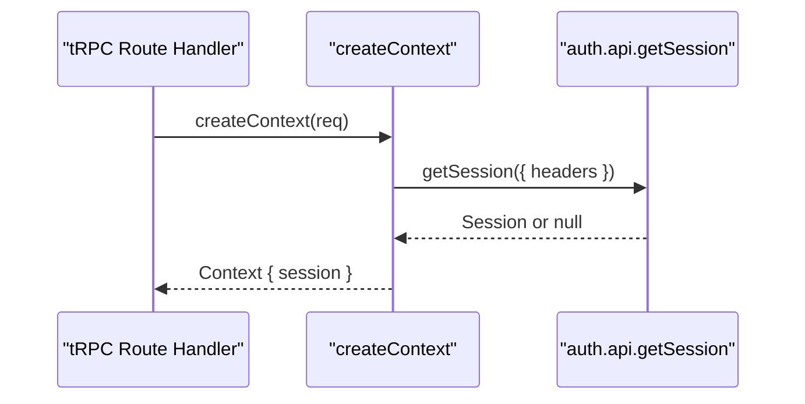
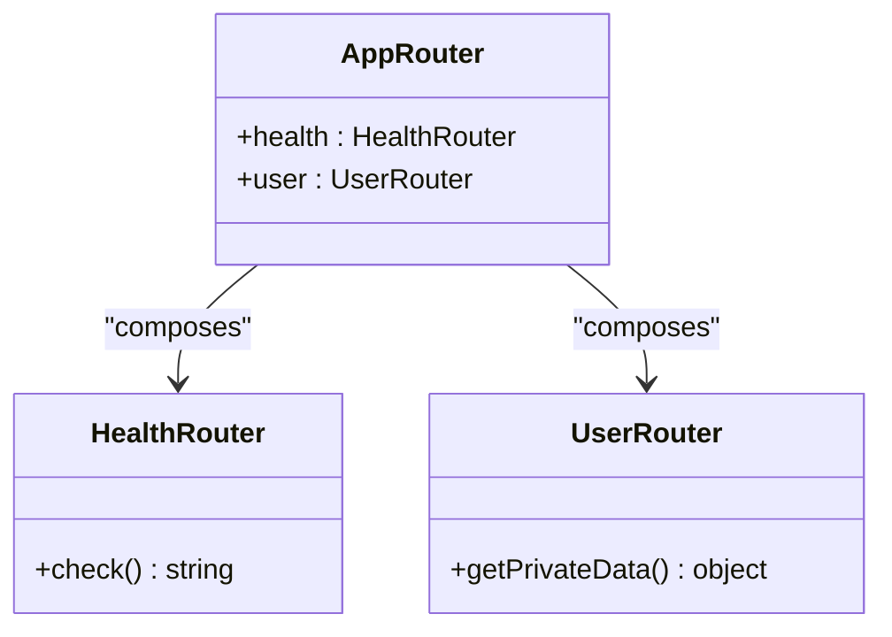
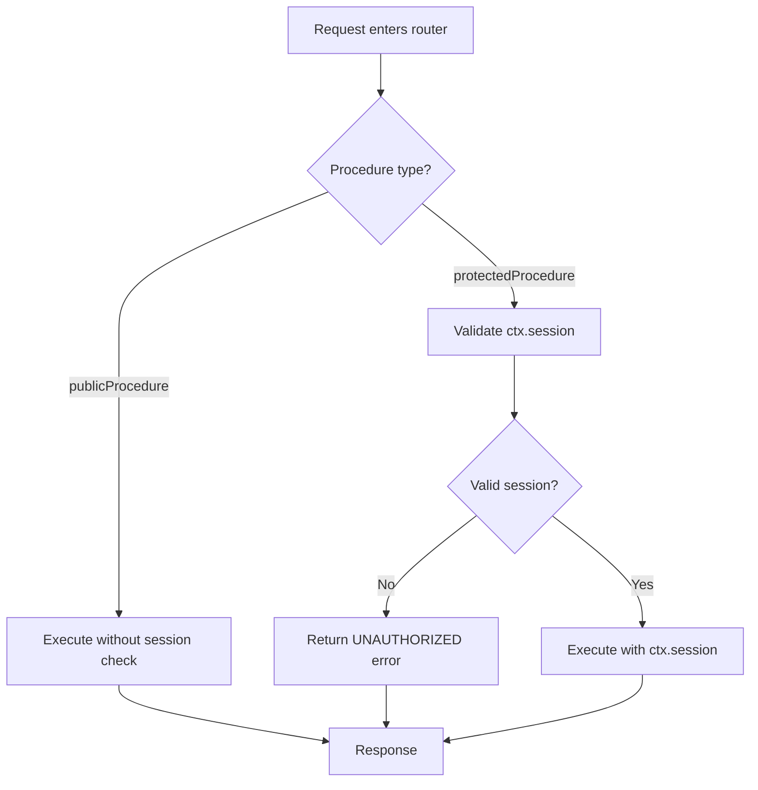
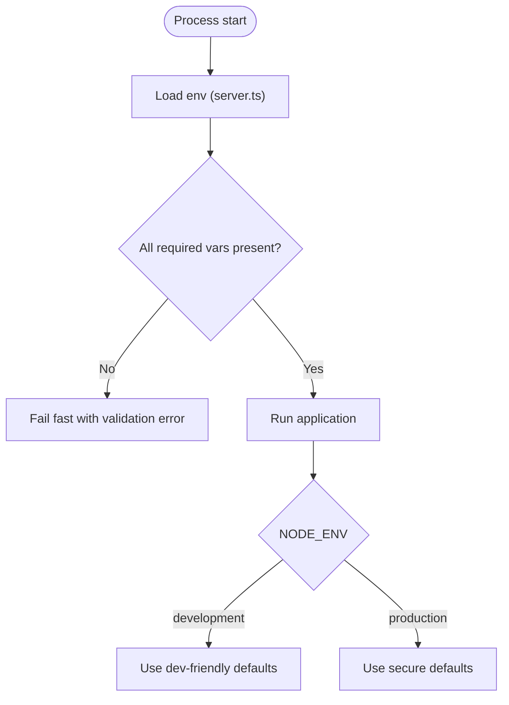
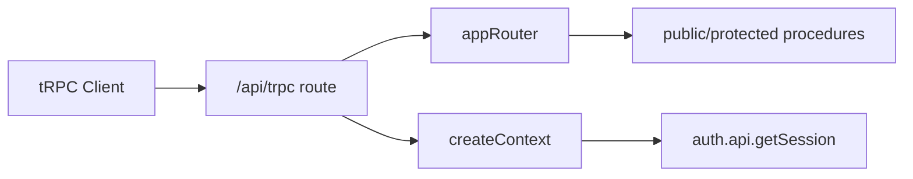

# tRPC Setup and Configuration

<cite>
**Referenced Files in This Document**
- [packages/api/src/index.ts](file://packages/api/src/index.ts)
- [packages/api/src/context.ts](file://packages/api/src/context.ts)
- [packages/api/src/routers/index.ts](file://packages/api/src/routers/index.ts)
- [packages/api/src/routers/health.ts](file://packages/api/src/routers/health.ts)
- [packages/api/src/routers/user.ts](file://packages/api/src/routers/user.ts)
- [apps/web/src/app/api/trpc/[trpc]/route.ts](file://apps/web/src/app/api/trpc/[trpc]/route.ts)
- [apps/web/src/utils/trpc.ts](file://apps/web/src/utils/trpc.ts)
- [packages/env/src/server.ts](file://packages/env/src/server.ts)
</cite>

## Table of Contents

1. [Introduction](#introduction)
2. [Project Structure](#project-structure)
3. [Core Components](#core-components)
4. [Architecture Overview](#architecture-overview)
5. [Detailed Component Analysis](#detailed-component-analysis)
6. [Dependency Analysis](#dependency-analysis)
7. [Performance Considerations](#performance-considerations)
8. [Troubleshooting Guide](#troubleshooting-guide)
9. [Conclusion](#conclusion)

## Introduction

This document explains how tRPC is set up and configured in the Atlas project. It covers initialization with initTRPC, context creation with session management, the router factory pattern, middleware pipeline (authentication guards), procedure factories for public and protected endpoints, client configuration, environment-specific settings, and guidance for request parsing and response formatting.

## Project Structure

The tRPC implementation spans a shared API package and the Next.js web app:

- Server-side tRPC core lives in packages/api and exposes initTRPC, context, routers, and procedure factories.
- The Next.js route handler wires tRPC into Next.js using fetchRequestHandler and provides per-request context.
- The client library is configured in the web app to call the server endpoints with batching and credentials.



**Diagram sources**

- [apps/web/src/app/api/trpc/[trpc]/route.ts:1-14](file://apps/web/src/app/api/trpc/[trpc]/route.ts#L1-L14)
- [packages/api/src/index.ts:1-25](file://packages/api/src/index.ts#L1-L25)
- [packages/api/src/context.ts:1-15](file://packages/api/src/context.ts#L1-L15)
- [packages/api/src/routers/index.ts:1-11](file://packages/api/src/routers/index.ts#L1-L11)
- [apps/web/src/utils/trpc.ts:1-40](file://apps/web/src/utils/trpc.ts#L1-L40)

**Section sources**

- [apps/web/src/app/api/trpc/[trpc]/route.ts:1-14](file://apps/web/src/app/api/trpc/[trpc]/route.ts#L1-L14)
- [packages/api/src/index.ts:1-25](file://packages/api/src/index.ts#L1-L25)
- [packages/api/src/context.ts:1-15](file://packages/api/src/context.ts#L1-L15)
- [packages/api/src/routers/index.ts:1-11](file://packages/api/src/routers/index.ts#L1-L11)
- [apps/web/src/utils/trpc.ts:1-40](file://apps/web/src/utils/trpc.ts#L1-L40)

## Core Components

- tRPC initialization and procedure factories:
  - A single t instance is created via initTRPC with typed Context.
  - Exposes router, publicProcedure, and protectedProcedure.
  - protectedProcedure enforces authentication by checking ctx.session and throws an unauthorized error when missing.

- Context creation:
  - Per-request context retrieves the session from the auth provider using request headers.
  - Returns a typed Context object including session data.

- Router composition:
  - appRouter composes feature routers (health, user).
  - Each feature router uses either publicProcedure or protectedProcedure.

**Section sources**

- [packages/api/src/index.ts:1-25](file://packages/api/src/index.ts#L1-L25)
- [packages/api/src/context.ts:1-15](file://packages/api/src/context.ts#L1-L15)
- [packages/api/src/routers/index.ts:1-11](file://packages/api/src/routers/index.ts#L1-L11)
- [packages/api/src/routers/health.ts:1-6](file://packages/api/src/routers/health.ts#L1-L6)
- [packages/api/src/routers/user.ts:1-9](file://packages/api/src/routers/user.ts#L1-L9)

## Architecture Overview

The request flow integrates Next.js, tRPC server adapter, context, and routers:



**Diagram sources**

- [apps/web/src/app/api/trpc/[trpc]/route.ts:1-14](file://apps/web/src/app/api/trpc/[trpc]/route.ts#L1-L14)
- [packages/api/src/context.ts:1-15](file://packages/api/src/context.ts#L1-L15)
- [packages/api/src/routers/index.ts:1-11](file://packages/api/src/routers/index.ts#L1-L11)
- [packages/api/src/index.ts:1-25](file://packages/api/src/index.ts#L1-L25)

## Detailed Component Analysis

### tRPC Initialization and Procedure Factories

- initTRPC is used to create a typed t instance bound to the Context type.
- router is exported for composing feature routers.
- publicProcedure is a direct alias to t.procedure for unauthenticated endpoints.
- protectedProcedure adds an authentication guard:
  - Checks ctx.session; if absent, throws an unauthorized TRPCError.
  - If present, proceeds to the next middleware/procedure.



**Diagram sources**

- [packages/api/src/index.ts:11-25](file://packages/api/src/index.ts#L11-L25)

**Section sources**

- [packages/api/src/index.ts:1-25](file://packages/api/src/index.ts#L1-L25)

### Context Creation and Session Management

- createContext is async and receives the NextRequest.
- Retrieves the session using the auth provider’s getSession with request headers.
- Returns a Context object containing session information.
- The Context type is derived from the return type of createContext for full type safety.



**Diagram sources**

- [packages/api/src/context.ts:1-15](file://packages/api/src/context.ts#L1-L15)
- [apps/web/src/app/api/trpc/[trpc]/route.ts:1-14](file://apps/web/src/app/api/trpc/[trpc]/route.ts#L1-L14)

**Section sources**

- [packages/api/src/context.ts:1-15](file://packages/api/src/context.ts#L1-L15)
- [apps/web/src/app/api/trpc/[trpc]/route.ts:1-14](file://apps/web/src/app/api/trpc/[trpc]/route.ts#L1-L14)

### Router Factory Pattern

- Feature routers are defined separately (health, user) and composed into appRouter.
- healthRouter demonstrates a public query.
- userRouter demonstrates a protected query that accesses ctx.session.



**Diagram sources**

- [packages/api/src/routers/index.ts:1-11](file://packages/api/src/routers/index.ts#L1-L11)
- [packages/api/src/routers/health.ts:1-6](file://packages/api/src/routers/health.ts#L1-L6)
- [packages/api/src/routers/user.ts:1-9](file://packages/api/src/routers/user.ts#L1-L9)

**Section sources**

- [packages/api/src/routers/index.ts:1-11](file://packages/api/src/routers/index.ts#L1-L11)
- [packages/api/src/routers/health.ts:1-6](file://packages/api/src/routers/health.ts#L1-L6)
- [packages/api/src/routers/user.ts:1-9](file://packages/api/src/routers/user.ts#L1-L9)

### Middleware Pipeline: Authentication Guards

- Authentication is enforced at the procedure level via protectedProcedure.
- Any procedure requiring a logged-in user should use protectedProcedure to ensure ctx.session is available.
- Public procedures can be exposed without authentication checks.



**Diagram sources**

- [packages/api/src/index.ts:11-25](file://packages/api/src/index.ts#L11-L25)
- [packages/api/src/routers/user.ts:1-9](file://packages/api/src/routers/user.ts#L1-L9)

**Section sources**

- [packages/api/src/index.ts:11-25](file://packages/api/src/index.ts#L11-L25)
- [packages/api/src/routers/user.ts:1-9](file://packages/api/src/routers/user.ts#L1-L9)

### Request Logging and Error Handling

- Centralized error handling is achieved through protectedProcedure throwing TRPCError with a code and message.
- For request logging, add a global middleware on the t instance before creating procedures. This allows consistent log lines per request and per procedure execution.
- For structured responses, consider adding a middleware that wraps results and errors to include timing or correlation IDs.

Implementation notes:

- Use t.middleware to wrap all procedures for logging.
- Use t.procedure.use to add request-scoped behavior like tracing or metrics.
- Keep error codes consistent (e.g., UNAUTHORIZED, NOT_FOUND) for predictable client handling.

[No sources needed since this section provides general guidance]

### Client Configuration (Batching, Credentials, Error UX)

- The client uses httpBatchLink to reduce network overhead by batching multiple calls.
- Credentials are included so cookies are sent with requests, enabling session-based auth.
- Errors are surfaced via React Query’s onError hook, showing a toast with a retry action.

```mermaid
sequenceDiagram
participant UI as "React UI"
participant Client as "tRPC Client"
participant Link as "httpBatchLink"
participant Server as "/api/trpc"
UI->>Client : trpc.health.check()
Client->>Link : Batched request(s)
Link->>Server : POST /api/trpc (credentials included)
Server-->>Link : Response or error
Link-->>Client : Data or error
Client-->>UI : Update cache / show toast
```

**Diagram sources**

- [apps/web/src/utils/trpc.ts:1-40](file://apps/web/src/utils/trpc.ts#L1-L40)
- [apps/web/src/app/api/trpc/[trpc]/route.ts:1-14](file://apps/web/src/app/api/trpc/[trpc]/route.ts#L1-L14)

**Section sources**

- [apps/web/src/utils/trpc.ts:1-40](file://apps/web/src/utils/trpc.ts#L1-L40)

### CORS, Request Parsing, and Response Formatting

- CORS:
  - Configure CORS at the Next.js level or within the tRPC adapter options. Ensure credentials are allowed when using cookies.
- Request parsing:
  - Use t.procedure.input(...) with Zod schemas to validate inputs. This ensures safe, typed request payloads.
- Response formatting:
  - Add a global middleware to transform successful responses or errors consistently (e.g., wrapping data, adding timestamps).
  - For standardized error shapes, map TRPCError instances to a common structure.

[No sources needed since this section provides general guidance]

### Environment-Specific Configurations and Dev vs Production

- Environment variables are validated at runtime using @t3-oss/env-core.
- Required keys include secrets, URLs, and flags such as NODE_ENV.
- Development vs production differences:
  - Use different .env files per environment.
  - Validate required variables only in non-development builds if needed.
  - Ensure CORS_ORIGIN and BETTER_AUTH_URL match the deployed domain.



**Diagram sources**

- [packages/env/src/server.ts:1-28](file://packages/env/src/server.ts#L1-L28)

**Section sources**

- [packages/env/src/server.ts:1-28](file://packages/env/src/server.ts#L1-L28)

## Dependency Analysis

Key dependencies and relationships:

- The tRPC route handler depends on the appRouter and creates context per request.
- Context depends on the auth provider to resolve sessions from request headers.
- Routers depend on procedure factories to enforce access control.
- The client depends on httpBatchLink and React Query for caching and error UX.



**Diagram sources**

- [apps/web/src/app/api/trpc/[trpc]/route.ts:1-14](file://apps/web/src/app/api/trpc/[trpc]/route.ts#L1-L14)
- [packages/api/src/routers/index.ts:1-11](file://packages/api/src/routers/index.ts#L1-L11)
- [packages/api/src/context.ts:1-15](file://packages/api/src/context.ts#L1-L15)
- [apps/web/src/utils/trpc.ts:1-40](file://apps/web/src/utils/trpc.ts#L1-L40)

**Section sources**

- [apps/web/src/app/api/trpc/[trpc]/route.ts:1-14](file://apps/web/src/app/api/trpc/[trpc]/route.ts#L1-L14)
- [packages/api/src/routers/index.ts:1-11](file://packages/api/src/routers/index.ts#L1-L11)
- [packages/api/src/context.ts:1-15](file://packages/api/src/context.ts#L1-L15)
- [apps/web/src/utils/trpc.ts:1-40](file://apps/web/src/utils/trpc.ts#L1-L40)

## Performance Considerations

- Use httpBatchLink on the client to minimize round trips.
- Keep context creation lightweight; avoid heavy I/O unless necessary.
- Cache expensive computations in procedures where appropriate.
- Avoid unnecessary logging in hot paths; use sampling or structured logs in production.

[No sources needed since this section provides general guidance]

## Troubleshooting Guide

Common issues and resolutions:

- Unauthorized errors:
  - Ensure cookies are included in client requests (credentials: include).
  - Verify that protectedProcedure is used for endpoints requiring a session.
- Session not found:
  - Confirm that the auth provider is correctly configured and that headers are passed to getSession.
- CORS errors:
  - Set CORS_ORIGIN to allow your frontend origin and enable credentials when using cookies.
- Validation failures:
  - Add input schemas to procedures to catch malformed requests early.

**Section sources**

- [packages/api/src/index.ts:11-25](file://packages/api/src/index.ts#L11-L25)
- [packages/api/src/context.ts:1-15](file://packages/api/src/context.ts#L1-L15)
- [apps/web/src/utils/trpc.ts:22-34](file://apps/web/src/utils/trpc.ts#L22-L34)

## Conclusion

Atlas implements a clean, type-safe tRPC setup with:

- A centralized t instance and typed context.
- Clear separation between public and protected procedures.
- A Next.js route handler that wires tRPC into the app.
- A robust client configuration with batching and error UX.
- Environment validation for reliable deployments across development and production.

Extend this foundation by adding global middleware for logging and response formatting, input validation with Zod, and environment-aware configurations for CORS and auth URLs.
