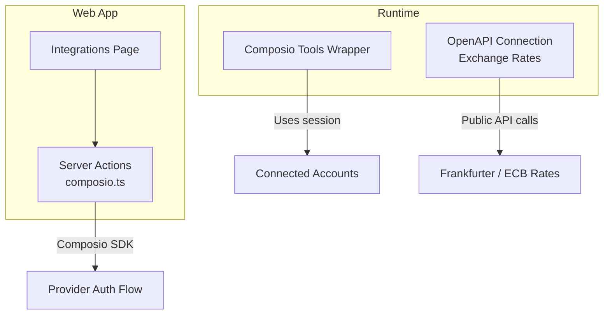
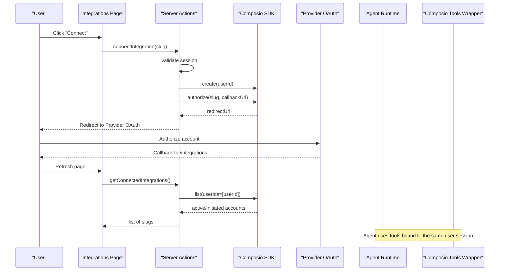
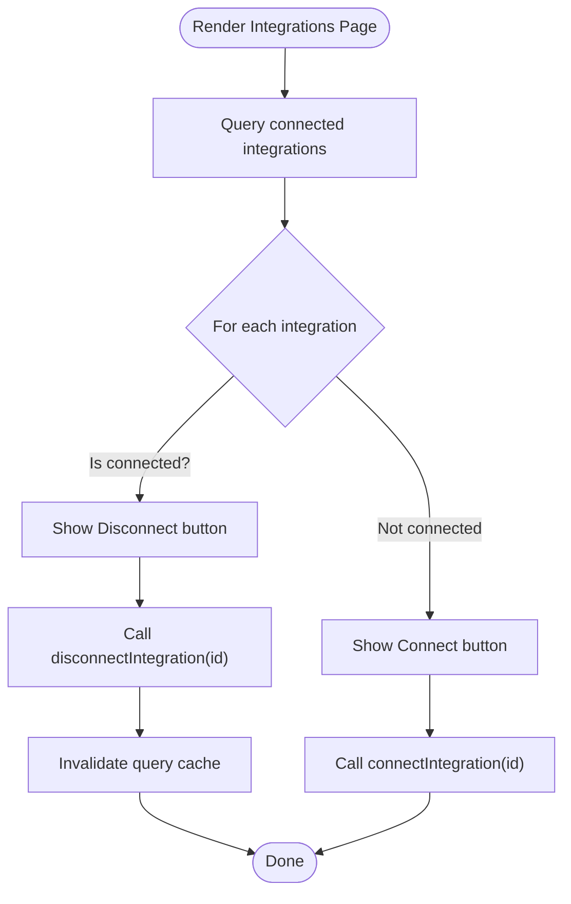
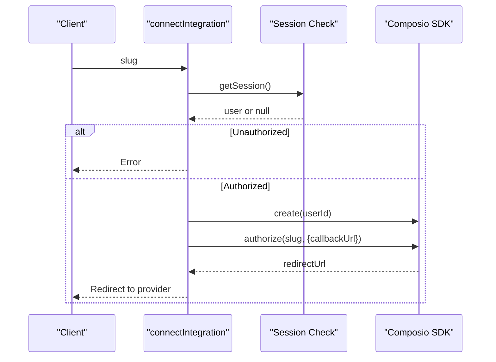
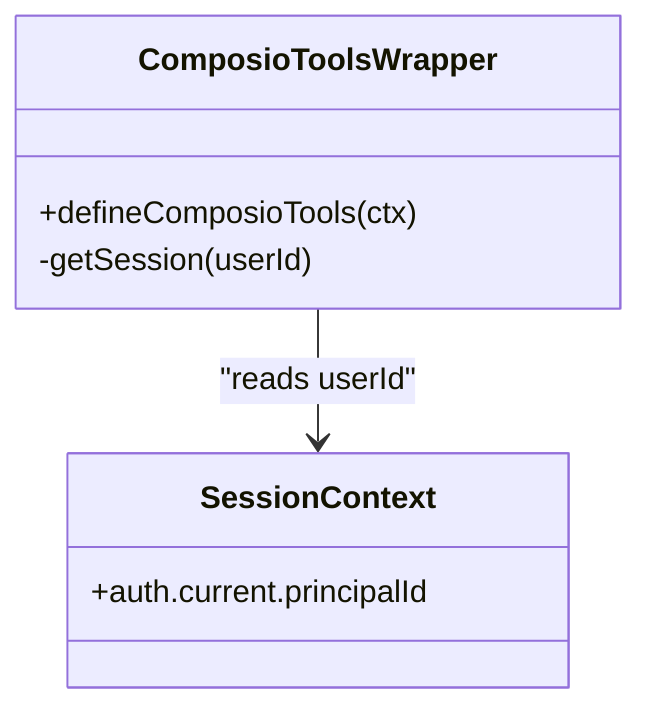
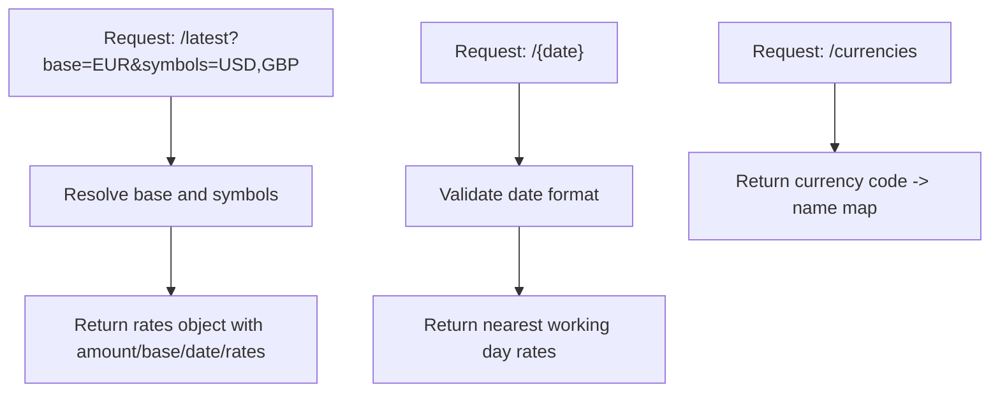
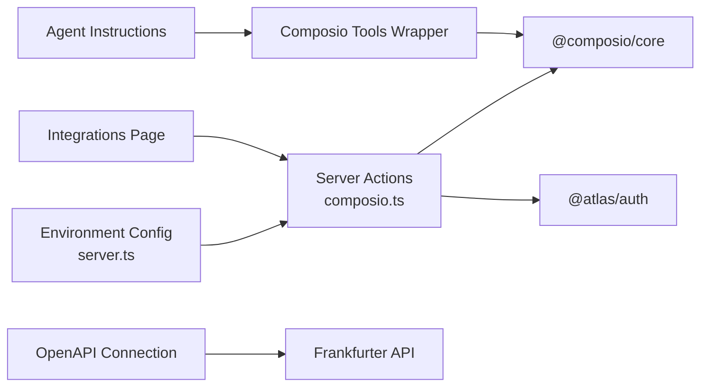

# External Integrations

<cite>
**Referenced Files in This Document**
- [README.md](file://README.md)
- [package.json](file://package.json)
- [apps/web/src/app/(protected)/integrations/page.tsx](file://apps/web/src/app/(protected)/integrations/page.tsx)
- [apps/web/src/app/actions/composio.ts](file://apps/web/src/app/actions/composio.ts)
- [packages/ui/src/components/socials/index.ts](file://packages/ui/src/components/socials/index.ts)
- [packages/env/src/server.ts](file://packages/env/src/server.ts)
- [apps/runtime/agent/tools/composio.ts](file://apps/runtime/agent/tools/composio.ts)
- [apps/runtime/agent/connections/exchange-rates.ts](file://apps/runtime/agent/connections/exchange-rates.ts)
- [apps/runtime/agent/instructions.md](file://apps/runtime/agent/instructions.md)
</cite>

## Table of Contents

1. [Introduction](#introduction)
2. [Project Structure](#project-structure)
3. [Core Components](#core-components)
4. [Architecture Overview](#architecture-overview)
5. [Detailed Component Analysis](#detailed-component-analysis)
6. [Dependency Analysis](#dependency-analysis)
7. [Performance Considerations](#performance-considerations)
8. [Troubleshooting Guide](#troubleshooting-guide)
9. [Conclusion](#conclusion)

## Introduction

This document explains how external integrations are implemented in the project, focusing on two integration layers:

- User-facing third-party app connections managed via Composio (for example, Gmail, Google Calendar, Slack, Notion, Telegram).
- OpenAPI-based tooling for public APIs exposed to the AI agent runtime (for example, exchange rates).

The system provides a user interface to connect and disconnect services, server actions to orchestrate authentication flows, and runtime tools that agents can call to perform tasks using those connected accounts or public APIs.

**Section sources**

- [README.md:1-107](file://README.md#L1-L107)

## Project Structure

External integrations span both the web application and the runtime:

- Web UI lists available integrations and triggers connection/disconnection flows.
- Server actions handle session validation, create Composio sessions, and redirect users to provider authorization pages.
- The runtime exposes tools and connections that agents use to interact with external systems.

**Diagram sources**

- [apps/web/src/app/(protected)/integrations/page.tsx:74-150](<file://apps/web/src/app/(protected)/integrations/page.tsx#L74-L150>)
- [apps/web/src/app/actions/composio.ts:13-33](file://apps/web/src/app/actions/composio.ts#L13-L33)
- [apps/runtime/agent/tools/composio.ts:5-11](file://apps/runtime/agent/tools/composio.ts#L5-L11)
- [apps/runtime/agent/connections/exchange-rates.ts:61-124](file://apps/runtime/agent/connections/exchange-rates.ts#L61-L124)

**Section sources**

- [apps/web/src/app/(protected)/integrations/page.tsx:36-72](<file://apps/web/src/app/(protected)/integrations/page.tsx#L36-L72>)
- [packages/ui/src/components/socials/index.ts:1-9](file://packages/ui/src/components/socials/index.ts#L1-L9)

## Core Components

- Integrations page: Displays supported integrations and their connection status; allows connecting or disconnecting.
- Server actions: Validate user session, create a Composio session, initiate authorization, and redirect to the provider’s consent screen; also list and delete connected accounts.
- Runtime Composio tools wrapper: Binds the current user session to the Composio client so agents can call tools against connected accounts.
- OpenAPI connection: Declares a read-only currency conversion service with explicit schemas and endpoints.

Key responsibilities:

- UI: Present options and trigger flows without handling secrets.
- Server actions: Enforce authentication and coordinate with external identity providers.
- Runtime: Provide typed, discoverable tools for the agent based on connections and specs.

**Section sources**

- [apps/web/src/app/(protected)/integrations/page.tsx:74-150](<file://apps/web/src/app/(protected)/integrations/page.tsx#L74-L150>)
- [apps/web/src/app/actions/composio.ts:13-84](file://apps/web/src/app/actions/composio.ts#L13-L84)
- [apps/runtime/agent/tools/composio.ts:5-11](file://apps/runtime/agent/tools/composio.ts#L5-L11)
- [apps/runtime/agent/connections/exchange-rates.ts:61-124](file://apps/runtime/agent/connections/exchange-rates.ts#L61-L124)

## Architecture Overview

The integration architecture separates concerns across UI, server-side orchestration, and runtime tooling.

**Diagram sources**

- [apps/web/src/app/(protected)/integrations/page.tsx:74-150](<file://apps/web/src/app/(protected)/integrations/page.tsx#L74-L150>)
- [apps/web/src/app/actions/composio.ts:13-84](file://apps/web/src/app/actions/composio.ts#L13-L84)
- [apps/runtime/agent/tools/composio.ts:5-11](file://apps/runtime/agent/tools/composio.ts#L5-L11)

## Detailed Component Analysis

### Integrations Page

- Lists supported integrations with icons and titles.
- Queries connected integrations and toggles between Connect and Disconnect buttons per integration.
- Uses React Query to invalidate the connected integrations list after disconnect.

**Diagram sources**

- [apps/web/src/app/(protected)/integrations/page.tsx:74-150](<file://apps/web/src/app/(protected)/integrations/page.tsx#L74-L150>)

**Section sources**

- [apps/web/src/app/(protected)/integrations/page.tsx:36-72](<file://apps/web/src/app/(protected)/integrations/page.tsx#L36-L72>)
- [apps/web/src/app/(protected)/integrations/page.tsx:74-150](<file://apps/web/src/app/(protected)/integrations/page.tsx#L74-L150>)

### Server Actions for Composio

- Validates the user session before any operation.
- Creates a Composio session scoped to the user and initiates authorization with a configured callback URL.
- Redirects the browser to the provider’s authorization page.
- Lists and deletes connected accounts for disconnection.

**Diagram sources**

- [apps/web/src/app/actions/composio.ts:13-33](file://apps/web/src/app/actions/composio.ts#L13-L33)

**Section sources**

- [apps/web/src/app/actions/composio.ts:13-84](file://apps/web/src/app/actions/composio.ts#L13-L84)

### Runtime Composio Tools Wrapper

- Binds the current user session to the Composio client used by the agent.
- Ensures a valid user ID is present before exposing tools.

**Diagram sources**

- [apps/runtime/agent/tools/composio.ts:5-11](file://apps/runtime/agent/tools/composio.ts#L5-L11)

**Section sources**

- [apps/runtime/agent/tools/composio.ts:5-11](file://apps/runtime/agent/tools/composio.ts#L5-L11)

### OpenAPI Exchange Rates Connection

- Declares a read-only OpenAPI spec for currency conversion with explicit parameters and responses.
- Exposes operations for listing currencies, getting latest rates, and historical rates for a specific date.
- No credentials required; suitable for read-only fare conversions.

**Diagram sources**

- [apps/runtime/agent/connections/exchange-rates.ts:61-124](file://apps/runtime/agent/connections/exchange-rates.ts#L61-L124)

**Section sources**

- [apps/runtime/agent/connections/exchange-rates.ts:1-125](file://apps/runtime/agent/connections/exchange-rates.ts#L1-L125)

### Supported Integrations Catalog

- The UI references a set of integrations including Slack, Gmail, Google Calendar, Google Maps, Google Sheets, Notion, and Telegram.
- Icons are provided from a shared socials component index.

**Section sources**

- [apps/web/src/app/(protected)/integrations/page.tsx:36-72](<file://apps/web/src/app/(protected)/integrations/page.tsx#L36-L72>)
- [packages/ui/src/components/socials/index.ts:1-9](file://packages/ui/src/components/socials/index.ts#L1-L9)

## Dependency Analysis

External integrations depend on environment configuration, authentication, and third-party SDKs.

**Diagram sources**

- [packages/env/src/server.ts:5-28](file://packages/env/src/server.ts#L5-L28)
- [apps/web/src/app/actions/composio.ts:1-11](file://apps/web/src/app/actions/composio.ts#L1-L11)
- [apps/runtime/agent/tools/composio.ts:1-11](file://apps/runtime/agent/tools/composio.ts#L1-L11)
- [apps/runtime/agent/connections/exchange-rates.ts:61-124](file://apps/runtime/agent/connections/exchange-rates.ts#L61-L124)

**Section sources**

- [packages/env/src/server.ts:5-28](file://packages/env/src/server.ts#L5-L28)
- [package.json:42-46](file://package.json#L42-L46)

## Performance Considerations

- Avoid caching sensitive or frequently changing data:
  - The server action that lists connected integrations disables caching to ensure fresh results.
- Minimize network calls:
  - Use React Query to cache and deduplicate requests for connected integrations.
- Keep OpenAPI specs local when possible:
  - The exchange rates connection vendors its OpenAPI spec to avoid cold-start latency and unstable remote spec fetching.

[No sources needed since this section provides general guidance]

## Troubleshooting Guide

Common issues and where to look:

- Unauthorized errors during connect/disconnect:
  - Ensure a valid session exists before calling server actions.
- Missing redirect URL:
  - If the authorization flow cannot generate a redirect URL, check environment variables and provider configuration.
- Environment variables:
  - Verify that keys such as COMPOSIO_API_KEY and other required values are present and validated at startup.
- Telegram-specific state:
  - Some integrations may appear as INITIATED until the first message is sent; treat them as effectively connected for UI purposes.

**Section sources**

- [apps/web/src/app/actions/composio.ts:13-33](file://apps/web/src/app/actions/composio.ts#L13-L33)
- [apps/web/src/app/actions/composio.ts:35-84](file://apps/web/src/app/actions/composio.ts#L35-L84)
- [packages/env/src/server.ts:5-28](file://packages/env/src/server.ts#L5-L28)

## Conclusion

The integration layer combines a user-friendly UI, secure server-side orchestration, and a robust runtime toolset:

- Users connect third-party apps through a guided flow backed by Composio.
- The agent runtime consumes these connections via typed tools and OpenAPI connections.
- Clear separation of concerns ensures security, performance, and maintainability while enabling powerful workflows like booking assistance with email, calendar, and messaging integrations.

[No sources needed since this section summarizes without analyzing specific files]
