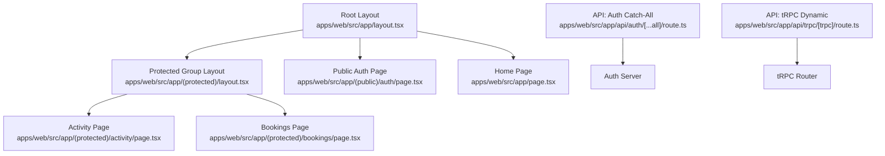
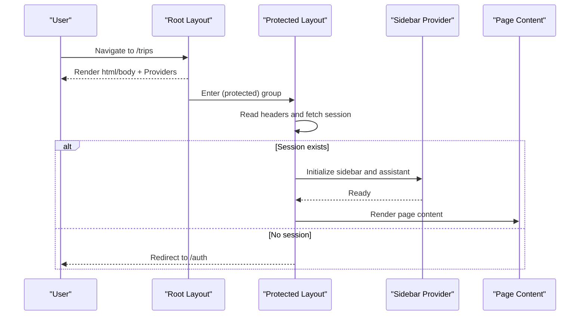
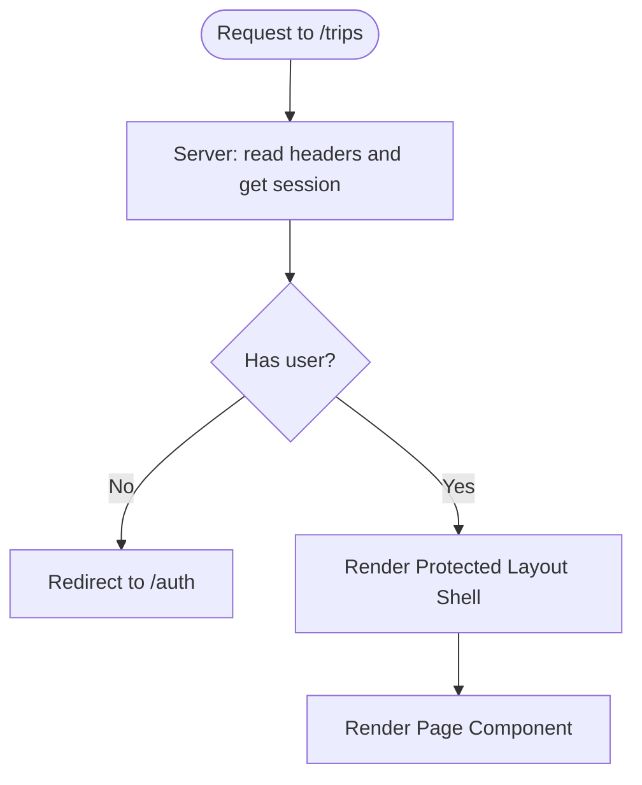
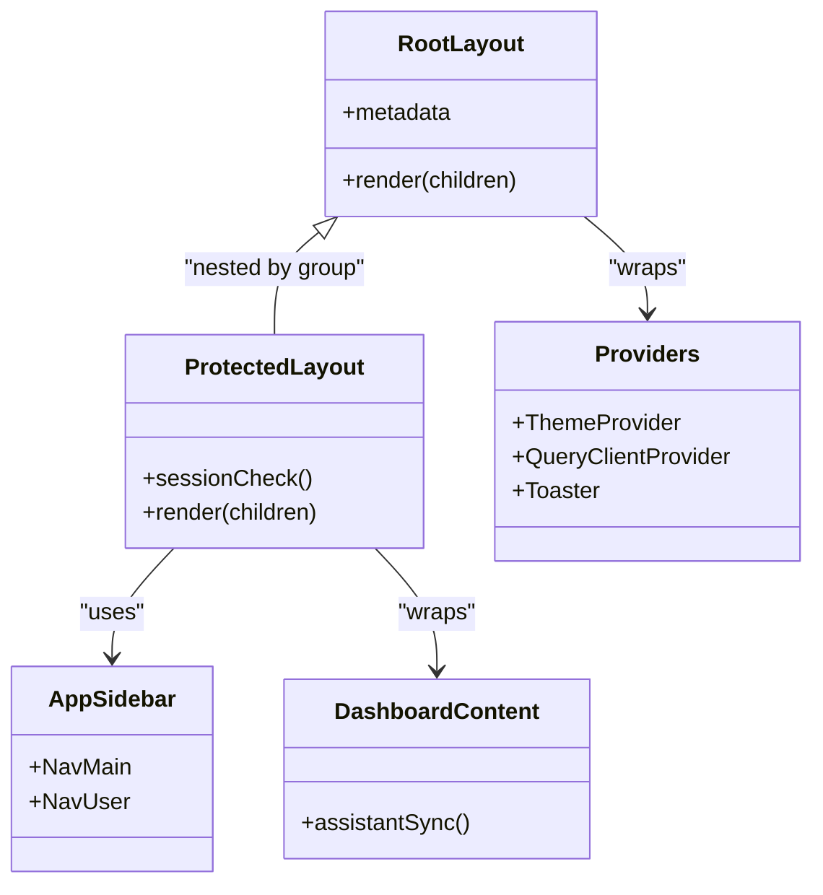
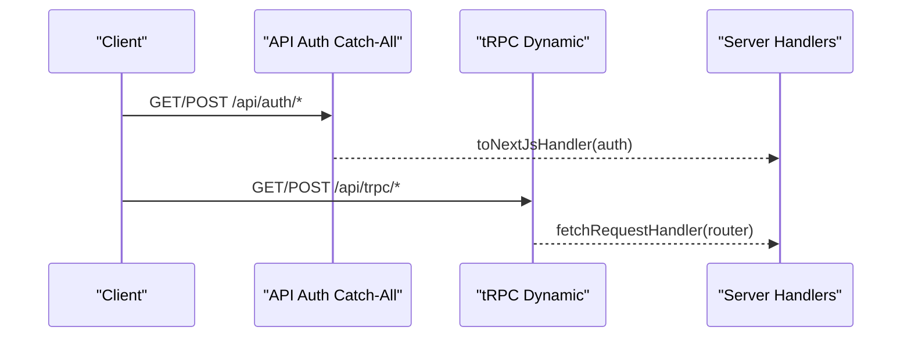
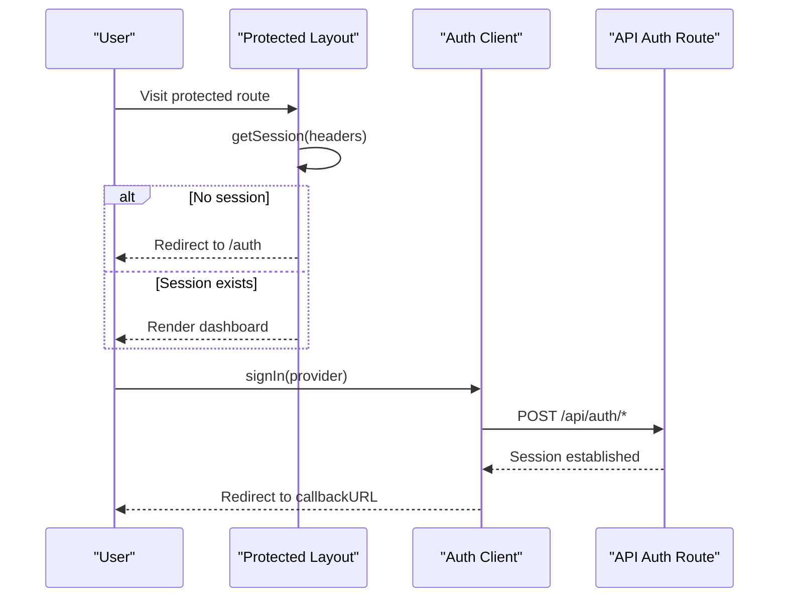
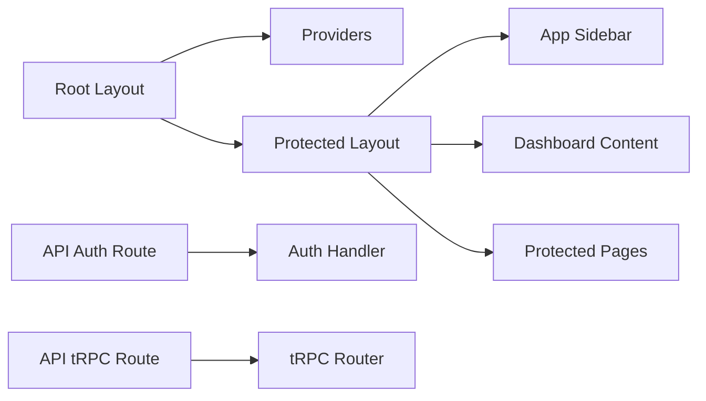

# App Router Structure and Routing

<cite>
**Referenced Files in This Document**
- [layout.tsx](file://apps/web/src/app/layout.tsx)
- [protected-layout.tsx](file://apps/web/src/app/(protected)/layout.tsx)
- [public-auth-page.tsx](file://apps/web/src/app/(public)/auth/page.tsx)
- [home-page.tsx](file://apps/web/src/app/page.tsx)
- [activity-page.tsx](file://apps/web/src/app/(protected)/activity/page.tsx)
- [bookings-page.tsx](file://apps/web/src/app/(protected)/bookings/page.tsx)
- [providers.tsx](file://apps/web/src/components/providers.tsx)
- [app-sidebar.tsx](file://apps/web/src/components/app-sidebar.tsx)
- [dashboard-content.tsx](file://apps/web/src/components/dashboard-content.tsx)
- [auth-client.ts](file://apps/web/src/lib/auth-client.ts)
- [auth-route.ts](file://apps/web/src/app/api/auth/[...all]/route.ts)
- [trpc-route.ts](file://apps/web/src/app/api/trpc/[trpc]/route.ts)
- [next-config.ts](file://apps/web/src/next.config.ts)
</cite>

## Table of Contents

1. [Introduction](#introduction)
2. [Project Structure](#project-structure)
3. [Core Components](#core-components)
4. [Architecture Overview](#architecture-overview)
5. [Detailed Component Analysis](#detailed-component-analysis)
6. [Dependency Analysis](#dependency-analysis)
7. [Performance Considerations](#performance-considerations)
8. [Troubleshooting Guide](#troubleshooting-guide)
9. [Conclusion](#conclusion)

## Introduction

This document explains the Next.js App Router implementation with a focus on route groups, layout hierarchy, shared UI components, metadata, SEO, performance, authentication guards, code splitting, and error boundaries. It covers how protected and public routes are organized, how nested layouts compose UI, and how dynamic segments and catch-all routes are used for API endpoints.

## Project Structure

The application uses Next.js App Router conventions:

- Root layout at apps/web/src/app/layout.tsx provides global providers, fonts, and metadata.
- Route groups organize behavior without affecting URLs:
  - (protected): Requires authentication; renders dashboard shell with sidebar, header, and content area.
  - (public): Contains auth page for unauthenticated users.
- Pages under each group define the visible content.
- API routes live under apps/web/src/app/api using dynamic segments and catch-all patterns.

**Diagram sources**

- [layout.tsx:21-46](file://apps/web/src/app/layout.tsx#L21-L46)
- [protected-layout.tsx:22-65](<file://apps/web/src/app/(protected)/layout.tsx#L22-L65>)
- [public-auth-page.tsx:5-7](<file://apps/web/src/app/(public)/auth/page.tsx#L5-L7>)
- [activity-page.tsx:11-29](<file://apps/web/src/app/(protected)/activity/page.tsx#L11-L29>)
- [bookings-page.tsx:11-29](<file://apps/web/src/app/(protected)/bookings/page.tsx#L11-L29>)
- [auth-route.ts:1-5](file://apps/web/src/app/api/auth/[...all]/route.ts#L1-L5)
- [trpc-route.ts:1-14](file://apps/web/src/app/api/trpc/[trpc]/route.ts#L1-L14)

**Section sources**

- [layout.tsx:21-46](file://apps/web/src/app/layout.tsx#L21-L46)
- [protected-layout.tsx:22-65](<file://apps/web/src/app/(protected)/layout.tsx#L22-L65>)
- [public-auth-page.tsx:5-7](<file://apps/web/src/app/(public)/auth/page.tsx#L5-L7>)
- [home-page.tsx:8-38](file://apps/web/src/app/page.tsx#L8-L38)
- [activity-page.tsx:11-29](<file://apps/web/src/app/(protected)/activity/page.tsx#L11-L29>)
- [bookings-page.tsx:11-29](<file://apps/web/src/app/(protected)/bookings/page.tsx#L11-L29>)
- [auth-route.ts:1-5](file://apps/web/src/app/api/auth/[...all]/route.ts#L1-L5)
- [trpc-route.ts:1-14](file://apps/web/src/app/api/trpc/[trpc]/route.ts#L1-L14)

## Core Components

- Root Providers: Theme, React Query client, and Toaster are provided globally via a client component wrapper.
- Protected Shell: Sidebar provider, assistant panel provider, sidebar, header, and content container render around protected pages.
- Shared UI: Sidebar, header title, mode toggle, agent button, and assistant panel are reused across protected routes.

Key responsibilities:

- Global context setup and theme management.
- Authentication guard for protected routes.
- Consistent dashboard chrome for authenticated experiences.

**Section sources**

- [providers.tsx:11-25](file://apps/web/src/components/providers.tsx#L11-L25)
- [protected-layout.tsx:22-65](<file://apps/web/src/app/(protected)/layout.tsx#L22-L65>)
- [app-sidebar.tsx:13-24](file://apps/web/src/components/app-sidebar.tsx#L13-L24)
- [dashboard-content.tsx:5-17](file://apps/web/src/components/dashboard-content.tsx#L5-L17)

## Architecture Overview

The app composes multiple layers:

- Root layout sets language, fonts, and wraps children in Providers.
- Protected layout enforces session checks and renders dashboard chrome.
- Public auth page is accessible without authentication.
- API routes expose server-side handlers for auth and tRPC.

**Diagram sources**

- [layout.tsx:26-46](file://apps/web/src/app/layout.tsx#L26-L46)
- [protected-layout.tsx:22-65](<file://apps/web/src/app/(protected)/layout.tsx#L22-L65>)

## Detailed Component Analysis

### Protected vs Public Route Groups

- Public group:
  - URL: /auth
  - Purpose: Sign-in UI using client-side auth client.
  - Behavior: No server-side redirect; relies on client hooks to show loader or form.
- Protected group:
  - URL: /trips, /bookings, /activity, /integrations
  - Purpose: Dashboard features requiring an active session.
  - Behavior: Server-side session check; redirects to /auth if missing.

**Diagram sources**

- [protected-layout.tsx:22-33](<file://apps/web/src/app/(protected)/layout.tsx#L22-L33>)
- [public-auth-page.tsx:5-7](<file://apps/web/src/app/(public)/auth/page.tsx#L5-L7>)

**Section sources**

- [protected-layout.tsx:22-33](<file://apps/web/src/app/(protected)/layout.tsx#L22-L33>)
- [public-auth-page.tsx:5-7](<file://apps/web/src/app/(public)/auth/page.tsx#L5-L7>)

### Nested Layouts and Composition Pattern

- Root layout: Provides global HTML structure, fonts, and Providers.
- Group layout: Adds domain-specific chrome (sidebar, header, assistant).
- Page components: Focus on feature content and use Suspense for loading states.

**Diagram sources**

- [layout.tsx:21-46](file://apps/web/src/app/layout.tsx#L21-L46)
- [protected-layout.tsx:22-65](<file://apps/web/src/app/(protected)/layout.tsx#L22-L65>)
- [providers.tsx:11-25](file://apps/web/src/components/providers.tsx#L11-L25)
- [app-sidebar.tsx:13-24](file://apps/web/src/components/app-sidebar.tsx#L13-L24)
- [dashboard-content.tsx:5-17](file://apps/web/src/components/dashboard-content.tsx#L5-L17)

**Section sources**

- [layout.tsx:21-46](file://apps/web/src/app/layout.tsx#L21-L46)
- [protected-layout.tsx:22-65](<file://apps/web/src/app/(protected)/layout.tsx#L22-L65>)
- [providers.tsx:11-25](file://apps/web/src/components/providers.tsx#L11-L25)
- [app-sidebar.tsx:13-24](file://apps/web/src/components/app-sidebar.tsx#L13-L24)
- [dashboard-content.tsx:5-17](file://apps/web/src/components/dashboard-content.tsx#L5-L17)

### Routing Strategy: Dynamic Segments and Catch-All Routes

- API auth endpoint uses a catch-all segment to forward all auth-related requests to the auth handler.
- tRPC endpoint uses a dynamic segment to map request paths to router methods.

**Diagram sources**

- [auth-route.ts:1-5](file://apps/web/src/app/api/auth/[...all]/route.ts#L1-L5)
- [trpc-route.ts:1-14](file://apps/web/src/app/api/trpc/[trpc]/route.ts#L1-L14)

**Section sources**

- [auth-route.ts:1-5](file://apps/web/src/app/api/auth/[...all]/route.ts#L1-L5)
- [trpc-route.ts:1-14](file://apps/web/src/app/api/trpc/[trpc]/route.ts#L1-L14)

### Metadata Management and SEO

- Root layout exports metadata for title and description.
- Fonts are preloaded via next/font to optimize font loading and avoid layout shifts.
- Language attribute is set on html for accessibility and SEO.

Recommendations:

- Add per-page metadata overrides where needed.
- Include Open Graph and Twitter card metadata for social sharing.
- Use canonical links and structured data for key pages.

**Section sources**

- [layout.tsx:21-24](file://apps/web/src/app/layout.tsx#L21-L24)
- [layout.tsx:26-46](file://apps/web/src/app/layout.tsx#L26-L46)

### Performance Considerations

- Component caching enabled to improve navigation performance.
- Partial prefetching enabled for faster transitions.
- React Compiler enabled for optimized rendering.
- Package import optimization configured for icon libraries.
- Images remote patterns allow optimized image delivery from allowed hosts.

Practical tips:

- Keep protected layout lightweight; defer heavy UI until needed.
- Use Suspense boundaries around data-heavy sections.
- Prefer server components for data fetching when possible.

**Section sources**

- [next-config.ts:4-20](file://apps/web/src/next.config.ts#L4-L20)
- [activity-page.tsx:11-29](<file://apps/web/src/app/(protected)/activity/page.tsx#L11-L29>)
- [bookings-page.tsx:11-29](<file://apps/web/src/app/(protected)/bookings/page.tsx#L11-L29>)

### Authentication Guards and Client Integration

- Protected layout performs server-side session validation using headers and redirects to /auth when no user is present.
- Public auth page uses a client-side auth client to initiate sign-in flows and display last-used method hints.

**Diagram sources**

- [protected-layout.tsx:22-33](<file://apps/web/src/app/(protected)/layout.tsx#L22-L33>)
- [auth-client.ts:5-7](file://apps/web/src/lib/auth-client.ts#L5-L7)
- [auth-route.ts:1-5](file://apps/web/src/app/api/auth/[...all]/route.ts#L1-L5)

**Section sources**

- [protected-layout.tsx:22-33](<file://apps/web/src/app/(protected)/layout.tsx#L22-L33>)
- [auth-client.ts:5-7](file://apps/web/src/lib/auth-client.ts#L5-L7)
- [auth-route.ts:1-5](file://apps/web/src/app/api/auth/[...all]/route.ts#L1-L5)

### Route-Based Code Splitting

- Route groups naturally split bundles by feature boundary.
- Each page can be loaded independently, reducing initial payload.
- Using Suspense in pages ensures progressive loading within routes.

Best practices:

- Co-locate data fetching near the page that consumes it.
- Avoid importing heavy dependencies into shared layouts unless necessary.
- Leverage Next.js automatic code splitting for client components.

**Section sources**

- [protected-layout.tsx:22-65](<file://apps/web/src/app/(protected)/layout.tsx#L22-L65>)
- [activity-page.tsx:11-29](<file://apps/web/src/app/(protected)/activity/page.tsx#L11-L29>)
- [bookings-page.tsx:11-29](<file://apps/web/src/app/(protected)/bookings/page.tsx#L11-L29>)

### Error Boundaries Implementation

- The current codebase does not define explicit error boundary files (e.g., error.tsx or global-error.tsx).
- Recommended approach:
  - Add error.tsx inside each route group to handle route-level errors.
  - Add a global error.tsx at the root to handle unrecoverable errors.
  - Use try/catch in server actions or data loaders and render friendly messages.

[No sources needed since this section provides general guidance]

## Dependency Analysis

High-level dependencies between routing and UI:

- Root layout depends on Providers for theme and data state.
- Protected layout depends on auth, sidebar, header, and assistant components.
- Pages depend on UI primitives and icons.
- API routes depend on external routers and adapters.

**Diagram sources**

- [layout.tsx:26-46](file://apps/web/src/app/layout.tsx#L26-L46)
- [protected-layout.tsx:22-65](<file://apps/web/src/app/(protected)/layout.tsx#L22-L65>)
- [providers.tsx:11-25](file://apps/web/src/components/providers.tsx#L11-L25)
- [app-sidebar.tsx:13-24](file://apps/web/src/components/app-sidebar.tsx#L13-L24)
- [dashboard-content.tsx:5-17](file://apps/web/src/components/dashboard-content.tsx#L5-L17)
- [auth-route.ts:1-5](file://apps/web/src/app/api/auth/[...all]/route.ts#L1-L5)
- [trpc-route.ts:1-14](file://apps/web/src/app/api/trpc/[trpc]/route.ts#L1-L14)

**Section sources**

- [layout.tsx:26-46](file://apps/web/src/app/layout.tsx#L26-L46)
- [protected-layout.tsx:22-65](<file://apps/web/src/app/(protected)/layout.tsx#L22-L65>)
- [providers.tsx:11-25](file://apps/web/src/components/providers.tsx#L11-L25)
- [app-sidebar.tsx:13-24](file://apps/web/src/components/app-sidebar.tsx#L13-L24)
- [dashboard-content.tsx:5-17](file://apps/web/src/components/dashboard-content.tsx#L5-L17)
- [auth-route.ts:1-5](file://apps/web/src/app/api/auth/[...all]/route.ts#L1-L5)
- [trpc-route.ts:1-14](file://apps/web/src/app/api/trpc/[trpc]/route.ts#L1-L14)

## Performance Considerations

- Enable component caching and partial prefetching for faster navigation.
- Use React Compiler to reduce re-renders.
- Optimize third-party imports to minimize bundle size.
- Prefetch critical resources and images via Next.js optimizations.
- Defer non-critical UI behind Suspense or lazy imports.

[No sources needed since this section provides general guidance]

## Troubleshooting Guide

Common issues and resolutions:

- Redirect loops in protected routes: Ensure session retrieval reads correct headers and that redirects target the intended callback URL.
- tRPC 404 or method not found: Verify the dynamic segment matches the expected path and that the router exposes the requested method.
- Font loading warnings: Confirm font variables are applied to html/body classes and hydration is consistent.
- Image loading blocked: Ensure remote image hostnames are whitelisted in configuration.

**Section sources**

- [protected-layout.tsx:22-33](<file://apps/web/src/app/(protected)/layout.tsx#L22-L33>)
- [trpc-route.ts:1-14](file://apps/web/src/app/api/trpc/[trpc]/route.ts#L1-L14)
- [layout.tsx:26-46](file://apps/web/src/app/layout.tsx#L26-L46)
- [next-config.ts:10-17](file://apps/web/src/next.config.ts#L10-L17)

## Conclusion

The application leverages Next.js App Router effectively with clear separation between public and protected routes, a robust nested layout strategy, and well-scoped API endpoints. Metadata and performance settings are in place to support SEO and fast interactions. Adding explicit error boundaries will further improve resilience. Following the recommended best practices will keep the codebase maintainable and performant as it scales.
