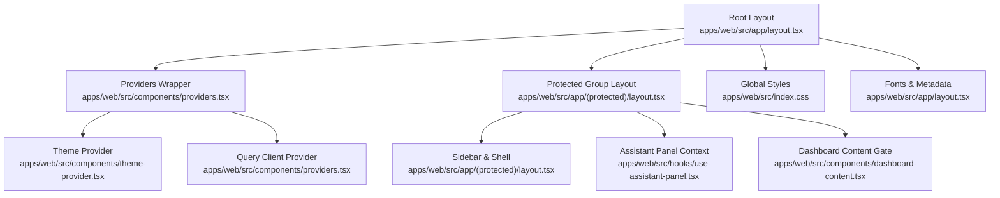
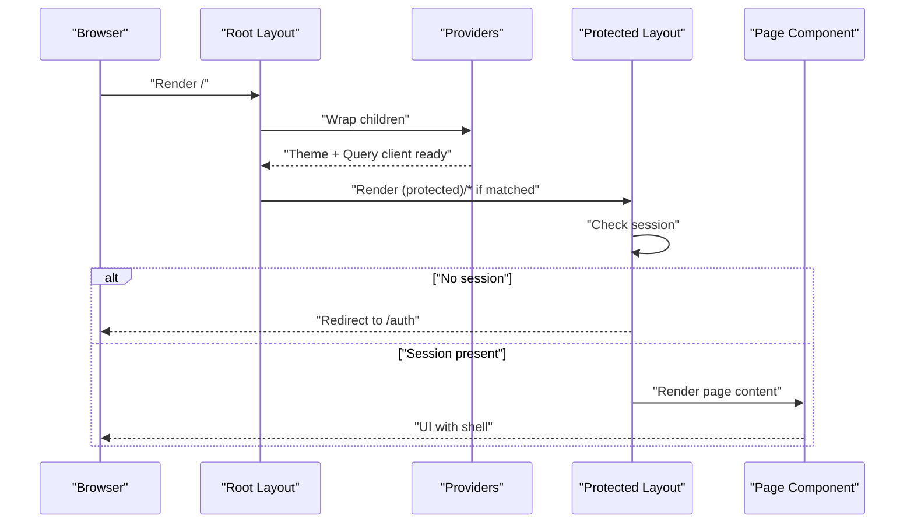
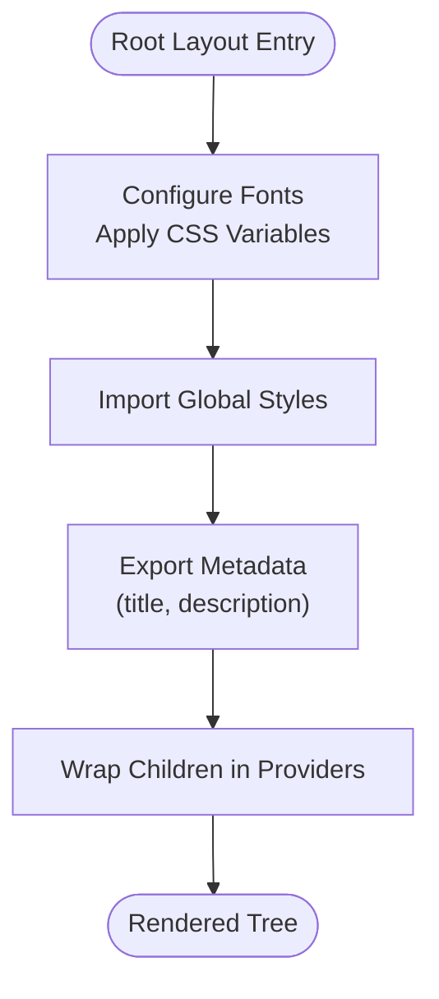
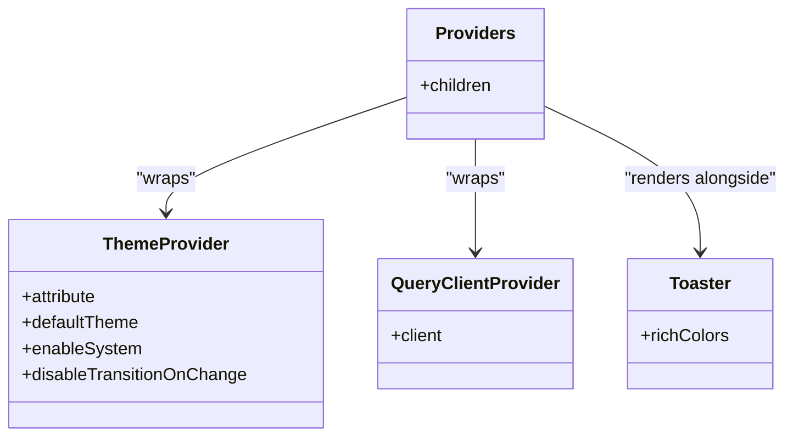
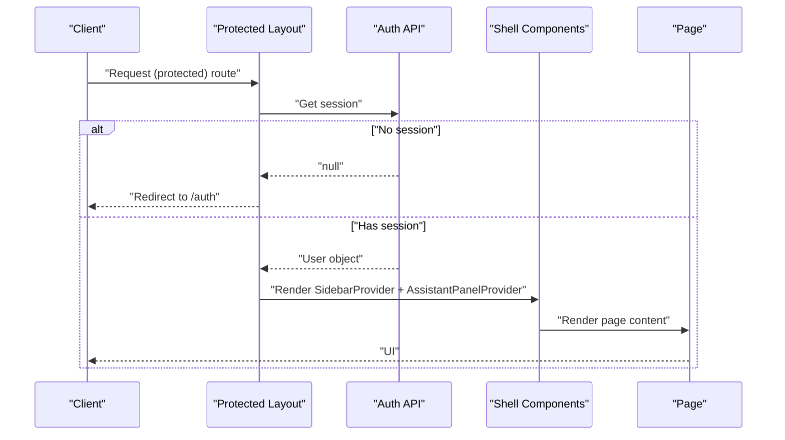
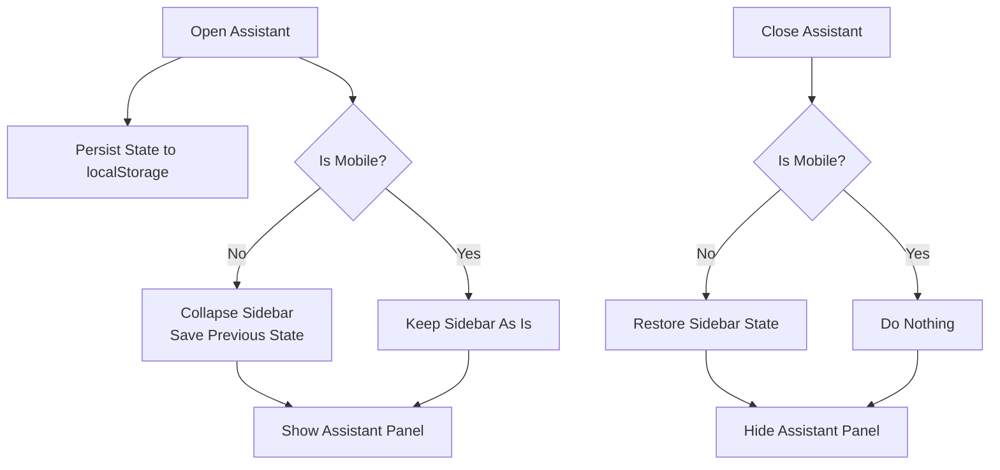
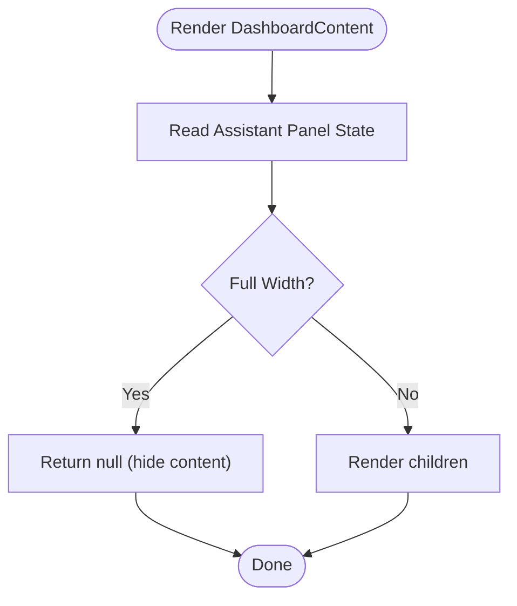
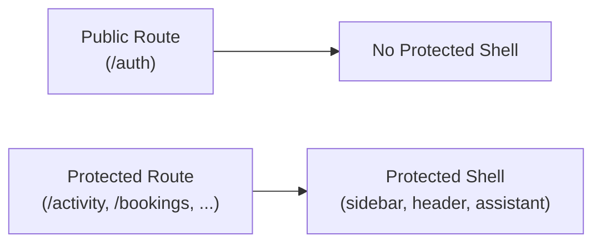
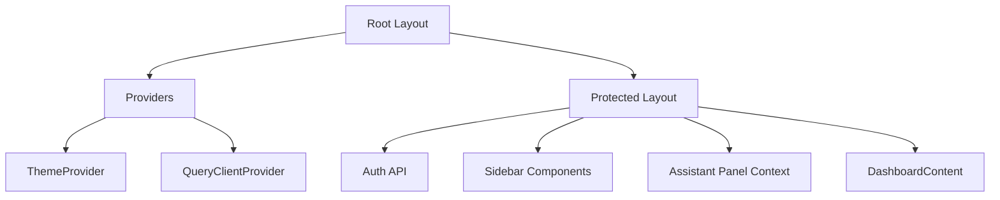

# Layout Hierarchy and Composition

<cite>
**Referenced Files in This Document**
- [layout.tsx](file://apps/web/src/app/layout.tsx)
- [layout.tsx](file://apps/web/src/app/(protected)/layout.tsx)
- [providers.tsx](file://apps/web/src/components/providers.tsx)
- [theme-provider.tsx](file://apps/web/src/components/theme-provider.tsx)
- [index.css](file://apps/web/src/index.css)
- [use-assistant-panel.tsx](file://apps/web/src/hooks/use-assistant-panel.tsx)
- [dashboard-content.tsx](file://apps/web/src/components/dashboard-content.tsx)
- [page.tsx](file://apps/web/src/app/page.tsx)
- [page.tsx](file://apps/web/src/app/(public)/auth/page.tsx)
</cite>

## Table of Contents

1. Introduction
2. Project Structure
3. Core Components
4. Architecture Overview
5. Detailed Component Analysis
6. Dependency Analysis
7. Performance Considerations
8. Troubleshooting Guide
9. Conclusion

## Introduction

This document explains the layout hierarchy pattern used in the Atlas web application. It covers the root layout with Providers wrapper, font configuration, and global styles; the nested composition between root and protected layouts; how child layouts inherit and extend parent functionality; the layout props system; context sharing patterns; component composition strategies; layout-specific metadata; SEO optimization; and performance considerations at different layout levels.

## Project Structure

Atlas uses Next.js App Router conventions:

- Root layout defines global HTML structure, fonts, CSS imports, and a Providers wrapper that injects theme and data caching contexts.
- A protected group layout enforces authentication and composes a sidebar-based shell around page content.
- Pages under (protected) render within this shell, while public pages (e.g., auth) are rendered without it.

**Diagram sources**

- [layout.tsx:1-47](file://apps/web/src/app/layout.tsx#L1-L47)
- [layout.tsx:1-66](<file://apps/web/src/app/(protected)/layout.tsx#L1-L66>)
- [providers.tsx:1-27](file://apps/web/src/components/providers.tsx#L1-L27)
- [theme-provider.tsx:1-12](file://apps/web/src/components/theme-provider.tsx#L1-L12)
- [use-assistant-panel.tsx:1-235](file://apps/web/src/hooks/use-assistant-panel.tsx#L1-L235)
- [dashboard-content.tsx:1-18](file://apps/web/src/components/dashboard-content.tsx#L1-L18)
- [index.css:1-2](file://apps/web/src/index.css#L1-L2)

**Section sources**

- [layout.tsx:1-47](file://apps/web/src/app/layout.tsx#L1-L47)
- [layout.tsx:1-66](<file://apps/web/src/app/(protected)/layout.tsx#L1-L66>)
- [providers.tsx:1-27](file://apps/web/src/components/providers.tsx#L1-L27)
- [theme-provider.tsx:1-12](file://apps/web/src/components/theme-provider.tsx#L1-L12)
- [index.css:1-2](file://apps/web/src/index.css#L1-L2)

## Core Components

- Root layout: Sets language, suppresses hydration warnings, applies font variables to html/body, imports global styles, exports site-wide metadata, and wraps children in Providers.
- Providers: Wraps app in ThemeProvider and QueryClientProvider, and renders a Toaster for notifications.
- Protected layout: Performs server-side session check, redirects unauthenticated users, and composes a responsive sidebar shell with header, content area, and assistant panel context.
- Assistant panel context: Provides open/close/toggle state and persists preferences to localStorage; coordinates with the sidebar to avoid overlap.
- Dashboard content gate: Conditionally hides dashboard content when the assistant panel is full-width to prevent overlapping UI.

**Section sources**

- [layout.tsx:1-47](file://apps/web/src/app/layout.tsx#L1-L47)
- [providers.tsx:1-27](file://apps/web/src/components/providers.tsx#L1-L27)
- [layout.tsx:1-66](<file://apps/web/src/app/(protected)/layout.tsx#L1-L66>)
- [use-assistant-panel.tsx:1-235](file://apps/web/src/hooks/use-assistant-panel.tsx#L1-L235)
- [dashboard-content.tsx:1-18](file://apps/web/src/components/dashboard-content.tsx#L1-L18)

## Architecture Overview

The layout architecture follows a layered composition model:

- Root layer provides global concerns (fonts, theme, data cache, toasts).
- Protected layer adds navigation shell, header, and assistant coordination.
- Page layers compose feature-specific content inside these shells.

**Diagram sources**

- [layout.tsx:1-47](file://apps/web/src/app/layout.tsx#L1-L47)
- [layout.tsx:1-66](<file://apps/web/src/app/(protected)/layout.tsx#L1-L66>)
- [providers.tsx:1-27](file://apps/web/src/components/providers.tsx#L1-L27)

## Detailed Component Analysis

### Root Layout: Global Setup and Providers

- Fonts: Declares Inter, Geist Sans, and Geist Mono with CSS variables applied to html/body classes for consistent typography across the app.
- Global styles: Imports a single CSS file that pulls in shared design tokens and base styles.
- Metadata: Exports site-wide title and description for SEO.
- Providers: Ensures theme and query client are available to all descendants.

**Diagram sources**

- [layout.tsx:1-47](file://apps/web/src/app/layout.tsx#L1-L47)
- [index.css:1-2](file://apps/web/src/index.css#L1-L2)

**Section sources**

- [layout.tsx:1-47](file://apps/web/src/app/layout.tsx#L1-L47)
- [index.css:1-2](file://apps/web/src/index.css#L1-L2)

### Providers: Theme and Data Cache

- ThemeProvider configures theme mode and attribute strategy.
- QueryClientProvider initializes React Query client for data fetching and caching.
- Toaster is mounted globally for user feedback.

**Diagram sources**

- [providers.tsx:1-27](file://apps/web/src/components/providers.tsx#L1-L27)
- [theme-provider.tsx:1-12](file://apps/web/src/components/theme-provider.tsx#L1-L12)

**Section sources**

- [providers.tsx:1-27](file://apps/web/src/components/providers.tsx#L1-L27)
- [theme-provider.tsx:1-12](file://apps/web/src/components/theme-provider.tsx#L1-L12)

### Protected Layout: Auth Guard and Shell Composition

- Server-side session validation using headers from the request; redirects to /auth when missing.
- Composes a responsive sidebar shell with:
  - Sidebar provider and trigger
  - Header with title, separator, mode toggle, and agent button
  - Scrollable content area for page components
  - Assistant panel context provider for cross-component coordination
- Uses DashboardContent to conditionally hide main content when the assistant panel is full-width.

**Diagram sources**

- [layout.tsx:1-66](<file://apps/web/src/app/(protected)/layout.tsx#L1-L66>)

**Section sources**

- [layout.tsx:1-66](<file://apps/web/src/app/(protected)/layout.tsx#L1-L66>)

### Assistant Panel Context and Sidebar Coordination

- Provides open/close/toggle state and persistence via localStorage.
- Coordinates with the sidebar to collapse it when opening the assistant on non-mobile screens, restoring previous state on close.
- Exposes a hook to sync assistant panel with sidebar behavior.

**Diagram sources**

- [use-assistant-panel.tsx:1-235](file://apps/web/src/hooks/use-assistant-panel.tsx#L1-L235)

**Section sources**

- [use-assistant-panel.tsx:1-235](file://apps/web/src/hooks/use-assistant-panel.tsx#L1-L235)

### Dashboard Content Gate

- When the assistant panel is full-width, the dashboard content is hidden to avoid overlap.
- Otherwise, children (page content) are rendered normally.

**Diagram sources**

- [dashboard-content.tsx:1-18](file://apps/web/src/components/dashboard-content.tsx#L1-L18)
- [use-assistant-panel.tsx:1-235](file://apps/web/src/hooks/use-assistant-panel.tsx#L1-L235)

**Section sources**

- [dashboard-content.tsx:1-18](file://apps/web/src/components/dashboard-content.tsx#L1-L18)

### Public vs Protected Routes

- Public routes (e.g., /auth) render without the protected shell.
- Protected routes automatically wrap content with the sidebar shell after passing the session check.

**Diagram sources**

- [page.tsx:1-8](<file://apps/web/src/app/(public)/auth/page.tsx#L1-L8>)
- [layout.tsx:1-66](<file://apps/web/src/app/(protected)/layout.tsx#L1-L66>)

**Section sources**

- [page.tsx:1-8](<file://apps/web/src/app/(public)/auth/page.tsx#L1-L8>)
- [layout.tsx:1-66](<file://apps/web/src/app/(protected)/layout.tsx#L1-L66>)

## Dependency Analysis

- Root layout depends on:
  - Font modules for type variables
  - Global CSS import for base styles
  - Providers for theme and data caching
- Protected layout depends on:
  - Authentication API to validate session
  - UI primitives for sidebar, separators, and header
  - Assistant panel context for coordinated UI behavior
  - DashboardContent to manage content visibility

**Diagram sources**

- [layout.tsx:1-47](file://apps/web/src/app/layout.tsx#L1-L47)
- [providers.tsx:1-27](file://apps/web/src/components/providers.tsx#L1-L27)
- [layout.tsx:1-66](<file://apps/web/src/app/(protected)/layout.tsx#L1-L66>)
- [use-assistant-panel.tsx:1-235](file://apps/web/src/hooks/use-assistant-panel.tsx#L1-L235)
- [dashboard-content.tsx:1-18](file://apps/web/src/components/dashboard-content.tsx#L1-L18)

**Section sources**

- [layout.tsx:1-47](file://apps/web/src/app/layout.tsx#L1-L47)
- [providers.tsx:1-27](file://apps/web/src/components/providers.tsx#L1-L27)
- [layout.tsx:1-66](<file://apps/web/src/app/(protected)/layout.tsx#L1-L66>)
- [use-assistant-panel.tsx:1-235](file://apps/web/src/hooks/use-assistant-panel.tsx#L1-L235)
- [dashboard-content.tsx:1-18](file://apps/web/src/components/dashboard-content.tsx#L1-L18)

## Performance Considerations

- Fonts:
  - Use subset selection and CSS variables to minimize reflows and ensure fast text rendering.
- Global styles:
  - Centralize base styles to reduce duplication and improve cacheability.
- Providers:
  - Theme and query client are initialized once at the root to avoid redundant setup per route.
- Protected layout:
  - Session check runs on the server to prevent unnecessary client-side work and redirect early when unauthenticated.
  - Sidebar and assistant coordination avoids layout thrashing by collapsing sidebar only when needed.
- Content gating:
  - DashboardContent hides heavy content when assistant panel is full-width to reduce rendering load.
- Suspense boundaries:
  - Pages use Suspense to provide lightweight fallbacks during data loading.

[No sources needed since this section provides general guidance]

## Troubleshooting Guide

- Unauthenticated access to protected routes:
  - The protected layout checks the session server-side and redirects to /auth if no user is found. Ensure cookies or headers are correctly passed to the auth API.
- Assistant panel not persisting state:
  - The assistant panel context persists open/full-width state to localStorage. If storage is unavailable (e.g., private browsing), state remains in-memory only.
- Sidebar overlap with assistant panel:
  - On non-mobile devices, opening the assistant collapses the sidebar and restores its previous state on close. Verify mobile detection logic if unexpected behavior occurs.
- Content hidden unexpectedly:
  - When the assistant panel is full-width, DashboardContent returns null to avoid overlap. Toggle the assistant or switch to a non-full-width mode to restore content.

**Section sources**

- [layout.tsx:1-66](<file://apps/web/src/app/(protected)/layout.tsx#L1-L66>)
- [use-assistant-panel.tsx:1-235](file://apps/web/src/hooks/use-assistant-panel.tsx#L1-L235)
- [dashboard-content.tsx:1-18](file://apps/web/src/components/dashboard-content.tsx#L1-L18)

## Conclusion

Atlas’s layout hierarchy separates global concerns (fonts, theme, data cache, styles) from route-specific shells (protected sidebar and assistant coordination). The root layout establishes a stable foundation, while the protected layout enforces access control and composes a rich UI shell. Context-driven coordination ensures smooth interactions between the assistant panel and sidebar, and content gating prevents visual conflicts. This composition pattern scales well as new features and pages are added, keeping code organized and performance optimized.

[No sources needed since this section summarizes without analyzing specific files]
