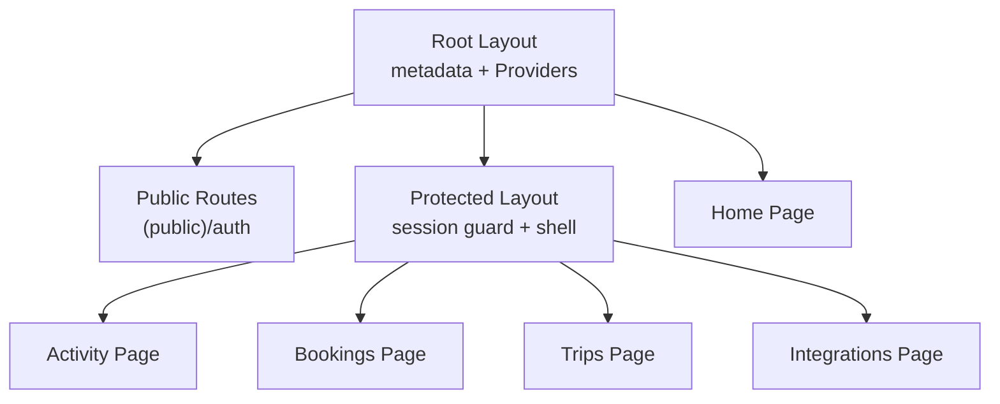
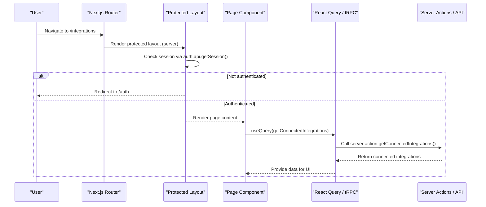
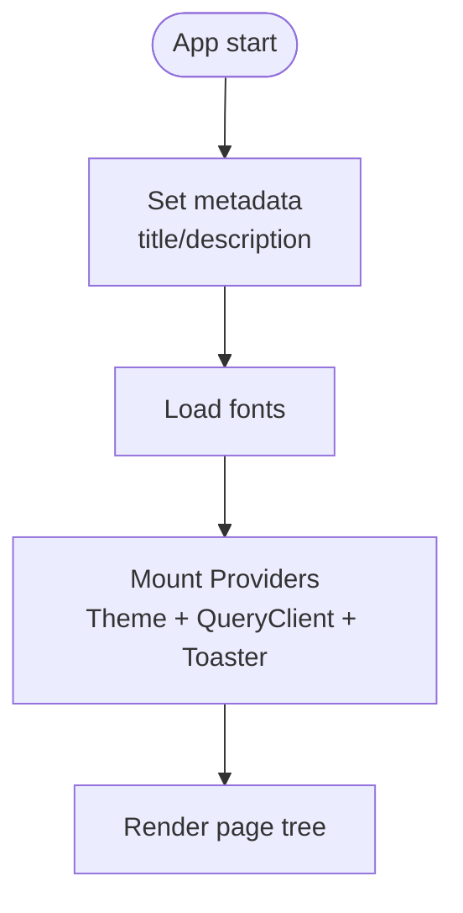
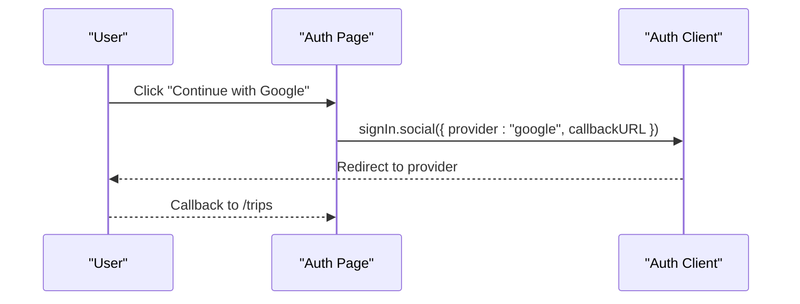
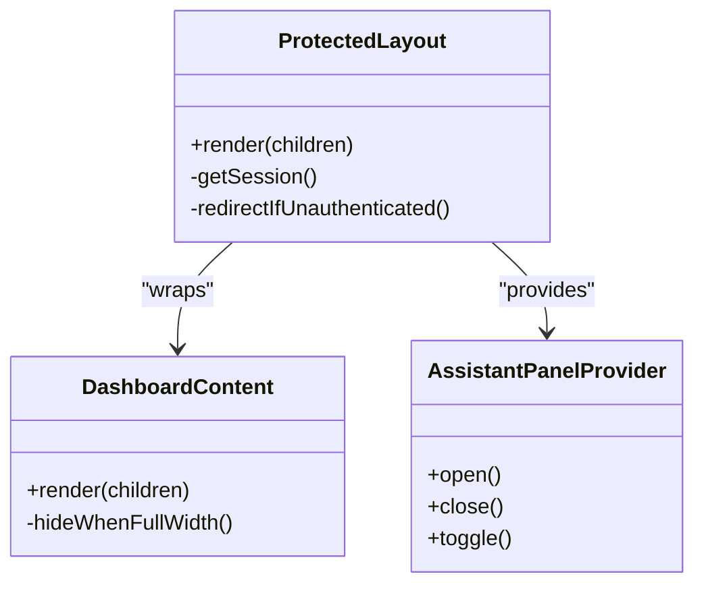
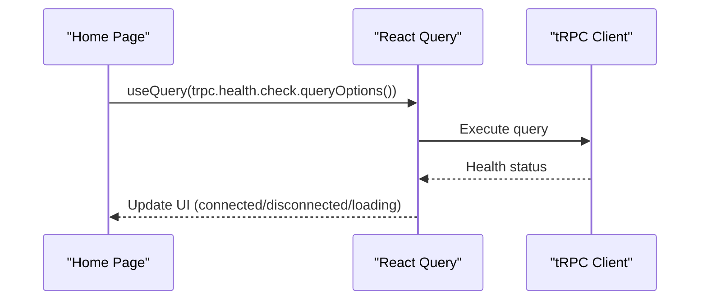
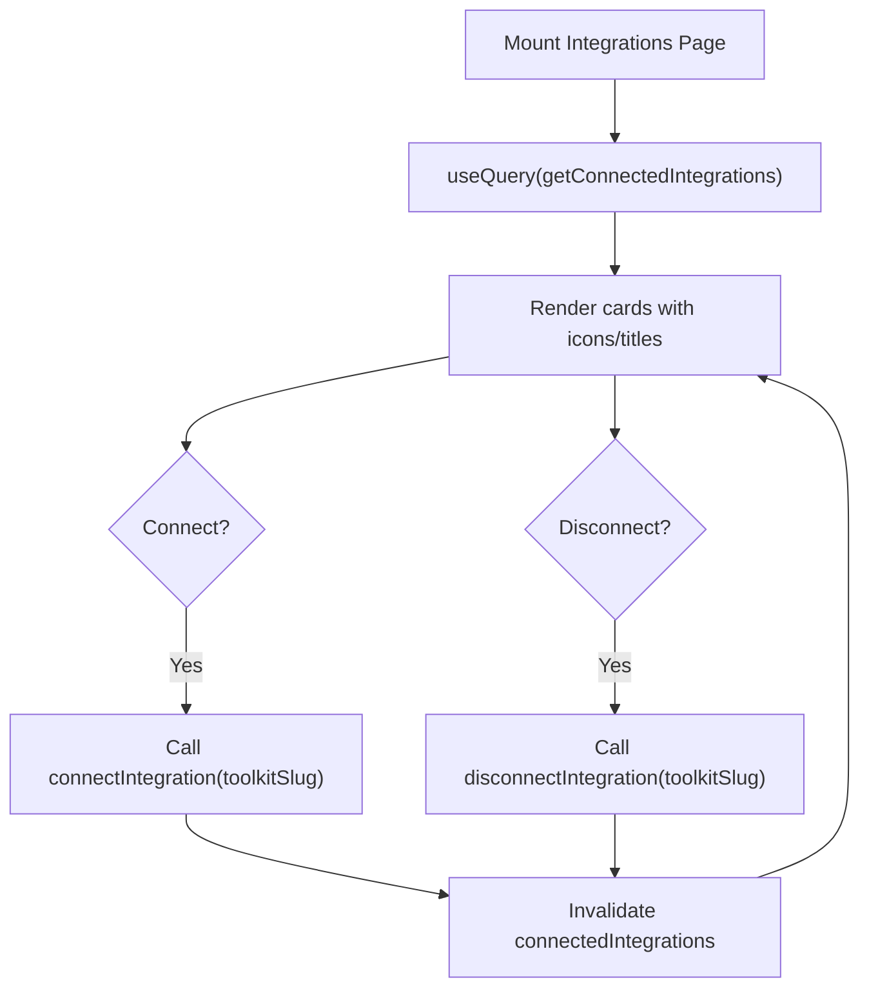
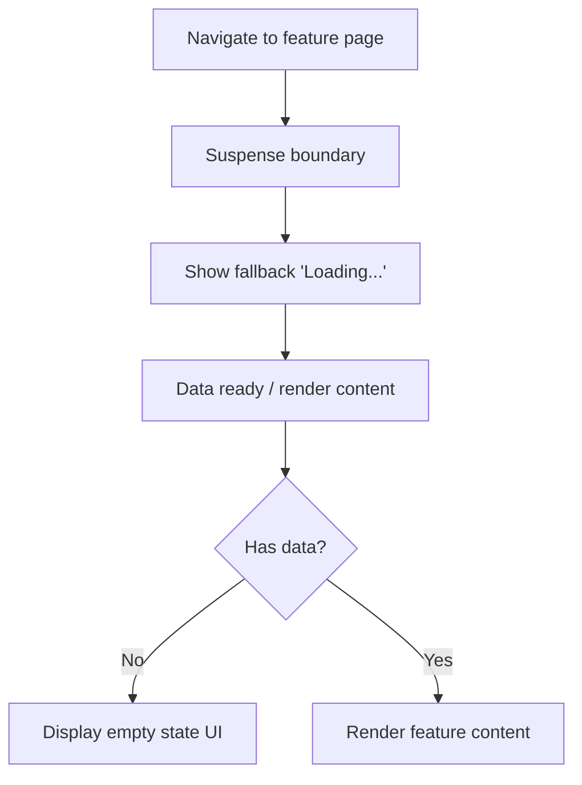
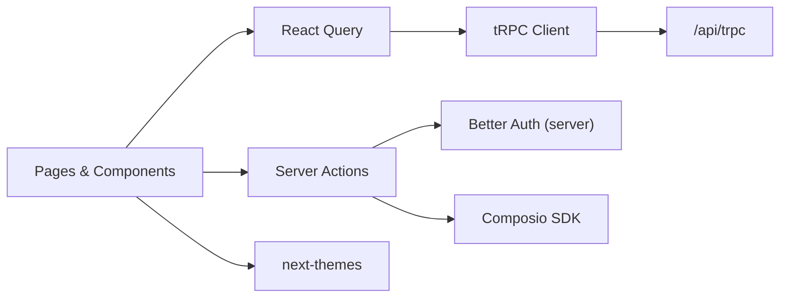

# Page Structure and Components

<cite>
**Referenced Files in This Document**
- [layout.tsx](file://apps/web/src/app/layout.tsx)
- [page.tsx](file://apps/web/src/app/page.tsx)
- [protected-layout.tsx](file://apps/web/src/app/(protected)/layout.tsx)
- [auth-page.tsx](file://apps/web/src/app/(public)/auth/page.tsx)
- [activity-page.tsx](file://apps/web/src/app/(protected)/activity/page.tsx)
- [bookings-page.tsx](file://apps/web/src/app/(protected)/bookings/page.tsx)
- [trips-page.tsx](file://apps/web/src/app/(protected)/trips/page.tsx)
- [integrations-page.tsx](file://apps/web/src/app/(protected)/integrations/page.tsx)
- [providers.tsx](file://apps/web/src/components/providers.tsx)
- [auth-component.tsx](file://apps/web/src/components/auth.tsx)
- [dashboard-content.tsx](file://apps/web/src/components/dashboard-content.tsx)
- [theme-provider.tsx](file://apps/web/src/components/theme-provider.tsx)
- [use-assistant-panel.tsx](file://apps/web/src/hooks/use-assistant-panel.tsx)
- [trpc-utils.ts](file://apps/web/src/utils/trpc.ts)
- [composio-actions.ts](file://apps/web/src/app/actions/composio.ts)
- [auth-client.ts](file://apps/web/src/lib/auth-client.ts)
- [next-config.ts](file://apps/web/src/next.config.ts)
</cite>

## Table of Contents

1. Introduction
2. Project Structure
3. Core Components
4. Architecture Overview
5. Detailed Component Analysis
6. Dependency Analysis
7. Performance Considerations
8. Troubleshooting Guide
9. Conclusion

## Introduction

This document explains the page-based routing and component organization in the Atlas web application built with Next.js App Router. It covers server-side rendering, client-side interactivity, data fetching patterns, state management, API integration, error boundaries, loading states, performance optimizations, SEO/metadata, and accessibility patterns across different page types (public auth, protected dashboard pages, and the home page).

## Project Structure

Atlas uses Next.js App Router conventions:

- Root layout defines global metadata, fonts, and providers.
- Public routes under (public) for unauthenticated flows like authentication.
- Protected routes under (protected) guarded by a server-side session check that redirects to login if needed.
- Feature pages are colocated with their UI components and hooks.

**Diagram sources**

- [layout.tsx:21-46](file://apps/web/src/app/layout.tsx#L21-L46)
- [protected-layout.tsx:22-65](<file://apps/web/src/app/(protected)/layout.tsx#L22-L65>)
- [auth-page.tsx:1-8](<file://apps/web/src/app/(public)/auth/page.tsx#L1-L8>)
- [activity-page.tsx:11-29](<file://apps/web/src/app/(protected)/activity/page.tsx#L11-L29>)
- [bookings-page.tsx:11-29](<file://apps/web/src/app/(protected)/bookings/page.tsx#L11-L29>)
- [trips-page.tsx:11-29](<file://apps/web/src/app/(protected)/trips/page.tsx#L11-L29>)
- [integrations-page.tsx:74-150](<file://apps/web/src/app/(protected)/integrations/page.tsx#L74-L150>)
- [page.tsx:8-38](file://apps/web/src/app/page.tsx#L8-L38)

**Section sources**

- [layout.tsx:21-46](file://apps/web/src/app/layout.tsx#L21-L46)
- [protected-layout.tsx:22-65](<file://apps/web/src/app/(protected)/layout.tsx#L22-L65>)

## Core Components

- Root Providers: Theme provider, React Query client, and toast container are mounted at the root level to be available app-wide.
- Protected Shell: The protected layout enforces authentication on the server and renders a consistent sidebar/header/content area.
- Auth Flow: Client-side sign-in via Better Auth with social providers; redirects to protected routes after successful login.
- Data Fetching: tRPC client configured with React Query for typed, cached queries; server actions used for mutations requiring server context.
- Assistant Panel: Context-driven panel state persisted to localStorage and coordinated with the app sidebar.

**Section sources**

- [providers.tsx:11-26](file://apps/web/src/components/providers.tsx#L11-L26)
- [protected-layout.tsx:22-65](<file://apps/web/src/app/(protected)/layout.tsx#L22-L65>)
- [auth-component.tsx:22-68](file://apps/web/src/components/auth.tsx#L22-L68)
- [trpc-utils.ts:7-39](file://apps/web/src/utils/trpc.ts#L7-L39)
- [use-assistant-panel.tsx:67-151](file://apps/web/src/hooks/use-assistant-panel.tsx#L67-L151)

## Architecture Overview

The application combines server-rendered layouts with client components for interactivity:

- Server components handle route-level guards and initial data where appropriate.
- Client components manage user interactions, local state, and fetches via React Query.
- tRPC provides type-safe API calls to backend routers.
- Server actions encapsulate authenticated operations and external integrations.

**Diagram sources**

- [protected-layout.tsx:22-33](<file://apps/web/src/app/(protected)/layout.tsx#L22-L33>)
- [integrations-page.tsx:74-81](<file://apps/web/src/app/(protected)/integrations/page.tsx#L74-L81>)
- [composio-actions.ts:63-84](file://apps/web/src/app/actions/composio.ts#L63-L84)

## Detailed Component Analysis

### Root Layout and Global Providers

- Sets global metadata (title, description), loads fonts, and applies base styles.
- Wraps children with Providers to enable theme switching, global query caching, and toast notifications.

**Diagram sources**

- [layout.tsx:21-46](file://apps/web/src/app/layout.tsx#L21-L46)
- [providers.tsx:11-26](file://apps/web/src/components/providers.tsx#L11-L26)

**Section sources**

- [layout.tsx:21-46](file://apps/web/src/app/layout.tsx#L21-L46)
- [providers.tsx:11-26](file://apps/web/src/components/providers.tsx#L11-L26)

### Authentication Page (Public)

- Renders a client component that offers Google and Telegram sign-in options.
- Uses a client-side auth client to initiate OAuth flows and redirect to a protected route upon success.
- Shows a loader while session status is pending.

**Diagram sources**

- [auth-page.tsx:1-8](<file://apps/web/src/app/(public)/auth/page.tsx#L1-L8>)
- [auth-component.tsx:9-20](file://apps/web/src/components/auth.tsx#L9-L20)
- [auth-client.ts:5-7](file://apps/web/src/lib/auth-client.ts#L5-L7)

**Section sources**

- [auth-page.tsx:1-8](<file://apps/web/src/app/(public)/auth/page.tsx#L1-L8>)
- [auth-component.tsx:22-68](file://apps/web/src/components/auth.tsx#L22-L68)
- [auth-client.ts:5-7](file://apps/web/src/lib/auth-client.ts#L5-L7)

### Protected Layout and Shell

- Server-side session check; redirects unauthenticated users to /auth.
- Provides a consistent shell: sidebar, header, mode toggle, agent button, assistant panel, and content area.
- Uses a context provider to coordinate assistant panel state with the sidebar.

**Diagram sources**

- [protected-layout.tsx:22-65](<file://apps/web/src/app/(protected)/layout.tsx#L22-L65>)
- [dashboard-content.tsx:5-17](file://apps/web/src/components/dashboard-content.tsx#L5-L17)
- [use-assistant-panel.tsx:67-151](file://apps/web/src/hooks/use-assistant-panel.tsx#L67-L151)

**Section sources**

- [protected-layout.tsx:22-65](<file://apps/web/src/app/(protected)/layout.tsx#L22-L65>)
- [dashboard-content.tsx:5-17](file://apps/web/src/components/dashboard-content.tsx#L5-L17)
- [use-assistant-panel.tsx:169-234](file://apps/web/src/hooks/use-assistant-panel.tsx#L169-L234)

### Home Page (Client)

- Demonstrates a client component using React Query to call a health check endpoint via tRPC.
- Displays connection status with visual feedback and loading states.

**Diagram sources**

- [page.tsx:8-38](file://apps/web/src/app/page.tsx#L8-L38)
- [trpc-utils.ts:22-39](file://apps/web/src/utils/trpc.ts#L22-L39)

**Section sources**

- [page.tsx:8-38](file://apps/web/src/app/page.tsx#L8-L38)
- [trpc-utils.ts:7-39](file://apps/web/src/utils/trpc.ts#L7-L39)

### Integrations Page (Client)

- Lists available integrations and shows connect/disconnect actions.
- Fetches connected integrations via a server action and invalidates cache on changes.
- Coordinates layout with the assistant panel to adjust grid columns when full-width.

**Diagram sources**

- [integrations-page.tsx:74-150](<file://apps/web/src/app/(protected)/integrations/page.tsx#L74-L150>)
- [composio-actions.ts:13-33](file://apps/web/src/app/actions/composio.ts#L13-L33)
- [composio-actions.ts:35-61](file://apps/web/src/app/actions/composio.ts#L35-L61)
- [composio-actions.ts:63-84](file://apps/web/src/app/actions/composio.ts#L63-L84)

**Section sources**

- [integrations-page.tsx:74-150](<file://apps/web/src/app/(protected)/integrations/page.tsx#L74-L150>)
- [composio-actions.ts:13-84](file://apps/web/src/app/actions/composio.ts#L13-L84)

### Activity, Bookings, Trips Pages

- Use Suspense boundaries to provide loading fallbacks during data loading or code splitting.
- Present empty states with accessible headings and descriptions to guide users.

**Diagram sources**

- [activity-page.tsx:11-29](<file://apps/web/src/app/(protected)/activity/page.tsx#L11-L29>)
- [bookings-page.tsx:11-29](<file://apps/web/src/app/(protected)/bookings/page.tsx#L11-L29>)
- [trips-page.tsx:11-29](<file://apps/web/src/app/(protected)/trips/page.tsx#L11-L29>)

**Section sources**

- [activity-page.tsx:11-29](<file://apps/web/src/app/(protected)/activity/page.tsx#L11-L29>)
- [bookings-page.tsx:11-29](<file://apps/web/src/app/(protected)/bookings/page.tsx#L11-L29>)
- [trips-page.tsx:11-29](<file://apps/web/src/app/(protected)/trips/page.tsx#L11-L29>)

## Dependency Analysis

Key runtime dependencies and their roles:

- React Query: Caches and manages server state; centralizes error handling and retries.
- tRPC: Type-safe client connecting to backend routers over HTTP batch link.
- Better Auth: Client plugins for Telegram and last-login method tracking; server-side session checks in layouts and actions.
- Composio: External integration service accessed via server actions for connect/disconnect and listing accounts.
- next-themes: Theme persistence and system preference detection.

**Diagram sources**

- [trpc-utils.ts:7-39](file://apps/web/src/utils/trpc.ts#L7-L39)
- [composio-actions.ts:1-84](file://apps/web/src/app/actions/composio.ts#L1-L84)
- [providers.tsx:11-26](file://apps/web/src/components/providers.tsx#L11-L26)
- [theme-provider.tsx:6-11](file://apps/web/src/components/theme-provider.tsx#L6-L11)

**Section sources**

- [trpc-utils.ts:7-39](file://apps/web/src/utils/trpc.ts#L7-L39)
- [composio-actions.ts:1-84](file://apps/web/src/app/actions/composio.ts#L1-L84)
- [providers.tsx:11-26](file://apps/web/src/components/providers.tsx#L11-L26)
- [theme-provider.tsx:6-11](file://apps/web/src/components/theme-provider.tsx#L6-L11)

## Performance Considerations

- Server-side rendering and route-level guards reduce unnecessary client work and protect sensitive routes.
- React Query caching and deduplication minimize redundant network requests; errors surface with retry actions.
- Suspense boundaries provide fast perceived loading and allow progressive rendering.
- Next.js configuration enables component caching, partial prefetching, and React Compiler for optimized builds.
- Image remote patterns restrict allowed domains to improve security and performance.

[No sources needed since this section provides general guidance]

## Troubleshooting Guide

- Unauthenticated access to protected routes: The protected layout redirects to /auth when no session is present. Verify server headers and session cookies.
- Integration connect/disconnect failures: Server actions validate sessions and throw unauthorized errors if missing; ensure proper authentication flow before invoking actions.
- Query errors: React Query’s onError handler displays a toast with a retry action; inspect tRPC responses and server logs for details.
- Assistant panel state: State persists to localStorage; if storage is unavailable, state remains in-memory only.

**Section sources**

- [protected-layout.tsx:27-33](<file://apps/web/src/app/(protected)/layout.tsx#L27-L33>)
- [composio-actions.ts:13-20](file://apps/web/src/app/actions/composio.ts#L13-L20)
- [composio-actions.ts:35-42](file://apps/web/src/app/actions/composio.ts#L35-L42)
- [trpc-utils.ts:7-20](file://apps/web/src/utils/trpc.ts#L7-L20)

## Conclusion

Atlas employs a clear separation between server-rendered layouts and client-driven features. Protected routes are enforced server-side, while interactive pages leverage React Query and tRPC for robust data handling. Consistent shells, Suspense boundaries, and global providers ensure reliable UX, performance, and maintainability. The architecture supports scalable additions of new pages and integrations with well-defined boundaries and reusable patterns.
